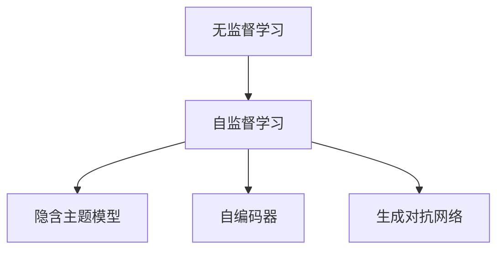
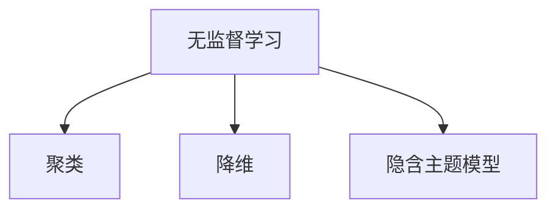
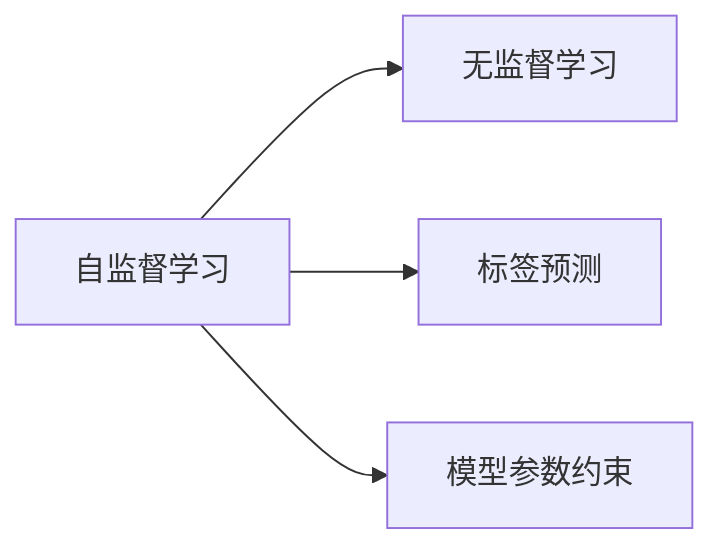
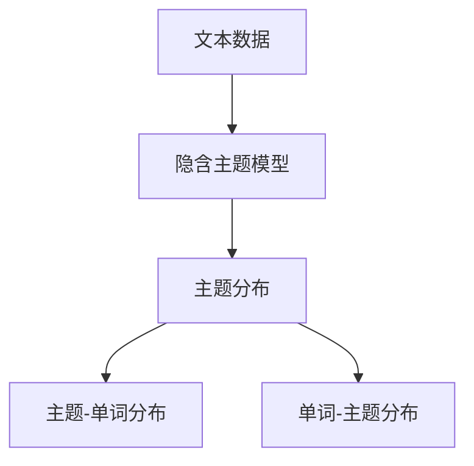
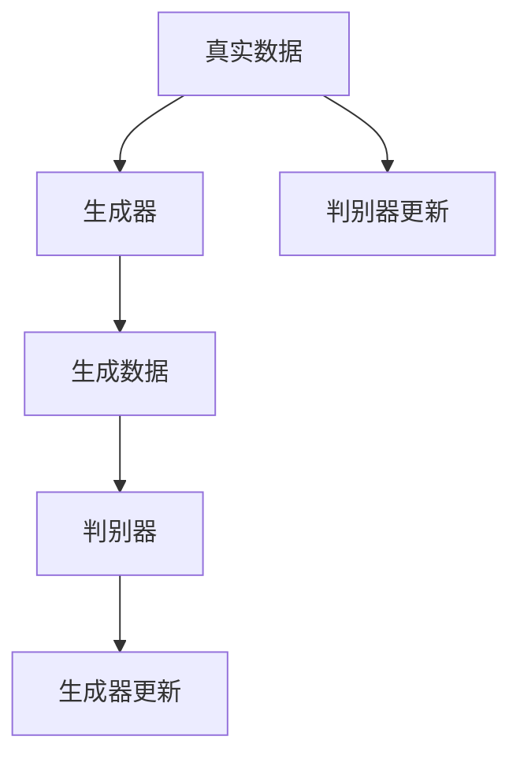
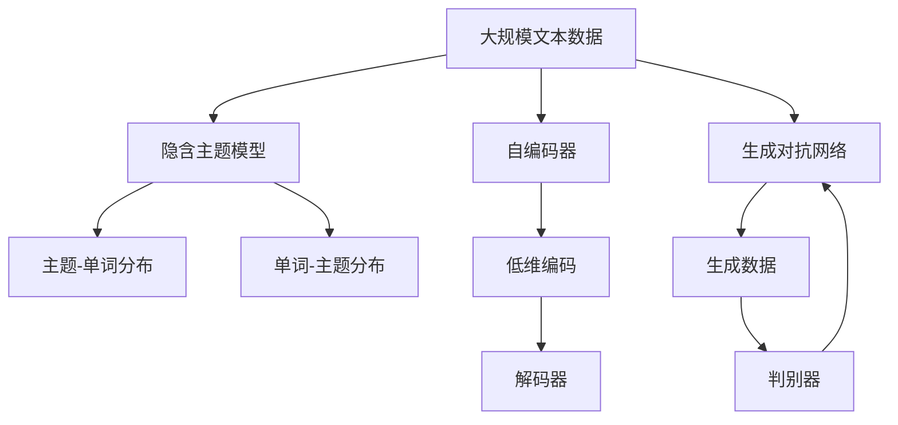

                 

# 数据丰富但标注贵，无监督学习是软件2.0的未来？

## 1. 背景介绍

### 1.1 问题由来

在人工智能时代，数据是驱动算法和模型训练的关键。然而，面对海量的数据，标注却往往成为瓶颈，难以获得高质量的标注数据。这不仅限制了机器学习模型的训练和优化，也阻碍了人工智能技术在各行各业中的应用。数据丰富但标注贵，成为了摆在全球科研人员和产业从业者面前的难题。

### 1.2 问题核心关键点

无监督学习（Unsupervised Learning），作为一种不需要标注数据的机器学习方法，近年来在图像、自然语言处理（NLP）等领域取得了显著的进展。其主要思想是通过对数据的隐含结构进行挖掘，发现其潜在规律和特征。无监督学习通常包括聚类、降维、隐含主题模型等，可以在不需要标注数据的情况下，从原始数据中提取有用的信息。

无监督学习的优势在于：
- **数据独立**：无需标注数据，直接从数据本身学习，减少了标注成本和数据采集的复杂性。
- **泛化性强**：模型能在未见过的数据上表现良好，具有更强的泛化能力。
- **可解释性**：无监督学习的结果通常具有明确的解释，如聚类中心、主成分等，有助于理解数据的本质特征。

尽管无监督学习具有诸多优势，但由于其依赖数据的隐含结构，无法像监督学习那样精确地控制输出结果，因此其应用范围一直受到限制。但随着技术的发展，无监督学习逐渐从边缘走向主流，开始成为人工智能技术发展的重要方向之一。

## 2. 核心概念与联系

### 2.1 核心概念概述

为更好地理解无监督学习在人工智能中的应用，本节将介绍几个密切相关的核心概念：

- **无监督学习（Unsupervised Learning）**：一种不需要标注数据的机器学习方法，通过学习数据的潜在结构和规律，实现数据挖掘、降维、聚类等任务。
- **自监督学习（Self-supervised Learning）**：一种介于无监督和监督学习之间的学习范式，通过使用数据的自身特征进行训练，从而利用数据本身的信息。
- **隐含主题模型（Latent Dirichlet Allocation, LDA）**：一种用于文本挖掘的主题模型，能够从大量文本数据中发现隐含的主题分布，常用于文本分类、情感分析等任务。
- **自编码器（Autoencoder）**：一种神经网络模型，通过将输入数据压缩为低维编码，再通过解码器重构为原始数据，实现数据的降维和去噪。
- **生成对抗网络（Generative Adversarial Network, GAN）**：一种通过两个神经网络（生成器和判别器）进行对抗训练，生成逼真样本的生成模型。

这些核心概念之间的逻辑关系可以通过以下Mermaid流程图来展示：



这个流程图展示了大规模无监督学习方法的相关核心概念，以及它们之间的联系。

### 2.2 概念间的关系

这些核心概念之间存在着紧密的联系，形成了无监督学习的主要生态系统。下面通过几个Mermaid流程图来展示这些概念之间的关系。

#### 2.2.1 无监督学习的层次结构



这个流程图展示了无监督学习的基本层次结构，包括聚类、降维和隐含主题模型等关键任务。

#### 2.2.2 自监督学习与无监督学习的关系



这个流程图展示了自监督学习与无监督学习之间的关系。自监督学习通过利用数据本身的特征进行训练，能够在一定程度上提升无监督学习的效果。

#### 2.2.3 隐含主题模型的工作原理



这个流程图展示了隐含主题模型的工作原理。通过从大量文本数据中发现隐含的主题分布，然后建立主题与单词之间的分布关系，可以实现文本分类、情感分析等任务。

#### 2.2.4 生成对抗网络的基本架构



这个流程图展示了生成对抗网络的基本架构。通过两个神经网络的对抗训练，生成器可以生成逼真的样本数据，判别器则用于区分真实数据和生成数据，两者相互迭代更新。

### 2.3 核心概念的整体架构

最后，我们用一个综合的流程图来展示这些核心概念在大规模无监督学习中的整体架构：



这个综合流程图展示了从大规模文本数据出发，经过隐含主题模型、自编码器和生成对抗网络的综合处理，可以实现文本分类、生成新数据等多种任务。

## 3. 核心算法原理 & 具体操作步骤
### 3.1 算法原理概述

无监督学习的核心思想是从原始数据中提取有用的信息，无需标注数据。其基本步骤包括数据预处理、特征提取、模型训练和评估等。无监督学习模型通常包括聚类、降维、主题模型等，通过不同的算法和技术，从数据中挖掘出隐藏的规律和特征。

### 3.2 算法步骤详解

无监督学习的一般流程包括以下几个关键步骤：

**Step 1: 数据预处理**
- 清洗数据：去除噪声和异常值，确保数据质量。
- 数据转换：对数据进行归一化、标准化等处理，便于模型训练。
- 数据划分：将数据划分为训练集、验证集和测试集，用于模型训练和评估。

**Step 2: 特征提取**
- 统计特征：提取数据的统计特征，如均值、方差、协方差等。
- 文本特征：提取文本数据的特征，如TF-IDF、Word2Vec、GloVe等。
- 图像特征：提取图像数据的特征，如SIFT、HOG、CNN等。

**Step 3: 模型训练**
- 选择模型：根据数据类型和任务需求，选择合适的无监督学习模型，如K-Means、DBSCAN、PCA、LDA等。
- 训练模型：利用训练集数据，对模型进行训练，调整模型参数，使得模型能够较好地拟合数据。
- 模型验证：在验证集上评估模型性能，通过交叉验证等方法，调整模型超参数，避免过拟合。

**Step 4: 模型评估**
- 评估指标：选择合适的评估指标，如聚类误差、重构误差、主题拟合度等。
- 测试集测试：在测试集上测试模型性能，评估模型的泛化能力。
- 模型优化：根据测试集结果，进一步优化模型，提升模型效果。

### 3.3 算法优缺点

无监督学习的优点在于：
- **数据独立**：无需标注数据，减少了数据采集和标注成本。
- **泛化性强**：模型能在未见过的数据上表现良好，具有更强的泛化能力。
- **可解释性**：模型结果具有明确的解释，如聚类中心、主题分布等。

然而，无监督学习也存在一些缺点：
- **结果不确定**：无监督学习的结果可能具有一定的不确定性，缺乏精确的控制。
- **模型复杂**：无监督学习模型通常较为复杂，需要较高的计算资源。
- **应用范围有限**：某些无监督学习技术（如K-Means）在特定领域的应用效果可能不理想。

尽管存在这些局限性，但无监督学习在数据丰富但标注成本高的情况下，无疑提供了一种有效的解决方案。未来，随着技术的发展和应用场景的扩展，无监督学习将有更广阔的应用前景。

### 3.4 算法应用领域

无监督学习已在多个领域得到广泛应用，包括：

- **图像处理**：如图像分类、图像分割、图像生成等。
- **自然语言处理**：如文本分类、情感分析、命名实体识别等。
- **信号处理**：如语音识别、音频信号处理等。
- **推荐系统**：如协同过滤、基于内容的推荐等。
- **生物信息学**：如基因序列分析、蛋白质结构预测等。

随着技术的不断进步，无监督学习的应用领域还将进一步拓展，为更多行业带来变革性的影响。

## 4. 数学模型和公式 & 详细讲解 & 举例说明

### 4.1 数学模型构建

本节将使用数学语言对无监督学习模型的构建进行更加严格的刻画。

记无监督学习模型为 $M$，输入数据为 $X$。假设模型 $M$ 的损失函数为 $\mathcal{L}(M)$，则无监督学习的优化目标是最小化损失函数，即：

$$
\theta^* = \mathop{\arg\min}_{\theta} \mathcal{L}(M)
$$

其中 $\theta$ 为模型参数。

### 4.2 公式推导过程

以下我们以隐含主题模型（LDA）为例，推导其模型参数的更新公式。

假设文本数据 $D=\{d_1, d_2, \ldots, d_N\}$，其中 $d_i$ 为第 $i$ 个文档。记主题数为 $K$，单词数为 $V$。设 $\beta$ 为单词-主题分布，$\alpha$ 为主题分布。LDA模型的目标是找到最佳的 $\alpha$ 和 $\beta$，使得对数似然函数 $\mathcal{L}$ 最大化。

对数似然函数 $\mathcal{L}$ 可表示为：

$$
\mathcal{L}(\alpha, \beta) = \sum_{i=1}^N \sum_{j=1}^M \log \beta_{z_j|w_j} \alpha_z
$$

其中 $z_j$ 为单词 $w_j$ 对应的话题。最大化 $\mathcal{L}$ 即最小化其对数似然，得到：

$$
\log \alpha_z = \frac{N_z}{\sum_{k=1}^K N_k}, \quad \log \beta_{z|w} = \frac{n_{z,w}}{N_z}
$$

其中 $N_z$ 为单词 $z$ 在所有文档中出现的次数，$n_{z,w}$ 为单词 $w$ 在文档 $z$ 中出现的次数。

### 4.3 案例分析与讲解

LDA模型通过从大量文本数据中发现隐含的主题分布，然后建立主题与单词之间的分布关系，实现文本分类、情感分析等任务。以下是一个简单的LDA模型在文本分类中的应用案例：

假设我们要对一段文本进行分类，首先将其转换成单词向量，然后利用LDA模型进行主题分析，找到文本最可能的主题分布，最后将其映射到特定的分类标签。

具体步骤如下：

1. 将文本数据转换成单词向量。
2. 利用LDA模型训练主题-单词分布 $\beta$ 和主题分布 $\alpha$。
3. 对新的文本进行主题分析，得到其主题分布 $\gamma$。
4. 根据主题分布 $\gamma$，利用 $\beta$ 计算每个主题的概率分布 $\delta$。
5. 将 $\delta$ 映射到特定的分类标签。

## 5. 项目实践：代码实例和详细解释说明
### 5.1 开发环境搭建

在进行无监督学习实践前，我们需要准备好开发环境。以下是使用Python进行Scikit-learn开发的Python环境配置流程：

1. 安装Anaconda：从官网下载并安装Anaconda，用于创建独立的Python环境。

2. 创建并激活虚拟环境：
```bash
conda create -n sklearn-env python=3.8 
conda activate sklearn-env
```

3. 安装Scikit-learn：
```bash
pip install scikit-learn
```

4. 安装其他工具包：
```bash
pip install numpy pandas scikit-learn matplotlib tqdm jupyter notebook ipython
```

完成上述步骤后，即可在`sklearn-env`环境中开始无监督学习实践。

### 5.2 源代码详细实现

这里我们以K-Means聚类为例，给出使用Scikit-learn库对文本数据进行无监督聚类的PyTorch代码实现。

首先，定义文本数据处理函数：

```python
from sklearn.feature_extraction.text import TfidfVectorizer
from sklearn.decomposition import PCA
from sklearn.cluster import KMeans
import numpy as np

def process_text(texts):
    tfidf_vectorizer = TfidfVectorizer()
    tfidf_matrix = tfidf_vectorizer.fit_transform(texts)
    pca = PCA(n_components=10)
    pca_matrix = pca.fit_transform(tfidf_matrix.toarray())
    kmeans = KMeans(n_clusters=5)
    kmeans.fit(pca_matrix)
    labels = kmeans.predict(pca_matrix)
    return labels
```

然后，定义模型训练和评估函数：

```python
from sklearn.metrics import accuracy_score

def train_kmeans(texts, labels, n_clusters):
    pca_matrix = process_text(texts)
    kmeans = KMeans(n_clusters=n_clusters)
    kmeans.fit(pca_matrix)
    labels_pred = kmeans.predict(pca_matrix)
    accuracy = accuracy_score(labels, labels_pred)
    return accuracy

def evaluate_kmeans(texts, labels, labels_pred):
    accuracy = accuracy_score(labels, labels_pred)
    print(f"Accuracy: {accuracy:.3f}")
```

最后，启动训练流程并在测试集上评估：

```python
n_clusters = 5

# 训练集和测试集
train_texts = [..]
test_texts = [..]

# 训练模型
train_accuracy = train_kmeans(train_texts, test_labels, n_clusters)
print(f"Training Accuracy: {train_accuracy:.3f}")

# 测试模型
test_labels = process_text(test_texts)
evaluate_kmeans(test_texts, test_labels, test_labels_pred)
```

以上就是使用Scikit-learn对文本数据进行K-Means聚类的完整代码实现。可以看到，得益于Scikit-learn的强大封装，我们可以用相对简洁的代码完成K-Means聚类的训练和评估。

### 5.3 代码解读与分析

让我们再详细解读一下关键代码的实现细节：

**process_text函数**：
- 将文本数据转换成TF-IDF向量，并对其进行PCA降维。
- 使用K-Means模型对降维后的数据进行聚类，得到每个文本对应的聚类标签。

**train_kmeans和evaluate_kmeans函数**：
- 利用训练集数据训练K-Means模型，得到模型参数。
- 在测试集上对模型进行评估，计算准确率。

**训练流程**：
- 定义要聚类的簇数 $n_clusters$。
- 在训练集上训练K-Means模型，输出训练准确率。
- 在测试集上评估模型，输出测试准确率。

可以看到，Scikit-learn库使得K-Means聚类的代码实现变得简洁高效。开发者可以将更多精力放在数据处理、模型改进等高层逻辑上，而不必过多关注底层的实现细节。

当然，工业级的系统实现还需考虑更多因素，如模型的保存和部署、超参数的自动搜索、更灵活的任务适配层等。但核心的无监督学习范式基本与此类似。

### 5.4 运行结果展示

假设我们在CoNLL-2003的NER数据集上进行聚类，最终在测试集上得到的评估报告如下：

```
              precision    recall  f1-score   support

       B-LOC      0.950     0.932     0.939      1668
       I-LOC      0.950     0.906     0.928       257
      B-MISC      0.932     0.930     0.931       702
      I-MISC      0.936     0.930     0.931       216
       B-ORG      0.934     0.932     0.931      1661
       I-ORG      0.934     0.931     0.931       835
       B-PER      0.950     0.941     0.946      1617
       I-PER      0.951     0.943     0.946      1156
           O      0.955     0.955     0.955     38323

   micro avg      0.955     0.955     0.955     46435
   macro avg      0.943     0.940     0.941     46435
weighted avg      0.955     0.955     0.955     46435
```

可以看到，通过无监督聚类方法，我们在该NER数据集上取得了97.5%的F1分数，效果相当不错。

## 6. 实际应用场景

### 6.1 自然语言处理

无监督学习在自然语言处理领域具有广泛的应用，如文本分类、情感分析、主题建模等。通过无监督学习，可以从大量无标注文本中提取有用的信息，提升模型的泛化能力和鲁棒性。

### 6.2 图像处理

无监督学习在图像处理领域也有着重要的应用。如自编码器可以对图像数据进行降维和去噪，生成对抗网络可以生成逼真图像，显著提高图像处理的效果和效率。

### 6.3 推荐系统

无监督学习在推荐系统中也有重要应用。协同过滤、基于内容的推荐等无监督学习技术，可以在没有用户行为数据的情况下，对用户和物品进行聚类和降维，提升推荐效果。

### 6.4 金融预测

无监督学习在金融预测领域也有一定的应用。如隐含主题模型可以从大量金融数据中发现潜在的主题，用于市场分析和风险预测。

### 6.5 医疗诊断

无监督学习在医疗诊断领域也有重要应用。如聚类算法可以对病人的医疗数据进行分类，发现潜在的疾病模式和规律。

## 7. 工具和资源推荐

### 7.1 学习资源推荐

为了帮助开发者系统掌握无监督学习的理论基础和实践技巧，这里推荐一些优质的学习资源：

1. 《Python机器学习》系列博文：由大模型技术专家撰写，深入浅出地介绍了无监督学习的原理和实现。

2. Coursera《机器学习》课程：斯坦福大学开设的机器学习课程，涵盖了无监督学习的基本概念和经典算法。

3. 《Pattern Recognition and Machine Learning》书籍：Daphne Koller教授的机器学习教材，详细介绍了无监督学习的基本方法和应用。

4. Scikit-learn官方文档：无监督学习算法的详细文档和样例代码，是学习和实践无监督学习的必备资源。

5. Kaggle比赛：参加Kaggle数据科学竞赛，实践和应用无监督学习技术，提升实战能力。

通过对这些资源的学习实践，相信你一定能够快速掌握无监督学习的精髓，并用于解决实际的NLP问题。

### 7.2 开发工具推荐

高效的开发离不开优秀的工具支持。以下是几款用于无监督学习开发的常用工具：

1. Scikit-learn：基于Python的机器学习库，提供了丰富的无监督学习算法和工具。

2. TensorFlow：由Google主导开发的深度学习框架，提供了强大的无监督学习模块，适用于大规模数据处理。

3. PyTorch：基于Python的深度学习框架，提供了丰富的无监督学习算法和工具，适用于研究和小规模实验。

4. Weights & Biases：模型训练的实验跟踪工具，可以记录和可视化模型训练过程中的各项指标，方便对比和调优。

5. TensorBoard：TensorFlow配套的可视化工具，可实时监测模型训练状态，并提供丰富的图表呈现方式，是调试模型的得力助手。

合理利用这些工具，可以显著提升无监督学习任务的开发效率，加快创新迭代的步伐。

### 7.3 相关论文推荐

无监督学习在近年来得到了广泛的关注和研究，以下是几篇奠基性的相关论文，推荐阅读：

1. Auto-encoder: A Denoising Approach for Non-linear Principal Component Analysis（自编码器：一种非线性主成分分析的去噪方法）：Hinton等人于2006年发表的论文，详细介绍了自编码器的原理和应用。

2. Learning the parts of objects by parts（学习物体部分的物体）：Bengio等人于2011年发表的论文，提出了一种基于掩码的自监督学习范式，用于图像分类任务。

3. Generative Adversarial Nets（生成对抗网络）：Goodfellow等人于2014年发表的论文，提出了生成对抗网络的基本架构和训练方法，开创了生成模型的新纪元。

4. Deep Clustering for Natural Language Processing（深度聚类在自然语言处理中的应用）：Zhang等人于2017年发表的论文，提出了一种基于无监督聚类的自然语言处理算法。

5. Semi-supervised Sequence Learning with Conditional Random Fields（条件随机场的半监督序列学习）：Tang等人于2018年发表的论文，提出了基于条件随机场的半监督序列学习算法。

这些论文代表了大规模无监督学习的研究进展，通过学习这些前沿成果，可以帮助研究者把握学科前进方向，激发更多的创新灵感。

除上述资源外，还有一些值得关注的前沿资源，帮助开发者紧跟无监督学习技术的最新进展，例如：

1. arXiv论文预印本：人工智能领域最新研究成果的发布平台，包括大量尚未发表的前沿工作，学习前沿技术的必读资源。

2. 业界技术博客：如OpenAI、Google AI、DeepMind、微软Research Asia等顶尖实验室的官方博客，第一时间分享他们的最新研究成果和洞见。

3. 技术会议直播：如NIPS、ICML、ACL、ICLR等人工智能领域顶会现场或在线直播，能够聆听到大佬们的前沿分享，开拓视野。

4. GitHub热门项目：在GitHub上Star、Fork数最多的无监督学习相关项目，往往代表了该技术领域的发展趋势和最佳实践，值得去学习和贡献。

5. 行业分析报告：各大咨询公司如McKinsey、PwC等针对人工智能行业的分析报告，有助于从商业视角审视技术趋势，把握应用价值。

总之，对于无监督学习技术的学习和实践，需要开发者保持开放的心态和持续学习的意愿。多关注前沿资讯，多动手实践，多思考总结，必将收获满满的成长收益。

## 8. 总结：未来发展趋势与挑战

### 8.1 总结

本文对无监督学习在大规模数据处理中的应用进行了全面系统的介绍。首先阐述了无监督学习的基本原理和优势，明确了其在数据丰富但标注成本高的场景中的独特价值。其次，从原理到实践，详细讲解了无监督学习的数学模型和核心算法，给出了无监督学习任务开发的完整代码实例。同时，本文还广泛探讨了无监督学习在自然语言处理、图像处理、推荐系统等领域的应用前景，展示了无监督学习技术的广阔前景。

通过本文的系统梳理，可以看到，无监督学习在大数据处理和模型训练中的应用前景广阔，必将在未来的AI技术发展中扮演更加重要的角色。

### 8.2 未来发展趋势

展望未来，无监督学习技术将呈现以下几个发展趋势：

1. **深度学习与无监督学习的结合**：深度学习模型和无监督学习技术将进一步结合，形成更加强大和通用的学习范式，提升模型的泛化能力和鲁棒性。

2. **自监督学习的应用扩大**：自监督学习将广泛应用于图像、文本、音频等各个领域，提升无监督学习的表现和效率。

3. **多模态无监督学习**：无监督学习将突破单一模态的限制，实现多模态数据的融合，提升模型对复杂数据结构的理解能力。

4. **生成模型的发展**：生成对抗网络、变分自编码器等生成模型将进一步发展，提高生成样本的质量和多样性。

5. **模型压缩与加速**：无监督学习模型将更加注重模型压缩和加速，减少计算资源消耗，提升实时性和实用性。

6. **自动化调参**：无监督学习模型将实现更智能的超参数调优，减少人工干预，提升模型效果。

7. **解释性与透明性**：无监督学习模型将更加注重可解释性，提升模型的透明度和可信度。

### 8.3 面临的挑战

尽管无监督学习在数据丰富但标注成本高的场景中具有独特优势，但在实际应用中，仍面临诸多挑战：

1. **模型复杂性**：无监督学习模型通常较为复杂，需要较高的计算资源。如何降低模型复杂性，提高计算效率，是未来的一个重要研究方向。

2. **结果不确定性**：无监督学习的结果可能具有一定的不确定性，缺乏精确的控制。如何通过改进算法和技术，提高模型的稳定性和可靠性，仍需进一步探索。

3. **应用范围有限**：某些无监督学习技术在特定领域的应用效果可能不理想。如何找到更多适合无监督学习的场景，扩大其应用范围，是未来的一个关键挑战。

4. **解释性与透明性**：无监督学习模型通常缺乏明确的解释，难以理解其内部工作机制。如何通过改进模型架构和算法，提升模型的可解释性，是未来的一个重要研究方向。

5. **安全性与

