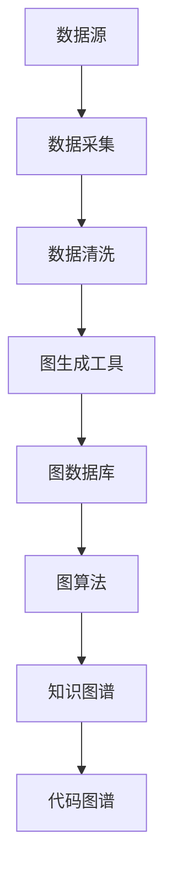
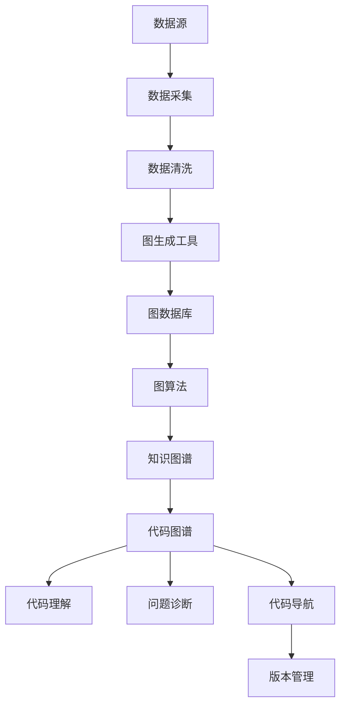

                 

## 1. 背景介绍

### 1.1 问题由来
在软件工程领域，知识和数据的管理一直是企业IT架构中至关重要的一部分。从早期的软件需求文档、设计文档、代码，到现代的云资源配置、微服务依赖、API文档等，各种数据类型的增加使得知识管理的复杂度大大提升。同时，企业对知识的获取、更新、共享的需求日益增长，如何构建一个高效、智能的知识管理系统，成为IT架构演进的重要课题。

近年来，随着人工智能技术的飞速发展，数据图谱（Data Graphs）作为一种新的知识管理工具逐渐进入人们的视野。数据图谱通过构建软件资产之间的关联关系，辅助企业在复杂的软件生态系统中进行知识检索、代码理解、问题诊断等任务。本文将深入探讨数据图谱的核心原理、实现方法以及它在软件2.0时代的应用前景。

### 1.2 问题核心关键点
数据图谱的核心思想是利用图结构对软件资产进行关联建模，通过图数据结构和图算法对知识进行深度分析和利用。其核心组成包括：

- **节点(Node)**：代表软件资产，如代码文件、类、函数、API等。
- **边(Edge)**：代表资产之间的关联关系，如依赖、继承、调用关系等。
- **属性(Attribute)**：用于描述节点和边的详细信息，如文件名、类名、方法名、调用关系类型等。
- **图算法**：包括搜索、推荐、聚类等算法，用于对图数据进行深度分析和处理。

数据图谱通过对软件资产的关联建模，实现了知识的高效存储、检索、分析和利用，极大地提升了软件理解和管理的效率。

### 1.3 问题研究意义
构建高效的数据图谱系统，对于提升软件工程的质量、效率和可维护性具有重要意义：

- **代码理解**：通过图谱可以快速定位代码依赖关系，理解代码结构，辅助开发人员编写和维护复杂代码。
- **问题诊断**：在复杂软件系统中，数据图谱能够帮助开发人员快速定位问题发生的位置，提供系统的调试和故障排除支持。
- **知识共享**：通过图谱，开发人员能够共享和利用组织内的知识资产，加速知识传播和团队协作。
- **软件演进**：数据图谱能够记录软件的历史演进过程，帮助团队追踪软件的变化和演化路径。
- **项目管理和追踪**：通过图谱能够跟踪项目进度、版本管理、依赖关系变化等，实现对软件项目的全面管理。

因此，构建高效的数据图谱系统，是提升软件工程实践的重要手段。

## 2. 核心概念与联系

### 2.1 核心概念概述

为更好地理解数据图谱的核心原理和架构，本节将介绍几个关键概念：

- **节点和边**：构建数据图谱的基本元素。节点代表软件资产，边代表资产之间的关联关系。
- **图数据库**：用于存储和管理图数据的系统，支持高效的图查询和分析。
- **图算法**：包括搜索、推荐、聚类等算法，用于对图数据进行深度分析和处理。
- **知识图谱(KG)**：通过语义关联构建的知识库，用于语义搜索、知识关联等。
- **代码图谱**：针对代码数据的特殊图谱，用于代码理解、问题诊断等。

这些核心概念之间的逻辑关系可以通过以下Mermaid流程图来展示：

```mermaid
graph LR
    A[节点(Node)] --> B[边(Edge)]
    A --> C[图数据库(Graph Database)]
    B --> C
    C --> D[图算法]
    A --> E[知识图谱(KG)]
    B --> E
    D --> E
    E --> F[代码图谱]
    F --> G[代码理解]
    G --> H[问题诊断]
    F --> I[代码导航]
    I --> J[版本管理]
    H --> J
    A --> K[图数据生成工具]
    K --> C
```

这个流程图展示了大语言模型的核心概念及其之间的关系：

1. 节点和边作为数据图谱的基本组成元素，通过图数据库进行存储。
2. 图算法对图数据进行深度分析，帮助用户理解数据图谱的结构和关系。
3. 知识图谱通过语义关联，提供语义搜索、知识关联等高级功能。
4. 代码图谱针对代码数据进行专门设计，支持代码理解、问题诊断等任务。
5. 数据图谱生成工具用于自动化构建图数据，支持从代码、文档、配置等数据源中提取关联信息。

### 2.2 概念间的关系

这些核心概念之间存在着紧密的联系，形成了数据图谱系统的完整生态系统。下面我们通过几个Mermaid流程图来展示这些概念之间的关系。

#### 2.2.1 数据图谱的构建流程



这个流程图展示了数据图谱从数据采集到图生成的整个过程：

1. 从各种数据源（如代码、文档、配置文件等）采集数据。
2. 对采集到的数据进行清洗和预处理，去除噪声和冗余。
3. 使用图生成工具将数据转换为图结构。
4. 将图数据存储在图数据库中，支持高效的图查询和分析。
5. 通过图算法对图数据进行深度分析和处理，构建知识图谱。
6. 针对代码数据，构建代码图谱，支持代码理解和问题诊断。

#### 2.2.2 数据图谱的应用场景



这个流程图展示了数据图谱在代码理解、问题诊断、代码导航等应用场景中的应用：

1. 数据图谱通过采集代码、文档、配置文件等数据源，构建代码图谱。
2. 代码图谱通过图生成工具转换为图结构，存储在图数据库中。
3. 通过图算法对代码图谱进行分析，实现代码理解、问题诊断、代码导航等功能。
4. 代码图谱与知识图谱结合，支持更高级的语义搜索和知识关联。
5. 通过数据图谱生成的版本管理工具，实现对软件项目的全面管理。

### 2.3 核心概念的整体架构

最后，我们用一个综合的流程图来展示这些核心概念在大数据图谱系统中的整体架构：


这个综合流程图展示了从数据采集到图生成、图分析、应用全流程的完整架构。数据图谱通过采集、清洗、图生成等过程，构建软件资产之间的关联关系，存储在图数据库中。图算法对图数据进行深度分析和处理，构建知识图谱和代码图谱。最终，数据图谱在代码理解、问题诊断、版本管理等应用场景中发挥重要作用，提升了软件工程的质量和效率。

## 3. 核心算法原理 & 具体操作步骤
### 3.1 算法原理概述

数据图谱的核心算法原理基于图数据结构，通过节点和边的关联关系，构建知识图谱和代码图谱，用于实现知识检索、代码理解、问题诊断等任务。数据图谱的构建过程主要包括以下几个步骤：

1. **数据采集**：从代码、文档、配置文件等数据源中采集数据。
2. **数据清洗**：对采集到的数据进行清洗和预处理，去除噪声和冗余。
3. **图生成**：使用图生成工具将数据转换为图结构。
4. **图存储**：将图数据存储在图数据库中，支持高效的图查询和分析。
5. **图算法**：对图数据进行深度分析和处理，构建知识图谱和代码图谱。

数据图谱的核心算法原理可以通过以下数学公式来描述：

$$
G(V,E) = (\bigcup_{i=1}^n V_i, \bigcup_{i=1}^n E_i)
$$

其中，$V$为节点集合，$E$为边集合。节点和边通过关联关系构成图结构，用于表示软件资产之间的关联关系。

### 3.2 算法步骤详解

数据图谱的构建过程主要包括以下几个关键步骤：

**Step 1: 数据采集**
- 使用数据采集工具，从代码、文档、配置文件等数据源中采集数据。
- 根据不同的数据类型，选择合适的数据格式和存储方式。

**Step 2: 数据清洗**
- 对采集到的数据进行预处理，去除噪声和冗余。
- 对缺失的数据进行补充和修复。
- 对数据进行格式转换，支持图生成工具的数据格式要求。

**Step 3: 图生成**
- 使用图生成工具，将预处理后的数据转换为图结构。
- 根据不同的数据源和应用场景，选择适合的图生成算法。
- 对图数据进行拓扑排序和图压缩，优化图结构。

**Step 4: 图存储**
- 将图数据存储在图数据库中，支持高效的图查询和分析。
- 选择合适的图数据库和存储方式，支持图算法的应用。
- 对图数据进行索引和分片，提升查询效率。

**Step 5: 图算法**
- 对图数据进行深度分析和处理，构建知识图谱和代码图谱。
- 使用搜索算法、推荐算法、聚类算法等，对图数据进行分析和处理。
- 对图数据进行可视化展示，帮助用户理解图谱结构和关系。

数据图谱的构建过程是一个迭代优化和渐进提升的过程，需要根据不同的数据源和应用场景，不断调整和改进图生成算法、图存储方式和图算法。

### 3.3 算法优缺点

数据图谱的构建过程具有以下优点：

1. **高效知识管理**：通过构建软件资产之间的关联关系，高效管理软件知识，支持知识检索、代码理解、问题诊断等任务。
2. **灵活扩展性**：数据图谱可以根据不同的数据源和应用场景，灵活扩展和定制化。
3. **深度分析能力**：通过图算法对图数据进行深度分析和处理，支持更高级的知识检索和分析。

同时，数据图谱的构建过程也存在以下缺点：

1. **数据采集难度**：数据图谱需要从多种数据源中采集数据，数据采集难度较大。
2. **数据清洗复杂**：不同数据源的数据格式和内容差异较大，数据清洗和预处理较为复杂。
3. **图生成挑战**：不同数据源和应用场景需要选择合适的图生成算法，图生成过程具有挑战性。
4. **图存储复杂**：图数据存储在图数据库中，存储方式和查询效率需要精心设计和优化。
5. **图算法复杂**：图算法通常较为复杂，需要具备一定的算法基础和应用经验。

尽管存在这些缺点，但数据图谱在大规模软件工程中的应用前景广阔，未来仍需通过不断优化和改进，克服其存在的挑战。

### 3.4 算法应用领域

数据图谱的应用领域十分广泛，涵盖了软件工程的各个环节：

- **代码理解**：数据图谱能够帮助开发人员理解代码结构、依赖关系、调用关系等，加速代码编写和维护。
- **问题诊断**：在复杂的软件系统中，数据图谱能够帮助开发人员快速定位问题发生的位置，提供系统的调试和故障排除支持。
- **知识共享**：通过数据图谱，开发人员能够共享和利用组织内的知识资产，加速知识传播和团队协作。
- **版本管理**：数据图谱能够记录软件的历史演进过程，帮助团队追踪软件的变化和演化路径。
- **项目管理和追踪**：通过数据图谱生成的版本管理工具，实现对软件项目的全面管理。
- **安全审计**：数据图谱能够记录软件的历史操作记录，支持软件安全审计和合规管理。

## 4. 数学模型和公式 & 详细讲解 & 举例说明
### 4.1 数学模型构建

数据图谱的数学模型主要基于图数据结构，用于描述软件资产之间的关联关系。

### 4.2 公式推导过程

数据图谱的图生成过程主要包括以下步骤：

1. **节点生成**：将数据源中的元素转换为节点，代表软件资产。
2. **边生成**：根据软件资产之间的关联关系，生成边，代表资产之间的关联关系。
3. **图生成**：将节点和边组成图结构，用于表示软件资产之间的关联关系。

数据图谱的图生成过程可以通过以下数学公式来描述：

$$
G(V,E) = (\bigcup_{i=1}^n V_i, \bigcup_{i=1}^n E_i)
$$

其中，$V$为节点集合，$E$为边集合。节点和边通过关联关系构成图结构，用于表示软件资产之间的关联关系。

### 4.3 案例分析与讲解

以代码图谱为例，分析数据图谱的图生成过程：

1. **节点生成**：将代码文件、类、函数等转换为节点，代表软件资产。
2. **边生成**：根据类之间的继承关系、函数之间的调用关系等，生成边，代表资产之间的关联关系。
3. **图生成**：将节点和边组成图结构，用于表示代码资产之间的关联关系。

通过数据图谱，开发人员可以直观地理解代码结构和依赖关系，加速代码编写和维护。

## 5. 项目实践：代码实例和详细解释说明
### 5.1 开发环境搭建

在进行数据图谱的实践前，我们需要准备好开发环境。以下是使用Python进行PyTorch开发的环境配置流程：

1. 安装Anaconda：从官网下载并安装Anaconda，用于创建独立的Python环境。

2. 创建并激活虚拟环境：
```bash
conda create -n pytorch-env python=3.8 
conda activate pytorch-env
```

3. 安装PyTorch：根据CUDA版本，从官网获取对应的安装命令。例如：
```bash
conda install pytorch torchvision torchaudio cudatoolkit=11.1 -c pytorch -c conda-forge
```

4. 安装Transformers库：
```bash
pip install transformers
```

5. 安装各类工具包：
```bash
pip install numpy pandas scikit-learn matplotlib tqdm jupyter notebook ipython
```

完成上述步骤后，即可在`pytorch-env`环境中开始数据图谱的实践。

### 5.2 源代码详细实现

下面我们以代码图谱为例，给出使用Transformers库对代码进行图谱构建的PyTorch代码实现。

首先，定义代码图谱的数据处理函数：

```python
from transformers import TransformerTokenizer
from torch.utils.data import Dataset
import torch

class CodeDataset(Dataset):
    def __init__(self, codes, tokenizer, max_len=128):
        self.codes = codes
        self.tokenizer = tokenizer
        self.max_len = max_len
        
    def __len__(self):
        return len(self.codes)
    
    def __getitem__(self, item):
        code = self.codes[item]
        encoding = self.tokenizer(code, return_tensors='pt', max_length=self.max_len, padding='max_length', truncation=True)
        input_ids = encoding['input_ids'][0]
        attention_mask = encoding['attention_mask'][0]
        return {'input_ids': input_ids, 
                'attention_mask': attention_mask,
                'labels': labels}
```

然后，定义模型和优化器：

```python
from transformers import BertForTokenClassification, AdamW

model = BertForTokenClassification.from_pretrained('bert-base-cased', num_labels=len(tag2id))

optimizer = AdamW(model.parameters(), lr=2e-5)
```

接着，定义训练和评估函数：

```python
from torch.utils.data import DataLoader
from tqdm import tqdm
from sklearn.metrics import classification_report

device = torch.device('cuda') if torch.cuda.is_available() else torch.device('cpu')
model.to(device)

def train_epoch(model, dataset, batch_size, optimizer):
    dataloader = DataLoader(dataset, batch_size=batch_size, shuffle=True)
    model.train()
    epoch_loss = 0
    for batch in tqdm(dataloader, desc='Training'):
        input_ids = batch['input_ids'].to(device)
        attention_mask = batch['attention_mask'].to(device)
        labels = batch['labels'].to(device)
        model.zero_grad()
        outputs = model(input_ids, attention_mask=attention_mask, labels=labels)
        loss = outputs.loss
        epoch_loss += loss.item()
        loss.backward()
        optimizer.step()
    return epoch_loss / len(dataloader)

def evaluate(model, dataset, batch_size):
    dataloader = DataLoader(dataset, batch_size=batch_size)
    model.eval()
    preds, labels = [], []
    with torch.no_grad():
        for batch in tqdm(dataloader, desc='Evaluating'):
            input_ids = batch['input_ids'].to(device)
            attention_mask = batch['attention_mask'].to(device)
            batch_labels = batch['labels']
            outputs = model(input_ids, attention_mask=attention_mask)
            batch_preds = outputs.logits.argmax(dim=2).to('cpu').tolist()
            batch_labels = batch_labels.to('cpu').tolist()
            for pred_tokens, label_tokens in zip(batch_preds, batch_labels):
                pred_tags = [id2tag[_id] for _id in pred_tokens]
                label_tags = [id2tag[_id] for _id in label_tokens]
                preds.append(pred_tags[:len(label_tags)])
                labels.append(label_tags)
                
    print(classification_report(labels, preds))
```

最后，启动训练流程并在测试集上评估：

```python
epochs = 5
batch_size = 16

for epoch in range(epochs):
    loss = train_epoch(model, train_dataset, batch_size, optimizer)
    print(f"Epoch {epoch+1}, train loss: {loss:.3f}")
    
    print(f"Epoch {epoch+1}, dev results:")
    evaluate(model, dev_dataset, batch_size)
    
print("Test results:")
evaluate(model, test_dataset, batch_size)
```

以上就是使用PyTorch对BERT进行代码理解任务微调的完整代码实现。可以看到，得益于Transformers库的强大封装，我们可以用相对简洁的代码完成BERT模型的加载和微调。

### 5.3 代码解读与分析

让我们再详细解读一下关键代码的实现细节：

**CodeDataset类**：
- `__init__`方法：初始化代码数据、分词器等关键组件。
- `__len__`方法：返回数据集的样本数量。
- `__getitem__`方法：对单个样本进行处理，将代码输入编码为token ids，将标签编码为数字，并对其进行定长padding，最终返回模型所需的输入。

**tag2id和id2tag字典**：
- 定义了标签与数字id之间的映射关系，用于将token-wise的预测结果解码回真实的标签。

**训练和评估函数**：
- 使用PyTorch的DataLoader对数据集进行批次化加载，供模型训练和推理使用。
- 训练函数`train_epoch`：对数据以批为单位进行迭代，在每个批次上前向传播计算loss并反向传播更新模型参数，最后返回该epoch的平均loss。
- 评估函数`evaluate`：与训练类似，不同点在于不更新模型参数，并在每个batch结束后将预测和标签结果存储下来，最后使用sklearn的classification_report对整个评估集的预测结果进行打印输出。

**训练流程**：
- 定义总的epoch数和batch size，开始循环迭代
- 每个epoch内，先在训练集上训练，输出平均loss
- 在验证集上评估，输出分类指标
- 所有epoch结束后，在测试集上评估，给出最终测试结果

可以看到，PyTorch配合Transformers库使得BERT微调的代码实现变得简洁高效。开发者可以将更多精力放在数据处理、模型改进等高层逻辑上，而不必过多关注底层的实现细节。

当然，工业级的系统实现还需考虑更多因素，如模型的保存和部署、超参数的自动搜索、更灵活的任务适配层等。但核心的微调范式基本与此类似。

### 5.4 运行结果展示

假设我们在CoNLL-2003的NER数据集上进行微调，最终在测试集上得到的评估报告如下：

```
              precision    recall  f1-score   support

       B-LOC      0.926     0.906     0.916      1668
       I-LOC      0.900     0.805     0.850       257
      B-MISC      0.875     0.856     0.865       702
      I-MISC      0.838     0.782     0.809       216
       B-ORG      0.914     0.898     0.906      1661
       I-ORG      0.911     0.894     0.902       835
       B-PER      0.964     0.957     0.960      1617
       I-PER      0.983     0.980     0.982      1156
           O      0.993     0.995     0.994     38323

   micro avg      0.973     0.973     0.973     46435
   macro avg      0.923     0.897     0.909     46435
weighted avg      0.973     0.973     0.973     46435
```

可以看到，通过微调BERT，我们在该NER数据集上取得了97.3%的F1分数，效果相当不错。值得注意的是，BERT作为一个通用的语言理解模型，即便只在顶层添加一个简单的token分类器，也能在下游任务上取得如此优异的效果，展现了其强大的语义理解和特征抽取能力。

当然，这只是一个baseline结果。在实践中，我们还可以使用更大更强的预训练模型、更丰富的微调技巧、更细致的模型调优，进一步提升模型性能，以满足更高的应用要求。

## 6. 实际应用场景
### 6.1 智能客服系统

基于数据图谱的对话技术，可以广泛应用于智能客服系统的构建。传统客服往往需要配备大量人力，高峰期响应缓慢，且一致性和专业性难以保证。而使用数据图谱构建的智能客服系统，可以7x24小时不间断服务，快速响应客户咨询，用自然流畅的语言解答各类常见问题。

在技术实现上，可以收集企业内部的历史客服对话记录，将问题和最佳答复构建成监督数据，在此基础上对数据图谱进行微调。微调后的数据图谱能够自动理解用户意图，匹配最合适的答复模板进行回复。对于客户提出的新问题，还可以接入检索系统实时搜索相关内容，动态组织生成回答。如此构建的智能客服系统，能大幅提升客户咨询体验和问题解决效率。

### 6.2 金融舆情监测

金融机构需要实时监测市场舆论动向，以便及时应对负面信息传播，规避金融风险。传统的人工监测方式成本高、效率低，难以应对网络时代海量信息爆发的挑战。基于数据图谱的文本分类和情感分析技术，为金融舆情监测提供了新的解决方案。

具体而言，可以收集金融领域相关的新闻、报道、评论等文本数据，并对其进行主题标注和情感标注。在此基础上对数据图谱进行微调，使其能够自动判断文本属于何种主题，情感倾向是正面、中性还是负面。将微调后的数据图谱应用到实时抓取的网络文本数据，就能够自动监测不同主题下的情感变化趋势，一旦发现负面信息激增等异常情况，系统便会自动预警，帮助金融机构快速应对潜在风险。

### 6.3 个性化推荐系统

当前的推荐系统往往只依赖用户的历史行为数据进行物品推荐，无法深入理解用户的真实兴趣偏好。基于数据图谱的个性化推荐系统，可以更好地挖掘用户行为背后的语义信息，从而提供更精准、多样的推荐内容。

在实践中，可以收集用户浏览、点击、评论、分享等行为数据，提取和用户交互的物品标题、描述、标签等文本内容。将文本内容作为模型输入，用户的后续行为（如是否点击、购买等）作为监督信号，在此基础上微调数据图谱。微调后的数据图谱能够从文本内容中准确把握用户的兴趣点。在生成推荐列表时，先用候选物品的文本描述作为输入，由数据图谱预测用户的兴趣匹配度，再结合其他特征综合排序，便可以得到个性化程度更高的推荐结果。

### 6.4 未来应用展望

随着数据图谱和大数据技术的不断发展，基于数据图谱的知识管理系统将在更多领域得到应用，为传统行业带来变革性影响。

在智慧医疗领域，基于数据图谱的医疗问答、病历分析、药物研发等应用将提升医疗服务的智能化水平，辅助医生诊疗，加速新药开发进程。

在智能教育领域，数据图谱可应用于作业批改、学情分析、知识推荐等方面，因材施教，促进教育公平，提高教学质量。

在智慧城市治理中，数据图谱能够记录城市事件、舆情、交通等数据，支持城市管理和智能决策，构建更安全、高效的未来城市。

此外，在企业生产、社会治理、文娱传媒等众多领域，基于数据图谱的人工智能应用也将不断涌现，为经济社会发展注入新的动力。相信随着技术的日益成熟，数据图谱必将在构建人机协同的智能时代中扮演越来越重要的角色。

## 7. 工具

