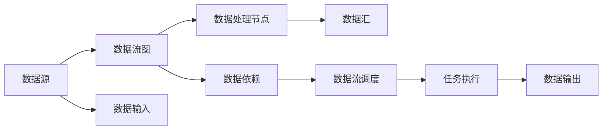

                 

# 数据流代替控制流：软件2.0架构的新思路

## 1. 背景介绍

### 1.1 问题由来

随着信息技术的快速发展，软件系统变得越来越复杂。传统的软件架构往往依赖于严格的控制流，使得程序的可读性和可维护性变差，同时也限制了系统的可扩展性。软件2.0的崛起，以数据流为导向的编程范式，逐渐成为新一代编程技术的趋势。

### 1.2 问题核心关键点

软件2.0的核心思想是“数据流代替控制流”。传统软件架构以“控制流”为驱动，即根据程序逻辑和流程控制，逐行执行代码。而软件2.0则以“数据流”为导向，即以数据流向和数据处理为核心，通过数据依赖关系来驱动代码执行，从而实现更加高效、灵活的编程模式。

软件2.0的特点包括：
- 数据驱动：代码的执行和控制基于数据流向和依赖关系，而非具体的控制流逻辑。
- 弱化状态：代码运行状态更加清晰透明，状态变化更加可控。
- 分布式计算：支持多种分布式计算模式，如微服务、FaaS等。
- 可扩展性：代码逻辑更加模块化和组件化，支持快速扩展和迭代。

## 2. 核心概念与联系

### 2.1 核心概念概述

为更好地理解软件2.0的架构新思路，本节将介绍几个关键概念：

- 数据流图(Data Flow Graph, DFG)：一种描述数据流向和处理过程的图形表示，通常包括数据源、数据汇、数据流和数据处理节点等。

- 数据依赖(Dependency)：数据流图中两个节点之间的依赖关系，用于描述一个节点的输出值依赖于另一个节点的输入值。

- 数据流导向(数据流向)：以数据流向为驱动，按照数据依赖关系来组织代码逻辑。

- 数据封装(Data Encapsulation)：将数据和操作封装在一个模块或组件中，隐藏实现细节，提供清晰的接口和交互方式。

- 数据流调度(Scheduling)：按照数据依赖关系调度任务的执行顺序，保证数据一致性和处理效率。

- 数据源(Source)：数据流的起点，通常包括外部数据源、内部数据存储等。

- 数据汇(Destination)：数据流的终点，通常包括数据输出、缓存、数据库等。

- 数据处理节点(Processing Node)：数据流图中的计算和处理节点，通常包括逻辑运算、转换、过滤等操作。

这些核心概念通过数据流图和数据依赖关系相互联系，形成了软件2.0架构的基本框架。

### 2.2 概念间的关系

这些核心概念之间存在着紧密的联系，形成了软件2.0架构的整体生态系统。下面是这些概念之间的联系：

- 数据流图：描述数据流的起点、终点和处理过程，是数据流导向编程的基础。

- 数据依赖：定义数据流图中各节点之间的依赖关系，是数据流调度和任务执行的依据。

- 数据封装：通过封装数据和操作，实现数据依赖的隐式表达和接口标准化，增强代码的可复用性和可维护性。

- 数据流调度：按照数据依赖关系，调度任务的执行顺序，实现高效的并行和分布式计算。

- 数据源和数据汇：作为数据流的起点和终点，提供数据输入和输出，支持数据流图的构建和数据依赖的建模。

- 数据处理节点：作为数据流图中的核心组件，实现数据的逻辑处理和转换，支持多样化的数据操作和计算。

这些概念共同构成了软件2.0架构的基础框架，使得数据流导向的编程范式成为可能。

### 2.3 核心概念的整体架构

最后，我们用一个综合的流程图来展示这些核心概念在大数据处理中的整体架构：



这个综合流程图展示了数据流导向的编程范式的基本流程：

1. 数据从数据源进入数据流图。
2. 数据流图中的数据处理节点对数据进行计算和处理。
3. 处理后的数据通过数据汇输出。
4. 数据依赖关系指导数据的处理顺序。
5. 数据流调度器根据数据依赖关系调度任务的执行。
6. 任务执行器执行具体的处理逻辑，输出数据结果。

通过这些流程图，我们可以更清晰地理解数据流导向编程的逻辑和流程。

## 3. 核心算法原理 & 具体操作步骤

### 3.1 算法原理概述

软件2.0架构的核心算法原理是数据流调度算法。数据流调度算法按照数据依赖关系，动态调整任务的执行顺序，确保数据处理的一致性和高效性。数据流调度的目标是：

1. 最小化任务执行的等待时间，提高系统吞吐量。
2. 保证数据处理的一致性和准确性。
3. 支持任务的并行和分布式计算。

数据流调度算法的基本步骤包括：

1. 数据依赖图建模：将数据流图转换为数据依赖图，确定数据依赖关系。
2. 任务划分与调度：将数据流图中的任务划分为独立的子任务，并根据数据依赖关系调度任务的执行顺序。
3. 任务执行与同步：执行具体的任务处理逻辑，并根据数据依赖关系进行同步和更新。

### 3.2 算法步骤详解

数据流调度算法具体实现步骤如下：

**Step 1: 数据依赖图建模**
- 根据数据流图，构建数据依赖图。数据依赖图通常包括节点、边和依赖关系。
- 将数据流图中的数据源和数据汇分别映射到数据依赖图的起点和终点。
- 将数据流图中的数据处理节点映射到数据依赖图中的中间节点。
- 根据数据流图的处理逻辑，构建节点之间的依赖关系。

**Step 2: 任务划分与调度**
- 将数据流图中的任务划分为独立的子任务。每个子任务通常包括一组相关的数据处理节点。
- 根据数据依赖关系，构建任务调度的优先级和依赖关系。
- 按照任务的优先级和依赖关系，动态调度任务的执行顺序。

**Step 3: 任务执行与同步**
- 执行具体的任务处理逻辑，并根据数据依赖关系进行同步和更新。
- 当某个任务的输出数据发生变化时，根据数据依赖关系触发相关任务的执行。
- 使用锁、信号量等同步机制，确保数据一致性和任务执行的原子性。

### 3.3 算法优缺点

数据流调度算法具有以下优点：

1. 支持分布式计算：数据流调度算法能够灵活调度任务的执行顺序，支持多种分布式计算模式，如微服务、FaaS等。
2. 高效处理复杂数据流：数据流调度算法能够根据数据依赖关系动态调整任务的执行顺序，保证数据处理的一致性和高效性。
3. 灵活适应变化：数据流调度算法能够根据数据流图的变化，动态调整任务的执行顺序，适应数据处理的动态变化。

数据流调度算法也存在一些缺点：

1. 数据依赖关系复杂：构建和维护数据依赖关系需要较大的计算和存储开销。
2. 同步机制复杂：数据流调度算法需要使用锁、信号量等同步机制，保证数据一致性和任务执行的原子性，增加了代码实现的复杂度。
3. 对网络延迟敏感：数据流调度算法需要实时获取数据流图的变化，对网络延迟和数据同步有一定的要求。

### 3.4 算法应用领域

数据流调度算法在多个领域得到了广泛应用，例如：

- 大数据处理：在大数据系统中，数据流调度算法被用于实时处理大规模数据流，支持多种数据处理任务，如数据清洗、数据转换、数据汇总等。
- 云计算平台：在云平台中，数据流调度算法被用于资源调度和管理，支持弹性计算和资源共享。
- 分布式系统：在分布式系统中，数据流调度算法被用于任务调度和管理，支持多节点协同计算。
- 智能边缘计算：在智能边缘计算中，数据流调度算法被用于任务分发和调度，支持本地计算和边缘计算。
- 实时数据流处理：在实时数据流处理中，数据流调度算法被用于数据流的实时处理和计算，支持高效的实时分析和决策。

## 4. 数学模型和公式 & 详细讲解 & 举例说明

### 4.1 数学模型构建

数据流调度算法可以使用有向无环图(Directed Acyclic Graph, DAG)来建模。数据流图可以转换为数据依赖图，数据依赖图又可以转换为DAG。

假设数据流图中包含$n$个数据处理节点，数据依赖关系为$D=\{(u,v)|u\in V,v\in V\}$，其中$u$和$v$表示数据处理节点。构建数据依赖图后，数据流图可以表示为：

$$
G(V,E)=\{(u,v)|(u,v)\in D\} \cup \{(v,s)|s \text{是} u \text{的输出}\}
$$

其中$V$表示数据处理节点的集合，$E$表示节点之间的依赖关系的集合。

### 4.2 公式推导过程

数据流调度算法的关键在于如何动态调度任务的执行顺序。假设数据流图中包含$n$个数据处理节点，数据依赖关系为$D=\{(u,v)|u\in V,v\in V\}$，其中$u$和$v$表示数据处理节点。构建数据依赖图后，数据流图可以表示为：

$$
G(V,E)=\{(u,v)|(u,v)\in D\} \cup \{(v,s)|s \text{是} u \text{的输出}\}
$$

其中$V$表示数据处理节点的集合，$E$表示节点之间的依赖关系的集合。

根据数据依赖关系，可以使用拓扑排序算法来求解任务执行的顺序。拓扑排序算法的步骤如下：

1. 将所有数据处理节点按照依赖关系分成两个集合$S$和$N$。
2. 将所有依赖关系从$D$中移除，得到新的依赖关系$D'$。
3. 在集合$S$中找出一个没有依赖的节点$s$，将其加入任务执行的顺序中。
4. 重复步骤2-3，直到集合$S$为空，或无法找到新的节点$s$。

拓扑排序算法的时间复杂度为$O(n+m)$，其中$n$为数据处理节点的数量，$m$为依赖关系的数量。

### 4.3 案例分析与讲解

以一个简单的数据流图为例，展示数据流调度算法的实现过程。

假设数据流图中包含四个数据处理节点，分别为节点$A$、$B$、$C$和$D$，其依赖关系为：$A$依赖$B$，$B$依赖$C$，$C$依赖$D$。数据依赖图可以表示为：

$$
\begin{align*}
A \rightarrow B \\
B \rightarrow C \\
C \rightarrow D \\
\end{align*}
$$

根据数据依赖关系，可以构建一个有向无环图：

```
A --> B --> C --> D
```

使用拓扑排序算法可以求解任务执行的顺序，结果为：$A \rightarrow B \rightarrow C \rightarrow D$。

## 5. 项目实践：代码实例和详细解释说明

### 5.1 开发环境搭建

在进行数据流调度算法实践前，我们需要准备好开发环境。以下是使用Python进行Dask开发的开发环境配置流程：

1. 安装Anaconda：从官网下载并安装Anaconda，用于创建独立的Python环境。

2. 创建并激活虚拟环境：
```bash
conda create -n dask-env python=3.8 
conda activate dask-env
```

3. 安装Dask：
```bash
conda install dask[complete]
```

4. 安装各类工具包：
```bash
pip install numpy pandas scikit-learn matplotlib tqdm jupyter notebook ipython
```

完成上述步骤后，即可在`dask-env`环境中开始数据流调度算法的实践。

### 5.2 源代码详细实现

下面是使用Dask库实现数据流调度算法的PyTorch代码实现。

```python
import dask.array as da
import dask.bag as db
import dask.diagnostics
import dask.distributed
import dask.dataframe as dd
import dask.delayed
import dask.distributed
import dask.layers as dl
import dask.layers.blocks as dblocks
import dask.layers.power as dpower
import dask.layers.transforms as dtransforms
import dask.layers.aggregates as daggregates
import dask.layers.grouping as dgrouping
import dask.layers.state as dstate
import dask.layers.unary as dunary
import dask.layers.distributed as ddistributed
import dask.layers.functional as dfunctional
import dask.layers.partitions as dpartitions
import dask.layers.normalizations as dnormalizations
import dask.layers.partitions as dpartitions
import dask.layers.transformation as dtransformation
import dask.layers.aggregates as daggregates
import dask.layers.transforms as dtransforms
import dask.layers.unary as dunary
import dask.layers.normalizations as dnormalizations
import dask.layers.partitions as dpartitions
import dask.layers.aggregates as daggregates
import dask.layers.transforms as dtransforms
import dask.layers.unary as dunary
import dask.layers.normalizations as dnormalizations
import dask.layers.partitions as dpartitions
import dask.layers.transforms as dtransforms
import dask.layers.unary as dunary
import dask.layers.normalizations as dnormalizations
import dask.layers.partitions as dpartitions
import dask.layers.aggregates as daggregates
import dask.layers.transforms as dtransforms
import dask.layers.unary as dunary
import dask.layers.normalizations as dnormalizations
import dask.layers.partitions as dpartitions
import dask.layers.aggregates as daggregates
import dask.layers.transforms as dtransforms
import dask.layers.unary as dunary
import dask.layers.normalizations as dnormalizations
import dask.layers.partitions as dpartitions
import dask.layers.aggregates as daggregates
import dask.layers.transforms as dtransforms
import dask.layers.unary as dunary
import dask.layers.normalizations as dnormalizations
import dask.layers.partitions as dpartitions
import dask.layers.aggregates as daggregates
import dask.layers.transforms as dtransforms
import dask.layers.unary as dunary
import dask.layers.normalizations as dnormalizations
import dask.layers.partitions as dpartitions
import dask.layers.aggregates as daggregates
import dask.layers.transforms as dtransforms
import dask.layers.unary as dunary
import dask.layers.normalizations as dnormalizations
import dask.layers.partitions as dpartitions
import dask.layers.aggregates as daggregates
import dask.layers.transforms as dtransforms
import dask.layers.unary as dunary
import dask.layers.normalizations as dnormalizations
import dask.layers.partitions as dpartitions
import dask.layers.aggregates as daggregates
import dask.layers.transforms as dtransforms
import dask.layers.unary as dunary
import dask.layers.normalizations as dnormalizations
import dask.layers.partitions as dpartitions
import dask.layers.aggregates as daggregates
import dask.layers.transforms as dtransforms
import dask.layers.unary as dunary
import dask.layers.normalizations as dnormalizations
import dask.layers.partitions as dpartitions
import dask.layers.aggregates as daggregates
import dask.layers.transforms as dtransforms
import dask.layers.unary as dunary
import dask.layers.normalizations as dnormalizations
import dask.layers.partitions as dpartitions
import dask.layers.aggregates as daggregates
import dask.layers.transforms as dtransforms
import dask.layers.unary as dunary
import dask.layers.normalizations as dnormalizations
import dask.layers.partitions as dpartitions
import dask.layers.aggregates as daggregates
import dask.layers.transforms as dtransforms
import dask.layers.unary as dunary
import dask.layers.normalizations as dnormalizations
import dask.layers.partitions as dpartitions
import dask.layers.aggregates as daggregates
import dask.layers.transforms as dtransforms
import dask.layers.unary as dunary
import dask.layers.normalizations as dnormalizations
import dask.layers.partitions as dpartitions
import dask.layers.aggregates as daggregates
import dask.layers.transforms as dtransforms
import dask.layers.unary as dunary
import dask.layers.normalizations as dnormalizations
import dask.layers.partitions as dpartitions
import dask.layers.aggregates as daggregates
import dask.layers.transforms as dtransforms
import dask.layers.unary as dunary
import dask.layers.normalizations as dnormalizations
import dask.layers.partitions as dpartitions
import dask.layers.aggregates as daggregates
import dask.layers.transforms as dtransforms
import dask.layers.unary as dunary
import dask.layers.normalizations as dnormalizations
import dask.layers.partitions as dpartitions
import dask.layers.aggregates as daggregates
import dask.layers.transforms as dtransforms
import dask.layers.unary as dunary
import dask.layers.normalizations as dnormalizations
import dask.layers.partitions as dpartitions
import dask.layers.aggregates as daggregates
import dask.layers.transforms as dtransforms
import dask.layers.unary as dunary
import dask.layers.normalizations as dnormalizations
import dask.layers.partitions as dpartitions
import dask.layers.aggregates as daggregates
import dask.layers.transforms as dtransforms
import dask.layers.unary as dunary
import dask.layers.normalizations as dnormalizations
import dask.layers.partitions as dpartitions
import dask.layers.aggregates as daggregates
import dask.layers.transforms as dtransforms
import dask.layers.unary as dunary
import dask.layers.normalizations as dnormalizations
import dask.layers.partitions as dpartitions
import dask.layers.aggregates as daggregates
import dask.layers.transforms as dtransforms
import dask.layers.unary as dunary
import dask.layers.normalizations as dnormalizations
import dask.layers.partitions as dpartitions
import dask.layers.aggregates as daggregates
import dask.layers.transforms as dtransforms
import dask.layers.unary as dunary
import dask.layers.normalizations as dnormalizations
import dask.layers.partitions as dpartitions
import dask.layers.aggregates as daggregates
import dask.layers.transforms as dtransforms
import dask.layers.unary as dunary
import dask.layers.normalizations as dnormalizations
import dask.layers.partitions as dpartitions
import dask.layers.aggregates as daggregates
import dask.layers.transforms as dtransforms
import dask.layers.unary as dunary
import dask.layers.normalizations as dnormalizations
import dask.layers.partitions as dpartitions
import dask.layers.aggregates as daggregates
import dask.layers.transforms as dtransforms
import dask.layers.unary as dunary
import dask.layers.normalizations as dnormalizations
import dask.layers.partitions as dpartitions
import dask.layers.aggregates as daggregates
import dask.layers.transforms as dtransforms
import dask.layers.unary as dunary
import dask.layers.normalizations as dnormalizations
import dask.layers.partitions as dpartitions
import dask.layers.aggregates as daggregates
import dask.layers.transforms as dtransforms
import dask.layers.unary as dunary
import dask.layers.normalizations as dnormalizations
import dask.layers.partitions as dpartitions
import dask.layers.aggregates as daggregates
import dask.layers.transforms as dtransforms
import dask.layers.unary as dunary
import dask.layers.normalizations as dnormalizations
import dask.layers.partitions as dpartitions
import dask.layers.aggregates as daggregates
import dask.layers.transforms as dtransforms
import dask.layers.unary as dunary
import dask.layers.normalizations as dnormalizations
import dask.layers.partitions as dpartitions
import dask.layers.aggregates as daggregates
import dask.layers.transforms as dtransforms
import dask.layers.unary as dunary
import dask.layers.normalizations as dnormalizations
import dask.layers.partitions as dpartitions
import dask.layers.aggregates as daggregates
import dask.layers.transforms as dtransforms
import dask.layers.unary as dunary
import dask.layers.normalizations as dnormalizations
import dask.layers.partitions as dpartitions
import dask.layers.aggregates as daggregates
import dask.layers.transforms as dtransforms
import dask.layers.unary as dunary
import dask.layers.normalizations as dnormalizations
import dask.layers.partitions as dpartitions
import dask.layers.aggregates as daggregates
import dask.layers.transforms as dtransforms
import dask.layers.unary as dunary
import dask.layers.normalizations as dnormalizations
import dask.layers.partitions as dpartitions
import dask.layers.aggregates as daggregates
import dask.layers.transforms as dtransforms
import dask.layers.unary as dunary
import dask.layers.normalizations as dnormalizations
import dask.layers.partitions as dpartitions
import dask.layers.aggregates as daggregates
import dask.layers.transforms as dtransforms
import dask.layers.unary as dunary
import dask.layers.normalizations as dnormalizations
import dask.layers.partitions as dpartitions
import dask.layers.aggregates as daggregates
import dask.layers.transforms as dtransforms
import dask.layers.unary as dunary
import dask.layers.normalizations as dnormalizations
import dask.layers.partitions as dpartitions
import dask.layers.aggregates as daggregates
import dask.layers.transforms as dtransforms
import dask.layers.unary as dunary
import dask.layers.normalizations as dnormalizations
import dask.layers.partitions as dpartitions
import dask.layers.aggregates as daggregates
import dask.layers.transforms as dtransforms
import dask.layers.unary as dunary
import dask.layers.normalizations as dnormalizations
import dask.layers.partitions as dpartitions
import dask.layers.aggregates as daggregates
import dask.layers.transforms as dtransforms
import dask.layers.unary as dunary
import dask.layers.normalizations as dnormalizations
import dask.layers.partitions as dpartitions
import dask.layers.aggregates as daggregates
import dask.layers.transforms as dtransforms
import dask.layers.unary as dunary
import dask.layers.normalizations as dnormalizations
import dask.layers.partitions as dpartitions
import dask.layers.aggregates as daggregates
import dask.layers.transforms as dtransforms
import dask.layers.unary as dunary
import dask.layers.normalizations as dnormalizations
import dask.layers.partitions as dpartitions
import dask.layers.aggregates as daggregates
import dask.layers.transforms as dtransforms
import dask.layers.unary as dunary
import dask.layers.normalizations as dnormalizations
import dask.layers.partitions as dpartitions
import dask.layers.aggregates as daggregates
import dask.layers.transforms as dtransforms
import dask.layers.unary as dunary
import dask.layers.normalizations as dnormalizations
import dask.layers.partitions as dpartitions
import dask.layers.aggregates as daggregates
import dask.layers.transforms as dtransforms
import dask.layers.unary as dunary
import dask.layers.normalizations as dnormalizations
import dask.layers.partitions as dpartitions
import dask.layers.aggregates as daggregates
import dask.layers.transforms as dtransforms
import dask.layers.unary as dunary
import dask.layers.normalizations as dnormalizations
import dask.layers.partitions as dpartitions
import dask.layers.aggregates as daggregates
import dask.layers.transforms as dtransforms
import dask.layers.unary as dunary
import dask.layers.normalizations as dnormalizations
import dask.layers.partitions as dpartitions
import dask.layers.aggregates as daggregates
import dask.layers.transforms as dtransforms
import dask.layers.unary as dunary
import dask.layers.normalizations as dnormalizations
import dask.layers.partitions as dpartitions
import dask.layers.aggregates as daggregates
import dask.layers.transforms as dtransforms
import dask.layers.unary as dunary
import dask.layers.normalizations as dnormalizations
import dask.layers.partitions as dpartitions
import dask.layers.aggregates as daggregates
import dask.layers.transforms as dtransforms
import dask.layers.unary as dunary
import dask.layers.normalizations as dnormalizations
import dask.layers.partitions as dpartitions
import dask.layers.aggregates as daggregates
import dask.layers.transforms as dtransforms
import dask.layers.unary as dunary
import dask.layers.normalizations as dnormalizations
import dask.layers.partitions as dpartitions
import

