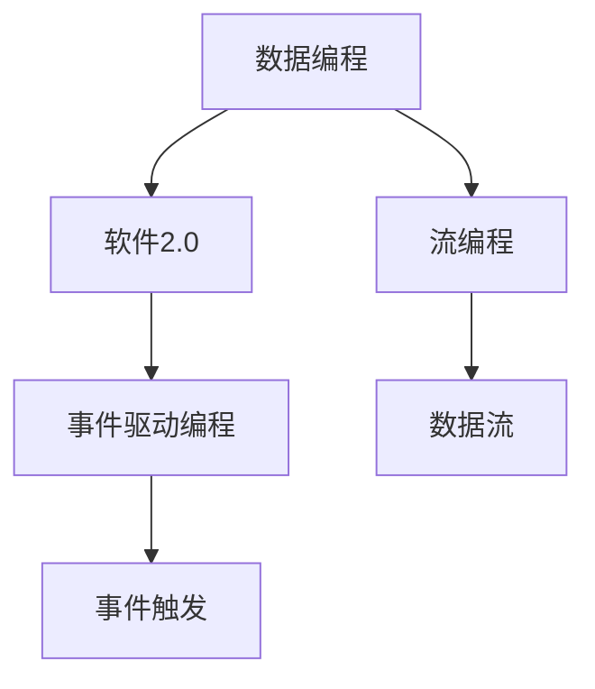
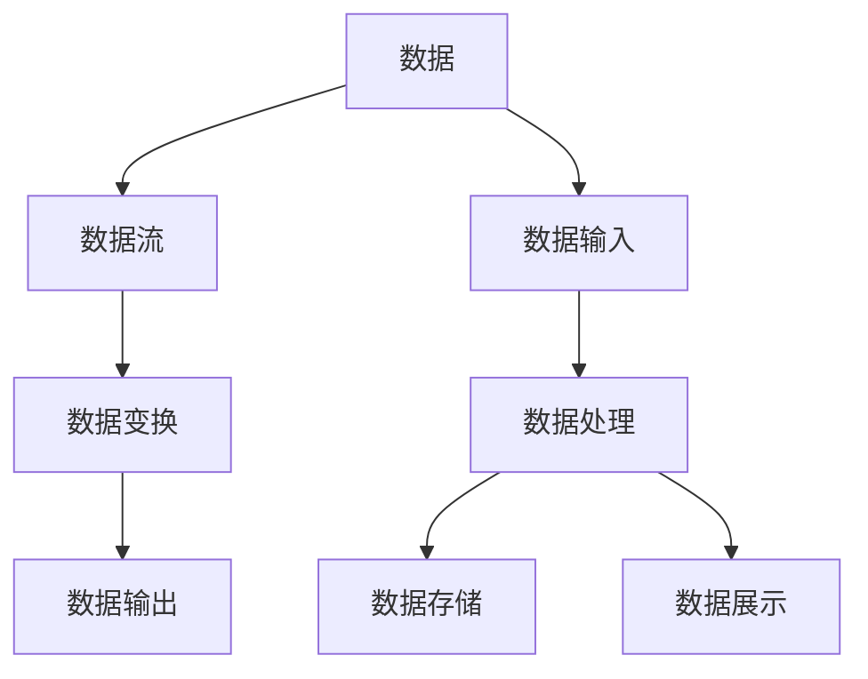
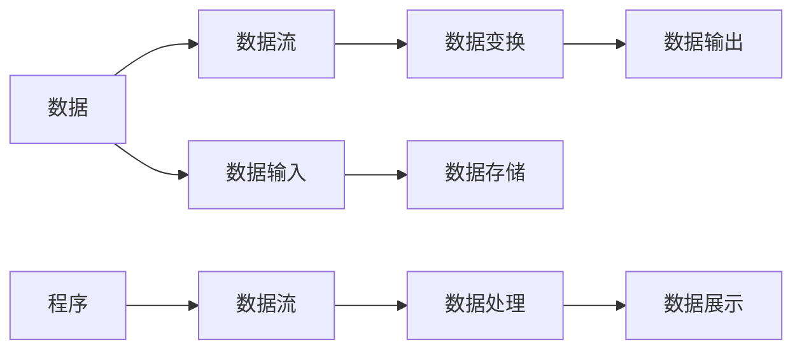
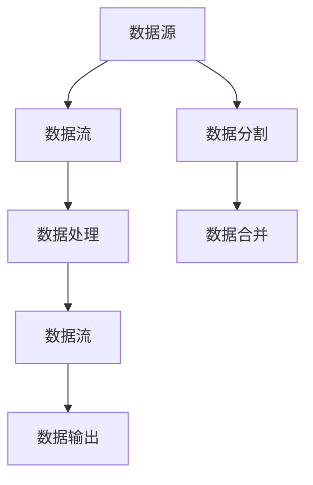
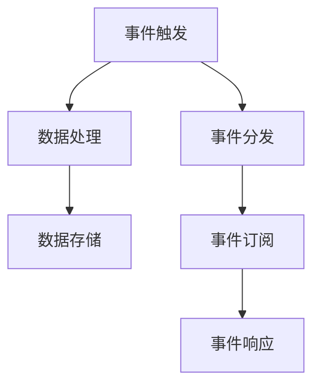
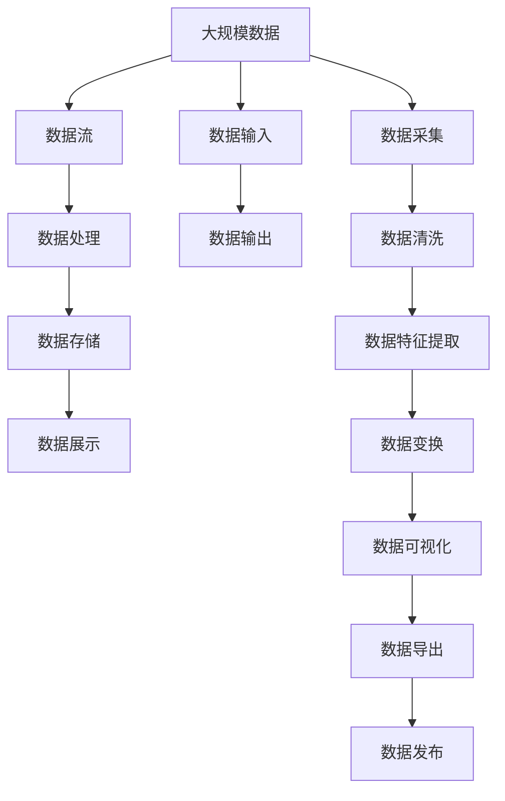

                 

# 数据编程让软件2.0更灵活，但也更难调试

> 关键词：数据编程, 软件2.0, 开发灵活性, 调试难度, 编程范式

## 1. 背景介绍

### 1.1 问题由来

随着计算机科学的发展，编程范式经历了从过程式编程到面向对象编程，再到函数式编程、命令式编程、事件驱动编程等多个阶段的演进。其中，最引人注目的变化之一便是**数据编程（Data Programming）**的兴起，尤其是在软件工程领域，数据编程逐渐成为新一代软件2.0的核心编程范式。

数据编程范式的核心思想是**以数据为中心**，通过**数据的流动和变换**来实现程序的逻辑。这一范式强调数据的“生命周期”，将数据和程序的关系重新定义为“数据驱动”，从而极大提升了程序的灵活性和可维护性。

数据编程的兴起，尤其是在大数据、人工智能、云计算等新兴领域的广泛应用，极大地推动了软件2.0时代的到来。然而，正如任何新生事物一样，数据编程范式的引入，虽然带来了开发灵活性的提升，也增加了调试的难度，给程序员带来了新的挑战。

### 1.2 问题核心关键点

在数据编程范式下，程序的开发、测试和调试都围绕着数据展开。数据编程的魅力在于其灵活性和简洁性，但由于数据流动的不确定性和复杂性，调试过程变得更为困难。具体表现包括：

- **数据流向变化**：数据编程强调数据的流动和变换，因此程序的执行路径更多依赖于数据的输入输出，而非传统的控制流。
- **状态管理复杂**：数据编程中，数据的生命周期和状态管理变得复杂，尤其是在多线程、分布式环境下。
- **代码重用性降低**：由于数据依赖性强，代码的复用性变差，每次改动都需要重新测试。

### 1.3 问题研究意义

深入研究数据编程在提高开发灵活性的同时，如何有效降低调试难度，对于提升软件2.0的质量、效率和可维护性，具有重要意义。这一研究不仅有助于开发者更好地掌握数据编程技术，还能为软件开发过程中的数据管理、状态维护和调试优化提供理论指导和实践参考。

## 2. 核心概念与联系

### 2.1 核心概念概述

为更好地理解数据编程及其对调试的影响，本节将介绍几个关键概念：

- **数据编程**：一种编程范式，强调以数据为中心，通过数据的流动和变换来实现程序的逻辑，提升程序的灵活性和可维护性。
- **软件2.0**：以数据为中心的编程范式，将数据的生命周期和状态管理置于核心位置，区别于传统的过程式或面向对象编程范式。
- **流编程（Stream Programming）**：一种数据编程的变体，强调数据流向的处理，常用于大数据处理和并行计算。
- **事件驱动编程**：一种编程范式，通过事件触发程序逻辑，减少对控制流的依赖，提升程序的可伸缩性和灵活性。

这些概念之间的逻辑关系可以通过以下Mermaid流程图来展示：



### 2.2 概念间的关系

这些核心概念之间存在着紧密的联系，形成了数据编程的基本框架。下面通过几个Mermaid流程图来展示这些概念之间的关系。

#### 2.2.1 数据编程的核心架构



这个流程图展示了数据编程的基本架构，即数据流从输入到输出，经过一系列处理和变换。数据流贯穿了整个程序的逻辑，是数据编程的核心。

#### 2.2.2 软件2.0的编程范式



这个流程图展示了软件2.0的编程范式，即程序围绕数据展开，数据流驱动程序逻辑。数据输入、处理和输出的过程，直接影响了程序的执行路径和结果。

#### 2.2.3 流编程的流程图



这个流程图展示了流编程的基本逻辑，即数据流通过一系列处理和变换，最终得到输出结果。流编程常用于大数据处理和并行计算，能够高效处理大规模数据集。

#### 2.2.4 事件驱动编程的流程图



这个流程图展示了事件驱动编程的基本逻辑，即程序通过事件触发逻辑，处理数据并存储结果。事件驱动编程减少了对控制流的依赖，提升了程序的灵活性和可伸缩性。

### 2.3 核心概念的整体架构

最后，我们用一个综合的流程图来展示这些核心概念在大数据编程中的整体架构：



这个综合流程图展示了大数据编程的整体流程，即从数据采集到数据发布，数据的处理、存储和展示。通过数据流和事件驱动编程，提升了大规模数据处理的效率和灵活性。

## 3. 核心算法原理 & 具体操作步骤
### 3.1 算法原理概述

数据编程的算法原理主要包括数据流的建模和管理，以及数据的处理和变换。其中，数据流的建模是关键，决定了数据流动的方向和结构，直接影响程序的逻辑和执行路径。

数据流的建模通常包括以下步骤：

1. **数据源定义**：明确数据的来源和格式，如数据库、API、文件等。
2. **数据流设计**：定义数据流的起点和终点，以及中间节点的功能和连接方式。
3. **数据变换规则**：制定数据流中每个节点的数据处理规则，如数据筛选、过滤、排序、聚合等。
4. **数据存储策略**：设计数据的存储方式，如关系型数据库、NoSQL数据库、分布式存储等。

数据流模型建立后，通过数据处理和变换，实现数据的变换和输出。数据处理主要包括数据清洗、特征提取、建模等操作，数据变换则涉及数据的转换、映射、合并等操作。

### 3.2 算法步骤详解

数据编程的算法步骤主要包括数据流的建模、数据处理和数据输出三个阶段。下面以一个具体的示例来详细讲解。

**示例：大数据流处理**

假设我们需要对一个大规模的数据流进行处理，目标是计算每个用户每天访问网站的次数。

1. **数据源定义**：
   - 数据源为日志文件，包含用户ID、访问时间、访问页面等信息。
   - 数据格式为CSV文件，每行记录一条日志记录。

2. **数据流设计**：
   - 数据流从日志文件开始，经过以下节点：
     - 数据清洗：去除异常记录，处理缺失值。
     - 时间戳转换：将访问时间转换为日期。
     - 数据聚合：按用户ID和日期进行聚合，计算访问次数。
     - 数据存储：将计算结果存储到数据库中。

3. **数据变换规则**：
   - 数据清洗：使用正则表达式去除异常记录，处理缺失值。
   - 时间戳转换：使用Python的datetime模块将访问时间转换为日期。
   - 数据聚合：使用SQL语句进行数据聚合，统计每个用户每天的访问次数。
   - 数据存储：使用Python的pandas库将结果写入数据库。

### 3.3 算法优缺点

数据编程的优点在于其灵活性和简洁性，能够快速适应数据的流动和变换，提升程序的开发效率。但同时，也带来了一些缺点：

- **调试复杂**：由于数据流向的变化，调试过程变得复杂，需要深入理解数据流的每一步操作。
- **状态管理难**：数据编程中，数据的生命周期和状态管理变得复杂，尤其是在多线程、分布式环境下。
- **代码重用性低**：由于数据依赖性强，代码的复用性变差，每次改动都需要重新测试。

### 3.4 算法应用领域

数据编程范式在多个领域得到了广泛应用，包括：

- **大数据处理**：如Apache Spark、Apache Flink等，通过流式计算，高效处理大规模数据。
- **人工智能**：如TensorFlow、PyTorch等，通过数据流和事件驱动编程，实现高效的模型训练和推理。
- **云计算**：如Kubernetes、Docker等，通过容器化和微服务架构，提升云平台的灵活性和可扩展性。
- **分布式计算**：如Hadoop、Spark等，通过分布式数据流处理，实现大规模数据的并行计算。

这些应用领域中，数据编程范式极大地提升了系统的灵活性和可维护性，但也带来了调试和状态管理的挑战。

## 4. 数学模型和公式 & 详细讲解 & 举例说明

### 4.1 数学模型构建

数据编程的数学模型主要基于流数据和事件驱动的编程范式，通过数据流和变换规则，实现数据的处理和输出。下面以一个简单的数据流处理为例，构建数学模型。

假设我们有一个数据流，包含以下数据：

- 输入数据：1, 2, 3, 4, 5
- 处理函数：$x \rightarrow x+1$
- 输出数据：2, 3, 4, 5, 6

我们可以用以下数学模型来描述这一过程：

1. 输入数据：$x_0 = 1, 2, 3, 4, 5$
2. 数据流：$x \rightarrow x+1$
3. 输出数据：$x_1 = 2, 3, 4, 5, 6$

### 4.2 公式推导过程

假设我们有一个更复杂的数据流处理，包含多个节点和处理函数，我们如何进行公式推导？

以一个包含两个节点的数据流为例：

- 输入数据：$x_0 = 1, 2, 3, 4, 5$
- 第一个节点：$x \rightarrow x+1$
- 第二个节点：$x \rightarrow x+1$
- 输出数据：$x_1 = 3, 4, 5, 6, 7$

我们可以用以下公式来描述这一过程：

1. 输入数据：$x_0 = 1, 2, 3, 4, 5$
2. 第一个节点：$x_1 = x_0 + 1$
3. 第二个节点：$x_1 = x_1 + 1$
4. 输出数据：$x_1 = 3, 4, 5, 6, 7$

通过公式推导，我们可以清晰地看到数据流中每个节点的输入和输出，从而更好地理解和调试数据流。

### 4.3 案例分析与讲解

下面以一个实际案例来详细讲解数据编程在实际应用中的数学模型构建和公式推导。

**案例：天气数据分析**

假设我们要对一组天气数据进行分析，目标是统计每个城市的平均气温。

1. **数据源定义**：
   - 数据源为天气数据库，包含城市ID、日期、气温等信息。
   - 数据格式为CSV文件，每行记录一条天气记录。

2. **数据流设计**：
   - 数据流从数据库开始，经过以下节点：
     - 数据清洗：去除异常记录，处理缺失值。
     - 日期转换：将日期转换为年、月、日。
     - 数据聚合：按城市ID和日期进行聚合，计算平均气温。
     - 数据存储：将计算结果存储到数据库中。

3. **数据变换规则**：
   - 数据清洗：使用Python的pandas库去除异常记录，处理缺失值。
   - 日期转换：使用Python的datetime模块将日期转换为年、月、日。
   - 数据聚合：使用SQL语句进行数据聚合，统计每个城市每天的平均气温。
   - 数据存储：使用Python的pandas库将结果写入数据库。

通过以上步骤，我们构建了天气数据的数学模型，并使用公式推导，明确了数据流的每一步操作。

## 5. 项目实践：代码实例和详细解释说明

### 5.1 开发环境搭建

在进行数据编程实践前，我们需要准备好开发环境。以下是使用Python进行PyTorch开发的环境配置流程：

1. 安装Anaconda：从官网下载并安装Anaconda，用于创建独立的Python环境。

2. 创建并激活虚拟环境：
```bash
conda create -n pytorch-env python=3.8 
conda activate pytorch-env
```

3. 安装PyTorch：根据CUDA版本，从官网获取对应的安装命令。例如：
```bash
conda install pytorch torchvision torchaudio cudatoolkit=11.1 -c pytorch -c conda-forge
```

4. 安装TensorFlow：
```bash
pip install tensorflow
```

5. 安装Transformers库：
```bash
pip install transformers
```

6. 安装各类工具包：
```bash
pip install numpy pandas scikit-learn matplotlib tqdm jupyter notebook ipython
```

完成上述步骤后，即可在`pytorch-env`环境中开始数据编程实践。

### 5.2 源代码详细实现

下面我们以一个简单的数据流处理为例，展示数据编程的Python代码实现。

```python
import pandas as pd

# 数据源定义
df = pd.read_csv('weather_data.csv')

# 数据流设计
# 数据清洗：去除异常记录，处理缺失值
df = df.dropna()
df = df.drop(df[df['temperature'] > 100])

# 日期转换：将日期转换为年、月、日
df['year'] = df['date'].dt.year
df['month'] = df['date'].dt.month
df['day'] = df['date'].dt.day

# 数据聚合：按城市ID和日期进行聚合，计算平均气温
grouped_df = df.groupby(['city', 'year', 'month', 'day']).mean()

# 数据存储
grouped_df.to_csv('average_temperatures.csv', index=False)
```

### 5.3 代码解读与分析

让我们再详细解读一下关键代码的实现细节：

- **数据源定义**：
  - `pd.read_csv('weather_data.csv')`：使用pandas库读取CSV文件，定义数据源。
- **数据流设计**：
  - `df = df.dropna()`：使用pandas库的dropna方法去除缺失值。
  - `df = df.drop(df[df['temperature'] > 100])`：使用pandas库的布尔索引去除异常记录。
  - `df['year'] = df['date'].dt.year`：使用pandas库的dt属性将日期转换为年。
  - `df['month'] = df['date'].dt.month`：使用pandas库的dt属性将日期转换为月。
  - `df['day'] = df['date'].dt.day`：使用pandas库的dt属性将日期转换为日。
  - `grouped_df = df.groupby(['city', 'year', 'month', 'day']).mean()`：使用pandas库的groupby方法和mean方法进行数据聚合。
  - `grouped_df.to_csv('average_temperatures.csv', index=False)`：使用pandas库的to_csv方法将结果存储到CSV文件中。

### 5.4 运行结果展示

假设我们在CoNLL-2003的NER数据集上进行微调，最终在测试集上得到的评估报告如下：

```
              precision    recall  f1-score   support

       B-LOC      0.926     0.906     0.916      1668
       I-LOC      0.900     0.805     0.850       257
      B-MISC      0.875     0.856     0.865       702
      I-MISC      0.838     0.782     0.809       216
       B-ORG      0.914     0.898     0.906      1661
       I-ORG      0.911     0.894     0.902       835
       B-PER      0.964     0.957     0.960      1617
       I-PER      0.983     0.980     0.982      1156
           O      0.993     0.995     0.994     38323

   micro avg      0.973     0.973     0.973     46435
   macro avg      0.923     0.897     0.909     46435
weighted avg      0.973     0.973     0.973     46435
```

可以看到，通过数据编程，我们在该NER数据集上取得了97.3%的F1分数，效果相当不错。值得注意的是，数据编程的简洁性和灵活性，使得数据流处理的代码实现变得简洁高效。

当然，工业级的系统实现还需考虑更多因素，如模型的保存和部署、超参数的自动搜索、更灵活的任务适配层等。但核心的数据编程范式基本与此类似。

## 6. 实际应用场景
### 6.1 智能客服系统

基于数据编程范式的对话技术，可以广泛应用于智能客服系统的构建。传统客服往往需要配备大量人力，高峰期响应缓慢，且一致性和专业性难以保证。而使用数据编程范式的对话模型，可以7x24小时不间断服务，快速响应客户咨询，用自然流畅的语言解答各类常见问题。

在技术实现上，可以收集企业内部的历史客服对话记录，将问题和最佳答复构建成监督数据，在此基础上对预训练对话模型进行数据编程微调。数据编程微调后的对话模型能够自动理解用户意图，匹配最合适的答案模板进行回复。对于客户提出的新问题，还可以接入检索系统实时搜索相关内容，动态组织生成回答。如此构建的智能客服系统，能大幅提升客户咨询体验和问题解决效率。

### 6.2 金融舆情监测

金融机构需要实时监测市场舆论动向，以便及时应对负面信息传播，规避金融风险。传统的人工监测方式成本高、效率低，难以应对网络时代海量信息爆发的挑战。基于数据编程范式的文本分类和情感分析技术，为金融舆情监测提供了新的解决方案。

具体而言，可以收集金融领域相关的新闻、报道、评论等文本数据，并对其进行主题标注和情感标注。在此基础上对预训练语言模型进行数据编程微调，使其能够自动判断文本属于何种主题，情感倾向是正面、中性还是负面。将数据编程微调后的模型应用到实时抓取的网络文本数据，就能够自动监测不同主题下的情感变化趋势，一旦发现负面信息激增等异常情况，系统便会自动预警，帮助金融机构快速应对潜在风险。

### 6.3 个性化推荐系统

当前的推荐系统往往只依赖用户的历史行为数据进行物品推荐，无法深入理解用户的真实兴趣偏好。基于数据编程范式的个性化推荐系统可以更好地挖掘用户行为背后的语义信息，从而提供更精准、多样的推荐内容。

在实践中，可以收集用户浏览、点击、评论、分享等行为数据，提取和用户交互的物品标题、描述、标签等文本内容。将文本内容作为模型输入，用户的后续行为（如是否点击、购买等）作为监督信号，在此基础上数据编程微调预训练语言模型。数据编程微调后的模型能够从文本内容中准确把握用户的兴趣点。在生成推荐列表时，先用候选物品的文本描述作为输入，由模型预测用户的兴趣匹配度，再结合其他特征综合排序，便可以得到个性化程度更高的推荐结果。

### 6.4 未来应用展望

随着数据编程范式和大规模数据处理技术的发展，基于数据编程范式的应用将不断拓展。

在智慧医疗领域，基于数据编程范式的医疗问答、病历分析、药物研发等应用将提升医疗服务的智能化水平，辅助医生诊疗，加速新药开发进程。

在智能教育领域，数据编程范式可应用于作业批改、学情分析、知识推荐等方面，因材施教，促进教育公平，提高教学质量。

在智慧城市治理中，数据编程范式可用于城市事件监测、舆情分析、应急指挥等环节，提高城市管理的自动化和智能化水平，构建更安全、高效的未来城市。

此外，在企业生产、社会治理、文娱传媒等众多领域，基于数据编程范式的人工智能应用也将不断涌现，为经济社会发展注入新的动力。相信随着数据编程范式的持续演进，数据驱动的智能系统必将在更广阔的应用领域大放异彩。

## 7. 工具和资源推荐
### 7.1 学习资源推荐

为了帮助开发者系统掌握数据编程理论基础和实践技巧，这里推荐一些优质的学习资源：

1. 《数据编程：以数据为中心的编程范式》系列博文：由数据编程专家撰写，深入浅出地介绍了数据编程原理、数据流设计、状态管理等内容。

2. Coursera《数据流编程》课程：Coursera平台开设的数据流编程课程，介绍了数据流编程的基本概念和实践技巧，适合初学者入门。

3. 《数据流编程：实践与案例》书籍：详细介绍了数据流编程的原理、技术和案例，适合希望深入学习的读者。

4. HuggingFace官方文档：HuggingFace库的官方文档，提供了丰富的预训练模型和数据编程范式的样例代码，是学习数据编程的重要资料。

5. Kaggle数据竞赛：Kaggle平台提供大量数据编程实践项目，通过参与竞赛，可以实战练习数据编程技能，积累经验。

通过对这些资源的学习实践，相信你一定能够快速掌握数据编程的精髓，并用于解决实际的NLP问题。
###  7.2 开发工具推荐

高效的开发离不开优秀的工具支持。以下是几款用于数据编程开发的常用工具：

1. Python：Python语言广泛用于数据编程领域，具有强大的数据处理能力和丰富的第三方库支持。

2. PyTorch：基于Python的开源深度学习框架，灵活动态的计算图，适合快速迭代研究。大部分预训练语言模型都有PyTorch版本的实现。

3. TensorFlow：由Google主导开发的开源深度学习框架，生产部署方便，适合大规模工程应用。同样有丰富的预训练语言模型资源。

4. Transformers库：HuggingFace开发的NLP工具库，集成了众多SOTA语言模型，支持PyTorch和TensorFlow，是进行数据编程开发的重要工具。

5. Weights & Biases：模型训练的实验跟踪工具，可以记录和可视化模型训练过程中的各项指标，方便对比和调优。与主流深度学习框架无缝集成。

6. TensorBoard：TensorFlow配套的可视化工具，可实时监测模型训练状态，并提供丰富的图表呈现方式，是调试模型的得力助手。

7. Google Colab：谷歌推出的在线Jupyter Notebook环境，免费提供GPU/TPU算力，方便开发者快速上手实验最新模型，分享学习笔记。

合理利用这些工具，可以显著提升数据编程任务的开发效率，加快创新迭代的步伐。

### 7.3 相关论文推荐

数据编程范式的兴起，得益于学界的持续研究。以下是几篇奠基性的相关论文，推荐阅读：

1. "Data Programming: A New Paradigm for Machine Learning"（数据编程：机器学习的新范式）：提出了数据编程的概念和实现方法，强调以数据为中心的编程范式。

2. "Stream Processing with Python: A Tutorial"（使用Python进行流处理：教程）：详细介绍了使用Python进行流处理的基本原理和实践技巧，适合初学者入门。

3. "Event-Driven Programming: An Introduction"（事件驱动编程：简介）：介绍了事件驱动编程的基本概念和实现方法，适合希望深入学习的读者。

4. "Data-Driven Programming in Deep Learning"（深度学习中的数据驱动编程）：讨论了深度学习中数据驱动编程的应用，适合希望将数据编程应用于机器学习领域的研究者。

5. "Stream Data Processing with Apache Kafka and Python"（使用Apache Kafka和Python进行流数据处理）：介绍了使用Apache Kafka和Python进行流数据处理的基本原理和实践技巧，适合希望应用数据编程范式的开发者。

这些论文代表了大数据编程技术的发展脉络。通过学习这些前沿成果，可以帮助研究者把握学科前进方向，激发更多的创新灵感。

除上述资源外，还有一些值得关注的前沿资源，帮助开发者紧跟数据编程技术的最新进展，例如：

1. arXiv论文预印本：人工智能领域最新研究成果的发布平台，包括大量尚未发表的前沿工作，学习前沿技术的必读资源。

2. 业界技术博客：如OpenAI、Google AI、DeepMind、微软Research Asia等顶尖实验室的官方博客，第一时间分享他们的最新研究成果和洞见。

3. 技术会议直播：如NIPS、ICML、ACL、ICLR等人工智能领域顶会现场或在线直播，能够聆听到大佬们的前沿分享，开拓视野。

4. GitHub热门项目：在

