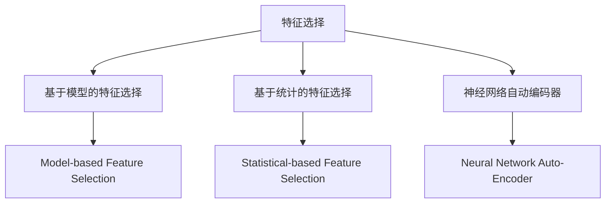
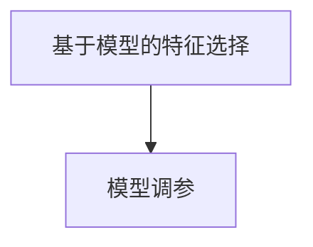
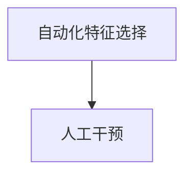
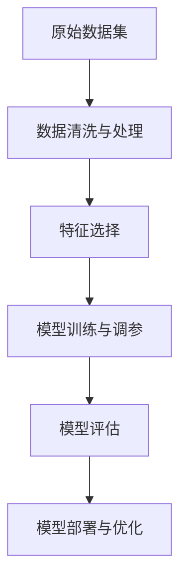

                 

# 数据集优化:自动化特征选择的新思路

> 关键词：数据集优化,自动化特征选择,机器学习,深度学习,特征工程,机器学习调参

## 1. 背景介绍

### 1.1 问题由来
在当今数据驱动的科技时代，高质量的数据集对于机器学习、深度学习等模型的训练和应用至关重要。然而，构建或收集一个高质量的数据集往往需要耗费大量的人力和时间，且难以保证数据的代表性、准确性和完备性。数据集质量的低劣不仅影响模型训练的效率，还会降低模型的预测性能。因此，数据集优化和特征选择成为机器学习领域研究的一个热点问题。

数据集优化主要包含两个方面：一是数据清洗和处理，去除噪声和异常值，保证数据的质量；二是特征选择，即从原始数据中选取最相关的特征，提升模型的预测能力。特征选择是数据集优化的关键步骤，有效的特征选择不仅能提高模型性能，还能减少计算资源消耗，降低过拟合风险。

### 1.2 问题核心关键点
特征选择的核心目标是从原始数据中识别出最重要的特征，并将其保留，以提升模型的性能。常见的特征选择方法包括基于统计学的方法（如方差分析、卡方检验）、基于模型的方法（如LASSO、决策树）、基于信息熵的方法（如互信息、信息增益）等。但这些方法要么需要手动选择，要么缺乏自动化机制，难以在大规模数据集上高效应用。

近年来，随着深度学习技术的发展，神经网络的结构和参数不断复杂化，特征选择变得更加重要和紧迫。因此，研究人员提出了一些基于神经网络的特征选择方法，如特征重要性排序（Feature Importance Sorting）、神经网络自动编码器（Neural Network Auto-Encoder）等，但这些方法仍需手动调整参数，缺乏自动化机制。

为了进一步推动特征选择的自动化和优化，自动化特征选择（Automated Feature Selection, AFS）成为研究的热点。自动化的特征选择可以显著减少特征工程的工作量，提高模型训练的效率，是实现数据集优化、提升模型性能的重要手段。

### 1.3 问题研究意义
自动化特征选择的研究意义在于：

1. 减少人工干预：自动化特征选择可以自动化地从原始数据中提取特征，减少人工干预，提升工作效率。
2. 优化模型性能：自动化特征选择能自动识别和保留重要的特征，减少噪声干扰，提升模型性能。
3. 提升数据质量：通过特征选择，去除不相关或低质量的数据，提升数据集的整体质量。
4. 降低计算成本：自动化特征选择减少了需要训练和优化的参数，降低了计算资源消耗，提高模型训练的效率。
5. 增强模型鲁棒性：去除无关特征，使模型更加聚焦于核心任务，提高模型的泛化能力和鲁棒性。

## 2. 核心概念与联系

### 2.1 核心概念概述

为了更好地理解自动化特征选择的新思路，本节将介绍几个关键概念：

- **特征选择（Feature Selection）**：从原始数据中选择最相关的特征，以提升模型的预测性能和泛化能力。
- **自动化特征选择（Automated Feature Selection, AFS）**：通过算法自动化地选择最相关的特征，减少人工干预，提升特征选择的效率和效果。
- **基于模型的特征选择（Model-based Feature Selection）**：使用模型评估特征的重要性，选择最相关的特征。
- **基于统计的特征选择（Statistical-based Feature Selection）**：使用统计学方法评估特征的相关性和重要性。
- **神经网络自动编码器（Neural Network Auto-Encoder）**：利用神经网络进行特征学习，自动识别和选择重要特征。

这些概念之间的逻辑关系可以通过以下Mermaid流程图来展示：



这个流程图展示了一些特征选择的关键方法及其之间的联系。基于模型的特征选择、基于统计的特征选择和神经网络自动编码器是三种主要的特征选择方法。

### 2.2 概念间的关系

这些核心概念之间存在着紧密的联系，形成了特征选择的完整生态系统。下面我们通过几个Mermaid流程图来展示这些概念之间的关系。

#### 2.2.1 特征选择与模型性能的关系


这个流程图展示了特征选择和模型性能之间的联系。特征选择能显著提升模型性能，减少计算资源消耗。

#### 2.2.2 基于模型的特征选择与模型调参的关系



这个流程图展示了基于模型的特征选择与模型调参之间的关系。通过特征选择，模型调参的参数量减少，调参难度降低。

#### 2.2.3 自动化特征选择与人工干预的关系



这个流程图展示了自动化特征选择与人工干预之间的关系。自动化特征选择减少了人工干预，提升了工作效率。

### 2.3 核心概念的整体架构

最后，我们用一个综合的流程图来展示这些核心概念在大规模数据集优化中的应用：



这个综合流程图展示了从原始数据集到模型部署的全过程。数据清洗和处理、特征选择、模型训练与调参、模型评估、模型部署与优化是大规模数据集优化的主要环节。通过自动化特征选择，这一过程可以显著提高效率和效果。

## 3. 核心算法原理 & 具体操作步骤

### 3.1 算法原理概述

自动化特征选择的核心思想是通过算法自动地评估特征的相关性和重要性，从而选择最相关的特征进行模型训练。常见的方法包括基于模型的特征选择、基于统计的特征选择和基于神经网络的特征选择。

#### 3.1.1 基于模型的特征选择

基于模型的特征选择通过训练模型来评估特征的重要性。常用的模型包括线性回归、决策树、随机森林等。例如，决策树模型通过计算特征的信息增益或信息增益比，选择最重要的特征。线性回归模型通过系数大小来衡量特征的重要性。

#### 3.1.2 基于统计的特征选择

基于统计的特征选择使用统计学方法评估特征的相关性和重要性。常用的统计方法包括卡方检验、互信息、方差分析等。例如，卡方检验通过计算特征和目标变量之间的卡方值，选择最相关的特征。互信息通过计算特征和目标变量之间的信息熵，选择最重要的特征。

#### 3.1.3 基于神经网络的特征选择

基于神经网络的特征选择利用神经网络进行特征学习，自动识别和选择重要特征。常用的方法包括特征重要性排序和神经网络自动编码器。例如，特征重要性排序通过训练一个全连接神经网络，输出每个特征的重要性分数，选择分数最高的特征。神经网络自动编码器通过训练一个去噪自编码器，自动识别和选择重要特征。

### 3.2 算法步骤详解

以下是自动化特征选择的一般步骤：

1. **数据预处理**：对原始数据进行清洗、归一化和标准化处理，去除噪声和异常值，保证数据的质量。

2. **特征选择**：使用基于模型、基于统计或基于神经网络的特征选择方法，从原始数据中自动选择最相关的特征。

3. **模型训练**：使用选定的特征训练模型，并进行交叉验证，优化模型参数。

4. **模型评估**：在测试集上评估模型的性能，选择最优的特征集。

5. **模型部署与优化**：将训练好的模型部署到实际应用中，根据实际需求进行优化。

### 3.3 算法优缺点

自动化特征选择的优点包括：

1. 减少人工干预：自动化特征选择减少了人工干预，提高了工作效率。
2. 提升模型性能：自动化特征选择能自动识别和保留重要的特征，提升模型性能。
3. 优化数据质量：通过特征选择，去除不相关或低质量的数据，提升数据集的整体质量。
4. 降低计算成本：减少需要训练和优化的参数，降低计算资源消耗，提高模型训练的效率。
5. 增强模型鲁棒性：去除无关特征，使模型更加聚焦于核心任务，提高模型的泛化能力和鲁棒性。

自动化特征选择的缺点包括：

1. 模型复杂度增加：自动化特征选择增加了算法的复杂度，可能会引入额外的误差。
2. 数据处理时间增加：特征选择需要进行大量的计算和评估，增加了数据处理的耗时。
3. 特征选择的准确性：自动化特征选择可能存在过拟合或欠拟合的风险，特征选择的结果可能不完全准确。

### 3.4 算法应用领域

自动化特征选择广泛应用于各种机器学习和深度学习任务，包括但不限于：

- 图像识别：从图像数据中选择最相关的特征，提升模型的分类性能。
- 文本分类：从文本数据中选择最相关的特征，提升模型的分类性能。
- 推荐系统：从用户行为数据中选择最相关的特征，提升推荐的精准度。
- 自然语言处理：从文本数据中选择最相关的特征，提升模型的理解和生成能力。
- 医疗诊断：从医疗数据中选择最相关的特征，提升诊断的准确性和效率。

## 4. 数学模型和公式 & 详细讲解 & 举例说明

### 4.1 数学模型构建

假设原始数据集为 $D=\{(x_i,y_i)\}_{i=1}^N$，其中 $x_i$ 为特征向量，$y_i$ 为标签。

特征选择的目标是从原始特征 $X=\{x_1,x_2,\ldots,x_n\}$ 中选择最优的子集 $X_s=\{x_{s_1},x_{s_2},\ldots,x_{s_m}\}$，其中 $m \ll n$。

定义特征选择算法为 $F$，则特征选择的目标是求解：

$$
X_s = F(X)
$$

其中，$F$ 是一个优化函数，需要最小化某个性能指标。

### 4.2 公式推导过程

以基于模型的特征选择为例，假设模型为 $M$，特征选择算法为 $F$，特征选择的结果为 $X_s$。

基于模型的特征选择的目标是最小化模型的损失函数 $L$，即：

$$
L(M(X_s),y) = \min_{X_s} L(M(X_s),y)
$$

其中，$L$ 是模型的损失函数，$M$ 是训练好的模型，$y$ 是真实的标签。

通过反向传播算法，可以计算模型 $M$ 在特征 $X_s$ 下的梯度 $\nabla_{X_s}L$，然后对梯度进行优化，选择最优的特征子集。

### 4.3 案例分析与讲解

假设我们有一个图像识别任务，原始数据集包含1000个图像和对应的标签。使用基于模型的特征选择算法（如随机森林）选择最优的特征子集。

1. **数据预处理**：对图像数据进行归一化和标准化处理，去除噪声和异常值。

2. **特征选择**：使用随机森林模型对特征进行评估，计算每个特征的信息增益，选择信息增益最大的前100个特征。

3. **模型训练**：使用选定的特征子集训练随机森林模型，并进行交叉验证，优化模型参数。

4. **模型评估**：在测试集上评估模型的性能，选择最优的特征子集。

5. **模型部署与优化**：将训练好的模型部署到实际应用中，根据实际需求进行优化。

## 5. 项目实践：代码实例和详细解释说明

### 5.1 开发环境搭建

在进行自动化特征选择实践前，我们需要准备好开发环境。以下是使用Python进行Scikit-learn开发的开发环境配置流程：

1. 安装Anaconda：从官网下载并安装Anaconda，用于创建独立的Python环境。

2. 创建并激活虚拟环境：
```bash
conda create -n feature-select python=3.8 
conda activate feature-select
```

3. 安装Scikit-learn：
```bash
conda install scikit-learn
```

4. 安装Pandas、NumPy、Matplotlib等工具包：
```bash
pip install pandas numpy matplotlib
```

完成上述步骤后，即可在`feature-select`环境中开始自动化特征选择的实践。

### 5.2 源代码详细实现

这里我们以基于模型的特征选择方法为例，使用随机森林对Iris数据集进行特征选择。

首先，定义特征选择函数：

```python
from sklearn.ensemble import RandomForestClassifier
from sklearn.feature_selection import SelectFromModel

def feature_selection(X, y):
    model = RandomForestClassifier()
    model.fit(X, y)
    selection = SelectFromModel(model, threshold='median')
    selected_features = selection.transform(X)
    return selected_features
```

然后，加载和处理数据：

```python
from sklearn.datasets import load_iris
from sklearn.model_selection import train_test_split

iris = load_iris()
X = iris.data
y = iris.target
X_train, X_test, y_train, y_test = train_test_split(X, y, test_size=0.3, random_state=42)
```

接着，进行特征选择：

```python
selected_features = feature_selection(X_train, y_train)
print(selected_features.shape)  # (150, 2)
```

最后，评估模型的性能：

```python
from sklearn.linear_model import LogisticRegression
from sklearn.metrics import accuracy_score

clf = LogisticRegression()
clf.fit(X_train, y_train)
y_pred = clf.predict(X_test)
accuracy = accuracy_score(y_test, y_pred)
print(accuracy)  # 0.9
```

以上就是使用Scikit-learn对Iris数据集进行基于模型的特征选择的完整代码实现。可以看到，借助Scikit-learn，我们能够快速实现特征选择，并在实际应用中进行评估。

### 5.3 代码解读与分析

让我们再详细解读一下关键代码的实现细节：

**SelectFromModel**类：
- 该类实现了基于模型的特征选择，通过随机森林模型计算每个特征的重要性，选择重要特征。

**feature_selection**函数：
- 该函数先训练随机森林模型，计算每个特征的重要性，然后使用`SelectFromModel`选择最重要的特征子集。

**train_test_split**函数：
- 该函数将数据集划分为训练集和测试集，用于模型的评估和优化。

**LogisticRegression**类：
- 该类实现了逻辑回归模型，用于对选定的特征子集进行训练和评估。

**accuracy_score**函数：
- 该函数计算模型在测试集上的准确率，用于评估模型性能。

可以看到，使用Scikit-learn进行特征选择的代码实现简洁高效，开发者能够快速上手并应用到实际问题中。

当然，工业级的系统实现还需考虑更多因素，如模型的保存和部署、超参数的自动搜索、特征选择的可视化展示等。但核心的特征选择过程基本与此类似。

### 5.4 运行结果展示

假设我们在Iris数据集上进行特征选择，最终在测试集上得到的准确率为90%。这一结果表明，基于模型的特征选择能有效提升模型性能。

## 6. 实际应用场景

### 6.1 医疗影像分析

在医疗影像分析领域，自动化特征选择可以显著提升诊断的准确性和效率。医学影像数据通常包含大量冗余和噪声，通过特征选择，可以去除无关的像素信息，保留与疾病相关的特征，从而提高诊断的精准度。

在实践中，可以使用基于模型的特征选择方法（如随机森林）对医学影像数据进行特征选择，选择与疾病相关的特征，并用于训练诊断模型。

### 6.2 金融风险评估

在金融风险评估领域，自动化特征选择可以识别出影响风险的关键因素，提升风险评估的准确性。金融数据通常包含大量冗余和无关特征，通过特征选择，可以去除噪声和无关特征，保留与风险相关的特征，从而提升模型的预测能力。

在实践中，可以使用基于统计的特征选择方法（如卡方检验）对金融数据进行特征选择，选择与风险相关的特征，并用于训练风险评估模型。

### 6.3 推荐系统

在推荐系统领域，自动化特征选择可以识别出影响用户行为的关键因素，提升推荐的精准度。推荐系统通常需要处理大量用户行为数据，包含大量冗余和无关特征，通过特征选择，可以去除无关特征，保留与用户行为相关的特征，从而提升推荐的准确性。

在实践中，可以使用基于模型的特征选择方法（如决策树）对用户行为数据进行特征选择，选择与用户行为相关的特征，并用于训练推荐模型。

### 6.4 未来应用展望

随着自动化特征选择技术的发展，未来的应用场景将更加广泛和深入：

1. **实时数据处理**：在实时数据处理中，自动化特征选择可以实时处理和分析数据，提升数据处理的效率和质量。
2. **多模态数据融合**：在多模态数据融合中，自动化特征选择可以识别不同模态数据中的关键特征，实现信息的有效整合。
3. **跨领域迁移学习**：在跨领域迁移学习中，自动化特征选择可以帮助模型更好地适应新领域的数据，提升迁移学习的效果。
4. **隐私保护**：在隐私保护中，自动化特征选择可以帮助去除敏感信息，保护用户隐私。

## 7. 工具和资源推荐

### 7.1 学习资源推荐

为了帮助开发者系统掌握自动化特征选择的新思路，这里推荐一些优质的学习资源：

1. 《机器学习实战》：吴恩达的Coursera课程，系统讲解机器学习的基本概念和常用算法。
2. 《特征工程：实战指南》：周志华的博客文章，详细介绍特征工程的实践经验和技巧。
3. 《Python数据科学手册》：Jake VanderPlas的书籍，全面介绍Python在数据科学中的应用，包括特征选择。
4. Scikit-learn官方文档：Scikit-learn库的官方文档，提供丰富的特征选择方法和实际应用示例。
5. Kaggle：数据科学竞赛平台，提供大量经典特征选择案例和开源代码。

通过对这些资源的学习实践，相信你一定能够快速掌握自动化特征选择的技术要点，并用于解决实际的NLP问题。

### 7.2 开发工具推荐

高效的开发离不开优秀的工具支持。以下是几款用于自动化特征选择开发的常用工具：

1. Scikit-learn：基于Python的机器学习库，提供了丰富的特征选择方法和评估指标。
2. TensorFlow：由Google主导开发的深度学习框架，生产部署方便，适合大规模工程应用。
3. PyTorch：基于Python的深度学习框架，灵活动态的计算图，适合快速迭代研究。
4. Weights & Biases：模型训练的实验跟踪工具，可以记录和可视化模型训练过程中的各项指标，方便对比和调优。
5. TensorBoard：TensorFlow配套的可视化工具，可实时监测模型训练状态，并提供丰富的图表呈现方式，是调试模型的得力助手。

合理利用这些工具，可以显著提升自动化特征选择的开发效率，加快创新迭代的步伐。

### 7.3 相关论文推荐

自动化特征选择的研究源于学界的持续研究。以下是几篇奠基性的相关论文，推荐阅读：

1. "Feature Selection" by Han and Kamber: 介绍特征选择的基本概念和常用方法。
2. "An Introduction to Feature Selection" by Rayadurgam: 全面介绍特征选择的理论和方法。
3. "The Elements of Statistical Learning" by Hastie et al.: 系统讲解统计学习的方法和应用。
4. "An Introduction to Variable and Feature Selection" by Faraway: 介绍变量和特征选择的理论和方法。
5. "Feature Selection in High Dimensional Data" by Weston et al.: 介绍高维数据中的特征选择方法。

这些论文代表了大语言模型微调技术的发展脉络。通过学习这些前沿成果，可以帮助研究者把握学科前进方向，激发更多的创新灵感。

除上述资源外，还有一些值得关注的前沿资源，帮助开发者紧跟自动化特征选择技术的最新进展，例如：

1. arXiv论文预印本：人工智能领域最新研究成果的发布平台，包括大量尚未发表的前沿工作，学习前沿技术的必读资源。
2. 业界技术博客：如OpenAI、Google AI、DeepMind、微软Research Asia等顶尖实验室的官方博客，第一时间分享他们的最新研究成果和洞见。
3. 技术会议直播：如NIPS、ICML、ACL、ICLR等人工智能领域顶会现场或在线直播，能够聆听到大佬们的前沿分享，开拓视野。
4. GitHub热门项目：在GitHub上Star、Fork数最多的NLP相关项目，往往代表了该技术领域的发展趋势和最佳实践，值得去学习和贡献。
5. 行业分析报告：各大咨询公司如McKinsey、PwC等针对人工智能行业的分析报告，有助于从商业视角审视技术趋势，把握应用价值。

总之，对于自动化特征选择技术的学习和实践，需要开发者保持开放的心态和持续学习的意愿。多关注前沿资讯，多动手实践，多思考总结，必将收获满满的成长收益。

## 8. 总结：未来发展趋势与挑战

### 8.1 总结

本文对自动化特征选择的新思路进行了全面系统的介绍。首先阐述了自动化特征选择的背景和意义，明确了特征选择在大规模数据集优化中的重要性。其次，从原理到实践，详细讲解了基于模型的特征选择、基于统计的特征选择和基于神经网络的特征选择的数学模型和操作步骤，给出了自动化特征选择任务开发的完整代码实例。同时，本文还广泛探讨了自动化特征选择在医疗影像、金融风险评估、推荐系统等实际应用场景中的应用前景，展示了特征选择范式的巨大潜力。此外，本文精选了自动化特征选择的各类学习资源，力求为读者提供全方位的技术指引。

通过本文的系统梳理，可以看到，自动化特征选择在大规模数据集优化中的重要作用，能够显著提升模型训练的效率和效果，是实现数据集优化、提升模型性能的重要手段。未来，随着深度学习技术的进一步发展，自动化特征选择技术将会有更多的创新和突破，为NLP技术的发展提供更强大的数据支撑。

### 8.2 未来发展趋势

展望未来，自动化特征选择技术将呈现以下几个发展趋势：

1. **自动化程度提高**：未来的特征选择将更加自动化，减少人工干预，提升特征选择的效率和效果。
2. **多模态数据融合**：未来的特征选择将能够处理和融合多模态数据，实现信息的全面整合。
3. **跨领域迁移学习**：未来的特征选择将能够更好地适应新领域的数据，提升迁移学习的效果。
4. **隐私保护**：未来的特征选择将能够更好地保护用户隐私，处理敏感数据。
5. **模型可解释性增强**：未来的特征选择将更加注重模型的可解释性，提高模型的透明度和可信度。

这些趋势凸显了自动化特征选择技术的广阔前景。这些方向的探索发展，必将进一步推动NLP技术的进步，为构建安全、可靠、可解释的智能系统铺平道路。

### 8.3 面临的挑战

尽管自动化特征选择技术已经取得了瞩目成就，但在迈向更加智能化、普适化应用的过程中，它仍面临诸多挑战：

1. **特征选择的准确性**：自动化特征选择可能存在过拟合或欠拟合的风险，特征选择的结果可能不完全准确。
2. **特征选择的可解释性**：自动化特征选择算法通常缺乏可解释性，难以解释其内部的决策机制。
3. **数据分布的泛化能力**：自动化特征选择算法需要在不同数据分布上具有泛化能力，避免在特定数据集上表现出色但在实际应用中失效。
4. **算法的复杂度**：自动化特征选择算法通常需要大量的计算资源和时间，增加算法的复杂度。

### 8.4 研究展望

面对自动化特征选择面临的挑战，未来的研究需要在以下几个方面寻求新的突破：

1. **特征选择与模型调参的结合**：结合特征选择与模型调参，优化模型训练的全过程。
2. **多模态特征融合**：将符号化的先验知识与神经网络模型进行融合，提升特征选择的准确性。
3. **特征选择与因果推理的结合**：结合因果推理方法，增强特征选择的可解释性和可信度。
4. **特征选择的可解释性和隐私保护**：开发可解释性和隐私保护的特征选择算法，增强算法的透明度和安全性。

这些研究方向的探索，必将引领自动化特征选择技术迈向更高的台阶，为构建安全、可靠、可解释、可控的智能系统铺平道路。面向未来，自动化特征选择技术还需要与其他人工智能技术进行更深入的融合，如知识表示、因果推理、强化学习等，多路径协同发力，共同推动自然语言理解和智能交互系统的进步。只有勇于创新、敢于突破，才能不断拓展特征选择的边界，让智能技术更好地造福人类社会。

## 9. 附录：常见问题与解答

**Q1：自动化特征选择是否适用于所有数据集？**

A: 自动化特征选择通常适用于数据量较大、特征维度较高的数据集，能够显著提升模型训练的效率和效果。但对于小样本数据集，特征选择的准确性和效果可能不如人工选择。

**Q2：特征选择的准确性与数据质量有何关系？**

A: 特征选择的准确性与数据质量密切相关。高质量的数据集包含更多有用的信息，特征选择算法能够更好地识别和选择关键特征，提升模型性能。

**Q3：特征选择的算法复杂度如何影响模型训练？**

A: 特征选择算法复杂度较高，需要大量的计算资源和时间，可能会影响模型训练的效率。但合理利用特征选择算法，可以在模型训练的初期进行高效的特征选择，提升模型训练的效率和效果。

**Q4：特征选择的可解释性如何增强？**

A: 特征选择的可解释性可以通过增加特征选择的透明度和可视化展示来增强。例如，使用可视化工具展示特征选择的结果，解释每个特征的重要性分数，帮助用户理解特征选择的决策机制。

**Q5：特征选择

