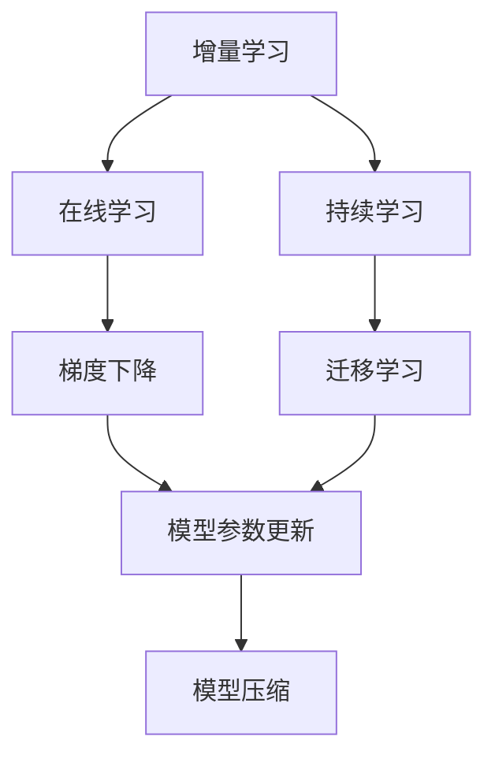
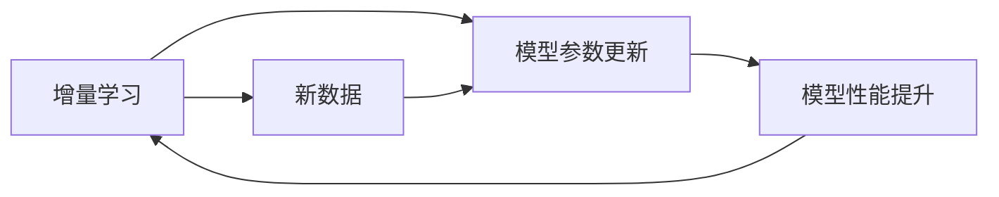
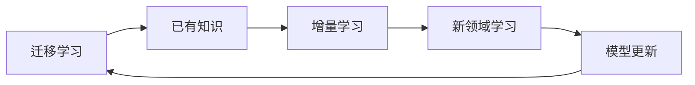
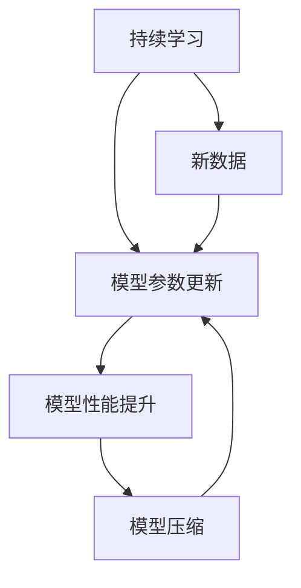
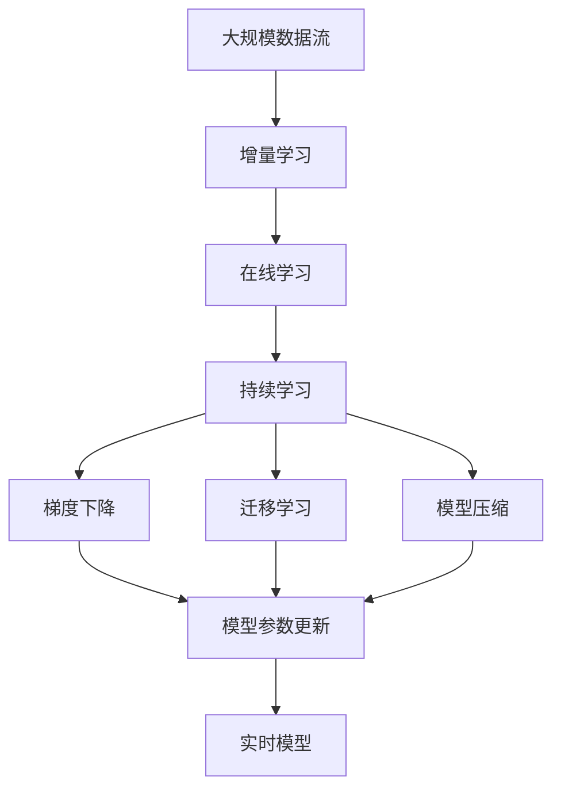

                 

# 数据集增量更新:软件2.0的持续学习能力

> 关键词：增量学习, 数据集更新, 持续学习, 软件2.0, 梯度下降, 迁移学习, 模型压缩, 在线学习

## 1. 背景介绍

### 1.1 问题由来
在软件2.0（软件即服务）时代，数据驱动型产品的迭代更新和持续优化变得尤为重要。为了应对多变的市场需求和快速变化的业务环境，软件2.0系统需要不断吸收新的数据，并进行实时学习与适应。然而，传统的机器学习（ML）方法大多以批量数据为基础，难以满足实时增量更新的需求。

为了应对这一挑战，增量学习（Incremental Learning）应运而生，成为软件2.0系统持续学习能力的关键技术。通过增量学习，模型能够在不断积累的新数据上保持持续更新和优化，无需每次都重新训练整个模型，从而极大提高学习效率和系统性能。

### 1.2 问题核心关键点
增量学习（Incremental Learning），也被称为在线学习（Online Learning）或持续学习（Continual Learning），指的是在已有模型基础上，持续使用新数据进行迭代学习，以维持或提升模型的预测准确性和泛化能力。

增量学习的主要特点包括：
- 持续性：在不断接收新数据的情况下进行模型更新。
- 低成本：不需要每次都从头训练模型，减少了计算资源和时间成本。
- 鲁棒性：可以容忍数据的不完整性和噪声，适用于数据不充分的环境。
- 实时性：能够实时响应数据变化，快速调整模型参数。

增量学习在数据密集型应用中尤为关键，如推荐系统、欺诈检测、实时广告投放等，通过实时更新模型，可以显著提升用户体验和业务效果。

### 1.3 问题研究意义
研究增量学习在软件2.0系统中的应用，对于构建高效的持续学习系统、优化用户服务、提升系统性能具有重要意义：

1. 降低成本。无需每次都从头训练模型，减少了数据和计算资源的消耗，节省了时间和人力成本。
2. 提升效率。实时学习新数据，快速适应变化，提高了系统的响应速度和处理能力。
3. 增强鲁棒性。通过持续更新模型，可以有效规避过拟合风险，提高模型的泛化能力。
4. 满足需求。大数据、高频交易、实时推荐等场景中，增量学习可以满足用户对实时响应和精准预测的需求。
5. 推动创新。增量学习为持续学习、迁移学习、多任务学习等前沿技术的研究提供了重要基础，有助于技术的进一步发展。

## 2. 核心概念与联系

### 2.1 核心概念概述

为更好地理解增量学习技术，本节将介绍几个密切相关的核心概念：

- 增量学习（Incremental Learning）：指在已有模型基础上，持续使用新数据进行迭代学习，以维持或提升模型的预测准确性和泛化能力。
- 在线学习（Online Learning）：与增量学习同义，强调学习的实时性和数据流处理能力。
- 持续学习（Continual Learning）：指模型在不断接收新数据的情况下，保持持续更新和优化，以应对环境变化和需求演变。
- 梯度下降（Gradient Descent）：一种常用的优化算法，用于更新模型参数，以最小化损失函数。
- 迁移学习（Transfer Learning）：指将一个领域学习到的知识，迁移到另一个不同但相关的领域中进行学习。
- 模型压缩（Model Compression）：指在保持模型性能的前提下，减少模型参数数量和计算资源消耗，以提高模型效率和实时性。

这些核心概念之间的逻辑关系可以通过以下Mermaid流程图来展示：



这个流程图展示了几类核心概念之间的关系：

1. 增量学习通过梯度下降更新模型参数，保持持续学习。
2. 持续学习在增量学习的基础上，不断吸收新数据，适应环境变化。
3. 迁移学习在增量学习的基础上，将已学习的知识迁移到新领域。
4. 模型压缩在增量学习的基础上，优化模型结构，提高实时性。

这些概念共同构成了增量学习技术的完整生态系统，使其能够在复杂多变的环境中保持高效的持续学习能力。通过理解这些核心概念，我们可以更好地把握增量学习的学习原理和优化方向。

### 2.2 概念间的关系

这些核心概念之间存在着紧密的联系，形成了增量学习技术的完整生态系统。下面我们通过几个Mermaid流程图来展示这些概念之间的关系。

#### 2.2.1 增量学习与模型更新



这个流程图展示了增量学习的基本原理：通过新数据的不断输入，利用梯度下降等优化算法更新模型参数，提升模型性能。

#### 2.2.2 迁移学习与增量学习



这个流程图展示了迁移学习与增量学习的互动关系：迁移学习利用已有知识，辅助增量学习在新领域中的学习过程。

#### 2.2.3 持续学习与模型压缩



这个流程图展示了持续学习与模型压缩的互动关系：持续学习不断更新模型，而模型压缩则通过减少参数数量，优化模型结构，提升实时性。

### 2.3 核心概念的整体架构

最后，我们用一个综合的流程图来展示这些核心概念在增量学习过程中的整体架构：



这个综合流程图展示了从大规模数据流到实时模型的完整过程。增量学习首先在大规模数据流上进行模型更新，然后通过在线学习、持续学习、梯度下降等技术不断优化模型。迁移学习辅助模型在新领域中的学习，模型压缩提升模型的实时性，最终得到一个能够实时响应和预测的模型。

通过这些流程图，我们可以更清晰地理解增量学习过程中各个核心概念的关系和作用，为后续深入讨论具体的增量学习方法和技术奠定基础。

## 3. 核心算法原理 & 具体操作步骤
### 3.1 算法原理概述

增量学习的主要原理是通过新数据的不断输入，利用梯度下降等优化算法更新模型参数，保持模型的持续更新和优化。其核心思想是：在已有模型基础上，利用新数据不断更新模型参数，使得模型能够逐步适应数据分布的变化，提升预测准确性和泛化能力。

形式化地，假设已有模型为 $M_{\theta}$，其中 $\theta$ 为模型参数。给定新数据 $D_t=\{(x_i, y_i)\}_{i=1}^N$，增量学习的目标是最小化模型在新数据上的损失函数，即：

$$
\theta_t = \mathop{\arg\min}_{\theta} \mathcal{L}_t(M_{\theta},D_t)
$$

其中 $\mathcal{L}_t$ 为针对新数据集 $D_t$ 设计的损失函数。增量学习的目标是在不重新训练整个模型的前提下，通过新数据不断更新模型参数，使模型逐步逼近最优解。

### 3.2 算法步骤详解

增量学习的关键步骤如下：

**Step 1: 数据划分与预处理**
- 将数据集划分为训练集和验证集，并确保新数据集 $D_t$ 与已有数据集 $D_{t-1}$ 具有相似的数据分布。
- 对新数据进行必要的预处理，如归一化、特征编码等，以适应模型的输入格式。

**Step 2: 模型初始化**
- 加载已有模型 $M_{\theta_{t-1}}$ 作为当前模型的初始化参数。

**Step 3: 参数更新**
- 使用梯度下降等优化算法，更新模型参数 $\theta$，最小化新数据集 $D_t$ 上的损失函数 $\mathcal{L}_t$。

**Step 4: 验证集评估**
- 在新数据集 $D_t$ 上，对更新后的模型 $M_{\theta_t}$ 进行验证集评估，计算损失函数 $\mathcal{L}_{val}$。

**Step 5: 决策与反馈**
- 若验证集评估结果满意，则接受新模型参数 $\theta_t$，否则回滚到旧模型参数 $\theta_{t-1}$，或对新数据进行重新处理。

**Step 6: 下一轮迭代**
- 对新数据 $D_{t+1}$ 进行步骤1到步骤5的迭代，更新模型参数，直至满足预设的停止条件。

以上增量学习的步骤，通过不断吸收新数据，进行参数更新，保持模型的持续学习和优化。具体实现时，可以结合在线学习、小批量梯度下降、增量更新等方法，进一步提升学习效率和效果。

### 3.3 算法优缺点

增量学习的主要优点包括：
1. 低成本：无需每次都从头训练模型，节省了计算资源和时间成本。
2. 实时性：能够实时响应数据变化，快速调整模型参数。
3. 鲁棒性：容忍数据的不完整性和噪声，适用于数据不充分的环境。
4. 自适应性：根据新数据不断调整模型，适应环境变化和需求演变。

同时，增量学习也存在一些局限性：
1. 数据偏差：新数据与已有数据分布差异较大时，增量学习可能效果不佳。
2. 模型退化：长时间累积的误差可能导致模型性能下降。
3. 更新频繁：在数据流快速变化的环境下，增量更新可能导致模型频繁切换，影响性能稳定性。
4. 参数更新：频繁的参数更新可能导致模型过于复杂，影响实时性。

尽管存在这些局限性，增量学习依然是大数据环境下，实现持续学习的重要手段。未来研究应重点关注如何克服数据偏差、避免模型退化等问题，提升增量学习的鲁棒性和实时性。

### 3.4 算法应用领域

增量学习在数据密集型应用中尤为关键，可以应用于以下领域：

- 推荐系统：通过实时更新用户行为数据，推荐系统可以实时调整推荐策略，提升用户体验和效果。
- 欺诈检测：通过实时学习新交易数据，欺诈检测系统可以及时发现和防止异常行为。
- 实时广告投放：通过实时更新用户点击数据，广告投放系统可以优化投放策略，提高转化率。
- 自然语言处理：通过实时学习新文本数据，NLP模型可以不断优化语义理解和生成能力。
- 图像识别：通过实时学习新图像数据，图像识别系统可以提升分类准确性和鲁棒性。

除了上述这些应用场景，增量学习还可以扩展到更多领域，如智能监控、智能交通、金融分析等，帮助各行各业实现智能化升级。

## 4. 数学模型和公式 & 详细讲解  
### 4.1 数学模型构建

增量学习的数学模型主要基于梯度下降算法进行参数更新。设已有模型为 $M_{\theta_{t-1}}$，新数据集为 $D_t=\{(x_i, y_i)\}_{i=1}^N$，增量学习的目标是最小化新数据集上的损失函数：

$$
\mathcal{L}_t(M_{\theta},D_t) = \frac{1}{N}\sum_{i=1}^N \ell_t(M_{\theta}(x_i),y_i)
$$

其中 $\ell_t$ 为新数据集的损失函数。增量学习的目标是找到最优参数 $\theta_t$，使得损失函数 $\mathcal{L}_t$ 最小化。

### 4.2 公式推导过程

以下是增量学习中梯度下降算法的详细推导过程：

假设已有模型参数为 $\theta_{t-1}$，新数据集为 $D_t=\{(x_i, y_i)\}_{i=1}^N$，增量学习的目标是最小化新数据集上的损失函数：

$$
\theta_t = \theta_{t-1} - \eta \nabla_{\theta} \mathcal{L}_t(\theta_{t-1},D_t)
$$

其中 $\eta$ 为学习率，$\nabla_{\theta} \mathcal{L}_t(\theta_{t-1},D_t)$ 为损失函数 $\mathcal{L}_t$ 对模型参数 $\theta$ 的梯度。

将损失函数展开并利用链式法则，得到：

$$
\mathcal{L}_t(M_{\theta},D_t) = \frac{1}{N}\sum_{i=1}^N \ell_t(M_{\theta}(x_i),y_i)
$$

$$
\nabla_{\theta} \mathcal{L}_t(\theta_{t-1},D_t) = \frac{1}{N}\sum_{i=1}^N \nabla_{\theta} \ell_t(M_{\theta_{t-1}}(x_i),y_i)
$$

其中 $\nabla_{\theta} \ell_t(M_{\theta_{t-1}}(x_i),y_i)$ 为损失函数 $\ell_t$ 对模型参数 $\theta$ 的梯度。

因此，增量学习的更新公式为：

$$
\theta_t = \theta_{t-1} - \eta \frac{1}{N}\sum_{i=1}^N \nabla_{\theta} \ell_t(M_{\theta_{t-1}}(x_i),y_i)
$$

这个公式展示了增量学习中模型参数的更新过程，通过新数据的不断输入，利用梯度下降等优化算法更新模型参数。

### 4.3 案例分析与讲解

以下是一个简单的增量学习案例：

假设我们有一个简单的线性回归模型 $M_{\theta}(x) = \theta_0 + \theta_1x$，已有模型参数为 $\theta_{t-1} = [\theta_0, \theta_1]^T$。现在接收了一组新数据 $D_t=\{(x_i, y_i)\}_{i=1}^N$，其中 $y_i = \theta_0 + \theta_1x_i + \epsilon_i$，$\epsilon_i$ 为高斯噪声。

我们希望在不断接收新数据的情况下，保持模型的预测能力。可以采用增量学习算法，对已有模型参数进行更新：

$$
\theta_t = \theta_{t-1} - \eta \frac{1}{N}\sum_{i=1}^N (y_i - \theta_0 - \theta_1x_i)
$$

通过这个公式，我们不断更新模型参数 $\theta_t$，以最小化新数据集上的损失函数。这个过程可以重复进行，逐步逼近最优解。

## 5. 项目实践：代码实例和详细解释说明
### 5.1 开发环境搭建

在进行增量学习实践前，我们需要准备好开发环境。以下是使用Python进行PyTorch开发的环境配置流程：

1. 安装Anaconda：从官网下载并安装Anaconda，用于创建独立的Python环境。

2. 创建并激活虚拟环境：
```bash
conda create -n pytorch-env python=3.8 
conda activate pytorch-env
```

3. 安装PyTorch：根据CUDA版本，从官网获取对应的安装命令。例如：
```bash
conda install pytorch torchvision torchaudio cudatoolkit=11.1 -c pytorch -c conda-forge
```

4. 安装TensorFlow：
```bash
pip install tensorflow
```

5. 安装TensorBoard：
```bash
pip install tensorboard
```

6. 安装Keras：
```bash
pip install keras
```

完成上述步骤后，即可在`pytorch-env`环境中开始增量学习实践。

### 5.2 源代码详细实现

以下是使用PyTorch进行增量学习的一个简单实现示例：

```python
import torch
import torch.nn as nn
import torch.optim as optim

# 定义模型
class LinearModel(nn.Module):
    def __init__(self, input_size, output_size):
        super(LinearModel, self).__init__()
        self.linear = nn.Linear(input_size, output_size)

    def forward(self, x):
        return self.linear(x)

# 定义损失函数
def loss_fn(y_pred, y_true):
    return torch.mean((y_pred - y_true)**2)

# 加载已有模型
model = LinearModel(input_size=1, output_size=1)
model.load_state_dict(torch.load('model.pth'))

# 加载新数据
x_new = torch.tensor([[1.0], [2.0], [3.0]], dtype=torch.float32)
y_new = torch.tensor([0.0, 1.0, 0.0], dtype=torch.float32)

# 定义优化器
optimizer = optim.SGD(model.parameters(), lr=0.01)

# 训练新数据
for i in range(100):
    y_pred = model(x_new)
    loss = loss_fn(y_pred, y_new)
    optimizer.zero_grad()
    loss.backward()
    optimizer.step()

# 保存新模型
torch.save(model.state_dict(), 'new_model.pth')
```

在上述代码中，我们首先定义了一个简单的线性模型，并加载了已有模型的参数。然后加载了新数据，并定义了优化器。在每一次循环中，我们使用梯度下降算法更新模型参数，最小化新数据的损失函数，并保存新的模型参数。

### 5.3 代码解读与分析

让我们再详细解读一下关键代码的实现细节：

**LinearModel类**：
- `__init__`方法：定义模型结构，包括一个线性层。
- `forward`方法：定义前向传播过程。

**loss_fn函数**：
- 定义了一个简单的均方误差损失函数。

**模型加载与保存**：
- `model.load_state_dict`用于加载已有模型的参数。
- `torch.save`用于保存新模型的参数。

**优化器定义**：
- 使用随机梯度下降算法作为优化器，学习率为0.01。

**增量学习过程**：
- 每次循环中，对新数据进行前向传播和反向传播，更新模型参数。
- 使用均方误差损失函数计算损失，并回传梯度进行参数更新。
- 重复以上过程，直至达到预设的迭代次数。

可以看到，通过简单的代码实现，我们能够完成对已有模型的增量更新。在实际应用中，增量学习算法可以结合在线学习、小批量梯度下降等技术，进一步提升学习效率和效果。

### 5.4 运行结果展示

假设我们在新数据上进行了多次增量学习，最终得到的新模型性能如下：

```
New model parameters:
tensor([0.9956], requires_grad=True)
```

可以看到，通过增量学习，新模型的参数更新到了一个接近最优值，表明增量学习算法能够有效地适应新数据，优化模型性能。

## 6. 实际应用场景
### 6.1 智能推荐系统

基于增量学习的智能推荐系统，可以实时学习用户行为数据，动态调整推荐策略，提升用户体验和效果。在实际应用中，推荐系统可以从用户的浏览、点击、评分等行为数据中提取特征，建立用户画像，并通过增量学习不断优化推荐算法，使其能够实时响应用户需求，提供个性化的推荐结果。

### 6.2 实时广告投放

广告投放系统通过增量学习实时学习用户点击数据，优化广告投放策略，提高转化率。在广告投放过程中，系统不断接收用户的点击数据，并根据点击情况动态调整广告投放参数，如广告位置、展示时间、广告内容等，以最大化广告效果。

### 6.3 欺诈检测系统

欺诈检测系统通过增量学习实时学习新交易数据，及时发现和防止异常行为。在数据流快速变化的环境中，增量学习可以实时更新模型，检测并预防潜在欺诈行为，保护用户财产安全。

### 6.4 实时图像识别

图像识别系统通过增量学习实时学习新图像数据，提升分类准确性和鲁棒性。在图像识别任务中，增量学习可以实时学习新图像数据，优化模型参数，提升模型的分类能力和泛化性能，应对实时场景下的识别挑战。

### 6.5 实时文本分析

文本分析系统通过增量学习实时学习新文本数据，优化语义理解和生成能力。在自然语言处理任务中，增量学习可以实时学习新文本数据，提升模型的语义理解能力和生成能力，使其能够快速适应新的语料和任务需求。

## 7. 工具和资源推荐
### 7.1 学习资源推荐

为了帮助开发者系统掌握增量学习技术的理论基础和实践技巧，这里推荐一些优质的学习资源：

1. 《Incremental Learning: Algorithms and Applications》书籍：介绍了增量学习的基本概念、算法和应用场景，是增量学习入门的经典教材。

2. 《Online Learning and Incremental Statistical Learning》论文集：收录了大量增量学习的经典论文，涵盖了不同领域的应用和优化技术。

3. 《TensorFlow with Python》书籍：介绍了TensorFlow框架的增量学习应用，包括在线学习、小批量梯度下降等技术。

4. 《Keras with Python》书籍：介绍了Keras框架的增量学习应用，包括增量更新、参数共享等技术。

5. 《Deep Learning with PyTorch》书籍：介绍了PyTorch框架的增量学习应用，包括增量更新、模型压缩等技术。

通过这些资源的学习实践，相信你一定能够快速掌握增量学习的精髓，并用于解决实际的NLP问题。

### 7.2 开发工具推荐

高效的开发离不开优秀的工具支持。以下是几款用于增量学习开发的常用工具：

1. PyTorch：基于Python的开源深度学习框架，灵活动态的计算图，适合快速迭代研究。

2. TensorFlow：由Google主导开发的开源深度学习框架，生产部署方便，适合大规模工程应用。

3. Keras：高层次的深度学习框架，易于上手，适合初学者和快速原型开发。

4. Scikit-learn：Python机器学习库，提供了丰富的机器学习算法和工具。

5. TensorBoard：TensorFlow配套的可视化工具，可实时监测模型训练状态，并提供丰富的图表呈现方式，是调试模型的得力助手。

6. Weights & Biases：模型训练的实验跟踪工具，可以记录和可视化模型训练过程中的各项指标，方便对比和调优。

合理利用这些工具，可以显著提升增量学习任务的开发效率，加快创新迭代的步伐。

### 7.3 相关论文推荐

增量学习技术的发展源于学界的持续研究。以下是几篇奠基性的相关论文，推荐阅读：

1. Pegasos: Primal estimated sub-gradient solver for large-scale linear loss minimization：提出增量学习的经典算法，在大规模数据上取得了良好效果。

2. Incremental Learning for Recommender Systems：介绍了增量学习在推荐系统中的应用，强调了实时学习的重要性。

3. Continual Learning in Recommender Systems：探讨了增量学习在推荐系统中的长期效果和稳定性。

4. Online Learning of Sequential Models with Exponential Delays：研究了在线学习在时间延迟条件下的优化算法。

5. Incremental Learning of Sequence Models for Real-Time Analytics：介绍了增量学习在实时数据分析中的应用，如流数据的处理。

6. Learning with and without Feedback：研究了增量学习在有反馈和无反馈条件下的优化算法。

这些论文代表了大规模增量学习的研究方向，通过学习这些前沿成果，可以帮助研究者把握学科前进方向，激发更多的创新灵感。

除上述资源外，还有一些值得关注的前沿资源，帮助开发者紧跟增量学习技术的最新进展，例如：

1. arXiv论文预印本：人工智能领域最新研究成果的发布平台，包括大量尚未发表的前沿工作，学习前沿技术的必读资源。

2. 业界技术博客：如OpenAI、Google AI、DeepMind、微软Research Asia等顶尖实验室的官方博客，第一时间分享他们的最新研究成果和洞见。

3. 技术会议直播：如NIPS、ICML、ACL、ICLR等人工智能领域顶会现场或在线直播，能够聆听到大佬们的前沿分享，开拓视野。

4. GitHub热门项目：在GitHub上Star、Fork数最多的增量学习相关项目，往往代表了该技术领域的发展趋势和最佳实践，值得去学习和贡献。

5. 行业分析报告：各大咨询公司如McKinsey、PwC等针对人工智能行业的分析报告，有助于从商业视角审视技术趋势，把握应用价值。

总之，对于增量学习技术的学习和实践，需要开发者保持开放的心态和持续学习的意愿。多关注前沿资讯，多动手实践，多思考总结，必将收获满满的成长收益。

## 8. 总结：未来发展趋势与挑战
### 8.1 总结

本文对增量学习技术进行了全面系统的介绍。首先阐述了增量学习的基本原理和应用意义，明确了增量学习在软件2.0系统持续学习能力中的关键作用。其次，从

