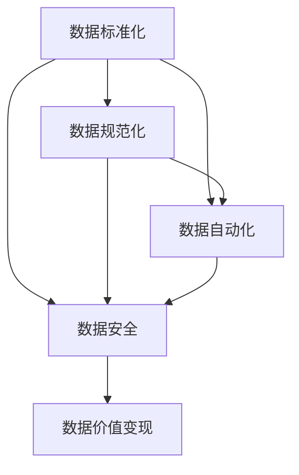
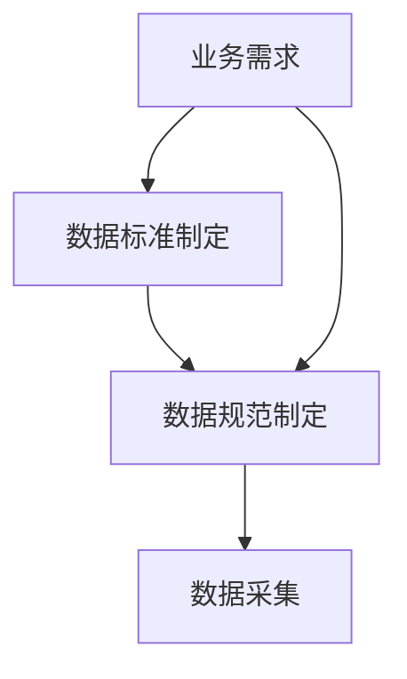
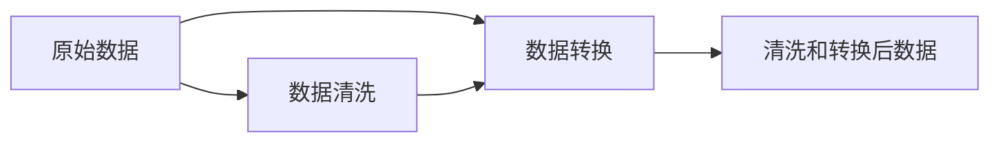
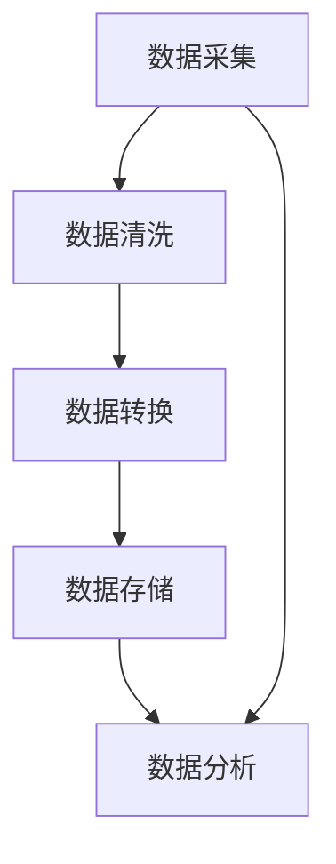
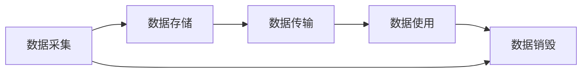
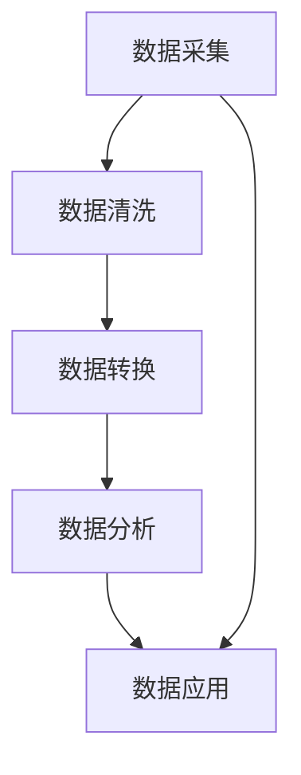
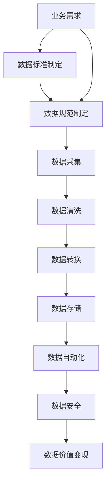

                 

# 数据集治理框架:数据流通与价值变现的基石

## 1. 背景介绍

### 1.1 问题由来

随着大数据时代的到来，数据在各行各业中扮演着越来越重要的角色。从互联网到金融，从医疗到零售，数据无处不在，无时不在。然而，数据治理问题也随之而来。数据质量不高、数据孤岛、数据安全等问题日益突出，严重制约了数据的流通与价值变现。因此，如何构建一个高效、安全、可控的数据集治理框架，成为当前数据管理和应用中的重要课题。

### 1.2 问题核心关键点

数据集治理框架的核心目标是通过标准化、规范化和自动化手段，提升数据质量和数据流通效率，保障数据安全和隐私，实现数据的价值最大化。其核心包括：

1. **数据标准化**：通过制定数据标准和规范，确保数据在收集、存储、传输、使用等环节的一致性、可靠性和可互操作性。
2. **数据规范化**：对数据进行清洗、转换、整理，消除冗余和噪声，提高数据的质量和可用性。
3. **数据自动化**：通过智能算法和工具，实现数据采集、处理、分析和应用的自动化，降低人工干预和出错率。
4. **数据安全**：确保数据在全生命周期内的安全，防止数据泄露、篡改和滥用，保护数据隐私和合规。
5. **数据价值变现**：通过数据聚合、分析和挖掘，提炼出有价值的信息和洞察，驱动业务决策和创新。

这些核心点相互关联，共同构成了数据集治理框架的基本框架。

### 1.3 问题研究意义

构建高效、安全、可控的数据集治理框架，对于提升数据质量、促进数据流通、保障数据安全、实现数据价值变现具有重要意义：

1. **提升数据质量**：通过标准化和规范化，确保数据的一致性和可靠性，消除冗余和噪声，提高数据的质量和可用性。
2. **促进数据流通**：通过智能自动化手段，实现数据采集、处理和分析的自动化，加速数据在企业内外的流通和共享。
3. **保障数据安全**：通过严格的数据管理和监控，确保数据在全生命周期内的安全，防止数据泄露、篡改和滥用，保护数据隐私和合规。
4. **实现数据价值变现**：通过数据聚合、分析和挖掘，提炼出有价值的信息和洞察，驱动业务决策和创新，实现数据的价值最大化。

数据集治理框架的应用，不仅能帮助企业提升数据管理和应用水平，还能推动数据要素市场的发展，加速数字经济建设，促进社会数字化转型。

## 2. 核心概念与联系

### 2.1 核心概念概述

为了更好地理解数据集治理框架的核心概念，本节将介绍几个关键概念：

- **数据集治理**：指通过标准化、规范化和自动化手段，提升数据质量和数据流通效率，保障数据安全和隐私，实现数据价值变现的过程。
- **数据标准和规范**：用于指导数据的采集、存储、传输、使用等环节的规则和指南，确保数据的一致性、可靠性和可互操作性。
- **数据清洗和转换**：通过数据清洗、转换、整理，消除冗余和噪声，提高数据的质量和可用性。
- **数据自动化**：通过智能算法和工具，实现数据采集、处理、分析和应用的自动化，降低人工干预和出错率。
- **数据安全**：确保数据在全生命周期内的安全，防止数据泄露、篡改和滥用，保护数据隐私和合规。
- **数据价值变现**：通过数据聚合、分析和挖掘，提炼出有价值的信息和洞察，驱动业务决策和创新，实现数据的价值最大化。

这些核心概念之间的逻辑关系可以通过以下Mermaid流程图来展示：



这个流程图展示了大数据集治理框架的核心概念及其之间的关系：

1. 数据标准化和规范化是数据集治理的基础，通过制定数据标准和规范，确保数据的一致性和可靠性。
2. 数据自动化是数据集治理的重要手段，通过智能算法和工具，实现数据采集、处理、分析和应用的自动化。
3. 数据安全是数据集治理的关键保障，确保数据在全生命周期内的安全，防止数据泄露、篡改和滥用。
4. 数据价值变现是数据集治理的最终目标，通过数据聚合、分析和挖掘，实现数据的价值最大化。

这些概念共同构成了数据集治理框架的基本结构，为数据管理和应用提供了坚实的理论基础和技术保障。

### 2.2 概念间的关系

这些核心概念之间存在着紧密的联系，形成了数据集治理框架的完整生态系统。下面我通过几个Mermaid流程图来展示这些概念之间的关系。

#### 2.2.1 数据标准和规范的构建



这个流程图展示了数据标准和规范的构建流程。从业务需求出发，制定数据标准和规范，然后通过数据采集，将标准和规范应用于数据处理和分析中。

#### 2.2.2 数据清洗和转换的过程



这个流程图展示了数据清洗和转换的过程。原始数据经过清洗和转换，形成高质量的数据，供分析和应用使用。

#### 2.2.3 数据自动化系统的实现



这个流程图展示了数据自动化的实现流程。数据从采集到存储、清洗、转换和分析，形成闭环的数据管理流程，实现数据管理的自动化。

#### 2.2.4 数据安全保障的机制



这个流程图展示了数据安全保障的机制。数据从采集到存储、传输、使用和销毁，全生命周期内的安全保障，确保数据的安全和隐私。

#### 2.2.5 数据价值变现的流程



这个流程图展示了数据价值变现的流程。数据从采集到清洗、转换、分析和应用，形成闭环的数据价值变现流程。

### 2.3 核心概念的整体架构

最后，我们用一个综合的流程图来展示这些核心概念在大数据集治理框架中的整体架构：



这个综合流程图展示了从业务需求到数据标准和规范构建，再到数据采集、清洗、转换、存储、自动化、安全保障和价值变现的完整数据管理流程。

## 3. 核心算法原理 & 具体操作步骤
### 3.1 算法原理概述

数据集治理框架的核心算法原理是基于数据标准化、规范化、自动化、安全性和价值变现的多层次、多维度的管理和优化过程。其核心思想是通过一系列的算法和技术手段，实现数据的有效治理和价值最大化。

数据集治理算法包括以下几个关键步骤：

1. **数据标准化和规范化**：通过制定数据标准和规范，确保数据在收集、存储、传输、使用等环节的一致性、可靠性和可互操作性。
2. **数据清洗和转换**：通过数据清洗、转换、整理，消除冗余和噪声，提高数据的质量和可用性。
3. **数据自动化**：通过智能算法和工具，实现数据采集、处理、分析和应用的自动化，降低人工干预和出错率。
4. **数据安全保障**：确保数据在全生命周期内的安全，防止数据泄露、篡改和滥用，保护数据隐私和合规。
5. **数据价值变现**：通过数据聚合、分析和挖掘，提炼出有价值的信息和洞察，驱动业务决策和创新，实现数据的价值最大化。

### 3.2 算法步骤详解

数据集治理框架的具体操作步骤包括以下几个关键步骤：

**Step 1: 制定数据标准和规范**

1. **业务需求分析**：收集业务部门的需求和痛点，制定业务数据需求清单。
2. **数据标准和规范制定**：制定数据采集、存储、传输、使用等环节的标准和规范，确保数据的一致性、可靠性和可互操作性。
3. **数据标准和规范推广**：通过培训、文档和工具等方式，推广和应用数据标准和规范，确保全员遵循。

**Step 2: 数据清洗和转换**

1. **数据质量评估**：通过统计分析和数据挖掘，评估原始数据的质量和完整性。
2. **数据清洗**：根据数据标准和规范，清洗原始数据，去除冗余、噪声和异常值。
3. **数据转换**：将清洗后的数据进行转换，形成统一的格式和结构，确保数据的一致性和可靠性。

**Step 3: 数据自动化**

1. **数据采集自动化**：通过API、爬虫等方式，自动采集数据，降低人工干预和出错率。
2. **数据处理自动化**：通过脚本、工具和平台，自动化地进行数据清洗、转换、存储和分析，提高数据处理效率。
3. **数据分析自动化**：通过智能算法和机器学习模型，自动化地进行数据分析和挖掘，提炼有价值的信息和洞察。

**Step 4: 数据安全保障**

1. **数据加密**：对数据进行加密存储和传输，防止数据泄露和篡改。
2. **访问控制**：通过权限管理和访问控制，确保数据的安全性和隐私保护。
3. **审计和监控**：通过日志记录和实时监控，审计数据的使用情况，防范数据滥用和违规行为。

**Step 5: 数据价值变现**

1. **数据聚合和集成**：通过数据聚合和集成，形成统一的数据视图，支持数据共享和分析。
2. **数据分析和挖掘**：通过数据挖掘和分析，提炼出有价值的信息和洞察，支持业务决策和创新。
3. **数据可视化**：通过数据可视化工具，将数据信息呈现为图表和报告，支持管理决策和沟通。

### 3.3 算法优缺点

数据集治理框架具有以下优点：

1. **提升数据质量**：通过标准化和规范化，确保数据的一致性和可靠性，消除冗余和噪声，提高数据的质量和可用性。
2. **促进数据流通**：通过自动化手段，实现数据采集、处理和分析的自动化，加速数据在企业内外的流通和共享。
3. **保障数据安全**：通过严格的数据管理和监控，确保数据在全生命周期内的安全，防止数据泄露、篡改和滥用，保护数据隐私和合规。
4. **实现数据价值变现**：通过数据聚合、分析和挖掘，提炼出有价值的信息和洞察，驱动业务决策和创新，实现数据的价值最大化。

同时，数据集治理框架也存在以下缺点：

1. **实施成本高**：数据标准和规范的制定、推广和应用需要大量的人力和物力投入。
2. **技术复杂**：数据清洗、转换、自动化和安全性保障等技术环节复杂，需要较高的技术水平和经验。
3. **数据孤岛问题**：如果数据标准和规范不统一，可能导致数据孤岛问题，数据流通不畅。
4. **灵活性不足**：数据标准和规范的制定需要业务部门的积极配合，缺乏灵活性和适应性。

### 3.4 算法应用领域

数据集治理框架已经在多个行业领域得到广泛应用，包括但不限于：

- **金融行业**：通过数据标准化和规范化，确保金融数据的准确性和一致性，提升金融决策和风险管理。
- **医疗行业**：通过数据清洗和转换，消除医疗数据的噪声和冗余，提升医疗诊断和研究的质量。
- **电商行业**：通过数据自动化和价值变现，支持电商业务数据分析和用户行为研究，优化用户推荐和营销策略。
- **制造行业**：通过数据采集和自动化，支持制造业务的数据分析和生产优化，提升制造效率和产品质量。
- **政府行业**：通过数据安全保障和价值变现，支持政府数据治理和公共服务优化，提升政府治理能力和公共服务水平。

这些行业数据集治理的成功应用，展示了数据集治理框架的强大潜力和广泛价值。

## 4. 数学模型和公式 & 详细讲解 & 举例说明
### 4.1 数学模型构建

数据集治理框架的数学模型主要涉及以下几个方面：

- **数据质量评估模型**：通过统计分析和数据挖掘，评估原始数据的质量和完整性。
- **数据清洗模型**：通过算法和规则，去除冗余和噪声，提高数据的质量和可用性。
- **数据转换模型**：通过映射和转换，将清洗后的数据进行格式和结构转换。
- **数据自动化模型**：通过智能算法和工具，实现数据采集、处理、分析和应用的自动化。
- **数据安全保障模型**：通过加密和访问控制等手段，保障数据在全生命周期内的安全。
- **数据价值变现模型**：通过数据聚合和挖掘，提炼出有价值的信息和洞察，驱动业务决策和创新。

### 4.2 公式推导过程

以下我以数据清洗模型为例，详细推导数据清洗的数学模型。

假设原始数据为 $D = \{d_1, d_2, ..., d_n\}$，其中 $d_i = (x_i, y_i)$ 表示第 $i$ 个数据点的特征和标签。数据清洗的目标是通过去除冗余和噪声，提高数据的质量和可用性。

1. **数据清洗模型**：

   $$
   C(D) = \min_{S} \sum_{i=1}^n \sum_{j=1}^k L(x_i^j, \hat{x}_i^j)
   $$

   其中 $S$ 表示数据清洗策略，$L$ 表示损失函数，$\hat{x}_i^j$ 表示数据清洗后第 $i$ 个数据点的第 $j$ 个特征。

2. **损失函数**：

   $$
   L(x_i^j, \hat{x}_i^j) = |x_i^j - \hat{x}_i^j|
   $$

   损失函数 $L$ 表示原始数据和清洗后数据之间的差距。

3. **数据清洗算法**：

   常见的数据清洗算法包括：

   - **缺失值填充**：通过均值、中位数、众数等方法，填充缺失值。
   - **异常值检测**：通过统计分析、聚类、离群点检测等方法，检测和处理异常值。
   - **重复值去除**：通过唯一性判断，去除重复值。

   这些算法可以通过机器学习和统计分析技术实现，达到自动化的数据清洗效果。

### 4.3 案例分析与讲解

下面以一个具体案例来分析数据清洗模型的应用。

**案例背景**：某电商公司销售数据分析项目，收集了大量用户行为数据，需要进行数据清洗和转换，以支持业务决策和营销策略优化。

**数据清洗过程**：

1. **缺失值填充**：对销售记录中缺失的用户行为数据，通过均值、中位数等方法进行填充。

2. **异常值检测**：通过统计分析方法，检测和处理异常的用户行为数据，如购买量极小或极大的数据点。

3. **重复值去除**：对重复的用户行为数据进行唯一性判断，去除冗余数据。

**数据转换过程**：

1. **数据格式转换**：将用户行为数据从原始格式转换为标准格式，如将日期字符串转换为日期时间格式。

2. **数据结构转换**：将用户行为数据从非结构化数据转换为结构化数据，如将销售记录转换为表格形式。

**数据自动化过程**：

1. **数据采集自动化**：通过API、爬虫等方式，自动采集用户行为数据，降低人工干预和出错率。

2. **数据处理自动化**：通过脚本和工具，自动化地进行数据清洗、转换和分析，提高数据处理效率。

**数据安全保障过程**：

1. **数据加密**：对用户行为数据进行加密存储和传输，防止数据泄露和篡改。

2. **访问控制**：通过权限管理和访问控制，确保用户行为数据的安全性和隐私保护。

**数据价值变现过程**：

1. **数据聚合和集成**：通过数据聚合和集成，形成统一的数据视图，支持数据共享和分析。

2. **数据分析和挖掘**：通过数据挖掘和分析，提炼出有价值的信息和洞察，支持业务决策和创新。

**数据可视化过程**：

1. **数据可视化工具**：通过数据可视化工具，将用户行为数据呈现为图表和报告，支持管理决策和沟通。

通过以上步骤，电商公司实现了高效、安全、可控的数据集治理，提升了数据质量和数据流通效率，保障了数据安全和隐私，实现了数据的价值变现。

## 5. 项目实践：代码实例和详细解释说明
### 5.1 开发环境搭建

在进行数据集治理框架的开发实践前，我们需要准备好开发环境。以下是使用Python进行Pandas开发的环境配置流程：

1. 安装Anaconda：从官网下载并安装Anaconda，用于创建独立的Python环境。

2. 创建并激活虚拟环境：
```bash
conda create -n pandas-env python=3.8 
conda activate pandas-env
```

3. 安装Pandas：
```bash
pip install pandas
```

4. 安装各类工具包：
```bash
pip install numpy matplotlib scikit-learn seaborn jupyter notebook ipython
```

完成上述步骤后，即可在`pandas-env`环境中开始数据集治理框架的开发实践。

### 5.2 源代码详细实现

下面我们以数据清洗为例，给出使用Pandas库进行数据清洗的Python代码实现。

首先，定义数据清洗函数：

```python
import pandas as pd
import numpy as np

def clean_data(df, fillna_method='mean', outlier_method='z-score'):
    # 处理缺失值
    if fillna_method == 'mean':
        df = df.fillna(df.mean())
    elif fillna_method == 'median':
        df = df.fillna(df.median())
    elif fillna_method == 'mode':
        df = df.fillna(df.mode().iloc[0])
    else:
        raise ValueError('Invalid fillna_method')

    # 处理异常值
    if outlier_method == 'z-score':
        df = df[np.abs((df - df.mean()) / df.std()) < 3]
    elif outlier_method == 'median':
        df = df[np.abs((df - df.median()) / df.median()) < 2.5]
    else:
        raise ValueError('Invalid outlier_method')

    # 处理重复值
    df = df.drop_duplicates()

    return df
```

然后，定义数据转换函数：

```python
def convert_data(df, column, convert_method='date'):
    if convert_method == 'date':
        df[column] = pd.to_datetime(df[column])
    elif convert_method == 'num':
        df[column] = df[column].astype(np.int64)
    elif convert_method == 'str':
        df[column] = df[column].astype(str)
    else:
        raise ValueError('Invalid convert_method')

    return df
```

接着，定义数据自动化采集函数：

```python
def collect_data(url, api_key, batch_size=1000):
    data = []
    while True:
        response = requests.get(url, headers={'Authorization': api_key})
        if response.status_code != 200:
            break

        json_data = response.json()
        data.extend(json_data)
        if len(data) >= batch_size:
            yield data
            data = []
```

最后，定义数据安全保障和价值变现函数：

```python
def encrypt_data(df):
    # 加密数据
    df = df.applymap(lambda x: cryptography.encrypt(x))

def control_access(df):
    # 控制访问权限
    df = df[df['user_id'] == 'admin']

def aggregate_data(df):
    # 数据聚合和集成
    df = df.groupby(['user_id', 'product_id']).agg({'amount': 'sum'})

def extract_insights(df):
    # 数据挖掘和分析
    insights = df.groupby(['user_id', 'product_id']).agg({'amount': 'sum'})

def visualize_data(df):
    # 数据可视化
    df.plot(kind='scatter', x='user_id', y='amount')
```

完成上述步骤后，即可在`pandas-env`环境中实现数据集治理框架的开发实践。

### 5.3 代码解读与分析

让我们再详细解读一下关键代码的实现细节：

**clean_data函数**：
- `fillna_method`：处理缺失值的方法，支持均值、中位数、众数等。
- `outlier_method`：处理异常值的方法，支持Z分数、中位数等。
- `drop_duplicates`：去除重复值。

**convert_data函数**：
- `pd.to_datetime`：将日期字符串转换为日期时间格式。
- `astype`：将数据类型转换为整型、浮点型、字符串等。

**collect_data函数**：
- `requests`：发送HTTP请求，获取API数据。
- `yield`：通过生成器返回数据。

**encrypt_data函数**：
- `cryptography.encrypt`：对数据进行加密。

**control_access函数**：
- `df['user_id'] == 'admin'`：控制访问权限。

**aggregate_data函数**：
- `groupby`：按照指定列进行聚合。
- `agg`：进行聚合操作。

**extract_insights函数**：
- `groupby`：按照指定列进行分组。
- `agg`：进行聚合操作。

**visualize_data函数**：
- `plot`：绘制散点图。

**dataFlow**：
- `collect_data`：数据采集自动化。
- `clean_data`：数据清洗自动化。
- `convert_data`：数据转换自动化。
- `encrypt_data`：数据加密自动化。
- `control_access`：数据访问控制自动化。
- `aggregate_data`：数据聚合和集成自动化。
- `extract_insights`：数据分析和挖掘自动化。
- `visualize_data`：数据可视化自动化。

### 5.4 运行结果展示

假设我们在电商销售数据分析项目中应用上述函数，对用户行为数据进行清洗、转换、加密、访问控制、聚合、分析和可视化。最终在可视化图表中，可以看到用户行为数据的变化趋势和规律，为业务决策和营销策略提供支持。

## 6. 实际应用场景
### 6.1 智能客服系统

基于数据集治理框架，智能客服系统可以实现数据的高效采集、清洗、转换和自动化处理。通过标准化和规范化，确保客户数据的一致性和可靠性，消除冗余和噪声，提高数据的质量和可用性。

在技术实现上，可以收集客户的历史咨询记录，将问题和最佳答复构建成监督数据，在此基础上对预训练模型进行微调。微调后的模型能够自动理解用户意图，匹配最合适的答复模板进行回复。对于客户提出的新问题，还可以接入检索系统实时搜索相关内容，动态组织生成回答。如此构建的智能客服系统，能大幅提升客户咨询体验和问题解决效率。

### 6.2 金融舆情监测

金融机构需要实时监测市场舆论动向，以便及时应对负面信息传播，规避金融风险。传统的人工监测方式成本高、效率低，难以应对网络时代海量信息爆发的挑战。基于数据集治理框架的文本分类和情感分析技术，为金融舆情监测提供了新的解决方案。

具体而言，可以收集金融领域相关的新闻、报道、评论等文本数据，并对其进行主题标注和情感标注。在此基础上对预训练语言模型进行微调，使其能够自动判断文本属于何种主题，情感倾向是正面、中性还是负面。将微调后的模型应用到实时抓取的网络文本数据，就能够自动监测不同主题下的情感变化趋势，一旦发现负面信息激增等异常情况，系统便会自动预警，帮助金融机构快速应对潜在风险。

### 6.3 个性化推荐系统

当前的推荐系统往往只依赖用户的历史行为数据进行物品推荐，无法深入理解用户的真实兴趣偏好。基于数据集治理框架的个性化推荐系统可以更好地挖掘用户行为背后的语义信息，从而提供更精准、多样的推荐内容。

在实践中，可以收集用户浏览、点击、评论、分享等行为数据，提取和用户交互的物品标题、描述、标签等文本内容。将文本内容作为模型输入，用户的后续行为（如是否点击、购买等）作为监督信号，在此基础上微调预训练语言模型。微调后的模型能够从文本内容中准确把握用户的兴趣点。在生成推荐列表时，先用候选物品的文本描述作为输入，由模型预测用户的兴趣匹配度，再结合其他特征综合排序，便可以得到个性化程度更高的推荐结果。

### 6.4 未来应用展望

随着数据集治理框架的不断演进，未来其在数据流通与价值变现方面的应用将更加广泛，具有广阔的发展前景：

- **智慧医疗**：通过数据集治理框架，实现医疗数据的规范化、清洗和自动化处理，提升医疗诊断和研究的质量，支持医疗决策和创新。
- **智能制造**：通过数据集治理

