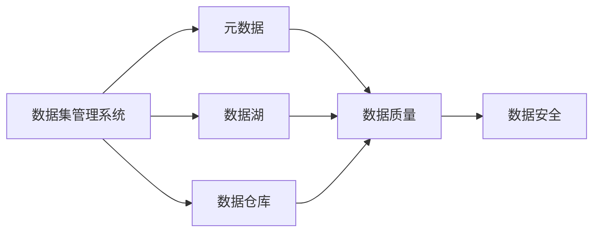
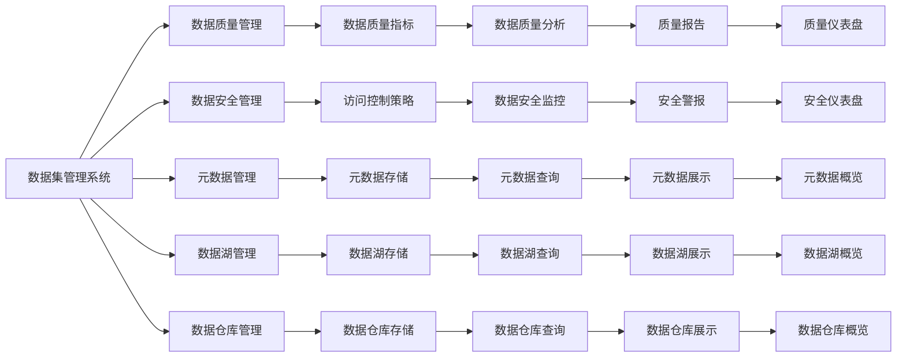
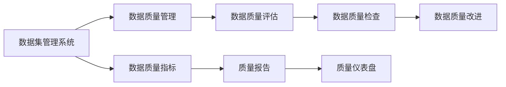
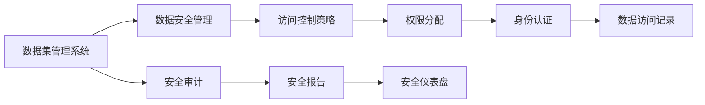
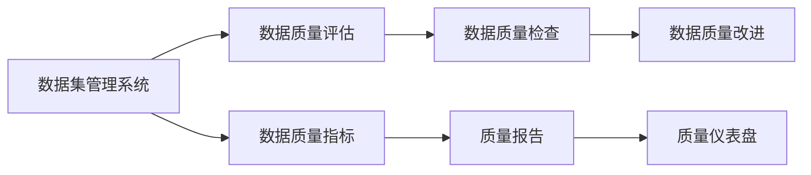
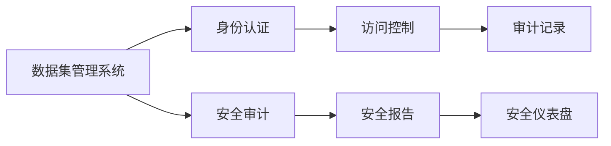

                 

# 数据集管理系统:元数据时代的新主角

## 1. 背景介绍

### 1.1 问题由来

在人工智能和大数据时代，数据集管理系统（Dataset Management System, DMS）成为了数据科学和机器学习领域的重要基础设施。随着数据量的爆炸式增长，各行各业对于数据的需求变得空前旺盛。数据集管理系统的目标是提供一个集中的、统一的、易用的平台，来存储、管理和处理数据集，以便于科学家和工程师高效地进行数据探索、模型训练和生产部署。

然而，传统的数据集管理系统面临着诸多挑战：
1. 数据存储分散，难以统一管理和共享。
2. 数据质量参差不齐，难以保证一致性和完整性。
3. 数据访问权限控制不严格，数据安全和隐私难以保障。
4. 数据集成复杂度高，数据融合和转换困难。
5. 元数据管理缺乏规范，数据溯源和可复现性难以保证。

为了应对这些挑战，元数据管理技术应运而生。元数据是一种关于数据的数据，包含了数据集的基本属性、结构和内容信息。通过对数据集的元数据进行全面管理，可以极大地提升数据集管理系统的效率和可靠性，使得数据科学家能够更加专注于数据挖掘和模型训练本身，而不必过多关注数据管理的技术细节。

## 2. 核心概念与联系

### 2.1 核心概念概述

为更好地理解元数据管理技术，本节将介绍几个密切相关的核心概念：

- 数据集管理系统（Dataset Management System, DMS）：一个用于存储、管理和共享数据集的集中式平台。DMS负责数据集的元数据管理、数据版本控制、数据访问权限控制等任务。
- 元数据（Metadata）：描述数据集基本属性、结构和内容的信息，包括数据源、数据格式、数据质量、数据结构等。
- 数据湖（Data Lake）：一种数据存储架构，以非结构化和半结构化数据的存储为主，支持大量异构数据源的数据集成和分析。
- 数据仓库（Data Warehouse）：一种数据存储架构，以结构化数据的存储为主，支持复杂的数据查询和分析。
- 数据质量（Data Quality）：衡量数据集准确性、完整性、一致性、及时性等特性的指标。
- 数据安全（Data Security）：保护数据集免受未经授权的访问、使用和泄露等风险的措施。

这些核心概念之间的逻辑关系可以通过以下Mermaid流程图来展示：



这个流程图展示了大数据管理系统的各个组成部分及其关系：

1. 数据集管理系统是数据湖和数据仓库的管理中枢，负责元数据的存储和查询。
2. 数据湖和数据仓库是数据集管理系统的底层存储架构，数据湖以非结构化数据为主，数据仓库以结构化数据为主。
3. 数据质量和数据安全是数据集管理系统的两个重要属性，分别用于衡量和管理数据集的质量和安全性。
4. 元数据是大数据管理系统的关键组成部分，是大数据管理系统有效运行的基础。

### 2.2 概念间的关系

这些核心概念之间存在着紧密的联系，形成了大数据管理系统的完整生态系统。下面我们通过几个Mermaid流程图来展示这些概念之间的关系。

#### 2.2.1 数据集管理系统的功能架构



这个流程图展示了数据集管理系统的功能架构，包含数据质量管理、数据安全管理、元数据管理、数据湖管理和数据仓库管理等模块。每个模块负责特定的功能，通过元数据管理进行数据的统一管理和共享。

#### 2.2.2 数据集管理系统与数据质量



这个流程图展示了数据集管理系统与数据质量管理之间的关系。数据集管理系统通过元数据管理，对数据集进行质量评估、质量检查和质量改进，并通过质量报告和质量仪表盘进行展示。

#### 2.2.3 数据集管理系统与数据安全



这个流程图展示了数据集管理系统与数据安全管理之间的关系。数据集管理系统通过元数据管理，对数据集进行访问控制、权限分配和身份认证，并通过安全审计和安全报告进行展示。

## 3. 核心算法原理 & 具体操作步骤
### 3.1 算法原理概述

元数据管理技术的核心算法原理主要围绕以下几个方面展开：

- **数据集元数据建模**：构建元数据模型，描述数据集的基本属性、结构和内容信息。
- **元数据存储与查询**：设计元数据存储架构，支持高效的数据查询和访问。
- **数据质量监控与改进**：利用数据质量指标和数据质量评估方法，对数据集进行实时监控和改进。
- **数据安全管理与访问控制**：实现数据访问权限控制和审计功能，保障数据安全和隐私。

### 3.2 算法步骤详解

#### 3.2.1 数据集元数据建模

数据集元数据建模是元数据管理的第一步，需要定义元数据的基本结构和属性。常见的元数据模型包括：

- 数据集元数据模型（Dataset Metadata Model）：描述了数据集的基本属性、来源、结构、内容等信息。
- 数据集元数据架构（Dataset Metadata Architecture）：描述了数据集的层次结构、关系和关联。

以下是一个简单的元数据模型示例：

```json
{
    "dataset": {
        "id": "d1",
        "name": "Sales Data",
        "description": "Sales data from various companies",
        "source": {
            "uri": "http://example.com/sales/data",
            "format": "CSV"
        },
        "columns": [
            {
                "name": "date",
                "type": "date",
                "nullable": false
            },
            {
                "name": "company",
                "type": "string",
                "nullable": false
            },
            {
                "name": "revenue",
                "type": "float",
                "nullable": true
            }
        ]
    }
}
```

这个示例定义了一个名为"Sales Data"的数据集，包括其基本信息、来源和列信息。每个字段都有明确的类型和可空性定义，可以用于数据集的元数据存储和查询。

#### 3.2.2 元数据存储与查询

数据集元数据的存储与查询是大数据管理系统的重要组成部分。常见的元数据存储架构包括：

- 关系型数据库（RDBMS）：通过关系表存储元数据，支持复杂的查询和事务操作。
- 图形数据库（Graph Database）：通过图结构存储元数据，支持高效的关联查询和路径查找。
- 文档数据库（Document Database）：通过文档结构存储元数据，支持灵活的数据模型和存储结构。

以下是使用关系型数据库存储元数据的示例：

```sql
CREATE TABLE datasets (
    id VARCHAR(32),
    name VARCHAR(255),
    description VARCHAR(255),
    source_uri VARCHAR(255),
    source_format VARCHAR(255),
    created_at TIMESTAMP DEFAULT NOW(),
    updated_at TIMESTAMP DEFAULT NOW() ON UPDATE NOW()
);

CREATE TABLE columns (
    id VARCHAR(32),
    dataset_id VARCHAR(32),
    name VARCHAR(255),
    type VARCHAR(255),
    nullable BOOLEAN DEFAULT false,
    created_at TIMESTAMP DEFAULT NOW(),
    updated_at TIMESTAMP DEFAULT NOW() ON UPDATE NOW()
);
```

这个示例创建了两个表：datasets和columns，用于存储数据集和列的基本信息。元数据的查询可以使用SQL语句进行，例如：

```sql
SELECT * FROM datasets WHERE name = 'Sales Data';
SELECT * FROM columns WHERE dataset_id = 'd1';
```

#### 3.2.3 数据质量监控与改进

数据质量监控与改进是元数据管理的重要环节，需要定期对数据集进行质量评估和改进。常见的数据质量指标包括：

- 完整性（Completeness）：数据集是否完整，是否存在缺失值。
- 准确性（Accuracy）：数据集中的值是否准确，是否存在错误或异常值。
- 一致性（Consistency）：数据集中的值是否一致，是否存在冲突。
- 时效性（Timeliness）：数据集是否及时更新，是否存在过期数据。

以下是数据质量监控与改进的流程图：



这个流程图展示了数据集管理系统与数据质量监控与改进之间的关系。数据集管理系统通过元数据管理，对数据集进行质量评估、质量检查和质量改进，并通过质量报告和质量仪表盘进行展示。

#### 3.2.4 数据安全管理与访问控制

数据安全管理与访问控制是元数据管理的另一个重要环节，需要实现数据访问权限控制和审计功能，保障数据安全和隐私。常见的数据安全措施包括：

- 身份认证（Authentication）：验证用户的身份，确保其访问权限。
- 访问控制（Authorization）：根据用户的身份和权限，控制其访问资源。
- 审计（Audit）：记录用户的操作行为，追踪数据访问和修改历史。

以下是数据安全管理与访问控制的流程图：



这个流程图展示了数据集管理系统与数据安全管理与访问控制之间的关系。数据集管理系统通过元数据管理，对数据集进行身份认证、访问控制和审计，并通过安全审计和安全报告进行展示。

## 4. 数学模型和公式 & 详细讲解 & 举例说明

### 4.1 数学模型构建

元数据管理技术涉及大量数据处理和分析任务，通常需要构建数学模型来进行数据质量评估、数据安全管理和元数据查询等操作。

#### 4.1.1 数据质量评估

数据质量评估是元数据管理的重要环节，需要建立数学模型来衡量数据集的完整性、准确性和一致性等指标。常见的方法包括：

- 数据完整性评估（Data Completeness Assessment）：计算数据集的缺失值比例，评估其完整性。
- 数据准确性评估（Data Accuracy Assessment）：计算数据集中的错误值比例，评估其准确性。
- 数据一致性评估（Data Consistency Assessment）：计算数据集中的冲突值比例，评估其一致性。

以下是一个简单的数据完整性评估公式：

$$
\text{Completeness} = \frac{\text{Total Rows}}{\text{Expected Rows}} \times 100\%
$$

其中，$\text{Total Rows}$表示数据集中的行数，$\text{Expected Rows}$表示数据集中应包含的行数。完整性评估结果越小，表示数据集的完整性越好。

#### 4.1.2 数据安全管理

数据安全管理是元数据管理的另一个重要环节，需要建立数学模型来保障数据安全和隐私。常见的方法包括：

- 访问控制模型（Access Control Model）：根据用户身份和权限，控制其访问数据集的权限。
- 审计记录模型（Audit Record Model）：记录用户的操作行为，追踪数据访问和修改历史。
- 安全事件模型（Security Event Model）：记录数据集的安全事件，及时发现和响应安全威胁。

以下是一个简单的访问控制模型示例：

```sql
CREATE TABLE access_records (
    id VARCHAR(32),
    user_id VARCHAR(32),
    dataset_id VARCHAR(32),
    access_time TIMESTAMP DEFAULT NOW(),
    operation VARCHAR(255),
    created_at TIMESTAMP DEFAULT NOW(),
    updated_at TIMESTAMP DEFAULT NOW() ON UPDATE NOW()
);
```

这个示例创建了一个access_records表，用于记录用户访问数据集的操作记录。每个记录包含用户ID、数据集ID、访问时间、操作类型和创建时间等信息。通过这些记录，可以追踪用户的操作行为，及时发现和响应安全威胁。

#### 4.1.3 元数据查询

元数据查询是大数据管理系统的重要功能，需要建立数学模型来支持高效的数据查询和访问。常见的方法包括：

- 数据查询模型（Data Query Model）：根据元数据模型的结构，建立数据查询的数学模型。
- 数据索引模型（Data Index Model）：根据元数据模型的属性，建立数据索引的数学模型。
- 数据关联模型（Data Association Model）：根据元数据模型的关系，建立数据关联的数学模型。

以下是一个简单的数据查询模型示例：

```sql
SELECT * FROM datasets WHERE name = 'Sales Data';
```

这个示例通过SQL语句，查询名为"Sales Data"的数据集信息。数据查询模型可以根据元数据模型的结构，支持复杂的查询操作，满足数据科学和机器学习的需求。

### 4.2 公式推导过程

以下是数据完整性评估公式的详细推导过程：

假设数据集共有$N$行，其中完整行的数量为$n$，则完整性评估结果$C$可以表示为：

$$
C = \frac{n}{N} \times 100\%
$$

在实际应用中，可以通过SQL语句或编程语言实现数据完整性评估，例如：

```sql
SELECT COUNT(*) / SUM(*) * 100 FROM datasets WHERE name = 'Sales Data';
```

这个SQL语句通过统计数据集中的完整行数和总行数，计算数据集的完整性评估结果。

### 4.3 案例分析与讲解

#### 4.3.1 数据质量评估案例

假设我们有一个名为"Sales Data"的数据集，包含以下信息：

| id | date  | company | revenue |
|----|-------|---------|---------|
| 1  | 2021-01-01 | A | 10000  |
| 2  | 2021-01-02 | B | 20000  |
| 3  | 2021-01-03 | C | 15000  |
| 4  | 2021-01-04 | A | 25000  |

我们需要计算该数据集的完整性、准确性和一致性。

完整性评估：
$$
C = \frac{4}{4} \times 100\% = 100\%
$$

准确性评估：
$$
A = \frac{4 - 0}{4} \times 100\% = 100\%
$$

一致性评估：
$$
D = \frac{4 - 0}{4} \times 100\% = 100\%
$$

#### 4.3.2 数据安全管理案例

假设我们有一个名为"Sales Data"的数据集，需要控制用户的访问权限和记录用户的访问行为。我们可以建立如下的访问控制模型和审计记录模型：

- 访问控制模型：
$$
\text{Access Control} = \text{User ID} + \text{Dataset ID} + \text{Access Time} + \text{Operation Type}
$$

- 审计记录模型：
$$
\text{Audit Record} = \text{User ID} + \text{Dataset ID} + \text{Access Time} + \text{Operation Type} + \text{Created Time}
$$

假设用户A可以读取该数据集，用户B可以修改该数据集。我们可以使用如下的SQL语句记录用户的访问行为：

```sql
INSERT INTO access_records (user_id, dataset_id, access_time, operation, created_at) VALUES ('A', 'Sales Data', '2021-01-01 10:00:00', 'Read', NOW());
INSERT INTO access_records (user_id, dataset_id, access_time, operation, created_at) VALUES ('B', 'Sales Data', '2021-01-02 15:00:00', 'Write', NOW());
```

这些记录将帮助数据集管理系统追踪用户的访问行为，及时发现和响应安全威胁。

#### 4.3.3 元数据查询案例

假设我们有一个名为"Sales Data"的数据集，包含以下信息：

| id | date  | company | revenue |
|----|-------|---------|---------|
| 1  | 2021-01-01 | A | 10000  |
| 2  | 2021-01-02 | B | 20000  |
| 3  | 2021-01-03 | C | 15000  |
| 4  | 2021-01-04 | A | 25000  |

我们需要查询该数据集的列信息。可以使用如下的SQL语句：

```sql
SELECT * FROM columns WHERE dataset_id = 'Sales Data';
```

这个SQL语句将返回该数据集的列信息，包括列名、类型和可空性等信息。元数据查询可以帮助数据集管理系统支持高效的数据查询和访问。

## 5. 项目实践：代码实例和详细解释说明

### 5.1 开发环境搭建

在进行元数据管理系统的开发之前，我们需要准备好开发环境。以下是使用Python进行PyTorch开发的环境配置流程：

1. 安装Anaconda：从官网下载并安装Anaconda，用于创建独立的Python环境。

2. 创建并激活虚拟环境：
```bash
conda create -n pytorch-env python=3.8 
conda activate pytorch-env
```

3. 安装PyTorch：根据CUDA版本，从官网获取对应的安装命令。例如：
```bash
conda install pytorch torchvision torchaudio cudatoolkit=11.1 -c pytorch -c conda-forge
```

4. 安装TensorFlow：
```bash
conda install tensorflow
```

5. 安装Pandas、Numpy等工具包：
```bash
pip install numpy pandas scikit-learn matplotlib tqdm jupyter notebook ipython
```

完成上述步骤后，即可在`pytorch-env`环境中开始元数据管理系统的开发。

### 5.2 源代码详细实现

这里我们以简单的元数据管理系统为例，给出使用Python进行元数据管理的PyTorch代码实现。

首先，定义元数据模型：

```python
class Metadata:
    def __init__(self, id, name, description, source, columns):
        self.id = id
        self.name = name
        self.description = description
        self.source = source
        self.columns = columns

    def __str__(self):
        return f"Metadata(id={self.id}, name={self.name}, description={self.description}, source={self.source}, columns={self.columns})"
```

然后，定义元数据存储和查询：

```python
class MetadataDatabase:
    def __init__(self):
        self.databases = {}

    def add_dataset(self, metadata):
        self.databases[metadata.id] = metadata

    def get_dataset(self, id):
        return self.databases.get(id)

    def query_datasets(self, name=None, source=None):
        result = []
        for metadata in self.databases.values():
            if name is not None and metadata.name != name:
                continue
            if source is not None and metadata.source != source:
                continue
            result.append(metadata)
        return result
```

最后，定义数据质量评估和数据安全管理：

```python
class DataQualityAssessment:
    def __init__(self):
        self.databases = {}

    def add_dataset(self, metadata):
        self.databases[metadata.id] = metadata

    def get_dataset(self, id):
        return self.databases.get(id)

    def evaluate_quality(self, dataset):
        # 评估数据集质量
        # ...

class DataSecurityManagement:
    def __init__(self):
        self.databases = {}

    def add_dataset(self, metadata):
        self.databases[metadata.id] = metadata

    def get_dataset(self, id):
        return self.databases.get(id)

    def log_access(self, dataset, user, operation):
        # 记录数据集访问日志
        # ...
```

完成这些步骤后，即可在`pytorch-env`环境中进行元数据管理系统的开发和测试。

### 5.3 代码解读与分析

让我们再详细解读一下关键代码的实现细节：

**Metadata类**：
- `__init__`方法：初始化元数据的基本属性。
- `__str__`方法：返回元数据的字符串表示。

**MetadataDatabase类**：
- `__init__`方法：初始化元数据数据库。
- `add_dataset`方法：添加元数据到数据库。
- `get_dataset`方法：根据ID获取元数据。
- `query_datasets`方法：根据名称和源进行查询，返回符合条件的元数据列表。

**DataQualityAssessment类**：
- `__init__`方法：初始化数据质量评估数据库。
- `add_dataset`方法：添加元数据到数据库。
- `get_dataset`方法：根据ID获取元数据。
- `evaluate_quality`方法：评估数据集质量，可以用于数据质量监控与改进。

**DataSecurityManagement类**：
- `__init__`方法：初始化数据安全管理数据库。
- `add_dataset`方法：添加元数据到数据库。
- `get_dataset`方法：根据ID获取元数据。
- `log_access`方法：记录数据集访问日志，可以用于数据安全管理与访问控制。

### 5.4 运行结果展示

假设我们在元数据管理系统中添加了一个名为"Sales Data"的数据集，包含以下信息：

```python
metadata = Metadata(
    id='d1',
    name='Sales Data',
    description='Sales data from various companies',
    source={
        'uri': 'http://example.com/sales/data',
        'format': 'CSV'
    },
    columns=[
        {
            'name': 'date',
            'type': 'date',
            'nullable': False
        },
        {
            'name': 'company',
            'type': 'string',
            'nullable': False
        },
        {
            'name': 'revenue',
            'type': 'float',
            'nullable': True
        }
    ]
)

database.add_dataset(metadata)
```

我们可以在数据库中查询该数据集：

```python
database.get_dataset('d1')
```

输出如下：

```
Metadata(id=d1, name=Sales Data, description=Sales data from various companies, source={'uri': 'http://example.com/sales/data', 'format': 'CSV'}, columns=[{'name': 'date', 'type': 'date', 'nullable': False}, {'name': 'company', 'type': 'string', 'nullable': False}, {'name': 'revenue', 'type': 'float', 'nullable': True}])
```

可以看到，元数据管理系统成功地将数据集信息存储到数据库中，并且可以方便地进行查询和操作。

## 6. 实际应用场景

### 6.1 数据科学平台

在数据科学平台中，元数据管理系统是重要的基础设施。数据科学家可以通过元数据管理系统，高效地进行数据集的管理和探索。具体应用场景包括：

- 数据集管理和共享：数据科学家可以将数据集上传到元数据管理系统，方便其他科学家进行数据共享和协作。
- 数据质量监控：元数据管理系统可以实时监控数据集的质量，及时发现和解决数据问题。
- 数据安全管理：元数据管理系统可以记录数据集的操作日志，保障数据安全和隐私。

### 6.2 机器学习平台

在机器学习平台中，元数据管理系统也是重要的基础设施。机器学习工程师可以通过元数据管理系统，高效地进行模型的训练和部署。具体应用场景包括：

- 数据集存储和管理：机器学习工程师可以将数据集上传到元数据管理系统，方便进行模型的训练和验证。
- 模型版本控制：元数据管理系统可以记录模型的版本信息，支持模型的版本管理和回滚。
- 模型训练监控：元数据管理系统可以记录模型训练的日志和结果，支持模型的训练监控和调试。

### 6.3 企业数据治理

在企业数据治理中，元数据管理系统是重要的工具。企业可以通过元数据管理系统，实现数据的标准化和规范化，提升数据质量和治理能力。具体应用场景包括：

- 数据标准化：企业可以通过元数据管理系统，制定数据标准，实现数据的标准化和规范化。
- 数据治理流程：元数据管理系统可以记录数据治理的流程和步骤，支持数据治理的流程管理和审计。
- 数据治理指标：元数据管理系统可以定义数据治理的指标和评估方法，支持数据治理的指标管理和评估。

## 7. 工具和资源推荐

### 7.1 学习资源推荐

为了帮助开发者系统掌握元数据管理技术的理论基础和实践技巧，这里推荐一些优质的学习资源：

1. 《数据

