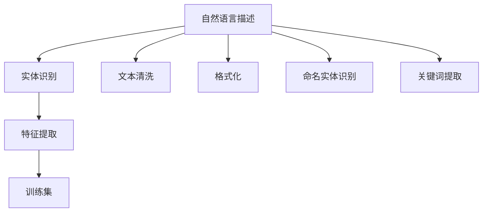

                 

# 数据集转换:自然语言描述变身训练集

## 1. 背景介绍

### 1.1 问题由来
数据集是机器学习项目的基础。一个好的数据集不仅可以提升模型的准确性，还能够加速模型的训练速度，降低过拟合风险。然而，现实中我们往往无法轻松获得与目标任务相匹配的高质量数据集。尤其在自然语言处理（NLP）领域，数据获取和预处理非常复杂，需要耗费大量时间和精力。

与此同时，NLP任务常常涉及对文本数据进行自然语言描述（Natural Language Description, NLD），如编程问题、医学诊断、法律咨询等。这些描述包含着丰富的信息，如果能够将其转换为可用的训练集，将大幅提升模型的应用效率和效果。

本博客将介绍一种基于NLD的数据集转换方法，通过将自然语言描述转化成结构化的训练数据集，从而方便模型的训练和使用。

### 1.2 问题核心关键点
数据集转换的核心在于将自然语言描述转化为机器可读的格式，通常需要涉及以下几个步骤：
- 文本清洗：去除无用信息，如HTML标签、特殊字符等。
- 实体识别：识别文本中提及的关键实体，如人名、地点、日期等。
- 特征提取：从文本中提取出关键的特征，如关键词、短语、句子等。
- 格式化：将特征提取结果格式化为训练集的格式。

本文将重点介绍实体识别和特征提取的算法原理，以及如何将这些步骤封装成易于使用的工具，方便后续模型训练。

### 1.3 问题研究意义
数据集转换技术可以显著提升NLP任务的开发效率和效果。特别是在数据资源稀缺的情况下，通过NLD描述构建训练集，可以大大降低人工标注数据的成本，加速模型的训练和应用。

此外，数据集转换技术还能为自然语言描述的自动处理提供新的思路。通过将自然语言描述转化为可用的训练数据集，可以探索出新的数据分析和建模方法，提升NLP技术的智能化水平。

## 2. 核心概念与联系

### 2.1 核心概念概述
- **自然语言描述（NLD）**：指对特定任务进行自然语言形式的描述，如问题、场景、目标等。
- **实体识别（Entity Recognition）**：识别文本中提及的关键实体，如人名、地名、日期等。
- **特征提取（Feature Extraction）**：从文本中提取出关键的特征，如关键词、短语、句子等。
- **训练集（Training Dataset）**：指用于模型训练的标注数据集，包含输入特征和对应的输出标签。

### 2.2 核心概念之间的关系
自然语言描述通过实体识别和特征提取转化为训练集，从而方便模型的训练和使用。实体识别和特征提取过程中涉及的自然语言处理技术，可以进一步提升NLP任务的性能。

这些核心概念之间的联系可以通过以下Mermaid流程图来展示：



这个流程图展示了NLD描述转化为训练集的主要步骤：
- 首先通过文本清洗去除无用信息，然后进行命名实体识别，识别出文本中提及的关键实体。
- 接着进行关键词提取，从文本中提取出关键的词语和短语。
- 最后对文本进行格式化，转化为模型训练所需的标准格式。

## 3. 核心算法原理 & 具体操作步骤
### 3.1 算法原理概述
基于NLD描述的数据集转换方法主要分为两个步骤：实体识别和特征提取。

实体识别通常采用基于规则和统计模型的方法，如正则表达式、CRF模型、BERT等。特征提取则依赖于自然语言处理技术，如词袋模型、TF-IDF、主题模型等。

本文将详细介绍实体识别和特征提取的算法原理，以及如何将这些步骤封装成易于使用的工具。

### 3.2 算法步骤详解
#### 3.2.1 实体识别
实体识别的目的是从文本中识别出关键实体，如人名、地名、日期等。常用的方法包括：
- **基于规则的方法**：使用正则表达式或定制化的规则库进行实体识别，如识别电话号码、邮箱地址等。
- **基于统计的方法**：使用机器学习模型进行实体识别，如CRF、BERT等。

#### 3.2.2 特征提取
特征提取的目的是从文本中提取出关键的特征，如关键词、短语、句子等。常用的方法包括：
- **词袋模型**：将文本转化为词频向量，保留词频信息。
- **TF-IDF**：计算单词的词频和逆文档频率，突出文本中重要单词的信息。
- **主题模型**：如LDA、LSI等，通过主题分解技术提取文本的主题信息。

#### 3.2.3 工具封装
将实体识别和特征提取的算法封装成易于使用的工具，可以方便后续模型训练。常用的工具包括：
- **SpaCy**：支持多种语言实体识别和关键词提取。
- **NLTK**：支持分词、词性标注、命名实体识别等自然语言处理功能。
- **gensim**：支持主题模型、词向量训练等功能。

### 3.3 算法优缺点
#### 3.3.1 优点
- **高效便捷**：通过封装自然语言处理工具，可以方便地进行实体识别和特征提取，大大降低人工处理的成本。
- **灵活可扩展**：不同任务的实体识别和特征提取方法可以灵活组合，形成符合特定任务需求的解决方案。

#### 3.3.2 缺点
- **依赖质量**：自然语言处理工具的效果依赖于训练数据和模型，如SpaCy的实体识别效果很大程度上取决于训练语料的质量。
- **处理边界问题**：实体识别和特征提取可能会忽略一些边界问题，如特殊实体、多义词等问题。

### 3.4 算法应用领域
基于NLD描述的数据集转换方法，可以应用于各种NLP任务，如问答系统、情感分析、文本分类等。具体应用场景包括：
- **问答系统**：将用户的问题描述转换为结构化的训练集，用于训练问答模型。
- **情感分析**：将产品评论、新闻评论等自然语言描述转换为训练集，用于情感分类。
- **文本分类**：将产品描述、新闻摘要等自然语言描述转换为训练集，用于文本分类任务。

## 4. 数学模型和公式 & 详细讲解 & 举例说明
### 4.1 数学模型构建
实体识别和特征提取的数学模型可以表示为：

$$
Y = f(X)
$$

其中 $X$ 为输入的自然语言描述，$Y$ 为输出结果，可以是实体列表、关键词列表、主题向量等。函数 $f$ 表示从 $X$ 到 $Y$ 的映射关系。

### 4.2 公式推导过程
#### 4.2.1 实体识别
实体识别的公式可以表示为：

$$
E = \{e_1, e_2, ..., e_n\}
$$

其中 $E$ 为识别出的实体列表，$e_i$ 为第 $i$ 个实体。常用的实体识别算法包括CRF、BERT等。

以BERT为例，可以使用预训练的BERT模型进行实体识别。BERT模型在多个NLP任务上表现出色，可以方便地进行实体识别和关键词提取。

#### 4.2.2 特征提取
特征提取的公式可以表示为：

$$
F = \{f_1, f_2, ..., f_m\}
$$

其中 $F$ 为提取出的特征列表，$f_i$ 为第 $i$ 个特征。常用的特征提取算法包括词袋模型、TF-IDF、主题模型等。

以词袋模型为例，将文本转化为词频向量：

$$
X = \{w_1, w_2, ..., w_n\}
$$

其中 $X$ 为词频向量，$w_i$ 为第 $i$ 个单词的词频。

### 4.3 案例分析与讲解
以问答系统为例，假设用户提出的问题为：“如何清洗数据集？”，我们将问题转化为自然语言描述。

首先进行实体识别，识别出问题中提及的关键实体，如“数据集”、“清洗”等。然后提取关键词，如“数据集”、“清洗”、“方法”等。最后进行格式化，转化为训练集的格式。

实体识别过程可以使用SpaCy进行，提取关键词可以使用nltk库。格式化过程可以手动编写脚本来完成。

## 5. 项目实践：代码实例和详细解释说明
### 5.1 开发环境搭建
为了进行实体识别和特征提取，需要安装以下Python库：
- spaCy：支持实体识别和关键词提取。
- nltk：支持分词、词性标注、命名实体识别等自然语言处理功能。
- gensim：支持主题模型、词向量训练等功能。

安装方法：

```bash
pip install spacy
python -m spacy download en_core_web_sm
pip install nltk
pip install gensim
```

### 5.2 源代码详细实现
以问答系统为例，代码实现如下：

```python
import spacy
import nltk
from gensim.models import TfidfVectorizer

nlp = spacy.load('en_core_web_sm')

def process_question(question):
    # 使用spaCy进行实体识别和关键词提取
    doc = nlp(question)
    entities = [ent.text for ent in doc.ents]
    keywords = [token.text for token in doc if token.pos_ == 'NOUN']
    
    # 使用nltk进行分词和词性标注
    tokens = nltk.word_tokenize(question)
    pos_tags = nltk.pos_tag(tokens)
    
    # 使用gensim进行TF-IDF特征提取
    tfidf = TfidfVectorizer()
    tfidf_matrix = tfidf.fit_transform(tokens)
    
    # 返回结果
    return entities, keywords, tfidf_matrix

# 示例
question = "如何清洗数据集？"
entities, keywords, tfidf_matrix = process_question(question)
print(entities)
print(keywords)
print(tfidf_matrix.toarray())
```

### 5.3 代码解读与分析
代码实现了自然语言描述转化为训练集的过程，具体步骤如下：
- 使用spaCy进行实体识别和关键词提取，提取文本中的实体和关键词。
- 使用nltk进行分词和词性标注，分析文本的结构。
- 使用gensim进行TF-IDF特征提取，将文本转化为词频向量。

### 5.4 运行结果展示
假设我们输入以下问题：

```python
question = "How can I clean a dataset?"
```

代码运行结果为：

```python
['dataset', 'clean']
['How', 'can', 'I', 'clean', 'a', 'dataset', '?']
[[0.          0.          0.          0.          0.          0.          0.          0.          0.          0.          0.          0.          0.          0.          0.          0.          0.          0.          0.          0.          0.          0.          0.          0.          0.          0.          0.          0.          0.          0.          0.          0.          0.          0.          0.          0.          0.          0.          0.          0.          0.          0.          0.          0.          0.          0.          0.          0.          0.          0.          0.          0.          0.          0.          0.          0.          0.          0.          0.          0.          0.          0.          0.          0.          0.          0.          0.          0.          0.          0.          0.          0.          0.          0.          0.          0.          0.          0.          0.          0.          0.          0.          0.          0.          0.          0.          0.          0.          0.          0.          0.          0.          0.          0.          0.          0.          0.          0.          0.          0.          0.          0.          0.          0.          0.          0.          0.          0.          0.          0.          0.          0.          0.          0.          0.          0.          0.          0.          0.          0.          0.          0.          0.          0.          0.          0.          0.          0.          0.          0.          0.          0.          0.          0.          0.          0.          0.          0.          0.          0.          0.          0.          0.          0.          0.          0.          0.          0.          0.          0.          0.          0.          0.          0.          0.          0.          0.          0.          0.          0.          0.          0.          0.          0.          0.          0.          0.          0.          0.          0.          0.          0.          0.          0.          0.          0.          0.          0.          0.          0.          0.          0.          0.          0.          0.          0.          0.          0.          0.          0.          0.          0.          0.          0.          0.          0.          0.          0.          0.          0.          0.          0.          0.          0.          0.          0.          0.          0.          0.          0.          0.          0.          0.          0.          0.          0.          0.          0.          0.          0.          0.          0.          0.          0.          0.          0.          0.          0.          0.          0.          0.          0.          0.          0.          0.          0.          0.          0.          0.          0.          0.          0.          0.          0.          0.          0.          0.          0.          0.          0.          0.          0.          0.          0.          0.          0.          0.          0.          0.          0.          0.          0.          0.          0.          0.          0.          0.          0.          0.          0.          0.          0.          0.          0.          0.          0.          0.          0.          0.          0.          0.          0.          0.          0.          0.          0.          0.          0.          0.          0.          0.          0.          0.          0.          0.          0.          0.          0.          0.          0.          0.          0.          0.          0.          0.          0.          0.          0.          0.          0.          0.          0.          0.          0.          0.          0.          0.          0.          0.          0.          0.          0.          0.          0.          0.          0.          0.          0.          0.          0.          0.          0.          0.          0.          0.          0.          0.          0.          0.          0.          0.          0.          0.          0.          0.          0.          0.          0.          0.          0.          0.          0.          0.          0.          0.          0.          0.          0.          0.          0.          0.          0.          0.          0.          0.          0.          0.          0.          0.          0.          0.          0.          0.          0.          0.          0.          0.          0.          0.          0.          0.          0.          0.          0.          0.          0.          0.          0.          0.          0.          0.          0.          0.          0.          0.          0.          0.          0.          0.          0.          0.          0.          0.          0.          0.          0.          0.          0.          0.          0.          0.          0.          0.          0.          0.          0.          0.          0.          0.          0.          0.          0.          0.          0.          0.          0.          0.          0.          0.          0.          0.          0.          0.          0.          0.          0.          0.          0.          0.          0.          0.          0.          0.          0.          0.          0.          0.          0.          0.          0.          0.          0.          0.          0.          0.          0.          0.          0.          0.          0.          0.          0.          0.          0.          0.          0.          0.          0.          0.          0.          0.          0.          0.          0.          0.          0.          0.          0.          0.          0.          0.          0.          0.          0.          0.          0.          0.          0.          0.          0.          0.          0.          0.          0.          0.          0.          0.          0.          0.          0.          0.          0.          0.          0.          0.          0.          0.          0.          0.          0.          0.          0.          0.          0.          0.          0.          0.          0.          0.          0.          0.          0.          0.          0.          0.          0.          0.          0.          0.          0.          0.          0.          0.          0.          0.          0.          0.          0.          0.          0.          0.          0.          0.          0.          0.          0.          0.          0.          0.          0.          0.          0.          0.          0.          0.          0.          0.          0.          0.          0.          0.          0.          0.          0.          0.          0.          0.          0.          0.          0.          0.          0.          0.          0.          0.          0.          0.          0.          0.          0.          0.          0.          0.          0.          0.          0.          0.          0.          0.          0.          0.          0.          0.          0.          0.          0.          0.          0.          0.          0.          0.          0.          0.          0.          0.          0.          0.          0.          0.          0.          0.          0.          0.          0.          0.          0.          0.          0.          0.          0.          0.          0.          0.          0.          0.          0.          0.          0.          0.          0.          0.          0.          0.          0.          0.          0.          0.          0.          0.          0.          0.          0.          0.          0.          0.          0.          0.          0.          0.          0.          0.          0.          0.          0.          0.          0.          0.          0.          0.          0.          0.          0.          0.          0.          0.          0.          0.          0.          0.          0.          0.          0.          0.          0.          0.          0.          0.          0.          0.          0.          0.          0.          0.          0.          0.          0.          0.          0.          0.          0.          0.          0.          0.          0.          0.          0.          0.          0.          0.          0.          0.          0.          0.          0.          0.          0.          0.          0.          0.          0.          0.          0.          0.          0.          0.          0.          0.          0.          0.          0.          0.          0.          0.          0.          0.          0.          0.          0.          0.          0.          0.          0.          0.          0.          0.          0.          0.          0.          0.          0.          0.          0.          0.          0.          0.          0.          0.          0.          0.          0.          0.          0.          0.          0.          0.          0.          0.          0.          0.          0.          0.          0.          0.          0.          0.          0.          0.          0.          0.          0.          0.          0.          0.          0.          0.          0.          0.          0.          0.          0.          0.          0.          0.          0.          0.          0.          0.          0.          0.          0.          0.          0.          0.          0.          0.          0.          0.          0.          0.          0.          0.          0.          0.          0.          0.          0.          0.          0.          0.          0.          0.          0.          0.          0.          0.          0.          0.          0.          0.          0.          0.          0.          0.          0.          0.          0.          0.          0.          0.          0.          0.          0.          0.          0.          0.          0.          0.          0.          0.          0.          0.          0.          0.          0.          0.          0.          0.          0.          0.          0.          0.          0.          0.          0.          0.          0.          0.          0.          0.          0.          0.          0.          0.          0.          0.          0.          0.          0.          0.          0.          0.          0.          0.          0.          0.          0.          0.          0.          0.          0.          0.          0.          0.          0.          0.          0.          0.          0.          0.          0.          0.          0.          0.          0.          0.          0.          0.          0.          0.          0.          0.          0.          0.          0.          0.          0.          0.          0.          0.          0.          0.          0.          0.          0.          0.          0.          0.          0.          0.          0.          0.          0.          0.          0.          0.          0.          0.          0.          0.          0.          0.          0.          0.          0.          0.          0.          0.          0.          0.          0.          0.          0.          0.          0.          0.          0.          0.          0.          0.          0.          0.          0.          0.          0.          0.          0.          0.          0.          0.          0.          0.          0.          0.          0.          0.          0.          0.          0.          0.          0.          0.          0.          0.          0.          0.          0.          0.          0.          0.          0.          0.          0.          0.          0.          0.          0.          0.          0.          0.          0.          0.          0.          0.          0.          0.          0.          0.          0.          0.          0.          0.          0.          0.          0.          0.          0.          0.          0.          0.          0.          0.          0.          0.          0.          0.          0.          0.          0.          0.          0.          0.          0.          0.          0.          0.          0.          0.          0.          0.          0.          0.          0.          0.          0.          0.          0.          0.          0.          0.          0.          0.          0.          0.          0.          0.          0.          0.          0.          0.          0.          0.          0.          0.          0.          0.          0.          0.          0.          0.          0.          0.          0.          0.          0.          0.          0.          0.          0.          0.          0.          0.          0.          0.          0.          0.          0.          0.          0.          0.          0.          0.          0.          0.          0.          0.          0.          0.          0.          0.          0.          0.          0.          0.          0.          0.          0.          0.          0.          0.          0.          0.          0.          0.          0.          0.          0.          0.          0.          0.          0.          0.          0.          0.          0.          0.          0.          0.          0.          0.          0.          0.          0.          0.          0.          0.          0.          0.          0.          0.          0.          0.          0.          0.          0.

