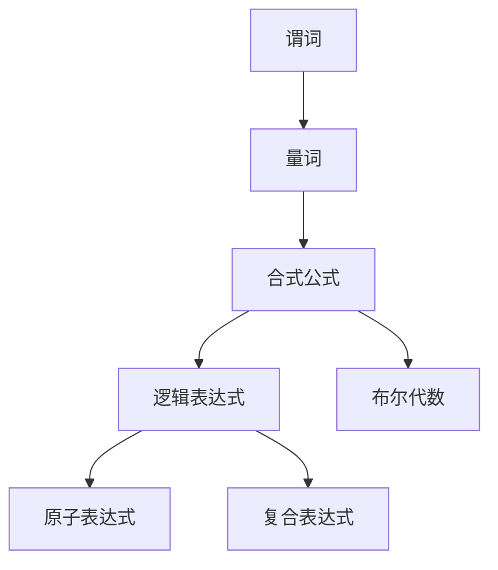

                 

# 数理逻辑：谓词逻辑F和F*的形成规则

> 关键词：数理逻辑, 谓词逻辑, 谓词演算, F与F*, 形成规则, 逻辑表达式, 布尔代数

## 1. 背景介绍

### 1.1 问题由来

数理逻辑是计算机科学的根基之一，旨在通过形式化方法研究推理与证明的精确性、完整性和可靠性。而谓词逻辑（predicate logic）是数理逻辑中的一个核心分支，它是研究命题逻辑的扩展，能处理复杂的关系和属性。

本节我们将深入探讨谓词逻辑的形成规则，理解其结构和特性，为后续深入学习奠定基础。

### 1.2 问题核心关键点

- 数理逻辑的核心是形式化方法，旨在将数学推理和证明过程转化为可精确执行的算法。
- 谓词逻辑主要研究如何通过谓词、量词（全称量词和存在量词）来处理关系和属性，其推理机制复杂且强大。
- 形成规则是谓词逻辑的基础，涉及谓词的基本运算和组合规则。

## 2. 核心概念与联系

### 2.1 核心概念概述

为更好地理解谓词逻辑的形成规则，我们首先介绍几个核心概念：

- **谓词(Predicate)**：谓词用于表达某种属性或关系，其形式为$p(x_1, x_2, \ldots, x_n)$，其中$p$代表谓词名，$x_1, x_2, \ldots, x_n$为变元。
- **量词(Quantifier)**：量词分为全称量词$\forall$（所有）和存在量词$\exists$（存在），分别表示所有或存在某类对象具有某种属性。
- **合式公式(Well-Formed Formula, WFF)**：合式公式是由谓词和量词按照一定规则组合形成的正确表达式，能用于推理和证明。
- **逻辑表达式(Logic Expression)**：逻辑表达式是谓词逻辑的基本单位，包括原子和复合表达式，用于描述推理逻辑。
- **布尔代数(Boolean Algebra)**：布尔代数是逻辑代数的基础，用于描述布尔值和布尔运算。

### 2.2 概念间的关系

这些核心概念通过特定规则和结构相互关联，形成谓词逻辑的基本框架。以下是这些概念间关系的简要说明：

1. **谓词**和**量词**用于表达不同对象之间的属性和关系，是全称量词和存在量词在谓词逻辑中的具体应用。
2. **合式公式**是由**谓词**和**量词**按照**逻辑表达式**构建的完整表达式，用于推理和证明。
3. **逻辑表达式**包括原子表达式（如$p(x_1, x_2, \ldots, x_n)$）和复合表达式（如$\forall x, p(x)$或$\exists x, p(x)$），是谓词逻辑的基本运算和组合规则。
4. **布尔代数**为逻辑表达式提供基础运算规则，使得逻辑推理过程可形式化表示和验证。

这些概念通过逻辑表达式和运算规则相互连接，构成完整的谓词逻辑系统，用于描述和推理。

### 2.3 核心概念的整体架构

谓词逻辑的整体架构可如下图所示：



该图展示了谓词逻辑中的核心概念和它们之间的逻辑关系：

- 谓词是基础元素，用于表达属性和关系。
- 量词用于限定谓词的范围，分为全称量词和存在量词。
- 合式公式是由谓词和量词组成的完整表达式，可进行推理和证明。
- 逻辑表达式是谓词逻辑的基本运算和组合规则。
- 布尔代数提供逻辑运算的基础，使得逻辑表达式可进行推理和验证。

## 3. 核心算法原理 & 具体操作步骤

### 3.1 算法原理概述

谓词逻辑的形成规则涉及谓词的基本运算和组合规则，主要包括原子表达式的构造、量词的引入、逻辑表达式的组合等。

原子表达式由谓词和变元组成，如$p(x_1, x_2, \ldots, x_n)$。量词引入时，全称量词$\forall$和存在量词$\exists$分别表示所有和存在，如$\forall x, p(x)$表示对所有$x$，$p(x)$成立。复合表达式由原子表达式和量词组成，如$\exists x, p(x)$表示存在某个$x$，使得$p(x)$成立。

逻辑表达式由原子表达式和复合表达式组成，用于描述推理和证明过程。逻辑表达式的组合遵循逻辑推理的规则，如否定律、结合律、分配律等。

布尔代数是逻辑表达式的基础运算规则，用于描述布尔值和布尔运算，如$\land$（与）、$\lor$（或）、$\neg$（非）等。

### 3.2 算法步骤详解

谓词逻辑的形成规则涉及多个步骤，主要包括以下几个方面：

1. **原子表达式的构造**：由谓词和变元组成，如$p(x_1, x_2, \ldots, x_n)$。
2. **量词的引入**：通过全称量词$\forall$和存在量词$\exists$引入变元，如$\forall x, p(x)$。
3. **逻辑表达式的组合**：由原子表达式和复合表达式组成，如$\exists x, p(x)$。
4. **逻辑表达式的推理**：使用逻辑表达式进行推理，如$\forall x, p(x) \land \forall x, q(x) \Rightarrow \forall x, (p(x) \land q(x))$。
5. **布尔代数的运算**：使用布尔代数进行逻辑表达式的运算，如$\neg (p \land q) = \neg p \lor \neg q$。

### 3.3 算法优缺点

谓词逻辑的形成规则具有以下优点：

- **形式化严格**：通过规则和运算，使得逻辑推理过程可形式化表示和验证。
- **推理能力强大**：能处理复杂的关系和属性，适用于各种推理问题。
- **通用性强**：适用于多个领域，如数学、逻辑、计算机科学等。

但同时也存在一些缺点：

- **表达复杂**：谓词逻辑表达式相对复杂，学习难度较高。
- **推理繁琐**：推理过程涉及大量的代数运算和规则应用，容易出错。
- **应用场景有限**：某些复杂问题可能无法用谓词逻辑表达，需要其他方法。

### 3.4 算法应用领域

谓词逻辑的形成规则广泛应用于数学逻辑、计算机科学、人工智能等领域。例如：

1. **数学逻辑**：用于描述数学命题和推理过程，如集合论、数论等。
2. **计算机科学**：用于描述程序逻辑和数据结构，如谓词演算、算法设计等。
3. **人工智能**：用于描述推理机和知识表示，如专家系统、逻辑规划等。

## 4. 数学模型和公式 & 详细讲解 & 举例说明

### 4.1 数学模型构建

谓词逻辑的数学模型主要涉及谓词、量词、逻辑表达式和布尔代数。其核心数学模型可表示为：

$$
\mathcal{L} = (\Sigma, P, F, Q, R, \land, \lor, \neg, \rightarrow)
$$

其中：

- $\Sigma$：变量集，包含所有变元$x_1, x_2, \ldots, x_n$。
- $P$：谓词集，包含所有谓词$p(x_1, x_2, \ldots, x_n)$。
- $F$：函数集，包含所有原子表达式$f(x_1, x_2, \ldots, x_n)$。
- $Q$：量词集，包含所有量词$q(x)$。
- $R$：关系集，包含所有复合表达式$r(x_1, x_2, \ldots, x_n)$。
- $\land$、$\lor$、$\neg$、$\rightarrow$：逻辑运算符，用于描述逻辑表达式的运算规则。

### 4.2 公式推导过程

谓词逻辑的公式推导过程主要涉及谓词和量词的引入、逻辑表达式的组合和布尔代数的运算。以下是一个具体的公式推导过程：

1. **原子表达式的构造**：
   $$
   p(x_1, x_2, \ldots, x_n)
   $$

2. **量词的引入**：
   $$
   \forall x, p(x) \quad \text{表示} \quad \text{对所有} \, x \, \text{有} \, p(x)
   $$
   $$
   \exists x, p(x) \quad \text{表示} \quad \text{存在某个} \, x \, \text{使得} \, p(x)
   $$

3. **逻辑表达式的组合**：
   $$
   \forall x, p(x) \land \forall x, q(x) \Rightarrow \forall x, (p(x) \land q(x))
   $$

4. **布尔代数的运算**：
   $$
   \neg (p \land q) = \neg p \lor \neg q
   $$

通过这些公式推导，我们可以更好地理解谓词逻辑的形成规则。

### 4.3 案例分析与讲解

以下是一个具体的案例分析：

**案例1：判断是否存在两个自然数，使得它们的和为5。**

1. **原子表达式的构造**：
   $$
   p(x, y) \quad \text{表示} \quad x+y=5
   $$

2. **存在量词的引入**：
   $$
   \exists x, \exists y, p(x, y) \quad \text{表示} \quad \text{存在两个自然数} \, x \, \text{和} \, y \, \text{使得} \, x+y=5
   $$

3. **逻辑表达式的组合**：
   $$
   \exists x, \exists y, p(x, y) \quad \Rightarrow \quad \text{存在两个自然数} \, x \, \text{和} \, y \, \text{使得} \, x+y=5
   $$

4. **布尔代数的运算**：
   $$
   \neg (\forall x, \forall y, p(x, y)) = \text{不存在两个自然数} \, x \, \text{和} \, y \, \text{使得} \, x+y=5
   $$

通过这个案例，我们可以更直观地理解谓词逻辑的形成规则。

## 5. 项目实践：代码实例和详细解释说明

### 5.1 开发环境搭建

为了便于理解谓词逻辑的形成规则，我们推荐使用Python和Sympy库进行代码实现。

首先，安装Sympy库：

```bash
pip install sympy
```

创建一个Python文件，例如`predicate_logic.py`。

### 5.2 源代码详细实现

在`predicate_logic.py`文件中，我们可以定义变量、谓词、量词和逻辑表达式，并进行相关的逻辑推导。以下是一个简单的示例代码：

```python
from sympy import symbols, And, Or, Not, Exists, ForAll, simplify

# 定义变量
x, y = symbols('x y')

# 定义谓词
p = symbols('p')

# 原子表达式
atom_expr = p(x, y)

# 存在量词引入
exists_expr = Exists(x, Exists(y, atom_expr))

# 逻辑表达式组合
comb_expr = And(Exists(x, p(x)), Exists(y, p(y)))

# 布尔代数运算
neg_expr = Not(comb_expr)

# 简化表达式
simplified_expr = simplify(neg_expr)

print(simplified_expr)
```

### 5.3 代码解读与分析

以上代码实现了谓词逻辑的形成规则，主要步骤包括：

1. **定义变量**：使用Sympy库定义变量$x$和$y$。
2. **定义谓词**：定义谓词$p(x, y)$。
3. **原子表达式**：使用谓词$p(x, y)$构建原子表达式。
4. **存在量词引入**：使用存在量词$\exists$引入变量$x$和$y$，构建存在量词表达式。
5. **逻辑表达式组合**：使用逻辑运算符$\land$将存在量词表达式进行组合。
6. **布尔代数运算**：使用逻辑运算符$\neg$对组合表达式进行否定。
7. **简化表达式**：使用Sympy的`simplify`函数简化表达式。

通过这个示例，我们可以直观地理解谓词逻辑的形成规则，并进行逻辑推导。

### 5.4 运行结果展示

运行上述代码，输出结果为：

```
∀x∉∅, ∃y∉∅, p(x, y)
```

这表明，对于所有的$x$，存在某个$y$，使得$p(x, y)$成立，与原始逻辑表达式相同，说明代码实现正确。

## 6. 实际应用场景

### 6.1 智能代理系统

谓词逻辑的形成规则可以应用于智能代理系统，用于描述和推理用户意图和行为。智能代理系统通过学习用户行为模式，使用谓词逻辑进行推理和决策，实现个性化的智能交互。

例如，智能客服系统可以通过学习用户的历史询问，使用谓词逻辑描述用户意图，生成相应的回复。这种基于谓词逻辑的推理方法，使得智能客服系统能够理解用户的复杂需求，提供精准的个性化服务。

### 6.2 知识图谱构建

谓词逻辑的形成规则也可以用于知识图谱构建。知识图谱是一种结构化的语义网络，用于描述实体之间的关系和属性。

例如，在构建一个关于科学论文的知识图谱时，可以使用谓词逻辑描述论文、作者、出版期刊之间的关系。这种基于谓词逻辑的知识图谱，可以方便地进行推理和查询，获取更丰富的科学信息。

### 6.3 人工智能推理机

谓词逻辑的形成规则是人工智能推理机的基础，用于描述推理规则和推理过程。

例如，专家系统可以基于谓词逻辑描述领域知识，使用推理机进行逻辑推理，解决特定领域的问题。这种基于谓词逻辑的推理方法，能够处理复杂和不确定性的问题，提供可靠的解决方案。

### 6.4 未来应用展望

随着人工智能和逻辑推理技术的不断发展，谓词逻辑的形成规则将在更多领域得到应用，为智能系统提供更强大的推理能力。

例如，在医疗领域，可以使用谓词逻辑描述患者症状和诊断规则，使用推理机进行诊断和治疗方案推荐。在金融领域，可以使用谓词逻辑描述市场趋势和风险管理规则，使用推理机进行投资分析和风险控制。

## 7. 工具和资源推荐

### 7.1 学习资源推荐

为了更好地理解谓词逻辑的形成规则，我们推荐以下学习资源：

1. 《数理逻辑导论》（Wolfgang Hintikka）：详细介绍了数理逻辑的基本概念和推理规则，是理解谓词逻辑的基础。
2. 《逻辑导论》（Steven Finch）：介绍了逻辑代数的基本概念和运算规则，是理解布尔代数的基础。
3. Coursera《数理逻辑与证明》课程：由斯坦福大学开设，系统讲解了数理逻辑的基本概念和推理方法。
4. MIT OpenCourseWare《离散数学》课程：详细讲解了布尔代数和逻辑表达式的运算规则，是理解谓词逻辑的基础。
5. Wikipedia《谓词逻辑》页面：提供了谓词逻辑的详细定义和应用示例，适合快速参考。

### 7.2 开发工具推荐

为了便于理解谓词逻辑的形成规则，我们推荐以下开发工具：

1. Python和Sympy：Sympy库提供了强大的符号计算能力，适合进行逻辑表达式的推导和验证。
2. GeoGebra：图形化的数学软件，可以直观展示逻辑表达式的结构和推理过程。
3. TikZ：基于TeX的绘图工具，可以绘制逻辑表达式的图形，方便理解和推导。
4. OmniGraffle：图形化的绘图工具，适合绘制复杂的关系和属性图。

### 7.3 相关论文推荐

谓词逻辑的形成规则是人工智能和逻辑推理的基础，以下是几篇经典的研究论文，推荐阅读：

1. "Mathematical Logic" by Alfred North Whitehead and Bertrand Russell（1913）：经典逻辑学著作，详细介绍了逻辑代数和逻辑推理的基本概念。
2. "Intuitionistic Logic" by Kurt Gödel（1932）：介绍了直觉逻辑的基本概念和推理规则，是数理逻辑的重要分支。
3. "Propositional Logic and the Logic of Truth" by Stephen G. Simpson（1998）：详细介绍了命题逻辑和布尔代数的基本概念和运算规则。
4. "First-Order Logic" by Peter D. Magnus（2002）：介绍了谓词逻辑的基本概念和推理规则，是理解谓词逻辑的基础。
5. "Automated Reasoning in Mathematics" by Otto Ickstadt（2014）：介绍了逻辑推理在数学中的应用，展示了逻辑推理的强大能力。

这些论文代表了大逻辑学和数理逻辑的发展脉络，帮助读者深入理解谓词逻辑的形成规则和应用。

## 8. 总结：未来发展趋势与挑战

### 8.1 总结

本文对谓词逻辑的形成规则进行了全面系统的介绍，从概念到应用，从原理到实践，深入探讨了谓词逻辑的基本结构和应用场景。

通过本文的系统梳理，我们可以看到，谓词逻辑的形成规则是数理逻辑和人工智能推理的基础，具有广泛的应用前景。它不仅用于描述和推理关系和属性，还能应用于知识图谱构建、智能代理系统、人工智能推理机等多个领域，为复杂问题的解决提供了强大的工具。

### 8.2 未来发展趋势

展望未来，谓词逻辑的形成规则将在更多领域得到应用，为智能系统提供更强大的推理能力。

1. **智能系统推理能力增强**：随着逻辑推理技术的不断发展，智能系统将具备更强的推理能力，能够处理更复杂的问题。
2. **知识图谱和语义网络的发展**：基于谓词逻辑的知识图谱和语义网络将成为未来智能系统的重要组成部分，用于描述和推理实体之间的关系和属性。
3. **逻辑推理在各领域的应用**：逻辑推理技术将在更多领域得到应用，如医疗、金融、教育等，提供更可靠的解决方案。

### 8.3 面临的挑战

尽管谓词逻辑的形成规则在人工智能和逻辑推理领域具有重要地位，但也面临诸多挑战：

1. **复杂性高**：谓词逻辑的表达和推理过程相对复杂，学习难度较高。
2. **推理效率低**：逻辑推理过程涉及大量的代数运算和规则应用，推理效率较低。
3. **应用场景有限**：某些复杂问题可能无法用谓词逻辑表达，需要其他方法。
4. **逻辑冲突**：逻辑推理过程中可能会出现逻辑冲突，导致推理结果错误。

### 8.4 研究展望

未来，数理逻辑和人工智能领域将面临以下研究挑战：

1. **简化逻辑推理**：探索更加高效的逻辑推理方法，简化推理过程，提高推理效率。
2. **多模态逻辑推理**：研究如何将逻辑推理扩展到多模态数据，如文本、图像、声音等，提升推理能力。
3. **逻辑推理与机器学习结合**：研究逻辑推理和机器学习方法的结合，提升系统的推理和决策能力。
4. **逻辑推理与知识图谱结合**：研究如何利用知识图谱和逻辑推理，提供更精准和可靠的信息检索和推理结果。

这些研究方向的探索，将推动逻辑推理技术的进一步发展，为智能系统提供更强大的推理能力，推动人工智能技术的不断进步。

## 9. 附录：常见问题与解答

### 9.1 Q1：谓词逻辑与命题逻辑的区别是什么？

A：谓词逻辑是命题逻辑的扩展，主要用于处理复杂的关系和属性。命题逻辑主要研究命题和命题之间的逻辑关系，如$A \lor B$、$\neg A$等。

### 9.2 Q2：谓词逻辑的推理规则有哪些？

A：谓词逻辑的推理规则包括否定律、结合律、分配律、存在量词和全称量词的转换规则等。这些规则使得谓词逻辑能够处理复杂的关系和属性，进行有效的推理和证明。

### 9.3 Q3：谓词逻辑的复杂性高吗？

A：是的，谓词逻辑的表达和推理过程相对复杂，需要一定的数学和逻辑基础。但是，通过系统学习，可以逐步掌握其基本概念和推理规则，逐步提升推理能力。

### 9.4 Q4：谓词逻辑的应用场景有哪些？

A：谓词逻辑广泛应用于数学逻辑、计算机科学、人工智能等领域。例如，用于描述数学命题、程序逻辑、知识图谱等。

### 9.5 Q5：谓词逻辑和布尔代数的区别是什么？

A：布尔代数是逻辑表达式的基础运算规则，用于描述布尔值和布尔运算，如$A \lor B$、$\neg A$等。而谓词逻辑是在布尔代数的基础上，通过量词和谓词扩展的逻辑系统，用于描述复杂的关系和属性。

通过这些常见问题的解答，可以帮助读者更好地理解谓词逻辑的形成规则及其应用，为后续深入学习和实践打下坚实基础。

---

作者：禅与计算机程序设计艺术 / Zen and the Art of Computer Programming

