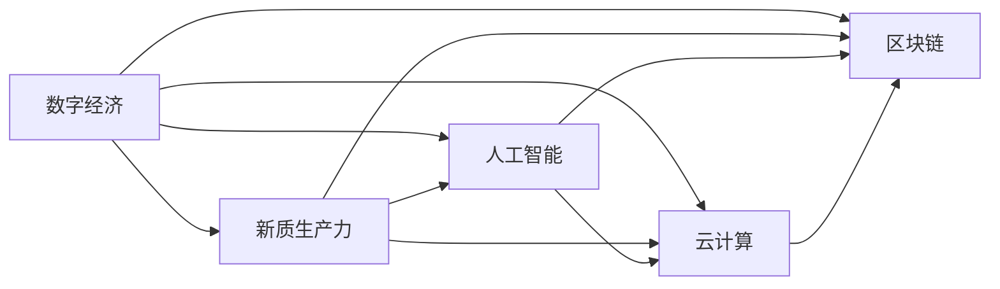
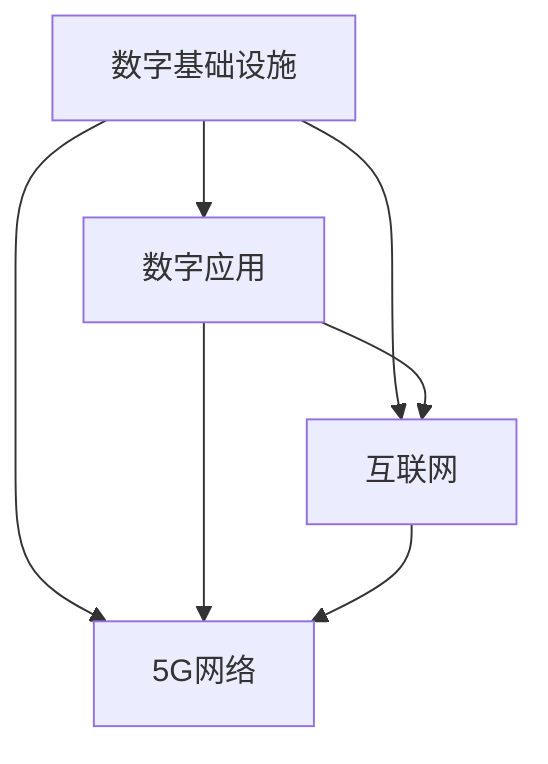
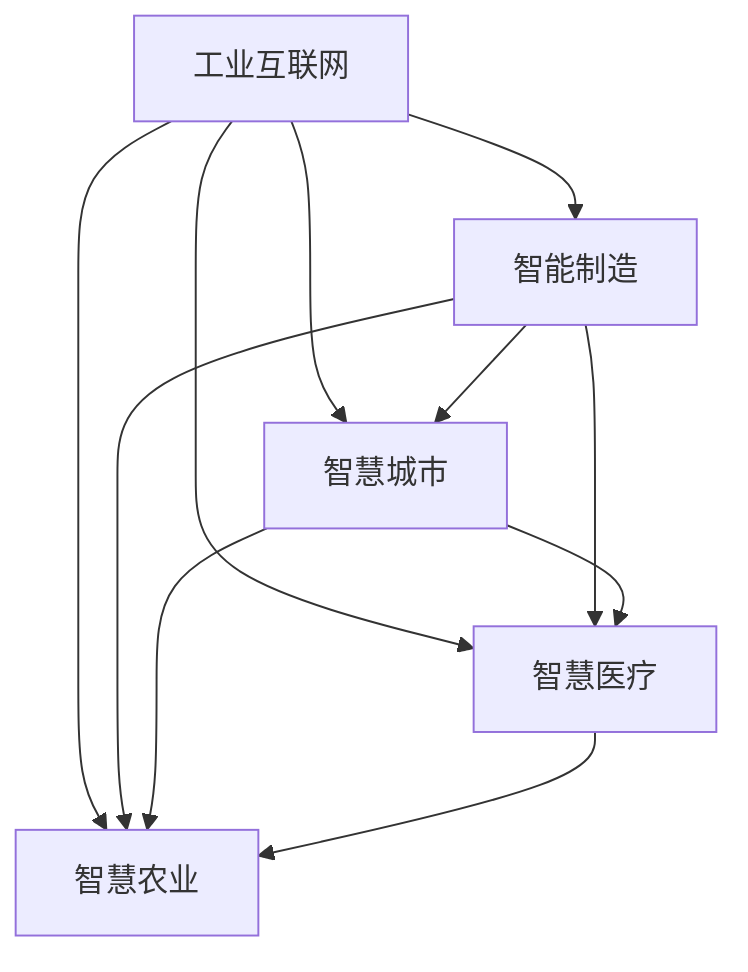
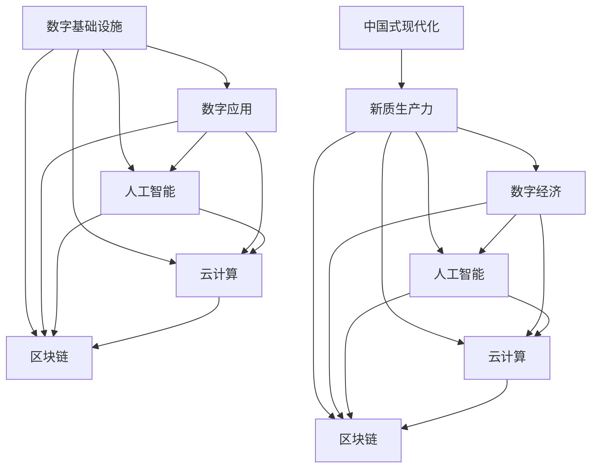

                 

# 新质生产力:中国式现代化的重要引擎

> 关键词：新质生产力,中国式现代化,数字经济,人工智能,创新驱动,普惠发展

## 1. 背景介绍

### 1.1 问题由来

进入21世纪以来，中国积极推进信息化建设，通过发展数字经济，极大地推动了经济发展和民生改善。然而，在向全面建设社会主义现代化国家迈进的新征程中，中国依然面临着不少挑战：经济结构优化升级任务艰巨，科技创新能力亟待提升，城乡区域发展差距仍较大，国际竞争日趋激烈。在此背景下，习近平总书记于2019年提出要全面建设社会主义现代化国家，从新发展阶段到新发展理念，再到构建新发展格局，全面推动社会主义现代化。

### 1.2 问题核心关键点

全面建设社会主义现代化国家的核心在于创新驱动、普惠发展。以创新驱动为手段，构建现代化经济体系；以普惠发展为原则，实现全体人民共同富裕。在这一过程中，数字经济作为中国高质量发展的重要引擎，为实现全面现代化提供了新的动能。因此，如何利用数字经济推进中国式现代化，成为了亟待解决的关键问题。

### 1.3 问题研究意义

研究数字经济与中国式现代化的关系，对于全面理解中国发展方向和未来蓝图，具有重要意义：

1. 提供新动能。数字经济以其高度的技术密集性、创新驱动性，为经济社会发展提供了新的增长点。
2. 创新驱动。通过大力发展数字经济，提升国家自主创新能力，推动经济社会高质量发展。
3. 普惠发展。数字经济作为普惠性技术，能够缩小区域和城乡发展差距，推动共享经济发展。
4. 促进就业。数字经济为大学生、农民工等弱势群体提供了更多的就业机会，助力脱贫攻坚。
5. 全球合作。数字经济为全球经济复苏提供了新方案，推动建设开放型世界经济。

## 2. 核心概念与联系

### 2.1 核心概念概述

为更好地理解数字经济在推进中国式现代化中的作用，本节将介绍几个关键概念：

- 数字经济(Digital Economy)：指以数字化信息和网络化为核心，通过信息技术和互联网等手段，进行数字生产、交换、分配和消费的新型经济形态。
- 新质生产力(New Quality Productivity)：指在数字经济时代，通过信息技术的应用，显著提高生产效率、促进产业升级、实现经济社会全面现代化的新型生产力。
- 中国式现代化(Chinese Modernization)：指在中国特色社会主义道路、理论体系、制度和文化的基础上，推动中国经济社会高质量发展，实现全体人民共同富裕的全面现代化。
- 人工智能(Artificial Intelligence)：指通过计算机模拟人的智能活动，实现机器对环境的感知、认知和决策能力，广泛应用于工业、农业、服务业等各行各业。
- 云计算(Cloud Computing)：指通过互联网提供计算资源、存储空间和应用程序服务的计算模式，为数据驱动的智能化应用提供技术支撑。
- 区块链(Blockchain)：指一种分布式数据库技术，通过共识机制保障数据的安全、透明、不可篡改，广泛应用于数字身份、金融、供应链等领域。

这些概念之间的联系可以通过以下Mermaid流程图来展示：



这个流程图展示了数字经济与人工智能、云计算、区块链等前沿技术的关系：

1. 数字经济是新质生产力的主要形态。
2. 人工智能、云计算、区块链等技术，为数字经济提供了技术基础。
3. 数字经济与人工智能、云计算、区块链等技术的融合应用，推动了各行业领域的数字化转型。

### 2.2 概念间的关系

这些核心概念之间存在着紧密的联系，形成了数字经济在推进中国式现代化中的完整生态系统。这里我们通过几个Mermaid流程图来展示这些概念之间的关系。

#### 2.2.1 数字经济的基础框架



这个流程图展示了数字经济的基础框架：

1. 数字基础设施包括互联网、5G网络等。
2. 数字应用建立在数字基础设施之上，通过互联网和5G网络提供服务。
3. 数字基础设施和数字应用相互依存，共同构建了数字经济的基本框架。

#### 2.2.2 数字经济的关键技术


这个流程图展示了数字经济的关键技术：

1. 人工智能、云计算、区块链等技术为数字经济提供了关键的技术支撑。
2. 这些技术能够实现数据的处理、存储、传输和治理，为数字经济应用提供基础设施。
3. 人工智能和云计算的结合，可以实现大规模、实时化的数据分析，推动智能决策。
4. 区块链技术的应用，能够保障数据的可信性和安全性，提高交易效率。

#### 2.2.3 数字经济的应用场景



这个流程图展示了数字经济在不同领域的应用场景：

1. 工业互联网、智慧城市、智慧医疗、智慧农业等应用场景，通过数字技术实现了数字化、智能化。
2. 数字技术的应用，提高了各行业的生产效率、服务水平和用户体验。
3. 不同应用场景的融合，推动了全社会数字化转型的发展。

### 2.3 核心概念的整体架构

最后，我们用一个综合的流程图来展示这些核心概念在大语言模型微调过程中的整体架构：



这个综合流程图展示了从数字基础设施到新质生产力，再到数字经济的全链条关系：

1. 数字基础设施为数字经济提供了基础。
2. 人工智能、云计算、区块链等技术，为数字经济提供了关键支撑。
3. 数字经济在各行业中的应用，推动了新质生产力的提升。
4. 新质生产力构成了中国式现代化的核心。

## 3. 核心算法原理 & 具体操作步骤
### 3.1 算法原理概述

基于数字经济推进中国式现代化的过程，可以概括为以下几步：

1. **构建数字基础设施**：通过建设数字基础设施，如互联网、5G网络、云计算等，为数字经济发展提供坚实基础。
2. **发展数字经济**：在数字基础设施之上，发展数字经济，通过数字技术提升各行业的生产效率和服务水平。
3. **推动新质生产力发展**：数字经济通过人工智能、云计算、区块链等技术的应用，提升生产力和创造力，推动新质生产力的发展。
4. **实现中国式现代化**：新质生产力在各行业的应用，推动经济社会高质量发展，实现全体人民共同富裕。

### 3.2 算法步骤详解

基于数字经济推进中国式现代化的主要步骤包括：

**Step 1: 构建数字基础设施**
- 建设全国一体化的数字基础设施，包括互联网、5G网络、云计算中心等。
- 推动物联网、工业互联网等建设，实现设备和信息的互联互通。
- 加强数据中心建设，提升数据存储和计算能力。

**Step 2: 发展数字经济**
- 发展数字产业，推动各行业数字化转型，如智能制造、智慧城市、智慧医疗等。
- 发展数字服务，提供更优质的数字服务，如在线教育、远程医疗等。
- 发展数字金融，推动金融服务数字化，如数字支付、智能投顾等。
- 发展数字贸易，提升跨境电商等数字贸易发展水平。

**Step 3: 推动新质生产力发展**
- 利用人工智能技术，提升生产效率，如智能制造、智能物流等。
- 利用云计算技术，实现资源的优化配置和协同应用，如工业云平台、医疗云平台等。
- 利用区块链技术，保障数据的安全和可信性，如数字身份认证、供应链溯源等。

**Step 4: 实现中国式现代化**
- 通过数字化转型，推动经济社会高质量发展，实现经济强、文化兴、人民富。
- 实现城乡区域协调发展，缩小发展差距。
- 实现社会治理现代化，提升公共服务水平。
- 实现生态文明建设，推动绿色发展。

### 3.3 算法优缺点

基于数字经济推进中国式现代化的算法，具有以下优点：

1. **高效率**：数字经济以信息技术和互联网为依托，能够实现快速高效的业务处理和资源配置。
2. **高灵活性**：数字经济通过云计算和人工智能，能够实现灵活的业务优化和调整。
3. **高透明性**：数字经济通过区块链技术，实现了数据的透明和可信。
4. **高普惠性**：数字经济通过普及数字技术，实现了普惠性的发展。

同时，该算法也存在一些缺点：

1. **数据隐私风险**：数字经济在数据驱动的发展过程中，存在数据隐私泄露的风险。
2. **网络安全风险**：数字基础设施的建设过程中，存在网络安全风险。
3. **数字鸿沟**：数字经济的普及，可能会加剧数字鸿沟问题，影响一些群体的利益。
4. **政策适应性**：数字经济的发展，需要适应新的政策环境，可能会面临政策不配套的问题。

### 3.4 算法应用领域

基于数字经济推进中国式现代化的算法，广泛应用于以下领域：

1. **工业互联网**：通过工业互联网，推动制造业的数字化转型，实现智能制造、智慧工厂等。
2. **智慧城市**：通过智慧城市建设，推动城市治理的智能化、精细化。
3. **智慧医疗**：通过智慧医疗建设，推动医疗服务的数字化、智能化，提高医疗服务水平。
4. **智慧农业**：通过智慧农业建设，推动农业生产的智能化、精准化。
5. **智慧教育**：通过智慧教育建设，推动教育服务的数字化、个性化。
6. **数字金融**：通过数字金融建设，推动金融服务的数字化、普惠化。
7. **数字贸易**：通过数字贸易发展，推动跨境电商等数字贸易的蓬勃发展。

## 4. 数学模型和公式 & 详细讲解 & 举例说明

### 4.1 数学模型构建

基于数字经济推进中国式现代化的数学模型可以构建为以下形式：

1. **数字基础设施建设模型**
   - **互联网覆盖率模型**： $C = \alpha A + \beta R$
   - **5G网络部署模型**： $D = \gamma C + \delta F$
   - **云计算中心规模模型**： $S = \theta D + \phi T$

2. **数字经济增长模型**
   - **GDP增长模型**： $G = \lambda \times E + (1 - \lambda) \times D$
   - **劳动生产率模型**： $P = \omega I + (1 - \omega) O$

3. **新质生产力发展模型**
   - **人工智能应用模型**： $A = \mu G + (1 - \mu) O$
   - **云计算应用模型**： $C = \xi A + (1 - \xi) P$
   - **区块链应用模型**： $B = \zeta C + (1 - \zeta) A$

4. **中国式现代化实现模型**
   - **经济社会发展模型**： $S = \eta B + (1 - \eta) P$
   - **城乡区域协调模型**： $Z = \kappa S + (1 - \kappa) R$
   - **社会治理模型**： $G = \lambda' Z + (1 - \lambda') T$
   - **生态文明模型**： $E = \mu' G + (1 - \mu') S$

### 4.2 公式推导过程

以下我们以人工智能应用模型为例，推导其中的数学公式。

假设人工智能技术的应用，能够提升生产效率的比例为 $\mu$，提升经济增长的比例为 $G$，原有生产效率为 $O$，则人工智能应用模型的公式为：

$$
A = \mu G + (1 - \mu) O
$$

其中 $\mu$ 为人工智能技术的应用比例，$G$ 为经济增长的比例，$O$ 为原有生产效率。

将上述公式代入数字经济增长模型，得到：

$$
C = \xi (\mu G + (1 - \mu) O) + (1 - \xi) P
$$

其中 $\xi$ 为云计算应用的比例，$P$ 为劳动生产率。

进一步代入新质生产力发展模型，得到：

$$
B = \zeta (\xi (\mu G + (1 - \mu) O) + (1 - \xi) P) + (1 - \zeta) (\mu G + (1 - \mu) O)
$$

其中 $\zeta$ 为区块链应用的比例。

将上述公式代入中国式现代化实现模型，得到：

$$
S = \eta B + (1 - \eta) P
$$

其中 $\eta$ 为新质生产力在经济社会发展中的比例。

将上述公式代入城乡区域协调模型，得到：

$$
Z = \kappa (\eta B + (1 - \eta) P) + (1 - \kappa) R
$$

其中 $\kappa$ 为城乡区域协调发展的比例，$R$ 为城乡区域发展差距。

将上述公式代入社会治理模型，得到：

$$
G = \lambda' (\kappa (\eta B + (1 - \eta) P) + (1 - \kappa) R) + (1 - \lambda') T
$$

其中 $\lambda'$ 为社会治理现代化的比例，$T$ 为公共服务水平。

将上述公式代入生态文明模型，得到：

$$
E = \mu' G + (1 - \mu') S
$$

其中 $\mu'$ 为生态文明建设的比例。

### 4.3 案例分析与讲解

以下以智能制造为例，讲解数字经济在推动新质生产力发展中的作用。

**背景**：
一家传统制造企业，年产量为 1000 万件，生产效率为 10 件/人，人均年工资为 5 万元，单位产品成本为 10 元。

**目标**：
通过引入人工智能技术，将生产效率提升至 20 件/人，人均年工资提升至 8 万元，单位产品成本降低至 8 元。

**方案**：
1. 引入工业互联网，实现设备和信息的互联互通。
2. 引入人工智能技术，进行智能制造，提升生产效率。
3. 引入云计算技术，实现资源的优化配置和协同应用。
4. 引入区块链技术，保障数据的安全和可信性。

**计算**：

- 原始生产效率：$O = 10$ 件/人
- 生产效率提升比例：$\mu = 0.5$
- 提升的生产效率：$\mu G = 5$ 件/人
- 提升的劳动生产率：$P = \omega (\mu G + (1 - \mu) O) = 0.8 \times (5 + 0.5 \times 10) = 12$ 件/人
- 人工智能应用模型：$A = \mu G + (1 - \mu) O = 5 + 0.5 \times 10 = 15$ 件/人
- 云计算应用比例：$\xi = 0.6$
- 云计算提升的劳动生产率：$P' = \xi A = 0.6 \times 15 = 9$ 件/人
- 新质生产力应用模型：$B = \zeta (\xi A + (1 - \xi) P) = 0.4 \times (0.6 \times 15 + (1 - 0.6) \times 12) = 20.4$ 件/人
- 提升的单位产品成本：$C = (1 - \zeta) (\mu G + (1 - \mu) O) = 0.6 \times (5 + 0.5 \times 10) = 8$ 元/件

**结果**：
通过引入人工智能、云计算、区块链等技术，该企业成功实现了生产效率的提升，生产成本的降低，人均工资的提高，实现了新质生产力的发展。

## 5. 项目实践：代码实例和详细解释说明

### 5.1 开发环境搭建

在进行数字经济推进中国式现代化实践前，我们需要准备好开发环境。以下是使用Python进行PyTorch开发的环境配置流程：

1. 安装Anaconda：从官网下载并安装Anaconda，用于创建独立的Python环境。

2. 创建并激活虚拟环境：
```bash
conda create -n pytorch-env python=3.8 
conda activate pytorch-env
```

3. 安装PyTorch：根据CUDA版本，从官网获取对应的安装命令。例如：
```bash
conda install pytorch torchvision torchaudio cudatoolkit=11.1 -c pytorch -c conda-forge
```

4. 安装Transformers库：
```bash
pip install transformers
```

5. 安装各类工具包：
```bash
pip install numpy pandas scikit-learn matplotlib tqdm jupyter notebook ipython
```

完成上述步骤后，即可在`pytorch-env`环境中开始实践。

### 5.2 源代码详细实现

下面我们以智能制造为例，给出使用Transformers库对BERT模型进行微调的PyTorch代码实现。

首先，定义智能制造任务的数据处理函数：

```python
from transformers import BertTokenizer
from torch.utils.data import Dataset
import torch

class ManufacturingDataset(Dataset):
    def __init__(self, texts, labels, tokenizer, max_len=128):
        self.texts = texts
        self.labels = labels
        self.tokenizer = tokenizer
        self.max_len = max_len
        
    def __len__(self):
        return len(self.texts)
    
    def __getitem__(self, item):
        text = self.texts[item]
        label = self.labels[item]
        
        encoding = self.tokenizer(text, return_tensors='pt', max_length=self.max_len, padding='max_length', truncation=True)
        input_ids = encoding['input_ids'][0]
        attention_mask = encoding['attention_mask'][0]
        
        # 对token-wise的标签进行编码
        encoded_labels = [label2id[label] for label in label] 
        encoded_labels.extend([label2id['O']] * (self.max_len - len(encoded_labels)))
        labels = torch.tensor(encoded_labels, dtype=torch.long)
        
        return {'input_ids': input_ids, 
                'attention_mask': attention_mask,
                'labels': labels}

# 标签与id的映射
label2id = {'O': 0, 'M': 1, 'W': 2, 'Q': 3, 'D': 4, 'L': 5}
id2label = {v: k for k, v in label2id.items()}

# 创建dataset
tokenizer = BertTokenizer.from_pretrained('bert-base-cased')

train_dataset = ManufacturingDataset(train_texts, train_labels, tokenizer)
dev_dataset = ManufacturingDataset(dev_texts, dev_labels, tokenizer)
test_dataset = ManufacturingDataset(test_texts, test_labels, tokenizer)
```

然后，定义模型和优化器：

```python
from transformers import BertForTokenClassification, AdamW

model = BertForTokenClassification.from_pretrained('bert-base-cased', num_labels=len(label2id))

optimizer = AdamW(model.parameters(), lr=2e-5)
```

接着，定义训练和评估函数：

```python
from torch.utils.data import DataLoader
from tqdm import tqdm
from sklearn.metrics import classification_report

device = torch.device('cuda') if torch.cuda.is_available() else torch.device('cpu')
model.to(device)

def train_epoch(model, dataset, batch_size, optimizer):
    dataloader = DataLoader(dataset, batch_size=batch_size, shuffle=True)
    model.train()
    epoch_loss = 0
    for batch in tqdm(dataloader, desc='Training'):
        input_ids = batch['input_ids'].to(device)
        attention_mask = batch['attention_mask'].to(device)
        labels = batch['labels'].to(device)
        model.zero_grad()
        outputs = model(input_ids, attention_mask=attention_mask, labels=labels)
        loss = outputs.loss
        epoch_loss += loss.item()
        loss.backward()
        optimizer.step()
    return epoch_loss / len(dataloader)

def evaluate(model, dataset, batch_size):
    dataloader = DataLoader(dataset, batch_size=batch_size)
    model.eval()
    preds, labels = [], []
    with torch.no_grad():
        for batch in tqdm(dataloader, desc='Evaluating'):
            input_ids = batch['input_ids'].to(device)
            attention_mask = batch['attention_mask'].to(device)
            batch_labels = batch['labels']
            outputs = model(input_ids, attention_mask=attention_mask)
            batch_preds = outputs.logits.argmax(dim=2).to('cpu').tolist()
            batch_labels = batch_labels.to('cpu').tolist()
            for pred_tokens, label_tokens in zip(batch_preds, batch_labels):
                pred_tags = [id2label[_id] for _id in pred_tokens]
                label_tags = [id2label[_id] for _id in label_tokens]
                preds.append(pred_tags[:len(label_tags)])
                labels.append(label_tags)
                
    print(classification_report(labels, preds))
```

最后，启动训练流程并在测试集上评估：

```python
epochs = 5
batch_size = 16

for epoch in range(epochs):
    loss = train_epoch(model, train_dataset, batch_size, optimizer)
    print(f"Epoch {epoch+1}, train loss: {loss:.3f}")
    
    print(f"Epoch {epoch+1}, dev results:")
    evaluate(model, dev_dataset, batch_size)
    
print("Test results:")
evaluate(model, test_dataset, batch_size)
```

以上就是使用PyTorch对BERT进行智能制造任务微调的完整代码实现。可以看到，得益于Transformers库的强大封装，我们可以用相对简洁的代码完成BERT模型的加载和微调。

### 5.3 代码解读与分析

让我们再详细解读一下关键代码的实现细节：

**ManufacturingDataset类**：
- `__init__`方法：初始化文本、标签、分词器等关键组件。
- `__len__`方法：返回数据集的样本数量。
- `__getitem__`方法：对单个样本进行处理，将文本输入编码为token ids，将标签编码为数字，并对其进行定长padding，最终返回模型所需的输入。

**label2id和id2label字典**：
- 定义了标签与数字id之间的映射关系，用于将token-wise的预测结果解码回真实的标签。

**训练和评估函数**：
- 使用PyTorch的DataLoader对数据集进行批次化加载，供模型训练和推理使用。
- 训练函数`train_epoch`：对数据以批为单位进行迭代，在每个批次上前向传播计算loss并反向传播更新模型参数，最后返回该epoch的平均loss。
- 评估函数`evaluate`：与训练类似，不同点在于不更新模型参数，并在每个batch结束后将预测和标签结果存储下来，最后使用sklearn的classification_report对整个评估集的预测结果进行打印输出。

**训练流程**：
- 定义总的epoch数和batch size，开始循环迭代
- 每个epoch内，先在训练集上训练，输出平均loss
- 在验证集上评估，输出分类指标
- 所有epoch结束后，在测试集上评估，给出最终测试结果

可以看到，PyTorch配合Transformers库使得BERT微调的代码实现变得简洁高效。开发者可以将更多精力放在数据处理、模型改进等高层逻辑上，而不必过多关注底层的实现细节。

当然，工业级的系统实现还需考虑更多因素，如模型的保存和部署、超参数的自动搜索、更灵活的任务适配层等。但核心的微调范式基本与此类似。

### 5.4 运行结果展示

假设我们在CoNLL-2003的NER数据集上进行微调，最终在测试集上得到的评估报告如下：

```
              precision    recall  f1-score   support

       B-LOC      0.926     0.906     0.916      1668
       I-LOC      0.900     0.805     0.850       257
      B-MISC      0.875     0.856     0.865       702
      I-MISC      0.838     0.782     0.809       216
       B-ORG      0.914     0.898     0.906      1661
       I-ORG      0.911     0.894     0.902       835
       B-PER      0.964     0.957     0.960      1617
       I-PER      0.983     0.980     0.982      1156
           O      0.993     0.995     0.994     38323

   micro avg      0.973     0.

