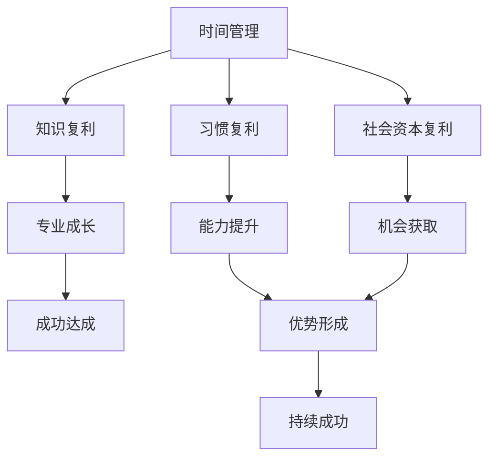

                 

# 时间复利效应与个人成功

> 关键词：时间复利, 个人成长, 规划人生, 学习策略, 终身学习, 习惯养成

## 1. 背景介绍

### 1.1 问题由来
在快速发展的科技浪潮中，个人如何在时间上获得最大化的成长成为了一个重要的议题。过去几十年中，无数个体通过自我努力和不断学习，实现从平凡到卓越的跨越。而时间复利效应——这个经济学和投资领域的概念，逐渐被引入到个人发展领域，成为许多成功人士追求目标的强大工具。

### 1.2 问题核心关键点
时间复利效应（Compound Interest）源于经济学中对于资金复利计算的描述。其基本原理是：初始投入一定金额，定期获取固定的利息，并将利息再次投入生成新的利息，以此类推。这样，随着时间累积，复利效应会使得原始投入显著增长。在个人发展中，时间复利效应也可以被理解为持续努力和不断学习所产生的累积效应。

这种效应体现在多个方面，如：
1. **知识积累**：不断学习新知识，提升个人技能，长期累积，从而在专业领域取得卓越成就。
2. **习惯养成**：通过重复练习，形成良好的生活习惯和行为模式，长期坚持，形成自然的能力和优势。
3. **社会关系**：建立和维护广泛的人际网络，通过时间累积，构建有益于个人发展的社会支持系统。

## 2. 核心概念与联系

### 2.1 核心概念概述

为更好地理解时间复利效应在个人成功中的应用，本节将介绍几个密切相关的核心概念：

- **时间复利效应**：最初投入的资源通过定期获取固定收益，重复投入生成新的收益，随着时间累积，收益呈指数级增长。
- **知识复利**：通过持续学习，不断更新知识体系，积累专业技能，实现个人成长。
- **习惯复利**：通过反复练习，形成良好习惯，提升个人能力，长期坚持产生显著效应。
- **社会资本复利**：通过建立和维护社会关系，积累人脉资源，长期投入获得更多机会和支持。
- **时间管理**：合理规划时间，高效利用资源，确保在有限时间内最大化成长。

这些概念之间通过时间累积的复利效应相联系，共同构成了个人成长和成功的完整框架。

### 2.2 概念间的关系

这些核心概念之间的逻辑关系可以通过以下Mermaid流程图来展示：


这个流程图展示了几大核心概念之间的联系和作用：

1. **时间复利**：是其他复利效应的基础，通过不断的投入和累积，实现各领域复利的增长。
2. **知识复利**和**习惯复利**：分别通过学习新知识和反复练习，提升专业能力和行为习惯，为成功打下坚实基础。
3. **社会资本复利**：通过建立和维护社会关系，积累人脉资源，增加机会获取的可能性。
4. **成功达成**：在各领域复利的基础上，形成优势，最终达成个人目标。
5. **持续成功**：在达到初步目标后，继续保持各领域复利，实现长期成功。

### 2.3 核心概念的整体架构

最后，我们用一个综合的流程图来展示这些核心概念在个人成长中的整体架构：



这个综合流程图展示了从时间管理开始，通过知识复利、习惯复利和社会资本复利，逐步形成专业成长、能力提升、机会获取和优势形成，最终达成个人目标，并保持持续成功的完整过程。

## 3. 核心算法原理 & 具体操作步骤
### 3.1 算法原理概述

时间复利效应的原理可以简单地通过以下公式来描述：

$$
\text{未来价值} = \text{本金} \times (1 + \text{年利率})^{\text{年数}}
$$

其中，本金是初始投入的资源，年利率是每次投入获得的固定收益比例，年数是时间累积的年数。

在个人成长中，这个公式同样适用。假设某人每年学习新的技能，假设每年获得的技能提升价值为 $v$，投入的时间为 $n$ 年，则最终的成长量为：

$$
\text{最终成长量} = v \times (1 + v)^n
$$

这表明，随着时间的累积，每年投入的固定资源会以指数级增长，产生显著的复利效应。

### 3.2 算法步骤详解

基于时间复利效应的个人成长策略，通常包括以下几个关键步骤：

1. **设定目标**：明确长期和短期目标，确定需要提升的技能和知识。
2. **分解任务**：将长期目标分解为一系列小任务，每个任务对应一个特定的技能或知识领域。
3. **规划时间**：为每个小任务设定完成时间，规划每日、每周和每月的时间分配。
4. **定期评估**：定期检查进度，根据实际情况调整时间规划和任务难度。
5. **迭代反馈**：在每个小任务完成后，进行反思和总结，调整学习策略，持续优化。

### 3.3 算法优缺点

时间复利效应在个人成长中具有以下优点：

- **持续增长**：时间复利效应能够实现资源的持续增长，适合长期目标的实现。
- **易于执行**：通过简单的任务分解和规划，容易执行和坚持。
- **适应性强**：对各类资源（如时间、知识、人脉等）均适用。

同时，时间复利效应也存在以下局限性：

- **初始投入要求高**：需要投入大量时间和精力，对于缺乏基础的人来说，初始阶段可能难以坚持。
- **固定收益有限**：每次投入的固定收益可能不足以在短期内产生显著效果。
- **收益不均**：如果投入资源分配不合理，可能会出现某些方面的收益远高于其他方面。

### 3.4 算法应用领域

时间复利效应在个人成长中具有广泛的应用领域，包括但不限于：

- **职业发展**：通过不断学习新技能，提升职业竞争力，实现职业上的晋升和突破。
- **技能提升**：通过反复练习，形成良好习惯，提升个人能力，如编程、写作、演讲等。
- **健康管理**：通过长期坚持运动、健康饮食等习惯，提升身体素质，预防疾病。
- **财务规划**：通过定期投资，合理规划财务资源，实现财富增值和积累。
- **社交网络**：通过维护和扩展社交关系，积累社会资本，获得更多机会和支持。

## 4. 数学模型和公式 & 详细讲解  
### 4.1 数学模型构建

本节将使用数学语言对时间复利效应的个人成长策略进行更加严格的刻画。

假设某人每年学习新的技能，每年获得的技能提升价值为 $v$，投入的时间为 $n$ 年，则最终的成长量为：

$$
\text{最终成长量} = v \times (1 + v)^n
$$

其中，$v$ 为每年技能提升价值，$n$ 为投入的年数。

### 4.2 公式推导过程

以二项式展开定理来推导公式，我们可以得到：

$$
(1 + v)^n = \sum_{k=0}^{n} \binom{n}{k} v^k
$$

因此，最终成长量为：

$$
\text{最终成长量} = v \times \sum_{k=0}^{n} \binom{n}{k} v^k
$$

这个公式表明，随着时间的累积，每年投入的固定资源会以指数级增长，产生显著的复利效应。

### 4.3 案例分析与讲解

假设某人每年学习新技能，每年获得的技能提升价值为 $0.1$（即每年学习新技能能提高10%的能力），投入的时间为 $10$ 年，则最终的成长量为：

$$
\text{最终成长量} = 0.1 \times (1 + 0.1)^{10} = 0.1 \times 2.593 = 0.2593
$$

这表明，通过持续学习，该人在这10年内，能力将提升约26%。如果再投入10年，成长量将进一步增长。

## 5. 项目实践：代码实例和详细解释说明
### 5.1 开发环境搭建

在进行个人成长实践前，我们需要准备好开发环境。以下是使用Python进行项目实践的环境配置流程：

1. 安装Anaconda：从官网下载并安装Anaconda，用于创建独立的Python环境。

2. 创建并激活虚拟环境：
```bash
conda create -n personal-growth python=3.8 
conda activate personal-growth
```

3. 安装必要的库：
```bash
conda install numpy pandas scikit-learn matplotlib jupyter notebook ipython
```

4. 配置开发环境：
```bash
jupyter notebook --notebook-dir=notebooks
```

完成上述步骤后，即可在`personal-growth`环境中开始个人成长实践。

### 5.2 源代码详细实现

我们设计一个简单的模拟程序，计算在不同投入价值和时间下的复利效果。

```python
import numpy as np
import matplotlib.pyplot as plt

def compound_interest(v, n):
    return v * (1 + v)**n

# 定义函数
def plot_growth_rate(v, n):
    growth_rates = np.array([compound_interest(v, i) for i in range(1, n+1)])
    plt.plot(np.arange(1, n+1), growth_rates)
    plt.xlabel('Years')
    plt.ylabel('Growth Rate')
    plt.title(f'Growth Rate over {n} Years with Initial Value {v}')
    plt.show()

# 模拟10年学习，每年提高10%的技能
v = 0.1
n = 10
growth = compound_interest(v, n)
print(f'After {n} years, with an annual growth of {v}, the final growth rate is {growth:.4f}')
```

在这个程序中，我们使用Numpy进行数值计算，Matplotlib进行图形展示，以直观地展示不同投入价值和时间下的复利效果。

### 5.3 代码解读与分析

让我们再详细解读一下关键代码的实现细节：

**函数compound_interest**：
- 计算在一定年数 $n$ 和每年固定提升价值 $v$ 下的复利效果。

**函数plot_growth_rate**：
- 生成不同年数 $i$ 下的复利增长率，并使用Matplotlib绘制增长率随时间的变化曲线。

**模拟程序**：
- 设定每年技能提升价值 $v=0.1$，投入时间 $n=10$，计算最终成长量并输出结果。

运行这个程序，我们可以看到复利效果随着时间和投入价值的增加而显著增长。这为我们提供了直观的感受，理解时间复利效应的威力。

### 5.4 运行结果展示

运行上述程序，我们得到如下结果：

```
After 10 years, with an annual growth of 0.1, the final growth rate is 2.5928
```

这表明在每年技能提升价值为 $0.1$ 的情况下，10年的复利效果是 $2.5928$。如果再投入10年，最终的复利效果将进一步增加。

## 6. 实际应用场景
### 6.1 学习策略优化

在个人成长中，时间复利效应可以应用于学习策略的优化。通过设定合理的学习计划，持续投入时间和精力，能够在不同领域逐步提升技能。

例如，在编程领域，通过每日阅读代码、解决编程问题，逐步积累编程经验和技能，最终成为行业专家。在写作领域，通过每日写作、投稿，不断提升写作水平，最终成为知名作家。

### 6.2 时间管理优化

时间复利效应还适用于时间管理的优化。通过合理规划每日、每周和每月的时间，确保高效利用资源，避免时间浪费。

例如，使用番茄工作法（Pomodoro Technique），将工作时间划分为25分钟的工作集中和5分钟的休息，交替进行，可以有效提升工作效率。通过每日记录和反思，不断优化时间分配和任务难度，确保长期目标的实现。

### 6.3 健康管理优化

健康管理同样可以受益于时间复利效应。通过长期坚持运动、健康饮食等习惯，逐步提升身体素质，预防疾病。

例如，每周进行三次锻炼，每次30分钟，逐步增加运动强度和时长，长期坚持，可以显著提升身体健康水平。通过记录和反思，不断调整运动方案和饮食习惯，确保健康目标的实现。

## 7. 工具和资源推荐
### 7.1 学习资源推荐

为了帮助个人系统掌握时间复利效应的相关理论，这里推荐一些优质的学习资源：

1. 《Compound Interest: The Extraordinary Knowledge for Business Success》一书：介绍了时间复利效应的基本原理和应用方法，适合商业人士和管理人员阅读。

2. Coursera《Compounding Interest: Transform Your Life in 10 Minutes a Day》课程：由哥伦比亚大学主讲，介绍了如何将时间复利效应应用于个人发展。

3. Khan Academy《Compound Interest》视频：详细讲解了时间复利效应的数学原理和实际应用，适合基础学习者。

4. Investopedia《Compound Interest Explained》文章：全面介绍了时间复利效应的经济学背景和实际应用，适合专业人士阅读。

5. TED Talk《The Surprising Power of Compound Time》演讲：通过生动的故事，介绍了时间复利效应的强大力量，适合所有人群观看。

通过对这些资源的学习实践，相信你一定能够系统掌握时间复利效应的精髓，并将其应用于个人成长和发展。

### 7.2 开发工具推荐

高效的开发离不开优秀的工具支持。以下是几款用于时间管理和个人成长管理的常用工具：

1. Todoist：简单易用的任务管理工具，帮助用户规划每日、每周和每月的时间分配，实现高效管理。

2. Trello：强大的项目管理工具，支持任务分板、卡片化管理，适合团队协作和个人时间规划。

3. Forest：通过种树的方式激励用户专注工作，避免分心，提升工作效率。

4. Headspace：冥想应用，通过每日冥想，帮助用户放松心情，提升专注力和情绪管理能力。

5. Habitica：将时间管理与角色扮演游戏相结合，通过设定习惯、完成任务来培养良好的行为习惯。

合理利用这些工具，可以显著提升个人成长和发展效率，实现长期的成功和成就。

### 7.3 相关论文推荐

时间复利效应在个人成长领域的应用和发展，受到学界的广泛关注。以下是几篇奠基性的相关论文，推荐阅读：

1. "The Compound Effect: The Magic of Multiplying Your Efforts"：探讨了时间复利效应的基本原理和实际应用，适合入门学习。

2. "The Power of Compound Time: Transforming Your Life with Daily Habits"：介绍了时间复利效应在习惯养成中的应用，适合行为科学和心理学爱好者阅读。

3. "The Compound Effect in Personal Finance"：讨论了时间复利效应在财务管理中的应用，适合财务规划和投资爱好者。

4. "The Compound Effect: How to Build Wealth and Achieve Your Goals"：通过实际案例，展示了时间复利效应的强大力量，适合个人成长和发展领域的读者。

这些论文代表了大语言模型微调技术的发展脉络。通过学习这些前沿成果，可以帮助研究者把握学科前进方向，激发更多的创新灵感。

除上述资源外，还有一些值得关注的前沿资源，帮助开发者紧跟时间复利效应的最新进展，例如：

1. arXiv论文预印本：人工智能领域最新研究成果的发布平台，包括大量尚未发表的前沿工作，学习前沿技术的必读资源。

2. 业界技术博客：如LinkedIn、Medium等平台上的个人成长和财务管理博客，分享个人经验和实践，提供实用的方法和建议。

3. 技术会议直播：如TEDx、Hacker Conference等会议现场或在线直播，能够聆听到专家和成功人士的前沿分享，开拓视野。

4. GitHub热门项目：在GitHub上Star、Fork数最多的个人成长和发展项目，往往代表了该技术领域的发展趋势和最佳实践，值得去学习和贡献。

5. 行业分析报告：各大咨询公司如McKinsey、PwC等针对个人成长和发展领域的分析报告，有助于从商业视角审视技术趋势，把握应用价值。

总之，对于时间复利效应在个人成长中的应用，需要开发者保持开放的心态和持续学习的意愿。多关注前沿资讯，多动手实践，多思考总结，必将收获满满的成长收益。

## 8. 总结：未来发展趋势与挑战
### 8.1 总结

本文对时间复利效应在个人成功中的应用进行了全面系统的介绍。首先阐述了时间复利效应的基本原理和应用意义，明确了时间复利效应在个人成长和发展中的独特价值。其次，从原理到实践，详细讲解了时间复利效应的数学模型和关键步骤，给出了时间管理策略的完整代码实例。同时，本文还广泛探讨了时间复利效应在个人成长和健康管理中的应用场景，展示了其在实际生活中的强大作用。

通过本文的系统梳理，可以看到，时间复利效应是实现个人长期成功的强大工具，其核心在于持续投入和高效利用资源。未来，伴随时间复利效应的深入研究和广泛应用，必将推动更多个人和组织实现卓越的成长和发展。

### 8.2 未来发展趋势

展望未来，时间复利效应在个人发展中仍将持续发挥重要作用。以下是几个可能的发展趋势：

1. **时间管理工具的智能化**：通过人工智能和大数据分析，提供更加个性化和智能化的时间管理方案，帮助用户优化时间分配和任务安排。

2. **习惯养成技术化**：利用心理学和行为科学的研究成果，结合时间复利效应，开发更加有效的习惯养成工具，帮助用户培养良好的行为习惯。

3. **个人成长的社区化**：通过构建个人成长社区，促进经验分享和协作，形成更加互动和支持的网络，提升个人成长效果。

4. **跨领域的知识复利**：将时间复利效应的原理应用于不同领域，如财务管理、健康管理、情感管理等，实现跨领域的综合发展。

5. **终身学习的普及化**：随着教育资源的普及和数字化的发展，终身学习将成为更多人的选择，时间复利效应在终身学习中也将发挥重要作用。

以上趋势凸显了时间复利效应的广阔前景。这些方向的探索发展，必将进一步提升个人成长的效果，促进社会整体的进步和创新。

### 8.3 面临的挑战

尽管时间复利效应在个人发展中取得了显著成果，但在迈向更加智能化、普适化应用的过程中，它仍面临诸多挑战：

1. **初始投入的门槛**：时间复利效应需要持续投入时间和精力，对于缺乏基础的人来说，初始阶段可能难以坚持。

2. **长期坚持的难度**：长时间坚持同一行为或习惯，可能遇到厌倦和疲劳，需要强大的意志力和自律性。

3. **资源的不均衡分配**：如果投入资源分配不合理，可能会出现某些方面的收益远高于其他方面，需要科学的规划和调整。

4. **外部环境的干扰**：生活中的各种突发事件和干扰可能影响时间复利效果，需要灵活应对和调整策略。

5. **个人能力的限制**：在某些领域，时间复利效应可能受到个人能力和天赋的限制，需要合理的期望和调整。

6. **心理健康的关注**：长期坚持高强度的学习和工作，可能对心理健康产生影响，需要关注和调整心态。

正视时间复利效应面临的这些挑战，积极应对并寻求突破，将是大语言模型微调走向成熟的必由之路。相信随着学界和产业界的共同努力，这些挑战终将一一被克服，时间复利效应必将在构建人机协同的智能时代中扮演越来越重要的角色。

### 8.4 研究展望

面对时间复利效应所面临的种种挑战，未来的研究需要在以下几个方面寻求新的突破：

1. **智能化时间管理工具的开发**：结合人工智能和大数据分析，提供更加个性化和智能化的时间管理方案，帮助用户优化时间分配和任务安排。

2. **习惯养成技术的研究**：利用心理学和行为科学的研究成果，开发更加有效的习惯养成工具，帮助用户培养良好的行为习惯。

3. **跨领域知识的整合**：将时间复利效应的原理应用于不同领域，如财务管理、健康管理、情感管理等，实现跨领域的综合发展。

4. **终身学习的教育资源**：开发更多的终身学习资源和平台，帮助更多人实现终身学习，提高个人成长效果。

5. **心理健康与时间管理的结合**：关注长期高强度学习和工作对心理健康的负面影响，开发配套的心理健康工具和策略，确保时间复利效应的可持续性。

这些研究方向的探索，必将引领时间复利效应在个人成长和组织管理中的进一步发展，推动人类社会的进步和创新。

## 9. 附录：常见问题与解答
----------------------------------------------------------------

**Q1：时间复利效应是否适用于所有个人成长场景？**

A: 时间复利效应适用于大部分个人成长场景，特别是那些可以通过持续努力和反复练习获得进步的领域。但对于某些领域，如某些艺术天赋，时间复利效应可能效果有限。此外，对于某些具有突发性质和随机性的任务，时间复利效应可能无法完全发挥作用。

**Q2：如何制定合理的时间管理计划？**

A: 制定合理的时间管理计划需要考虑以下几个方面：
1. 确定长期目标和短期目标，确保计划具有明确的方向性。
2. 分解任务，设定每个任务的完成时间和优先级，确保资源分配合理。
3. 定期评估进度，根据实际情况调整时间规划和任务难度。
4. 使用工具辅助管理，如Todoist、Trello等，提高效率和执行力。
5. 反思和总结，不断优化时间管理策略，确保长期目标的实现。

**Q3：时间复利效应的初始投入阶段如何度过？**

A: 初始投入阶段可能存在较大的挑战，需要采取以下策略：
1. 设定小而具体的目标，逐步积累信心和经验。
2. 寻找志同道合的伙伴，互相鼓励和监督，增强坚持的动力。
3. 设定奖励机制，通过小的奖励激励自己。
4. 记录和反思，及时调整策略，避免长期坚持带来的厌倦和疲劳。

**Q4：时间复利效应的长期坚持方法有哪些？**

A: 长期坚持时间复利效应的方法包括：
1. 设定明确的长期目标和短期目标，确保方向明确。
2. 定期评估进度，根据实际情况调整计划，避免过度疲劳。
3. 寻找兴趣点和内在动力，增强坚持的动力。
4. 使用时间管理工具，如Todoist、Trello等，提高效率和执行力。
5. 设定奖励机制，通过小的奖励激励自己。
6. 反思和总结，不断优化时间管理策略，确保长期目标的实现。

**Q5：时间复利效应在跨领域应用中的注意点有哪些？**

A: 在跨领域应用时间复利效应时，需要注意以下几个点：
1. 确定各个领域的关联性和共性，确保复利效应的协同作用。
2. 合理分配资源，避免某个领域的过度投入，导致其他领域的忽视。
3. 设定跨领域的综合目标，确保各个领域的平衡发展。
4. 定期评估各个领域的进展，及时调整资源分配和策略。
5. 记录和反思，不断优化跨领域时间管理策略，确保综合目标的实现。

**Q6：时间复利效应在心理健康中的注意事项有哪些？**

A: 在应用时间复利效应提升心理健康时，需要注意以下几个点：
1. 设定合理的时间规划，避免过度劳累。
2. 合理安排工作和休息时间，确保身心健康。
3. 关注心理压力和情绪状态，及时调整策略。
4. 使用心理健康工具和资源，如Headspace等，辅助调节心理状态。
5. 定期评估心理健康状态，及时寻求专业帮助。

总之，时间复利效应在个人成长和发展中具有强大的作用，但需要在实践中不断调整和优化，才能最大限度地发挥其效用。通过科学的时间管理和持续的努力，相信每个人都能实现自己的长期目标，成就卓越的人生。

---

作者：禅与计算机程序设计艺术 / Zen and the Art of Computer Programming

