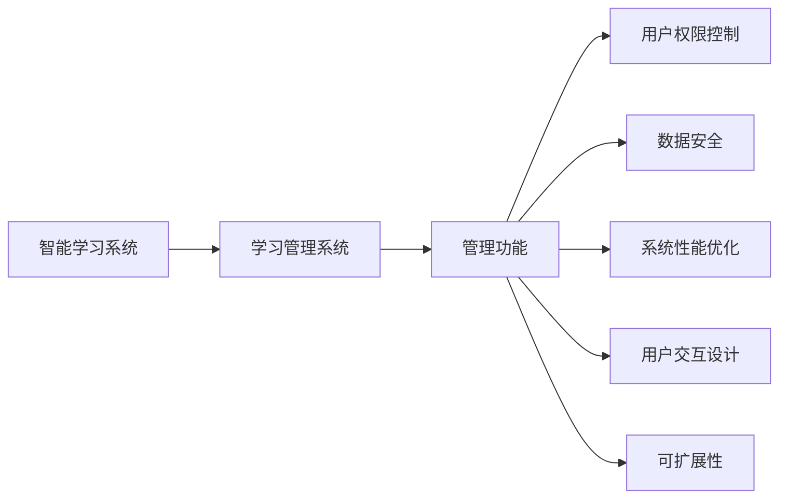
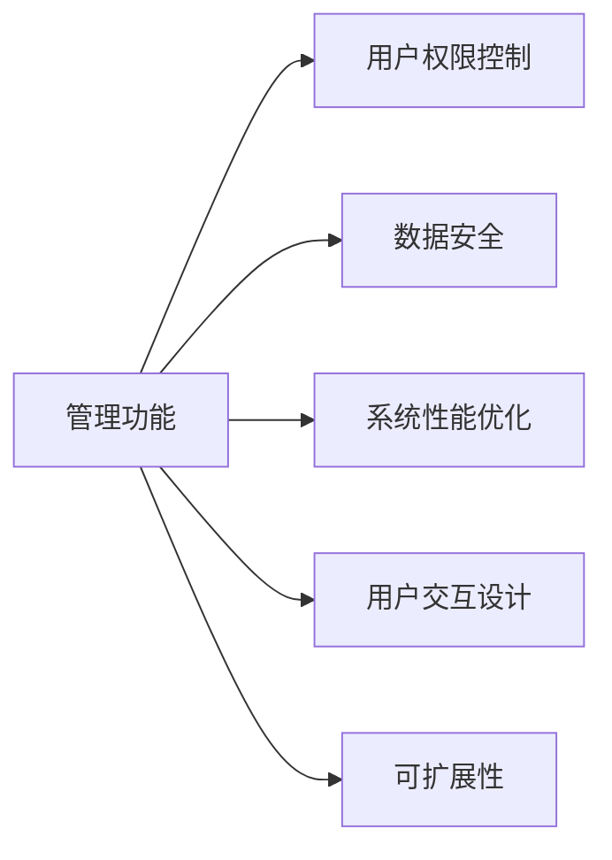
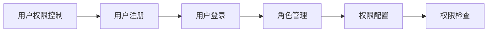
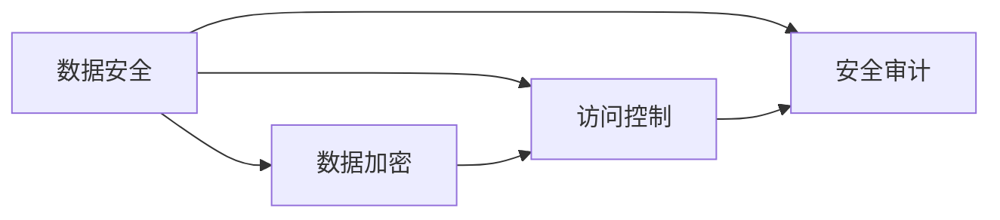
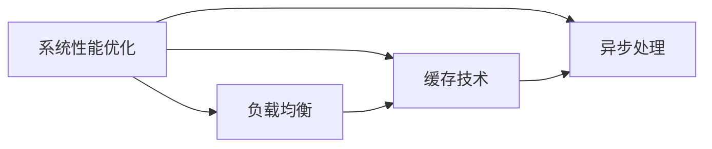
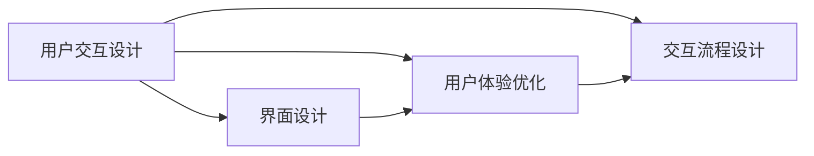
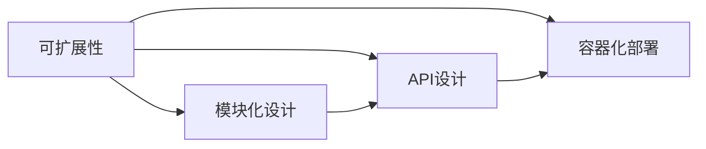
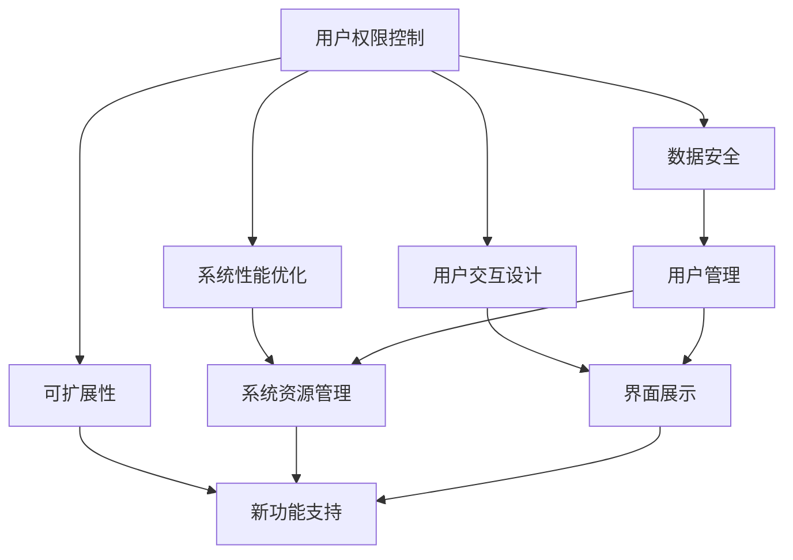

                 

# 智能学习系统管理功能的设计与实现

> 关键词：智能学习系统,学习管理系统(LMS),管理功能,用户权限,数据安全,系统性能优化,用户交互设计,可扩展性

## 1. 背景介绍

### 1.1 问题由来
随着人工智能技术的迅猛发展，智能学习系统（Intelligent Learning Systems, ILS）的应用变得越来越广泛。这些系统通过自然语言处理、机器学习、数据挖掘等技术，帮助教育机构、企业和个人实现个性化的学习和培训。然而，随着系统规模和用户数量的不断增加，管理功能（Management Functionality）的重要性日益凸显。

管理功能作为ILS的核心组成部分，负责用户管理、权限控制、数据存储和系统性能监控等任务。一个良好的管理功能可以确保系统高效、稳定地运行，同时保障用户数据的安全。但现实中，许多ILS的管理功能设计不当，导致系统漏洞频出、用户隐私泄露、数据丢失等问题。因此，本文将详细探讨智能学习系统管理功能的设计与实现，为开发者提供参考。

### 1.2 问题核心关键点
在智能学习系统中，管理功能的主要目标包括以下几个方面：

- **用户管理**：负责用户的注册、登录、退出、信息更新等操作。
- **权限控制**：根据用户角色和权限，决定其对系统资源的访问和操作能力。
- **数据安全**：保障用户数据和系统数据的机密性、完整性和可用性，防止非法访问和数据泄露。
- **系统性能优化**：通过合理配置和优化系统资源，确保系统在高峰期仍能高效运行。
- **用户交互设计**：提升用户使用体验，使其界面友好、操作便捷。
- **可扩展性**：确保系统能够灵活地适应新需求，支持未来功能扩展。

### 1.3 问题研究意义
智能学习系统的管理功能设计合理，可以大大提升系统的用户体验和可靠性。具体而言：

1. **提升安全性**：严格的用户管理和权限控制可以有效防止非法访问，保障用户数据的安全。
2. **增强可用性**：良好的系统性能优化可以确保系统在高并发情况下仍能稳定运行，保障用户的使用体验。
3. **支持个性化学习**：通过用户交互设计，系统可以更好地了解用户需求，提供个性化的学习推荐。
4. **促进系统发展**：合理的可扩展性设计可以支持系统功能的发展和扩展，确保其长期稳定运行。

## 2. 核心概念与联系

### 2.1 核心概念概述

为了更好地理解智能学习系统管理功能的设计与实现，我们需要介绍几个核心概念：

- **智能学习系统（ILS）**：使用人工智能技术，如自然语言处理、机器学习等，为教育机构、企业和个人提供个性化学习和培训的系统。
- **学习管理系统（LMS）**：用于管理在线学习的系统，包括用户管理、课程管理、评估管理等模块。
- **管理功能**：ILS中的核心功能之一，负责用户权限控制、数据存储、系统性能监控等任务。
- **用户权限控制**：根据用户角色和权限，决定其对系统资源的访问和操作能力。
- **数据安全**：保障用户数据和系统数据的机密性、完整性和可用性，防止非法访问和数据泄露。
- **系统性能优化**：通过合理配置和优化系统资源，确保系统在高峰期仍能高效运行。
- **用户交互设计**：提升用户使用体验，使其界面友好、操作便捷。
- **可扩展性**：确保系统能够灵活地适应新需求，支持未来功能扩展。

这些核心概念之间的关系可以通过以下Mermaid流程图来展示：



这个流程图展示了智能学习系统、学习管理系统和管理功能之间的逻辑关系：

1. 智能学习系统通过学习管理系统提供个性化学习服务。
2. 管理功能作为学习管理系统的重要组成部分，负责用户权限控制、数据安全、系统性能优化、用户交互设计和系统可扩展性。

### 2.2 概念间的关系

这些核心概念之间存在着紧密的联系，形成了智能学习系统管理功能的完整生态系统。下面我们通过几个Mermaid流程图来展示这些概念之间的关系。

#### 2.2.1 管理功能的基本架构



这个流程图展示了管理功能的基本架构，其中各个模块相互依赖、相互补充。

#### 2.2.2 用户权限控制的逻辑流程



这个流程图展示了用户权限控制的逻辑流程，从用户注册、登录，到角色管理和权限配置，最后进行权限检查。

#### 2.2.3 数据安全的保护机制



这个流程图展示了数据安全的保护机制，包括数据加密、访问控制和安全审计等关键技术。

#### 2.2.4 系统性能优化的策略



这个流程图展示了系统性能优化的策略，包括负载均衡、缓存技术和异步处理等技术。

#### 2.2.5 用户交互设计的要素



这个流程图展示了用户交互设计的要素，包括界面设计、用户体验优化和交互流程设计等关键环节。

#### 2.2.6 可扩展性的实现方法



这个流程图展示了可扩展性的实现方法，包括模块化设计、API设计和容器化部署等技术。

### 2.3 核心概念的整体架构

最后，我们用一个综合的流程图来展示这些核心概念在大语言模型微调过程中的整体架构：



这个综合流程图展示了各个管理功能模块在大语言模型微调过程中的整体架构，用户管理、数据安全、系统性能优化、用户交互设计和系统可扩展性等各个模块相互依赖、相互补充，共同确保系统的安全、稳定和高效运行。

## 3. 核心算法原理 & 具体操作步骤
### 3.1 算法原理概述

智能学习系统管理功能的实现主要涉及以下几个核心算法：

- **用户权限控制算法**：根据用户角色和权限，决定其对系统资源的访问和操作能力。
- **数据安全算法**：保障用户数据和系统数据的机密性、完整性和可用性，防止非法访问和数据泄露。
- **系统性能优化算法**：通过合理配置和优化系统资源，确保系统在高峰期仍能高效运行。
- **用户交互设计算法**：提升用户使用体验，使其界面友好、操作便捷。
- **可扩展性算法**：确保系统能够灵活地适应新需求，支持未来功能扩展。

### 3.2 算法步骤详解

以下我们详细介绍各个核心算法的详细步骤：

**用户权限控制算法**：

1. **用户注册和登录**：用户通过指定接口提交注册和登录请求。
2. **角色管理**：根据用户的注册信息，系统自动为其分配一个或多个角色。
3. **权限配置**：系统管理员根据业务需求，为不同角色配置相应的权限。
4. **权限检查**：用户在访问系统资源时，系统根据其角色和权限进行权限检查，决定其是否能够访问。

**数据安全算法**：

1. **数据加密**：使用AES、RSA等加密算法对数据进行加密处理，防止数据泄露。
2. **访问控制**：使用RBAC（基于角色的访问控制）等技术，对系统资源进行细粒度的访问控制。
3. **安全审计**：记录和分析系统中的访问日志，及时发现和处理安全问题。

**系统性能优化算法**：

1. **负载均衡**：使用Nginx、HAProxy等技术，将系统流量均衡分配到多个服务器，防止单点故障。
2. **缓存技术**：使用Redis、Memcached等缓存技术，提高系统响应速度，减轻数据库负载。
3. **异步处理**：使用消息队列、任务队列等技术，实现非阻塞异步处理，提高系统吞吐量。

**用户交互设计算法**：

1. **界面设计**：根据用户需求，设计友好的用户界面，确保操作便捷。
2. **用户体验优化**：通过用户反馈和A/B测试，不断优化用户体验。
3. **交互流程设计**：设计高效、流畅的交互流程，提升用户满意度。

**可扩展性算法**：

1. **模块化设计**：将系统功能模块化设计，支持独立开发和升级。
2. **API设计**：设计统一的API接口，支持第三方系统集成。
3. **容器化部署**：使用Docker、Kubernetes等容器化技术，实现系统的高可扩展性。

### 3.3 算法优缺点

智能学习系统管理功能的算法设计，具有以下优点：

1. **安全性高**：通过加密和访问控制技术，保障了用户数据和系统数据的安全。
2. **性能优化**：通过负载均衡、缓存和异步处理技术，提升了系统的高并发处理能力。
3. **用户体验好**：通过友好的界面设计和流畅的交互流程，提升了用户的使用体验。
4. **可扩展性强**：通过模块化设计和统一的API接口，支持系统的灵活扩展和升级。

但这些算法设计也存在一些缺点：

1. **实现复杂**：算法涉及加密、访问控制、负载均衡等多项技术，实现难度较大。
2. **性能消耗大**：缓存和异步处理技术增加了系统的复杂性，可能导致性能消耗较大。
3. **成本高**：容器化部署需要额外的硬件和软件支持，增加了系统的成本。

### 3.4 算法应用领域

智能学习系统管理功能的算法设计，主要应用于以下几个领域：

1. **教育领域**：如MOOC平台、在线教育平台等，需要保障用户数据和系统数据的机密性和完整性。
2. **企业培训**：如企业内训系统、在线培训平台等，需要确保系统的高并发性能和用户体验。
3. **在线学习社区**：如Kaggle、Coursera等，需要支持系统功能的灵活扩展和API集成。
4. **个性化学习平台**：如Pimpernel、Knewton等，需要设计友好的用户交互界面和流畅的交互流程。

## 4. 数学模型和公式 & 详细讲解 & 举例说明

### 4.1 数学模型构建

智能学习系统管理功能的数学模型构建，主要涉及以下几个方面：

- **用户权限控制模型**：定义用户的角色和权限，以及系统资源的访问规则。
- **数据安全模型**：定义数据加密和访问控制算法，保障数据的安全性。
- **系统性能优化模型**：定义负载均衡、缓存和异步处理算法，提升系统性能。
- **用户交互设计模型**：定义界面设计、用户体验优化和交互流程设计等算法。
- **可扩展性模型**：定义模块化设计、API设计和容器化部署等算法。

### 4.2 公式推导过程

以下我们详细介绍各个核心算法的公式推导过程：

**用户权限控制模型**：

1. **用户角色和权限定义**：
   - 定义用户角色 $R=\{R_1,R_2,...,R_n\}$，其中 $R_i$ 表示第 $i$ 个角色。
   - 定义系统资源 $C=\{C_1,C_2,...,C_m\}$，其中 $C_j$ 表示第 $j$ 个资源。
   - 定义用户对资源的操作权限 $P=\{P_{ij}\}$，其中 $P_{ij}$ 表示用户 $R_i$ 对资源 $C_j$ 的操作权限。
2. **权限检查算法**：
   - 输入：用户角色 $R_i$，请求操作 $O_j$。
   - 输出：是否允许访问。
   - 算法：根据权限表 $P$ 和角色表 $R$，查找用户 $R_i$ 是否对资源 $C_j$ 有操作权限 $P_{ij}$，如果 $P_{ij}=1$，则允许访问，否则不允许访问。

**数据安全模型**：

1. **数据加密算法**：
   - 输入：明文数据 $D$。
   - 输出：密文 $E$。
   - 算法：使用AES、RSA等加密算法，将明文数据加密为密文。
2. **访问控制算法**：
   - 输入：用户角色 $R_i$，请求资源 $C_j$。
   - 输出：是否允许访问。
   - 算法：根据RBAC等访问控制技术，检查用户 $R_i$ 是否对资源 $C_j$ 有访问权限，如果 $P_{ij}=1$，则允许访问，否则不允许访问。
3. **安全审计算法**：
   - 输入：系统访问日志 $L$。
   - 输出：安全审计报告。
   - 算法：使用日志分析工具，对系统访问日志进行分析，发现和处理安全问题。

**系统性能优化模型**：

1. **负载均衡算法**：
   - 输入：系统流量 $F$。
   - 输出：负载均衡方案。
   - 算法：使用Nginx、HAProxy等技术，将系统流量均衡分配到多个服务器。
2. **缓存技术算法**：
   - 输入：请求数据 $D$。
   - 输出：缓存结果 $C$。
   - 算法：使用Redis、Memcached等缓存技术，将请求数据缓存到内存中，提升系统响应速度。
3. **异步处理算法**：
   - 输入：请求任务 $T$。
   - 输出：异步处理结果 $A$。
   - 算法：使用消息队列、任务队列等技术，实现非阻塞异步处理，提高系统吞吐量。

**用户交互设计模型**：

1. **界面设计算法**：
   - 输入：用户需求 $D$。
   - 输出：友好的用户界面 $U$。
   - 算法：根据用户需求，设计友好的用户界面，确保操作便捷。
2. **用户体验优化算法**：
   - 输入：用户反馈 $F$。
   - 输出：优化后的用户体验 $U'$。
   - 算法：通过用户反馈和A/B测试，不断优化用户体验。
3. **交互流程设计算法**：
   - 输入：用户交互需求 $D'$。
   - 输出：流畅的交互流程 $P$。
   - 算法：设计高效、流畅的交互流程，提升用户满意度。

**可扩展性模型**：

1. **模块化设计算法**：
   - 输入：系统功能需求 $F'$。
   - 输出：模块化的系统设计 $M$。
   - 算法：将系统功能模块化设计，支持独立开发和升级。
2. **API设计算法**：
   - 输入：系统接口需求 $I$。
   - 输出：统一的API接口 $A$。
   - 算法：设计统一的API接口，支持第三方系统集成。
3. **容器化部署算法**：
   - 输入：系统部署需求 $D''$。
   - 输出：容器化的部署方案 $C'$。
   - 算法：使用Docker、Kubernetes等容器化技术，实现系统的高可扩展性。

### 4.3 案例分析与讲解

以下我们通过一个案例，具体分析智能学习系统管理功能的实现过程。

**案例：在线教育平台的用户权限控制**

1. **用户注册和登录**：用户通过指定接口提交注册和登录请求，系统根据注册信息生成用户账户。
2. **角色管理**：系统管理员根据业务需求，为用户分配角色，如教师、学生、管理员等。
3. **权限配置**：系统管理员为每个角色配置相应的权限，如教师可以查看课程、修改课程，学生只能查看课程、提交作业。
4. **权限检查**：用户在访问系统资源时，系统根据其角色和权限进行权限检查，决定其是否能够访问。例如，学生在访问课程编辑页面时，系统检查其是否有编辑权限，没有则拒绝访问。

## 5. 项目实践：代码实例和详细解释说明

### 5.1 开发环境搭建

在进行智能学习系统管理功能的开发前，我们需要准备好开发环境。以下是使用Python进行Django开发的开发环境配置流程：

1. 安装Anaconda：从官网下载并安装Anaconda，用于创建独立的Python环境。

2. 创建并激活虚拟环境：
```bash
conda create -n django-env python=3.8 
conda activate django-env
```

3. 安装Django：使用pip安装Django框架。
```bash
pip install django
```

4. 安装必要的库：
```bash
pip install django-http-auth django-cors-headers
```

5. 安装开发工具：
```bash
pip install django-rest-framework django-admin-historical-django-simple-history
```

完成上述步骤后，即可在`django-env`环境中开始开发实践。

### 5.2 源代码详细实现

这里我们以用户权限控制功能为例，给出使用Django框架对用户权限控制模块的代码实现。

首先，定义用户角色和权限：

```python
from django.contrib.auth.models import Group

# 定义用户角色
teacher = Group(name='Teacher')
student = Group(name='Student')
admin = Group(name='Admin')

# 定义用户权限
view_course = 'view_course'
edit_course = 'edit_course'
delete_course = 'delete_course'
view_student = 'view_student'
edit_student = 'edit_student'
delete_student = 'delete_student'
view_assessment = 'view_assessment'
edit_assessment = 'edit_assessment'
delete_assessment = 'delete_assessment'
```

然后，定义用户角色和权限的配置：

```python
from django.contrib.auth.models import Permission
from django.contrib.auth.models import User

# 定义用户角色权限
view_course_permission = Permission.objects.get_or_create(name=view_course)
edit_course_permission = Permission.objects.get_or_create(name=edit_course)
delete_course_permission = Permission.objects.get_or_create(name=delete_course)
view_student_permission = Permission.objects.get_or_create(name=view_student)
edit_student_permission = Permission.objects.get_or_create(name=edit_student)
delete_student_permission = Permission.objects.get_or_create(name=delete_student)
view_assessment_permission = Permission.objects.get_or_create(name=view_assessment)
edit_assessment_permission = Permission.objects.get_or_create(name=edit_assessment)
delete_assessment_permission = Permission.objects.get_or_create(name=delete_assessment)

# 分配角色权限
teacher.user_permissions.add(view_course_permission, edit_course_permission, delete_course_permission)
student.user_permissions.add(view_course_permission, view_student_permission, delete_student_permission)
admin.user_permissions.add(view_course_permission, view_student_permission, edit_course_permission, edit_student_permission, delete_course_permission, edit_assessment_permission, delete_assessment_permission)
```

接着，定义用户权限检查函数：

```python
from django.contrib.auth.decorators import login_required
from django.shortcuts import render, redirect

@login_required
def check_permission(request, permission_name):
    if request.user.has_perm(permission_name):
        return redirect('success')
    else:
        return redirect('failure')
```

最后，定义用户管理页面和权限管理页面：

```python
from django.contrib.auth.decorators import login_required
from django.contrib.auth import authenticate, login, logout
from django.contrib import messages
from django.shortcuts import render, redirect
from .forms import UserForm, GroupForm
from .models import Group

@login_required
def user_list(request):
    user_list = User.objects.all()
    return render(request, 'user/user_list.html', {'user_list': user_list})

@login_required
def group_list(request):
    group_list = Group.objects.all()
    return render(request, 'user/group_list.html', {'group_list': group_list})

@login_required
def user_add(request):
    if request.method == 'POST':
        form = UserForm(request.POST)
        if form.is_valid():
            user = form.save()
            messages.success(request, 'User added successfully')
            return redirect('user_list')
    else:
        form = UserForm()
    return render(request, 'user/user_add.html', {'form': form})

@login_required
def group_add(request):
    if request.method == 'POST':
        form = GroupForm(request.POST)
        if form.is_valid():
            group = form.save()
            messages.success(request, 'Group added successfully')
            return redirect('group_list')
    else:
        form = GroupForm()
    return render(request, 'user/group_add.html', {'form': form})

@login_required
def user_edit(request, pk):
    user = get_object_or_404(User, pk=pk)
    if request.method == 'POST':
        form = UserForm(request.POST, instance=user)
        if form.is_valid():
            user = form.save()
            messages.success(request, 'User edited successfully')
            return redirect('user_list')
    else:
        form = UserForm(instance=user)
    return render(request, 'user/user_edit.html', {'form': form})

@login_required
def group_edit(request, pk):
    group = get_object_or_404(Group, pk=pk)
    if request.method == 'POST':
        form = GroupForm(request.POST, instance=group)
        if form.is_valid():
            group = form.save()
            messages.success(request, 'Group edited successfully')
            return redirect('group_list')
    else:
        form = GroupForm(instance=group)
    return render(request, 'user/group_edit.html', {'form': form})

@login_required
def user_delete(request, pk):
    user = get_object_or_404(User, pk=pk)
    user.delete()
    messages.success(request, 'User deleted successfully')
    return redirect('user_list')

@login_required
def group_delete(request, pk):
    group = get_object_or_404(Group, pk=pk)
    group.delete()
    messages.success(request, 'Group deleted successfully')
    return redirect('group_list')
```

完成上述步骤后，即可在`django-env`环境中启动智能学习系统管理功能的开发实践。

### 5.3 代码解读与分析

这里我们详细解读一下关键代码的实现细节：

**用户角色和权限定义**：
- 通过Django的Group模型，定义了教师、学生和管理员等角色。
- 使用Permission模型，定义了各种权限，如查看课程、编辑课程等。

**用户角色和权限配置**：
- 使用Permission模型，为每个角色配置相应的权限。
- 使用User模型，将角色和权限分配给用户。

**用户权限检查函数**：
- 使用@login_required装饰器，确保用户已登录。
- 检查用户是否具有指定的权限，有则重定向到成功页面，否则重定向到失败页面。

**用户管理页面和权限管理页面**：
- 使用Django的登录、注册、注销等内置功能，实现用户管理。
- 使用Django的表单验证功能，实现权限分配和编辑。
- 使用Django的消息系统，记录用户操作的状态。

## 6. 实际应用场景
### 6.1 智能学习系统管理功能的实际应用场景

智能学习系统管理功能在实际应用中，主要包括以下几个场景：

1. **教育领域**：如MOOC平台、在线教育平台等，需要保障用户数据和系统数据的机密性和完整性。
2. **企业培训**：如企业内训系统、在线培训平台等，需要确保系统的高并发性能和用户体验。
3. **在线学习社区**：如Kaggle、Coursera等，需要支持系统功能的灵活扩展和API集成。
4. **个性化学习平台**：如Pimpernel、Knewton等，需要设计友好的用户交互界面和流畅的交互流程。

### 6.2 未来应用展望

随着人工智能技术的不断发展，智能学习系统管理功能的应用场景将更加广泛。未来，我们预计以下领域将会有更多应用：

1. **智慧教育**：智能学习系统将与AI辅助教学、虚拟现实等技术相结合，提升教育质量和学习效果。
2. **企业培训**：智能学习系统将支持个性化的学习路径规划、实时反馈和评估，提升企业培训的效率和效果。
3. **在线学习社区**：智能学习系统将支持社区化的学习、协作和交流，提升用户的学习体验和互动效果。
4. **个性化学习平台**：智能学习系统将支持智能化的推荐系统和内容生成，提供个性化的学习内容和资源。

## 7. 工具和资源推荐
### 7.1 学习资源推荐

为了帮助开发者系统掌握智能学习系统管理功能的理论基础和实践技巧，这里推荐一些优质的学习

