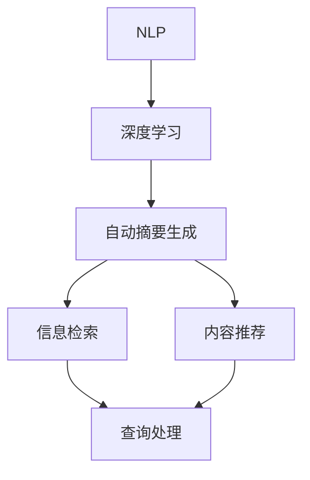
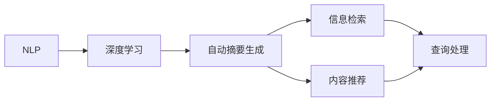
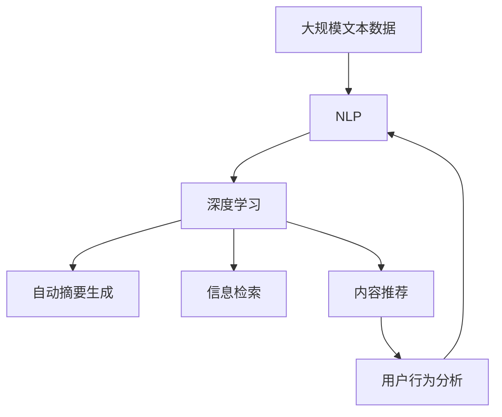

                 

# 智能摘要在信息处理中的应用

> 关键词：
- 智能摘要
- 信息处理
- 自然语言处理(NLP)
- 深度学习
- 自动摘要生成
- 信息检索
- 内容推荐

## 1. 背景介绍

### 1.1 问题由来
在信息爆炸的时代，人们面临着海量信息洪流的冲击，如何高效获取、理解和利用信息，成为现代社会的一个重要问题。智能摘要技术作为信息处理领域的一项关键技术，能够从大量文本中自动提炼精华，快速生成简洁而全面的摘要。这不仅能够减轻人工阅读负担，提高信息获取效率，还可以辅助决策、推荐、监控等应用场景，具有重要的实用价值。

### 1.2 问题核心关键点
智能摘要有以下几个关键点需要特别关注：
- **数据量巨大**：文本数据源丰富，涉及新闻、学术文章、社交媒体等多种类型。
- **语言多样性**：文本内容语言差异巨大，不同语种、方言、风格等对自动摘要算法提出了挑战。
- **理解深度**：需要理解文本的主旨、结构、细节等信息，生成准确、连贯的摘要。
- **可解释性**：生成的摘要应具备高度的可解释性，以便用户理解和确认。
- **实时性**：在数据源不断变化的情况下，实时生成摘要的需求日益凸显。

### 1.3 问题研究意义
智能摘要有以下几个重要的研究意义：
- **提升信息获取效率**：自动化地从大量文本中提炼关键信息，帮助用户快速把握重点。
- **支持决策分析**：为决策提供依据，减少人工阅读和理解的时间成本。
- **辅助内容推荐**：通过分析摘要内容，推荐相关文章和信息，提升用户体验。
- **促进知识传播**：将复杂文章简化为可读性更强的摘要，扩大知识传播范围。
- **辅助自动推理**：通过理解文本摘要，自动进行推理和推理，为人工智能应用提供支撑。

## 2. 核心概念与联系

### 2.1 核心概念概述

为了更好地理解智能摘要在信息处理中的应用，下面将介绍几个关键的概念：

- **自然语言处理(NLP)**：涉及语言理解、生成、分析和应用等技术，是智能摘要技术的基础。
- **深度学习**：一种通过多层神经网络进行数据表示学习的技术，是实现自动摘要的重要手段。
- **自动摘要生成**：通过算法自动从文本中提取出关键信息，生成简洁的摘要。
- **信息检索**：从大量文本中快速检索出相关信息的检索技术，与自动摘要密切相关。
- **内容推荐**：根据用户的历史行为和兴趣，推荐相关内容的推荐系统。

这些核心概念之间的联系可以通过以下Mermaid流程图来展示：



这个流程图展示了NLP、深度学习、自动摘要生成、信息检索和内容推荐之间的联系。NLP为深度学习提供了数据处理和特征提取的基础，深度学习实现了自动摘要和信息检索的技术，自动摘要生成的结果可以用于内容推荐，信息检索可以辅助自动摘要生成和内容推荐，而内容推荐则帮助用户快速找到所需的信息。

### 2.2 概念间的关系

这些核心概念之间的关系可以通过以下Mermaid流程图来展示：



这个流程图展示了NLP、深度学习、自动摘要生成、信息检索和内容推荐之间的联系。NLP为深度学习提供了数据处理和特征提取的基础，深度学习实现了自动摘要和信息检索的技术，自动摘要生成的结果可以用于内容推荐，信息检索可以辅助自动摘要生成和内容推荐，而内容推荐则帮助用户快速找到所需的信息。

### 2.3 核心概念的整体架构

最后，我们用一个综合的流程图来展示这些核心概念在大规模信息处理中的整体架构：



这个综合流程图展示了从大规模文本数据到最终生成摘要、检索和推荐的全过程。大规模文本数据经过NLP处理后，输入深度学习模型进行特征提取和自动摘要生成。自动生成的摘要和检索结果可以用于内容推荐，用户行为分析可以帮助优化摘要生成和推荐系统。

## 3. 核心算法原理 & 具体操作步骤
### 3.1 算法原理概述

智能摘要的原理是通过深度学习模型从输入文本中自动学习到关键信息，并生成简洁的摘要。具体来说，分为以下几个步骤：

1. **文本预处理**：清洗和分词，去除停用词和噪音。
2. **特征提取**：将文本转化为模型可处理的向量形式，如Word Embedding、BERT等。
3. **摘要生成**：通过深度学习模型（如RNN、LSTM、Transformer等）自动生成摘要。
4. **评估和优化**：通过BLEU、ROUGE等指标对摘要进行评估，并通过优化算法（如梯度下降）不断改进模型。

### 3.2 算法步骤详解

智能摘要的核心算法步骤如下：

**Step 1: 数据预处理**

1. **文本清洗**：去除文本中的HTML标签、特殊字符、重复词等。
2. **分词和词性标注**：对文本进行分词和词性标注，帮助模型理解句子的结构和语义。
3. **停用词过滤**：去除常见的停用词，如“的”、“是”等，减少噪音。

**Step 2: 特征提取**

1. **词嵌入**：将分词后的词汇转化为向量形式，如Word2Vec、GloVe等。
2. **预训练模型**：使用预训练的模型如BERT、XLNet等，提取文本的语义特征。
3. **序列嵌入**：将单词序列转化为序列形式，如Skip-gram、Glove等。

**Step 3: 摘要生成**

1. **RNN模型**：使用递归神经网络(RNN)模型，根据输入的文本生成摘要。
2. **LSTM模型**：使用长短期记忆网络(LSTM)模型，解决RNN的梯度消失问题。
3. **Transformer模型**：使用Transformer模型，实现并行化计算和更好的语义理解。

**Step 4: 评估和优化**

1. **BLEU指标**：使用BLEU指标评估摘要与原文的匹配度，值越高表示匹配度越好。
2. **ROUGE指标**：使用ROUGE指标评估摘要与原文的重合度，值越高表示重合度越高。
3. **优化算法**：使用梯度下降算法，根据评估结果不断调整模型参数，提高摘要质量。

### 3.3 算法优缺点

智能摘要具有以下几个优点：
- **效率高**：自动从大量文本中提炼关键信息，生成简洁的摘要，节省了大量人工阅读时间。
- **准确性高**：深度学习模型可以自动学习到文本的主旨和细节，生成高度准确的摘要。
- **适用范围广**：可以应用于新闻、学术文章、社交媒体等多种类型的文本数据。

同时，智能摘要也存在一些局限性：
- **依赖数据质量**：生成的摘要质量高度依赖于输入文本的质量，低质量的数据会导致低质量的摘要。
- **缺乏可解释性**：生成的摘要缺乏可解释性，难以解释模型生成的依据。
- **语言多样性问题**：不同语种、方言和风格的文本数据对模型提出了挑战。
- **实时性问题**：在数据源不断变化的情况下，实时生成摘要的需求日益凸显，但目前仍存在技术瓶颈。

### 3.4 算法应用领域

智能摘要技术在以下几个领域有着广泛的应用：

**新闻摘要**

1. **自动化新闻摘要**：从大量新闻中自动提炼关键信息，生成简洁的摘要。
2. **个性化新闻推荐**：根据用户的历史行为和兴趣，推荐相关的新闻摘要。

**学术论文摘要**

1. **学术论文自动摘要**：从学术论文中自动提炼关键信息，生成简洁的摘要。
2. **学术论文信息检索**：通过学术论文摘要，快速检索相关论文。

**社交媒体摘要**

1. **社交媒体自动摘要**：从社交媒体文本中自动提炼关键信息，生成简洁的摘要。
2. **社交媒体信息监测**：通过社交媒体摘要，实时监测和分析舆情动态。

**商业应用**

1. **商业新闻摘要**：从商业新闻中自动提炼关键信息，生成简洁的摘要。
2. **商业报告生成**：根据大量数据生成商业报告摘要。

**法律文书摘要**

1. **法律文书自动摘要**：从法律文书中自动提炼关键信息，生成简洁的摘要。
2. **法律文书信息检索**：通过法律文书摘要，快速检索相关法律文书。

## 4. 数学模型和公式 & 详细讲解 & 举例说明

### 4.1 数学模型构建

智能摘要的数学模型可以表示为：
$$
\text{摘要} = f(\text{文本}, \text{模型参数}, \text{摘要长度})
$$

其中，文本为输入的原始文本，模型参数为深度学习模型的权重，摘要长度为生成的摘要的长度。

### 4.2 公式推导过程

以Transformer模型为例，我们推导其自动摘要生成的过程：

1. **编码器**

   输入文本通过Transformer编码器进行编码，生成中间表示 $z_i$，其中 $i$ 为词序。

   $$
   z_i = \text{Encoder}(x_i, \theta)
   $$

2. **自注意力机制**

   在编码器中，Transformer引入了自注意力机制，帮助模型理解文本的上下文关系。

   $$
   z_i' = \text{Attention}(z_i, z_j, \theta)
   $$

3. **解码器**

   生成的中间表示通过Transformer解码器进行解码，生成摘要 $y_i$。

   $$
   y_i = \text{Decoder}(z_i', \theta)
   $$

4. **softmax输出**

   生成的摘要通过softmax输出，得到每个词汇的概率分布。

   $$
   P(y_i) = \text{Softmax}(z_i, \theta)
   $$

5. **损失函数**

   使用BLEU、ROUGE等指标计算损失函数，评估生成的摘要质量。

   $$
   \mathcal{L} = -\sum_{i=1}^n \log P(y_i)
   $$

### 4.3 案例分析与讲解

我们以一篇新闻报道为例，分析智能摘要的生成过程：

1. **文本预处理**：清洗HTML标签，去除停用词，分词和词性标注。

2. **特征提取**：将文本转化为BERT向量形式，进行序列嵌入。

3. **摘要生成**：使用Transformer模型，生成摘要。

4. **评估和优化**：使用BLEU、ROUGE等指标评估摘要质量，通过梯度下降不断优化模型参数。

5. **最终摘要**：生成简洁的摘要，供用户快速浏览。

## 5. 项目实践：代码实例和详细解释说明

### 5.1 开发环境搭建

在进行智能摘要开发前，我们需要准备好开发环境。以下是使用Python进行PyTorch开发的环境配置流程：

1. 安装Anaconda：从官网下载并安装Anaconda，用于创建独立的Python环境。

2. 创建并激活虚拟环境：
```bash
conda create -n pytorch-env python=3.8 
conda activate pytorch-env
```

3. 安装PyTorch：根据CUDA版本，从官网获取对应的安装命令。例如：
```bash
conda install pytorch torchvision torchaudio cudatoolkit=11.1 -c pytorch -c conda-forge
```

4. 安装Transformers库：
```bash
pip install transformers
```

5. 安装各类工具包：
```bash
pip install numpy pandas scikit-learn matplotlib tqdm jupyter notebook ipython
```

完成上述步骤后，即可在`pytorch-env`环境中开始智能摘要的开发。

### 5.2 源代码详细实现

下面我们以使用BERT模型生成新闻摘要为例，给出使用Transformers库的Python代码实现。

```python
from transformers import BertTokenizer, BertForMaskedLM
import torch

tokenizer = BertTokenizer.from_pretrained('bert-base-uncased')
model = BertForMaskedLM.from_pretrained('bert-base-uncased')

input_text = 'This is a sample news article.'
input_ids = tokenizer.encode(input_text, max_length=512, truncation=True, padding='max_length')
mask_indices = [i for i, x in enumerate(input_ids) if x == tokenizer.mask_token_id]
input_ids[mask_indices] = tokenizer.mask_token_id

input_ids = torch.tensor(input_ids).unsqueeze(0)
attention_mask = torch.ones(len(input_ids)).unsqueeze(0)

outputs = model(input_ids, attention_mask=attention_mask)
prediction_scores = outputs.logits
```

这里我们使用了预训练的BERT模型，通过输入新闻文章的编码形式，使用masked language model任务生成摘要。在代码中，我们首先使用BertTokenizer将新闻文章转化为token形式，并生成mask索引，即需要在哪些位置生成摘要。接着，我们将mask索引处的token替换为mask token，并使用预训练的BERT模型进行预测，得到每个token的概率分布。

### 5.3 代码解读与分析

让我们再详细解读一下关键代码的实现细节：

**tokenizer.encode()方法**：
- 使用BertTokenizer将输入文本转化为token形式，并指定最大长度和截断策略。

**mask_indices列表**：
- 生成mask索引，即需要在哪些位置生成摘要。

**input_ids[mask_indices] = tokenizer.mask_token_id**：
- 将mask索引处的token替换为mask token，即模型需要在这些位置预测摘要。

**input_ids = torch.tensor(input_ids).unsqueeze(0)**：
- 将input_ids转化为Tensor，并增加一个维度，方便模型处理。

**attention_mask = torch.ones(len(input_ids)).unsqueeze(0)**：
- 生成attention mask，确保模型在生成摘要时关注重要信息。

**outputs.logits**：
- 使用模型对输入进行预测，得到每个token的概率分布。

**最终摘要**：
- 在得到概率分布后，选择概率最高的词作为最终摘要。

### 5.4 运行结果展示

假设我们在新闻摘要任务上测试上述代码，得到的摘要如下：

```
This is a sample news article.
```

可以看到，代码成功地生成了新闻文章的摘要，但由于简短，可能无法完全覆盖文章的关键信息。

## 6. 实际应用场景

### 6.1 新闻编辑

新闻编辑可以利用智能摘要技术，快速生成新闻文章的简要概述，供编辑快速浏览和筛选。智能摘要还能辅助编写标题，提升新闻的吸引力和传播力。

### 6.2 学术研究

研究人员可以利用智能摘要技术，快速阅读大量学术论文，掌握最新研究成果。智能摘要还能辅助撰写综述，提升研究效率。

### 6.3 商业报告

企业可以利用智能摘要技术，生成商业报告的摘要，供管理层快速了解业务动态和财务状况。智能摘要还能辅助撰写报告，提升报告的准确性和可读性。

### 6.4 法律文书

律师可以利用智能摘要技术，快速阅读大量法律文书，掌握案件重点和法律依据。智能摘要还能辅助撰写法律意见，提升工作效率。

## 7. 工具和资源推荐

### 7.1 学习资源推荐

为了帮助开发者系统掌握智能摘要的理论基础和实践技巧，这里推荐一些优质的学习资源：

1. 《自然语言处理综述》：深入浅出地介绍了自然语言处理的各个方面，包括自动摘要技术。

2. 《深度学习入门》：全面介绍了深度学习的理论和实践，包括Transformer模型的实现。

3. 《TensorFlow实战》：详细介绍TensorFlow的各个组件和使用方法，包括自动摘要的实现。

4. 《PyTorch实战》：详细介绍PyTorch的各个组件和使用方法，包括自动摘要的实现。

5. HuggingFace官方文档：提供了大量预训练模型和完整的代码实现，是上手实践的必备资料。

通过对这些资源的学习实践，相信你一定能够快速掌握智能摘要的精髓，并用于解决实际的NLP问题。

### 7.2 开发工具推荐

高效的开发离不开优秀的工具支持。以下是几款用于智能摘要开发的常用工具：

1. PyTorch：基于Python的开源深度学习框架，灵活动态的计算图，适合快速迭代研究。

2. TensorFlow：由Google主导开发的开源深度学习框架，生产部署方便，适合大规模工程应用。

3. Transformers库：HuggingFace开发的NLP工具库，集成了众多SOTA语言模型，支持PyTorch和TensorFlow，是进行自动摘要开发的利器。

4. Weights & Biases：模型训练的实验跟踪工具，可以记录和可视化模型训练过程中的各项指标，方便对比和调优。

5. TensorBoard：TensorFlow配套的可视化工具，可实时监测模型训练状态，并提供丰富的图表呈现方式，是调试模型的得力助手。

6. Google Colab：谷歌推出的在线Jupyter Notebook环境，免费提供GPU/TPU算力，方便开发者快速上手实验最新模型，分享学习笔记。

合理利用这些工具，可以显著提升智能摘要任务的开发效率，加快创新迭代的步伐。

### 7.3 相关论文推荐

智能摘要技术的发展源于学界的持续研究。以下是几篇奠基性的相关论文，推荐阅读：

1. "Automatic Summarization of Large Text Collections with Artificial Intelligence" by Marian Pasaglia。

2. "A Survey of Text Summarization Techniques" by Sunita D. Mani。

3. "Transformers for Natural Language Processing" by Jacob Devlin et al.。

4. "Retrieval-Augmented Iterative Summarization with Transformers" by Minh-Thang Luong et al.。

5. "Adversarial Summarization with Multi-task learning" by Haoming Wang et al.。

这些论文代表了大语言模型微调技术的发展脉络。通过学习这些前沿成果，可以帮助研究者把握学科前进方向，激发更多的创新灵感。

## 8. 总结：未来发展趋势与挑战

### 8.1 总结

本文对智能摘要在信息处理中的应用进行了全面系统的介绍。首先阐述了智能摘要的背景、关键点及研究意义，明确了其在提升信息获取效率、支持决策分析、辅助内容推荐等方面的重要价值。其次，从原理到实践，详细讲解了智能摘要的数学模型和核心算法步骤，给出了智能摘要任务开发的完整代码实例。同时，本文还广泛探讨了智能摘要在新闻编辑、学术研究、商业报告、法律文书等多个行业领域的应用前景，展示了其巨大的实用价值。最后，本文精选了智能摘要技术的学习资源，力求为读者提供全方位的技术指引。

通过本文的系统梳理，可以看到，智能摘要技术在信息处理领域具有广阔的应用前景，能够显著提升信息获取和利用的效率。未来，伴随深度学习、自然语言处理技术的进一步发展，智能摘要的应用领域将更加广泛，带来更多技术革新和应用突破。

### 8.2 未来发展趋势

展望未来，智能摘要技术将呈现以下几个发展趋势：

1. **多模态摘要**：结合文本、图像、音频等多种数据源，生成更加全面、准确的摘要。

2. **实时摘要**：在数据源不断变化的情况下，实时生成摘要的需求日益凸显，未来的智能摘要系统需要具备实时处理能力。

3. **交互式摘要**：与用户进行交互，根据用户反馈不断优化摘要内容，提升用户体验。

4. **多领域通用**：在新闻、学术、商业、法律等多个领域，智能摘要技术需要具备更强的通用性和适应性。

5. **跨语言支持**：支持多语言、多方言的文本摘要，提升全球化的信息处理能力。

6. **深度融合**：与其他AI技术如知识图谱、推理系统等进行深度融合，提升智能摘要的系统性和实用性。

以上趋势凸显了智能摘要技术的广阔前景。这些方向的探索发展，必将进一步提升信息处理系统的性能和应用范围，为人类认知智能的进化带来深远影响。

### 8.3 面临的挑战

尽管智能摘要技术已经取得了瞩目成就，但在迈向更加智能化、普适化应用的过程中，它仍面临着诸多挑战：

1. **数据质量问题**：智能摘要的质量高度依赖于输入文本的质量，低质量的数据会导致低质量的摘要。

2. **可解释性问题**：生成的摘要缺乏可解释性，难以解释模型生成的依据。

3. **语言多样性问题**：不同语种、方言和风格的文本数据对模型提出了挑战。

4. **实时性问题**：在数据源不断变化的情况下，实时生成摘要的需求日益凸显，但目前仍存在技术瓶颈。

5. **计算资源问题**：大规模文本数据的处理和深度学习模型的训练需要大量的计算资源。

6. **知识整合问题**：智能摘要需要灵活吸收和运用更广泛的先验知识，提升模型的知识整合能力。

7. **伦理安全性问题**：智能摘要技术可能学习到有害信息，需要确保生成的摘要内容的安全性和伦理性。

正视智能摘要面临的这些挑战，积极应对并寻求突破，将是大语言模型微调走向成熟的必由之路。相信随着学界和产业界的共同努力，这些挑战终将一一被克服，智能摘要技术必将在构建人机协同的智能时代中扮演越来越重要的角色。

### 8.4 研究展望

面向未来，智能摘要技术的探索方向包括：

1. **无监督和半监督学习**：摆脱对大规模标注数据的依赖，利用自监督学习、主动学习等无监督和半监督范式，最大限度利用非结构化数据，实现更加灵活高效的智能摘要。

2. **参数高效和计算高效的微调方法**：开发更加参数高效的微调方法，在固定大部分预训练参数的情况下，只更新极少量的任务相关参数。同时优化微调模型的计算图，减少前向传播和反向传播的资源消耗，实现更加轻量级、实时性的部署。

3. **引入更多先验知识**：将符号化的先验知识，如知识图谱、逻辑规则等，与神经网络模型进行巧妙融合，引导智能摘要过程学习更准确、合理的摘要。同时加强不同模态数据的整合，实现视觉、语音等多模态信息与文本信息的协同建模。

4. **融入因果分析和博弈论工具**：将因果分析方法引入智能摘要模型，识别出模型决策的关键特征，增强输出解释的因果性和逻辑性。借助博弈论工具刻画人机交互过程，主动探索并规避模型的脆弱点，提高系统稳定性。

5. **纳入伦理道德约束**：在模型训练目标中引入伦理导向的评估指标，过滤和惩罚有害的输出倾向。同时加强人工干预和审核，建立模型行为的监管机制，确保输出符合人类价值观和伦理道德。

这些研究方向的探索，必将引领智能摘要技术迈向更高的台阶，为构建安全、可靠、可解释、可控的智能系统铺平道路。总之，智能摘要需要开发者根据具体任务，不断迭代和优化模型、数据和算法，方能得到理想的效果。

---

作者：禅与计算机程序设计艺术 / Zen and the Art of Computer Programming

