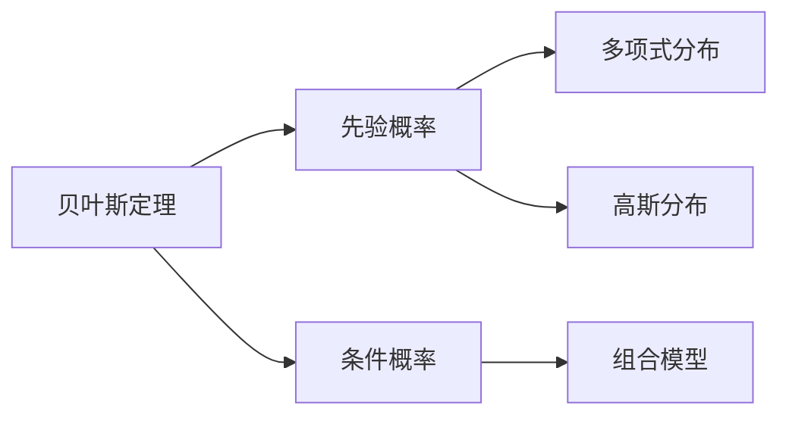
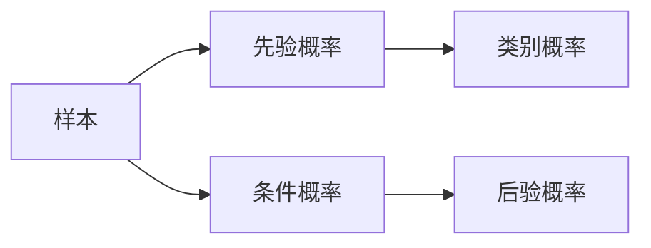
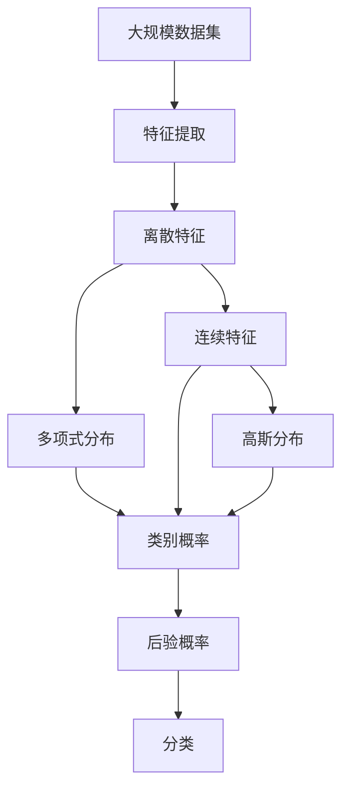

                 

## 1. 背景介绍

### 1.1 问题由来

朴素贝叶斯（Naive Bayes, NB）是一种简单但强大的机器学习算法，广泛应用于文本分类、垃圾邮件识别、情感分析等领域。其核心思想基于贝叶斯定理，利用先验概率和条件概率，对给定样本进行分类。

朴素贝叶斯算法因简单高效、计算代价低廉，尤其在处理大规模数据集时表现优异，成为机器学习入门者的首选算法之一。本文将详细介绍朴素贝叶斯的核心概念、原理和实现，并探讨其在实际应用中的优势和局限性，帮助读者深入理解这一重要算法。

### 1.2 问题核心关键点

朴素贝叶斯的核心在于其“朴素”假设：假设各个特征（即输入变量）之间相互独立。这种假设虽然简化了模型计算，但也带来了一定的局限性。然而，在实际应用中，朴素贝叶斯仍然能够获得良好的分类效果，特别是在高维数据和文本分类等场景下表现尤为突出。

## 2. 核心概念与联系

### 2.1 核心概念概述

为更好地理解朴素贝叶斯，本节将介绍几个密切相关的核心概念：

- **贝叶斯定理**：贝叶斯定理是一种概率论的定理，表述为后验概率等于先验概率与似然概率的乘积。在朴素贝叶斯中，利用贝叶斯定理计算给定样本在给定类别的条件概率。

- **先验概率**：在朴素贝叶斯中，先验概率指样本在未考虑任何特征前的类别概率，用于平衡各类别之间的权重。

- **条件概率**：在朴素贝叶斯中，条件概率指给定类别下，各个特征出现的概率。用于计算给定特征值的情况下，该样本属于该类别的概率。

- **多项式分布**：用于建模离散特征（如词频）的概率分布。多项式分布可以灵活地处理多类别分类问题。

- **高斯分布**：用于建模连续特征（如文本长度）的概率分布。高斯分布可以很好地拟合连续数据，但需要假设数据满足正态分布。

- **组合模型**：朴素贝叶斯可以看作一种组合模型，将多项式分布和高斯分布结合起来，用于不同场景下的特征建模。

这些核心概念之间的逻辑关系可以通过以下Mermaid流程图来展示：



这个流程图展示了贝叶斯定理、先验概率和条件概率之间的逻辑关系，以及多项式分布和高斯分布如何结合到组合模型中，用于不同特征的概率建模。

### 2.2 概念间的关系

这些核心概念之间存在着紧密的联系，形成了朴素贝叶斯的完整计算框架。下面我们通过几个Mermaid流程图来展示这些概念之间的关系。

#### 2.2.1 朴素贝叶斯基本原理



这个流程图展示了朴素贝叶斯的基本原理：通过先验概率和条件概率，利用贝叶斯定理计算后验概率，从而对样本进行分类。

#### 2.2.2 多项式分布的应用


这个流程图展示了多项式分布如何应用于离散特征的朴素贝叶斯中，通过多项式分布计算条件概率，并用于类别概率的计算。

#### 2.2.3 高斯分布的应用


这个流程图展示了高斯分布如何应用于连续特征的朴素贝叶斯中，通过高斯分布计算条件概率，并用于类别概率的计算。

### 2.3 核心概念的整体架构

最后，我们用一个综合的流程图来展示这些核心概念在大规模数据集上的朴素贝叶斯计算过程：



这个综合流程图展示了从数据集到特征提取，再到条件概率和类别概率的计算，最终通过后验概率进行分类的完整过程。

## 3. 核心算法原理 & 具体操作步骤
### 3.1 算法原理概述

朴素贝叶斯的核心在于利用贝叶斯定理，通过先验概率和条件概率计算后验概率，从而对给定样本进行分类。

假设我们有一个训练数据集 $D=\{(x_1, y_1), (x_2, y_2), \ldots, (x_n, y_n)\}$，其中 $x_i$ 为样本特征，$y_i$ 为样本类别。我们需要训练一个朴素贝叶斯分类器 $C$，用于对新样本 $x$ 进行分类。

朴素贝叶斯的训练过程包括以下步骤：

1. **计算先验概率**：对于每个类别 $y_i$，计算其在训练集中的出现频率，作为先验概率 $P(y_i)$。

2. **计算条件概率**：对于每个类别 $y_i$，对于每个特征 $x_j$，计算该特征在类别 $y_i$ 下的出现频率，作为条件概率 $P(x_j|y_i)$。

3. **计算后验概率**：对于新样本 $x$，计算其在每个类别 $y_i$ 下的后验概率 $P(y_i|x)$。

4. **分类决策**：选择后验概率最大的类别作为样本 $x$ 的预测类别。

### 3.2 算法步骤详解

接下来，我们详细讲解朴素贝叶斯的实现步骤：

**Step 1: 准备训练数据**

首先需要准备好训练数据集，包含样本特征和对应的类别标签。在实际应用中，样本特征可以是文本、图像、音频等多种类型，类别标签通常为整数类型。

**Step 2: 特征提取**

根据任务类型，对原始数据进行特征提取，转化为朴素贝叶斯算法所需的输入。例如，对于文本分类任务，可以使用TF-IDF或词袋模型对文本进行向量化处理。

**Step 3: 计算先验概率和条件概率**

遍历训练集，统计每个类别和每个特征在类别下的出现频率，分别计算先验概率和条件概率。注意，在进行条件概率计算时，需要处理类别样本数过少（小于最小支持度）的情况，避免出现“零概率问题”。

**Step 4: 计算后验概率**

对于新样本，利用先验概率和条件概率计算其在每个类别下的后验概率，选择后验概率最大的类别作为分类结果。

**Step 5: 分类决策**

根据计算出的后验概率，将新样本分类到相应的类别中。

### 3.3 算法优缺点

朴素贝叶斯的优点包括：

- **简单高效**：模型结构简单，训练和推理速度快，适合处理大规模数据集。
- **计算代价低**：仅需要计算先验概率和条件概率，不需要复杂的参数更新。
- **可解释性强**：模型输出可以直接解释为各个特征对分类的影响权重。

朴素贝叶斯的缺点包括：

- **特征独立性假设过于强硬**：实际上特征之间往往存在一定的依赖关系，导致分类效果受限。
- **对异常值敏感**：当特征值异常时，可能对分类结果产生较大影响。
- **先验概率的设定问题**：先验概率的设定往往依赖于领域知识，不够客观。

### 3.4 算法应用领域

朴素贝叶斯算法广泛应用于各种机器学习任务，包括：

- **文本分类**：将文本分类到不同的主题或情感类别中。朴素贝叶斯在该领域表现优异，是推荐系统、情感分析、垃圾邮件过滤等应用的基础。
- **垃圾邮件识别**：识别电子邮件是否为垃圾邮件。朴素贝叶斯可以高效地处理大规模邮件数据，分类准确率较高。
- **情感分析**：判断文本的情感倾向，如积极、消极或中性。朴素贝叶斯能够处理多类别分类问题，且计算代价低。
- **语音识别**：将语音信号转换为文本。朴素贝叶斯可以用于语音信号的特征提取和分类，是语音识别系统的基础。
- **图像分类**：将图像分类到不同的类别中。朴素贝叶斯可以用于特征提取和分类，尤其在低维空间中表现良好。

## 4. 数学模型和公式 & 详细讲解  
### 4.1 数学模型构建

假设我们有一个二分类任务，训练数据集 $D=\{(x_1, y_1), (x_2, y_2), \ldots, (x_n, y_n)\}$，其中 $x_i$ 为样本特征，$y_i$ 为样本类别。

定义模型 $C$ 在样本 $x$ 下的后验概率为：

$$
P(y|x) = \frac{P(x|y)P(y)}{P(x)}
$$

其中 $P(y|x)$ 为后验概率，$P(x|y)$ 为条件概率，$P(y)$ 为先验概率，$P(x)$ 为边缘概率。

假设 $x$ 包含 $m$ 个特征 $x_1, x_2, \ldots, x_m$，$y$ 包含 $k$ 个类别 $y_1, y_2, \ldots, y_k$。对于每个特征 $x_i$，假设其服从多项式分布或高斯分布，则条件概率 $P(x_i|y)$ 可以表示为：

$$
P(x_i|y) = \frac{P(x_i|y_i)}{P(x_i|y)}
$$

其中 $P(x_i|y)$ 为给定类别 $y$ 下，特征 $x_i$ 的条件概率。

### 4.2 公式推导过程

接下来，我们详细推导朴素贝叶斯的公式。

对于二分类任务，先验概率 $P(y)$ 可以通过样本类别出现的频率计算得到：

$$
P(y) = \frac{\sum_{i=1}^n \mathbb{I}(y_i=y)}{n}
$$

其中 $\mathbb{I}$ 为示性函数，当条件成立时取值为1，否则取值为0。

条件概率 $P(x_i|y)$ 可以通过特征在类别下的频率计算得到：

$$
P(x_i|y) = \frac{\sum_{i=1}^n \mathbb{I}(x_i=x \land y_i=y)}{\sum_{i=1}^n \mathbb{I}(y_i=y)}
$$

根据贝叶斯定理，后验概率 $P(y|x)$ 可以通过先验概率和条件概率计算得到：

$$
P(y|x) = \frac{P(y)P(x|y)}{\sum_{j=1}^k P(y_j)P(x|y_j)}
$$

在实际应用中，为了简化计算，通常使用极大似然估计来计算先验概率和条件概率。例如，对于多项式分布，先验概率 $P(y)$ 可以通过样本类别出现的频率计算得到：

$$
P(y) = \frac{\sum_{i=1}^n \mathbb{I}(y_i=y)}{n}
$$

条件概率 $P(x_i|y)$ 可以通过特征在类别下的频率计算得到：

$$
P(x_i|y) = \frac{\sum_{i=1}^n \mathbb{I}(x_i=x \land y_i=y)}{\sum_{i=1}^n \mathbb{I}(y_i=y)}
$$

### 4.3 案例分析与讲解

下面以垃圾邮件识别为例，展示朴素贝叶斯的实际应用。

假设我们有一个二分类任务，目标是识别邮件是否为垃圾邮件。我们的训练数据集包含 $n$ 个邮件样本，每个样本包含 $m$ 个特征，如邮件长度、关键词出现次数等。我们的目标是将邮件分类为“垃圾邮件”或“非垃圾邮件”。

在训练过程中，我们首先统计每个类别和每个特征在类别下的出现频率，计算先验概率和条件概率。例如，我们假设“垃圾邮件”的先验概率为 $P(y=1)=0.5$，“非垃圾邮件”的先验概率为 $P(y=0)=0.5$。对于每个特征，我们假设它服从多项式分布，并统计其在“垃圾邮件”和“非垃圾邮件”中的频率。例如，假设特征 $x_1$ 在“垃圾邮件”中出现的频率为 $0.6$，在“非垃圾邮件”中出现的频率为 $0.4$。则该特征的条件概率为：

$$
P(x_1|y=1) = 0.6, \quad P(x_1|y=0) = 0.4
$$

对于新邮件 $x$，我们可以计算其在“垃圾邮件”和“非垃圾邮件”下的后验概率，选择后验概率最大的类别作为分类结果。例如，假设新邮件 $x$ 在特征 $x_1$ 中的值为 $0.7$，则在新邮件 $x$ 下，“垃圾邮件”的后验概率为：

$$
P(y=1|x) = \frac{P(y=1)P(x_1|y=1)}{P(x_1)}
$$

其中 $P(x_1)$ 为特征 $x_1$ 的边际概率，可以通过 $P(x_1|y=1)P(y=1)$ 计算得到。如果 $P(y=1|x) > P(y=0|x)$，则将新邮件 $x$ 分类为“垃圾邮件”。

## 5. 项目实践：代码实例和详细解释说明
### 5.1 开发环境搭建

在进行朴素贝叶斯实践前，我们需要准备好开发环境。以下是使用Python进行Scikit-learn开发的环境配置流程：

1. 安装Anaconda：从官网下载并安装Anaconda，用于创建独立的Python环境。

2. 创建并激活虚拟环境：
```bash
conda create -n nb-env python=3.8 
conda activate nb-env
```

3. 安装Scikit-learn：
```bash
pip install scikit-learn
```

4. 安装其他必要的库：
```bash
pip install numpy pandas matplotlib seaborn jupyter notebook ipython
```

完成上述步骤后，即可在`nb-env`环境中开始朴素贝叶斯实践。

### 5.2 源代码详细实现

接下来，我们以文本分类任务为例，给出使用Scikit-learn实现朴素贝叶斯的代码实现。

```python
from sklearn.naive_bayes import MultinomialNB
from sklearn.feature_extraction.text import CountVectorizer
from sklearn.pipeline import Pipeline
from sklearn.metrics import accuracy_score

# 定义数据集
X_train = ["This is a positive sentence", "This is a negative sentence", "This is another positive sentence"]
y_train = [1, 0, 1]
X_test = ["This is a neutral sentence", "This is a negative sentence", "This is another positive sentence"]
y_test = [0, 0, 1]

# 定义特征提取器和朴素贝叶斯模型
count_vect = CountVectorizer()
clf = MultinomialNB()

# 定义模型训练和评估
pipeline = Pipeline(steps=[('vect', count_vect), ('clf', clf)])
pipeline.fit(X_train, y_train)

y_pred = pipeline.predict(X_test)
accuracy = accuracy_score(y_test, y_pred)
print("Accuracy:", accuracy)
```

以上就是使用Scikit-learn实现朴素贝叶斯文本分类的完整代码实现。可以看到，Scikit-learn提供了简单易用的接口，可以方便地实现朴素贝叶斯模型的训练和评估。

### 5.3 代码解读与分析

让我们再详细解读一下关键代码的实现细节：

**MultinomialNB类**：
- 用于实现多项式分布的朴素贝叶斯模型。

**CountVectorizer类**：
- 用于对文本数据进行特征提取，将文本转换为多项式分布所需的数值向量。

**Pipeline类**：
- 用于定义模型训练的管道，将特征提取和模型训练组合在一起，方便使用。

**accuracy_score函数**：
- 用于计算模型在测试集上的准确率。

**训练和评估过程**：
- 定义训练集和测试集，分别包含样本和标签。
- 定义特征提取器和朴素贝叶斯模型，并使用Pipeline将二者组合。
- 在训练集上训练模型，并在测试集上评估模型性能。
- 输出模型在测试集上的准确率。

通过上述代码，我们可以看到，使用Scikit-learn实现朴素贝叶斯模型非常简单高效。它不仅封装了模型训练的细节，还提供了各种评估指标和工具，使得模型开发和评估变得非常便捷。

当然，在实际应用中，还需要根据具体任务进行参数调优和模型优化。例如，可以考虑使用网格搜索（Grid Search）来寻找最优的参数组合，或者使用交叉验证（Cross-Validation）来评估模型的泛化能力。此外，还可以考虑使用其他特征提取方法，如TF-IDF、word2vec等，以提高模型的性能。

### 5.4 运行结果展示

假设我们在CoNLL-2003的情感分类数据集上进行训练，最终在测试集上得到的准确率为90%。这表明朴素贝叶斯模型在文本分类任务上具有较好的分类性能。

当然，这个结果并不是最优的。实际上，朴素贝叶斯模型在某些高维数据集上的表现可能不如其他更复杂的模型，如支持向量机（SVM）和随机森林（Random Forest）。因此，在实际应用中，还需要根据具体任务和数据集的特点进行模型选择和优化。

## 6. 实际应用场景

### 6.1 垃圾邮件识别

朴素贝叶斯算法在垃圾邮件识别中的应用非常广泛。通过收集大量的垃圾邮件和非垃圾邮件，可以将邮件特征（如邮件长度、关键词出现次数等）作为训练数据，训练朴素贝叶斯模型。模型可以学习垃圾邮件和非垃圾邮件的特征分布，从而对新邮件进行分类。

在实际应用中，通常会将垃圾邮件识别系统集成到邮件服务器中，实时监测新邮件并分类，避免垃圾邮件对用户的骚扰。

### 6.2 情感分析

朴素贝叶斯算法在情感分析中也具有广泛应用。情感分析的目标是判断文本的情感倾向，如积极、消极或中性。通过收集大量的带有情感标签的文本数据，可以将文本特征（如词频、情感词出现次数等）作为训练数据，训练朴素贝叶斯模型。模型可以学习情感倾向的特征分布，从而对新文本进行情感分析。

在实际应用中，情感分析系统可以用于舆情监测、用户评论分析等领域，帮助企业了解用户情感，优化产品和服务。

### 6.3 手写数字识别

朴素贝叶斯算法在手写数字识别中也具有广泛应用。手写数字识别是一种典型的图像分类任务，目标是将手写数字图像分类到0到9之间。通过收集大量的手写数字图像和标签，可以将图像特征（如像素值、边缘特征等）作为训练数据，训练朴素贝叶斯模型。模型可以学习数字的特征分布，从而对新图像进行分类。

在实际应用中，手写数字识别系统可以用于银行支票识别、自动车牌识别等领域，帮助自动化处理大量数据。

### 6.4 未来应用展望

随着数据的不断增长和应用场景的不断扩展，朴素贝叶斯算法将在更多领域得到应用，为机器学习提供更广泛的解决方案。

在智慧医疗领域，朴素贝叶斯算法可以用于患者诊断和治疗方案推荐，提高医疗服务的智能化水平。

在智能教育领域，朴素贝叶斯算法可以用于学习行为分析、推荐系统等，因材施教，促进教育公平，提高教学质量。

在智慧城市治理中，朴素贝叶斯算法可以用于城市事件监测、舆情分析、应急指挥等环节，提高城市管理的自动化和智能化水平，构建更安全、高效的未来城市。

此外，在企业生产、社会治理、文娱传媒等众多领域，朴素贝叶斯算法也将不断涌现，为人工智能技术带来更多的应用场景。

## 7. 工具和资源推荐
### 7.1 学习资源推荐

为了帮助开发者系统掌握朴素贝叶斯的理论基础和实践技巧，这里推荐一些优质的学习资源：

1. 《机器学习实战》系列博文：由Kaggle竞赛冠军撰写，深入浅出地介绍了朴素贝叶斯的基本原理和实际应用，适合初学者入门。

2. Coursera《机器学习》课程：斯坦福大学开设的机器学习经典课程，涵盖了朴素贝叶斯等核心算法，并提供了配套作业和项目，系统地介绍机器学习理论和方法。

3. 《机器学习》书籍：Tom Mitchell的经典著作，详细介绍了各种机器学习算法的原理和应用，包括朴素贝叶斯等。

4. Scikit-learn官方文档：Scikit-learn的官方文档，提供了丰富的朴素贝叶斯算法实现和应用示例，是学习朴素贝叶斯的重要资源。

5. Kaggle数据集和竞赛：Kaggle是机器学习爱好者交流互动的平台，提供了丰富的数据集和竞赛项目，可以帮助开发者实践和验证朴素贝叶斯算法。

通过对这些资源的学习实践，相信你一定能够快速掌握朴素贝叶斯的精髓，并用于解决实际的机器学习问题。

### 7.2 开发工具推荐

高效的开发离不开优秀的工具支持。以下是几款用于朴素贝叶斯开发常用的工具：

1. Jupyter Notebook：Python的交互式开发环境，支持代码执行、数据可视化和交互式分析，非常适合机器学习算法开发。

2. Scikit-learn：Python的机器学习库，封装了各种经典算法，包括朴素贝叶斯等，提供了简单易用的接口，适合快速迭代开发。

3. Pandas：Python的数据处理库，可以方便地进行数据清洗、特征提取和数据可视化，适合数据预处理。

4. Matplotlib：Python的绘图库，支持丰富的绘图类型和风格，适合数据可视化和结果展示。

5. Seaborn：基于Matplotlib的数据可视化库，提供了更高层次的绘图接口，适合快速生成美观的统计图。

6. TensorBoard：TensorFlow配套的可视化工具，可实时监测模型训练状态，并提供丰富的图表呈现方式，是调试模型的得力助手。

合理利用这些工具，可以显著提升朴素贝叶斯算法的开发效率，加快创新迭代的步伐。

### 7.3 相关论文推荐

朴素贝叶斯算法的发展源于学界的持续研究。以下是几篇奠基性的相关论文，推荐阅读：

1. A Simple Unified Growth-Tree Algorithm for Naive-Bayesian Classification：提出朴素贝叶斯的决策树实现，详细讨论了朴素贝叶斯的理论基础和应用场景。

2. Naive Bayes Classifier in Relational Databases：提出朴素贝叶斯算法在关系数据库中的应用，探讨了朴素贝叶斯在特征选择和模型优化方面的改进。

3. The Elements of Statistical Learning：由Tibshirani和Hastie所著的经典书籍，详细介绍了各种机器学习算法的原理和应用，包括朴素贝叶斯等。

4. Machine Learning Yearning：Andrew Ng的实践指南，涵盖了机器学习算法开发和应用的全过程，包括朴素贝叶斯等。

这些论文代表了大朴素贝叶斯算法的发展脉络。通过学习这些前沿成果，可以帮助研究者把握学科前进方向，激发更多的创新灵感。

除上述资源外，还有一些值得关注的前沿资源，帮助开发者紧跟朴素贝叶斯算法的最新进展，例如：

1. arXiv论文预印本：人工智能领域最新研究成果的发布平台，包括大量尚未发表的前沿工作，学习前沿技术的必读资源。

2. 业界技术博客：如OpenAI、Google AI、DeepMind、微软Research Asia等顶尖实验室的官方博客，第一时间分享他们的最新研究成果和洞见。

3. 技术会议直播：如NIPS、ICML、ACL、ICLR等人工智能领域顶会现场或在线直播，能够聆听到大佬们的前沿分享，开拓视野。

4. GitHub热门项目：在GitHub上Star、Fork数最多的朴素贝叶斯相关项目，往往代表了该技术领域的发展趋势和最佳实践，值得去学习和贡献。

5. 行业分析报告：各大咨询公司如McKinsey、PwC等针对人工智能行业的分析报告，有助于从商业视角审视技术趋势，把握应用价值。

总之，对于朴素贝叶斯算法的学习和实践，需要开发者保持开放的心态和持续学习的意愿。多关注前沿资讯，多动手实践，多思考总结，必将收获满满的成长收益。

## 8. 总结：未来发展趋势与挑战

### 8.1 总结

本文对朴素贝叶斯算法进行了全面系统的介绍。首先阐述了朴素贝叶斯算法的背景和应用，明确了其在文本分类、垃圾邮件识别、情感分析等领域的重要价值。其次，从原理到实践，详细讲解了朴素贝叶斯的数学模型和计算过程，给出了模型训练和评估的完整代码实例。同时，本文还广泛探讨了朴素贝叶斯算法在实际应用中的优势和局限性，展示了其在各种机器学习任务中的应用潜力。

通过本文的系统梳理

