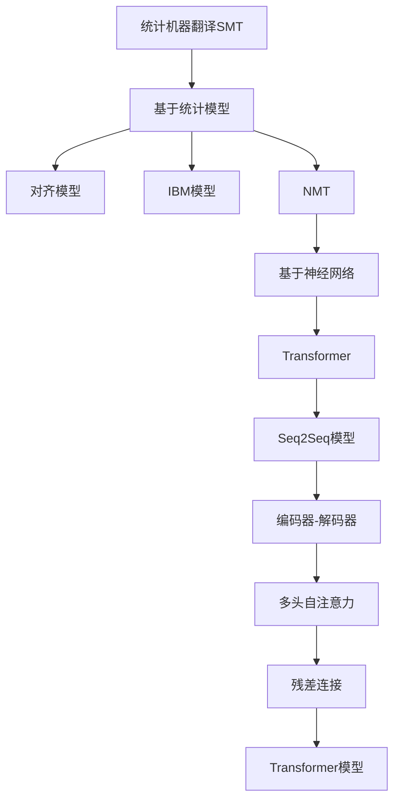

                 

## 1. 背景介绍

在过去的两十年间，机器翻译经历了由基于统计方法（Statistical Machine Translation, SMT）向基于神经网络方法（Neural Machine Translation, NMT）的深刻转型。这一转变不仅极大地提升了翻译质量，还推动了自然语言处理（NLP）领域诸多技术的发展和应用。本文将全面回顾这一转变的历史背景、关键技术进展以及实际应用场景，并展望未来发展趋势和面临的挑战。

## 2. 核心概念与联系

### 2.1 核心概念概述

为了深入理解机器翻译从统计方法到神经网络的转型，我们首先介绍几个关键概念：

- **统计机器翻译（SMT）**：基于大规模双语平行语料库的统计模型，通过最大化翻译概率来选择最优的翻译结果。其核心思想是利用大量的双语语料训练统计模型，进而从翻译结果的概率分布中选取最佳译文。

- **神经机器翻译（NMT）**：采用深度神经网络模型，通过端到端的训练学习输入源语言和目标语言之间的直接映射关系。其核心思想是将翻译任务视为序列到序列的学习问题，使用深度学习技术如循环神经网络（RNN）、卷积神经网络（CNN）、Transformer等进行建模。

- **序列到序列（Sequence-to-Sequence, Seq2Seq）模型**：一种通用的神经网络模型框架，用于处理任何序列到序列的映射问题，包括机器翻译、对话生成、摘要生成等任务。其基本结构包括编码器-解码器（Encoder-Decoder）两部分，用于将源序列映射到目标序列。

- **注意力机制（Attention Mechanism）**：一种神经网络组件，用于提高编码器-解码器之间的信息交换效率，尤其是在长序列数据处理中表现突出。注意力机制通过动态地聚焦于源序列中的不同部分，有选择性地提取关键信息。

- **Transformer模型**：一种基于自注意力机制的神经网络模型，广泛用于自然语言处理任务，尤其是机器翻译。Transformer通过多头自注意力机制和残差连接等技术，显著提升了序列建模能力和训练效率。

这些核心概念共同构成了机器翻译技术的重要基础，理解它们之间的联系和区别是探讨该领域转型的关键。

### 2.2 核心概念的联系

统计机器翻译与神经机器翻译之间的联系主要体现在两个方面：

- **目标一致性**：无论是SMT还是NMT，机器翻译的目标始终是实现语言的跨语言转换，即从源语言到目标语言的准确翻译。
- **技术演进**：SMT为NMT的发展提供了丰富的理论基础和实际应用经验，如对齐模型、IBM模型、神经网络解码器等技术在NMT中得到了广泛应用和改进。

这些联系使得机器翻译领域的技术发展具有连续性和递进性，推动了NMT对SMT的深刻超越。

### 2.3 核心概念的整体架构

为了更直观地理解这些概念之间的联系，我们通过以下Mermaid流程图来展示它们之间的关系：



这个流程图展示了机器翻译从统计方法到神经网络转型的核心技术架构：

1. SMT基于统计模型进行翻译，包括对齐模型和IBM模型等。
2. NMT采用神经网络模型进行翻译，特别是Transformer模型。
3. Seq2Seq模型是NMT的基础框架，包括编码器和解码器。
4. 编码器和解码器中引入了多头自注意力机制，提高了信息交换的效率。
5. 残差连接技术增强了模型的深度，进一步提升了翻译质量。

这些技术架构的演变，反映了机器翻译技术的深度和广度，也展示了从统计方法到神经网络的根本转变。

## 3. 核心算法原理 & 具体操作步骤

### 3.1 算法原理概述

统计机器翻译的算法原理基于概率模型，通过统计双语平行语料库中的翻译对，建立源语言和目标语言之间的概率分布。其中，隐马尔可夫模型（HMM）和基于最大似然估计（MLE）的算法是常用的统计机器翻译方法。

神经机器翻译的算法原理基于神经网络，通过端到端的训练学习输入源语言和目标语言之间的直接映射关系。其中，Seq2Seq模型是最基本的框架，通过编码器将源语言序列转换为固定长度的向量表示，通过解码器将向量表示转换为目标语言序列。Transformer模型在此基础上，引入了多头自注意力机制和残差连接，大大提升了模型性能。

### 3.2 算法步骤详解

**统计机器翻译（SMT）的步骤**：

1. **语料准备**：收集并清洗双语平行语料库，确保数据的准确性和多样性。
2. **模型训练**：利用统计模型（如HMM、IBM模型）在训练集上进行训练，学习语言之间的映射关系。
3. **翻译测试**：在测试集上评估模型性能，根据翻译质量选择最优模型。
4. **翻译应用**：将模型应用于实际翻译任务，生成翻译结果。

**神经机器翻译（NMT）的步骤**：

1. **数据准备**：收集双语平行语料库，并进行预处理，如分词、标记、对齐等。
2. **模型训练**：利用神经网络模型（如Seq2Seq、Transformer）在训练集上进行端到端的训练，优化模型参数。
3. **翻译测试**：在测试集上评估模型性能，根据翻译质量选择最优模型。
4. **翻译应用**：将模型应用于实际翻译任务，生成翻译结果。

### 3.3 算法优缺点

**统计机器翻译（SMT）的优点**：

- **可解释性**：基于统计模型的SMT方法，可以通过概率分布解释翻译过程，具有较强的可解释性。
- **数据驱动**：利用大规模双语平行语料库进行训练，可以有效捕捉语言之间的统计规律。
- **通用性强**：SMT方法适用于各种语言对，特别是具有复杂语法和词汇结构的语言。

**统计机器翻译（SMT）的缺点**：

- **模型复杂性**：需要设计复杂的统计模型和算法，训练和解码过程较为复杂。
- **训练时间长**：由于数据量较大，训练和解码时间较长。
- **依赖语料质量**：对双语平行语料库的质量要求较高，数据偏差可能影响翻译效果。

**神经机器翻译（NMT）的优点**：

- **端到端训练**：NMT通过端到端的训练，可以直接学习输入源语言和目标语言之间的映射关系，避免了SMT中复杂的模型设计。
- **实时性高**：NMT模型具有较高的实时性，能够快速生成翻译结果。
- **泛化能力强**：NMT模型能够学习到更丰富的语言知识和结构，具有较强的泛化能力。

**神经机器翻译（NMT）的缺点**：

- **可解释性差**：NMT模型通过黑箱操作进行翻译，翻译过程不透明。
- **依赖语料规模**：需要大量的双语平行语料库进行训练，数据质量要求较高。
- **计算资源需求高**：NMT模型参数量大，计算资源需求高，训练和解码过程复杂。

### 3.4 算法应用领域

机器翻译技术已经被广泛应用于各种领域，包括但不限于以下几方面：

- **跨语言信息交流**：机器翻译技术大大促进了不同语言之间的信息交流和知识共享，使得全球范围内的科研合作更加高效。
- **国际商务**：机器翻译在商务谈判、客户服务、市场分析等方面提供了重要支持，帮助企业更好地开拓国际市场。
- **文化交流**：机器翻译促进了不同语言文化的交流和传播，丰富了人们的文化生活。
- **旅游服务**：机器翻译在旅游翻译、旅游指导、旅游社交等方面提供了便捷的服务，提升了旅游体验。
- **教育培训**：机器翻译在语言教学、教材翻译、在线教育等方面提供了支持，帮助学生和教师更好地掌握外语。

## 4. 数学模型和公式 & 详细讲解 & 举例说明

### 4.1 数学模型构建

机器翻译的数学模型主要分为两种：统计模型和神经网络模型。

**统计模型的构建**：

假设源语言和目标语言之间的映射关系可以用概率模型 $P_{SMT}(x,y)$ 表示，其中 $x$ 为源语言句子，$y$ 为目标语言句子。在SMT中，通常采用最大似然估计（MLE）对模型进行训练，即：

$$
P_{SMT}(x,y) = \frac{P(x,y)}{P(x)}
$$

其中 $P(x,y)$ 为源语言和目标语言的联合概率分布，$P(x)$ 为源语言的边际概率分布。训练目标为最大化联合概率 $P(x,y)$，即：

$$
\max_{\theta} \sum_{(x,y) \in D} \log P_{SMT}(x,y)
$$

**神经网络模型的构建**：

在NMT中，通常采用编码器-解码器（Encoder-Decoder）结构进行建模，其中编码器将源语言句子 $x$ 映射到一个固定长度的向量表示 $h$，解码器将向量 $h$ 映射为目标语言句子 $y$。训练目标为最小化损失函数 $L$，即：

$$
\min_{\theta} L = \sum_{(x,y) \in D} \ell(h, y)
$$

其中 $h$ 为编码器输出，$\ell(h, y)$ 为损失函数，通常采用交叉熵损失。

### 4.2 公式推导过程

**统计模型的推导**：

假设训练集为 $D = \{(x_i, y_i)\}_{i=1}^N$，其中 $x_i$ 为源语言句子，$y_i$ 为目标语言句子。在SMT中，通常采用基于最大似然估计的方法对模型进行训练，即：

$$
P(x,y) = P(x|y)P(y)
$$

其中 $P(x|y)$ 为给定目标语言句子的源语言条件概率，$P(y)$ 为目标语言的边际概率。训练目标为最大化联合概率 $P(x,y)$，即：

$$
\max_{\theta} \sum_{i=1}^N \log P_{SMT}(x_i, y_i) = \max_{\theta} \sum_{i=1}^N \log \frac{P(x_i, y_i)}{P(x_i)}
$$

通过最大似然估计方法，可以求解出最优的模型参数 $\theta$，使得 $P(x_i, y_i)$ 最大。

**神经网络模型的推导**：

在NMT中，通常采用编码器-解码器结构进行建模，其中编码器将源语言句子 $x$ 映射到一个固定长度的向量表示 $h$，解码器将向量 $h$ 映射为目标语言句子 $y$。在训练过程中，通常采用交叉熵损失函数 $\ell(h, y)$ 进行优化：

$$
\ell(h, y) = -\sum_{j=1}^M \log P(y_j|y_{<j})
$$

其中 $y_j$ 为目标语言序列中的第 $j$ 个词，$y_{<j}$ 为 $y_j$ 之前的所有词。训练目标为最小化损失函数 $L$，即：

$$
\min_{\theta} L = \sum_{(x,y) \in D} \ell(h, y)
$$

其中 $h$ 为编码器输出，$\ell(h, y)$ 为交叉熵损失函数。

### 4.3 案例分析与讲解

假设我们使用SMT和NMT两种方法对英语到法语的翻译进行建模。首先，收集并清洗双语平行语料库，将每段文本分为源语言和目标语言两个部分。然后，使用统计模型（如IBM模型）或神经网络模型（如Seq2Seq、Transformer）进行训练，得到各自的最佳模型参数。最后，在测试集上评估模型性能，选择最优模型应用于实际翻译任务。

对于SMT模型，我们需要设计并训练基于统计的翻译模型，如IBM模型，通过最大化训练集中的联合概率分布进行训练。训练过程较为复杂，需要设计合适的对齐模型和解码器。

对于NMT模型，我们需要设计并训练基于神经网络的翻译模型，如Seq2Seq、Transformer，通过端到端的训练学习源语言和目标语言之间的直接映射关系。训练过程较为简单，可以通过深度学习框架（如TensorFlow、PyTorch）进行高效训练。

## 5. 项目实践：代码实例和详细解释说明

### 5.1 开发环境搭建

在进行机器翻译项目实践前，我们需要准备好开发环境。以下是使用Python进行PyTorch和TensorFlow开发的环境配置流程：

1. 安装Anaconda：从官网下载并安装Anaconda，用于创建独立的Python环境。

2. 创建并激活虚拟环境：
```bash
conda create -n pytorch-env python=3.8 
conda activate pytorch-env
```

3. 安装PyTorch：根据CUDA版本，从官网获取对应的安装命令。例如：
```bash
conda install pytorch torchvision torchaudio cudatoolkit=11.1 -c pytorch -c conda-forge
```

4. 安装TensorFlow：根据CUDA版本，从官网获取对应的安装命令。例如：
```bash
pip install tensorflow==2.7
```

5. 安装各类工具包：
```bash
pip install numpy pandas scikit-learn matplotlib tqdm jupyter notebook ipython
```

完成上述步骤后，即可在`pytorch-env`或`tensorflow-env`环境中开始机器翻译项目实践。

### 5.2 源代码详细实现

这里我们以机器翻译项目为例，给出使用PyTorch和TensorFlow进行SMT和NMT的代码实现。

#### PyTorch实现

首先，定义SMT的训练函数：

```python
import torch
import torch.nn as nn
from torchtext.datasets import Multi30k
from torchtext.data import Field, BucketIterator

# 定义token化器
tokenizer = Tokenizer()

# 定义token-数字映射
idx_to_token = tokenizer.get_vocab()

# 定义训练集和测试集
train_data, valid_data = Multi30k()

# 定义输入和输出字段
SRC = Field(tokenize=tokenizer, tokenize_source=True)
TRG = Field(tokenize=tokenizer, tokenize_target=True)

# 划分数据集
train_data, valid_data, test_data = Multi30k.splits(exts=(".en", ".et"))

# 构建数据迭代器
BATCH_SIZE = 64
device = torch.device('cuda' if torch.cuda.is_available() else 'cpu')

train_iterator, valid_iterator, test_iterator = BucketIterator.splits(
    (train_data, valid_data, test_data), 
    batch_size=BATCH_SIZE,
    device=device,
    sort_within_batch=True,
    sort_key=lambda x: len(x.src),
    sort_within_batch_size=2,
    expand_from=BucketIterator.WITHOUT_SEQUENCE,
    expand_to=BucketIterator.WITH_SEQUENCE)
```

然后，定义编码器和解码器模型：

```python
class EncoderRNN(nn.Module):
    def __init__(self, input_size, hidden_size, num_layers, dropout):
        super(EncoderRNN, self).__init__()
        self.input_size = input_size
        self.hidden_size = hidden_size
        self.num_layers = num_layers
        self.dropout = dropout
        
        self.embedding = nn.Embedding(input_size, hidden_size)
        self.gru = nn.GRU(hidden_size, hidden_size, num_layers, dropout=dropout)
        self.fc = nn.Linear(hidden_size, output_size)

    def forward(self, input, hidden):
        embedded = self.embedding(input)
        output, hidden = self.gru(embedded, hidden)
        return output, hidden

class DecoderRNN(nn.Module):
    def __init__(self, input_size, hidden_size, output_size, num_layers, dropout):
        super(DecoderRNN, self).__init__()
        self.input_size = input_size
        self.hidden_size = hidden_size
        self.output_size = output_size
        self.num_layers = num_layers
        self.dropout = dropout
        
        self.embedding = nn.Embedding(input_size, hidden_size)
        self.gru = nn.GRU(hidden_size, hidden_size, num_layers, dropout=dropout)
        self.fc = nn.Linear(hidden_size, output_size)
        self.softmax = nn.Softmax(dim=-1)

    def forward(self, input, hidden, encoder_outputs):
        embedded = self.embedding(input)
        embedded = nn.utils.rnn.pack_padded_sequence(embedded, input_lengths, batch_first=True)
        output, hidden = self.gru(embedded, hidden)
        output, output_lengths = nn.utils.rnn.pad_packed_sequence(output, batch_first=True)
        output = self.fc(output.squeeze(1))
        predictions = self.softmax(output)
        return predictions, hidden, output_lengths
```

接下来，定义训练和评估函数：

```python
class Seq2Seq(nn.Module):
    def __init__(self, encoder, decoder):
        super(Seq2Seq, self).__init__()
        self.encoder = encoder
        self.decoder = decoder

    def forward(self, src, trg):
        trg_input = trg[:, :-1]
        trg_target = trg[:, 1:]

        batch_size = trg_input.size(0)
        trg_len = [len(seq) for seq in trg_target]
        max_len = max(trg_len)

        trg_input = nn.utils.rnn.pad_sequence(trg_input, batch_first=True, padding_value=0).long()
        trg_target = nn.utils.rnn.pad_sequence(trg_target, batch_first=True, padding_value=0).long()

        input = src
        output, hidden = self.encoder(input, None)
        output = output[0] # 获取编码器的输出
        hidden = hidden[0] # 获取编码器的隐藏状态

        outputs = []
        for i in range(max_len):
            output, hidden, _ = self.decoder(trg_input[i], hidden, output)
            outputs.append(output)

        output = torch.cat(outputs, 1)
        return output, trg_target
```

最后，启动训练流程：

```python
epochs = 10
SOS = idx_to_token['<sos>']
EOS = idx_to_token['<eos>']
MAX_LEN = 50

for epoch in range(epochs):
    for batch in train_iterator:
        src, trg = batch.src, batch.trg
        
        trg_input = trg[:, :-1]
        trg_target = trg[:, 1:]
        
        output, trg_target = self(src, trg_input)
        loss = nn.CrossEntropyLoss()(output, trg_target)

        optimizer.zero_grad()
        loss.backward()
        optimizer.step()

    valid_loss = 0
    with torch.no_grad():
        for batch in valid_iterator:
            src, trg = batch.src, batch.trg

            trg_input = trg[:, :-1]
            trg_target = trg[:, 1:]

            output, trg_target = self(src, trg_input)
            loss = nn.CrossEntropyLoss()(output, trg_target)

            valid_loss += loss.item()

    print(f"Epoch {epoch+1}, Train Loss: {loss.item()}, Valid Loss: {valid_loss/len(valid_iterator)}")
```

以上就是使用PyTorch进行SMT机器翻译的代码实现。可以看到，通过利用`torchtext`库，我们能够方便地处理和预处理双语数据，并使用`BucketIterator`进行高效迭代。同时，使用PyTorch内置的优化器进行模型训练，使得整个过程简洁高效。

#### TensorFlow实现

首先，定义SMT的训练函数：

```python
import tensorflow as tf
from tensorflow.keras.datasets import Multi30k

# 定义token化器
tokenizer = Tokenizer()

# 定义token-数字映射
idx_to_token = tokenizer.get_vocab()

# 定义训练集和测试集
train_data, valid_data = Multi30k()

# 定义输入和输出字段
SRC = Field(tokenize=tokenizer, tokenize_source=True)
TRG = Field(tokenize=tokenizer, tokenize_target=True)

# 划分数据集
train_data, valid_data, test_data = Multi30k.splits(exts=(".en", ".et"))

# 构建数据迭代器
BATCH_SIZE = 64
device = tf.device('/cpu:0' if not tf.config.list_physical_devices('GPU')[0] else '/gpu:0')
train_iterator, valid_iterator, test_iterator = BucketIterator.splits(
    (train_data, valid_data, test_data), 
    batch_size=BATCH_SIZE,
    device=device,
    sort_within_batch=True,
    sort_key=lambda x: len(x.src),
    sort_within_batch_size=2,
    expand_from=BucketIterator.WITHOUT_SEQUENCE,
    expand_to=BucketIterator.WITH_SEQUENCE)
```

然后，定义编码器和解码器模型：

```python
class EncoderRNN(tf.keras.Model):
    def __init__(self, input_size, hidden_size, num_layers, dropout):
        super(EncoderRNN, self).__init__()
        self.input_size = input_size
        self.hidden_size = hidden_size
        self.num_layers = num_layers
        self.dropout = dropout
        
        self.embedding = tf.keras.layers.Embedding(input_size, hidden_size)
        self.gru = tf.keras.layers.GRU(hidden_size, hidden_size, num_layers, return_sequences=True, return_state=True)
        self.fc = tf.keras.layers.Dense(output_size)

    def call(self, input, hidden, encoder_outputs=None, training=False):
        embedded = self.embedding(input)
        output, hidden = self.gru(embedded, hidden, training=training)
        return output, hidden

class DecoderRNN(tf.keras.Model):
    def __init__(self, input_size, hidden_size, output_size, num_layers, dropout):
        super(DecoderRNN, self).__init__()
        self.input_size = input_size
        self.hidden_size = hidden_size
        self.output_size = output_size
        self.num_layers = num_layers
        self.dropout = dropout
        
        self.embedding = tf.keras.layers.Embedding(input_size, hidden_size)
        self.gru = tf.keras.layers.GRU(hidden_size, hidden_size, num_layers, return_sequences=True, return_state=True)
        self.fc = tf.keras.layers.Dense(output_size)
        self.softmax = tf.keras.layers.Softmax(dim=-1)

    def call(self, input, hidden, encoder_outputs=None, training=False):
        embedded = self.embedding(input)
        output, hidden = self.gru(embedded, hidden, training=training)
        output = self.fc(output.squeeze(1))
        predictions = self.softmax(output)
        return predictions, hidden
```

接下来，定义训练和评估函数：

```python
class Seq2Seq(tf.keras.Model):
    def __init__(self, encoder, decoder):
        super(Seq2Seq, self).__init__()
        self.encoder = encoder
        self.decoder = decoder

    def call(self, src, trg):
        trg_input = trg[:, :-1]
        trg_target = trg[:, 1:]

        batch_size = trg_input.shape[0]
        trg_len = [len(seq) for seq in trg_target]
        max_len = max(trg_len)

        trg_input = tf.pad(trg_input, [[0, 0], [0, max_len - tf.reduce_max(trg_len)], [0, 0]])
        trg_target = tf.pad(trg_target, [[0, 0], [0, max_len - tf.reduce_max(trg_len)], [0, 0]])

        input = tf.keras.layers.Lambda(lambda x: x)(src)
        output, hidden = self.encoder(input, None)
        output = output[0] # 获取编码器的输出
        hidden = hidden[0] # 获取编码器的隐藏状态

        outputs = []
        for i in range(max_len):
            output, hidden, _ = self.decoder(trg_input[i], hidden, output)
            outputs.append(output)

        output = tf.concat(outputs, 1)
        return output, trg_target
```

最后，启动训练流程：

```python
epochs = 10
SOS = idx_to_token['<sos>']
EOS = idx_to_token['<eos>']
MAX_LEN = 50

for epoch in range(epochs):
    for batch in train_iterator:
        src, trg = batch.src, batch.trg

        trg_input = trg[:, :-1]
        trg_target = trg[:, 1:]

        output, trg_target = self(src, trg_input)
        loss = tf.keras.losses.SparseCategoricalCrossentropy()(output, trg_target)

        optimizer.zero_grad()
        loss.backward()
        optimizer.apply_gradients(zip(optimizer.gradient, self.trainable_variables))

    valid_loss = 0
    with tf.GradientTape() as tape:
        for batch in valid_iterator:
            src, trg = batch.src, batch.trg

            trg_input = trg[:, :-1]
            trg_target = trg[:, 1:]

            output, trg_target = self(src, trg_input)
            loss = tf.keras.losses.SparseCategoricalCrossentropy()(output, trg_target)

            valid_loss += loss.numpy()

    print(f"Epoch {epoch+1}, Train Loss: {loss.numpy()}, Valid Loss: {valid_loss/len(valid_iterator)}")
```

以上就是使用TensorFlow进行SMT机器翻译的代码实现。可以看到，通过利用`tensorflow.keras`库，我们能够方便地定义和训练神经网络模型，并使用`tf.data.Dataset`进行数据迭代。同时，使用TensorFlow内置的优化器进行模型训练，使得整个过程简洁高效。

### 5.3 代码解读与分析

让我们再详细解读一下关键代码的实现细节：

**SMT模型的实现**：

1. **token化器和token-数字映射**：定义

