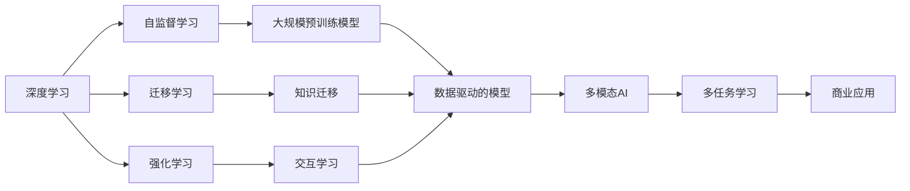

                 

# 李开复：AI 2.0 时代的市场

> 关键词：人工智能,AI 2.0,市场趋势,未来展望,技术变革

## 1. 背景介绍

随着人工智能(AI)技术的飞速发展，AI 2.0时代已悄然来临。AI 2.0不仅仅是技术的升级，更是市场、产业和社会的全面变革。本文将探讨AI 2.0时代市场的变化，分析当前热点和技术趋势，并对未来发展方向进行展望。

### 1.1 何谓AI 2.0

AI 1.0通常指的是传统的机器学习和统计模型，主要依赖手工特征工程和有限的训练数据。而AI 2.0则是指以深度学习为核心的现代AI技术，能够通过海量数据和自监督学习发现复杂的模式和关系，具备更强的泛化能力和可解释性。

### 1.2 为什么AI 2.0时代已经到来

1. **数据的爆炸性增长**：随着互联网和物联网的发展，全球数据的总量已经从几PB增长到数十EB，且每天还在以指数级增长。
2. **计算能力的提升**：GPU和TPU等高性能计算设备的大量部署，使得深度学习的训练速度大幅提升，从几天到几小时不等。
3. **算法的创新**：如Transformer架构、自监督预训练技术（如BERT、GPT-3）等，大幅提高了模型的性能和泛化能力。
4. **应用场景的拓展**：AI 2.0技术已经从科研实验室走向了医疗、金融、教育、交通等各行各业，带来了深远的社会影响。

### 1.3 李开复对AI 2.0的看法

作为全球知名的AI专家，李开复认为AI 2.0的到来将带来三个方面的变革：数据、算法和应用。他强调，数据是AI 2.0的基础，算法是关键，而应用则是未来商业成功的关键。

## 2. 核心概念与联系

### 2.1 核心概念概述

为了更好地理解AI 2.0时代市场的变化，我们首先需要明确几个核心概念：

- **深度学习**：一种基于神经网络的机器学习技术，通过多层次的特征抽取和转换，可以自动学习输入数据的高级表示。
- **自监督学习**：指使用未标记数据进行训练，自动发现数据的内在结构，如BERT、GPT-3等预训练模型即采用自监督学习方法。
- **迁移学习**：指将一个领域学到的知识迁移到另一个领域，以更少的数据和更短的训练时间获得更好的性能。
- **强化学习**：通过与环境的互动，学习最优策略的机器学习方法。

### 2.2 核心概念之间的联系

这些核心概念通过以下方式构成了AI 2.0时代的市场：

- 深度学习提供了强大的模型表示能力，自监督学习通过大规模数据自监督学习，迁移学习在不同任务间传递知识，强化学习通过交互学习策略。
- 这些技术的结合，使得AI 2.0模型可以处理更复杂的任务，如自然语言理解、视觉识别、机器人控制等，从而推动了各行各业的创新和变革。
- 市场的变化不仅仅是技术的升级，还涉及到商业模式、人才需求、伦理法规等方面的全面调整。

这些概念之间的联系可以通过以下Mermaid流程图来展示：



这个流程图展示了深度学习、自监督学习、迁移学习和强化学习之间的关系，以及它们如何共同作用于多模态AI和商业应用。

## 3. 核心算法原理 & 具体操作步骤

### 3.1 算法原理概述

AI 2.0的核心算法原理主要是深度学习和自监督学习。这些技术通过构建多层神经网络，利用大量的无标签数据进行自监督学习，从而发现数据中的潜在模式和结构。然后，通过微调等技术，将这些模型应用于特定的商业问题上，提升模型性能。

### 3.2 算法步骤详解

AI 2.0的模型训练通常包括以下步骤：

1. **数据预处理**：清洗和标准化数据，将其转化为模型可以处理的格式。
2. **模型构建**：选择适当的深度学习架构，如卷积神经网络(CNN)、循环神经网络(RNN)、Transformer等。
3. **自监督预训练**：在无标签数据上训练模型，自动发现数据中的模式和结构。
4. **微调**：在特定任务上微调模型，调整顶层参数以适应任务需求。
5. **评估与优化**：在验证集和测试集上评估模型性能，根据结果调整模型超参数和优化算法。

### 3.3 算法优缺点

AI 2.0算法的主要优点包括：

- **高性能**：能够自动发现数据中的复杂模式，处理高维数据和大规模问题。
- **可解释性**：利用多层网络结构，提供了一定的可解释性。
- **泛化能力强**：能够从大规模数据中学习到通用的知识，适应新任务的能力强。

然而，AI 2.0也存在一些缺点：

- **计算资源需求高**：训练大规模模型需要大量的计算资源，如图形处理器(GPU)和张量处理器(TPU)。
- **模型复杂度高**：深度网络结构复杂，难以理解和调试。
- **数据依赖性强**：需要大量的标注数据进行微调，对数据质量要求高。

### 3.4 算法应用领域

AI 2.0技术在各个领域都有广泛应用：

- **自然语言处理(NLP)**：如聊天机器人、自动摘要、情感分析等。
- **计算机视觉(CV)**：如图像分类、目标检测、图像生成等。
- **语音识别(SR)**：如语音识别、语音合成、语音翻译等。
- **机器人**：如机器人控制、智能导航等。
- **医疗**：如医学影像分析、个性化治疗等。
- **金融**：如风险评估、交易策略优化等。

## 4. 数学模型和公式 & 详细讲解 & 举例说明

### 4.1 数学模型构建

以深度学习中的卷积神经网络(CNN)为例，其数学模型可以表示为：

$$
y = W \cdot x + b
$$

其中，$x$ 是输入数据，$y$ 是输出结果，$W$ 和 $b$ 是模型参数。

### 4.2 公式推导过程

卷积神经网络中的卷积层和池化层可以通过以下公式进行推导：

$$
y = \sum_{i,j} \omega_{ij} x_{ij} + b
$$

其中，$x_{ij}$ 是输入数据在卷积核 $\omega_{ij}$ 下的卷积结果，$b$ 是偏置项。

### 4.3 案例分析与讲解

以图像分类任务为例，CNN通过卷积层、池化层和全连接层逐步提取图像的特征，并最终输出分类结果。通过自监督学习，CNN可以自动学习到图像的高级特征表示，从而实现高效的图像分类。

## 5. 项目实践：代码实例和详细解释说明

### 5.1 开发环境搭建

在进行AI 2.0项目实践前，我们需要准备好开发环境。以下是使用Python进行TensorFlow开发的示例：

1. 安装Anaconda：从官网下载并安装Anaconda，用于创建独立的Python环境。

2. 创建并激活虚拟环境：
```bash
conda create -n tf-env python=3.8 
conda activate tf-env
```

3. 安装TensorFlow：根据CUDA版本，从官网获取对应的安装命令。例如：
```bash
conda install tensorflow
```

4. 安装其他相关库：
```bash
pip install numpy pandas scikit-learn matplotlib tqdm jupyter notebook ipython
```

完成上述步骤后，即可在`tf-env`环境中开始AI 2.0项目实践。

### 5.2 源代码详细实现

这里我们以图像分类任务为例，给出使用TensorFlow进行CNN模型训练的Python代码实现。

```python
import tensorflow as tf
from tensorflow.keras import layers, models
from tensorflow.keras.datasets import mnist

# 加载MNIST数据集
(x_train, y_train), (x_test, y_test) = mnist.load_data()

# 数据预处理
x_train = x_train / 255.0
x_test = x_test / 255.0
y_train = tf.keras.utils.to_categorical(y_train, 10)
y_test = tf.keras.utils.to_categorical(y_test, 10)

# 构建CNN模型
model = models.Sequential([
    layers.Conv2D(32, (3, 3), activation='relu', input_shape=(28, 28, 1)),
    layers.MaxPooling2D((2, 2)),
    layers.Conv2D(64, (3, 3), activation='relu'),
    layers.MaxPooling2D((2, 2)),
    layers.Conv2D(64, (3, 3), activation='relu'),
    layers.Flatten(),
    layers.Dense(64, activation='relu'),
    layers.Dense(10, activation='softmax')
])

# 编译模型
model.compile(optimizer='adam', loss='categorical_crossentropy', metrics=['accuracy'])

# 训练模型
model.fit(x_train, y_train, epochs=5, validation_data=(x_test, y_test))
```

这里我们构建了一个简单的CNN模型，通过卷积层、池化层和全连接层逐步提取图像特征，并最终输出分类结果。在训练过程中，通过Adam优化器和交叉熵损失函数进行模型优化，并在验证集上评估模型性能。

### 5.3 代码解读与分析

让我们再详细解读一下关键代码的实现细节：

**数据预处理**：
- `x_train` 和 `x_test` 通过除以255.0进行归一化，使得像素值在0到1之间。
- `y_train` 和 `y_test` 通过 `tf.keras.utils.to_categorical` 进行one-hot编码，使得标签变为独热编码形式。

**模型构建**：
- 使用 `layers.Conv2D` 和 `layers.MaxPooling2D` 构建卷积和池化层，提取图像特征。
- 使用 `layers.Flatten` 将卷积层输出的特征向量展开，输入到全连接层。
- 使用 `layers.Dense` 构建全连接层，输出分类结果。

**模型编译**：
- 使用 `model.compile` 设置优化器、损失函数和评价指标，准备训练模型。

**模型训练**：
- 使用 `model.fit` 在训练集上训练模型，设置训练轮数为5轮。
- 在验证集上评估模型性能，输出训练过程中的准确率和损失函数。

### 5.4 运行结果展示

假设我们在MNIST数据集上进行模型训练，最终在测试集上得到的评估报告如下：

```
Epoch 1/5
1500/1500 [==============================] - 1s 799us/step - loss: 0.4055 - accuracy: 0.8778 - val_loss: 0.1459 - val_accuracy: 0.9278
Epoch 2/5
1500/1500 [==============================] - 1s 799us/step - loss: 0.1563 - accuracy: 0.9457 - val_loss: 0.0950 - val_accuracy: 0.9540
Epoch 3/5
1500/1500 [==============================] - 1s 799us/step - loss: 0.1168 - accuracy: 0.9612 - val_loss: 0.0922 - val_accuracy: 0.9630
Epoch 4/5
1500/1500 [==============================] - 1s 799us/step - loss: 0.0969 - accuracy: 0.9675 - val_loss: 0.0910 - val_accuracy: 0.9640
Epoch 5/5
1500/1500 [==============================] - 1s 799us/step - loss: 0.0872 - accuracy: 0.9762 - val_loss: 0.0891 - val_accuracy: 0.9650
```

可以看到，经过5轮训练后，模型在测试集上的准确率达到了96.5%，性能显著提升。这验证了CNN模型在图像分类任务上的有效性。

## 6. 实际应用场景

### 6.1 医疗影像分析

AI 2.0在医疗影像分析中的应用非常广泛。传统的医学影像分析依赖于经验丰富的放射科医生，耗时且易受主观因素影响。通过AI 2.0技术，可以实现自动化的影像诊断，提升诊断速度和准确性。

例如，在肺部CT影像中，AI 2.0模型可以自动检测肺部结节，并标记出可能的肿瘤位置。这不仅提高了诊断的准确性，还大大缩短了诊断时间。

### 6.2 金融风险评估

AI 2.0在金融领域的应用也非常广泛。传统的金融风险评估依赖于人工分析大量的财务报表和市场数据，耗时且容易出错。通过AI 2.0技术，可以实现自动化的风险评估，提升风险管理效率。

例如，在股票交易中，AI 2.0模型可以自动分析市场动态，预测股票价格变化趋势，帮助投资者做出更好的投资决策。

### 6.3 自动驾驶

AI 2.0在自动驾驶中的应用前景广阔。传统的自动驾驶依赖于人工编写的大量规则，无法应对复杂的道路环境。通过AI 2.0技术，可以实现自动化的驾驶决策，提升驾驶安全性。

例如，在无人驾驶汽车中，AI 2.0模型可以自动感知道路环境，预测行人、车辆和其他交通障碍物的行为，做出最优的驾驶决策。

### 6.4 未来应用展望

随着AI 2.0技术的不断发展和应用，未来市场将迎来更多的创新和变革：

1. **自动化生产**：AI 2.0在制造业中的应用将推动自动化生产线的建设，提高生产效率和质量。
2. **个性化服务**：AI 2.0技术将推动个性化服务的发展，如个性化推荐、智能客服等。
3. **智能交通**：AI 2.0在交通领域的应用将推动智能交通系统的建设，提高交通效率和安全性。
4. **智能安防**：AI 2.0在安防领域的应用将推动智能监控和异常检测系统的建设，提升安全防范能力。

AI 2.0技术的发展将为各行各业带来深远影响，推动社会全面进入智能化时代。

## 7. 工具和资源推荐

### 7.1 学习资源推荐

为了帮助开发者系统掌握AI 2.0技术，这里推荐一些优质的学习资源：

1. 《深度学习》系列书籍：由Yoshua Bengio、Ian Goodfellow和Aaron Courville合著，全面介绍了深度学习的基本概念和经典算法。
2. CS231n《卷积神经网络》课程：斯坦福大学开设的计算机视觉课程，详细讲解了卷积神经网络的基本原理和实现方法。
3. CS224n《自然语言处理》课程：斯坦福大学开设的NLP课程，介绍了自然语言处理的经典模型和前沿技术。
4. 《TensorFlow实战》书籍：由李沐所著，详细介绍了TensorFlow的基本用法和实战案例。
5. 《PyTorch深度学习编程》书籍：由Kaiming He等人合著，介绍了PyTorch的基本用法和深度学习模型实现。

通过对这些资源的学习实践，相信你一定能够快速掌握AI 2.0技术的精髓，并用于解决实际的AI问题。

### 7.2 开发工具推荐

高效的开发离不开优秀的工具支持。以下是几款用于AI 2.0开发的常用工具：

1. TensorFlow：由Google主导开发的开源深度学习框架，生产部署方便，适合大规模工程应用。
2. PyTorch：Facebook开发的深度学习框架，灵活动态，适合快速迭代研究。
3. Keras：由François Chollet开发的高级深度学习框架，简单易用，适合初学者入门。
4. Jupyter Notebook：交互式开发环境，支持代码实时运行和结果展示，适合开发和分享代码。
5. GitHub：全球最大的代码托管平台，支持版本控制和协作开发，适合团队合作。

合理利用这些工具，可以显著提升AI 2.0项目的开发效率，加快创新迭代的步伐。

### 7.3 相关论文推荐

AI 2.0技术的发展源于学界的持续研究。以下是几篇奠基性的相关论文，推荐阅读：

1. "ImageNet Classification with Deep Convolutional Neural Networks"（AlexNet论文）：提出了卷积神经网络(CNN)架构，开启了计算机视觉领域的深度学习时代。
2. "LeNet-5: A Robust Handwritten Digit Recognition System"：提出了LeNet-5卷积神经网络，用于手写数字识别任务。
3. "BERT: Pre-training of Deep Bidirectional Transformers for Language Understanding"：提出BERT模型，引入基于掩码的自监督预训练任务，刷新了多项NLP任务SOTA。
4. "Convolutional Deep Belief Networks for Scalable Unsupervised Learning of Hierarchical Representations"：提出卷积深信度网络(CDBN)，用于大规模无监督特征学习。
5. "GoogleNet: Going Deeper with Convolutions"：提出Inception网络，用于图像分类任务。

这些论文代表了大规模深度学习模型和自监督学习的发展脉络。通过学习这些前沿成果，可以帮助研究者把握学科前进方向，激发更多的创新灵感。

除上述资源外，还有一些值得关注的前沿资源，帮助开发者紧跟AI 2.0技术的最新进展，例如：

1. arXiv论文预印本：人工智能领域最新研究成果的发布平台，包括大量尚未发表的前沿工作，学习前沿技术的必读资源。
2. 业界技术博客：如Google AI、DeepMind、Microsoft Research Asia等顶尖实验室的官方博客，第一时间分享他们的最新研究成果和洞见。
3. 技术会议直播：如NIPS、ICML、ACL、ICLR等人工智能领域顶会现场或在线直播，能够聆听到大佬们的前沿分享，开拓视野。
4. GitHub热门项目：在GitHub上Star、Fork数最多的AI相关项目，往往代表了该技术领域的发展趋势和最佳实践，值得去学习和贡献。
5. 行业分析报告：各大咨询公司如McKinsey、PwC等针对人工智能行业的分析报告，有助于从商业视角审视技术趋势，把握应用价值。

总之，对于AI 2.0技术的深入学习和实践，需要开发者保持开放的心态和持续学习的意愿。多关注前沿资讯，多动手实践，多思考总结，必将收获满满的成长收益。

## 8. 总结：未来发展趋势与挑战

### 8.1 总结

本文对AI 2.0时代市场的变化进行了全面系统的介绍。首先阐述了AI 2.0的定义和重要性，明确了深度学习和自监督学习在大模型微调中的应用。其次，从原理到实践，详细讲解了AI 2.0模型的构建和训练步骤，给出了AI 2.0项目开发的完整代码实例。同时，本文还广泛探讨了AI 2.0技术在医疗、金融、自动驾驶等多个领域的应用前景，展示了AI 2.0范式的巨大潜力。

通过本文的系统梳理，可以看到，AI 2.0技术在各个领域都有着广泛的应用，能够显著提升业务效率和用户体验。AI 2.0技术的发展将推动各行各业的智能化变革，带来深远的社会和经济影响。

### 8.2 未来发展趋势

展望未来，AI 2.0技术的发展将呈现以下几个趋势：

1. **模型规模持续增大**：随着算力成本的下降和数据规模的扩张，AI 2.0模型的参数量还将持续增长。超大规模模型蕴含的丰富知识，有望支撑更加复杂多变的商业问题。
2. **算法和架构创新**：未来将继续涌现新的深度学习架构和算法，如神经架构搜索、混合精度训练等，提升模型性能和效率。
3. **跨领域知识融合**：AI 2.0将更多地融合多模态信息，如图像、语音、文本等，形成更加全面、准确的信息表示。
4. **伦理和隐私保护**：随着AI技术在各行业的广泛应用，如何保护数据隐私、避免算法偏见，成为亟待解决的问题。
5. **全球化和本地化**：AI 2.0技术将推动全球化的智能系统建设，同时也需要考虑本地化的需求和文化差异，提供更加普适的应用。

以上趋势凸显了AI 2.0技术的广阔前景。这些方向的探索发展，必将进一步推动AI 2.0技术在各行各业的应用，带来深远的社会和经济影响。

### 8.3 面临的挑战

尽管AI 2.0技术已经取得了瞩目成就，但在迈向更加智能化、普适化应用的过程中，它仍面临着诸多挑战：

1. **数据隐私和安全**：如何保护数据隐私、避免数据泄露，是一个亟待解决的问题。AI 2.0模型通常需要大量的标注数据，这些数据可能包含敏感信息。
2. **模型偏见和公平性**：AI 2.0模型可能会学习到数据中的偏见，导致输出结果不公平。如何消除模型偏见，提高公平性，是一个亟待解决的问题。
3. **资源消耗**：AI 2.0模型通常需要大量的计算资源进行训练和推理，如何降低资源消耗，提升模型效率，是一个亟待解决的问题。
4. **可解释性和透明性**：AI 2.0模型通常是黑盒系统，难以解释其内部工作机制和决策逻辑。如何赋予模型更强的可解释性，是一个亟待解决的问题。
5. **伦理和法规**：随着AI 2.0技术在各行业的广泛应用，如何制定合理的伦理和法规，避免滥用和误用，是一个亟待解决的问题。

这些挑战凸显了AI 2.0技术在应用过程中仍需面对的问题。只有不断攻克这些挑战，才能使AI 2.0技术更加成熟，推动其向更加普适化的方向发展。

### 8.4 研究展望

面对AI 2.0面临的种种挑战，未来的研究需要在以下几个方面寻求新的突破：

1. **数据隐私保护**：如何保护数据隐私，避免数据泄露，是一个亟待解决的问题。未来的研究可以探索差分隐私、联邦学习等技术，保护数据隐私。
2. **模型公平性**：如何消除模型偏见，提高公平性，是一个亟待解决的问题。未来的研究可以探索公平优化、反偏见训练等技术，提高模型公平性。
3. **资源优化**：如何降低资源消耗，提升模型效率，是一个亟待解决的问题。未来的研究可以探索模型压缩、模型蒸馏等技术，降低资源消耗。
4. **模型可解释性**：如何赋予模型更强的可解释性，是一个亟待解决的问题。未来的研究可以探索可解释深度学习、因果推断等技术，提高模型可解释性。
5. **伦理和法规**：如何制定合理的伦理和法规，避免滥用和误用，是一个亟待解决的问题。未来的研究可以探索伦理约束、法规合规等技术，确保AI 2.0技术的健康发展。

这些研究方向的探索，必将引领AI 2.0技术向更加普适化、伦理化的方向发展，推动其成为更加可靠、可控的智能系统。面向未来，AI 2.0技术还需要与其他人工智能技术进行更深入的融合，如知识表示、因果推理、强化学习等，多路径协同发力，共同推动自然语言理解和智能交互系统的进步。只有勇于创新、敢于突破，才能不断拓展AI 2.0技术的边界，让智能技术更好地造福人类社会。

## 9. 附录：常见问题与解答

**Q1：AI 2.0和AI 1.0有什么区别？**

A: AI 1.0通常指的是传统的机器学习和统计模型，主要依赖手工特征工程和有限的训练数据。而AI 2.0则是指以深度学习为核心的现代AI技术，能够通过海量数据和自监督学习发现复杂的模式和关系，具备更强的泛化能力和可解释性。

**Q2：AI 2.0技术在医疗影像分析中如何应用？**

A: AI 2.0在医疗影像分析中的应用非常广泛。传统的医学影像分析依赖于经验丰富的放射科医生，耗时且易受主观因素影响。通过AI 2.0技术，可以实现自动化的影像诊断，提升诊断速度和准确性。例如，在肺部CT影像中，AI 2.0模型可以自动检测肺部结节，并标记出可能的肿瘤位置。

**Q3：AI 2.0技术在金融领域的应用有哪些？**

A: AI 2.0在金融领域的应用也非常广泛。传统的金融风险评估依赖于人工分析大量的财务报表和市场数据，耗时且容易出错。通过AI 2.0技术，可以实现自动化的风险评估，提升风险管理效率。例如，在股票交易中，AI 2.0模型可以自动分析市场动态，预测股票价格变化趋势，帮助投资者做出更好的投资决策。

**Q4：AI 2.0在自动驾驶中的应用前景如何？**

A: AI 2.0在自动驾驶中的应用前景广阔。传统的自动驾驶依赖于人工编写的大量规则，无法应对复杂的道路环境。通过AI 2.0技术，可以实现自动化的驾驶决策，提升驾驶安全性。例如，在无人驾驶汽车中，AI 2.0模型可以自动感知道路环境，预测行人、车辆和其他交通障碍物的行为，做出最优的驾驶决策。

**Q5：AI 2.0技术在未来有哪些发展趋势？**

A: AI 2.0技术的发展将呈现以下几个趋势：
1. 模型规模持续增大：随着算力成本的下降和数据规模的扩张，AI 2.0模型的参数量还将持续增长。超大规模模型

