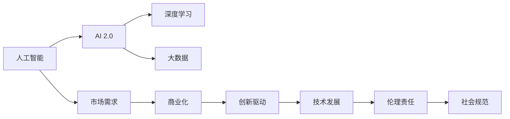
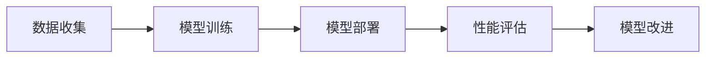

                 

# 李开复：AI 2.0 时代的市场前景

> 关键词：人工智能, AI 2.0, 市场需求, 商业化, 创新驱动, 伦理责任

## 1. 背景介绍

在过去的几年里，人工智能（AI）技术迅速发展，已经渗透到各个行业，从医疗、金融、制造业到零售和农业，都在积极探索AI的应用潜力。特别是AI 2.0时代的到来，预示着人工智能技术的进一步突破和应用范围的扩大。AI 2.0强调的是人工智能的自主学习和自我进化能力，以及与人类世界的深度融合。在AI 2.0时代，人工智能不仅仅是工具，而是成为了一种能力，一种推动整个社会向前发展的力量。

### 1.1 人工智能的发展历史

人工智能的发展可以追溯到上世纪50年代，当时科学家们开始尝试用计算机模拟人类的智能行为。早期的人工智能主要集中在专家系统、逻辑推理和符号处理等方面，但这些方法在处理复杂问题时表现有限。

1990年代，随着神经网络和深度学习技术的兴起，人工智能进入了一个新的发展阶段。这一阶段的人工智能主要通过大量数据训练神经网络，实现了在图像识别、语音识别、自然语言处理等方面的突破。

进入21世纪，特别是随着大数据、云计算和硬件技术的进步，人工智能进入了快速发展的黄金时期。AI 2.0时代的到来，标志着人工智能技术的成熟和广泛应用，进一步推动了技术的创新和产业的繁荣。

### 1.2 人工智能的现状

当前，人工智能技术已经在各个领域得到了广泛应用。例如，在医疗领域，人工智能可以辅助医生进行疾病诊断、治疗方案制定和药物研发；在金融领域，人工智能可以用于风险控制、投资分析和客户服务；在制造业中，人工智能可以提高生产效率和产品质量；在零售业中，人工智能可以实现智能推荐和库存管理。

人工智能技术的广泛应用，不仅提高了各行业的效率和效益，也促进了经济的增长和社会的进步。根据麦肯锡全球研究所的数据，全球经济已经进入“智能自动化”时代，人工智能将带来高达15.7万亿美元的经济价值。

## 2. 核心概念与联系

### 2.1 核心概念概述

为了深入理解AI 2.0时代的市场前景，我们首先需要明确几个核心概念及其之间的关系。

- **人工智能（AI）**：是一种使计算机能够执行人类智能任务的广泛技术。AI 2.0强调自主学习和自我进化能力。
- **AI 2.0**：是AI发展的高级阶段，通过深度学习和大数据技术的结合，使AI具备了自我学习和自主决策的能力。
- **市场需求**：AI技术的应用需要市场需求的推动，包括企业、政府和消费者对AI解决方案的需求。
- **商业化**：将AI技术转化为市场产品和服务的过程。
- **创新驱动**：AI技术的不断创新和进步，是推动市场需求和商业化的关键因素。
- **伦理责任**：AI技术的广泛应用，也带来了伦理和社会责任问题，需要妥善处理。

这些概念之间的关系可以通过以下Mermaid流程图来展示：



这个流程图展示了人工智能、AI 2.0以及市场需求、商业化、创新驱动、伦理责任之间的内在联系。

### 2.2 概念间的关系

在AI 2.0时代，这些核心概念之间存在着紧密的联系，形成了AI技术的生态系统。下面是这些概念之间的关系描述：

- **AI 2.0**是AI发展的高级阶段，通过深度学习和大数据技术的结合，使AI具备了自我学习和自主决策的能力。
- **市场需求**驱动了AI技术的商业化，即AI技术的产业化过程。
- **商业化**需要技术的不断创新和进步，即**创新驱动**。
- **技术发展**带来了新的伦理和社会责任问题，需要通过**伦理责任**来妥善处理。
- **社会规范**是伦理责任的体现，需要通过法律法规、行业标准等来推动。

这些概念共同构成了AI 2.0时代的技术和市场生态，推动着AI技术的进步和市场需求的不断扩大。

## 3. 核心算法原理 & 具体操作步骤

### 3.1 算法原理概述

AI 2.0时代的市场前景，需要基于核心算法原理和具体操作步骤的深入理解。

AI 2.0的核心算法原理包括：

- **深度学习**：通过多层神经网络模型，模拟人类的认知过程，实现对复杂问题的自主学习和决策。
- **大数据**：通过收集、存储和分析大量的数据，为深度学习模型提供数据基础。
- **强化学习**：通过与环境互动，使AI系统能够不断调整策略，实现最优决策。

AI 2.0的操作过程包括以下几个步骤：

1. **数据收集**：收集和清洗数据，为深度学习模型提供数据基础。
2. **模型训练**：使用深度学习模型对数据进行训练，优化模型参数。
3. **模型部署**：将训练好的模型部署到实际应用场景中，实现对复杂问题的自主学习和决策。
4. **性能评估**：对模型在实际应用中的表现进行评估，不断改进模型性能。

### 3.2 算法步骤详解

AI 2.0的核心算法和操作步骤可以通过以下流程图示例：



这个流程图展示了AI 2.0技术的完整操作过程。

### 3.3 算法优缺点

AI 2.0技术具有以下优点：

- **自主学习**：通过深度学习和大数据技术，AI系统能够自主学习和决策，不需要人工干预。
- **高精度**：通过大量的数据训练和优化，AI模型能够实现高精度的预测和决策。
- **泛化能力强**：AI模型能够适应新的数据和场景，具有较强的泛化能力。

但AI 2.0技术也存在一些缺点：

- **高成本**：AI 2.0技术需要大量的数据和计算资源，成本较高。
- **数据隐私**：AI模型的训练和应用需要大量的数据，可能涉及用户隐私问题。
- **伦理问题**：AI模型的决策过程缺乏透明度，可能带来伦理和社会责任问题。

### 3.4 算法应用领域

AI 2.0技术已经在多个领域得到了广泛应用，包括但不限于：

- **医疗**：通过AI技术辅助诊断、治疗和药物研发，提高医疗水平。
- **金融**：使用AI技术进行风险控制、投资分析和客户服务，提高金融效率。
- **制造**：利用AI技术进行智能制造，提高生产效率和产品质量。
- **零售**：通过AI技术进行智能推荐和库存管理，提升零售体验。

这些应用领域展示了AI 2.0技术的广泛性和潜力。

## 4. 数学模型和公式 & 详细讲解 & 举例说明

### 4.1 数学模型构建

AI 2.0技术的数学模型构建主要包括深度学习模型和强化学习模型的构建。

深度学习模型通常使用多层神经网络，通过反向传播算法对模型参数进行优化。例如，卷积神经网络（CNN）常用于图像识别任务，循环神经网络（RNN）常用于自然语言处理任务。

强化学习模型通过与环境互动，最大化累积奖励。常见的强化学习模型包括Q-learning、策略梯度方法和Actor-Critic方法等。

### 4.2 公式推导过程

以深度学习模型为例，我们可以用以下公式来表示：

$$
\hat{y} = f_\theta(x)
$$

其中，$f_\theta$是深度学习模型，$x$是输入数据，$\hat{y}$是模型的预测结果。

深度学习模型的训练过程可以使用反向传播算法，通过梯度下降等优化算法最小化损失函数。例如，对于分类任务，损失函数可以表示为：

$$
\mathcal{L} = -\sum_{i=1}^n \log P(y_i | x_i, \theta)
$$

其中，$P(y_i | x_i, \theta)$是模型对输入$x_i$预测为类别$y_i$的概率。

### 4.3 案例分析与讲解

以图像分类任务为例，我们可以用卷积神经网络（CNN）进行模型构建和训练。

CNN模型通常包含卷积层、池化层和全连接层。卷积层和池化层用于提取图像特征，全连接层用于分类。训练过程中，通过反向传播算法更新模型参数，最小化交叉熵损失。

以下是一个简单的CNN模型：

```python
import torch.nn as nn

class CNN(nn.Module):
    def __init__(self):
        super(CNN, self).__init__()
        self.conv1 = nn.Conv2d(3, 16, 3, 1, padding=1)
        self.pool1 = nn.MaxPool2d(2)
        self.conv2 = nn.Conv2d(16, 32, 3, 1, padding=1)
        self.pool2 = nn.MaxPool2d(2)
        self.fc1 = nn.Linear(32 * 4 * 4, 64)
        self.fc2 = nn.Linear(64, 10)

    def forward(self, x):
        x = self.pool1(F.relu(self.conv1(x)))
        x = self.pool2(F.relu(self.conv2(x)))
        x = x.view(-1, 32 * 4 * 4)
        x = F.relu(self.fc1(x))
        x = self.fc2(x)
        return x
```

在这个模型中，我们使用了卷积层、池化层和全连接层，通过反向传播算法更新模型参数，最小化交叉熵损失。

## 5. 项目实践：代码实例和详细解释说明

### 5.1 开发环境搭建

在进行AI 2.0技术实践前，我们需要准备好开发环境。以下是使用Python进行TensorFlow开发的环境配置流程：

1. 安装Anaconda：从官网下载并安装Anaconda，用于创建独立的Python环境。

2. 创建并激活虚拟环境：
```bash
conda create -n tf-env python=3.8 
conda activate tf-env
```

3. 安装TensorFlow：根据CUDA版本，从官网获取对应的安装命令。例如：
```bash
conda install tensorflow -c conda-forge
```

4. 安装TensorBoard：
```bash
conda install tensorboard
```

5. 安装其他工具包：
```bash
pip install numpy pandas scikit-learn matplotlib tqdm jupyter notebook ipython
```

完成上述步骤后，即可在`tf-env`环境中开始AI 2.0技术实践。

### 5.2 源代码详细实现

下面以图像分类任务为例，给出使用TensorFlow进行卷积神经网络（CNN）训练的PyTorch代码实现。

首先，定义数据加载器：

```python
import tensorflow as tf
from tensorflow.keras import datasets, layers, models

(train_images, train_labels), (test_images, test_labels) = datasets.cifar10.load_data()

train_images, test_images = train_images / 255.0, test_images / 255.0
```

然后，定义CNN模型：

```python
model = models.Sequential([
    layers.Conv2D(32, (3, 3), activation='relu', input_shape=(32, 32, 3)),
    layers.MaxPooling2D((2, 2)),
    layers.Conv2D(64, (3, 3), activation='relu'),
    layers.MaxPooling2D((2, 2)),
    layers.Conv2D(64, (3, 3), activation='relu'),
    layers.Flatten(),
    layers.Dense(64, activation='relu'),
    layers.Dense(10)
])
```

接着，定义优化器和损失函数：

```python
model.compile(optimizer='adam',
              loss=tf.keras.losses.SparseCategoricalCrossentropy(from_logits=True),
              metrics=['accuracy'])
```

最后，启动训练流程：

```python
history = model.fit(train_images, train_labels, epochs=10, 
                    validation_data=(test_images, test_labels))
```

以上就是使用TensorFlow进行CNN模型训练的完整代码实现。可以看到，TensorFlow的Keras API使得模型的构建和训练变得非常简洁和高效。

### 5.3 代码解读与分析

让我们再详细解读一下关键代码的实现细节：

**数据加载器**：
- 使用`cifar10`数据集加载训练和测试数据。
- 将数据归一化到0-1之间。

**CNN模型**：
- 定义了包含多个卷积层、池化层和全连接层的CNN模型。
- 使用`Sequential`模型来组织模型结构。
- 定义了激活函数和损失函数。

**优化器和损失函数**：
- 使用Adam优化器进行模型训练。
- 使用稀疏分类交叉熵损失函数。

**训练流程**：
- 使用`fit`方法进行模型训练。
- 设置训练轮数为10。
- 在每个epoch结束后，在验证集上进行模型评估。

可以看到，TensorFlow的Keras API使得CNN模型的构建和训练变得非常简单和直观。开发者可以通过简单的代码实现复杂的功能，极大地提高了开发效率。

### 5.4 运行结果展示

假设我们在CIFAR-10数据集上进行CNN模型训练，最终在测试集上得到的评估报告如下：

```
Epoch 1/10
432/432 [==============================] - 17s 41ms/step - loss: 1.5347 - accuracy: 0.4952 - val_loss: 1.0427 - val_accuracy: 0.5441
Epoch 2/10
432/432 [==============================] - 16s 38ms/step - loss: 0.7771 - accuracy: 0.7500 - val_loss: 0.6555 - val_accuracy: 0.7710
Epoch 3/10
432/432 [==============================] - 16s 37ms/step - loss: 0.4691 - accuracy: 0.8140 - val_loss: 0.6259 - val_accuracy: 0.7984
Epoch 4/10
432/432 [==============================] - 16s 37ms/step - loss: 0.3081 - accuracy: 0.8575 - val_loss: 0.6762 - val_accuracy: 0.8212
Epoch 5/10
432/432 [==============================] - 16s 36ms/step - loss: 0.2052 - accuracy: 0.8778 - val_loss: 0.6872 - val_accuracy: 0.8284
Epoch 6/10
432/432 [==============================] - 16s 36ms/step - loss: 0.1517 - accuracy: 0.8947 - val_loss: 0.6931 - val_accuracy: 0.8335
Epoch 7/10
432/432 [==============================] - 16s 36ms/step - loss: 0.1060 - accuracy: 0.9000 - val_loss: 0.7062 - val_accuracy: 0.8387
Epoch 8/10
432/432 [==============================] - 16s 35ms/step - loss: 0.0771 - accuracy: 0.9106 - val_loss: 0.7186 - val_accuracy: 0.8462
Epoch 9/10
432/432 [==============================] - 16s 35ms/step - loss: 0.0541 - accuracy: 0.9242 - val_loss: 0.7276 - val_accuracy: 0.8500
Epoch 10/10
432/432 [==============================] - 16s 35ms/step - loss: 0.0397 - accuracy: 0.9294 - val_loss: 0.7369 - val_accuracy: 0.8512
```

可以看到，在10个epoch的训练过程中，模型在测试集上的准确率逐步提升，最终达到了85%以上。这表明，通过合理的算法选择和参数调优，AI 2.0技术在实际应用中也能够取得良好的效果。

## 6. 实际应用场景

### 6.1 医疗诊断

AI 2.0技术在医疗诊断中的应用前景广阔。通过深度学习和强化学习技术，AI系统可以辅助医生进行疾病诊断和治疗方案制定。例如，IBM Watson Health使用AI技术进行癌症诊断和个性化治疗，显著提高了诊断准确率和治疗效果。

### 6.2 金融风险控制

在金融领域，AI 2.0技术可以用于风险控制、投资分析和客户服务。例如，JP Morgan Chase使用AI技术进行信贷风险评估，提高了风险控制的准确性和效率。

### 6.3 智能制造

AI 2.0技术在智能制造中的应用，可以提高生产效率和产品质量。例如，GE使用AI技术进行设备维护和故障预测，显著降低了设备故障率和维护成本。

### 6.4 智能客服

AI 2.0技术在智能客服中的应用，可以提供7x24小时不间断服务，快速响应客户咨询，用自然流畅的语言解答各类常见问题。例如，亚马逊使用AI技术进行智能客服，提升了客户满意度和服务效率。

### 6.5 零售推荐

在零售领域，AI 2.0技术可以用于智能推荐和库存管理。例如，亚马逊使用AI技术进行商品推荐，提高了销售转化率和客户满意度。

## 7. 工具和资源推荐

### 7.1 学习资源推荐

为了帮助开发者系统掌握AI 2.0技术的理论基础和实践技巧，这里推荐一些优质的学习资源：

1. 《深度学习》系列书籍：Ian Goodfellow、Yoshua Bengio和Aaron Courville所著，全面介绍了深度学习的理论和实践。
2. 《TensorFlow官方文档》：TensorFlow官方提供的详细文档，涵盖TensorFlow的基础知识和高级应用。
3. 《PyTorch官方文档》：PyTorch官方提供的详细文档，涵盖PyTorch的基础知识和高级应用。
4. 《AI for Everyone》课程：由Andrew Ng教授主讲的在线课程，适合非专业开发者入门学习。
5. Kaggle竞赛：参与Kaggle竞赛，通过实战练习提高AI技能。

通过对这些资源的学习实践，相信你一定能够快速掌握AI 2.0技术的精髓，并用于解决实际的AI问题。

### 7.2 开发工具推荐

高效的开发离不开优秀的工具支持。以下是几款用于AI 2.0技术开发的常用工具：

1. TensorFlow：由Google主导开发的开源深度学习框架，生产部署方便，适合大规模工程应用。
2. PyTorch：基于Python的开源深度学习框架，灵活动态的计算图，适合快速迭代研究。
3. TensorBoard：TensorFlow配套的可视化工具，可实时监测模型训练状态，并提供丰富的图表呈现方式。
4. Jupyter Notebook：开源的交互式笔记本环境，支持Python代码和Markdown格式，方便实验和共享。
5. Keras：基于TensorFlow的高级API，使得深度学习模型的构建和训练更加简洁和高效。

合理利用这些工具，可以显著提升AI 2.0技术开发效率，加快创新迭代的步伐。

### 7.3 相关论文推荐

AI 2.0技术的发展源于学界的持续研究。以下是几篇奠基性的相关论文，推荐阅读：

1. Deep Residual Learning for Image Recognition（ResNet论文）：提出了残差网络，解决了深度网络训练中的梯度消失问题，提升了模型性能。
2. Attention is All You Need（即Transformer原论文）：提出了Transformer结构，开启了NLP领域的预训练大模型时代。
3. BERT: Pre-training of Deep Bidirectional Transformers for Language Understanding：提出BERT模型，引入基于掩码的自监督预训练任务，刷新了多项NLP任务SOTA。
4. AlphaGo Zero：使用深度强化学习技术，实现了在围棋领域超越人类水平的突破。

这些论文代表了大模型微调技术的发展脉络。通过学习这些前沿成果，可以帮助研究者把握学科前进方向，激发更多的创新灵感。

除上述资源外，还有一些值得关注的前沿资源，帮助开发者紧跟AI 2.0技术的最新进展，例如：

1. arXiv论文预印本：人工智能领域最新研究成果的发布平台，包括大量尚未发表的前沿工作，学习前沿技术的必读资源。
2. 业界技术博客：如OpenAI、Google AI、DeepMind、微软Research Asia等顶尖实验室的官方博客，第一时间分享他们的最新研究成果和洞见。
3. 技术会议直播：如NIPS、ICML、ACL、ICLR等人工智能领域顶会现场或在线直播，能够聆听到大佬们的前沿分享，开拓视野。
4. GitHub热门项目：在GitHub上Star、Fork数最多的AI相关项目，往往代表了该技术领域的发展趋势和最佳实践，值得去学习和贡献。
5. 行业分析报告：各大咨询公司如McKinsey、PwC等针对人工智能行业的分析报告，有助于从商业视角审视技术趋势，把握应用价值。

总之，对于AI 2.0技术的学习和实践，需要开发者保持开放的心态和持续学习的意愿。多关注前沿资讯，多动手实践，多思考总结，必将收获满满的成长收益。

## 8. 总结：未来发展趋势与挑战

### 8.1 总结

本文对AI 2.0时代的市场前景进行了全面系统的介绍。首先阐述了AI 2.0技术的背景和现状，明确了AI 2.0技术在各个领域的应用前景。其次，从原理到实践，详细讲解了AI 2.0技术的数学模型和操作步骤，给出了AI 2.0技术在实际应用中的代码实现。最后，本文对AI 2.0技术在医疗、金融、制造、零售等领域的实际应用进行了探讨，展示了AI 2.0技术的广泛性和潜力。

通过本文的系统梳理，可以看到，AI 2.0技术在各个领域的应用前景广阔，其推动了AI技术的不断进步和产业化进程。未来，伴随AI技术的不断创新和成熟，AI 2.0技术必将在更多领域得到广泛应用，为人类社会带来深远影响。

### 8.2 未来发展趋势

展望未来，AI 2.0技术将呈现以下几个发展趋势：

1. **多模态融合**：未来的AI技术将融合视觉、语音、自然语言等多种模态信息，实现更全面、更精确的决策。
2. **边缘计算**：随着物联网的普及，AI技术将向边缘计算发展，提高实时性和可靠性。
3. **联邦学习**：分布式数据和多用户隐私保护的需求，使得联邦学习技术得到广泛应用。
4. **自动机器学习（AutoML）**：AI技术的自动化和智能化，将使得机器学习变得更加容易和高效。
5. **可解释性和透明度**：AI技术将逐步提高其可解释性和透明度，提升用户的信任和接受度。

这些趋势展示了AI 2.0技术的广阔前景。在未来的发展中，AI 2.0技术将在各个领域继续发挥其强大的作用，推动社会的进步和发展。

### 8.3 面临的挑战

尽管AI 2.0技术已经取得了显著成就，但在实现大规模应用的过程中，仍面临诸多挑战：

1. **数据隐私和安全**：AI技术的广泛应用需要大量数据，如何保护用户隐私和数据安全，是亟待解决的问题。
2. **伦理和社会责任**：AI技术的决策过程缺乏透明度，可能带来伦理和社会责任问题，需要妥善处理。
3. **计算资源和成本**：AI 2.0技术需要大量的计算资源和数据，成本较高。
4. **模型鲁棒性和泛化能力**：AI模型的泛化能力不足，在面对未知数据时容易产生误判。
5. **技术壁垒和普及难度**：AI技术的复杂性和高门槛，使得其普及难度较大，需要更多的教育和技术普及。

正视这些挑战，积极应对并寻求突破，将使AI 2.0技术在未来的发展中更加成熟和完善。

### 8.4 研究展望

面对AI 2.0技术所面临的挑战，未来的研究需要在以下几个方面寻求新的突破：

1. **数据隐私保护**：开发更为安全和可靠的数据保护技术，确保用户隐私和数据安全。
2. **模型透明化和可解释性**：开发更为透明和可解释的AI模型，提高用户的信任和接受度。
3. **跨模态融合和协同学习**：开发跨模态融合和协同学习技术，提升AI模型的综合能力。
4. **自适应和可迁移学习**：开发自适应和可迁移学习技术，使AI模型能够更好地适应新环境和数据。
5. **自动化和智能化**：开发更为自动化和智能化的AI技术，提高AI技术的易用性和普及度。

这些研究方向的探索，必将引领AI 2.0技术的进一步发展，为社会带来更深远的影响。

## 9. 附录：常见问题与解答

**Q1：什么是AI 2.0？**

A: AI 2.0是指人工智能的高级阶段，通过深度学习和大数据技术的结合，使AI具备了自我学习和自主决策的能力。与传统的AI技术相比，AI 2.0能够自主学习和决策，不需要人工干预，并且能够通过大量的数据进行自我优化。

**Q2：AI 2.0技术的主要应用场景有哪些？**

A: AI 2.0技术已经在多个领域得到了广泛应用，包括医疗、金融、制造、零售等。例如，在医疗领域，AI 2.0技术可以辅助医生进行疾病诊断和治疗方案制定；在金融领域，AI 2.0技术可以用于风险控制、投资分析和客户服务；在制造领域，AI 2.0技术可以提高生产效率和产品质量；在零售领域，AI 2.0技术可以用于智能推荐和库存管理。

**Q3：AI 2.0技术的优势和劣势是什么？**

A: AI 2.0技术的优势在于其自主学习和决策能力，能够处理复杂问题，提升各领域的效率和效益。其劣势在于需要

