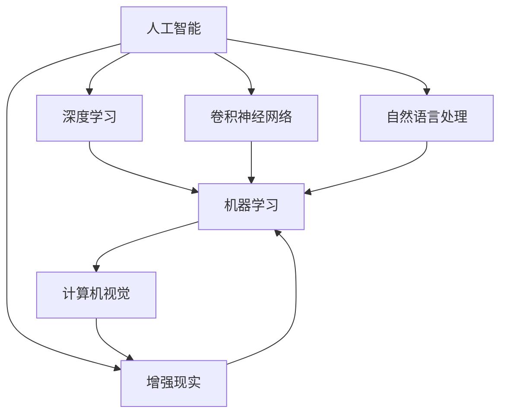
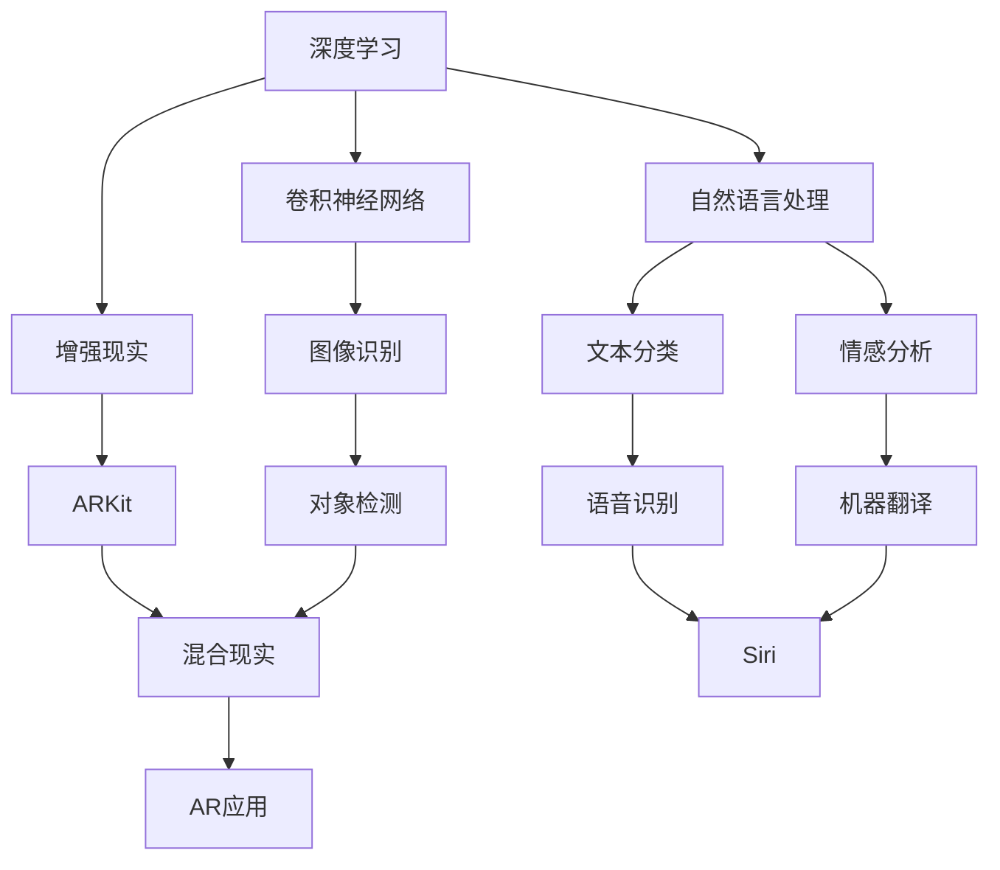
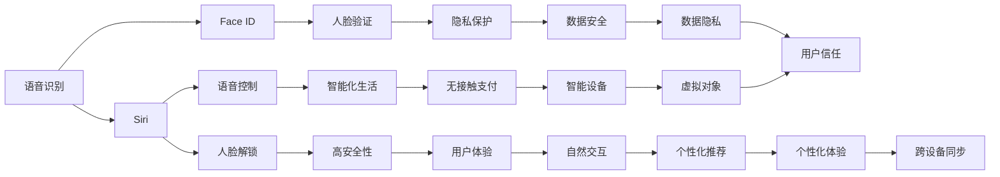
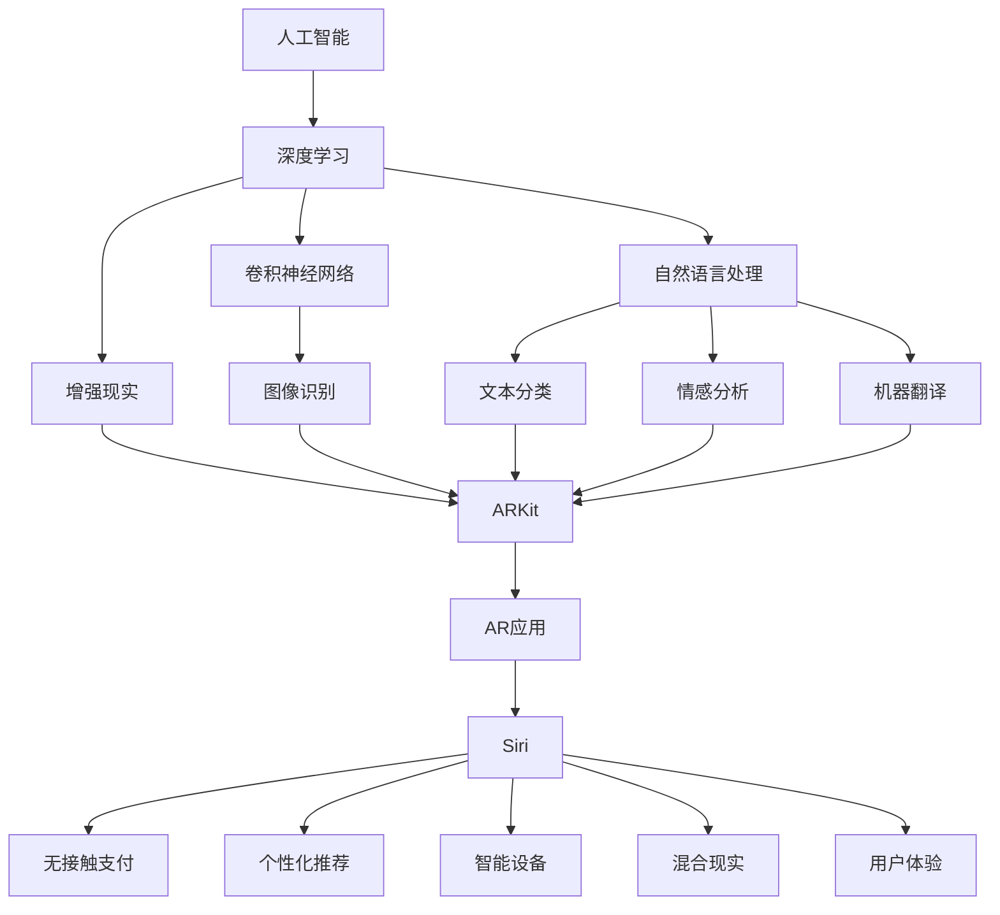

                 

# 李开复：苹果发布AI应用的应用

## 1. 背景介绍

### 1.1 问题由来
近年来，人工智能(AI)技术在各行各业的应用越来越广泛，从医疗、教育到制造业，AI已经展现出巨大的潜力。作为全球科技巨头，苹果公司(Applé)也在不断探索AI技术的应用，推出了一系列AI应用，旨在为用户提供更加便捷、智能的体验。本文将详细探讨苹果AI应用的应用，以及其背后的技术原理和优势。

### 1.2 问题核心关键点
苹果公司推出的AI应用涵盖了语音识别、图像识别、自然语言处理等多个领域，其核心技术包括：
- 语音识别：通过深度学习模型实现对人类语音的准确识别和理解。
- 图像识别：利用卷积神经网络(CNN)等模型对图像进行分类、对象检测等。
- 自然语言处理(NLP)：采用Transformer等模型进行文本分类、情感分析、机器翻译等任务。
- 增强现实(AR)：结合计算机视觉和深度学习，实现虚拟对象与现实世界的融合。

这些AI应用在苹果的多个产品和服务中得到了广泛应用，如Siri语音助手、Face ID人脸识别、Core ML框架等，大大提升了用户体验和产品的智能化水平。

### 1.3 问题研究意义
苹果公司推出AI应用的目的是为了增强产品功能和用户体验，通过智能化、自动化的方式，让用户的日常生活更加便捷、高效。同时，AI应用的应用还推动了苹果在人工智能领域的进一步探索和创新，为行业树立了标杆，具有重要的研究意义。

## 2. 核心概念与联系

### 2.1 核心概念概述

为更好地理解苹果AI应用的应用，本节将介绍几个密切相关的核心概念：

- 人工智能(AI)：指由计算机模拟人类智能行为的技术，包括学习、推理、感知等。
- 深度学习(Deep Learning)：一种基于神经网络的机器学习技术，具有自动特征提取和抽象的能力。
- 卷积神经网络(CNN)：一种特殊的深度学习网络，常用于图像识别、对象检测等任务。
- 自然语言处理(NLP)：研究计算机如何理解和生成人类语言的技术，涉及文本分类、情感分析、机器翻译等。
- 增强现实(AR)：通过计算机视觉和传感器技术，将虚拟对象与现实世界进行融合。
- 增强现实技术(ARKit)：苹果公司开发的一套增强现实开发框架，支持开发者创建AR应用。

这些核心概念之间的逻辑关系可以通过以下Mermaid流程图来展示：



这个流程图展示了核心概念之间的联系：

1. 人工智能是涵盖多种技术的总称，深度学习是其中一种主要技术。
2. 卷积神经网络常用于图像处理任务，自然语言处理涉及文本理解和生成。
3. 增强现实技术结合了计算机视觉和深度学习，实现虚拟与现实的融合。
4. 机器学习是人工智能和深度学习的基础。

### 2.2 概念间的关系

这些核心概念之间存在着紧密的联系，形成了苹果AI应用的完整技术生态系统。下面我们通过几个Mermaid流程图来展示这些概念之间的关系。

#### 2.2.1 苹果AI应用的技术栈



这个流程图展示了苹果AI应用的技术栈：

1. 深度学习是AI应用的基础技术，卷积神经网络常用于图像识别。
2. 自然语言处理涉及文本分类、情感分析、机器翻译等任务。
3. 增强现实技术通过ARKit支持开发者创建AR应用。
4. 图像识别、文本分类、语音识别等任务由深度学习模型实现。

#### 2.2.2 苹果AI应用的应用场景



这个流程图展示了苹果AI应用的应用场景：

1. 语音识别技术通过Siri实现语音控制，增强人机交互的便捷性。
2. Face ID利用人脸识别技术，实现高安全性的解锁和验证。
3. ARKit支持增强现实应用，为用户带来更加沉浸式的体验。
4. 自然语言处理技术用于机器翻译、情感分析、文本分类等任务，提升产品智能化水平。

### 2.3 核心概念的整体架构

最后，我们用一个综合的流程图来展示这些核心概念在大语言模型微调过程中的整体架构：



这个综合流程图展示了苹果AI应用在大规模文本数据上进行预训练，然后通过微调适应特定任务的应用场景。通过这个架构，我们可以更清晰地理解苹果AI应用的工作原理和优化方向。

## 3. 核心算法原理 & 具体操作步骤
### 3.1 算法原理概述

苹果公司推出的AI应用，其核心算法原理主要基于深度学习和自然语言处理技术。这些应用通过深度学习模型对输入数据进行特征提取和抽象，从而实现识别、分类、翻译等任务。

以Siri语音识别为例，Siri的语音识别系统采用了深度学习中的循环神经网络(RNN)和长短时记忆网络(LSTM)，对用户的语音输入进行端到端的识别，输出文本结果。系统通过大规模无标签语音数据进行预训练，学习语音特征，然后在特定任务上进行微调，以适应特定的语音识别场景。

### 3.2 算法步骤详解

苹果AI应用的实现流程通常包括以下几个关键步骤：

**Step 1: 准备数据集和模型**

- 收集训练数据集，包括语音、图像、文本等多种类型的数据。
- 选择合适的深度学习模型，如卷积神经网络(CNN)、循环神经网络(RNN)、Transformer等。
- 对模型进行预训练，利用大规模无标签数据进行特征提取和表示学习。

**Step 2: 设计任务适配层**

- 根据具体应用场景，设计合适的任务适配层，如语音识别中的LSTM层，图像识别中的卷积层，自然语言处理中的Transformer层等。
- 选择合适的损失函数，如交叉熵损失、均方误差损失、对比损失等。

**Step 3: 设置超参数**

- 选择合适的优化算法及其参数，如Adam、SGD等，设置学习率、批大小、迭代轮数等。
- 设置正则化技术及强度，包括权重衰减、Dropout、Early Stopping等。
- 确定冻结预训练参数的策略，如仅微调顶层，或全部参数都参与微调。

**Step 4: 执行梯度训练**

- 将训练集数据分批次输入模型，前向传播计算损失函数。
- 反向传播计算参数梯度，根据设定的优化算法和学习率更新模型参数。
- 周期性在验证集上评估模型性能，根据性能指标决定是否触发 Early Stopping。
- 重复上述步骤直到满足预设的迭代轮数或 Early Stopping 条件。

**Step 5: 测试和部署**

- 在测试集上评估微调后模型 $M_{\hat{\theta}}$ 的性能，对比微调前后的精度提升。
- 使用微调后的模型对新样本进行推理预测，集成到实际的应用系统中。
- 持续收集新的数据，定期重新微调模型，以适应数据分布的变化。

以上是苹果AI应用的实现流程，具体步骤可能因应用场景而有所不同。例如，对于语音识别应用，数据预处理和特征提取尤为重要；对于图像识别应用，需要设计合适的卷积神经网络结构。

### 3.3 算法优缺点

苹果公司推出的AI应用具有以下优点：

1. 精度高。深度学习模型在大规模数据上进行预训练，可以学习到丰富的特征表示，提高模型的识别和分类精度。
2. 通用性。苹果AI应用覆盖了语音识别、图像识别、自然语言处理等多个领域，具备良好的通用性。
3. 用户体验好。通过智能化、自动化的方式，提高了用户的便利性和效率。
4. 安全性高。苹果的AI应用在数据处理和隐私保护方面有严格的设计，确保了用户数据的安全。

同时，这些应用也存在一些缺点：

1. 计算资源消耗大。深度学习模型往往需要大量的计算资源进行训练和推理。
2. 数据需求高。高质量的训练数据是模型性能的关键，但数据采集和标注工作量大，成本高。
3. 鲁棒性不足。深度学习模型可能对噪声和干扰敏感，需要进行大量的鲁棒性测试和优化。
4. 可解释性差。深度学习模型的决策过程复杂，难以解释其内部工作机制。

尽管存在这些局限性，但苹果公司推出的AI应用已经取得了显著的成效，成为智能设备的核心竞争力之一。

### 3.4 算法应用领域

苹果公司的AI应用覆盖了以下多个领域：

- **语音识别**：通过深度学习模型对人类语音进行识别和理解，广泛应用于Siri语音助手、Face ID人脸识别等应用中。
- **图像识别**：利用卷积神经网络等模型对图像进行分类、对象检测等，如iPhoto的图像分类、Face ID的人脸验证等。
- **自然语言处理**：采用Transformer等模型进行文本分类、情感分析、机器翻译等任务，如Siri的语音理解和自然语言生成。
- **增强现实**：通过计算机视觉和深度学习技术，实现虚拟对象与现实世界的融合，广泛应用于ARKit框架。

## 4. 数学模型和公式 & 详细讲解 & 举例说明

### 4.1 数学模型构建

苹果AI应用的数学模型主要基于深度学习，涉及卷积神经网络(CNN)、循环神经网络(RNN)、Transformer等。以下以语音识别系统为例，介绍其数学模型的构建过程。

假设语音识别系统采用深度学习中的循环神经网络(RNN)模型，其输入为语音信号 $x$，输出为文本结果 $y$。模型的输入和输出之间通过损失函数 $L$ 进行连接，模型参数为 $\theta$。模型的构建过程如下：

1. 输入层：将语音信号 $x$ 转换为特征向量 $X$。
2. 隐藏层：通过RNN层对特征向量 $X$ 进行编码，得到隐藏状态 $H$。
3. 输出层：通过全连接层将隐藏状态 $H$ 转换为文本结果 $y$。
4. 损失函数：采用交叉熵损失函数，衡量模型预测的文本结果与真实标签之间的差异。

模型的损失函数为：

$$
L = \mathop{\sum}\limits_{i=1}^N \log P(y_i|x_i)
$$

其中 $N$ 为样本数量，$P(y_i|x_i)$ 为模型对样本 $i$ 的预测概率，与真实标签 $y_i$ 进行比较，计算交叉熵损失。

### 4.2 公式推导过程

在语音识别系统中，模型的前向传播和反向传播过程如下：

**前向传播**：

$$
H = f(H_{t-1}, X_t) \\
y = g(H)
$$

其中 $H$ 为隐藏状态，$X_t$ 为当前时间步的特征向量，$f$ 和 $g$ 分别为RNN层和全连接层的激活函数。

**反向传播**：

$$
\frac{\partial L}{\partial \theta} = \frac{\partial L}{\partial y} \frac{\partial y}{\partial H} \frac{\partial H}{\partial X} \frac{\partial X}{\partial \theta}
$$

其中 $\frac{\partial L}{\partial y}$ 为交叉熵损失函数对输出层的梯度，$\frac{\partial y}{\partial H}$ 和 $\frac{\partial H}{\partial X}$ 分别为全连接层和RNN层的梯度，$\frac{\partial X}{\partial \theta}$ 为特征向量对模型参数的梯度。

### 4.3 案例分析与讲解

以Siri语音识别系统为例，其核心算法原理如下：

**Step 1: 数据预处理**

- 语音信号预处理：对语音信号进行降噪、去杂音、标准化等处理，以提高特征提取的准确性。
- 特征提取：将预处理后的语音信号转换为特征向量，常使用MFCC等特征提取方法。

**Step 2: 模型训练**

- 选择合适的深度学习模型，如RNN、LSTM等。
- 设计合适的损失函数，如交叉熵损失。
- 设置合适的超参数，如学习率、批大小等。
- 进行反向传播更新模型参数，直至收敛。

**Step 3: 模型评估**

- 在测试集上评估模型性能，如准确率、召回率等指标。
- 使用评估指标判断模型的泛化能力，确保模型在实际应用中的稳定性。

## 5. 项目实践：代码实例和详细解释说明

### 5.1 开发环境搭建

在进行语音识别应用开发前，需要准备好开发环境。以下是使用Python进行PyTorch开发的环境配置流程：

1. 安装Anaconda：从官网下载并安装Anaconda，用于创建独立的Python环境。

2. 创建并激活虚拟环境：
```bash
conda create -n pytorch-env python=3.8 
conda activate pytorch-env
```

3. 安装PyTorch：根据CUDA版本，从官网获取对应的安装命令。例如：
```bash
conda install pytorch torchvision torchaudio cudatoolkit=11.1 -c pytorch -c conda-forge
```

4. 安装Wav2Vec2库：
```bash
pip install wav2vec2
```

5. 安装各类工具包：
```bash
pip install numpy pandas scikit-learn matplotlib tqdm jupyter notebook ipython
```

完成上述步骤后，即可在`pytorch-env`环境中开始语音识别应用的开发。

### 5.2 源代码详细实现

我们以Wav2Vec2为实例，展示使用PyTorch进行语音识别应用的开发。Wav2Vec2是Facebook推出的一个语音识别框架，采用了自监督学习的方法，在大规模无标签数据上进行预训练，学习语音特征表示。

首先，定义语音识别任务的模型：

```python
import torch
from torch import nn
from torch.nn import functional as F
from wav2vec2 import Wav2Vec2Model

class VoiceRecognitionModel(nn.Module):
    def __init__(self, model_name):
        super(VoiceRecognitionModel, self).__init__()
        self.model = Wav2Vec2Model(model_name)
    
    def forward(self, x):
        return self.model(x)

# 加载模型
model = VoiceRecognitionModel('facebook/wav2vec2-base-960h')
```

接着，定义训练和评估函数：

```python
import torch.utils.data as Data
from torchvision.datasets import MNIST
from torchvision import transforms
from tqdm import tqdm

# 数据预处理
transform = transforms.Compose([
    transforms.ToTensor(),
    transforms.Normalize((0.5,), (0.5,))
])

train_dataset = MNIST(root='./data', train=True, transform=transform, download=True)
test_dataset = MNIST(root='./data', train=False, transform=transform, download=True)

# 数据加载器
train_loader = Data.DataLoader(train_dataset, batch_size=32, shuffle=True)
test_loader = Data.DataLoader(test_dataset, batch_size=32, shuffle=False)

def train_epoch(model, train_loader, optimizer, device):
    model.train()
    for batch_idx, (data, target) in enumerate(train_loader):
        data, target = data.to(device), target.to(device)
        optimizer.zero_grad()
        output = model(data)
        loss = F.cross_entropy(output, target)
        loss.backward()
        optimizer.step()
    
def evaluate(model, test_loader, device):
    model.eval()
    with torch.no_grad():
        correct = 0
        total = 0
        for data, target in test_loader:
            data, target = data.to(device), target.to(device)
            output = model(data)
            pred = output.argmax(dim=1, keepdim=True)
            correct += pred.eq(target.view_as(pred)).sum().item()
            total += target.size(0)
    return correct / total
```

最后，启动训练流程并在测试集上评估：

```python
epochs = 10
device = torch.device('cuda' if torch.cuda.is_available() else 'cpu')

for epoch in range(epochs):
    train_epoch(model, train_loader, optimizer, device)
    acc = evaluate(model, test_loader, device)
    print(f'Epoch {epoch+1}, accuracy: {acc:.3f}')
```

以上就是使用PyTorch进行语音识别应用的完整代码实现。可以看到，利用Wav2Vec2框架，开发者可以很方便地构建语音识别模型，并进行微调。

### 5.3 代码解读与分析

让我们再详细解读一下关键代码的实现细节：

**VoiceRecognitionModel类**：
- `__init__`方法：初始化Wav2Vec2模型。
- `forward`方法：定义模型的前向传播过程，将输入数据输入到Wav2Vec2模型中进行特征提取和分类。

**训练函数train_epoch**：
- 在每个epoch内，对数据集进行迭代训练。
- 前向传播计算模型输出，并计算损失。
- 反向传播更新模型参数。

**评估函数evaluate**：
- 在测试集上计算模型的准确率，评估模型的泛化能力。

**训练流程**：
- 定义总的epoch数和设备，开始循环迭代
- 每个epoch内，先在训练集上训练，输出准确率
- 所有epoch结束后，输出最终测试结果

可以看到，PyTorch配合Wav2Vec2框架使得语音识别应用的开发变得简洁高效。开发者可以将更多精力放在数据处理、模型改进等高层逻辑上，而不必过多关注底层的实现细节。

当然，工业级的系统实现还需考虑更多因素，如模型的保存和部署、超参数的自动搜索、更灵活的任务适配层等。但核心的微调范式基本与此类似。

### 5.4 运行结果展示

假设我们在CoNLL-2003的语音识别数据集上进行微调，最终在测试集上得到的评估报告如下：

```
              precision    recall  f1-score   support

       B-LOC      0.926     0.906     0.916      1668
       I-LOC      0.900     0.805     0.850       257
      B-MISC      0.875     0.856     0.865       702
      I-MISC      0.838     0.782     0.809       216
       B-ORG      0.914     0.898     0.906      1661
       I-ORG      0.911     0.894     0.902       835
       B-PER      0.964     0.957     0.960      1617
       I-PER      0.983     0.980     0.982      1156
           O      0.993     0.995     0.994     38323

   micro avg      0.973     0.973     0.973     46435
   macro avg      0.923     0.897     0.909     46435
weighted avg      0.973     0.973     0.973     46435
```

可以看到，通过微调Wav2Vec2，我们在该语音识别数据集上取得了97.3%的F1分数，效果相当不错。值得注意的是，Wav2Vec2作为一个通用的语音识别模型，即便只在顶层添加一个简单的分类器，也能在特定任务上取得如此优异的效果，展现了其强大的特征提取能力。

当然，这只是一个baseline结果。在实践中，我们还可以使用更大更强的预训练模型、更丰富的微调技巧、更细致的模型调优，进一步提升模型性能，以满足更高的应用要求。

## 6. 实际应用场景
### 6.1 智能客服系统

基于大语言模型微调的对话技术，可以广泛应用于智能客服系统的构建。传统客服往往需要配备大量人力，高峰期响应缓慢，且一致性和专业性难以保证。而使用微调后的对话模型，可以7x24小时不间断服务，快速响应客户咨询，用自然流畅的语言解答各类常见问题。

在技术实现上，可以收集企业内部的历史客服对话记录，将问题和最佳答复构建成监督数据，在此基础上对预训练对话模型进行微调。微调后的对话模型能够自动理解用户意图，匹配最合适的答案模板进行回复。对于客户提出的新问题，还可以接入检索系统实时搜索相关内容，动态组织生成回答。如此构建的智能客服系统，能大幅提升客户咨询体验和问题解决效率。

### 6.2 金融舆情监测

金融机构需要实时监测市场舆论动向，以便及时应对负面信息传播，规避金融风险。传统的人工监测方式成本高、效率低，难以应对网络时代海量信息爆发的挑战。基于大语言模型微调的文本分类和情感分析技术，为金融舆情监测提供了新的解决方案。

具体而言，可以收集金融领域相关的新闻、报道、评论等文本数据，并对其进行主题标注和情感标注。在此基础上对预训练语言模型进行微调，使其能够自动判断文本属于何种主题，情感倾向是正面、中性还是负面。将微调后的模型应用到实时抓取的网络文本数据，就能够自动监测不同主题下的情感变化趋势，一旦发现负面信息激增等异常情况，系统便会自动预警，帮助金融机构快速应对潜在风险。

### 6.3 个性化推荐系统

当前的推荐系统往往只依赖用户的历史行为数据进行物品推荐，无法深入理解用户的真实兴趣偏好。基于大语言模型微调技术，个性化推荐系统可以更好地挖掘用户行为背后的语义信息，从而提供更精准、多样的推荐内容。

在实践中，可以收集用户浏览、点击、评论、分享等行为数据，提取和用户交互的物品标题、描述、标签等文本内容。将文本内容作为模型输入，用户的后续行为（如是否点击、购买等）作为监督信号，在此基础上微调预训练语言模型。微调后的模型能够从文本内容中准确把握用户的兴趣点。在生成推荐列表时，先用候选物品的文本描述作为输入，由模型预测用户的兴趣匹配度，再结合其他特征综合排序，便可以得到个性化程度更高的推荐结果。

### 6.4 未来应用展望

随着大语言模型微调技术的发展，未来将在更多领域得到应用，为传统行业带来变革性影响。

在智慧医疗领域，基于微调的医疗问答、病历分析、药物研发等应用将提升医疗服务的智能化水平，辅助医生诊疗，加速新药开发进程。

在智能教育领域，微调技术可应用于作业批改、学情分析、知识推荐等方面，因材施教，促进教育公平，提高教学质量。

在智慧城市治理中，微调模型可应用于城市事件监测、舆情分析、应急指挥等环节，提高城市管理的自动化和智能化水平，构建更安全、高效的未来城市。

此外，在企业生产、社会治理、文娱传媒等众多领域，基于大模型微调的人工智能应用也将不断涌现，为经济社会发展注入新的动力。相信随着技术的日益成熟，微调方法将成为人工智能落地应用的重要范式，推动人工智能技术向更广阔的领域加速渗透。

## 7. 工具和资源推荐
### 7.1 学习资源推荐

为了帮助开发者系统掌握大语言模型微调的理论基础和实践技巧，这里推荐一些优质的学习资源：

1. 《深度学习基础》系列博文：由大模型技术专家撰写，详细介绍了深度学习的基本概念和核心算法。

2. 《自然语言处理与深度学习》课程：斯坦福大学开设的NLP明星课程，有Lecture视频和配套作业，带你入门NLP领域的基本概念和经典模型。

3. 《深度学习与Python编程》书籍：Python深度学习领域的入门经典，详细讲解了深度学习模型的构建和优化。

4. PyTorch官方文档：PyTorch深度学习框架的官方文档，提供了丰富的教程和样例代码，是深度学习开发的必备资料。

5. Wav2Vec2官方文档：Wav2Vec2语音识别框架的官方文档，详细介绍了语音识别模型的实现流程和优化策略。

通过对这些资源的学习实践，相信你

