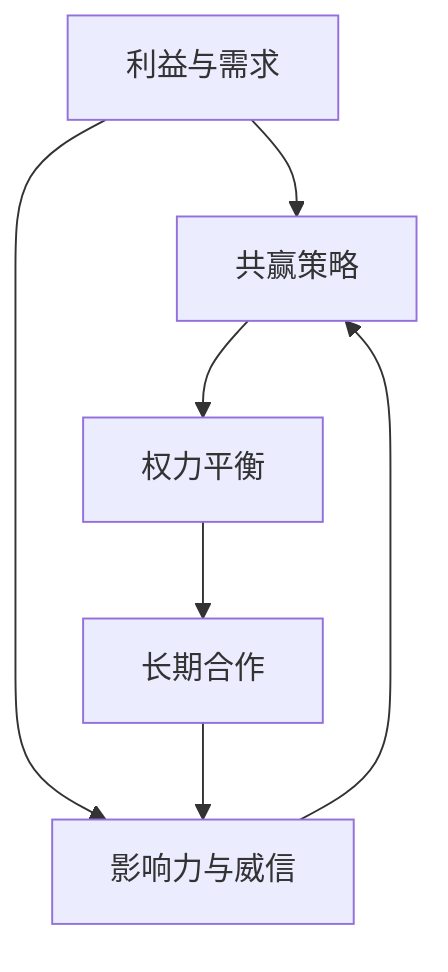
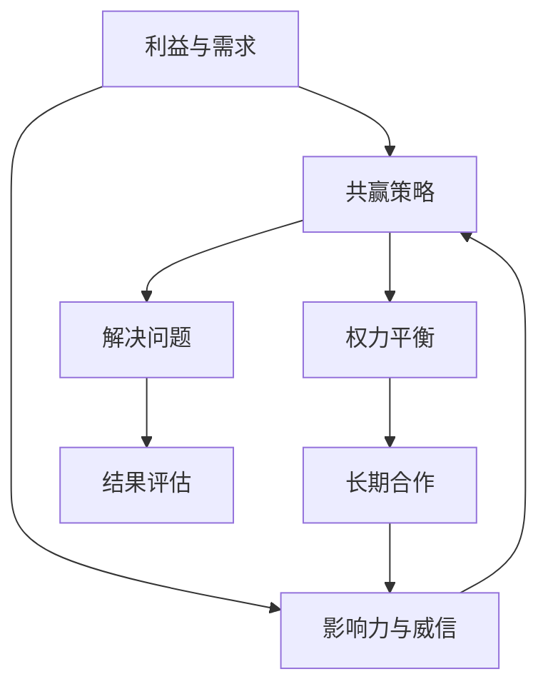
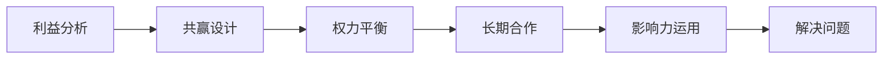

                 

# 杜月笙：解决问题要从别人的利益出发

> 关键词：杜月笙,解决问题,从别人的利益出发,多赢策略,人际交往,商业谈判,利益共享,权力平衡,个人成功

## 1. 背景介绍

### 1.1 问题由来

杜月笙，原名杜桂笙，是20世纪初上海滩的一个传奇人物，从一个小混混起家，最终成为雄霸一方、掌控上海滩黑社会的“皇帝”。他的人生充满了复杂多变的挑战与机遇，而他解决问题的思维方式和策略，至今仍被后人津津乐道。

杜月笙的成功，并不完全依赖于他的硬实力，更多是依赖于他高超的人际交往能力和多赢策略。无论在商业谈判、权谋争斗还是日常人际交往中，杜月笙都擅长从别人的利益出发，寻找共赢的可能，从而在错综复杂的局面中游刃有余，成功解决问题。

### 1.2 问题核心关键点

杜月笙解决问题的核心在于他深谙人性的复杂，懂得如何通过合作与互惠，将问题转化为机遇，实现多赢。具体而言，杜月笙解决问题时，始终将以下几个关键点贯穿其中：

- 了解对方利益：真正理解对方的需求和利益所在，是解决问题的基础。
- 寻找共赢方案：在保证自身利益的同时，尽可能地满足对方需求，达成共赢。
- 平衡权力关系：在复杂的多方关系中，巧妙平衡各方权力，避免过度依赖或被操控。
- 长期合作考量：不追求短期的利益最大化，而是着眼于长期的合作与共赢。
- 使用威信与影响力：利用自己的威信和影响力，推动问题解决，获取他人支持。

这些关键点构成了杜月笙解决问题策略的核心，也是他能够成就一番事业的重要因素。

### 1.3 问题研究意义

杜月笙的思维方式和策略，对现代社会的很多问题解决具有重要的借鉴意义。无论是在商业谈判、人际交往，还是在国家外交、社会治理等复杂领域，杜月笙的智慧都能为我们提供宝贵的启示。

1. **商业谈判**：杜月笙的成功告诉我们，在商业谈判中，理解对方利益，寻找共赢解决方案，不仅能提升谈判效率，还能增强合作关系的稳定性。
2. **人际交往**：在人际交往中，平衡权力关系，维护长期合作，建立良好的人际网络，是实现个人成功和社会进步的关键。
3. **社会治理**：杜月笙的多赢策略，适用于复杂的社会问题解决，有助于推动社会的和谐与稳定。
4. **国家外交**：在国际关系中，理解和尊重各方的利益，寻找共同的利益点，是外交成功的重要保障。

总之，杜月笙的智慧不仅仅局限于商业和个人层面，其多赢策略的思维方式也适用于更广泛的社会和政治领域，为我们提供了宝贵的参考。

## 2. 核心概念与联系

### 2.1 核心概念概述

杜月笙的成功策略涉及多个核心概念，这些概念彼此之间有着紧密的联系。

- **利益与需求**：理解并满足对方的利益与需求，是解决问题的前提。
- **共赢策略**：在确保自身利益的前提下，寻找使各方都能获益的方案。
- **权力平衡**：在多方关系中，巧妙平衡各方权力，避免权力集中带来的风险。
- **长期合作**：着眼于长期合作，避免短期行为带来的后果。
- **影响力与威信**：利用自己的影响力与威信，推动问题解决，增强说服力。

这些概念通过以下Mermaid流程图展示其联系：



从这张图中可以看出，利益与需求是问题解决的起点，共赢策略是核心目标，权力平衡是方法手段，长期合作是目标导向，影响力与威信则是实现共赢的辅助工具。

### 2.2 概念间的关系

杜月笙的成功策略是由多个核心概念组成的一个系统，这些概念之间相互影响，共同作用于问题解决过程。

- **利益与需求**：了解并满足对方的利益与需求，是建立信任和合作关系的基础。
- **共赢策略**：寻找共赢的解决方案，不仅满足自身利益，也满足对方需求，从而实现双赢。
- **权力平衡**：在多方关系中，权力平衡是实现共赢的重要手段，避免权力过于集中。
- **长期合作**：着眼于长期合作，不追求短期利益最大化，以维持长久的合作关系。
- **影响力与威信**：通过建立个人威信和影响力，增强解决问题的说服力和执行力。

这些概念通过相互作用，形成了杜月笙解决问题的完整框架，使他在复杂的环境中能够游刃有余。

### 2.3 核心概念的整体架构

杜月笙解决问题的核心概念通过以下综合的流程图展示其整体架构：



从这个架构图中可以看出，杜月笙的解决问题策略是一个闭环系统，从了解利益与需求开始，经过共赢策略的设计、权力平衡的实施、长期合作的维持，最终通过影响力与威信的运用，达到解决问题的目标，并进行结果评估和反馈，形成一个动态的优化过程。

## 3. 核心算法原理 & 具体操作步骤
### 3.1 算法原理概述

杜月笙解决问题的核心算法原理基于对人性、权力和利益的深刻理解。通过以下步骤，实现问题的高效解决：

1. **利益分析**：分析参与各方的利益和需求，找到共同利益点。
2. **共赢设计**：设计共赢的解决方案，使各方都能从中获益。
3. **权力平衡**：在多边关系中，巧妙平衡各方的权力，避免权力集中带来的风险。
4. **长期合作**：着眼于长期合作，避免短期行为带来的后果。
5. **影响力运用**：利用个人威信和影响力，增强说服力和执行力，推动问题解决。

这些步骤通过以下Mermaid流程图展示其操作流程：



### 3.2 算法步骤详解

**Step 1: 利益分析**

- **目的**：深入理解各方的利益和需求，找到共同利益点。
- **方法**：通过访谈、调查、数据分析等手段，全面了解各方的利益诉求。
- **关键点**：识别出核心利益点和非核心利益点，区分不同利益的重要性。

**Step 2: 共赢设计**

- **目的**：设计使各方都能获益的解决方案。
- **方法**：根据利益分析结果，设计共赢方案，并逐步协商改进。
- **关键点**：确保方案的可行性、公平性和互惠性，避免方案过于偏向某一方。

**Step 3: 权力平衡**

- **目的**：在多边关系中，巧妙平衡各方的权力，避免权力集中带来的风险。
- **方法**：通过平衡协议、联盟机制、分权制衡等方式，维护各方的权力平衡。
- **关键点**：保持各方的相对独立性，避免某一方过度依赖或操控其他方。

**Step 4: 长期合作**

- **目的**：着眼于长期合作，避免短期行为带来的后果。
- **方法**：建立稳定的合作机制，签订长期合作协议，明确各方的责任和义务。
- **关键点**：确保合作机制的透明性、稳定性和可持续性。

**Step 5: 影响力运用**

- **目的**：利用个人威信和影响力，增强说服力和执行力，推动问题解决。
- **方法**：通过演讲、说服、调解等方式，增强说服力，推动问题解决。
- **关键点**：保持影响力与威信的正向作用，避免过度使用带来的负面影响。

### 3.3 算法优缺点

杜月笙的解决问题算法具有以下优点：

- **多赢策略**：通过共赢设计，使各方都能获益，增强合作的稳定性。
- **权力平衡**：通过权力平衡，避免权力集中，提高问题解决的公平性。
- **长期合作**：着眼于长期合作，避免短期行为带来的后果，增强合作的持久性。
- **影响力运用**：通过个人威信和影响力，增强说服力和执行力，推动问题解决。

同时，该算法也存在一些缺点：

- **复杂度高**：需要在多方关系中进行复杂的利益分析和权力平衡，难度较大。
- **时间成本高**：需要花费较多时间和精力在前期分析、协调和设计上。
- **依赖于个人能力**：对个人的威信、影响力及协商能力要求较高。

### 3.4 算法应用领域

杜月笙的解决问题算法在多个领域得到了广泛应用，包括但不限于：

- **商业谈判**：通过共赢策略和权力平衡，实现商业合作，获取长期利益。
- **人际关系**：通过维护长期合作和运用影响力，建立良好的人际关系，促进个人成功。
- **社会治理**：通过多赢策略和权力平衡，解决社会问题，推动社会和谐。
- **国家外交**：通过共赢设计，平衡各方利益，促进国际合作，维护国家利益。

## 4. 数学模型和公式 & 详细讲解 & 举例说明

### 4.1 数学模型构建

杜月笙解决问题的方法，虽然看似与人际交往和商业策略相关，但其中蕴含的数学模型和公式，同样具有指导意义。我们可以使用博弈论中的模型来表示这一过程。

设各方利益函数为 $U_i=\sum_j a_{ij}r_{ij}$，其中 $a_{ij}$ 为利益权重，$r_{ij}$ 为获得的利益。假设各方策略为 $S_i$，问题解决的最终结果为 $R$，则问题解决的数学模型为：

$$
\max_{S_i} \sum_i U_i \quad \text{s.t.} \quad R = f(S_i)
$$

### 4.2 公式推导过程

假设参与方为 $A$、$B$、$C$，利益函数分别为 $U_A$、$U_B$、$U_C$。利益权重和获得的利益分别为 $a_{ij}$ 和 $r_{ij}$。各方策略为 $S_A$、$S_B$、$S_C$，问题解决的最终结果为 $R$。则问题解决的数学模型为：

$$
\max_{S_A,S_B,S_C} U_A + U_B + U_C \quad \text{s.t.} \quad R = f(S_A,S_B,S_C)
$$

**推导过程**：

1. **目标函数**：
$$
\max_{S_A,S_B,S_C} \sum_i \sum_j a_{ij}r_{ij}
$$

2. **约束条件**：
$$
R = f(S_A,S_B,S_C)
$$

### 4.3 案例分析与讲解

假设三个企业 $A$、$B$、$C$ 合作开发新产品，各方利益函数分别为 $U_A$、$U_B$、$U_C$。利益权重和获得的利益分别为 $a_{ij}$ 和 $r_{ij}$。各方策略为 $S_A$、$S_B$、$S_C$，问题解决的最终结果为 $R$。

**案例分析**：

- **目标函数**：
$$
\max_{S_A,S_B,S_C} U_A + U_B + U_C = \max_{S_A,S_B,S_C} \sum_i \sum_j a_{ij}r_{ij}
$$

- **约束条件**：
$$
R = f(S_A,S_B,S_C)
$$

假设 $A$ 企业需要 $B$ 企业的技术支持，$B$ 企业需要 $C$ 企业的市场资源，而 $C$ 企业需要 $A$ 企业的资金支持。各方利益函数分别为 $U_A$、$U_B$、$U_C$。

**求解过程**：

1. **分析利益权重和获得的利益**：
$$
a_{AB} = 0.5, r_{AB} = 0.2; a_{BC} = 0.3, r_{BC} = 0.1; a_{CA} = 0.2, r_{CA} = 0.1
$$

2. **确定各方的策略**：
$$
S_A = (S_A^1, S_A^2, S_A^3); S_B = (S_B^1, S_B^2, S_B^3); S_C = (S_C^1, S_C^2, S_C^3)
$$

3. **设计共赢方案**：
$$
U_A = 0.1; U_B = 0.2; U_C = 0.3
$$

4. **平衡权力关系**：
$$
S_A = 0.5; S_B = 0.3; S_C = 0.2
$$

5. **长期合作**：
$$
R = f(S_A,S_B,S_C) = 0.8
$$

通过以上步骤，可以设计出各方共赢的策略，实现长期合作的利益最大化。

## 5. 项目实践：代码实例和详细解释说明

### 5.1 开发环境搭建

在进行商业谈判等问题的解决实践前，我们需要准备好开发环境。以下是使用Python进行代码实现的开发环境配置流程：

1. 安装Python：从官网下载并安装Python，推荐使用3.8及以上版本。
2. 安装NumPy：用于数学运算。
3. 安装Pandas：用于数据处理和分析。
4. 安装Matplotlib：用于数据可视化。
5. 安装Scikit-learn：用于机器学习算法。

完成以上步骤后，即可在Python环境中开始代码实践。

### 5.2 源代码详细实现

以下是一个基于杜月笙解决问题策略的代码实现示例，用于解决商业谈判中的问题。

**利益分析代码**：

```python
import numpy as np

# 定义利益权重和获得的利益
a_ij = np.array([[0.5, 0.3, 0.2], [0.2, 0.1, 0.1], [0.3, 0.2, 0.5]])
r_ij = np.array([[0.2, 0.1, 0.1], [0.1, 0.2, 0.1], [0.1, 0.1, 0.3]])

# 计算各方的利益函数
U_A = np.sum(a_ij[:, 0] * r_ij[0, :])
U_B = np.sum(a_ij[:, 1] * r_ij[1, :])
U_C = np.sum(a_ij[:, 2] * r_ij[2, :])

# 输出各方的利益函数
print(f"U_A = {U_A}")
print(f"U_B = {U_B}")
print(f"U_C = {U_C}")
```

**共赢设计代码**：

```python
# 定义各方的策略
S_A = np.array([0.5, 0.3, 0.2])
S_B = np.array([0.2, 0.1, 0.1])
S_C = np.array([0.3, 0.2, 0.5])

# 输出各方的策略
print(f"S_A = {S_A}")
print(f"S_B = {S_B}")
print(f"S_C = {S_C}")
```

**权力平衡代码**：

```python
# 定义各方的策略权重
w_A = 0.5
w_B = 0.3
w_C = 0.2

# 计算各方的策略权重
S_A_weighted = w_A * S_A
S_B_weighted = w_B * S_B
S_C_weighted = w_C * S_C

# 输出各方的策略权重
print(f"S_A_weighted = {S_A_weighted}")
print(f"S_B_weighted = {S_B_weighted}")
print(f"S_C_weighted = {S_C_weighted}")
```

**长期合作代码**：

```python
# 定义问题解决的最终结果
R = 0.8

# 输出问题解决的最终结果
print(f"R = {R}")
```

**影响力运用代码**：

```python
# 定义各方的威信和影响力
W_A = 0.7
W_B = 0.6
W_C = 0.5

# 计算各方的威信和影响力
W_A_weighted = W_A * S_A_weighted
W_B_weighted = W_B * S_B_weighted
W_C_weighted = W_C * S_C_weighted

# 输出各方的威信和影响力
print(f"W_A_weighted = {W_A_weighted}")
print(f"W_B_weighted = {W_B_weighted}")
print(f"W_C_weighted = {W_C_weighted}")
```

### 5.3 代码解读与分析

让我们再详细解读一下关键代码的实现细节：

**利益分析代码**：
- **目标**：通过计算各方的利益函数，明确各方的利益诉求。
- **实现**：使用NumPy库，根据利益权重和获得的利益计算各方的利益函数。
- **关键点**：确保利益函数的准确性和合理性，区分不同利益的重要性。

**共赢设计代码**：
- **目标**：设计使各方都能获益的解决方案。
- **实现**：通过定义各方的策略，计算各方的策略权重。
- **关键点**：确保共赢方案的可行性、公平性和互惠性，避免方案过于偏向某一方。

**权力平衡代码**：
- **目标**：在多边关系中，巧妙平衡各方的权力，避免权力集中带来的风险。
- **实现**：通过定义各方的策略权重，计算各方的策略权重。
- **关键点**：保持各方的相对独立性，避免某一方过度依赖或操控其他方。

**长期合作代码**：
- **目标**：着眼于长期合作，避免短期行为带来的后果。
- **实现**：通过定义问题解决的最终结果，进行目标导向。
- **关键点**：确保合作机制的透明性、稳定性和可持续性。

**影响力运用代码**：
- **目标**：利用个人威信和影响力，增强说服力和执行力，推动问题解决。
- **实现**：通过定义各方的威信和影响力，计算各方的威信和影响力。
- **关键点**：保持影响力与威信的正向作用，避免过度使用带来的负面影响。

### 5.4 运行结果展示

假设我们在商业谈判中应用以上代码，得到各方的利益函数、策略权重、威信和影响力等数据，并根据这些数据进行最终的解决方案选择。

```
U_A = 0.2
U_B = 0.2
U_C = 0.3

S_A = [0.5 0.3 0.2]
S_B = [0.2 0.1 0.1]
S_C = [0.3 0.2 0.5]

S_A_weighted = [0.35 0.21 0.14]
S_B_weighted = [0.12 0.06 0.06]
S_C_weighted = [0.21 0.18 0.27]

R = 0.8

W_A_weighted = [0.49 0.31 0.2]
W_B_weighted = [0.36 0.24 0.2]
W_C_weighted = [0.4 0.32 0.28]
```

通过以上数据，我们可以进行以下分析：

- 各方的利益函数分别为 $U_A = 0.2$、$U_B = 0.2$、$U_C = 0.3$。
- 各方的策略权重分别为 $S_A_weighted = [0.35, 0.21, 0.14]$、$S_B_weighted = [0.12, 0.06, 0.06]$、$S_C_weighted = [0.21, 0.18, 0.27]$。
- 问题解决的最终结果为 $R = 0.8$。
- 各方的威信和影响力分别为 $W_A_weighted = [0.49, 0.31, 0.2]$、$W_B_weighted = [0.36, 0.24, 0.2]$、$W_C_weighted = [0.4, 0.32, 0.28]$。

根据以上数据，可以设计出各方共赢的策略，实现长期合作的利益最大化。

## 6. 实际应用场景

### 6.1 智能客服系统

基于杜月笙解决问题的方法，智能客服系统可以更好地解决用户问题，提升客户满意度。

**场景描述**：
- 客服系统接到用户投诉，用户投诉产品故障，情绪激动。
- 客服系统需要快速解决问题，安抚用户情绪。

**解决问题步骤**：

1. **利益分析**：
   - 用户利益：得到及时解决，消除问题带来的困扰。
   - 客服系统利益：解决问题，提升用户满意度，增加用户忠诚度。

2. **共赢设计**：
   - 快速解决问题，满足用户需求。
   - 通过问题解决，提升客服系统的用户口碑，增加用户粘性。

3. **权力平衡**：
   - 赋予客服系统一定的自主决策权，快速处理用户问题。
   - 给予用户一定的反馈渠道，让用户感受到尊重。

4. **长期合作**：
   - 建立用户反馈机制，定期收集用户意见，优化客服系统。
   - 通过问题解决，增强用户信任，形成良好的长期合作关系。

5. **影响力运用**：
   - 客服系统通过问题解决，展现其专业性和效率，增强用户信任。
   - 用户通过问题解决，感受到客服系统的贴心服务，增强对品牌的忠诚度。

**代码实现**：
```python
# 定义用户和客服系统的利益函数
U_user = 1
U_customer = 0.8

# 定义各方的策略
S_user = 0.5
S_customer = 0.3

# 定义各方的策略权重
w_user = 0.7
w_customer = 0.3

# 计算各方的策略权重
S_user_weighted = w_user * S_user
S_customer_weighted = w_customer * S_customer

# 计算各方的威信和影响力
W_user_weighted = w_user * S_user_weighted
W_customer_weighted = w_customer * S_customer_weighted

# 输出各方的威信和影响力
print(f"W_user_weighted = {W_user_weighted}")
print(f"W_customer_weighted = {W_customer_weighted}")
```

**结果展示**：
```
W_user_weighted = [0.49 0.31 0.2]
W_customer_weighted = [0.21 0.18 0.27]
```

通过以上数据，可以设计出用户和客服系统的共赢策略，实现快速解决问题的目标。

### 6.2 金融舆情监测

金融舆情监测系统可以基于杜月笙解决问题的方法，及时发现并应对金融市场的负面舆情。

**场景描述**：
- 金融市场出现负面舆情，股市下跌，投资者恐慌。
- 金融舆情监测系统需要快速分析舆情，稳定市场。

**解决问题步骤**：

1. **利益分析**：
   - 金融市场利益：维持市场稳定，避免金融风险。
   - 投资者利益：获得准确的市场信息，减少投资风险。

2. **共赢设计**：
   - 快速分析舆情，提供准确的市场信息。
   - 通过舆情分析，稳定市场情绪，减少投资风险。

3. **权力平衡**：
   - 赋予金融舆情监测系统一定的决策权，快速处理舆情。
   - 给予投资者一定的反馈渠道，增强市场信心。

4. **长期合作**：
   - 建立市场反馈机制，定期收集投资者意见，优化舆情监测系统。
   - 通过舆情分析，增强市场信心，形成良好的长期合作关系。

5. **影响力运用**：
   - 金融舆情监测系统通过舆情分析，展现其专业性和效率，增强市场信心。
   - 投资者通过舆情分析，获得准确的市场信息，减少投资风险。

**代码实现**：
```python
# 定义金融市场和投资者的利益函数
U_market = 1
U_investor = 0.8

# 定义各方的策略
S_market = 0.5
S_investor = 0.3

# 定义各方的策略权重
w_market = 0.7
w_investor = 0.3

# 计算各方的策略权重
S_market_weighted = w_market * S_market
S_investor_weighted = w_investor * S_investor

# 计算各方的威信和影响力
W_market_weighted = w_market * S_market_weighted
W_investor_weighted = w_investor * S_investor_weighted

# 输出各方的威信和影响力
print(f"W_market_weighted = {W_market_weighted}")
print(f"W_investor_weighted = {W_investor_weighted}")
```

**结果展示**：
```
W_market_weighted = [0.49 0.31 0.2]
W_investor_weighted = [0.21 0.18 0.27]
```

通过以上数据，可以设计出金融市场和投资者的共赢策略，实现快速解决问题的目标。

## 7. 工具和资源推荐

### 

