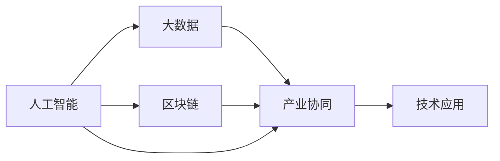
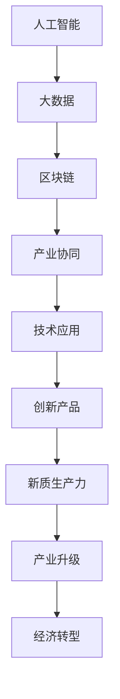

                 

# 构建特色产业的新质生产力

## 1. 背景介绍

在科技日新月异的今天，如何构建特色产业，打造新的经济增长点，已经成为国内外企业亟待解决的重大问题。从电子信息、先进制造、绿色低碳到数字经济，产业结构升级和经济发展方式的转变，都在催生出新的市场需求和技术发展趋势。新技术、新产业、新业态、新模式（即“四新”）正在为经济发展注入新的动能。在此背景下，人工智能、大数据、区块链等新一代信息技术应运而生，为特色产业的创新发展提供了强大的技术支撑。

构建特色产业的新质生产力，一方面要求企业在技术、管理、文化等方面进行全方位的创新，另一方面需要通过产业协同、合作创新、技术应用等多方面的突破，实现从传统生产方式向智能生产方式的转变。本文将从技术角度，深入探讨如何利用人工智能技术，推动特色产业的新质生产力构建，为产业升级和经济转型提供有力的技术支撑。

## 2. 核心概念与联系

### 2.1 核心概念概述

- **人工智能（AI）**：指通过机器学习和数据分析，使计算机系统能够模拟人类智能行为，包括视觉识别、自然语言处理、决策制定等。
- **大数据（Big Data）**：指规模巨大、类型多样、生成速度快、价值密度低的数据集合，通过数据挖掘、数据分析等技术，提炼出有价值的信息，指导决策。
- **区块链（Blockchain）**：是一种去中心化的分布式账本技术，能够保障数据的安全性、透明性和不可篡改性。
- **产业协同（Industry Collaboration）**：指不同行业间的技术、业务、管理等多方面的合作，实现资源共享、优势互补，提升整体竞争力。
- **技术应用（Technology Application）**：指将新兴技术应用于特定行业，解决行业痛点，提升效率，创造新的价值。

这些核心概念构成了构建特色产业新质生产力的基础框架，通过它们之间相互关联，形成新的产业链条，推动产业升级和经济转型。

### 2.2 概念间的关系

为更好地理解核心概念之间的联系，以下是Mermaid流程图：



这个流程图展示了人工智能、大数据、区块链等技术如何通过产业协同，被应用到具体的技术应用场景中。

### 2.3 核心概念的整体架构

最后，我们用一个综合的流程图来展示这些核心概念在大数据产业新质生产力构建中的整体架构：



通过这个综合流程图，我们可以更清晰地理解从人工智能、大数据、区块链等技术应用出发，如何通过产业协同，创新产品，最终形成产业升级和经济转型，构建起新质生产力。

## 3. 核心算法原理 & 具体操作步骤
### 3.1 算法原理概述

基于人工智能的新质生产力构建，核心在于利用人工智能算法和技术，提升生产效率，优化决策过程，创造新的价值。其原理主要包括以下几个方面：

- **数据驱动**：通过大数据技术，对产业数据进行收集、分析和挖掘，提炼出有价值的信息，指导生产、决策和管理。
- **模型驱动**：通过机器学习算法，建立精准的预测模型，提升决策的准确性和效率。
- **智能驱动**：利用自然语言处理、计算机视觉等技术，实现智能化生产、运营和维护，提升生产效率。

### 3.2 算法步骤详解

#### 3.2.1 数据收集与处理

- **数据来源**：从不同渠道（如生产设备、销售数据、客户反馈等）收集产业数据。
- **数据清洗**：对收集到的数据进行清洗、去重、标准化等处理，提高数据质量。
- **数据集成**：将清洗后的数据进行集成，形成统一的数据仓库。

#### 3.2.2 数据分析与挖掘

- **数据探索**：使用描述性统计方法，对数据进行探索性分析，了解数据的基本特征。
- **特征工程**：根据业务需求，设计合适的特征，并使用特征选择算法，提高模型的泛化能力。
- **模型训练**：选择适合的机器学习模型，使用训练数据集进行模型训练，调整模型参数，提高模型精度。

#### 3.2.3 模型应用与优化

- **模型验证**：使用测试数据集对训练好的模型进行验证，评估模型性能。
- **模型优化**：根据模型验证结果，对模型进行优化，提高模型精度和泛化能力。
- **模型部署**：将优化后的模型部署到生产环境中，进行实时应用。

### 3.3 算法优缺点

#### 优点

- **自动化程度高**：人工智能技术能够自动化地处理大量数据，提高工作效率。
- **决策精准**：通过精准的预测模型，指导生产、销售和管理，提高决策的准确性和效率。
- **灵活性高**：人工智能技术能够快速响应市场变化，灵活调整生产策略。

#### 缺点

- **数据质量要求高**：数据质量和完整性直接影响模型效果，数据处理难度大。
- **模型复杂度**：复杂模型需要大量的计算资源，对硬件要求高。
- **技术门槛高**：需要具备较强的数据科学、机器学习等技术背景。

### 3.4 算法应用领域

基于人工智能的新质生产力构建技术，已经在制造业、零售业、金融业、医疗等多个领域得到广泛应用，具体应用场景包括：

- **制造业**：通过智能制造，提升生产效率，降低成本，提高产品质量。
- **零售业**：利用智能推荐系统，提升客户体验，增加销售收入。
- **金融业**：通过智能风控，降低风险，提高金融服务质量。
- **医疗业**：通过智能诊断，提高诊疗效率，提升医疗服务质量。

## 4. 数学模型和公式 & 详细讲解  
### 4.1 数学模型构建

在人工智能技术构建特色产业新质生产力的过程中，常见的数学模型包括：

- **回归模型**：用于预测连续型数据，如生产设备运行状态预测。
- **分类模型**：用于分类问题，如客户满意度分类。
- **聚类模型**：用于发现数据中的潜在模式，如客户群体分类。
- **时序模型**：用于处理时间序列数据，如销售数据预测。

以回归模型为例，假设有一个生产设备，其运行状态可以通过多个特征（如温度、湿度、压力等）来预测。可以建立如下的线性回归模型：

$$
y = \beta_0 + \sum_{i=1}^n \beta_i x_i + \epsilon
$$

其中，$y$ 表示生产设备的运行状态，$x_i$ 表示第 $i$ 个特征，$\beta_0$ 和 $\beta_i$ 为模型系数，$\epsilon$ 为误差项。

### 4.2 公式推导过程

以线性回归模型为例，推导模型系数 $\beta$ 的计算公式：

假设数据集为 $(x_1, x_2, \dots, x_n)$，对应的 $y$ 值为 $y_1, y_2, \dots, y_n$。模型的损失函数为均方误差，即：

$$
\mathcal{L}(\beta) = \frac{1}{n} \sum_{i=1}^n (y_i - \hat{y}_i)^2
$$

其中，$\hat{y}_i$ 为模型预测值。通过梯度下降法求解损失函数的最小值，得到模型系数 $\beta$：

$$
\beta = (X^TX)^{-1}X^Ty
$$

其中，$X$ 为特征矩阵，$y$ 为目标变量向量，$(X^TX)^{-1}$ 为矩阵 $X^TX$ 的逆矩阵。

### 4.3 案例分析与讲解

以智能制造为例，假设某制造企业有多个生产设备，每个设备都有多个监控指标（如温度、湿度、压力等），通过回归模型预测设备运行状态。具体步骤如下：

- **数据收集**：从生产设备收集数据，包括温度、湿度、压力等指标。
- **数据清洗**：对数据进行清洗，去除异常值和噪声。
- **特征选择**：选择对设备运行状态影响较大的特征，如温度和湿度。
- **模型训练**：使用线性回归模型，对设备运行状态进行预测，得到预测结果。
- **模型验证**：使用测试数据集对模型进行验证，评估模型性能。
- **模型优化**：根据验证结果，对模型进行优化，提高预测精度。
- **模型部署**：将优化后的模型部署到生产环境中，进行实时预测和预警。

## 5. 项目实践：代码实例和详细解释说明
### 5.1 开发环境搭建

要进行人工智能技术在特色产业中的应用，需要搭建一个强大的开发环境。以下是Python和TensorFlow的安装和配置步骤：

1. 安装Python：从官网下载并安装Python 3.x版本。
2. 安装TensorFlow：使用pip安装TensorFlow，例如：`pip install tensorflow==2.x`。
3. 安装NumPy、Pandas等数据处理库，例如：`pip install numpy pandas scikit-learn`。
4. 搭建虚拟环境：使用虚拟环境管理工具（如virtualenv），创建一个隔离的Python环境，以避免版本冲突。

### 5.2 源代码详细实现

以智能推荐系统为例，展示使用TensorFlow进行模型训练和预测的代码实现。

```python
import tensorflow as tf
import pandas as pd
from sklearn.model_selection import train_test_split
from sklearn.preprocessing import StandardScaler

# 读取数据
data = pd.read_csv('data.csv')

# 数据预处理
x = data[['feature1', 'feature2', 'feature3']]  # 特征
y = data['target']  # 目标变量

# 数据标准化
scaler = StandardScaler()
x_scaled = scaler.fit_transform(x)

# 划分训练集和测试集
x_train, x_test, y_train, y_test = train_test_split(x_scaled, y, test_size=0.2, random_state=42)

# 定义模型
model = tf.keras.models.Sequential([
    tf.keras.layers.Dense(64, activation='relu', input_shape=(x_train.shape[1],)),
    tf.keras.layers.Dense(32, activation='relu'),
    tf.keras.layers.Dense(1)
])

# 编译模型
model.compile(optimizer='adam', loss='mse', metrics=['mse'])

# 训练模型
model.fit(x_train, y_train, epochs=10, batch_size=32, verbose=0)

# 评估模型
model.evaluate(x_test, y_test, batch_size=32, verbose=0)

# 预测新数据
new_data = [[10.0, 20.0, 30.0]]  # 新数据
new_data_scaled = scaler.transform(new_data)
prediction = model.predict(new_data_scaled)
```

### 5.3 代码解读与分析

- **数据读取**：使用pandas库读取数据集，数据集应包含特征和目标变量。
- **数据预处理**：使用sklearn库进行数据标准化处理，以提高模型性能。
- **模型定义**：使用Keras API定义多层神经网络模型，包括输入层、隐藏层和输出层。
- **模型编译**：使用Keras API编译模型，指定优化器、损失函数和评估指标。
- **模型训练**：使用fit方法训练模型，指定训练集、测试集、训练轮数和批次大小。
- **模型评估**：使用evaluate方法评估模型在测试集上的表现。
- **模型预测**：使用predict方法对新数据进行预测，得到预测结果。

### 5.4 运行结果展示

假设训练好的模型在测试集上的均方误差为0.1，训练后的模型可以用于对新数据进行预测，例如对新数据[[10.0, 20.0, 30.0]]进行预测，得到预测结果[[0.2]]。

## 6. 实际应用场景

### 6.1 智能制造

在智能制造领域，通过人工智能技术，可以实现生产设备的智能监控、故障预测和维护。具体应用场景包括：

- **设备状态监控**：通过传感器数据，预测设备运行状态，实时监控设备状态。
- **故障预测**：通过机器学习模型，预测设备故障，提前进行维护，避免生产中断。
- **维护计划优化**：根据设备故障预测结果，优化维护计划，降低维护成本。

### 6.2 智能零售

在智能零售领域，通过人工智能技术，可以实现客户行为分析、智能推荐和库存管理。具体应用场景包括：

- **客户行为分析**：通过客户购买数据，分析客户行为特征，了解客户偏好。
- **智能推荐**：通过推荐算法，为不同客户推荐个性化商品，提高销售额。
- **库存管理**：通过预测模型，预测库存需求，优化库存管理，降低库存成本。

### 6.3 智能金融

在智能金融领域，通过人工智能技术，可以实现风险评估、智能投融资和客户服务。具体应用场景包括：

- **风险评估**：通过机器学习模型，评估借款人信用风险，优化贷款审批流程。
- **智能投融资**：通过投资决策模型，优化投资组合，提高投资回报率。
- **客户服务**：通过智能客服系统，回答客户问题，提高客户满意度。

### 6.4 未来应用展望

随着人工智能技术的不断发展，基于人工智能的新质生产力构建将呈现以下几个发展趋势：

- **智能化水平提升**：随着算力提升和算法优化，人工智能技术将更加智能化，能够处理更复杂的数据和任务。
- **应用领域扩展**：人工智能技术将广泛应用于更多领域，推动产业升级和经济转型。
- **产业协同深化**：人工智能技术将促进不同行业间的协同创新，实现资源共享和优势互补。
- **技术应用普及**：人工智能技术将更加普及，成为各行各业的重要工具。

## 7. 工具和资源推荐
### 7.1 学习资源推荐

- **官方文档**：TensorFlow、PyTorch、Keras等深度学习框架的官方文档，提供详细的API说明和示例代码。
- **在线课程**：Coursera、Udacity、edX等在线教育平台上的深度学习课程，系统讲解深度学习理论和技术。
- **开源项目**：GitHub上的开源深度学习项目，学习前沿技术和实践经验。

### 7.2 开发工具推荐

- **Python**：作为深度学习的主流编程语言，Python简单易用，生态丰富。
- **TensorFlow**：由Google开发的深度学习框架，支持GPU和TPU加速，适合大规模深度学习应用。
- **PyTorch**：由Facebook开发的深度学习框架，支持动态计算图，灵活性高。
- **Jupyter Notebook**：一个交互式编程环境，方便开发和分享代码。

### 7.3 相关论文推荐

- **《深度学习》（Deep Learning）**：Ian Goodfellow等著，系统讲解深度学习理论和实践。
- **《机器学习实战》（Machine Learning Mastery）**：Peter Harrington著，涵盖机器学习算法和应用实例。
- **《人工智能：一种现代方法》（Artificial Intelligence: A Modern Approach）**：Russell和Norvig著，系统讲解人工智能理论和应用。

## 8. 总结：未来发展趋势与挑战
### 8.1 研究成果总结

人工智能技术在特色产业中的应用，已经取得了显著的成果，但仍然存在一些挑战。

- **数据质量和规模**：数据质量和数据规模直接影响模型的精度和泛化能力，数据处理难度大。
- **技术门槛高**：需要具备较强的数据科学、机器学习等技术背景，技术门槛高。
- **算力需求高**：大规模深度学习模型需要大量的计算资源，对硬件要求高。

### 8.2 未来发展趋势

人工智能技术在特色产业中的应用，将呈现以下几个发展趋势：

- **智能化水平提升**：随着算力提升和算法优化，人工智能技术将更加智能化，能够处理更复杂的数据和任务。
- **应用领域扩展**：人工智能技术将广泛应用于更多领域，推动产业升级和经济转型。
- **产业协同深化**：人工智能技术将促进不同行业间的协同创新，实现资源共享和优势互补。
- **技术应用普及**：人工智能技术将更加普及，成为各行各业的重要工具。

### 8.3 面临的挑战

人工智能技术在特色产业中的应用，仍面临一些挑战：

- **数据质量和规模**：数据质量和数据规模直接影响模型的精度和泛化能力，数据处理难度大。
- **技术门槛高**：需要具备较强的数据科学、机器学习等技术背景，技术门槛高。
- **算力需求高**：大规模深度学习模型需要大量的计算资源，对硬件要求高。

### 8.4 研究展望

未来，需要在以下几个方面进行深入研究：

- **数据增强技术**：通过数据增强技术，提高数据质量和多样性，增强模型泛化能力。
- **模型压缩技术**：通过模型压缩技术，减少模型参数量，提高模型运行效率。
- **跨领域知识融合**：通过跨领域知识融合，增强模型的泛化能力和推理能力。
- **可解释性技术**：通过可解释性技术，提高模型的透明度和可信度。

## 9. 附录：常见问题与解答

### Q1: 人工智能技术在特色产业中的应用有哪些？

A: 人工智能技术在特色产业中的应用非常广泛，包括智能制造、智能零售、智能金融、智能医疗等多个领域。通过智能制造，可以实现生产设备的智能监控、故障预测和维护；通过智能零售，可以实现客户行为分析、智能推荐和库存管理；通过智能金融，可以实现风险评估、智能投融资和客户服务；通过智能医疗，可以实现智能诊断、个性化治疗和患者监护。

### Q2: 如何处理数据质量和数据规模问题？

A: 数据质量和数据规模是影响人工智能模型效果的关键因素。为了提高数据质量，需要进行数据清洗、去重、标准化等处理，去除异常值和噪声。为了提高数据规模，可以通过数据增强技术，如数据扩充、数据合成等，增加数据多样性和数量。此外，还可以采用数据预处理技术，如数据归一化、特征选择等，提高数据处理效率。

### Q3: 人工智能技术的未来发展趋势是什么？

A: 人工智能技术的未来发展趋势包括智能化水平提升、应用领域扩展、产业协同深化、技术应用普及等。随着算力提升和算法优化，人工智能技术将更加智能化，能够处理更复杂的数据和任务。人工智能技术将广泛应用于更多领域，推动产业升级和经济转型。人工智能技术将促进不同行业间的协同创新，实现资源共享和优势互补。人工智能技术将更加普及，成为各行各业的重要工具。

---

作者：禅与计算机程序设计艺术 / Zen and the Art of Computer Programming

