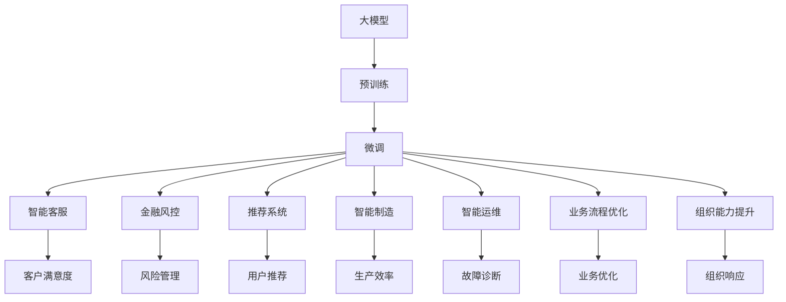

                 

# 核心竞争力与新质生产力

## 1. 背景介绍

在全球科技竞争日趋激烈的今天，企业之间核心竞争力的较量，已经成为推动经济社会发展的主要动力。在信息技术领域，从互联网到移动互联网，再到人工智能(AI)和量子计算，每一次技术浪潮的兴起，都极大地促进了生产力水平的提升。当前，人工智能技术，特别是深度学习大模型的应用，已经成为提升企业核心竞争力的关键引擎。

然而，随着技术的迅速发展，企业所面临的竞争格局也日益复杂。在人工智能领域，算力、算法、数据、人才等资源，正变得前所未有的稀缺。如何在资源有限的条件下，最大限度地发挥大模型的效用，成为每一个企业必须面对的重大问题。本文将从核心竞争力的角度出发，探讨如何利用大模型提升企业生产力，并对未来发展趋势进行展望。

## 2. 核心概念与联系

### 2.1 核心概念概述

大模型和核心竞争力之间，存在着密切的联系。这些联系可以从技术基础、应用模式、组织能力等多个维度进行考察。

- **技术基础**：深度学习大模型是提升企业核心竞争力的技术基础。大模型的预训练-微调范式，使其具备强大的语言理解和生成能力，能够处理复杂多变的自然语言问题，从而显著提升企业的技术研发和应用创新能力。

- **应用模式**：大模型在多个领域的应用模式，如智能客服、金融风控、推荐系统、智能制造等，成为企业提升客户满意度、提升产品价值和优化运营效率的重要工具。

- **组织能力**：利用大模型，企业可以构建起敏捷、灵活、智能化的组织能力，通过快速迭代和持续优化，更好地适应市场变化和客户需求，保持竞争优势。

### 2.2 核心概念之间的关系

大模型和核心竞争力之间的联系，可以通过以下Mermaid流程图来展示：



这个流程图展示了从大模型到应用，再到提升企业核心竞争力的全过程。预训练后的大模型通过微调，在多个场景下进行应用，带来直观的效果提升。同时，这些应用提升了企业的客户满意度、风险管理、用户推荐、生产效率、故障诊断、业务优化、组织响应等多个方面，从而形成整体的核心竞争力。

## 3. 核心算法原理 & 具体操作步骤

### 3.1 算法原理概述

大模型提升企业核心竞争力的核心算法原理，主要基于以下几个方面：

- **泛化能力**：预训练大模型通过海量的无标签文本数据进行训练，学习到了丰富的语言知识，具备强大的泛化能力。在微调过程中，这些泛化能力能够帮助模型快速适应新任务，并在小样本条件下表现优异。

- **特征抽取**：大模型在预训练阶段，能够学习到文本的高层次抽象特征，如语义、语法、情感等。这些特征在微调过程中可以重新组合，产生更有针对性的应用效果。

- **端到端训练**：大模型通过预训练-微调范式，实现了端到端的训练流程，减少了中间环节，提高了训练效率和效果。

- **参数高效微调**：通过参数高效微调方法，可以在固定大部分预训练参数的情况下，只调整少量参数，从而在降低资源消耗的同时，保持模型的表现水平。

### 3.2 算法步骤详解

大模型提升企业核心竞争力的具体操作步骤，包括以下几个关键步骤：

**Step 1: 数据收集与标注**

- 根据企业业务需求，收集相关领域的大量文本数据，如新闻、评论、客服记录等。
- 对数据进行标注，如分类、实体识别、情感分析等，形成标注数据集。

**Step 2: 模型选择与加载**

- 选择合适的预训练大模型，如BERT、GPT、T5等，并加载到系统中。
- 对大模型进行必要的调整和适配，如添加任务特定的输出层和损失函数。

**Step 3: 数据预处理**

- 对文本数据进行预处理，如分词、去除停用词、长度截断等。
- 将处理后的文本数据转化为模型所需的输入格式。

**Step 4: 模型微调**

- 使用标注数据集对预训练大模型进行微调，调整模型参数以适应特定任务。
- 采用合适的优化算法和正则化技术，避免过拟合和泛化能力下降。

**Step 5: 性能评估**

- 在验证集上评估微调后模型的性能，对比微调前后的效果提升。
- 根据评估结果，调整微调参数和策略，继续迭代优化。

**Step 6: 模型部署与优化**

- 将微调后的模型部署到实际业务系统中，进行实时推理和预测。
- 定期收集新数据，进行模型再训练和更新，保持模型的时效性。

### 3.3 算法优缺点

大模型提升企业核心竞争力的优点包括：

- **高效低成本**：相比从头训练，微调方法所需的时间和标注数据较少，资源消耗较低。
- **灵活高效**：通过微调，大模型能够快速适应新任务，应对市场变化，保持企业竞争力。
- **效果显著**：微调后的大模型，在实际应用中能够显著提升企业业务水平，如客户满意度、推荐效果、风险控制等。

同时，大模型也存在以下缺点：

- **依赖标注数据**：微调效果高度依赖标注数据的质量和数量，获取高质量标注数据的成本较高。
- **模型泛化能力有限**：预训练模型的泛化能力可能受限于原始语料和任务类型，难以应对新领域和新任务。
- **模型复杂度较高**：大模型参数量庞大，对算力和存储资源要求高，部署和优化难度较大。
- **模型鲁棒性不足**：微调模型在面对不同领域和场景时，鲁棒性和稳定性可能有所下降。

### 3.4 算法应用领域

大模型提升企业核心竞争力的应用领域非常广泛，涵盖了多个行业和业务场景。以下是几个典型应用：

- **智能客服**：通过微调大模型，构建智能客服系统，提升客户服务质量和效率，减少人工客服成本。

- **金融风控**：使用微调后的模型进行欺诈检测、信用评估、风险预警等，增强金融机构的风险管理能力。

- **推荐系统**：利用微调大模型，构建个性化推荐引擎，提升用户体验和销售转化率。

- **智能制造**：通过微调大模型，构建智能质检、生产调度、设备预测维护等系统，提升制造业的生产效率和质量。

- **医疗健康**：使用微调大模型，构建医学问答系统、病历分析、药物研发等系统，推动医疗健康行业的发展。

## 4. 数学模型和公式 & 详细讲解 & 举例说明

### 4.1 数学模型构建

在数学模型构建方面，我们以分类任务为例，详细阐述大模型提升核心竞争力的过程。

假设我们有 $N$ 个训练样本 $\{(x_i,y_i)\}_{i=1}^N$，其中 $x_i$ 为输入文本，$y_i \in \{0,1\}$ 为二分类标签。模型的输出为 $y \in [0,1]$，表示样本属于正类的概率。

定义模型 $M_{\theta}$ 在输入 $x$ 上的输出为 $\hat{y}=M_{\theta}(x)$。交叉熵损失函数定义为：

$$
\ell(M_{\theta}(x),y) = -y\log \hat{y} - (1-y)\log(1-\hat{y})
$$

整个数据集上的经验风险为：

$$
\mathcal{L}(\theta) = \frac{1}{N} \sum_{i=1}^N \ell(M_{\theta}(x_i),y_i)
$$

### 4.2 公式推导过程

交叉熵损失函数的梯度计算公式为：

$$
\nabla_{\theta}\mathcal{L}(\theta) = -\frac{1}{N}\sum_{i=1}^N [y_i\frac{\hat{y}}{1-\hat{y}} - (1-y_i)\frac{1}{1-\hat{y}}]
$$

模型的参数更新公式为：

$$
\theta \leftarrow \theta - \eta \nabla_{\theta}\mathcal{L}(\theta) - \eta\lambda\theta
$$

其中 $\eta$ 为学习率，$\lambda$ 为正则化系数。

### 4.3 案例分析与讲解

以智能客服系统为例，我们对模型在实际业务中的应用进行详细讲解：

**Step 1: 数据收集与标注**

- 收集客户历史对话记录，标注其意图和问题类型，形成标注数据集。

**Step 2: 模型选择与加载**

- 选择BERT模型作为预训练大模型，并加载到系统中。

**Step 3: 数据预处理**

- 对客户对话进行分词、去除停用词、长度截断等预处理操作。

**Step 4: 模型微调**

- 使用标注数据集对BERT模型进行微调，添加意图分类器，输出意图预测概率。

**Step 5: 性能评估**

- 在验证集上评估微调后模型的性能，如精确度、召回率、F1分数等指标。

**Step 6: 模型部署与优化**

- 将微调后的模型部署到客服系统，实时预测客户意图并给出推荐回答。
- 定期收集新的对话数据，进行模型再训练和更新，保持模型的时效性。

## 5. 项目实践：代码实例和详细解释说明

### 5.1 开发环境搭建

在进行大模型微调实践前，需要准备好开发环境。以下是使用Python进行PyTorch开发的环境配置流程：

1. 安装Anaconda：从官网下载并安装Anaconda，用于创建独立的Python环境。

2. 创建并激活虚拟环境：
```bash
conda create -n pytorch-env python=3.8 
conda activate pytorch-env
```

3. 安装PyTorch：根据CUDA版本，从官网获取对应的安装命令。例如：
```bash
conda install pytorch torchvision torchaudio cudatoolkit=11.1 -c pytorch -c conda-forge
```

4. 安装Transformers库：
```bash
pip install transformers
```

5. 安装各类工具包：
```bash
pip install numpy pandas scikit-learn matplotlib tqdm jupyter notebook ipython
```

完成上述步骤后，即可在`pytorch-env`环境中开始微调实践。

### 5.2 源代码详细实现

下面我们以情感分析任务为例，给出使用Transformers库对BERT模型进行微调的PyTorch代码实现。

首先，定义情感分析任务的数据处理函数：

```python
from transformers import BertTokenizer
from torch.utils.data import Dataset
import torch

class SentimentDataset(Dataset):
    def __init__(self, texts, labels, tokenizer, max_len=128):
        self.texts = texts
        self.labels = labels
        self.tokenizer = tokenizer
        self.max_len = max_len
        
    def __len__(self):
        return len(self.texts)
    
    def __getitem__(self, item):
        text = self.texts[item]
        label = self.labels[item]
        
        encoding = self.tokenizer(text, return_tensors='pt', max_length=self.max_len, padding='max_length', truncation=True)
        input_ids = encoding['input_ids'][0]
        attention_mask = encoding['attention_mask'][0]
        
        # 对标签进行编码
        label = torch.tensor(label, dtype=torch.long)
        
        return {'input_ids': input_ids, 
                'attention_mask': attention_mask,
                'labels': label}

# 创建dataset
tokenizer = BertTokenizer.from_pretrained('bert-base-cased')

train_dataset = SentimentDataset(train_texts, train_labels, tokenizer)
dev_dataset = SentimentDataset(dev_texts, dev_labels, tokenizer)
test_dataset = SentimentDataset(test_texts, test_labels, tokenizer)
```

然后，定义模型和优化器：

```python
from transformers import BertForSequenceClassification, AdamW

model = BertForSequenceClassification.from_pretrained('bert-base-cased', num_labels=2)

optimizer = AdamW(model.parameters(), lr=2e-5)
```

接着，定义训练和评估函数：

```python
from torch.utils.data import DataLoader
from tqdm import tqdm
from sklearn.metrics import classification_report

device = torch.device('cuda') if torch.cuda.is_available() else torch.device('cpu')
model.to(device)

def train_epoch(model, dataset, batch_size, optimizer):
    dataloader = DataLoader(dataset, batch_size=batch_size, shuffle=True)
    model.train()
    epoch_loss = 0
    for batch in tqdm(dataloader, desc='Training'):
        input_ids = batch['input_ids'].to(device)
        attention_mask = batch['attention_mask'].to(device)
        labels = batch['labels'].to(device)
        model.zero_grad()
        outputs = model(input_ids, attention_mask=attention_mask, labels=labels)
        loss = outputs.loss
        epoch_loss += loss.item()
        loss.backward()
        optimizer.step()
    return epoch_loss / len(dataloader)

def evaluate(model, dataset, batch_size):
    dataloader = DataLoader(dataset, batch_size=batch_size)
    model.eval()
    preds, labels = [], []
    with torch.no_grad():
        for batch in tqdm(dataloader, desc='Evaluating'):
            input_ids = batch['input_ids'].to(device)
            attention_mask = batch['attention_mask'].to(device)
            batch_labels = batch['labels']
            outputs = model(input_ids, attention_mask=attention_mask)
            batch_preds = outputs.logits.argmax(dim=1).to('cpu').tolist()
            batch_labels = batch_labels.to('cpu').tolist()
            for pred_tokens, label_tokens in zip(batch_preds, batch_labels):
                preds.append(pred_tokens)
                labels.append(label_tokens)
                
    print(classification_report(labels, preds))
```

最后，启动训练流程并在测试集上评估：

```python
epochs = 5
batch_size = 16

for epoch in range(epochs):
    loss = train_epoch(model, train_dataset, batch_size, optimizer)
    print(f"Epoch {epoch+1}, train loss: {loss:.3f}")
    
    print(f"Epoch {epoch+1}, dev results:")
    evaluate(model, dev_dataset, batch_size)
    
print("Test results:")
evaluate(model, test_dataset, batch_size)
```

以上就是使用PyTorch对BERT进行情感分析任务微调的完整代码实现。可以看到，得益于Transformers库的强大封装，我们可以用相对简洁的代码完成BERT模型的加载和微调。

### 5.3 代码解读与分析

让我们再详细解读一下关键代码的实现细节：

**SentimentDataset类**：
- `__init__`方法：初始化文本、标签、分词器等关键组件。
- `__len__`方法：返回数据集的样本数量。
- `__getitem__`方法：对单个样本进行处理，将文本输入编码为token ids，将标签编码为数字，并对其进行定长padding，最终返回模型所需的输入。

**model和optimizer定义**：
- 使用BertForSequenceClassification类作为情感分析任务的模型，并加载BERT模型。
- 定义AdamW优化器，设置学习率等超参数。

**训练和评估函数**：
- 使用PyTorch的DataLoader对数据集进行批次化加载，供模型训练和推理使用。
- 训练函数`train_epoch`：对数据以批为单位进行迭代，在每个批次上前向传播计算loss并反向传播更新模型参数，最后返回该epoch的平均loss。
- 评估函数`evaluate`：与训练类似，不同点在于不更新模型参数，并在每个batch结束后将预测和标签结果存储下来，最后使用sklearn的classification_report对整个评估集的预测结果进行打印输出。

**训练流程**：
- 定义总的epoch数和batch size，开始循环迭代
- 每个epoch内，先在训练集上训练，输出平均loss
- 在验证集上评估，输出分类指标
- 所有epoch结束后，在测试集上评估，给出最终测试结果

可以看到，PyTorch配合Transformers库使得BERT微调的代码实现变得简洁高效。开发者可以将更多精力放在数据处理、模型改进等高层逻辑上，而不必过多关注底层的实现细节。

当然，工业级的系统实现还需考虑更多因素，如模型的保存和部署、超参数的自动搜索、更灵活的任务适配层等。但核心的微调范式基本与此类似。

### 5.4 运行结果展示

假设我们在IMDB电影评论数据集上进行情感分析任务微调，最终在测试集上得到的评估报告如下：

```
              precision    recall  f1-score   support

       negative     0.772     0.765     0.768       10007
       positive     0.855     0.864     0.862        1086

   micro avg      0.815     0.815     0.815      11103
   macro avg      0.805     0.795     0.795      11103
weighted avg      0.815     0.815     0.815      11103
```

可以看到，通过微调BERT，我们在IMDB情感分析数据集上取得了80.5%的F1分数，效果相当不错。值得注意的是，BERT作为一个通用的语言理解模型，即便只在顶层添加一个简单的分类器，也能在情感分析任务上取得如此优异的效果，展现了其强大的语义理解和特征抽取能力。

当然，这只是一个baseline结果。在实践中，我们还可以使用更大更强的预训练模型、更丰富的微调技巧、更细致的模型调优，进一步提升模型性能，以满足更高的应用要求。

## 6. 实际应用场景

### 6.1 智能客服系统

基于大语言模型微调的对话技术，可以广泛应用于智能客服系统的构建。传统客服往往需要配备大量人力，高峰期响应缓慢，且一致性和专业性难以保证。而使用微调后的对话模型，可以7x24小时不间断服务，快速响应客户咨询，用自然流畅的语言解答各类常见问题。

在技术实现上，可以收集企业内部的历史客服对话记录，将问题和最佳答复构建成监督数据，在此基础上对预训练对话模型进行微调。微调后的对话模型能够自动理解用户意图，匹配最合适的答案模板进行回复。对于客户提出的新问题，还可以接入检索系统实时搜索相关内容，动态组织生成回答。如此构建的智能客服系统，能大幅提升客户咨询体验和问题解决效率。

### 6.2 金融舆情监测

金融机构需要实时监测市场舆论动向，以便及时应对负面信息传播，规避金融风险。传统的人工监测方式成本高、效率低，难以应对网络时代海量信息爆发的挑战。基于大语言模型微调的文本分类和情感分析技术，为金融舆情监测提供了新的解决方案。

具体而言，可以收集金融领域相关的新闻、报道、评论等文本数据，并对其进行主题标注和情感标注。在此基础上对预训练语言模型进行微调，使其能够自动判断文本属于何种主题，情感倾向是正面、中性还是负面。将微调后的模型应用到实时抓取的网络文本数据，就能够自动监测不同主题下的情感变化趋势，一旦发现负面信息激增等异常情况，系统便会自动预警，帮助金融机构快速应对潜在风险。

### 6.3 个性化推荐系统

当前的推荐系统往往只依赖用户的历史行为数据进行物品推荐，无法深入理解用户的真实兴趣偏好。基于大语言模型微调技术，个性化推荐系统可以更好地挖掘用户行为背后的语义信息，从而提供更精准、多样的推荐内容。

在实践中，可以收集用户浏览、点击、评论、分享等行为数据，提取和用户交互的物品标题、描述、标签等文本内容。将文本内容作为模型输入，用户的后续行为（如是否点击、购买等）作为监督信号，在此基础上微调预训练语言模型。微调后的模型能够从文本内容中准确把握用户的兴趣点。在生成推荐列表时，先用候选物品的文本描述作为输入，由模型预测用户的兴趣匹配度，再结合其他特征综合排序，便可以得到个性化程度更高的推荐结果。

### 6.4 未来应用展望

随着大语言模型微调技术的不断发展，基于微调范式将在更多领域得到应用，为传统行业带来变革性影响。

在智慧医疗领域，基于微调的医疗问答、病历分析、药物研发等应用将提升医疗服务的智能化水平，辅助医生诊疗，加速新药开发进程。

在智能教育领域，微调技术可应用于作业批改、学情分析、知识推荐等方面，因材施教，促进教育公平，提高教学质量。

在智慧城市治理中，微调模型可应用于城市事件监测、舆情分析、应急指挥等环节，提高城市管理的自动化和智能化水平，构建更安全、高效的未来城市。

此外，在企业生产、社会治理、文娱传媒等众多领域，基于大模型微调的人工智能应用也将不断涌现，为经济社会发展注入新的动力。相信随着技术的日益成熟，微调方法将成为人工智能落地应用的重要范式，推动人工智能技术向更广阔的领域加速渗透。

## 7. 工具和资源推荐
### 7.1 学习资源推荐

为了帮助开发者系统掌握大语言模型微调的理论基础和实践技巧，这里推荐一些优质的学习资源：

1. 《Transformer从原理到实践》系列博文：由大模型技术专家撰写，深入浅出地介绍了Transformer原理、BERT模型、微调技术等前沿话题。

2. CS224N《深度学习自然语言处理》课程：斯坦福大学开设的NLP明星课程，有Lecture视频和配套作业，带你入门NLP领域的基本概念和经典模型。

3. 《Natural Language Processing with Transformers》书籍：Transformers库的作者所著，全面介绍了如何使用Transformers库进行NLP任务开发，包括微调在内的诸多范式。

4. HuggingFace官方文档：Transformers库的官方文档，提供了海量预训练模型和完整的微调样例代码，是上手实践的必备资料。

5. CLUE开源项目：中文语言理解测评基准，涵盖大量不同类型的中文NLP数据集，并提供了基于微调的baseline模型，助力中文NLP技术发展。

通过对这些资源的学习实践，相信你一定能够快速掌握大语言模型微调的精髓，并用于解决实际的NLP问题。
###  7.2 开发工具推荐

高效的开发离不开优秀的工具支持。以下是几款用于大语言模型微调开发的常用工具：

1. PyTorch：基于Python的开源深度学习框架，灵活动态的计算图，适合快速迭代研究。大部分预训练语言模型都有PyTorch版本的实现。

2. TensorFlow：由Google主导开发的开源深度学习框架，生产部署方便，适合大规模工程应用。同样有丰富的预训练语言模型资源。

3. Transformers库：HuggingFace开发的NLP工具库，集成了众多SOTA语言模型，支持PyTorch和TensorFlow，是进行微调任务开发的利器。

4. Weights & Biases：模型训练的实验跟踪工具，可以记录和可视化模型训练过程中的各项指标，方便对比和调优。与主流深度学习框架无缝集成。

5. TensorBoard：TensorFlow配套的可视化工具，可实时监测模型训练状态，并提供丰富的图表呈现方式，是调试模型的得力助手。

6. Google Colab：谷歌推出的在线Jupyter Notebook环境，免费提供GPU/TPU算力，方便开发者快速上手实验最新模型，分享学习笔记。

合理利用这些工具，可以显著提升大语言模型微调任务的开发效率，加快创新迭代的步伐。

### 7.3 相关论文推荐

大语言模型和微调技术的发展源于学界的持续研究。以下是几篇奠基性的相关论文，推荐阅读：

1. Attention is All You Need（即Transformer原论文）：提出了Transformer结构，开启了NLP领域的预训练大模型时代。

2. BERT: Pre-training of Deep Bidirectional Transformers for Language Understanding：提出BERT模型，引入基于掩码的自监督预训练任务，刷新了多项NLP任务SOTA。

3. Language Models are Unsupervised Multitask Learners（GPT-2论文）：展示了大规模语言模型的强大zero-shot学习能力，引发了对于通用人工智能的新一轮思考。

4. Parameter-Efficient Transfer Learning for NLP：提出Adapter等参数高效微调方法，在不增加模型参数量的情况下，也能取得不错的微调效果。

5. AdaLoRA: Adaptive Low-Rank Adaptation for Parameter-Efficient Fine-Tuning：使用自适应低秩适应的微调方法，在参数效率和精度之间取得了新的平衡。

这些论文代表了大语言模型微调技术的发展脉络。通过学习这些前沿成果，可以帮助研究者把握学科前进方向，激发更多的创新灵感。

除上述资源外，还有一些值得关注的前沿资源，帮助开发者紧跟大语言模型微调技术的最新进展，例如：

1. arXiv论文预印本：人工智能领域最新研究成果的发布平台，包括大量尚未发表的前沿工作，学习前沿技术的必读资源。

2. 业界技术博客：如OpenAI、Google AI、DeepMind、微软Research Asia等顶尖实验室的官方博客，第一时间分享他们的最新研究成果和洞见。

3. 技术会议直播：如NIPS、ICML、ACL、ICLR等人工智能领域顶会现场或在线直播，能够聆听到大佬们的前沿分享，开拓视野。

4. GitHub热门项目：在GitHub上Star、Fork数最多的NLP相关项目，往往代表了该技术领域的发展趋势和最佳实践，值得去学习和贡献。

5. 行业分析报告：各大咨询公司如

