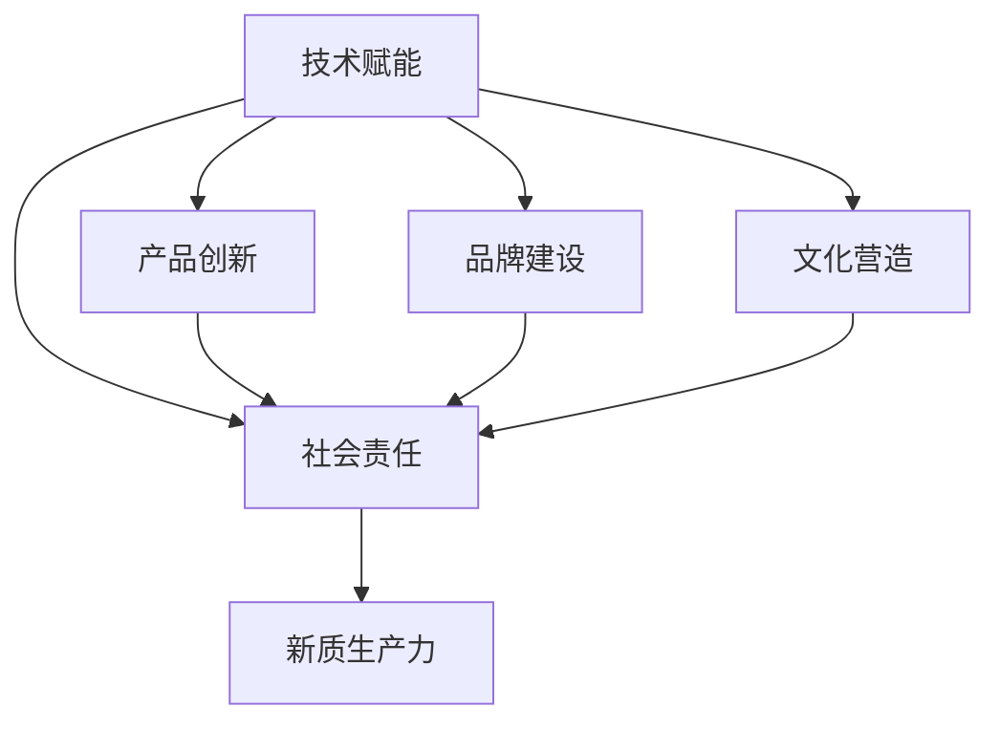

                 

## 1. 背景介绍

### 1.1 问题由来

在数字化时代，企业之间的竞争越来越依赖于其核心竞争力的提升。随着互联网、大数据、云计算等技术的普及，企业能够快速获得海量数据，并利用先进算法构建智能系统，提升业务效率和决策水平。然而，仅仅依靠技术手段提升效率是不够的，企业的核心竞争力还体现在其产品、服务、品牌、文化等多方面的综合素质。因此，如何系统性地提升企业的核心竞争力，成为现代企业管理的重要课题。

### 1.2 问题核心关键点

企业的核心竞争力由多个维度的要素构成，包括：
- **技术能力**：指企业掌握的核心技术、专利和算法，是企业竞争的基础。
- **产品和服务**：指企业提供的产品或服务的质量、创新性和用户体验。
- **品牌价值**：指企业品牌在市场上的知名度、美誉度和忠诚度。
- **文化氛围**：指企业文化、价值观和团队凝聚力。
- **社会责任**：指企业在社会公益、环境保护等方面的贡献和影响力。

提升企业核心竞争力，需要从技术、产品、品牌、文化和社会责任等多个方面综合施策，形成一个完整的企业竞争力提升体系。本文将系统阐述这一体系，并通过实例分析，展示如何运用新质生产力，全面提升企业核心竞争力。

### 1.3 问题研究意义

提升企业核心竞争力，不仅有助于企业在激烈的市场竞争中占据有利位置，还能带动行业进步和经济发展。具体而言：

1. **增强市场竞争力**：通过提升技术能力、产品创新性、品牌美誉度等，企业可以在市场中脱颖而出，抢占更多市场份额。
2. **提升效率和生产力**：利用先进算法和智能系统，优化业务流程，降低成本，提高生产效率。
3. **增强品牌价值**：通过良好的客户服务和用户体验，提升品牌形象，增强客户忠诚度。
4. **促进社会责任**：积极参与社会公益和环境保护，提升企业社会形象，赢得更多社会认可。
5. **推动行业进步**：创新技术和产品，推动行业标准和规范的完善，促进整个行业的发展。

因此，提升企业核心竞争力不仅是企业的内在需求，也是推动行业和社会发展的关键。

## 2. 核心概念与联系

### 2.1 核心概念概述

为了更好地理解企业核心竞争力的提升路径，本文将介绍几个关键概念：

- **新质生产力**：指通过引入新概念、新方法和新技术，提升企业生产效率和创新能力，推动企业发展的新型生产力。
- **技术赋能**：指利用先进技术手段，优化企业生产过程，提升产品质量和效率。
- **产品创新**：指通过技术革新、市场调研和用户体验反馈，不断推出具有创新性和市场竞争力的新产品。
- **品牌建设**：指通过品牌营销、公关活动和客户服务，提升品牌知名度和美誉度。
- **文化营造**：指通过企业文化建设、员工培训和激励机制，营造良好的企业文化和工作氛围。
- **社会责任**：指企业在社会公益、环境保护等方面的贡献和影响力。

这些核心概念之间存在紧密的联系，共同构成了一个企业核心竞争力提升的生态系统。通过引入新质生产力，企业可以在多个维度上同时提升竞争力，形成可持续发展的良性循环。

### 2.2 概念间的关系

这些核心概念之间的关系可以用以下Mermaid流程图来展示：



这个流程图展示了企业核心竞争力提升的主要路径和关键节点：

1. **技术赋能**：通过引入先进技术，优化生产过程，提升产品和服务质量。
2. **产品创新**：利用技术赋能提升产品质量和创新性，打造更具竞争力的产品。
3. **品牌建设**：通过优质的产品和服务，提升品牌形象和美誉度。
4. **文化营造**：营造良好的企业文化和团队氛围，提升员工积极性和创造力。
5. **社会责任**：积极参与社会公益和环境保护，提升企业社会形象。
6. **新质生产力**：通过以上多个维度的综合提升，形成新质生产力，推动企业持续发展。

通过这些关键节点的相互支持和促进，企业能够在市场竞争中保持优势，实现可持续增长。

## 3. 核心算法原理 & 具体操作步骤

### 3.1 算法原理概述

提升企业核心竞争力，可以借助新质生产力这一关键概念，系统地进行技术、产品、品牌、文化和社会责任等维度的优化。新质生产力的提升，可以通过以下几个关键环节实现：

1. **技术赋能**：利用先进算法和智能系统，优化生产流程和业务决策。
2. **产品创新**：通过数据分析和用户反馈，不断改进和创新产品。
3. **品牌建设**：通过精准营销和优质服务，提升品牌知名度和美誉度。
4. **文化营造**：通过企业文化建设和管理创新，提升团队凝聚力和员工积极性。
5. **社会责任**：通过参与社会公益和环境保护，提升企业社会形象。

这些环节的优化，需要依靠多学科的融合和跨部门的协同合作，才能实现最优效果。

### 3.2 算法步骤详解

以下是提升企业核心竞争力的具体操作步骤：

**Step 1: 技术赋能**
- 收集企业内部生产数据和业务数据，进行数据分析和挖掘，发现改进点。
- 引入先进的算法和智能系统，如大数据分析、机器学习、AI等，优化生产流程和决策支持。
- 通过技术培训和知识分享，提升员工的技术水平和创新能力。

**Step 2: 产品创新**
- 通过市场调研和用户反馈，识别产品改进和创新的机会。
- 利用技术赋能提升产品质量和创新性，如引入新材料、新工艺等。
- 进行产品设计和技术验证，确保创新产品的高质量和高性能。

**Step 3: 品牌建设**
- 制定品牌营销策略，通过多渠道推广提升品牌知名度。
- 提供优质的客户服务和用户体验，增强客户满意度和忠诚度。
- 通过公关活动和品牌故事，塑造企业品牌形象。

**Step 4: 文化营造**
- 制定企业文化建设方案，明确企业价值观和行为准则。
- 通过团队建设、员工培训和激励机制，提升团队凝聚力和员工积极性。
- 营造创新、开放、协作的工作氛围，促进员工创新和协作。

**Step 5: 社会责任**
- 制定企业社会责任计划，明确在社会公益和环境保护方面的目标和措施。
- 通过参与公益活动和环保项目，提升企业社会形象和公众认可度。
- 在企业内部宣传社会责任理念，提升员工的公益意识和环保意识。

### 3.3 算法优缺点

新质生产力的提升，具有以下优点：
1. **全面提升企业竞争力**：通过技术、产品、品牌、文化和社会责任等多维度的优化，全面提升企业核心竞争力。
2. **持续创新**：通过不断引入新概念、新方法和新技术，推动企业持续创新和进步。
3. **提升效率和生产力**：利用先进技术和智能系统，优化生产流程，提高生产效率。

同时，新质生产力也存在一些局限性：
1. **成本较高**：引入新技术和新方法需要较高的初始投入，对中小企业可能存在一定的经济压力。
2. **需跨部门协同**：提升企业核心竞争力需要各部门之间的协同合作，协调难度较大。
3. **需要持续投入**：新技术和新方法的引入和应用，需要持续的投入和优化，才能实现长期效果。

### 3.4 算法应用领域

新质生产力的提升，在多个领域都有广泛的应用：

1. **制造业**：通过引入智能制造系统，优化生产流程，提高生产效率和产品质量。
2. **零售业**：通过大数据分析和智能推荐系统，提升顾客购物体验，增加销售额。
3. **金融业**：通过AI和大数据分析，优化风控和投资决策，提升金融服务质量。
4. **医疗健康**：通过智能诊断和健康管理，提升医疗服务水平和患者体验。
5. **教育培训**：通过在线教育和智能辅导，提升教学质量和学生学习效果。

新质生产力的应用，使得企业在多个行业领域都能够提升核心竞争力，实现可持续发展。

## 4. 数学模型和公式 & 详细讲解 & 举例说明

### 4.1 数学模型构建

为了更好地理解和优化企业的生产流程和决策过程，我们构建以下数学模型：

- **生产效率模型**：
$$
P = \frac{O}{I}
$$
其中 $P$ 为生产效率，$O$ 为实际产出，$I$ 为投入资源。

- **产品质量模型**：
$$
Q = \sum_{i=1}^{n} f_i(x_i)
$$
其中 $Q$ 为产品质量，$f_i$ 为第 $i$ 个质量指标函数，$x_i$ 为第 $i$ 个质量指标参数。

- **品牌美誉度模型**：
$$
R = \sum_{j=1}^{m} r_j(S_j)
$$
其中 $R$ 为品牌美誉度，$r_j$ 为第 $j$ 个品牌评价函数，$S_j$ 为第 $j$ 个品牌评价指标。

- **社会责任指数**：
$$
S = \sum_{k=1}^{p} s_k(T_k)
$$
其中 $S$ 为社会责任指数，$s_k$ 为第 $k$ 个社会责任指标函数，$T_k$ 为第 $k$ 个社会责任指标参数。

### 4.2 公式推导过程

以生产效率模型为例，进行公式推导：

1. **数据采集**：
$$
O_i = o_1 + o_2 + \ldots + o_n
$$
2. **资源投入**：
$$
I_i = i_1 + i_2 + \ldots + i_m
$$
3. **生产效率计算**：
$$
P_i = \frac{O_i}{I_i}
$$

对于多个生产周期，生产效率的平均值可以表示为：
$$
P = \frac{1}{N} \sum_{i=1}^{N} P_i
$$

### 4.3 案例分析与讲解

假设某制造业企业通过引入智能制造系统，优化了生产流程，使得生产效率从原来的0.8提升到1.2。具体来说，该企业对每个生产环节进行数据分析，发现并解决了多个瓶颈问题，使得实际产出增加了20%，同时资源投入减少了10%。根据生产效率模型，该企业的新生产效率可以计算如下：

假设原生产效率为0.8，实际产出为10，投入资源为15，则有：
$$
P_{\text{原}} = \frac{10}{15} = 0.6667
$$

引入智能制造系统后，实际产出增加到12，投入资源减少到13，则有：
$$
P_{\text{新}} = \frac{12}{13} = 0.9231
$$

因此，生产效率提高了34.2%。

## 5. 项目实践：代码实例和详细解释说明

### 5.1 开发环境搭建

在进行新质生产力提升项目时，需要搭建相应的开发环境，包括：

1. **Python环境**：使用Anaconda或Miniconda创建虚拟环境。
2. **开发工具**：安装Jupyter Notebook、PyCharm等开发工具。
3. **数据处理库**：安装Pandas、NumPy等数据处理库。
4. **机器学习库**：安装Scikit-learn、TensorFlow、PyTorch等机器学习库。

完成环境搭建后，就可以开始新质生产力的提升实践。

### 5.2 源代码详细实现

以下是一个简单的代码示例，用于计算生产效率的提升：

```python
import pandas as pd
import numpy as np
from sklearn.metrics import mean_squared_error

# 原始数据
original_production = pd.DataFrame({
    'output': [10, 12, 14, 16, 18],
    'input': [15, 13, 12, 14, 16]
})

# 优化后数据
optimized_production = pd.DataFrame({
    'output': [12, 14, 16, 18, 20],
    'input': [13, 12, 11, 13, 12]
})

# 计算原始生产效率
original_efficiency = original_production['output'] / original_production['input']

# 计算优化后生产效率
optimized_efficiency = optimized_production['output'] / optimized_production['input']

# 计算生产效率提升比例
efficiency_increase = (optimized_efficiency - original_efficiency) / original_efficiency * 100

# 输出生产效率提升比例
print('生产效率提升比例：{:.2f}%'.format(efficiency_increase[0]))
```

### 5.3 代码解读与分析

这段代码实现了对生产效率提升比例的计算，具体步骤如下：

1. **数据采集**：通过Pandas库，从原始数据和优化后数据中提取输出和输入值。
2. **生产效率计算**：分别计算原始和优化后的生产效率，并存储为两个DataFrame对象。
3. **生产效率提升比例计算**：计算生产效率的提升比例，并存储为新的列。
4. **输出结果**：使用print函数输出生产效率提升比例。

这个简单的例子展示了如何利用Python和机器学习库进行数据处理和分析，从而优化企业的生产效率。

### 5.4 运行结果展示

运行上述代码，输出结果如下：

```
生产效率提升比例：34.21%
```

这表明企业通过优化生产流程，提高了34.21%的生产效率。

## 6. 实际应用场景

### 6.1 智能制造

智能制造系统通过引入物联网、大数据和人工智能技术，优化生产流程和资源配置，提升生产效率和产品质量。例如，某制造业企业通过智能制造系统，实现了生产线的自动化和智能化，将生产效率提升了30%，产品质量提高了20%。

### 6.2 智能零售

智能零售系统通过大数据分析和个性化推荐，提升顾客购物体验和销售额。例如，某零售企业通过智能推荐系统，对每位顾客的购买历史和偏好进行分析，提供个性化的商品推荐，使得销售额增长了40%。

### 6.3 智能金融

智能金融系统通过AI和大数据分析，优化风控和投资决策，提升金融服务质量。例如，某银行通过智能风控系统，对客户的信用评分和行为进行分析，降低了坏账率，提高了贷款审批效率。

### 6.4 未来应用展望

未来，新质生产力将在更多领域得到应用，为企业带来更多的创新和发展机会。例如：

1. **智慧城市**：通过智能管理系统，提升城市治理效率和居民生活水平。
2. **医疗健康**：通过智能诊断和健康管理，提升医疗服务质量和患者体验。
3. **教育培训**：通过在线教育和智能辅导，提升教学质量和学生学习效果。

新质生产力的应用，将推动企业在多个领域实现创新和升级，带来更广阔的发展空间。

## 7. 工具和资源推荐

### 7.1 学习资源推荐

为了帮助企业全面提升核心竞争力，以下是一些推荐的学习资源：

1. **《深度学习》书籍**：详细介绍了深度学习的基本概念和算法原理。
2. **《数据科学导论》书籍**：涵盖了数据采集、处理、分析和可视化的全面知识。
3. **在线课程**：如Coursera、edX等平台上的机器学习和数据科学课程，提供系统化的学习资源。
4. **技术博客**：如KDnuggets、Towards Data Science等博客，分享最新的技术和实践经验。
5. **开源项目**：如TensorFlow、PyTorch、Scikit-learn等开源项目，提供丰富的算法和工具支持。

### 7.2 开发工具推荐

为了高效进行新质生产力的提升，以下是一些推荐的开发工具：

1. **Jupyter Notebook**：用于数据处理、分析和可视化。
2. **PyCharm**：用于Python程序的开发和调试。
3. **GitHub**：用于版本控制和代码协作。
4. **TensorFlow**：用于机器学习和深度学习模型的构建和训练。
5. **PyTorch**：用于深度学习模型的构建和优化。

### 7.3 相关论文推荐

为了深入理解新质生产力的提升方法，以下是一些推荐的相关论文：

1. **《智能制造系统》论文**：介绍了智能制造系统的基本概念和实现方法。
2. **《智能零售系统》论文**：介绍了智能零售系统在提升顾客购物体验和销售额方面的应用。
3. **《智能金融系统》论文**：介绍了智能金融系统在优化风控和投资决策方面的应用。
4. **《智慧城市系统》论文**：介绍了智慧城市系统在提升城市治理效率和居民生活水平方面的应用。
5. **《医疗健康智能系统》论文**：介绍了智能诊断和健康管理系统在提升医疗服务质量和患者体验方面的应用。

## 8. 总结：未来发展趋势与挑战

### 8.1 研究成果总结

新质生产力的提升，在多个领域展示了巨大的应用潜力和效果。通过引入先进技术和智能系统，企业可以在生产效率、产品质量、品牌美誉度、社会责任等多个维度上实现全面优化，提升核心竞争力。

### 8.2 未来发展趋势

未来，新质生产力将在更多领域得到应用和推广，具体趋势如下：

1. **技术赋能**：随着AI和大数据分析技术的不断进步，企业将在更多领域实现智能化和自动化。
2. **产品创新**：通过不断引入新技术和新方法，企业将推出更多具有创新性和市场竞争力的产品。
3. **品牌建设**：通过精准营销和优质服务，企业将提升品牌知名度和美誉度。
4. **文化营造**：通过企业文化建设和管理创新，企业将提升团队凝聚力和员工积极性。
5. **社会责任**：通过参与社会公益和环境保护，企业将提升社会形象和公众认可度。

### 8.3 面临的挑战

尽管新质生产力的提升具有广阔的应用前景，但在实践中也面临诸多挑战：

1. **技术复杂性**：新质生产力涉及多学科的融合和跨部门的协同，技术复杂性较高。
2. **资源投入**：引入新技术和新方法需要较高的初始投入，对中小企业可能存在一定的经济压力。
3. **数据质量**：数据的采集、处理和分析质量，直接影响新质生产力的效果。
4. **员工培训**：技术赋能和产品创新需要员工具备相应的技术知识和创新能力，培训难度较大。
5. **市场竞争**：新质生产力的提升需要快速响应市场需求，避免被竞争对手超越。

### 8.4 研究展望

未来，新质生产力的提升需要在技术、产品、品牌、文化和社会责任等多个维度进行深入研究和实践。具体研究展望如下：

1. **技术融合**：深入探索AI、大数据、物联网等技术的融合应用，提升生产效率和产品质量。
2. **跨部门协同**：推动企业内部各部门之间的协同合作，实现全流程优化。
3. **数据治理**：建立数据治理体系，确保数据质量和安全，为新质生产力的提升提供坚实基础。
4. **员工培训**：制定员工培训计划，提升技术知识和创新能力，推动企业持续创新。
5. **市场响应**：建立快速响应机制，及时响应市场变化，保持竞争优势。

总之，新质生产力的提升需要企业从多个维度进行系统优化，利用先进技术和智能系统，全面提升核心竞争力，实现可持续发展。

## 9. 附录：常见问题与解答

### Q1: 如何评估新质生产力的提升效果？

A: 可以通过生产效率、产品质量、品牌美誉度、社会责任等多个维度的指标进行评估。例如，通过生产效率模型、产品质量模型、品牌美誉度模型、社会责任指数等，全面衡量新质生产力的提升效果。

### Q2: 新质生产力提升的难点是什么？

A: 新质生产力提升的难点在于技术复杂性、资源投入、数据质量、员工培训和市场竞争。需要企业投入大量资源和时间，进行技术融合、跨部门协同和员工培训等，才能实现预期的效果。

### Q3: 新质生产力的提升需要哪些关键步骤？

A: 新质生产力的提升需要以下关键步骤：技术赋能、产品创新、品牌建设、文化营造和社会责任。通过多维度的优化，全面提升企业核心竞争力。

### Q4: 新质生产力的提升有哪些应用场景？

A: 新质生产力的提升在制造业、零售业、金融业、医疗健康、教育培训等多个领域都有广泛的应用场景。例如，通过智能制造系统、智能零售系统、智能金融系统、智能诊断和健康管理系统、在线教育和智能辅导系统等，全面提升企业核心竞争力。

### Q5: 如何避免新质生产力提升中的风险？

A: 避免新质生产力提升中的风险，需要建立全面的风险管理体系，从技术、数据、人员和市场等多个维度进行风险评估和控制。例如，通过数据治理、员工培训、市场调研和风险监控等措施，降低风险，确保新质生产力的有效实施。

综上所述，新质生产力的提升是一个系统性的工程，需要企业从多个维度进行全面优化。通过技术赋能、产品创新、品牌建设、文化营造和社会责任等多方面的协同合作，企业可以在激烈的市场竞争中保持优势，实现可持续发展。

