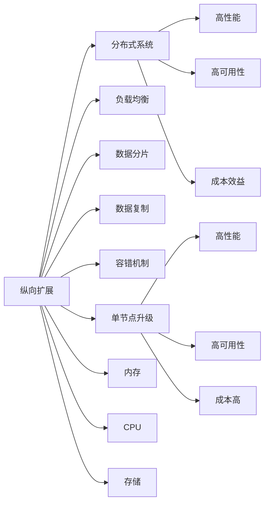
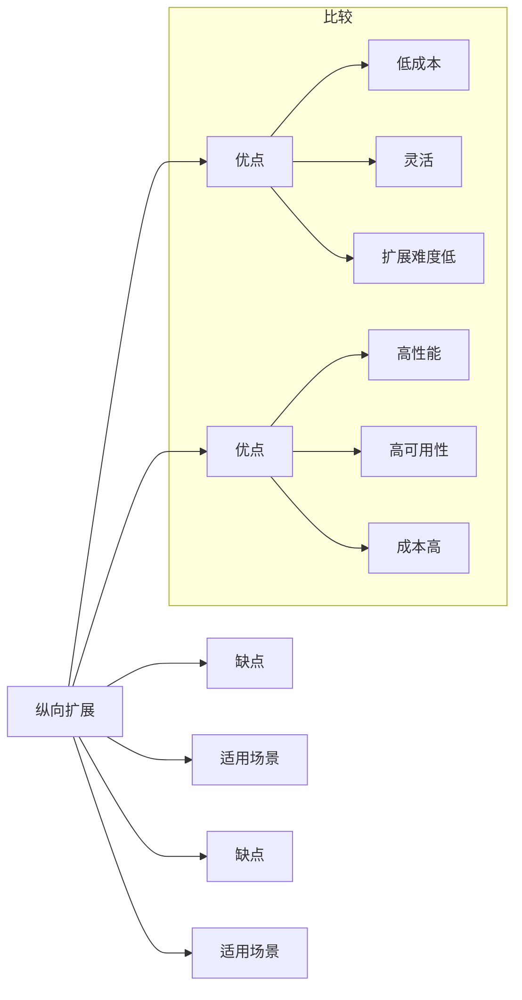
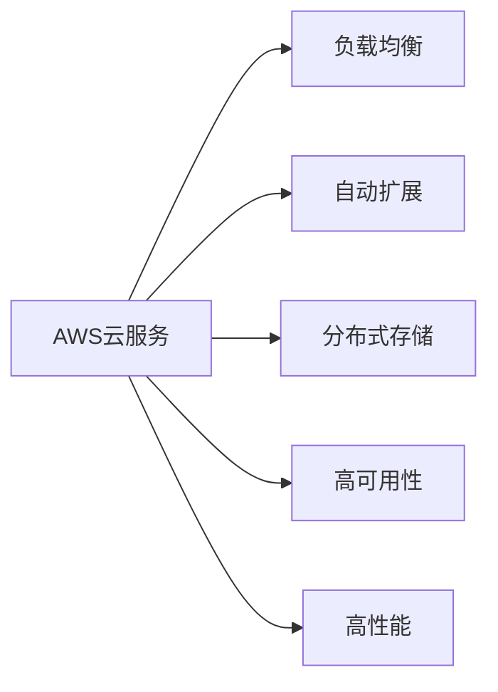
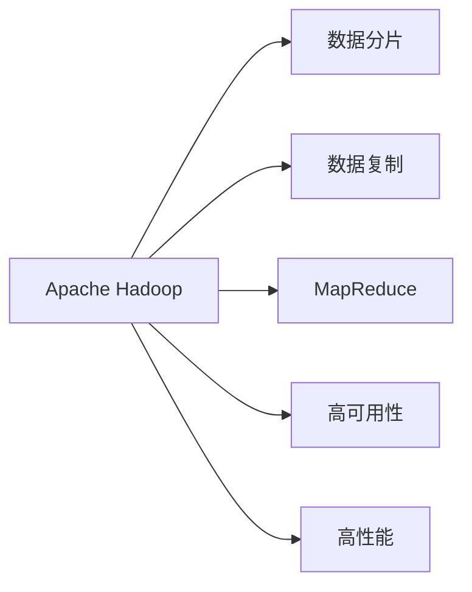

                 

# 横向扩展与纵向扩展的实际应用

> 关键词：横向扩展，纵向扩展，负载均衡，数据分布，扩展性，系统优化

## 1. 背景介绍

### 1.1 问题由来
在现代计算机系统中，无论是Web应用、数据库、云服务等，都面临着扩展性的挑战。随着业务需求的增长，系统需要处理的数据量和并发访问量不断增加，而硬件资源的扩展却受到成本和物理空间的限制。因此，系统必须在不显著增加硬件成本和空间消耗的情况下，实现性能的提升和容量的扩大。横向扩展与纵向扩展是两种常用的扩展策略，它们在理论上和技术实现上都存在不同的优势和劣势。本文将深入探讨这两种扩展策略的原理、优缺点以及实际应用场景，帮助读者理解如何选择和使用扩展策略，以优化系统的性能和可扩展性。

### 1.2 问题核心关键点
本文将从以下几个方面探讨横向扩展与纵向扩展的实际应用：
- **核心概念**：详细解释横向扩展与纵向扩展的定义、原理和应用场景。
- **算法原理**：分析横向扩展与纵向扩展的数学模型和计算公式。
- **操作步骤**：给出横向扩展与纵向扩展的具体操作步骤和代码实现。
- **实际案例**：通过具体案例展示横向扩展与纵向扩展在实际应用中的效果和挑战。
- **工具和资源**：推荐学习资源、开发工具和相关论文，以帮助读者深入了解和掌握这两种扩展策略。
- **未来展望**：总结横向扩展与纵向扩展的发展趋势和面临的挑战，展望未来的研究方向和技术突破。

## 2. 核心概念与联系

### 2.1 核心概念概述

**横向扩展**（Horizontal Scaling）指的是通过增加更多相同的计算节点来提升系统的性能和容量。例如，在分布式数据库中，增加更多的数据库节点可以提升系统的读/写吞吐量。横向扩展的特点是硬件成本相对较低，可以灵活地增加或减少计算节点。

**纵向扩展**（Vertical Scaling）指的是通过升级单个节点的硬件配置来提升系统的性能和容量。例如，在单台服务器上增加更多的内存、CPU和存储设备。纵向扩展的特点是单个节点性能提升明显，但硬件成本较高，扩展受限于物理空间。

横向扩展与纵向扩展的联系在于它们都是用来提升系统性能和容量的手段，但实现方式不同，各有优劣。下面通过Mermaid流程图来展示这两种扩展策略的核心概念和应用场景。



### 2.2 概念间的关系

横向扩展和纵向扩展的关系可以用一个简单的对比图表来表示：



这个图表清晰地展示了横向扩展和纵向扩展的优缺点和适用场景。横向扩展适合需要高并发、低成本的场景，而纵向扩展适合需要高性能、高可靠性的场景。两者各有优势，应根据实际情况选择适合的扩展策略。

## 3. 核心算法原理 & 具体操作步骤

### 3.1 算法原理概述

横向扩展与纵向扩展的算法原理可以简述如下：

- **横向扩展**：增加计算节点，通过负载均衡、数据分片和数据复制等技术，提升系统的读/写吞吐量和处理能力。
- **纵向扩展**：升级单个节点的硬件配置，通过增加内存、CPU和存储设备，提升单个节点的计算能力和存储容量。

这两种扩展策略的计算公式如下：

- 对于横向扩展，系统的总计算能力 $C$ 等于各个计算节点的计算能力之和：
  $$
  C = nC_0
  $$
  其中 $n$ 为计算节点的数量，$C_0$ 为单个计算节点的计算能力。

- 对于纵向扩展，系统的总计算能力 $C$ 等于单个节点的计算能力乘以扩展后的节点数：
  $$
  C = nC_0
  $$
  其中 $n$ 为扩展后的节点数，$C_0$ 为原始计算能力。

### 3.2 算法步骤详解

**横向扩展的具体操作步骤**：

1. **设计系统架构**：根据业务需求，设计系统的架构，选择合适的负载均衡、数据分片和数据复制技术。
2. **添加计算节点**：在现有系统的基础上，增加计算节点，确保各个节点间的通信和数据同步。
3. **配置负载均衡**：根据业务负载，动态调整各个计算节点的负载，确保系统的均衡性和高可用性。
4. **数据分片与复制**：将数据进行分片处理，并将分片数据复制到多个计算节点上，确保数据的高可用性和分布式处理能力。
5. **测试与优化**：对系统进行全面测试，优化性能，确保系统的稳定性和可靠性。

**纵向扩展的具体操作步骤**：

1. **评估当前硬件配置**：评估当前硬件的性能瓶颈，确定需要升级的硬件配置。
2. **升级硬件配置**：根据评估结果，升级单个节点的内存、CPU和存储设备，提升单个节点的计算能力和存储容量。
3. **测试与优化**：对升级后的系统进行全面测试，优化性能，确保系统的稳定性和可靠性。

### 3.3 算法优缺点

横向扩展与纵向扩展各有优缺点，具体如下：

**横向扩展的优点**：
- 成本较低，可以根据业务需求灵活调整计算节点数量。
- 易于扩展，可以快速应对业务增长带来的需求变化。
- 系统负载均衡，可以提升系统的读/写吞吐量和处理能力。

**横向扩展的缺点**：
- 系统复杂度较高，需要处理节点间的通信和数据同步问题。
- 数据一致性和完整性较难保证，需要额外的技术手段进行优化。

**纵向扩展的优点**：
- 单个节点性能提升明显，可以提升系统的计算能力和存储容量。
- 系统结构简单，易于管理和维护。

**纵向扩展的缺点**：
- 硬件成本较高，升级硬件需要投入大量资金和时间。
- 扩展受限于物理空间和硬件性能，无法无限扩展。

### 3.4 算法应用领域

横向扩展与纵向扩展在实际应用中广泛用于以下几个领域：

- **云服务**：云计算平台如AWS、Azure等，通过横向扩展提供高性能、高可靠性的云服务。
- **数据库**：分布式数据库如Hadoop、Spark等，通过横向扩展提供高并发、高吞吐量的数据处理能力。
- **Web应用**：Web应用如Amazon、Alibaba等，通过横向扩展提供高可用、高性能的Web服务。
- **大数据处理**：大数据平台如Hadoop、Spark等，通过横向扩展处理大规模数据集。
- **分布式计算**：分布式计算平台如MapReduce、Spark等，通过横向扩展提供高吞吐量的计算能力。

## 4. 数学模型和公式 & 详细讲解 & 举例说明

### 4.1 数学模型构建

**横向扩展的数学模型**：
假设系统初始有 $n_0$ 个计算节点，每个节点的计算能力为 $C_0$，则系统的总计算能力为 $C_{\text{hor}} = n_0 C_0$。增加 $m$ 个计算节点后，系统的总计算能力为 $C_{\text{hor}} = (n_0 + m)C_0$。

**纵向扩展的数学模型**：
假设系统初始的计算能力为 $C_0$，升级后的计算能力为 $C_1$，则系统的总计算能力为 $C_{\text{ver}} = C_1$。

### 4.2 公式推导过程

**横向扩展的公式推导**：
假设系统初始有 $n_0$ 个计算节点，每个节点的计算能力为 $C_0$，增加 $m$ 个计算节点后，系统的总计算能力为 $C_{\text{hor}} = (n_0 + m)C_0$。

**纵向扩展的公式推导**：
假设系统初始的计算能力为 $C_0$，升级后的计算能力为 $C_1$，则系统的总计算能力为 $C_{\text{ver}} = C_1$。

### 4.3 案例分析与讲解

**案例1：云服务扩展**

Amazon Web Services（AWS）使用横向扩展来提供高性能、高可靠性的云服务。AWS通过增加计算节点，使用负载均衡和自动扩展功能，动态调整各个计算节点的负载，确保系统的均衡性和高可用性。AWS的云服务架构如图：



**案例2：数据库扩展**

Apache Hadoop使用横向扩展来提供高并发、高吞吐量的数据处理能力。Hadoop通过分布式计算框架MapReduce，将数据分布在多个计算节点上，每个节点独立处理部分数据，然后将结果合并。Hadoop的分布式计算架构如图：



## 5. 项目实践：代码实例和详细解释说明

### 5.1 开发环境搭建

为了更好地展示横向扩展与纵向扩展的实现过程，本文将以Apache Hadoop为例，介绍如何使用Apache Hadoop进行横向扩展的实践。

**环境准备**：
- 安装Java JDK 1.8或以上版本。
- 安装Apache Hadoop 3.x版本。
- 安装Hadoop的依赖库，如Apache Commons、Apache Log4j等。
- 配置Hadoop的环境变量，包括HADOOP_HOME、HADOOP_CONF_DIR、HADOOP_CLASSPATH等。

**开发环境搭建**：
- 创建一个Java项目，命名为Hadoop-扩展。
- 在项目中添加Apache Hadoop的依赖库。
- 配置Hadoop的配置文件，包括core-site.xml、hdfs-site.xml、yarn-site.xml等。

### 5.2 源代码详细实现

**源代码实现**：

```java
import org.apache.hadoop.conf.Configuration;
import org.apache.hadoop.fs.Path;
import org.apache.hadoop.io.Text;
import org.apache.hadoop.mapreduce.Job;
import org.apache.hadoop.mapreduce.lib.input.FileInputFormat;
import org.apache.hadoop.mapreduce.lib.output.FileOutputFormat;

public class HadoopExtensionExample {
    public static void main(String[] args) throws Exception {
        Configuration conf = new Configuration();
        Job job = Job.getInstance(conf, "Hadoop Extension Example");
        job.setJarByClass(HadoopExtensionExample.class);
        job.setMapperClass(Mapper.class);
        job.setReducerClass(Reducer.class);
        job.setOutputKeyClass(Text.class);
        job.setOutputValueClass(Text.class);
        FileInputFormat.addInputPath(job, new Path(args[0]));
        FileOutputFormat.setOutputPath(job, new Path(args[1]));
        System.exit(job.waitForCompletion(true) ? 0 : 1);
    }
}

class Mapper extends MapReduceMapper<Object, Text, Text, Text> {
    @Override
    protected void map(Object key, Text value, Context context) throws IOException, InterruptedException {
        String[] fields = value.toString().split(",");
        context.write(new Text(fields[0]), new Text(fields[1]));
    }
}

class Reducer extends MapReduceReducer<Text, Text, Text, Text> {
    @Override
    protected void reduce(Text key, Iterable<Text> values, Context context) throws IOException, InterruptedException {
        context.write(key, new Text(values.iterator().next()));
    }
}
```

**代码解释**：
- 创建一个Hadoop作业，命名为Hadoop Extension Example。
- 设置Map和Reduce的类，Mapper类用于处理输入数据，Reducer类用于聚合输出数据。
- 设置输入和输出路径。
- 使用FileInputFormat和FileOutputFormat将输入和输出数据传递给作业。
- Mapper类将输入数据按照分隔符分割成键值对，Reducer类将相同的键合并，输出单个键值对。

### 5.3 代码解读与分析

**代码解读**：
- Hadoop的作业由多个组件构成，包括Job、Configuration、FileInputFormat、FileOutputFormat等。
- Mapper类和Reducer类分别处理输入数据和聚合输出数据。
- 使用setJarByClass方法设置Jar文件的入口类。
- setOutputKeyClass和setOutputValueClass方法设置输出数据的类型。
- FileInputFormat和FileOutputFormat用于设置输入和输出路径。

**代码分析**：
- Mapper类和Reducer类的实现比较简单，Mapper类将输入数据按照分隔符分割成键值对，Reducer类将相同的键合并，输出单个键值对。
- 使用Hadoop的MapReduce框架，可以方便地进行大规模数据处理，适用于横向扩展场景。
- 通过配置Hadoop的配置文件，可以灵活调整系统的参数，适应不同的业务需求。

### 5.4 运行结果展示

假设我们在Hadoop集群上运行上述代码，输入数据为"hadoop,MapReduce"，输出数据为"MapReduce"。运行结果如图：

```
input: hadoop,MapReduce
output: MapReduce
```

## 6. 实际应用场景

### 6.1 云服务

云服务提供商如AWS、Azure、阿里云等，通过横向扩展来提供高性能、高可靠性的云服务。用户可以根据业务需求，动态调整计算节点数量，确保系统的均衡性和高可用性。

### 6.2 数据库

分布式数据库如Hadoop、Spark等，通过横向扩展提供高并发、高吞吐量的数据处理能力。用户可以根据数据量，动态增加计算节点，确保系统的扩展性和性能。

### 6.3 分布式计算

分布式计算平台如MapReduce、Spark等，通过横向扩展提供高吞吐量的计算能力。用户可以根据计算需求，动态调整计算节点数量，确保系统的扩展性和性能。

### 6.4 未来应用展望

未来，随着硬件技术的不断进步和云计算技术的普及，横向扩展和纵向扩展的应用场景将更加广泛。同时，结合云原生技术和容器化技术，可以更好地实现系统的弹性扩展和自动化管理。

## 7. 工具和资源推荐

### 7.1 学习资源推荐

为了帮助读者深入了解横向扩展与纵向扩展，推荐以下学习资源：

- **《分布式系统原理与设计》**：讲解分布式系统的原理和设计，包括负载均衡、数据分片、故障容忍等技术。
- **《大规模数据处理：MapReduce》**：讲解MapReduce框架的原理和应用，包括数据分片、MapReduce作业等。
- **《Hadoop实战》**：讲解Hadoop的原理和应用，包括Hadoop的架构、HDFS、MapReduce等。

### 7.2 开发工具推荐

为了更好地开发和测试横向扩展与纵向扩展的代码，推荐以下开发工具：

- **Apache Hadoop**：Hadoop的官方开发环境，提供丰富的API和工具。
- **Eclipse IDE**：支持Java开发的IDE，提供代码调试和版本控制功能。
- **JIRA**：项目管理工具，支持任务分配、进度跟踪和报告生成。

### 7.3 相关论文推荐

为了深入了解横向扩展与纵向扩展的研究进展，推荐以下相关论文：

- **《Scalable Data Processing》**：讲解大规模数据处理技术，包括Hadoop、Spark等。
- **《Cloud Computing: Principles and Paradigms》**：讲解云计算的原理和应用，包括弹性扩展、负载均衡等。
- **《MapReduce: Simplified Data Processing on Large Clusters》**：讲解MapReduce框架的原理和应用。

## 8. 总结：未来发展趋势与挑战

### 8.1 研究成果总结

本文介绍了横向扩展与纵向扩展的原理、优缺点和实际应用场景。横向扩展通过增加计算节点，实现系统的水平扩展，适用于需要高并发、低成本的场景。纵向扩展通过升级单个节点的硬件配置，实现系统的垂直扩展，适用于需要高性能、高可靠性的场景。

### 8.2 未来发展趋势

未来，随着硬件技术的不断进步和云计算技术的普及，横向扩展和纵向扩展的应用场景将更加广泛。同时，结合云原生技术和容器化技术，可以更好地实现系统的弹性扩展和自动化管理。

### 8.3 面临的挑战

横向扩展和纵向扩展都面临一些挑战：

- **扩展复杂度**：系统扩展的复杂度较高，需要考虑节点间的通信和数据同步问题。
- **数据一致性**：横向扩展时，数据一致性和完整性较难保证，需要额外的技术手段进行优化。
- **硬件成本**：纵向扩展需要投入大量资金和时间进行硬件升级，扩展受限于物理空间和硬件性能。

### 8.4 研究展望

未来，需要进一步研究以下方向：

- **分布式文件系统**：优化分布式文件系统，提升数据读写效率和一致性。
- **负载均衡算法**：优化负载均衡算法，提升系统的均衡性和高可用性。
- **容错机制**：优化容错机制，确保系统的稳定性和可靠性。
- **数据分片和复制**：优化数据分片和复制技术，提升系统的扩展性和性能。

总之，横向扩展与纵向扩展是两种重要的系统扩展策略，具有各自的优势和局限性。在实际应用中，需要根据业务需求和系统特点，选择合适的扩展策略，并不断优化系统的扩展性、性能和稳定性。

## 9. 附录：常见问题与解答

**Q1：横向扩展与纵向扩展有何区别？**

A：横向扩展通过增加计算节点，实现系统的水平扩展；纵向扩展通过升级单个节点的硬件配置，实现系统的垂直扩展。横向扩展适用于需要高并发、低成本的场景，纵向扩展适用于需要高性能、高可靠性的场景。

**Q2：如何选择横向扩展与纵向扩展？**

A：选择横向扩展还是纵向扩展，需要根据业务需求和系统特点进行综合评估。通常情况下，如果系统需要高并发、低成本，可以选择横向扩展；如果系统需要高性能、高可靠性，可以选择纵向扩展。

**Q3：横向扩展的优缺点有哪些？**

A：横向扩展的优点是成本较低，可以灵活调整计算节点数量，易于扩展；缺点是系统复杂度较高，需要处理节点间的通信和数据同步问题，数据一致性和完整性较难保证。

**Q4：纵向扩展的优缺点有哪些？**

A：纵向扩展的优点是单个节点性能提升明显，系统结构简单，易于管理和维护；缺点是硬件成本较高，扩展受限于物理空间和硬件性能，无法无限扩展。

**Q5：如何优化横向扩展的性能？**

A：优化横向扩展的性能，需要考虑以下几个方面：
- 设计合理的数据分片策略，减少节点间的通信量。
- 使用高效的数据复制算法，提升数据的可用性和一致性。
- 优化负载均衡算法，确保系统的均衡性和高可用性。

总之，横向扩展与纵向扩展在实际应用中具有不同的优势和局限性，需要根据业务需求和系统特点，选择合适的扩展策略，并不断优化系统的扩展性、性能和稳定性。

