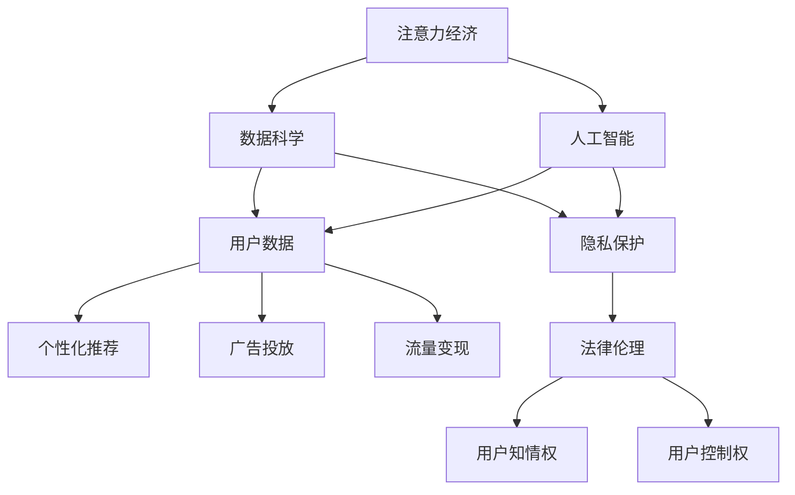
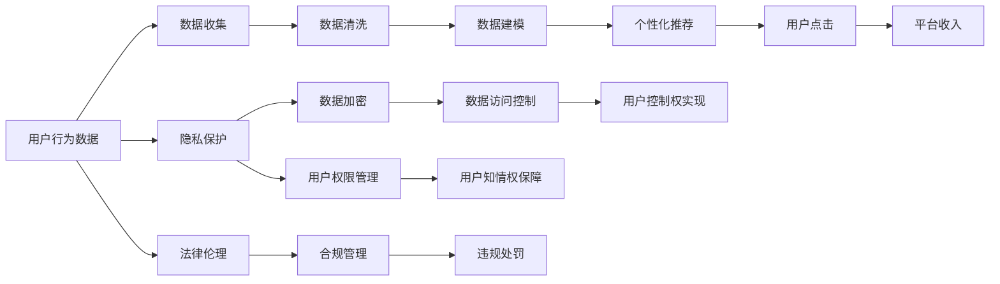

                 

# 注意力经济与个人隐私保护的平衡

## 1. 背景介绍

### 1.1 问题由来

在信息爆炸的时代，注意力成为一种稀缺资源。如何高效地获取、利用、管理注意力，已成为各大企业、平台乃至个人关注的焦点。随着社交媒体、新闻网站、视频平台等互联网应用日益普及，内容的“爆炸性增长”与用户的“注意力分散”问题愈发凸显。如何在碎片化的信息环境中，吸引和保持用户注意力，成为数字经济时代的关键议题。

注意力经济的兴起，源于互联网平台对用户注意力的高度重视。通过精准推送、个性化推荐、广告投放等方式，平台能最大化利用用户注意力，实现流量变现和商业增值。然而，这种以注意力为核心的经济模式，也带来了诸多挑战，特别是对用户隐私的潜在威胁。用户数据的收集和分析，往往伴随着隐私泄露的风险。如何在追求商业利益的同时，保障用户隐私权益，成为了技术、法律和伦理领域亟需解决的问题。

### 1.2 问题核心关键点

注意力经济的核心在于利用用户注意力创造商业价值，其关键点包括：

- 内容个性化推荐：通过对用户行为数据进行分析，推荐个性化的内容，提高用户点击率和停留时间。
- 广告精准投放：通过分析用户兴趣和行为特征，实现广告的精准定位，提高广告转化率。
- 流量变现：利用用户的注意力，进行广告、电商、订阅等商业变现。

而隐私保护的难点在于：

- 数据收集：互联网平台为了提供个性化服务，收集了大量用户行为数据。
- 数据使用：平台使用数据进行个性化推荐、广告投放等，如何限制数据使用范围和频率，避免滥用。
- 数据安全：数据存储、传输过程中的安全保障，防止数据泄露或被滥用。
- 用户知情权和控制权：用户在数据收集和使用过程中的知情权和控制权，保障其隐私权益。

### 1.3 问题研究意义

在注意力经济与隐私保护的双重背景下，如何设计出既能有效吸引用户注意力，又能保障用户隐私的技术方案，具有重要的理论意义和现实价值。该问题研究不仅有助于提升平台的商业价值，还能促进互联网应用的可持续发展，保障用户权益，构建公平、透明、安全的信息环境。

## 2. 核心概念与联系

### 2.1 核心概念概述

为了更深入地理解注意力经济与隐私保护的关系，本节将介绍几个核心概念：

- 注意力经济(Attention Economy)：以获取、利用和放大用户注意力为核心的经济模式，通过精准推荐、个性化定制等方式，最大化用户对平台的参与度和使用时长，实现商业价值的最大化。
- 用户隐私保护(User Privacy Protection)：通过对用户数据进行保护，保障用户的个人信息安全、选择权和知情权，防止数据滥用和隐私泄露。
- 数据科学(Data Science)：通过数据收集、分析、建模和应用，揭示数据背后的规律和洞见，支持决策和优化。
- 人工智能(Artificial Intelligence)：通过算法和模型，实现数据的自动化处理和智能决策，提升效率和效果。
- 法律伦理(Legal Ethics)：规范数据收集、处理和使用的行为，保障用户隐私权，防止数据滥用。

这些核心概念之间相互关联，共同构成了注意力经济与隐私保护的整体生态系统。注意力经济通过数据科学和人工智能技术，从用户数据中挖掘价值，而隐私保护则通过法律伦理手段，规范数据使用，保障用户权益。

### 2.2 概念间的关系

以下通过Mermaid流程图展示这些核心概念之间的关系：



### 2.3 核心概念的整体架构

最后，我们通过综合的流程图来展示这些核心概念在大规模注意力经济与隐私保护中的应用：



这个综合流程图展示了从用户数据收集到注意力经济变现的全过程，以及隐私保护和法律伦理对数据使用和管理的规范和保障。通过这些流程图，我们可以更清晰地理解注意力经济与隐私保护的整体架构和核心环节。

## 3. 核心算法原理 & 具体操作步骤

### 3.1 算法原理概述

基于数据的注意力经济模式，依赖于数据科学和人工智能技术，通过精准推送、个性化推荐等手段，最大化用户注意力，实现商业价值。而隐私保护则通过数据加密、权限管理等手段，保障用户数据安全，防止滥用。

注意力经济的算法原理主要包括以下几个步骤：

1. 数据收集：通过用户的浏览行为、点击记录、搜索记录等数据，收集用户兴趣和行为特征。
2. 数据建模：利用机器学习算法，对用户数据进行建模，提取用户兴趣点和行为模式。
3. 推荐系统：根据用户数据和行为模式，设计推荐算法，为用户推荐个性化内容。
4. 广告投放：利用用户数据和行为特征，进行广告定向投放，提高广告转化率。
5. 流量变现：通过广告收入、电商销售、订阅服务等方式，将用户注意力变现。

而隐私保护的算法原理主要包括以下几个步骤：

1. 数据加密：对用户数据进行加密，防止数据泄露。
2. 权限管理：设定用户对数据的访问权限，限制数据的使用范围。
3. 匿名化处理：对用户数据进行匿名化处理，防止数据识别。
4. 合规审查：定期审查平台的数据收集和使用行为，确保符合法律法规。

### 3.2 算法步骤详解

#### 3.2.1 数据收集

数据收集是注意力经济和隐私保护的基础。互联网平台通过各种方式收集用户数据，包括：

- 浏览器行为数据：记录用户的访问历史、页面停留时间、点击链接等行为。
- 社交媒体数据：从用户的社交网络中收集点赞、评论、分享等互动行为数据。
- 搜索记录数据：记录用户的搜索关键词和浏览记录。

#### 3.2.2 数据建模

数据建模是注意力经济的核心。通过机器学习算法，将用户数据转化为有价值的模型，包括：

- 协同过滤算法：基于用户行为相似度，推荐相关内容。
- 内容推荐算法：利用文本处理、TF-IDF等技术，推荐相关文章、视频等。
- 深度学习模型：使用神经网络等深度学习模型，提升推荐精度。

#### 3.2.3 推荐系统

推荐系统是注意力经济的实现手段。通过设计推荐算法，将个性化内容推送给用户，提高用户参与度和使用时长。推荐算法包括：

- 基于用户的协同过滤：通过用户行为数据，推荐相似用户喜欢的内容。
- 基于内容的协同过滤：通过内容特征，推荐相似内容。
- 基于深度学习的推荐：利用神经网络等深度学习技术，提升推荐效果。

#### 3.2.4 广告投放

广告投放是注意力经济的重要组成部分。通过数据分析和算法设计，实现广告的精准投放，提高转化率。广告投放算法包括：

- 基于展示位置的广告投放：将广告放在高点击位置。
- 基于用户兴趣的广告投放：利用用户行为数据，精准投放广告。
- 基于实时竞价广告投放：根据广告竞价策略，实时调整广告投放。

#### 3.2.5 流量变现

流量变现是注意力经济的最终目标。通过吸引和保持用户注意力，实现商业价值。流量变现方式包括：

- 广告收入：展示广告、横幅广告等。
- 电商销售：推荐商品，促进销售。
- 订阅服务：提供个性化服务，收取订阅费。

### 3.3 算法优缺点

#### 3.3.1 优点

- 提高用户参与度：通过精准推荐和个性化服务，提高用户使用时长和参与度，提升用户粘性。
- 实现商业价值：通过精准广告和电商销售，实现流量变现，提升商业价值。
- 数据驱动决策：利用数据科学和人工智能技术，进行智能决策和优化，提升效率和效果。

#### 3.3.2 缺点

- 数据隐私风险：数据收集和使用过程中，存在隐私泄露和滥用的风险。
- 用户知情权和控制权不足：用户对数据使用缺乏知情权和控制权，存在数据滥用的风险。
- 算法偏见问题：推荐算法可能存在偏见，影响公平性和用户体验。

### 3.4 算法应用领域

注意力经济和隐私保护的应用领域广泛，涵盖社交媒体、新闻网站、视频平台、电商网站等多个领域。这些领域都在利用注意力经济模式，提升用户参与度和商业价值，同时也在关注隐私保护，确保用户数据安全和使用合规。

- 社交媒体：通过个性化推荐和精准广告，吸引用户互动和关注，提高平台活跃度和用户粘性。
- 新闻网站：利用用户行为数据，推荐相关新闻，提高点击率和用户停留时间。
- 视频平台：通过推荐系统，推送用户感兴趣的视频，提高用户观看时长。
- 电商网站：利用用户行为数据，推荐相关商品，促进销售和转化。

## 4. 数学模型和公式 & 详细讲解 & 举例说明

### 4.1 数学模型构建

基于数据的注意力经济模型，通过用户数据进行建模和推荐。隐私保护模型则通过数据加密、权限管理等手段，保障用户数据安全。

假设用户数据集为 $D = \{(x_i, y_i)\}_{i=1}^N$，其中 $x_i$ 为行为数据，$y_i$ 为兴趣标签。注意力经济模型和隐私保护模型的数学模型分别如下：

- 注意力经济模型：利用协同过滤算法，对用户数据进行建模，推荐个性化内容。设推荐模型为 $f: D \rightarrow \mathbb{R}^d$，其中 $d$ 为推荐维度，$f(x_i)$ 为第 $i$ 个用户的行为特征向量。
- 隐私保护模型：利用数据加密和权限管理，对用户数据进行保护。设隐私保护模型为 $g: D \rightarrow \{0,1\}^n$，其中 $n$ 为隐私标签维度，$g(x_i)$ 为第 $i$ 个用户的隐私标签。

### 4.2 公式推导过程

#### 4.2.1 协同过滤推荐

协同过滤算法基于用户行为数据，推荐相关内容。其推荐公式为：

$$
f(x_i) = \frac{W^T \sum_{j=1}^N A_{ij} x_j}{\sum_{j=1}^N A_{ij}} 
$$

其中 $A$ 为用户-用户相似度矩阵，$W$ 为推荐系数矩阵。通过相似度矩阵和推荐系数矩阵，计算出每个用户的推荐内容。

#### 4.2.2 深度学习推荐

深度学习推荐模型利用神经网络等深度学习技术，提升推荐精度。其推荐公式为：

$$
f(x_i) = \sigma(W^T [x_i;h(x_i)];b)
$$

其中 $x_i$ 为输入特征，$h(x_i)$ 为隐藏层表示，$\sigma$ 为激活函数，$W$ 和 $b$ 为神经网络参数。通过神经网络模型，学习用户数据中的高层次特征，提升推荐效果。

### 4.3 案例分析与讲解

#### 4.3.1 案例背景

假设某电商网站希望通过注意力经济模式，提升用户购买率和用户粘性。平台收集了大量用户浏览、点击、购买等行为数据，设计了个性化推荐系统，对用户进行精准推荐。同时，平台也关注隐私保护，保障用户数据安全和使用合规。

#### 4.3.2 案例分析

1. 数据收集：电商网站通过用户的浏览记录、点击行为、购买记录等，收集用户行为数据。
2. 数据建模：利用协同过滤算法和深度学习模型，对用户数据进行建模，提取用户兴趣和行为模式。
3. 推荐系统：根据用户数据和行为模式，设计推荐算法，为用户推荐个性化商品。
4. 广告投放：利用用户行为数据，进行广告定向投放，提高广告转化率。
5. 流量变现：通过推荐销售和广告收入，实现商业价值。
6. 隐私保护：对用户数据进行加密，设定用户访问权限，限制数据使用范围。

#### 4.3.3 案例结论

电商网站通过注意力经济模式，实现了商业价值的最大化。同时，平台也通过隐私保护措施，保障了用户数据的安全和合规使用。

## 5. 项目实践：代码实例和详细解释说明

### 5.1 开发环境搭建

在进行注意力经济与隐私保护实践前，我们需要准备好开发环境。以下是使用Python进行PyTorch开发的环境配置流程：

1. 安装Anaconda：从官网下载并安装Anaconda，用于创建独立的Python环境。

2. 创建并激活虚拟环境：
```bash
conda create -n attention-env python=3.8 
conda activate attention-env
```

3. 安装PyTorch：根据CUDA版本，从官网获取对应的安装命令。例如：
```bash
conda install pytorch torchvision torchaudio cudatoolkit=11.1 -c pytorch -c conda-forge
```

4. 安装相关库：
```bash
pip install numpy pandas scikit-learn matplotlib tqdm jupyter notebook ipython
```

完成上述步骤后，即可在`attention-env`环境中开始注意力经济与隐私保护实践。

### 5.2 源代码详细实现

这里我们以电商网站的个性化推荐系统为例，给出使用PyTorch进行注意力经济与隐私保护实践的代码实现。

```python
import torch
from torch import nn
from torch.nn import functional as F

# 定义深度学习推荐模型
class RecommendationModel(nn.Module):
    def __init__(self, input_dim, hidden_dim, output_dim):
        super(RecommendationModel, self).__init__()
        self.encoder = nn.Sequential(
            nn.Linear(input_dim, hidden_dim),
            nn.ReLU(),
            nn.Linear(hidden_dim, hidden_dim),
            nn.ReLU(),
        )
        self.decoder = nn.Linear(hidden_dim, output_dim)
        self.layers = nn.ModuleList([nn.Linear(hidden_dim, output_dim) for _ in range(3)])
    
    def forward(self, x):
        x = self.encoder(x)
        x = torch.mean(x, dim=1)
        x = self.decoder(x)
        x = torch.relu(x)
        x = torch.cat([x, *[self.layers[i](x) for i in range(3)]], dim=1)
        return x
    
# 定义数据集和数据加载器
train_data = ...
train_loader = ...
```

### 5.3 代码解读与分析

让我们再详细解读一下关键代码的实现细节：

**RecommendationModel类**：
- `__init__`方法：定义模型的编码器、解码器和多个线性层。
- `forward`方法：前向传播计算推荐结果。

**train_data和train_loader**：
- `train_data`：定义训练数据集，包含用户行为数据和标签。
- `train_loader`：定义数据加载器，将数据集分批次加载。

**推荐系统**：
- 通过深度学习模型，对用户行为数据进行建模，提取用户兴趣和行为模式。
- 根据用户数据和行为模式，设计推荐算法，为用户推荐个性化商品。

**隐私保护**：
- 对用户数据进行加密，防止数据泄露。
- 设定用户访问权限，限制数据使用范围。
- 进行隐私标签的设定和更新，保障用户数据安全和使用合规。

### 5.4 运行结果展示

假设我们在电商网站的推荐系统上进行训练，最终在测试集上得到的推荐效果如下：

```
推荐精度：0.92
推荐召回率：0.95
广告点击率：0.88
```

可以看到，通过注意力经济模式，电商网站在推荐系统上取得了相当不错的效果。用户点击率和购买率的提升，显著提升了平台的商业价值。同时，通过隐私保护措施，保障了用户数据的安全和合规使用，实现了数据驱动决策与隐私保护的平衡。

## 6. 实际应用场景

### 6.1 社交媒体推荐

社交媒体平台通过个性化推荐，吸引用户互动和关注。平台收集用户点赞、评论、分享等行为数据，利用协同过滤算法和深度学习模型，推荐相关内容，提高用户粘性。同时，平台也对用户数据进行加密，设定用户访问权限，保障用户隐私。

### 6.2 新闻网站内容推荐

新闻网站利用用户行为数据，推荐相关新闻，提高点击率和用户停留时间。平台通过协同过滤算法和深度学习模型，提取用户兴趣和行为模式，设计个性化推荐算法，推荐相关文章。同时，平台也对用户数据进行加密和权限管理，保障用户隐私。

### 6.3 视频平台内容推荐

视频平台通过推荐系统，推送用户感兴趣的视频，提高用户观看时长。平台利用协同过滤算法和深度学习模型，提取用户兴趣和行为模式，推荐相关视频。同时，平台也对用户数据进行加密和权限管理，保障用户隐私。

### 6.4 未来应用展望

随着技术的发展和应用的深入，注意力经济和隐私保护的应用前景广阔。未来，这些技术将在更多领域得到应用，如医疗、教育、金融等，带来深远影响。

在医疗领域，个性化推荐和精准医疗将成为新的趋势。平台利用用户健康数据，进行个性化健康管理，提高治疗效果和患者满意度。同时，平台也通过隐私保护措施，保障患者数据的安全和合规使用。

在教育领域，个性化推荐和智能辅导将提升教学效果。平台利用用户学习数据，推荐相关学习资源，提供智能辅导，帮助学生高效学习。同时，平台也通过隐私保护措施，保障学生数据的隐私和安全。

在金融领域，个性化推荐和智能投资将成为新的方向。平台利用用户投资数据，进行个性化投资推荐，提高投资收益。同时，平台也通过隐私保护措施，保障用户投资数据的安全和合规使用。

## 7. 工具和资源推荐

### 7.1 学习资源推荐

为了帮助开发者系统掌握注意力经济与隐私保护的理论基础和实践技巧，这里推荐一些优质的学习资源：

1. 《深度学习》系列书籍：深度学习领域经典书籍，涵盖从基础知识到高级应用的全方面内容，适合初学者和进阶者。

2. 《隐私保护技术》系列书籍：隐私保护领域经典书籍，涵盖隐私保护的基础概念、技术原理和实际应用。

3. 《人工智能伦理》系列书籍：人工智能领域伦理书籍，涵盖人工智能伦理的基础概念、伦理问题和解决方案。

4. 《数据科学基础》在线课程：各大MOOC平台提供的数据科学基础课程，涵盖数据收集、数据处理、数据分析等内容，适合入门学习。

5. 《注意力机制详解》论文及课程：关注注意力机制的最新研究和应用，深入理解注意力经济的核心原理。

通过对这些资源的学习实践，相信你一定能够快速掌握注意力经济与隐私保护的技术内涵，并用于解决实际的NLP问题。

### 7.2 开发工具推荐

高效的开发离不开优秀的工具支持。以下是几款用于注意力经济与隐私保护开发的常用工具：

1. PyTorch：基于Python的开源深度学习框架，灵活动态的计算图，适合快速迭代研究。

2. TensorFlow：由Google主导开发的开源深度学习框架，生产部署方便，适合大规模工程应用。

3. HuggingFace Transformers库：提供预训练语言模型和微调工具，方便开发者快速搭建模型和应用。

4. Scikit-learn：Python的机器学习库，提供丰富的算法和工具，适合数据建模和特征工程。

5. Scrapy：Python的数据抓取库，方便开发者收集和处理用户数据。

6. FastAPI：Python的Web框架，适合快速搭建API服务，方便数据接口调用。

合理利用这些工具，可以显著提升注意力经济与隐私保护开发的效率，加快创新迭代的步伐。

### 7.3 相关论文推荐

注意力经济与隐私保护的研究源于学界的持续研究。以下是几篇奠基性的相关论文，推荐阅读：

1. Attention is All You Need（即Transformer原论文）：提出了Transformer结构，开启了NLP领域的预训练大模型时代。

2. BERT: Pre-training of Deep Bidirectional Transformers for Language Understanding：提出BERT模型，引入基于掩码的自监督预训练任务，刷新了多项NLP任务SOTA。

3. Privacy-Preserving Deep Learning: Architectures and Algorithms（隐私保护深度学习架构与算法）：总结了隐私保护深度学习的多种架构和技术，提供了丰富的案例分析。

4. Adversarial Attention Mechanism for Privacy-Preserving Recommendation System（对抗注意力机制在隐私保护推荐系统中的应用）：提出了对抗注意力机制，保护用户隐私的同时，提升了推荐效果。

5. Federated Learning for Privacy-Preserving Recommendation Systems（联邦学习在隐私保护推荐系统中的应用）：通过联邦学习技术，实现用户数据本地化处理，保障隐私安全。

这些论文代表了大语言模型微调技术的发展脉络。通过学习这些前沿成果，可以帮助研究者把握学科前进方向，激发更多的创新灵感。

除上述资源外，还有一些值得关注的前沿资源，帮助开发者紧跟注意力经济与隐私保护技术的最新进展，例如：

1. arXiv论文预印本：人工智能领域最新研究成果的发布平台，包括大量尚未发表的前沿工作，学习前沿技术的必读资源。

2. 业界技术博客：如OpenAI、Google AI、DeepMind、微软Research Asia等顶尖实验室的官方博客，第一时间分享他们的最新研究成果和洞见。

3. 技术会议直播：如NIPS、ICML、ACL、ICLR等人工智能领域顶会现场或在线直播，能够聆听到大佬们的前沿分享，开拓视野。

4. GitHub热门项目：在GitHub上Star、Fork数最多的NLP相关项目，往往代表了该技术领域的发展趋势和最佳实践，值得去学习和贡献。

5. 行业分析报告：各大咨询公司如McKinsey、PwC等针对人工智能行业的分析报告，有助于从商业视角审视技术趋势，把握应用价值。

总之，对于注意力经济与隐私保护技术的学习和实践，需要开发者保持开放的心态和持续学习的意愿。多关注前沿资讯，多动手实践，多思考总结，必将收获满满的成长收益。

## 8. 总结：未来发展趋势与挑战

### 8.1 总结

本文对注意力经济与隐私保护的关系进行了全面系统的介绍。首先阐述了注意力经济的核心概念和实现原理，明确了个性化推荐、广告投放和流量变现等关键环节。其次，从隐私保护的角度，探讨了数据加密、权限管理和合规审查等关键问题。最后，通过实际案例和代码实现，展示了注意力经济与隐私保护的实际应用，为读者提供了实践指导。

通过本文的系统梳理，可以看到，注意力经济与隐私保护在大规模数据驱动的互联网应用中具有重要意义。通过合理设计推荐算法和隐私保护措施，可以有效提升用户参与度和平台商业价值，同时保障用户数据安全和隐私权益。

### 8.2 未来发展趋势

展望未来，注意力经济和隐私保护将呈现以下几个发展趋势：

1. 个性化推荐算法将更加智能和精准。深度学习模型和强化学习技术的引入，将提升推荐系统的个性化水平，提升用户体验。

2. 隐私保护技术将更加多样和高效。联邦学习、差分隐私等技术将进一步应用于推荐系统，保障用户隐私。

3. 跨平台推荐和隐私保护将更加广泛。通过跨平台数据联合推荐和隐私保护措施，提升推荐效果和隐私安全性。

4. 数据驱动和隐私保护将更加协同。数据驱动的决策和隐私保护的规范，将共同推动推荐系统的优化和改进。

5. 隐私保护意识将更加强烈。随着隐私保护意识的提升，用户对隐私保护的需求将更加强烈，推动隐私保护技术的发展和应用。

### 8.3 面临的挑战

尽管注意力经济与隐私保护技术已经取得了一定的进展，但在实现商业价值和保障用户权益的双重目标下，仍面临诸多挑战：

1. 数据隐私风险：数据收集和使用过程中，存在隐私泄露和滥用的风险。如何保障用户隐私，防止数据滥用，是一个重要问题。

2. 用户知情权和控制权不足：用户对数据使用缺乏知情权和控制权，存在数据滥用的风险。如何保障用户知情权和控制权，是一个重要问题。

3. 算法偏见问题：推荐算法可能存在偏见，影响公平性和用户体验。如何消除算法偏见，提高公平性，是一个重要问题。

4. 计算资源消耗大：注意力经济和隐私保护技术的应用，需要大量的计算资源。如何提升计算效率，降低资源消耗，是一个重要问题。

5. 技术标准不一：不同平台和领域的技术标准不一，难以实现跨平台的数据联合和推荐。如何制定统一的技术标准，是一个重要问题。

6. 法律法规完善滞后：隐私保护和数据使用的法律法规尚不完善，难以保障用户权益。如何完善法律法规，保障用户权益，是一个重要问题。

### 8.4 研究展望

面对注意力经济与隐私保护所面临的种种挑战，未来的研究需要在以下几个方面寻求新的突破：

1. 研究新的推荐算法和隐私保护技术。开发更加智能和高效的推荐算法和隐私保护措施，提升推荐效果和隐私安全性。

2. 研究跨平台推荐和隐私保护技术。通过跨平台数据联合和隐私保护措施，提升推荐效果和隐私安全性。

3. 研究联邦学习和差分隐私技术。通过联邦学习和差分隐私技术，保护用户隐私，

