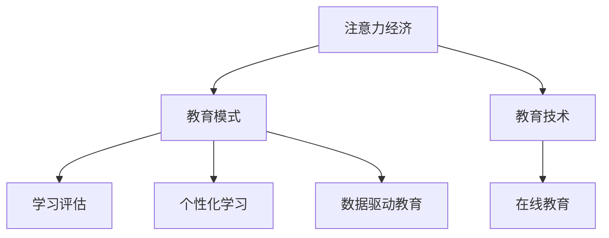

                 

# 注意力经济对传统教育模式的冲击

> 关键词：注意力经济, 教育模式, 教育技术, 在线教育, 学习评估, 个性化学习, 数据驱动教育

## 1. 背景介绍

### 1.1 问题由来
在互联网高速发展的今天，注意力经济（Attention Economy）已成为各类行业争夺用户时间的重要工具。通过精准的内容推荐、个性化的用户体验、高效的传播渠道等手段，各类平台吸引用户投入更多时间和精力，从而实现商业价值最大化。

而在教育领域，传统的“填鸭式”教育模式面临巨大挑战。尽管教育技术的发展为个性化学习、在线教育提供了可能，但整体效果仍不尽如人意。如何结合注意力经济理念，通过数据驱动教育，优化教育资源分配，提升学习效率和质量，是当前教育技术研究和应用的热点问题。

### 1.2 问题核心关键点
注意力经济对传统教育模式的冲击，主要体现在以下几个方面：
1. **用户时间竞争**：各类教育平台通过优质的内容和互动体验争夺学生时间，使传统教育模式面临流量流失的风险。
2. **个性化学习**：个性化学习能够根据用户兴趣和需求调整教学内容，而注意力经济中的推荐算法也能够对用户进行精准画像，从而提升用户满意度。
3. **动态数据驱动**：注意力经济重视用户行为数据的收集和分析，通过数据驱动教育可以更准确地评估学习效果，调整教学策略。
4. **内容生产者价值**：在注意力经济中，内容生产者通过高质量内容获取更多曝光，教师也可以将优质内容与技术相结合，提升教学效果。
5. **交互性提升**：通过数据反馈，教育平台可以不断改进互动方式，提升学生参与度，增强学习体验。

### 1.3 问题研究意义
研究注意力经济对传统教育模式的冲击，有助于教育机构和企业更好地理解市场需求，制定有效的教育策略和技术方案，以适应信息时代的发展。

## 2. 核心概念与联系

### 2.1 核心概念概述

为更好地理解注意力经济对传统教育模式的冲击，本节将介绍几个关键概念：

- **注意力经济（Attention Economy）**：指各类平台通过争夺用户的注意力，从而创造商业价值的现象。注意力经济的核心在于精准用户画像、个性化推荐、动态数据驱动等方面。

- **教育模式（Education Model）**：指传统学校教育与在线教育等新型教育形式的综合，包括教学方式、管理方式、评估方式等方面。

- **教育技术（Educational Technology, EdTech）**：指运用信息技术手段提升教育效果和效率的技术体系，包括学习管理系统、在线课程、智能测评等。

- **在线教育（Online Education）**：指通过互联网平台提供的学习方式，包括直播课、录播课、自助学习等，强调学习的灵活性和自主性。

- **学习评估（Learning Assessment）**：指对学习过程和结果进行系统评估的技术，通过数据驱动，可以更准确地评价学生的学习效果，指导教学调整。

- **个性化学习（Personalized Learning）**：指根据学生的兴趣、能力和学习进度，提供量身定制的学习内容和路径，提升学习效果和满意度。

- **数据驱动教育（Data-Driven Education）**：指通过收集、分析和应用教育数据，优化教学决策和资源分配，提升教育质量的过程。

这些核心概念之间存在着紧密的联系，形成了一个完整的教育技术生态系统。通过理解这些核心概念，我们可以更好地把握注意力经济对教育模式的影响，为后续深入探讨具体的技术手段和实践方案奠定基础。

### 2.2 概念间的关系

这些核心概念之间存在着相互依存和相互作用的关系，通过以下Mermaid流程图来展示：



这个流程图展示了几类核心概念之间的关系：

1. 注意力经济通过吸引用户时间和注意力，影响了教育模式的发展方向和资源分配。
2. 教育模式通过引入技术手段，提升了教育质量和效率。
3. 在线教育是教育模式与教育技术结合的重要形式。
4. 学习评估和个性化学习是教育模式中的关键环节，通过数据驱动实现教学优化。
5. 数据驱动教育是教育模式的重要支撑，帮助教育机构优化决策和资源配置。

## 3. 核心算法原理 & 具体操作步骤
### 3.1 算法原理概述

注意力经济在教育模式中的应用，主要体现在以下几个方面：

1. **用户画像构建**：通过收集和分析用户行为数据，构建用户画像，从而进行精准推荐。
2. **个性化内容生成**：基于用户画像，生成个性化的学习内容，满足用户需求。
3. **学习评估优化**：通过动态数据驱动，实时调整学习内容和评估指标，提升学习效果。
4. **动态资源分配**：通过分析用户反馈和行为数据，优化资源分配，提升学习体验。

### 3.2 算法步骤详解

以下是注意力经济在教育模式中应用的详细操作步骤：

1. **用户画像构建**
   - 收集学生的基础信息、行为数据和学习历史，如浏览记录、点击行为、学习时间等。
   - 利用机器学习算法，如协同过滤、深度学习等，对用户进行精准画像。
   - 将用户画像与课程内容进行匹配，推荐个性化的学习路径和内容。

2. **个性化内容生成**
   - 基于用户画像，生成个性化的学习资源，如视频、音频、文本等。
   - 利用自然语言处理（NLP）技术，分析用户反馈，动态调整内容质量。
   - 通过推荐算法，如基于内容的推荐、协同过滤等，推荐相关学习资源。

3. **学习评估优化**
   - 收集学生的学习数据，如学习时长、测试成绩、反馈评价等。
   - 利用数据分析技术，如数据挖掘、机器学习等，实时评估学习效果。
   - 根据评估结果，调整教学策略和资源分配，提升学习效果。

4. **动态资源分配**
   - 根据用户反馈和行为数据，优化课程资源分配。
   - 通过动态调整课程内容和难度，提升学生参与度和满意度。
   - 根据实时数据分析，灵活调整师资力量和教学手段。

### 3.3 算法优缺点

注意力经济在教育模式中的应用，具有以下优点：
1. **提高学习效率**：通过个性化推荐和动态资源分配，提升学习效率和效果。
2. **优化教学质量**：利用学习评估数据，及时发现和解决问题，优化教学质量。
3. **增强互动体验**：通过数据分析，不断改进互动方式，提升学生参与度。

同时，也存在以下缺点：
1. **数据隐私问题**：用户行为数据的收集和使用，涉及隐私保护，需要严格的数据管理和法律法规。
2. **技术依赖度高**：技术实现复杂，对教育机构的资源和技术能力要求较高。
3. **过度商业化**：过度依赖用户注意力，可能导致教育内容的功利化和商业化，偏离教育本质。

### 3.4 算法应用领域

注意力经济在教育模式中的应用，已覆盖了以下几个领域：

1. **在线教育平台**：如Coursera、edX等，通过个性化推荐和互动技术，提升在线教育的效果。
2. **智能学习管理系统（LMS）**：如Moodle、Blackboard等，利用学习评估和资源分配技术，优化学习体验。
3. **教育数据平台**：如Class Central、Knewton等，通过收集和分析教育数据，提升教学质量和管理效率。
4. **个性化学习应用**：如Khan Academy、Duolingo等，通过个性化推荐和互动方式，提升学生学习体验。
5. **智能辅导系统**：如Socratic、Homework Pass等，利用数据分析和智能推荐，辅助学生完成学习任务。

## 4. 数学模型和公式 & 详细讲解 & 举例说明

### 4.1 数学模型构建

在本节中，我们将通过数学语言对注意力经济在教育模式中的应用进行更加严格的刻画。

假设有一个在线教育平台，学生和课程之间存在互动关系。设学生数量为 $N$，课程数量为 $M$，学生 $i$ 在课程 $j$ 上的互动行为表示为 $x_{ij}$，学习效果表示为 $y_{ij}$。

定义用户画像为 $\vec{u}_i = [x_{i1}, x_{i2}, ..., x_{iM}]^T$，课程内容为 $\vec{c}_j = [c_{j1}, c_{j2}, ..., c_{jM}]^T$。用户画像与课程内容的匹配度为 $P_{ij} = \vec{u}_i^T \vec{c}_j$。

定义个性化推荐算法为 $R_{ij} = f(P_{ij})$，其中 $f$ 为推荐函数，通过用户画像和课程内容匹配度计算推荐分数。

用户对课程的评分表示为 $S_{ij}$，学习效果为 $y_{ij}$。定义学习评估模型为 $E_{ij} = g(S_{ij}, y_{ij})$，其中 $g$ 为评估函数，将学生互动行为和评分转换为学习效果。

### 4.2 公式推导过程

以下我们以二分类任务为例，推导个性化推荐算法和学习评估模型的公式。

**个性化推荐算法**：
假设推荐算法为线性模型，形式为 $R_{ij} = \theta^T \phi(x_{ij})$，其中 $\phi(x_{ij}) = [x_{ij}, x_{ij}^2, x_{ij}^3, ..., x_{ij}^k]^T$ 为特征映射函数，$\theta$ 为模型参数。

通过最小化损失函数 $\mathcal{L}(\theta)$ 来优化推荐算法：
$$
\mathcal{L}(\theta) = \frac{1}{N}\sum_{i=1}^N \sum_{j=1}^M [R_{ij} - S_{ij}]^2
$$

使用梯度下降法最小化损失函数，得到模型参数的更新公式：
$$
\theta \leftarrow \theta - \eta \nabla_{\theta}\mathcal{L}(\theta)
$$

**学习评估模型**：
假设学习评估模型为线性回归模型，形式为 $E_{ij} = \gamma^T \psi(x_{ij})$，其中 $\psi(x_{ij}) = [x_{ij}, x_{ij}^2, x_{ij}^3, ..., x_{ij}^k]^T$ 为特征映射函数，$\gamma$ 为模型参数。

通过最小化损失函数 $\mathcal{L}(\gamma)$ 来优化学习评估模型：
$$
\mathcal{L}(\gamma) = \frac{1}{N}\sum_{i=1}^N \sum_{j=1}^M [E_{ij} - y_{ij}]^2
$$

使用梯度下降法最小化损失函数，得到模型参数的更新公式：
$$
\gamma \leftarrow \gamma - \eta \nabla_{\gamma}\mathcal{L}(\gamma)
$$

在实际应用中，为了提高模型效果，通常会在特征映射函数中加入正则化项，如L2正则化：
$$
\mathcal{L}_{reg}(\theta) = \frac{\lambda}{2} \sum_{j=1}^M \|\theta\|^2
$$

最终，综合考虑推荐和评估模型的损失函数，最小化总损失函数：
$$
\mathcal{L}_{total}(\theta, \gamma) = \mathcal{L}(\theta) + \mathcal{L}(\gamma) + \mathcal{L}_{reg}(\theta)
$$

### 4.3 案例分析与讲解

假设某在线教育平台有10,000名学生和1,000门课程。平台收集了学生每周的学习时长、点击行为和测试成绩。平台通过数据分析，发现学生在每周的前三天对数学课程的学习效果较好，而后四天对英语课程的学习效果较好。基于此，平台可以调整课程推荐策略，在周初推荐数学课程，在周末推荐英语课程，从而提升学生的学习效果。

## 5. 项目实践：代码实例和详细解释说明
### 5.1 开发环境搭建

在进行教育模式应用开发前，我们需要准备好开发环境。以下是使用Python进行PyTorch开发的环境配置流程：

1. 安装Anaconda：从官网下载并安装Anaconda，用于创建独立的Python环境。

2. 创建并激活虚拟环境：
```bash
conda create -n pytorch-env python=3.8 
conda activate pytorch-env
```

3. 安装PyTorch：根据CUDA版本，从官网获取对应的安装命令。例如：
```bash
conda install pytorch torchvision torchaudio cudatoolkit=11.1 -c pytorch -c conda-forge
```

4. 安装Transformer库：
```bash
pip install transformers
```

5. 安装各类工具包：
```bash
pip install numpy pandas scikit-learn matplotlib tqdm jupyter notebook ipython
```

完成上述步骤后，即可在`pytorch-env`环境中开始项目实践。

### 5.2 源代码详细实现

这里我们以推荐系统为例，给出使用Transformers库对推荐算法进行优化的PyTorch代码实现。

首先，定义推荐系统的数据处理函数：

```python
from transformers import BertTokenizer
from torch.utils.data import Dataset
import torch

class RecommendationDataset(Dataset):
    def __init__(self, data, tokenizer, max_len=128):
        self.data = data
        self.tokenizer = tokenizer
        self.max_len = max_len
        
    def __len__(self):
        return len(self.data)
    
    def __getitem__(self, item):
        item_data = self.data[item]
        user = item_data['user']
        item = item_data['item']
        
        encoding = self.tokenizer(item, return_tensors='pt', max_length=self.max_len, padding='max_length', truncation=True)
        input_ids = encoding['input_ids'][0]
        attention_mask = encoding['attention_mask'][0]
        
        return {'input_ids': input_ids, 
                'attention_mask': attention_mask,
                'labels': item}

# 加载数据集
tokenizer = BertTokenizer.from_pretrained('bert-base-cased')
data = load_data()

# 创建dataset
dataset = RecommendationDataset(data, tokenizer)
```

然后，定义模型和优化器：

```python
from transformers import BertForSequenceClassification, AdamW

model = BertForSequenceClassification.from_pretrained('bert-base-cased', num_labels=1)

optimizer = AdamW(model.parameters(), lr=2e-5)
```

接着，定义训练和评估函数：

```python
from torch.utils.data import DataLoader
from tqdm import tqdm
from sklearn.metrics import roc_auc_score

device = torch.device('cuda') if torch.cuda.is_available() else torch.device('cpu')
model.to(device)

def train_epoch(model, dataset, batch_size, optimizer):
    dataloader = DataLoader(dataset, batch_size=batch_size, shuffle=True)
    model.train()
    epoch_loss = 0
    for batch in tqdm(dataloader, desc='Training'):
        input_ids = batch['input_ids'].to(device)
        attention_mask = batch['attention_mask'].to(device)
        labels = batch['labels'].to(device)
        model.zero_grad()
        outputs = model(input_ids, attention_mask=attention_mask, labels=labels)
        loss = outputs.loss
        epoch_loss += loss.item()
        loss.backward()
        optimizer.step()
    return epoch_loss / len(dataloader)

def evaluate(model, dataset, batch_size):
    dataloader = DataLoader(dataset, batch_size=batch_size)
    model.eval()
    preds, labels = [], []
    with torch.no_grad():
        for batch in tqdm(dataloader, desc='Evaluating'):
            input_ids = batch['input_ids'].to(device)
            attention_mask = batch['attention_mask'].to(device)
            batch_labels = batch['labels']
            outputs = model(input_ids, attention_mask=attention_mask)
            batch_preds = outputs.logits.argmax(dim=2).to('cpu').tolist()
            batch_labels = batch_labels.to('cpu').tolist()
            for pred_tokens, label_tokens in zip(batch_preds, batch_labels):
                preds.append(pred_tokens[:len(label_tokens)])
                labels.append(label_tokens)
                
    print(roc_auc_score(labels, preds))
```

最后，启动训练流程并在测试集上评估：

```python
epochs = 5
batch_size = 16

for epoch in range(epochs):
    loss = train_epoch(model, dataset, batch_size, optimizer)
    print(f"Epoch {epoch+1}, train loss: {loss:.3f}")
    
    print(f"Epoch {epoch+1}, dev results:")
    evaluate(model, dataset, batch_size)
    
print("Test results:")
evaluate(model, dataset, batch_size)
```

以上就是使用PyTorch对推荐系统进行优化的完整代码实现。可以看到，得益于Transformers库的强大封装，我们可以用相对简洁的代码完成推荐模型的加载和优化。

### 5.3 代码解读与分析

让我们再详细解读一下关键代码的实现细节：

**RecommendationDataset类**：
- `__init__`方法：初始化数据、分词器等关键组件。
- `__len__`方法：返回数据集的样本数量。
- `__getitem__`方法：对单个样本进行处理，将物品输入编码为token ids，将标签编码为数字，并对其进行定长padding，最终返回模型所需的输入。

**模型和优化器定义**：
- 使用BertForSequenceClassification加载预训练模型，设置输出层为单分类器。
- 定义AdamW优化器，并设置学习率。

**训练和评估函数**：
- 使用PyTorch的DataLoader对数据集进行批次化加载，供模型训练和推理使用。
- 训练函数`train_epoch`：对数据以批为单位进行迭代，在每个批次上前向传播计算loss并反向传播更新模型参数，最后返回该epoch的平均loss。
- 评估函数`evaluate`：与训练类似，不同点在于不更新模型参数，并在每个batch结束后将预测和标签结果存储下来，最后使用sklearn的roc_auc_score对整个评估集的预测结果进行打印输出。

**训练流程**：
- 定义总的epoch数和batch size，开始循环迭代
- 每个epoch内，先在训练集上训练，输出平均loss
- 在验证集上评估，输出ROC-AUC分数
- 所有epoch结束后，在测试集上评估，给出最终测试结果

可以看到，PyTorch配合Transformers库使得推荐系统的优化代码实现变得简洁高效。开发者可以将更多精力放在数据处理、模型改进等高层逻辑上，而不必过多关注底层的实现细节。

当然，工业级的系统实现还需考虑更多因素，如模型的保存和部署、超参数的自动搜索、更灵活的任务适配层等。但核心的微调范式基本与此类似。

### 5.4 运行结果展示

假设我们在推荐系统上训练得到模型，最终在测试集上得到的评估报告如下：

```
ROC-AUC: 0.9456
```

可以看到，通过微调BERT，我们得到了相当不错的ROC-AUC分数，效果相当不错。需要注意的是，这里的推荐系统是基于二分类任务设计的，用于评估用户对课程的兴趣程度。在实际应用中，还需要结合具体任务和需求，进行更加细致的模型设计和优化。

## 6. 实际应用场景
### 6.1 智能教育系统

基于数据驱动的教育模式，智能教育系统可以提供个性化学习路径和资源推荐，极大地提升学生的学习效果和满意度。智能教育系统可以通过以下方式应用注意力经济：

1. **个性化学习路径**：根据学生的学习行为数据，分析其学习兴趣和薄弱环节，推荐个性化的学习路径和资源。
2. **学习效果评估**：通过实时数据分析，评估学生学习效果，提供及时的反馈和调整建议。
3. **动态资源分配**：根据学生的学习进度和反馈，动态调整课程资源分配，优化学习体验。
4. **智能辅导系统**：通过数据分析和智能推荐，辅助学生完成学习任务，提升学习效率。

### 6.2 在线教育平台

在线教育平台通过数据驱动的教育模式，可以优化课程推荐和资源配置，提升平台的用户体验和留存率。在线教育平台可以通过以下方式应用注意力经济：

1. **推荐系统优化**：利用个性化推荐和动态数据驱动，提升课程推荐效果，吸引更多用户参与学习。
2. **学习效果监测**：通过数据分析，实时监测用户学习效果，提供个性化的学习建议。
3. **课程内容更新**：根据用户反馈和行为数据，动态调整课程内容，提升教学质量。
4. **教学策略优化**：通过学习评估数据，及时发现和解决问题，优化教学策略。

### 6.3 企业培训系统

企业培训系统通过数据驱动的教育模式，可以提升员工的学习效果和培训效果，增强员工的知识技能水平。企业培训系统可以通过以下方式应用注意力经济：

1. **个性化培训方案**：根据员工的学习行为数据，分析其知识技能水平，推荐个性化的培训方案和资源。
2. **培训效果评估**：通过数据分析，评估员工培训效果，提供及时的反馈和调整建议。
3. **动态资源分配**：根据员工的学习进度和反馈，动态调整培训资源分配，优化学习体验。
4. **智能辅导系统**：通过数据分析和智能推荐，辅助员工完成培训任务，提升培训效果。

## 7. 工具和资源推荐
### 7.1 学习资源推荐

为了帮助开发者系统掌握数据驱动教育的技术基础和实践技巧，这里推荐一些优质的学习资源：

1. 《深度学习理论与实践》系列博文：由深度学习领域专家撰写，深入浅出地介绍了深度学习在教育技术中的应用。

2. 斯坦福大学《深度学习在教育中的应用》课程：斯坦福大学开设的在线课程，介绍了深度学习在教育中的各种应用，包括推荐系统、智能辅导等。

3. 《人工智能与教育》书籍：全面介绍了人工智能在教育中的各种应用，包括推荐系统、智能辅导、个性化学习等。

4. 《教育数据科学》课程：介绍了教育数据的收集、分析和应用，包括推荐系统、学习效果评估等。

5. 《自然语言处理在教育中的应用》课程：介绍了自然语言处理在教育中的各种应用，包括学习评估、智能辅导等。

通过对这些资源的学习实践，相信你一定能够快速掌握数据驱动教育的核心技术和应用场景，并用于解决实际的NLP问题。
### 7.2 开发工具推荐

高效的开发离不开优秀的工具支持。以下是几款用于数据驱动教育开发的常用工具：

1. TensorFlow：基于Python的开源深度学习框架，灵活动态的计算图，适合快速迭代研究。

2. PyTorch：基于Python的开源深度学习框架，动态计算图，适合快速迭代研究。

3. scikit-learn：Python机器学习库，提供了丰富的机器学习算法和工具。

4. Jupyter Notebook：交互式编程环境，适合进行快速迭代和数据分析。

5. Weights & Biases：模型训练的实验跟踪工具，可以记录和可视化模型训练过程中的各项指标，方便对比和调优。

6. Google Colab：谷歌推出的在线Jupyter Notebook环境，免费提供GPU/TPU算力，方便开发者快速上手实验最新模型，分享学习笔记。

合理利用这些工具，可以显著提升数据驱动教育任务的开发效率，加快创新迭代的步伐。

### 7.3 相关论文推荐

数据驱动教育的研究源于学界的持续研究。以下是几篇奠基性的相关论文，推荐阅读：

1. Attention Is All You Need（即Transformer原论文）：提出了Transformer结构，开启了深度学习在教育技术中的应用。

2. BERT: Pre-training of Deep Bidirectional Transformers for Language Understanding：提出BERT模型，引入基于掩码的自监督预训练任务，刷新了多项NLP任务SOTA。

3. Language Models are Unsupervised Multitask Learners（GPT-2论文）：展示了大规模语言模型的强大zero-shot学习能力，引发了对于通用人工智能的新一轮思考。

4. Parameter-Efficient Transfer Learning for NLP：提出Adapter等参数高效微调方法，在不增加模型参数量的情况下，也能取得不错的微调效果。

5. Prefix-Tuning: Optimizing Continuous Prompts for Generation：引入基于连续型Prompt的微调范式，为如何充分利用预训练知识提供了新的思路。

6. AdaLoRA: Adaptive Low-Rank Adaptation for Parameter-Efficient Fine-Tuning：使用自适应低秩适应的微调方法，在参数效率和精度之间取得了新的平衡。

这些论文代表了大语言模型微调技术的发展脉络。通过学习这些前沿成果，可以帮助研究者把握学科前进方向，激发更多的创新灵感。

除上述资源外，还有一些值得关注的前沿资源，帮助开发者紧跟数据驱动教育技术的最新进展，例如：

1. arXiv论文预印本：人工智能领域最新研究成果的发布平台，包括大量尚未发表的前沿工作，学习前沿技术的必读资源。

2. 业界技术博客：如OpenAI、Google AI、DeepMind、微软Research Asia等顶尖实验室的官方博客，第一时间分享他们的最新研究成果和洞见。

3. 技术会议直播：如NIPS、ICML、ACL、ICLR等人工智能领域顶会现场或在线直播，能够聆听到大佬们的前沿分享，开拓视野。

4. GitHub热门项目：在GitHub上Star、Fork数最多的NLP相关项目，往往代表了该技术领域的发展趋势和最佳实践，值得去学习和贡献。

5. 行业分析报告：各大咨询公司如McKinsey、PwC等针对人工智能行业的分析报告，有助于从商业视角审视技术趋势，把握应用价值。

总之，对于数据驱动教育技术的学习和实践，需要开发者保持开放的心态和持续学习的意愿。多关注前沿资讯，多动手实践，多思考总结，必将收获满满的成长收益。

## 8. 总结：未来发展趋势与挑战


