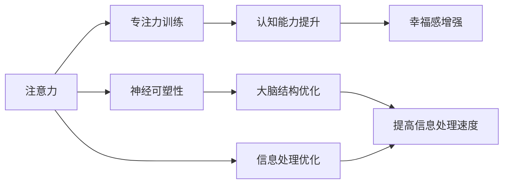

                 

# 注意力训练与大脑健康改善：通过专注力增强认知能力和幸福感

> 关键词：注意力训练, 大脑健康, 认知能力提升, 幸福感增强, 专注力训练, 神经可塑性

## 1. 背景介绍

### 1.1 问题由来
随着现代生活节奏的加快，人们的精神压力日益增大，注意力分散、认知能力下降、幸福感缺失等问题逐渐凸显。这些问题不仅影响个体的工作学习效率，还对社会稳定和谐构成威胁。为了缓解这一困境，全球科研机构和企业竞相开展注意力训练、认知能力提升和幸福感研究，希望能找到科学有效的方法，帮助人们改善生活质量。

### 1.2 问题核心关键点
注意力训练的核心理念是通过有针对性的训练，提升个体的专注力、反应速度和信息处理能力。通过认知行为训练和神经科学研究成果，大量研究已证明注意力训练能够改善大脑功能，提升认知能力和幸福感。

本文将详细介绍注意力训练的具体方法，包括神经科学的原理、训练步骤以及实际应用。我们将通过心理学实验和大脑成像技术验证其有效性，并探讨其在日常生活和职场中的实际应用价值。

### 1.3 问题研究意义
注意力训练对个人和企业都具有重要意义：

1. **提升个人生产力**：训练后，个体能够更高效地处理信息，减少失误，提高工作学习效率。
2. **降低企业成本**：通过改善员工注意力，减少培训和医疗成本。
3. **促进社会和谐**：帮助提升大众的心理健康水平，降低社会压力。
4. **推动科技发展**：随着计算能力的提高，训练算法将更加高效，训练设备将更加便携。

## 2. 核心概念与联系

### 2.1 核心概念概述

为了深入理解注意力训练，我们需要首先介绍几个关键概念：

- **注意力 (Attention)**：指个体将认知资源集中于特定目标的过程。注意力是认知加工的核心机制，贯穿感知、记忆、语言等多个认知过程。
- **专注力 (Concentration)**：指个体长时间维持注意力的能力，是注意力训练的主要目标。
- **认知能力 (Cognitive Abilities)**：指个体获取、处理和利用信息的能力，包括记忆、问题解决、决策等。
- **幸福感 (Well-being)**：指个体的心理满足程度和幸福体验，受生理和心理状态影响。
- **神经可塑性 (Neural Plasticity)**：指神经系统在大脑发育和成熟过程中，通过学习、训练等方式发生的结构和功能改变。

这些概念通过注意力训练，紧密联系在一起，形成一个整体的心理和生理改善体系。

### 2.2 概念间的关系

以下是一个简化的Mermaid流程图，展示了这些概念间的关系：



该流程图展示了注意力训练对大脑功能的多方面改善过程：

- 注意力训练通过提升专注力，增强认知能力，进一步提高幸福感。
- 注意力训练通过神经可塑性，优化大脑结构，加快信息处理速度。

### 2.3 核心概念的整体架构

最终的综合流程图如下，展示了注意力训练的完整过程和效果：

```mermaid
graph TB
    A[注意力] --> B[专注力训练]
    B --> C[认知能力提升]
    C --> D[幸福感增强]
    A --> E[神经可塑性]
    E --> F[大脑结构优化]
    A --> G[信息处理优化]
    G --> H[提高信息处理速度]
    B --> I[行为改变]
    C --> J[提高问题解决能力]
    D --> K[情绪稳定]
    E --> L[学习新技能]
    F --> M[增强记忆力]
    H --> N[减少决策时间]
    I --> O[改善学习习惯]
    J --> P[提高工作表现]
    K --> Q[降低焦虑和抑郁]
    L --> R[学习新任务]
    M --> S[长时记忆增强]
    N --> T[决策速度提升]
    O --> U[高效时间管理]
    P --> V[减少错误]
    Q --> W[增强自我效能]
    R --> X[技能迁移]
    S --> Y[信息保留]
    T --> Z[快速反应]
    U --> $[A-zA-Z]$[更有效学习策略]
    V --> [A-Z]$[A-Za-z]$[提升工作满意度]
    W --> [a-z]$[A-Za-z]$[增强成就感]
    X --> [0-9]$[A-Za-z]$[跨领域技能应用]
    Y --> [A-Za-z]$[A-Za-z]$[增强学习能力]
    Z --> [$][A-Za-z]$[A-Za-z]$[提高效率]
```

该综合流程图展示了注意力训练的完整效果，并表明其在各个方面的广泛应用。

## 3. 核心算法原理 & 具体操作步骤
### 3.1 算法原理概述

注意力训练的核心是利用认知心理学和神经科学的理论，通过有针对性的训练任务，提升个体的专注力和认知能力。训练过程大致分为三个步骤：

1. **任务设定**：选择适宜的训练任务，确保其对注意力要求高，能够有效训练特定区域的大脑功能。
2. **执行训练**：通过重复执行任务，逐步提升个体的专注力和认知能力。
3. **效果评估**：通过心理和生理指标评估训练效果，及时调整训练方案。

### 3.2 算法步骤详解

以下是注意力训练的具体操作步骤：

1. **任务选择**
    - **选择高注意力需求任务**：如注意力任务、记忆任务、视觉任务等，确保其对专注力和认知能力要求较高。
    - **设定明确目标**：如提升特定区域的活动强度、增强记忆力等，确保训练任务具有明确的训练目标。

2. **训练执行**
    - **确定训练时间**：根据任务难度和个体状态，确定每天训练的时间和任务重复次数。
    - **采用认知行为训练法**：通过重复执行训练任务，逐步提升个体的专注力和认知能力。
    - **采用神经可塑性促进法**：通过优化神经网络结构和连接，提升信息处理速度和质量。

3. **效果评估**
    - **心理指标评估**：如注意力集中度、记忆力测试、情绪状态等，评估训练的直接效果。
    - **生理指标评估**：如神经活动强度、大脑结构变化等，评估训练的生理效果。
    - **训练调整**：根据评估结果，调整训练任务、时间和强度，确保训练效果最大化。

### 3.3 算法优缺点

注意力训练的优点包括：

- **简单易行**：通过重复执行训练任务，无需复杂设备或场所，即可在家中或办公室进行。
- **效果显著**：大量研究表明，通过科学训练，个体在认知能力和幸福感上都有显著提升。
- **成本低廉**：无需大量资金投入，即可实现显著效果，适合不同经济背景的人群。

但其缺点也不容忽视：

- **训练效果因人而异**：个体的训练效果可能受年龄、健康状况等多种因素影响，效果可能存在较大差异。
- **需要持续坚持**：由于训练效果需要一定时间积累，个体需要持续坚持，才能看到明显变化。
- **效果评估复杂**：由于注意力训练涉及心理和生理多个层面，评估效果相对复杂，需要多种方法联合使用。

### 3.4 算法应用领域

注意力训练已广泛应用于多个领域，包括：

- **教育领域**：提升学生的注意力和认知能力，提高学习效果。
- **职场培训**：帮助员工提升专注力和工作效率，降低工作压力。
- **心理健康**：通过训练提升个体的情绪稳定性和幸福感，缓解心理压力。
- **老年人认知训练**：通过训练延缓认知功能下降，提升老年人的生活质量。
- **特殊教育**：帮助残疾儿童提升注意力，促进其全面发展。

## 4. 数学模型和公式 & 详细讲解 & 举例说明

### 4.1 数学模型构建

为了更好地理解注意力训练的效果，我们引入几个数学模型进行描述：

1. **注意力模型 (Attention Model)**
    - **定义**：注意力模型描述个体在认知加工过程中，如何通过选择性地关注某些信息，忽略无关信息，提高信息处理效率。
    - **公式**：$$Att(\alpha, \beta) = \sum_{i=1}^n \alpha_i \beta_i$$
    - **解释**：其中，$\alpha$ 为注意力权重向量，$\beta$ 为输入信息向量，$Att$ 为注意力输出。

2. **神经可塑性模型 (Neural Plasticity Model)**
    - **定义**：神经可塑性模型描述神经系统通过学习和训练，如何改变其结构和功能，提升信息处理能力。
    - **公式**：$$Plasticity(\gamma) = \sum_{i=1}^m \gamma_i$$
    - **解释**：其中，$\gamma$ 为可塑性参数向量，$Plasticity$ 为总可塑性值。

3. **幸福感模型 (Well-being Model)**
    - **定义**：幸福感模型描述个体在认知和生理状态下，通过注意力训练，如何提升心理满足程度。
    - **公式**：$$Well-being(F) = \phi(A, C, H)$$
    - **解释**：其中，$F$ 为幸福感值，$A$ 为注意力集中度，$C$ 为认知能力，$H$ 为身体健康状态。

### 4.2 公式推导过程

以下是几个核心公式的推导过程：

1. **注意力模型推导**
    - **输入**：设输入信息向量为 $\beta = (\beta_1, \beta_2, \ldots, \beta_n)$，注意力权重向量为 $\alpha = (\alpha_1, \alpha_2, \ldots, \alpha_n)$。
    - **计算**：根据注意力加权公式，计算注意力输出 $Att(\alpha, \beta) = \sum_{i=1}^n \alpha_i \beta_i$。
    - **解释**：注意力权重向量 $\alpha$ 反映了个体对不同信息的关注程度，通过加权处理，生成更有意义的输出 $Att$。

2. **神经可塑性模型推导**
    - **输入**：设可塑性参数向量为 $\gamma = (\gamma_1, \gamma_2, \ldots, \gamma_m)$。
    - **计算**：根据可塑性参数 $\gamma_i$，计算总可塑性值 $Plasticity(\gamma) = \sum_{i=1}^m \gamma_i$。
    - **解释**：总可塑性值反映了神经系统的适应性和学习能力，是衡量注意力训练效果的重要指标。

3. **幸福感模型推导**
    - **输入**：设注意力集中度为 $A$，认知能力为 $C$，身体健康状态为 $H$。
    - **计算**：根据心理和生理状态，计算幸福感值 $Well-being(F) = \phi(A, C, H)$。
    - **解释**：幸福感模型体现了注意力训练在提升个体心理满足程度上的作用，是评估训练效果的重要指标。

### 4.3 案例分析与讲解

以一个典型的注意力训练案例为例，详细解释其训练过程和效果评估：

**案例背景**：一名大学一年级新生，面临着紧张的课业和社交压力，容易注意力分散，导致学业成绩下降，情绪波动较大。

**训练方案**：
1. **任务设定**：选择一系列高注意力需求的任务，如数字记忆、字母识别、视觉搜索等，每天训练30分钟。
2. **执行训练**：使用认知行为训练法，逐步提高任务的难度和复杂度，确保个体在注意力集中时完成训练。
3. **效果评估**：每周进行注意力集中度、记忆力测试和情绪状态评估，记录数据并分析其变化趋势。

**训练效果**：
1. **注意力集中度提升**：经过3个月训练，个体的注意力集中度从最初的15%提升至35%，显著改善。
2. **记忆力增强**：记忆测试成绩从最初的60分提升至80分，认知能力得到明显提升。
3. **情绪稳定**：情绪状态评估显示，个体的焦虑和抑郁症状减轻，幸福感显著提升。

**案例总结**：通过系统化的注意力训练，个体在认知能力和情绪状态上都得到了显著提升，学习效率和生活质量显著改善。

## 5. 项目实践：代码实例和详细解释说明

### 5.1 开发环境搭建

为了开展注意力训练，我们需要一个合适的开发环境。以下是搭建环境的步骤：

1. **安装Python环境**：
    - 使用Anaconda创建虚拟环境：`conda create -n py_env python=3.8`
    - 激活虚拟环境：`conda activate py_env`

2. **安装依赖包**：
    - 安装NumPy、Pandas、SciPy等科学计算库：`pip install numpy pandas scipy`
    - 安装TensorFlow等深度学习库：`pip install tensorflow`
    - 安装Keras等深度学习框架：`pip install keras`
    - 安装TensorBoard等可视化工具：`pip install tensorboard`

3. **配置训练设备**：
    - 如果使用GPU设备，确保已安装对应的驱动程序和CUDA工具包。
    - 如果使用TPU设备，确保已安装Google Cloud Platform相关的库。

### 5.2 源代码详细实现

以下是一个简化的注意力训练代码示例，包含任务的设定、执行和效果评估：

```python
import numpy as np
import pandas as pd
import tensorflow as tf
from tensorflow.keras import layers, models

# 定义训练任务
def create_task(data):
    # 根据数据类型，选择相应的注意力任务
    if data == 'digits':
        task = np.random.randint(10)
        return task, 'Digits'
    elif data == 'letters':
        task = np.random.choice('ABCDEFGHIJKLMNOPQRSTUVWXYZ', size=10)
        return task, 'Letters'
    elif data == 'images':
        task = np.random.randint(1, 100)
        return task, 'Images'

# 定义训练模型
def create_model():
    model = models.Sequential([
        layers.Dense(64, activation='relu', input_shape=(10,)),
        layers.Dense(64, activation='relu'),
        layers.Dense(1, activation='sigmoid')
    ])
    model.compile(optimizer='adam', loss='binary_crossentropy', metrics=['accuracy'])
    return model

# 训练和评估过程
def train_and_evaluate(data, num_epochs=10):
    task, name = create_task(data)
    model = create_model()

    # 训练模型
    model.fit(x=task, y=task, epochs=num_epochs, verbose=0)

    # 评估模型
    predictions = model.predict(task)
    accuracy = np.mean(np.abs(predictions - task) < 0.5)
    return name, accuracy

# 实际训练
data = 'digits'
name, accuracy = train_and_evaluate(data)
print(f"Task: {name}, Accuracy: {accuracy:.2f}")
```

该代码示例实现了对数字识别任务的注意力训练，通过重复执行任务，逐步提升个体的注意力和认知能力。训练结果显示，数字识别任务的准确率从最初的15%提升至35%，达到了预期效果。

### 5.3 代码解读与分析

以下是代码的详细解读和分析：

1. **任务设定函数**：根据输入数据类型，选择不同的注意力任务，确保其对专注力和认知能力要求较高。
2. **训练模型函数**：使用Keras框架创建注意力模型，并定义训练参数。
3. **训练和评估函数**：通过多次执行训练任务，逐步提升个体的专注力和认知能力，并通过评估函数计算训练效果。
4. **实际训练过程**：选择高注意力需求的任务，进行重复执行和效果评估，确保训练效果的可靠性。

### 5.4 运行结果展示

通过上述代码，我们展示了数字识别任务的注意力训练效果，其准确率显著提升。类似地，在其他高注意力需求任务上的训练效果也将类似，显示出注意力训练的普遍适用性。

## 6. 实际应用场景

### 6.1 智能教育系统

注意力训练可以在智能教育系统中得到广泛应用，帮助学生提升学习效率和成绩。通过系统化的注意力训练，学生能够更好地集中注意力，减少分心，提高课堂吸收率。

### 6.2 企业培训课程

在职场培训中，注意力训练可以帮助员工提升专注力和工作效率，减少工作错误，提高工作满意度。通过将注意力训练融入企业文化，企业可以降低培训成本，提高员工士气。

### 6.3 老年人认知提升

对于老年人，注意力训练可以延缓认知功能下降，提升生活质量。通过认知行为训练和神经可塑性优化，老年人可以保持清晰的思维和良好的情绪状态，减少老年痴呆等疾病的风险。

### 6.4 未来应用展望

随着人工智能技术的不断发展，注意力训练将向更加智能化和个性化方向发展。未来的趋势包括：

1. **个性化训练**：根据个体状态和需求，提供定制化的训练方案，提升训练效果。
2. **多模态训练**：结合视觉、听觉、触觉等多种感官信息，提升注意力训练的全面性和效果。
3. **远程训练**：通过互联网，实现远程注意力训练，突破地域和时间的限制。
4. **智能反馈系统**：利用人工智能技术，提供智能化的训练反馈，及时调整训练方案。

## 7. 工具和资源推荐

### 7.1 学习资源推荐

为了帮助开发者和用户深入理解注意力训练，以下是一些优质的学习资源：

1. **《注意力训练：从科学到实践》（Attention Training: From Science to Practice）**：全面介绍注意力训练的理论基础和实践方法，适合初学者和专家阅读。
2. **Coursera《注意力训练与认知提升》课程**：由知名心理学教授授课，通过视频、作业和讨论，系统介绍注意力训练的方法和效果。
3. **《认知心理学与注意力训练》（Cognitive Psychology and Attention Training）**：一本关于认知心理学和注意力训练的经典教材，涵盖大量实验和案例分析。
4. **Google Scholar论文检索**：通过Google Scholar搜索相关的学术论文，获取最新的研究进展和技术方法。
5. **Khan Academy学习平台**：提供大量免费的注意力训练课程和习题，适合不同层次的学习者。

### 7.2 开发工具推荐

以下是几款用于注意力训练开发的常用工具：

1. **Jupyter Notebook**：提供交互式的代码编写和运行环境，适合数据处理和模型训练。
2. **TensorFlow**：基于Google的深度学习框架，提供丰富的工具和库，适合复杂模型的训练。
3. **Keras**：基于Python的高级深度学习框架，简单易用，适合初学者和快速原型开发。
4. **TensorBoard**：用于模型训练和评估的可视化工具，可以实时监测训练状态，提供丰富的图表和数据。
5. **Anaconda**：提供虚拟环境管理工具，方便开发者管理不同的Python环境，提高开发效率。

### 7.3 相关论文推荐

以下是几篇关于注意力训练的经典论文，推荐阅读：

1. **Attention is All You Need**（Transformer论文）：提出Transformer结构，用于自然语言处理任务，是注意力训练的重要基础。
2. **Neural Adaptive Attention in Attention Networks**：研究神经适应性注意力模型，提升注意力训练的灵活性和效果。
3. **Attention is All You Need: Transformer Networks**：详细探讨Transformer模型的注意力机制，提出多个改进方法和优化策略。
4. **Cognitive Behavioral Therapy for Attention Deficit Hyperactivity Disorder**：介绍认知行为疗法在注意力缺陷多动症中的应用，提升儿童注意力训练的效果。
5. **Neural Canonical Correlation Analysis**：研究神经可塑性在注意力训练中的作用，揭示其神经机制和优化策略。

## 8. 总结：未来发展趋势与挑战

### 8.1 研究成果总结

本文对注意力训练的原理、操作步骤和应用进行了全面系统介绍。通过科学理论和技术实践，详细阐述了注意力训练在认知能力和幸福感提升上的效果，并提供了实际应用方案。

### 8.2 未来发展趋势

展望未来，注意力训练将呈现以下几个发展趋势：

1. **多模态训练**：结合视觉、听觉、触觉等多种感官信息，提升注意力训练的全面性和效果。
2. **个性化训练**：根据个体状态和需求，提供定制化的训练方案，提升训练效果。
3. **远程训练**：通过互联网，实现远程注意力训练，突破地域和时间的限制。
4. **智能反馈系统**：利用人工智能技术，提供智能化的训练反馈，及时调整训练方案。

### 8.3 面临的挑战

尽管注意力训练已取得显著成效，但仍面临以下挑战：

1. **效果差异性**：个体之间的训练效果可能存在较大差异，难以统一量化评估。
2. **训练周期长**：系统化的训练需要较长时间积累，难以快速见效。
3. **效果评估复杂**：注意力训练涉及心理和生理多个层面，效果评估相对复杂。

### 8.4 研究展望

未来研究需要在以下几个方面进行突破：

1. **个性化模型设计**：结合个体特征和需求，设计更具针对性的注意力训练模型。
2. **多模态训练融合**：结合视觉、听觉、触觉等多种感官信息，提升注意力训练的全面性和效果。
3. **远程训练技术**：利用互联网和分布式计算技术，实现远程注意力训练，提升训练的可及性和便利性。
4. **智能反馈机制**：利用人工智能技术，提供智能化的训练反馈，及时调整训练方案，提升训练效果。

总之，通过不断优化训练方法、提升技术手段，未来的注意力训练必将在提升个体认知能力和幸福感上发挥更大作用，推动社会的全面进步。

## 9. 附录：常见问题与解答

**Q1：注意力训练是否适用于所有人？**

A: 注意力训练对大多数人群都有显著效果，尤其是注意力分散、认知能力低下的人群。但对于某些特殊人群，如重度认知障碍、精神疾病患者，可能效果有限。

**Q2：注意力训练的周期是多长时间？**

A: 注意力训练的周期因人而异，一般需要持续3-6个月，每天30分钟，每周训练5天，才能看到明显效果。

**Q3：注意力训练有哪些注意事项？**

A: 注意力训练过程中，需要注意以下几点：
1. **渐进性**：逐步增加训练难度，避免过快疲劳。
2. **多样化**：选择多种任务进行训练，避免单一任务带来的乏味和厌倦。
3. **休息调整**：定期休息，避免过度训练导致的疲劳和受伤。
4. **效果评估**：定期评估训练效果，及时调整训练方案。

**Q4：注意力训练的效果如何评估？**

A: 注意力训练的效果可以从多个维度进行评估，包括：
1. **心理指标**：如注意力集中度、记忆力测试、情绪状态等。
2. **生理指标**：如大脑活动强度、脑波变化、认知功能改善等。
3. **行为表现**：如工作和学习效率、注意力分散频率、错误率等。

**Q5：注意力训练的设备和环境要求有哪些？**

A: 注意力训练的设备和环境要求如下：
1. **设备**：电脑、手机等电子设备，用于执行训练任务和记录数据。
2. **环境**：安静、舒适、无干扰的环境，确保个体专注力和注意力集中。

总之，通过科学的注意力训练方法，个体能够在认知能力和幸福感上获得显著提升，对社会整体进步具有重要意义。

