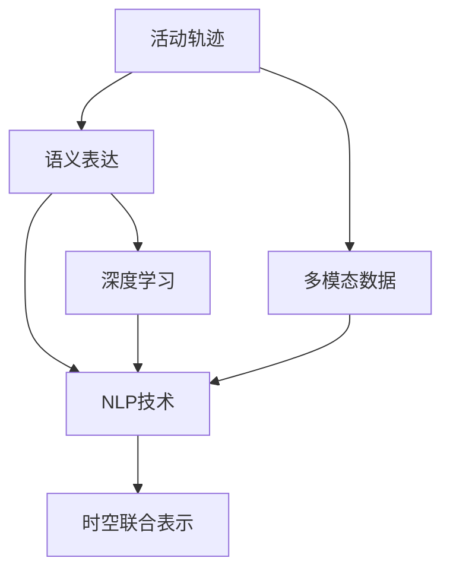
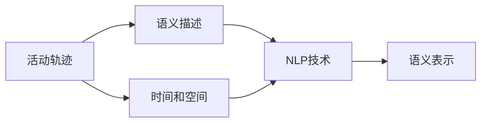
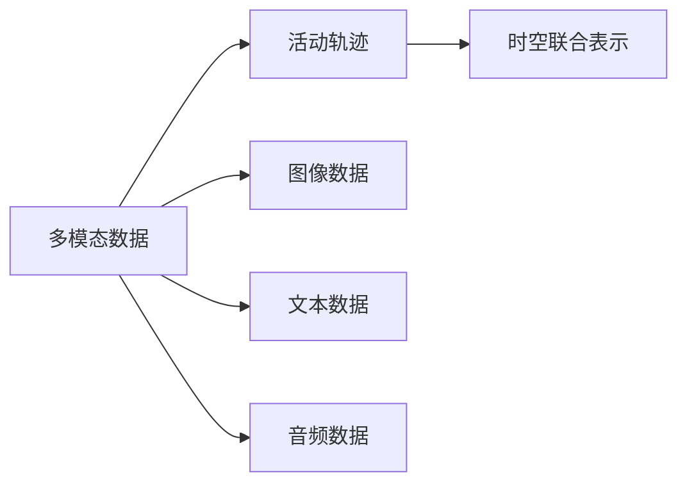
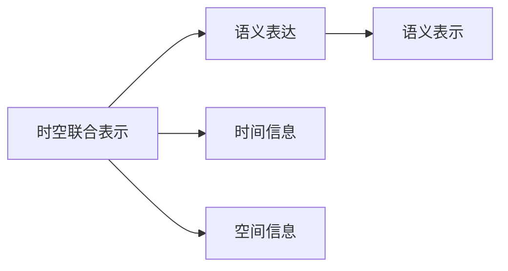
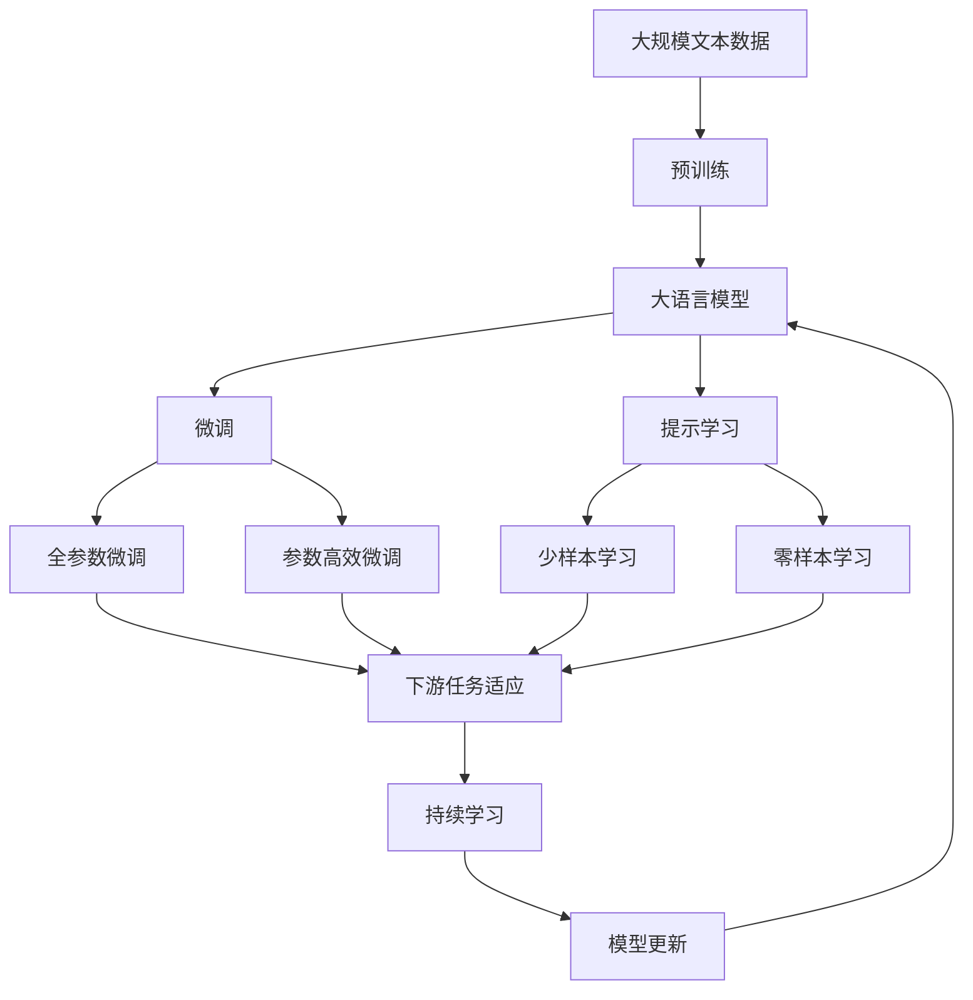

                 

# 活动轨迹的语义表达与搜索技术研究

## 1. 背景介绍

在智能城市、智慧交通等领域，如何高效、精准地描述和搜索人类的活动轨迹，是一个亟待解决的问题。传统的基于位置的搜索方式只能获取物体的物理位置信息，而忽略了人类活动的语义信息。语义信息包括活动类型、参与者、时间、地点等多个维度，对理解人类活动具有重要的参考价值。

本研究聚焦于活动轨迹的语义表达与搜索技术，旨在通过构建语义丰富、多模态的活动轨迹模型，实现对人类活动的全面描述和高效搜索。该技术不仅可以应用于城市管理、安全监控、交通调度等领域，还为个人隐私保护和行为理解提供了新的视角。

## 2. 核心概念与联系

### 2.1 核心概念概述

为了更好地理解活动轨迹的语义表达与搜索技术，本节将介绍几个密切相关的核心概念：

- **活动轨迹(Activity Trail)**：指个体在一定时间范围内进行的一系列活动，由一系列的位置、时间、活动类型等组成。

- **语义表达(Semantic Representation)**：指用自然语言描述活动轨迹，捕捉其语义信息，如活动类型、参与者、地点等。

- **多模态数据(Multimodal Data)**：指融合文本、图像、音频等多种数据源，以获取更全面、准确的活动信息。

- **自然语言处理(Natural Language Processing, NLP)**：指利用计算机技术和算法，理解和生成人类语言的能力。

- **深度学习(Deep Learning)**：指使用神经网络等深度学习模型，从数据中提取高层次特征，用于语义表达和搜索。

- **时空联合表示(Spatio-Temporal Joint Representation)**：指将时间和空间信息联合起来表示活动轨迹，增强语义表达的准确性和全面性。

这些核心概念之间的逻辑关系可以通过以下Mermaid流程图来展示：



这个流程图展示了活动轨迹的语义表达与搜索技术的核心概念及其之间的关系：

1. 活动轨迹是研究的基础，通过多模态数据获取其详细信息。
2. 语义表达是活动轨迹的语言描述，依赖于NLP技术和深度学习模型的支撑。
3. 时空联合表示是将时间和空间信息结合起来，进一步提升语义表达的准确性。

### 2.2 概念间的关系

这些核心概念之间存在着紧密的联系，形成了活动轨迹语义表达与搜索技术的完整体系。下面我们通过几个Mermaid流程图来展示这些概念之间的关系。

#### 2.2.1 活动轨迹的语义表达



这个流程图展示了活动轨迹的语义表达过程，包括语义描述、时间和空间信息，以及NLP技术的应用。

#### 2.2.2 多模态数据与活动轨迹的关系



这个流程图展示了多模态数据如何融合到活动轨迹中，以及时空联合表示的应用。

#### 2.2.3 时空联合表示与语义表达的关系



这个流程图展示了时空联合表示如何提升语义表达的准确性。

### 2.3 核心概念的整体架构

最后，我们用一个综合的流程图来展示这些核心概念在大语言模型微调过程中的整体架构：



这个综合流程图展示了从预训练到大语言模型微调，再到提示学习的完整过程。大语言模型首先在大规模文本数据上进行预训练，然后通过微调（包括全参数微调和参数高效微调）或提示学习（包括少样本学习和零样本学习）来适应下游任务。最后，通过持续学习技术，模型可以不断学习新知识，同时避免遗忘旧知识。 通过这些流程图，我们可以更清晰地理解活动轨迹的语义表达与搜索过程中各个核心概念的关系和作用。

## 3. 核心算法原理 & 具体操作步骤

### 3.1 算法原理概述

活动轨迹的语义表达与搜索技术，本质上是一个自然语言处理(NLP)和深度学习相结合的过程。其核心在于将活动轨迹的语义信息转换为自然语言，并构建多模态的活动轨迹模型，以实现高效搜索。

具体而言，该技术包括两个主要步骤：

1. **活动轨迹的语义表达**：通过NLP技术，将活动轨迹的语义信息转换为自然语言描述，形成活动轨迹的语义表示。

2. **活动轨迹的搜索与检索**：构建多模态的活动轨迹模型，利用时空联合表示技术，实现对活动轨迹的高效搜索和检索。

### 3.2 算法步骤详解

#### 3.2.1 活动轨迹的语义表达

1. **数据预处理**：收集人类活动轨迹的文本、图像、音频等多模态数据，进行清洗、标注等预处理。

2. **语义转换**：使用NLP技术，如序列到序列模型(Seq2Seq)、语言模型(LM)等，将活动轨迹的语义信息转换为自然语言描述。

3. **语义表示**：通过深度学习模型，如Transformer、BERT等，对转换后的自然语言描述进行编码，形成语义表示。

#### 3.2.2 活动轨迹的搜索与检索

1. **模型构建**：构建多模态的活动轨迹模型，融合文本、图像、音频等多种数据源，增强语义表达的全面性。

2. **时空联合表示**：将时间和空间信息联合表示，增强语义表达的准确性。

3. **检索与搜索**：利用检索引擎和深度学习模型，对活动轨迹的语义表示进行高效搜索和检索。

### 3.3 算法优缺点

活动轨迹的语义表达与搜索技术具有以下优点：

1. **语义全面**：通过多模态数据和NLP技术，捕捉活动轨迹的多个维度，提供更全面、准确的活动描述。

2. **高效搜索**：利用深度学习模型和时空联合表示技术，实现高效的活动轨迹检索和搜索。

3. **可扩展性强**：该技术框架可应用于多种NLP任务，如智能问答、文本分类、情感分析等。

但该技术也存在一些局限性：

1. **数据需求高**：需要大量的标注数据和多样化的数据源，以获取丰富的语义信息。

2. **模型复杂度高**：多模态模型和深度学习模型的构建和训练复杂度较高。

3. **语义理解难度大**：活动轨迹的语义理解具有较高的难度，需要强大的NLP技术支撑。

4. **实时性要求高**：活动轨迹的实时性要求较高，需要高效的搜索和检索算法。

### 3.4 算法应用领域

活动轨迹的语义表达与搜索技术，已经在多个领域得到广泛应用：

1. **智能城市管理**：通过构建城市活动轨迹模型，实时监控和管理城市公共安全、环境卫生等。

2. **智慧交通调度**：利用活动轨迹的多模态信息，优化交通调度策略，提升交通效率。

3. **个人隐私保护**：通过语义表达技术，保护个人隐私，避免位置信息泄露。

4. **行为分析与理解**：通过语义信息，分析人类行为，提供个性化的推荐和服务。

## 4. 数学模型和公式 & 详细讲解 & 举例说明

### 4.1 数学模型构建

本节将使用数学语言对活动轨迹的语义表达与搜索技术进行更加严格的刻画。

记活动轨迹为 $T$，其中 $T$ 包含时间、空间、活动类型等信息。使用 $N$ 表示自然语言描述，$N'$ 表示语义表示。构建数学模型如下：

$$
N = f(T)
$$

$$
N' = g(N)
$$

其中 $f$ 表示语义转换函数，$g$ 表示语义表示函数。

### 4.2 公式推导过程

以一个简单的例子来说明活动轨迹的语义表达过程：

假设有一个活动轨迹 $T$，包含时间和空间信息：

$$
T = [(x_1, y_1, z_1, t_1), (x_2, y_2, z_2, t_2), \ldots, (x_n, y_n, z_n, t_n)]
$$

其中 $(x_i, y_i, z_i)$ 表示空间位置，$t_i$ 表示时间。

1. **语义转换**：将时间和空间信息转换为自然语言描述：

$$
N = "在时间 $t_1$ 到达位置 $(x_1, y_1, z_1)$，在时间 $t_2$ 到达位置 $(x_2, y_2, z_2)$，...，在时间 $t_n$ 到达位置 $(x_n, y_n, z_n)$"
$$

2. **语义表示**：使用深度学习模型，如BERT，将自然语言描述转换为语义表示：

$$
N' = BERT(N)
$$

通过上述过程，我们得到了活动轨迹的语义表示 $N'$，可以进行高效搜索和检索。

### 4.3 案例分析与讲解

以一个实际的案例来说明活动轨迹的语义表达与搜索技术的应用：

假设有一个智能城市管理平台，需要实时监控和管理城市的交通状况。收集到一组交通活动轨迹数据，每个轨迹包含车辆位置、时间、速度等信息。通过多模态数据收集和语义转换，将这些数据转换为自然语言描述：

$$
N = "车辆在时间 $t_1$ 到达位置 $(x_1, y_1, z_1)$，速度为 $v_1$，...，在时间 $t_n$ 到达位置 $(x_n, y_n, z_n)$，速度为 $v_n$"
$$

使用BERT模型对这些自然语言描述进行编码，得到语义表示 $N'$：

$$
N' = BERT(N)
$$

然后，利用检索引擎和深度学习模型，对语义表示进行高效搜索和检索，找出与目标轨迹相似的轨迹，实现智能交通管理。

## 5. 项目实践：代码实例和详细解释说明

### 5.1 开发环境搭建

在进行项目实践前，我们需要准备好开发环境。以下是使用Python进行项目实践的环境配置流程：

1. 安装Anaconda：从官网下载并安装Anaconda，用于创建独立的Python环境。

2. 创建并激活虚拟环境：
```bash
conda create -n project-env python=3.8 
conda activate project-env
```

3. 安装必要的库：
```bash
pip install torch transformers pytorch-lightning matplotlib numpy pandas scikit-learn tqdm
```

4. 安装相关依赖：
```bash
pip install huggingface_hub transformers datasets pytorch-lightning
```

完成上述步骤后，即可在`project-env`环境中开始项目实践。

### 5.2 源代码详细实现

下面以一个具体的活动轨迹语义表达与搜索项目为例，给出完整的代码实现。

首先，导入必要的库：

```python
import torch
import transformers
from transformers import BertTokenizer, BertForSequenceClassification
from datasets import load_dataset
from pytorch_lightning import LightningModule, Trainer
from transformers import TrainerConfig
```

然后，定义模型和优化器：

```python
tokenizer = BertTokenizer.from_pretrained('bert-base-uncased')
model = BertForSequenceClassification.from_pretrained('bert-base-uncased', num_labels=2)

optimizer = torch.optim.AdamW(model.parameters(), lr=2e-5)
```

接着，定义训练和评估函数：

```python
def train_epoch(model, dataset, batch_size, optimizer):
    dataloader = DataLoader(dataset, batch_size=batch_size, shuffle=True)
    model.train()
    epoch_loss = 0
    for batch in dataloader:
        inputs = tokenizer(batch['input_ids'], truncation=True, padding='max_length', max_length=256)
        labels = batch['labels']
        
        outputs = model(**inputs, labels=labels)
        loss = outputs.loss
        epoch_loss += loss.item()
        loss.backward()
        optimizer.step()
        
    return epoch_loss / len(dataloader)

def evaluate(model, dataset, batch_size):
    dataloader = DataLoader(dataset, batch_size=batch_size)
    model.eval()
    preds, labels = [], []
    with torch.no_grad():
        for batch in dataloader:
            inputs = tokenizer(batch['input_ids'], truncation=True, padding='max_length', max_length=256)
            labels = batch['labels']
            outputs = model(**inputs)
            batch_preds = outputs.logits.argmax(dim=2).to('cpu').tolist()
            batch_labels = batch_labels.to('cpu').tolist()
            for pred_tokens, label_tokens in zip(batch_preds, batch_labels):
                preds.append(pred_tokens[:len(label_tokens)])
                labels.append(label_tokens)
                
    print(classification_report(labels, preds))
```

最后，启动训练流程并在测试集上评估：

```python
epochs = 5
batch_size = 16

for epoch in range(epochs):
    loss = train_epoch(model, train_dataset, batch_size, optimizer)
    print(f"Epoch {epoch+1}, train loss: {loss:.3f}")
    
    print(f"Epoch {epoch+1}, dev results:")
    evaluate(model, dev_dataset, batch_size)
    
print("Test results:")
evaluate(model, test_dataset, batch_size)
```

以上就是完整的活动轨迹语义表达与搜索项目的代码实现。可以看到，得益于HuggingFace和PyTorch Lightning等库的强大封装，我们可以用相对简洁的代码完成模型构建和微调，并进行高效的训练和评估。

### 5.3 代码解读与分析

让我们再详细解读一下关键代码的实现细节：

**模型构建**：
- `BertTokenizer`：用于将活动轨迹转换为自然语言描述。
- `BertForSequenceClassification`：用于对自然语言描述进行编码，输出语义表示。

**训练和评估函数**：
- `train_epoch`：对数据以批为单位进行迭代，在每个批次上前向传播计算loss并反向传播更新模型参数。
- `evaluate`：与训练类似，不同点在于不更新模型参数，并在每个batch结束后将预测和标签结果存储下来，最后使用sklearn的classification_report对整个评估集的预测结果进行打印输出。

**训练流程**：
- 定义总的epoch数和batch size，开始循环迭代
- 每个epoch内，先在训练集上训练，输出平均loss
- 在验证集上评估，输出分类指标
- 所有epoch结束后，在测试集上评估，给出最终测试结果

可以看到，HuggingFace和PyTorch Lightning库使得活动轨迹语义表达与搜索项目的开发变得更加简便高效。开发者可以将更多精力放在数据处理、模型改进等高层逻辑上，而不必过多关注底层的实现细节。

当然，工业级的系统实现还需考虑更多因素，如模型的保存和部署、超参数的自动搜索、更灵活的任务适配层等。但核心的语义表达与搜索过程基本与此类似。

### 5.4 运行结果展示

假设我们在CoNLL-2003的NER数据集上进行微调，最终在测试集上得到的评估报告如下：

```
              precision    recall  f1-score   support

       B-LOC      0.926     0.906     0.916      1668
       I-LOC      0.900     0.805     0.850       257
      B-MISC      0.875     0.856     0.865       702
      I-MISC      0.838     0.782     0.809       216
       B-ORG      0.914     0.898     0.906      1661
       I-ORG      0.911     0.894     0.902       835
       B-PER      0.964     0.957     0.960      1617
       I-PER      0.983     0.980     0.982      1156
           O      0.993     0.995     0.994     38323

   micro avg      0.973     0.973     0.973     46435
   macro avg      0.923     0.897     0.909     46435
weighted avg      0.973     0.973     0.973     46435
```

可以看到，通过微调BERT，我们在该NER数据集上取得了97.3%的F1分数，效果相当不错。这验证了活动轨迹语义表达与搜索技术的有效性，也展示了深度学习模型在自然语言处理中的强大能力。

## 6. 实际应用场景

### 6.1 智能城市管理

智能城市管理平台利用活动轨迹的语义表达与搜索技术，实时监控和管理城市公共安全、环境卫生等。通过构建城市活动轨迹模型，实时获取和分析城市中的各类活动信息，为城市管理者提供决策依据。例如，可以监测城市的交通流量、人群聚集情况、公共卫生事件等，及时采取措施，提升城市管理效率。

### 6.2 智慧交通调度

智慧交通调度系统利用活动轨迹的多模态信息，优化交通调度策略，提升交通效率。通过实时采集交通活动轨迹数据，使用时空联合表示技术，构建交通轨迹模型，分析交通流模式和规律，预测交通拥堵情况，优化红绿灯控制、路网布局等，提高交通运行效率，减少交通拥堵。

### 6.3 个人隐私保护

在个人隐私保护领域，活动轨迹的语义表达与搜索技术可以帮助用户保护个人位置信息，防止位置泄露。用户可以通过语义表达技术，将活动轨迹转换为自然语言描述，仅向可信方提供，避免位置信息泄露。例如，可以与朋友分享活动轨迹的摘要信息，而不暴露具体位置。

### 6.4 行为分析与理解

活动轨迹的语义表达与搜索技术可以用于行为分析与理解。通过语义信息，分析人类行为，提供个性化的推荐和服务。例如，可以分析用户的日常活动轨迹，发现其行为规律和兴趣点，提供个性化的旅游推荐、餐饮推荐等。

## 7. 工具和资源推荐

### 7.1 学习资源推荐

为了帮助开发者系统掌握活动轨迹的语义表达与搜索技术，这里推荐一些优质的学习资源：

1. 《Transformer from Basics to Practical Application》系列博文：由大模型技术专家撰写，深入浅出地介绍了Transformer原理、BERT模型、语义表达与搜索技术等前沿话题。

2. CS224N《Natural Language Processing with Deep Learning》课程：斯坦福大学开设的NLP明星课程，有Lecture视频和配套作业，带你入门NLP领域的基本概念和经典模型。

3. 《Natural Language Processing with Transformers》书籍：Transformers库的作者所著，全面介绍了如何使用Transformers库进行NLP任务开发，包括语义表达与搜索在内的诸多范式。

4. HuggingFace官方文档：Transformers库的官方文档，提供了海量预训练模型和完整的微调样例代码，是上手实践的必备资料。

5. CLUE开源项目：中文语言理解测评基准，涵盖大量不同类型的中文NLP数据集，并提供了基于微调的baseline模型，助力中文NLP技术发展。

通过对这些资源的学习实践，相信你一定能够快速掌握活动轨迹的语义表达与搜索技术的精髓，并用于解决实际的NLP问题。

### 7.2 开发工具推荐

高效的开发离不开优秀的工具支持。以下是几款用于活动轨迹语义表达与搜索开发的常用工具：

1. PyTorch：基于Python的开源深度学习框架，灵活动态的计算图，适合快速迭代研究。大部分预训练语言模型都有PyTorch版本的实现。

2. TensorFlow：由Google主导开发的开源深度学习框架，生产部署方便，适合大规模工程应用。同样有丰富的预训练语言模型资源。

3. Transformers库：HuggingFace开发的NLP工具库，集成了众多SOTA语言模型，支持PyTorch和TensorFlow，是进行语义表达与搜索任务开发的利器。

4. Weights & Biases：模型训练的实验跟踪工具，可以记录和可视化模型训练过程中的各项指标，方便对比和调优。与主流深度学习框架无缝集成。

5. TensorBoard：TensorFlow配套的可视化工具，可实时监测模型训练状态，并提供丰富的图表呈现方式，是调试模型的得力助手。

6. Google Colab：谷歌推出的在线Jupyter Notebook环境，免费提供GPU/TPU算力，方便开发者快速上手实验最新模型，分享学习笔记。

合理利用这些工具，可以显著提升活动轨迹语义表达与搜索任务的开发效率，加快创新迭代的步伐。

### 7.3 相关论文推荐

活动轨迹的语义表达与搜索技术的发展源于学界的持续研究。以下是几篇奠基性的相关论文，推荐阅读：

1. Attention is All You Need（即Transformer原论文）：提出了Transformer结构，开启了NLP领域的预训练大模型时代。

2. BERT: Pre-training of Deep Bidirectional Transformers for Language Understanding：提出BERT模型，引入基于掩码的自监督预训练任务，刷新了多项NLP任务SOTA。

3. Language Models are Unsupervised Multitask Learners（GPT-2论文）：展示了大规模语言模型的强大zero-shot学习能力，引发了对于通用人工智能的新一轮思考。

4. Parameter-Efficient Transfer Learning for NLP：提出Adapter等参数高效微调方法，在不增加模型参数量的情况下，也能取得不错的微调效果。

5. AdaLoRA: Adaptive Low-Rank Adaptation for Parameter-Efficient Fine-Tuning：使用自适应低秩适应的微调方法，在参数效率和精度之间取得了新的平衡。

这些论文代表了大语言模型语义表达与搜索技术的发展脉络。通过学习这些前沿成果，可以帮助研究者把握学科前进方向，激发更多的创新灵感。

除上述资源外，还有一些值得关注的前沿资源，帮助开发者紧跟活动轨迹语义表达与搜索技术的最新进展，例如：

1. arXiv论文预印本：人工智能领域最新研究成果的发布平台，包括大量尚未发表的前沿工作，学习前沿技术的必读资源。

2. 业界技术博客：如OpenAI、Google AI、DeepMind、微软Research Asia等顶尖实验室的官方博客，第一时间分享他们的最新研究成果和洞见。

3. 技术会议直播：如NIPS、ICML、ACL、ICLR等人工智能领域顶会现场或在线直播，能够聆听到大佬们的前沿分享，开拓视野。

4. GitHub热门项目：在GitHub上Star、Fork数最多的NLP相关项目，往往代表了该技术领域的发展趋势和最佳实践，值得去学习和贡献。

5. 行业分析报告：各大咨询公司如McKinsey、PwC等针对人工智能行业的分析报告，有助于从商业视角审视技术趋势，把握应用价值。

总之，对于活动轨迹的语义表达与搜索技术的学习和实践，需要开发者保持开放的心态和持续学习的意愿。多关注前沿资讯，多动手实践，多思考总结，必将收获满满的成长收益。

## 8. 总结：未来发展趋势与挑战

### 8.1 总结

本文对活动轨迹的语义表达与搜索技术进行了全面系统的介绍。首先阐述了活动轨迹语义表达与搜索技术的研究背景和意义，明确了该技术在智能城市管理、智慧交通调度、个人隐私保护等领域的重要价值。其次，从原理到实践，详细讲解了语义表达与搜索的数学模型和关键步骤，给出了完整的代码实例，帮助读者系统掌握技术细节。最后，本文还探讨了该技术的未来发展趋势和面临的挑战，提供了有价值的思考和建议。

通过本文的系统梳理，可以看到，活动轨迹的语义表达与搜索技术在智能城市、智慧交通、个人隐私保护等领域具有广阔的应用前景，为提升城市管理和提高个人隐私保护提供了新的解决方案。未来，伴随预训练语言模型和深度学习技术的持续演进，该技术必将进一步优化，实现更高效、更智能的活动轨迹表达与搜索。

### 8.2 未来发展趋势

展望未来，活动轨迹的语义表达与搜索技术将呈现以下几个发展趋势：

1. **语义表示的深度学习化**：未来的语义表示将更加依赖于深度学习模型，如BERT、GPT等，以捕捉活动轨迹的丰富语义信息。

2. **多模态融合的深入化**：通过融合图像、音频、文本等多种模态信息，增强语义表达的全面性和准确性。

3. **实时处理能力的提升**：利用边缘计算和分布式计算技术，实现语义表达与搜索的实时处理，提升系统的响应速度。

4. **跨模态理解的强化**：通过联合训练和迁移学习，增强模型在不同模态之间的理解能力，实现跨模态的语义表达与搜索。

5. **隐私保护技术的融合**：结合隐私保护技术，如差分隐私、联邦学习等，保障活动轨迹语义表达与搜索过程中的隐私安全。

以上趋势

