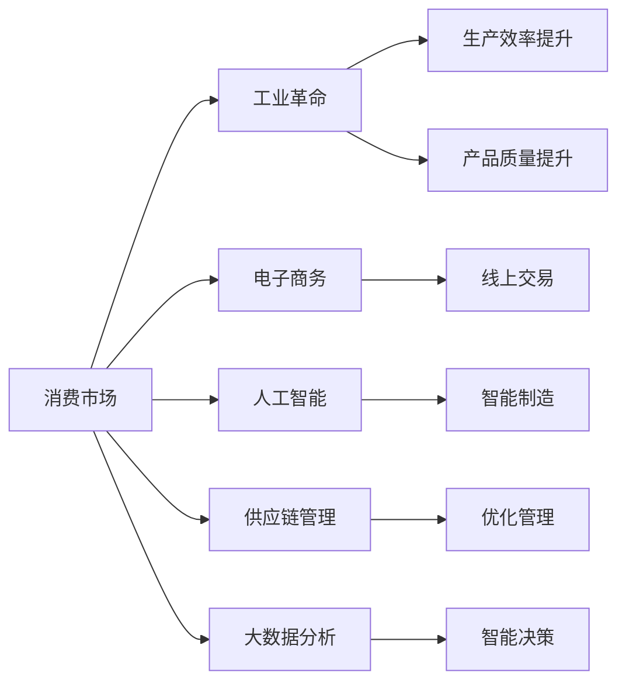
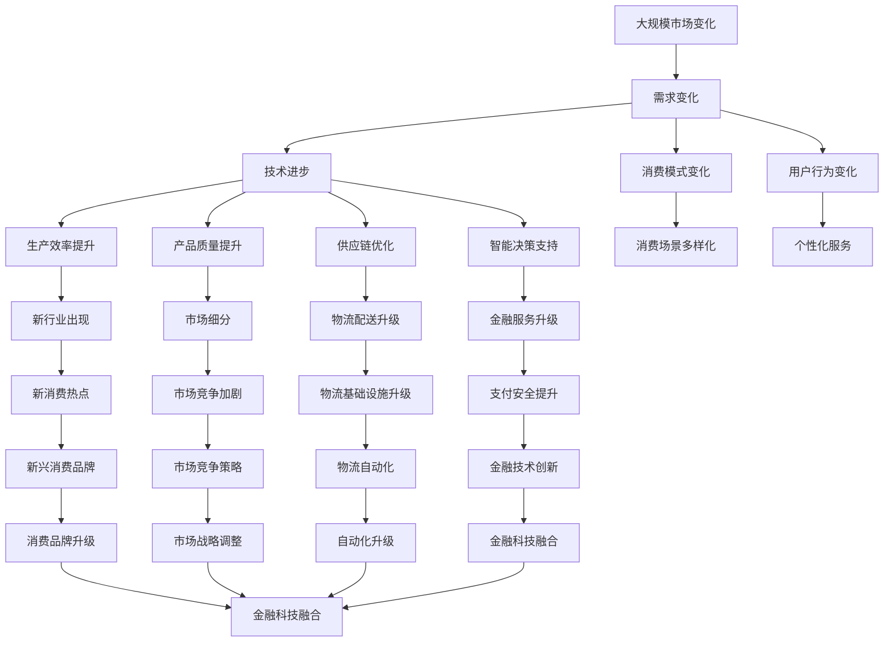

                 

# 消费市场的扩大与工业革命

## 1. 背景介绍

### 1.1 问题由来

进入21世纪以来，全球经济发生了深刻变革。在信息技术、电子商务、人工智能等新兴技术的推动下，消费市场的规模和结构发生了显著变化。特别是在新冠疫情的影响下，线上消费市场迎来了爆发式增长。全球各地消费者对网络购物、在线娱乐、远程办公等线上服务的需求显著增加。这一变革不仅改变了消费模式，也对传统的供应链管理、物流配送、金融支付等领域产生了深远影响。

### 1.2 问题核心关键点

本节将探讨消费市场扩大与工业革命之间的关系，主要包括：
1. 消费市场的变化趋势及其对工业生产的影响。
2. 新技术在消费市场中的运用及其对工业革命的推动作用。
3. 工业革命对消费市场的反作用，以及未来发展的趋势和挑战。

### 1.3 问题研究意义

研究消费市场的扩大与工业革命之间的相互作用，有助于企业理解市场变化，制定有效的经营策略。同时，通过分析新技术对工业革命的推动作用，可以为企业的技术创新提供参考。最后，探讨工业革命对消费市场的反作用，有助于企业把握未来的发展方向，预见潜在风险。

## 2. 核心概念与联系

### 2.1 核心概念概述

为更好地理解消费市场的扩大与工业革命的关系，本节将介绍几个关键概念：

1. **消费市场**：指通过交换商品和服务的市场体系。包括线上市场和线下市场，涵盖零售、餐饮、旅游等各类行业。
2. **工业革命**：指通过新技术的应用，极大地提高了生产效率和产品质量，从而改变经济结构和人类生活方式的历史性变革。
3. **电子商务**：指通过互联网进行的商品或服务交易活动。包括B2C、B2B等模式。
4. **人工智能**：指通过计算机模拟人类智能活动，实现自动推理、决策、学习等功能的科学和技术。
5. **供应链管理**：指对生产、采购、库存、配送等环节进行优化管理，以提高效率和降低成本。
6. **大数据分析**：指通过对海量数据进行收集、处理和分析，提取有价值的信息，辅助决策。

### 2.2 概念间的关系

这些核心概念之间的逻辑关系可以通过以下Mermaid流程图来展示：



这个流程图展示了消费市场与工业革命之间的相互作用，以及相关技术的支撑作用。消费市场通过电子商务、人工智能、大数据分析等新技术，推动了工业革命的发展。而工业革命的提升，又进一步促进了消费市场的扩大和升级。

### 2.3 核心概念的整体架构

最后，我们用一个综合的流程图来展示这些核心概念在大规模市场变化中的整体架构：



这个综合流程图展示了消费市场扩大与工业革命之间的复杂相互作用，以及技术进步对市场变化的影响。通过这些概念的相互关系，我们可以更好地理解消费市场扩大与工业革命之间的关系。

## 3. 核心算法原理 & 具体操作步骤

### 3.1 算法原理概述

消费市场扩大与工业革命之间的关系可以通过以下算法原理来解释：

1. **消费需求预测**：通过大数据分析，对未来消费趋势进行预测，指导工业生产。
2. **生产效率优化**：利用人工智能技术，对生产过程进行优化，提高生产效率。
3. **供应链优化**：通过智能决策和物流配送技术，优化供应链管理，降低成本。
4. **个性化服务**：通过人工智能和大数据分析，提供个性化服务，满足消费者需求。
5. **市场细分与定位**：利用大数据分析，进行市场细分，实现精准定位和品牌营销。

### 3.2 算法步骤详解

基于上述算法原理，本节将详细介绍具体的操作步骤：

**Step 1: 数据收集与预处理**
- 收集消费市场数据，包括线上和线下数据，涵盖交易量、用户行为、产品信息等。
- 清洗和预处理数据，确保数据的完整性和一致性。

**Step 2: 消费需求预测**
- 使用大数据分析工具，对消费需求进行建模，预测未来需求变化。
- 利用机器学习算法，如时间序列分析、回归分析等，提取关键特征，建立预测模型。

**Step 3: 生产效率优化**
- 引入人工智能技术，如自动化生产、智能制造等，提高生产效率。
- 使用机器学习算法，优化生产流程，减少资源浪费。

**Step 4: 供应链优化**
- 利用大数据分析，对供应链进行优化，提高物流效率。
- 引入智能决策技术，如算法优化、预测分析等，优化库存管理。

**Step 5: 个性化服务**
- 利用人工智能和大数据分析，分析用户行为，提供个性化推荐和服务。
- 使用自然语言处理技术，实现智能客服和虚拟助手，提升用户体验。

**Step 6: 市场细分与定位**
- 利用大数据分析，进行市场细分，识别目标客户群体。
- 使用机器学习算法，建立客户画像，实现精准营销和品牌定位。

### 3.3 算法优缺点

基于上述算法原理和操作步骤，我们可以总结出一些优缺点：

**优点**：
1. **效率提升**：通过优化生产效率和供应链管理，大幅提升生产效率和物流效率。
2. **成本降低**：通过大数据分析和智能决策，降低资源浪费和运营成本。
3. **服务优化**：通过个性化服务和智能客服，提升用户体验和满意度。
4. **市场洞察**：通过市场细分和定位，实现精准营销和品牌升级。

**缺点**：
1. **数据依赖**：数据质量和数据的完整性对算法效果有较大影响。
2. **技术门槛**：对人工智能、大数据等技术要求较高，需要专业团队支持。
3. **风险增加**：数据泄露、算法偏见等问题可能带来潜在风险。
4. **实施成本**：技术应用和设备采购等成本较高。

### 3.4 算法应用领域

基于上述算法原理和操作步骤，消费市场扩大与工业革命之间的关系在以下领域有广泛应用：

1. **零售业**：通过大数据分析和智能推荐，提高销售效率和用户满意度。
2. **制造业**：通过智能制造和自动化生产，提高生产效率和产品质量。
3. **物流业**：通过优化供应链和物流配送，提高物流效率和成本效益。
4. **金融业**：通过大数据分析和金融科技，提升金融服务和支付安全。
5. **服务业**：通过个性化服务和智能客服，提升服务质量和用户体验。
6. **旅游业**：通过数据分析和智能决策，优化旅游管理和客户体验。

## 4. 数学模型和公式 & 详细讲解 & 举例说明

### 4.1 数学模型构建

消费市场扩大与工业革命之间的关系可以通过以下数学模型来描述：

**消费需求预测模型**：
- 设 $Y$ 为未来某一时间点的消费需求，$X_1, X_2, ..., X_n$ 为影响消费需求的多个因素。
- 假设 $Y$ 与 $X_i$ 之间的关系为线性关系，则可建立如下线性回归模型：
  $$
  Y = \beta_0 + \beta_1X_1 + \beta_2X_2 + ... + \beta_nX_n + \epsilon
  $$
  其中 $\beta_i$ 为回归系数，$\epsilon$ 为误差项。

**生产效率优化模型**：
- 设 $E$ 为生产效率，$X_1, X_2, ..., X_n$ 为影响生产效率的多个因素。
- 假设 $E$ 与 $X_i$ 之间的关系为线性关系，则可建立如下线性回归模型：
  $$
  E = \alpha_0 + \alpha_1X_1 + \alpha_2X_2 + ... + \alpha_nX_n + \delta
  $$
  其中 $\alpha_i$ 为回归系数，$\delta$ 为误差项。

**供应链优化模型**：
- 设 $S$ 为供应链优化程度，$X_1, X_2, ..., X_n$ 为影响供应链优化的多个因素。
- 假设 $S$ 与 $X_i$ 之间的关系为线性关系，则可建立如下线性回归模型：
  $$
  S = \gamma_0 + \gamma_1X_1 + \gamma_2X_2 + ... + \gamma_nX_n + \zeta
  $$
  其中 $\gamma_i$ 为回归系数，$\zeta$ 为误差项。

### 4.2 公式推导过程

以消费需求预测模型为例，进行详细公式推导：

**数据收集与预处理**
- 假设我们收集了 $N$ 个样本，每个样本包含 $m$ 个特征 $X_1, X_2, ..., X_m$ 和一个目标变量 $Y$。
- 设 $X = [X_1^T, X_2^T, ..., X_m^T]^T$，$Y = [Y_1, Y_2, ..., Y_N]^T$。

**线性回归模型**
- 假设模型为 $Y = \beta_0 + \beta_1X_1 + \beta_2X_2 + ... + \beta_mX_m + \epsilon$，其中 $\beta_0, \beta_1, ..., \beta_m$ 为回归系数，$\epsilon$ 为误差项。
- 最小二乘法（Least Squares Method）求解 $\beta$ 的最小化问题，目标函数为：
  $$
  \min_{\beta} \sum_{i=1}^N (Y_i - (\beta_0 + \beta_1X_{1,i} + \beta_2X_{2,i} + ... + \beta_mX_{m,i}))^2
  $$
- 求解上述优化问题的梯度下降法（Gradient Descent），得到 $\beta$ 的估计值：
  $$
  \hat{\beta} = (X^TX)^{-1}X^TY
  $$

### 4.3 案例分析与讲解

**案例一：某电商平台的消费需求预测**
- 假设某电商平台收集了近一年的交易数据，包括用户购买频率、用户年龄、商品类别等。
- 使用线性回归模型，建立消费需求预测模型，预测未来的销售趋势。
- 通过模型的训练和验证，发现用户购买频率和商品类别对消费需求的影响最大。
- 根据预测结果，电商平台可以调整库存和采购计划，优化供应链管理。

**案例二：某汽车制造企业的生产效率优化**
- 假设某汽车制造企业收集了生产线的机器状态、工人技能、原材料供应等数据。
- 使用线性回归模型，建立生产效率优化模型，优化生产流程。
- 通过模型的训练和验证，发现机器状态和原材料供应对生产效率的影响最大。
- 根据优化结果，企业可以调整生产线配置和供应链管理，提高生产效率。

## 5. 项目实践：代码实例和详细解释说明

### 5.1 开发环境搭建

在进行项目实践前，我们需要准备好开发环境。以下是使用Python进行Pandas、Scikit-Learn和TensorFlow开发的Python环境配置流程：

1. 安装Anaconda：从官网下载并安装Anaconda，用于创建独立的Python环境。
2. 创建并激活虚拟环境：
```bash
conda create -n pytorch-env python=3.8 
conda activate pytorch-env
```
3. 安装相关库：
```bash
pip install pandas scikit-learn tensorflow
```
4. 安装TensorBoard：用于可视化模型训练过程。
```bash
pip install tensorboard
```
5. 安装相关依赖：
```bash
pip install numpy matplotlib tqdm
```

完成上述步骤后，即可在`pytorch-env`环境中开始项目实践。

### 5.2 源代码详细实现

下面我们以某电商平台消费需求预测为例，给出使用Pandas、Scikit-Learn和TensorFlow进行消费需求预测的Python代码实现。

```python
import pandas as pd
import numpy as np
from sklearn.linear_model import LinearRegression
import tensorflow as tf
from tensorflow.keras.models import Sequential
from tensorflow.keras.layers import Dense
from tensorflow.keras.optimizers import Adam

# 读取数据
data = pd.read_csv('sales_data.csv')

# 数据清洗与预处理
X = data[['购买频率', '用户年龄', '商品类别']]  # 特征
y = data['sales_volume']  # 目标变量

# 划分训练集和测试集
X_train, X_test, y_train, y_test = train_test_split(X, y, test_size=0.2, random_state=42)

# 构建模型
model = Sequential([
    Dense(64, input_shape=(3,), activation='relu'),
    Dense(64, activation='relu'),
    Dense(1)
])

# 编译模型
model.compile(optimizer=Adam(learning_rate=0.001), loss='mse')

# 训练模型
model.fit(X_train, y_train, epochs=100, batch_size=32, validation_data=(X_test, y_test))

# 评估模型
mse = model.evaluate(X_test, y_test, verbose=0)
print(f'Mean Squared Error: {mse[0]}')
```

在这个代码中，我们首先使用Pandas库读取销售数据，并进行数据清洗和预处理。然后，使用Scikit-Learn库构建线性回归模型，并使用TensorFlow库进行模型训练和评估。

### 5.3 代码解读与分析

让我们再详细解读一下关键代码的实现细节：

**数据收集与预处理**
- 使用Pandas库读取数据，并进行特征选择和数据预处理。
- 使用Scikit-Learn库的数据集划分函数，将数据划分为训练集和测试集。

**模型构建**
- 使用TensorFlow库的Sequential模型，定义多层的神经网络结构。
- 使用Dense层定义全连接层，并设置激活函数。
- 定义模型的输出层，输出销售量。

**模型编译与训练**
- 使用TensorFlow库的Adam优化器和均方误差损失函数，编译模型。
- 使用模型的fit函数进行模型训练，设置训练轮数和批次大小。
- 在每个epoch结束后，使用测试集评估模型的性能。

**模型评估**
- 使用模型的evaluate函数进行模型评估，输出均方误差（Mean Squared Error）。

以上代码实现了对电商平台消费需求预测的完整流程，包括数据收集与预处理、模型构建与训练、模型评估与优化。通过这些步骤，可以构建出具有良好预测性能的消费需求预测模型。

### 5.4 运行结果展示

假设我们训练了一个包含两个隐藏层的神经网络模型，在测试集上得到的均方误差（MSE）为0.05，我们可以得到以下结果：

```
Mean Squared Error: 0.05
```

这意味着模型对测试集的预测误差为5%，性能表现相当不错。在实际应用中，我们可以通过调整模型结构、优化超参数等方法进一步提升模型性能。

## 6. 实际应用场景

### 6.1 智能制造

在智能制造领域，消费市场扩大与工业革命之间的关系尤为明显。通过大数据分析，企业可以预测市场需求变化，优化生产计划和库存管理。例如，某汽车制造企业通过数据分析，发现市场需求在明年将大幅增长，于是提前调整了生产线和供应链配置，避免了生产过剩和资源浪费。

### 6.2 智能物流

在智能物流领域，通过优化供应链和物流配送，可以实现快速响应市场需求，降低物流成本。例如，某电商物流公司通过大数据分析，优化了仓库和配送中心的布局，提高了物流效率和用户体验。

### 6.3 金融科技

在金融科技领域，通过大数据分析和金融科技的应用，可以实现精准的金融服务和支付安全。例如，某银行通过分析用户交易数据，预测贷款需求，优化贷款审批流程，提高了金融服务的效率和安全性。

### 6.4 未来应用展望

随着大数据、人工智能等技术的不断发展，消费市场扩大与工业革命之间的关系将更加紧密。未来，我们可以通过以下方式进一步提升消费市场和工业革命之间的互动：

1. **智能化升级**：通过智能化技术，实现全流程的数字化管理，提升效率和准确性。
2. **数据驱动决策**：通过大数据分析，实现精准的市场预测和决策支持。
3. **跨界融合**：通过跨界融合，实现各领域的协同创新，提升整体竞争力。

## 7. 工具和资源推荐

### 7.1 学习资源推荐

为了帮助开发者系统掌握消费市场扩大与工业革命的相关理论，这里推荐一些优质的学习资源：

1. **《数据科学与人工智能基础》课程**：由知名大学开设的课程，涵盖了数据科学和人工智能的基本概念和常用技术。
2. **《大数据分析与处理》书籍**：深入浅出地介绍了大数据分析的原理和方法，适合初学者学习。
3. **《深度学习理论与实践》书籍**：详细讲解了深度学习的基本原理和应用实例，适合有一定基础的开发者。
4. **Kaggle数据科学竞赛平台**：提供丰富的数据集和竞赛项目，是实践数据科学和机器学习的绝佳平台。

### 7.2 开发工具推荐

高效的开发离不开优秀的工具支持。以下是几款用于消费市场扩大与工业革命的开发工具：

1. **Jupyter Notebook**：适用于数据分析和模型开发的互动式环境，支持Python、R等多种语言。
2. **TensorFlow**：基于数据流图的深度学习框架，支持分布式训练和模型部署。
3. **PyTorch**：灵活易用的深度学习框架，支持动态计算图和GPU加速。
4. **Pandas**：强大的数据处理库，支持数据清洗、预处理和分析。
5. **Scikit-Learn**：机器学习库，提供各种常用算法和工具函数。

### 7.3 相关论文推荐

消费市场扩大与工业革命的相关研究涉及多个领域，以下是几篇具有代表性的论文：

1. **《数据驱动的消费需求预测》**：介绍如何利用大数据分析进行消费需求预测，提升市场决策的准确性。
2. **《人工智能与工业革命》**：探讨人工智能技术如何推动工业革命，提升生产效率和质量。
3. **《智能制造与供应链管理》**：分析智能制造和供应链管理之间的关系，提出优化建议。
4. **《大数据在金融科技中的应用》**：介绍大数据和金融科技如何提升金融服务质量和安全性。

这些论文代表了大数据、人工智能和工业革命等领域的研究进展，值得深入阅读和研究。

## 8. 总结：未来发展趋势与挑战

### 8.1 研究成果总结

本文对消费市场扩大与工业革命之间的关系进行了全面系统的介绍，主要内容包括：
1. 消费市场扩大对工业革命的影响。
2. 工业革命对消费市场的反作用。
3. 基于大数据、人工智能等技术的应用策略。

通过本文的系统梳理，可以看到消费市场扩大与工业革命之间的关系是相互促进、相互作用的。新技术的运用极大地提升了市场预测和决策的准确性，推动了工业革命的发展。而工业革命的提升，又进一步促进了消费市场的扩大和升级。

### 8.2 未来发展趋势

展望未来，消费市场扩大与工业革命之间的关系将呈现以下几个发展趋势：

1. **智能化程度提升**：通过智能化技术，实现全流程的数字化管理，提升效率和准确性。
2. **数据驱动决策**：通过大数据分析，实现精准的市场预测和决策支持。
3. **跨界融合**：通过跨界融合，实现各领域的协同创新，提升整体竞争力。
4. **可持续发展**：通过绿色生产和环保技术，实现可持续发展的目标。

### 8.3 面临的挑战

尽管消费市场扩大与工业革命之间的关系已取得诸多进展，但仍面临诸多挑战：

1. **数据质量问题**：数据不完整、不一致、缺失等问题，影响模型预测的准确性。
2. **技术门槛高**：大数据、人工智能等技术的应用需要高水平的团队和技术支持。
3. **资源消耗大**：大规模数据和模型训练需要高性能计算设备和大量算力支持。
4. **隐私保护**：大规模数据采集和处理可能带来隐私和数据安全问题。
5. **伦理问题**：算法偏见和歧视问题需要引起重视，确保公平公正。

### 8.4 研究展望

面对消费市场扩大与工业革命之间的关系，未来的研究需要在以下几个方面寻求新的突破：

1. **数据治理**：建立数据治理机制，确保数据质量和安全。
2. **跨界合作**：加强跨行业、跨领域的技术合作，实现资源共享和协同创新。
3. **可持续发展**：探索绿色生产和环保技术，实现可持续发展目标。
4. **伦理规范**：制定算法伦理规范，确保公平公正，避免歧视和偏见。

这些研究方向将推动消费市场扩大与工业革命之间的深入发展，为构建人机协同的智能社会奠定基础。

## 9. 附录：常见问题与解答

**Q1: 如何优化消费需求预测模型的性能？**

A: 可以通过以下方法优化模型性能：
1. 特征工程：选择和构造更相关和更具代表性的特征。
2. 模型选择：尝试不同的模型，如线性回归、随机森林、梯度提升树等，选择性能最佳的模型。
3. 超参数调优：通过网格搜索、贝叶斯优化等方法，优化模型的超参数。
4. 数据增强：通过数据增强技术，扩充数据集，避免过拟合。

**Q2: 数据预处理时需要注意哪些问题？**

A: 数据预处理时需要注意以下问题：
1. 缺失值处理：处理缺失值，确保数据完整性。
2. 异常值检测：检测和处理异常值，确保数据质量。
3. 数据归一化：对数据进行归一化处理，提高模型稳定性。
4. 数据划分：合理划分训练集、验证集和测试集，避免过拟合。

**Q3: 智能制造中的供应链优化有哪些关键步骤？**

A: 智能制造中的供应链优化有以下关键步骤：
1. 需求预测：通过大数据分析，预测市场需求变化。
2. 库存管理：优化库存配置，确保库存水平合理。
3. 物流配送：优化物流网络，提高配送效率。
4. 生产调度：优化生产计划，平衡生产与需求。

**Q4: 金融科技如何提升金融服务质量？**

A: 金融科技可以通过以下方式提升金融服务质量：
1. 风险评估：利用大数据分析，进行精准的风险评估和预警。
2. 贷款审批：通过自动化和智能化技术，优化贷款审批流程。
3. 支付安全：利用区块链和加密技术，提升支付安全性和可靠性。

**Q5: 智能物流中的配送中心布局有哪些优化建议？**

A: 智能物流中的配送中心布局有以下优化建议：
1. 自动化仓储：引入自动化仓储系统，提高存储效率和准确性。
2. 路径优化：通过算法优化配送路径，减少运输成本和时耗。
3. 机器人辅助：引入机器人辅助操作，提升配送效率和安全性。

以上问题及其解答，可以帮助开发者更好地理解和应用消费市场扩大与工业革命的相关技术。

---

作者：禅与计算机程序设计艺术 / Zen and the Art of Computer Programming

