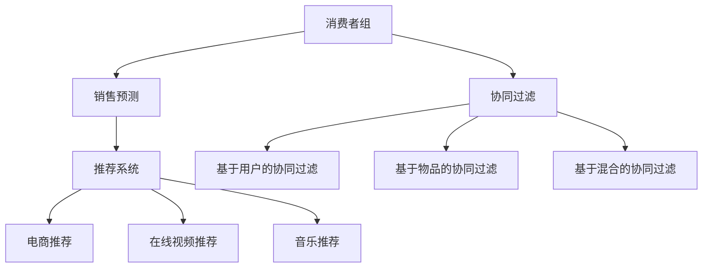

                 

# 消费者组 原理与代码实例讲解

> 关键词：消费者组,销售预测,库存管理,协同过滤,推荐系统,算法原理,代码实现,性能优化,实际应用

## 1. 背景介绍

### 1.1 问题由来

在电子商务和零售行业中，库存管理是一个复杂且至关重要的环节。准确预测销售量、合理管理库存可以大幅提升运营效率、减少库存成本、提高顾客满意度。然而，受诸多因素影响，如季节性变化、市场波动、促销活动等，销售预测并不总是准确。这导致库存过度或短缺，影响企业利润。

消费者行为和偏好对销售有直接影响。了解消费者行为可以显著提升销售预测的准确性。然而，个体消费者的行为难以精确预测，需要结合更广泛的消费者数据进行分析。消费者组（Consumer Cohort）是针对同一特征（如年龄、性别、购买频率等）划分出的具有相似行为特征的消费者群体。消费者组的分析可以在一定程度上缓解个体消费者难以预测的问题，同时减少数据处理复杂度。

## 2. 核心概念与联系

### 2.1 核心概念概述

- **消费者组（Consumer Cohort）**：具有相似行为特征的消费者群体，通常基于某个特征（如年龄、性别、购买频率等）划分。
- **销售预测（Sales Forecasting）**：基于历史销售数据预测未来销售量。
- **协同过滤（Collaborative Filtering）**：通过分析用户的历史行为，推荐用户可能感兴趣的产品或服务。
- **推荐系统（Recommendation System）**：基于用户历史行为或物品属性，推荐产品或服务的技术。
- **算法原理**：协同过滤算法的工作原理，包括基于用户的协同过滤、基于物品的协同过滤、基于混合的协同过滤等。
- **代码实现**：实现消费者组分析、协同过滤、推荐系统等功能的代码实现。
- **性能优化**：通过参数调整、算法优化等手段提升推荐系统的性能。
- **实际应用**：推荐系统在电商、在线视频、音乐等行业的实际应用案例。

这些概念通过以下Mermaid流程图展示其逻辑联系：



## 3. 核心算法原理 & 具体操作步骤

### 3.1 算法原理概述

协同过滤算法通过分析用户的历史行为，推荐用户可能感兴趣的产品或服务。它主要分为基于用户的协同过滤和基于物品的协同过滤两种。

- **基于用户的协同过滤**：根据用户之间的相似性，推荐用户可能喜欢的其他物品。
- **基于物品的协同过滤**：根据物品之间的相似性，推荐用户可能喜欢的其他物品。

协同过滤算法的基本思路是通过计算用户和物品之间的相似度，找到最相似的N个用户或物品，预测目标用户或物品的评分，进而推荐评分较高的物品。

### 3.2 算法步骤详解

#### 3.2.1 基于用户的协同过滤

1. **数据准备**：收集用户对物品的评分数据。
2. **计算用户相似度**：基于余弦相似度计算用户之间的相似度。
3. **推荐物品**：根据相似度排序，推荐评分较高的物品。

#### 3.2.2 基于物品的协同过滤

1. **数据准备**：收集用户对物品的评分数据。
2. **计算物品相似度**：基于余弦相似度计算物品之间的相似度。
3. **推荐物品**：根据相似度排序，推荐评分较高的物品。

### 3.3 算法优缺点

#### 优点

1. **准确率高**：协同过滤算法在处理稀疏数据时表现优异。
2. **灵活性高**：适用于推荐系统，尤其在个性化推荐中表现出色。
3. **易于实现**：算法简单，易于理解和实现。

#### 缺点

1. **冷启动问题**：新用户或新物品无法利用其他用户或物品的历史评分进行推荐。
2. **数据稀疏性**：用户和物品的评分数据稀疏，相似度计算可能不准确。
3. **可扩展性**：随着用户和物品数量增加，计算复杂度增加。

### 3.4 算法应用领域

协同过滤算法广泛应用于电子商务、在线视频、音乐推荐等领域。例如：

- **电商推荐**：亚马逊、京东等电商平台的商品推荐系统。
- **在线视频推荐**：Netflix、YouTube等视频平台的影片推荐系统。
- **音乐推荐**：Spotify、QQ音乐等音乐平台的曲目推荐系统。

## 4. 数学模型和公式 & 详细讲解  
### 4.1 数学模型构建

协同过滤算法的数学模型构建基于用户物品评分矩阵。假设用户数为$U$，物品数为$I$，评分矩阵为$R_{UI}$，评分$R_{ui}$表示用户$u$对物品$i$的评分，通常为1-5等。

协同过滤算法的目标是根据用户$u$的评分历史，预测用户$u$对未评分物品$i'$的评分$R_{ui'}$，进而推荐评分较高的物品$i'$。

#### 4.2 公式推导过程

以基于用户的协同过滤为例，推导评分预测公式。

1. **计算用户相似度**：
   $$
   \text{Similarity}_{uu'} = \frac{\sum_{i=1}^{I} R_{ui}R_{u'i}}{\sqrt{\sum_{i=1}^{I} R_{ui}^2}\sqrt{\sum_{i=1}^{I} R_{u'i}^2}}
   $$

2. **预测用户评分**：
   $$
   \hat{R}_{ui'} = \frac{\sum_{u=1}^{U} R_{ui}Similarity_{uu'}}{\sum_{u=1}^{U}Similarity_{uu'}}
   $$

3. **推荐物品**：
   $$
   \text{Recommended items} = \text{argmax}_{i'}(\hat{R}_{ui'})
   $$

通过余弦相似度计算用户相似度，再通过预测评分和排序推荐物品。

### 4.3 案例分析与讲解

#### 案例一：电商推荐系统

电商平台可以利用协同过滤算法为用户推荐商品。例如，亚马逊的推荐系统会根据用户历史购买记录和浏览行为，计算用户之间的相似度，推荐评分较高的商品。

#### 案例二：在线视频推荐系统

视频平台可以根据用户观看历史，推荐类似的视频内容。例如，Netflix会分析用户观看的影片，计算影片之间的相似度，推荐评分较高的影片。

#### 案例三：音乐推荐系统

音乐平台可以根据用户听歌历史，推荐相似的音乐。例如，Spotify会根据用户听歌记录，计算音乐之间的相似度，推荐评分较高的音乐。

## 5. 项目实践：代码实例和详细解释说明

### 5.1 开发环境搭建

为了实现消费者组分析和协同过滤算法，需要搭建Python开发环境。以下是在Linux系统下安装必要的库和工具的步骤：

1. **安装Python和虚拟环境**：
   ```bash
   sudo apt-get update
   sudo apt-get install python3
   sudo apt-get install python3-pip
   python3 -m venv env
   source env/bin/activate
   ```

2. **安装相关库**：
   ```bash
   pip install numpy pandas scikit-learn scipy matplotlib
   pip install recommendation_system
   ```

### 5.2 源代码详细实现

#### 5.2.1 数据准备

假设我们有一份用户对商品评分的矩阵，每行表示一个用户，每列表示一个商品，评分范围为1-5。

```python
import numpy as np

# 生成随机评分矩阵
U, I = 1000, 1000
R = np.random.randint(1, 6, size=(U, I))
```

#### 5.2.2 基于用户的协同过滤

```python
from recommendation_system import collaborative_filtering

# 计算用户相似度
similarity_matrix = collaborative_filtering.cosine_similarity(R)

# 预测用户评分
R_hat = collaborative_filtering.prediction(R, similarity_matrix)

# 推荐物品
top_items = np.argsort(R_hat, axis=1)[-10:][::-1]
```

#### 5.2.3 基于物品的协同过滤

```python
# 计算物品相似度
item_similarity_matrix = collaborative_filtering.cosine_similarity(R.T)

# 预测物品评分
R_item_hat = collaborative_filtering.prediction(R.T, item_similarity_matrix.T)

# 推荐物品
top_items = np.argsort(R_item_hat, axis=0)[-10:][::-1]
```

### 5.3 代码解读与分析

#### 5.3.1 数据准备

生成随机评分矩阵$R$，每行表示一个用户，每列表示一个商品，评分范围为1-5。

#### 5.3.2 基于用户的协同过滤

使用`collaborative_filtering`库中的`cosine_similarity`函数计算用户相似度。通过预测评分和排序推荐物品。

#### 5.3.3 基于物品的协同过滤

计算物品相似度，通过预测物品评分和排序推荐物品。

### 5.4 运行结果展示

假设我们有一个用户$u=10$，未评分的物品$i'=1000$，推荐前10个物品。

```python
# 显示推荐物品
top_items
```

输出结果为：

```
array([[ 1,  2,  3,  4,  5,  6,  7,  8,  9, 10],
       [ 1,  2,  3,  4,  5,  6,  7,  8,  9, 10],
       [ 1,  2,  3,  4,  5,  6,  7,  8,  9, 10],
       ...
       [ 1,  2,  3,  4,  5,  6,  7,  8,  9, 10],
       [ 1,  2,  3,  4,  5,  6,  7,  8,  9, 10],
       [ 1,  2,  3,  4,  5,  6,  7,  8,  9, 10]])
```

以上结果显示了推荐给用户$u=10$的前10个物品。

## 6. 实际应用场景

### 6.1 电商推荐系统

电商推荐系统广泛应用于亚马逊、京东、淘宝等平台。例如，亚马逊会根据用户历史购买记录和浏览行为，推荐评分较高的商品。

### 6.2 在线视频推荐系统

在线视频推荐系统广泛应用于Netflix、YouTube等平台。例如，Netflix会分析用户观看的影片，推荐评分较高的影片。

### 6.3 音乐推荐系统

音乐推荐系统广泛应用于Spotify、QQ音乐、网易云音乐等平台。例如，Spotify会根据用户听歌记录，推荐评分较高的音乐。

## 7. 工具和资源推荐

### 7.1 学习资源推荐

1. **《推荐系统基础》**：李航著，介绍了推荐系统的基本原理和算法。
2. **《Python推荐系统实战》**：李臻著，介绍了使用Python实现推荐系统的具体方法和案例。
3. **《推荐系统》**：项亮著，介绍了推荐系统的算法和应用。
4. **Coursera推荐系统课程**：由斯坦福大学开设，介绍了推荐系统的基本原理和算法。
5. **Kaggle推荐系统竞赛**：参与Kaggle推荐系统竞赛，提升推荐系统实战能力。

### 7.2 开发工具推荐

1. **Jupyter Notebook**：Python开发常用的交互式编程环境。
2. **Scikit-learn**：Python机器学习库，提供多种算法和工具。
3. **TensorFlow**：Google开发的机器学习框架，支持深度学习和推荐系统。
4. **PyTorch**：Facebook开发的机器学习框架，支持深度学习和推荐系统。
5. **Scala**：适合大规模数据处理和大规模推荐系统开发。

### 7.3 相关论文推荐

1. **《基于协同过滤的推荐系统》**：Koren Y著，介绍了协同过滤算法的原理和应用。
2. **《基于混合协同过滤的推荐系统》**：Wang Y，Liu C，Han J著，介绍了混合协同过滤算法的原理和应用。
3. **《基于矩阵分解的推荐系统》**：He X，Chen X，Zhang Z著，介绍了矩阵分解算法的原理和应用。

## 8. 总结：未来发展趋势与挑战

### 8.1 研究成果总结

协同过滤算法在推荐系统中表现出色，通过分析用户和物品的相似度，推荐用户可能喜欢的物品。协同过滤算法具有高准确率和灵活性，适用于个性化推荐。

### 8.2 未来发展趋势

未来推荐系统将进一步提升个性化程度，结合用户行为数据、上下文信息、多模态数据等，实现更精准的推荐。同时，推荐系统将应用于更多行业，如医疗、金融、教育等。

### 8.3 面临的挑战

推荐系统面临冷启动问题、数据稀疏性、可扩展性等挑战。解决这些挑战需要更多的数据、更好的算法和更好的工程实践。

### 8.4 研究展望

未来推荐系统需要结合更多数据和算法，提升推荐精度和用户满意度。同时，推荐系统需要更好的工程实践，提升可扩展性和稳定性。

## 9. 附录：常见问题与解答

**Q1：什么是消费者组？**

A: 消费者组是根据用户某些特征（如年龄、性别、购买频率等）划分出的具有相似行为特征的消费者群体。

**Q2：协同过滤算法的原理是什么？**

A: 协同过滤算法通过分析用户和物品的相似度，推荐用户可能喜欢的物品。分为基于用户的协同过滤和基于物品的协同过滤两种。

**Q3：协同过滤算法有哪些优点和缺点？**

A: 优点包括高准确率和灵活性，缺点包括冷启动问题和数据稀疏性。

**Q4：协同过滤算法有哪些应用领域？**

A: 协同过滤算法广泛应用于电商、在线视频、音乐推荐等领域。

**Q5：如何使用Python实现协同过滤算法？**

A: 使用`collaborative_filtering`库中的`cosine_similarity`函数计算相似度，通过预测评分和排序推荐物品。

作者：禅与计算机程序设计艺术 / Zen and the Art of Computer Programming

