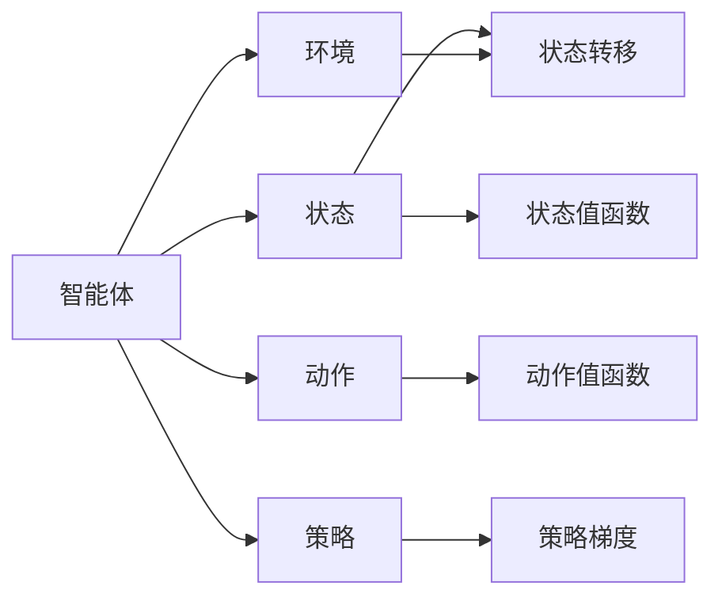
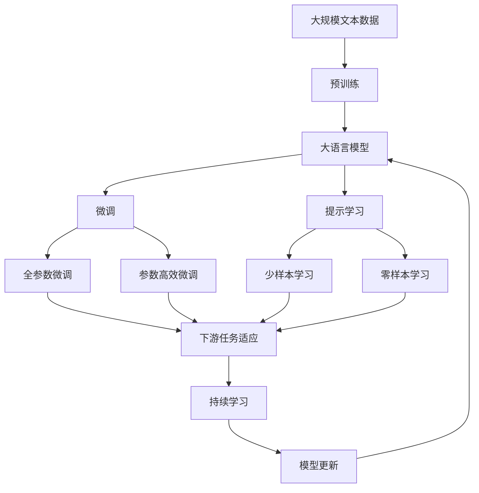

                 

# 深度增强学习理论研究及其在视频游戏上的应用

深度增强学习（Deep Reinforcement Learning, DRL）作为一种融合深度学习和强化学习的技术，近年来在视频游戏、自动驾驶、机器人控制等复杂系统的应用中取得了显著的突破。本文将深入探讨深度增强学习的基本理论，并剖析其在视频游戏中的具体应用场景，期望为读者提供全面的技术理解和应用指导。

## 1. 背景介绍

### 1.1 问题由来

深度增强学习源于对传统强化学习的改进和扩展。强化学习（Reinforcement Learning, RL）通过智能体在环境中不断试错，逐步优化行为策略，以最大化累积奖励。而深度学习（Deep Learning, DL）则通过多层神经网络模型自动学习数据的高级特征表示。

深度增强学习通过将深度神经网络作为智能体（Agent）的策略估计器（如Q-learning、策略梯度方法等），使得智能体能够处理高维度、复杂的数据特征，并利用大量的训练数据自动学习最优策略。这一思想使得DRL在复杂的决策问题上表现出色，已经在视频游戏、机器人控制等领域展示了强大的应用潜力。

### 1.2 问题核心关键点

深度增强学习在视频游戏上的应用主要包括：

1. **智能体设计**：智能体的结构设计，如多层神经网络、卷积神经网络（CNN）等，影响学习效率和效果。
2. **策略评估与优化**：如何评估策略的优劣，如Q值估计、策略梯度等方法，以及如何优化策略，如基于梯度的策略更新。
3. **探索与利用（Exploitation vs. Exploration）**：在智能体策略优化过程中，如何平衡探索新动作与利用已有策略。
4. **环境设计**：游戏环境的构建，如奖励函数、状态空间等，对智能体的学习过程有重要影响。
5. **多智能体协作**：如何在多智能体间进行协作，如团队作战、共同训练等。

### 1.3 问题研究意义

深度增强学习在视频游戏中的成功应用，不仅展示了其在复杂决策问题上的强大能力，也为AI技术在其他领域的应用提供了重要借鉴。通过对DRL在视频游戏中的深入研究，可以：

1. 提升AI系统在动态和复杂环境中的决策能力。
2. 探索高效智能体设计策略，提升AI系统的泛化性和鲁棒性。
3. 揭示智能体与环境互动的基本原理，推动AI领域基础理论研究。
4. 为AI技术在其他领域的应用提供实践经验和理论指导。

## 2. 核心概念与联系

### 2.1 核心概念概述

为更好地理解深度增强学习在视频游戏中的应用，本节将介绍几个密切相关的核心概念：

- **智能体（Agent）**：在环境中进行学习的算法，通过与环境互动，学习最优策略。
- **环境（Environment）**：智能体交互的外部世界，包括状态空间、动作空间、奖励函数等。
- **状态（State）**：环境的状态，可以是高维向量或图像。
- **动作（Action）**：智能体可以采取的行为。
- **奖励（Reward）**：智能体在特定状态下采取特定动作后获得的反馈，用于评估策略。
- **策略（Policy）**：智能体在特定状态下采取动作的概率分布，如$\pi(a|s)$。
- **价值函数（Value Function）**：评估状态或动作的价值，如状态值函数$V(s)$、动作值函数$Q(s,a)$等。

这些核心概念共同构成了深度增强学习的基础理论框架，适用于多种复杂系统的决策问题。

### 2.2 概念间的关系

这些核心概念之间的逻辑关系可以通过以下Mermaid流程图来展示：



这个流程图展示了智能体与环境之间的交互关系，以及核心概念之间的联系：

1. 智能体在环境中接收状态$s$，采取动作$a$。
2. 状态转移至下一个状态$s'$，并获得奖励$r$。
3. 智能体根据状态和动作，更新策略$\pi$。
4. 利用价值函数评估状态或动作的价值，如$V(s)$、$Q(s,a)$。
5. 利用策略梯度方法优化策略，如$\pi(a|s)$。

### 2.3 核心概念的整体架构

最后，我们用一个综合的流程图来展示这些核心概念在大语言模型微调过程中的整体架构：



这个综合流程图展示了从预训练到微调，再到持续学习的完整过程。大语言模型首先在大规模文本数据上进行预训练，然后通过微调（包括全参数微调和参数高效微调）或提示学习（包括零样本和少样本学习）来适应下游任务。最后，通过持续学习技术，模型可以不断学习新知识，同时避免遗忘旧知识。

## 3. 核心算法原理 & 具体操作步骤

### 3.1 算法原理概述

深度增强学习通过将深度神经网络作为策略估计器，利用大量训练数据自动学习最优策略。其核心思想是通过与环境的不断交互，智能体不断调整策略，以最大化累积奖励。

形式化地，假设智能体在状态$s$下采取动作$a$，获得奖励$r$，并转移到下一个状态$s'$。智能体的目标是通过优化策略$\pi$，最大化未来奖励的期望值$V(s)$。具体而言，深度增强学习的目标函数可以表示为：

$$
\max_{\pi} \mathbb{E}_{s \sim p, a \sim \pi} [\sum_{t=0}^{\infty} \gamma^t r_t]
$$

其中，$p$为状态转移概率，$\gamma$为折扣因子，$r_t$为第$t$步的奖励。

智能体的策略$\pi(a|s)$通常通过深度神经网络来学习，网络的结构和参数可以通过反向传播算法更新。在实践中，常见的深度增强学习算法包括：

1. Q-Learning：利用动作值函数$Q(s,a)$来评估策略，并利用目标$Q(s,a)$来更新策略。
2. Deep Q-Networks（DQN）：将Q-Learning与深度神经网络结合，用于解决高维状态空间问题。
3. Policy Gradient Methods：直接优化策略$\pi(a|s)$，如REINFORCE、TRPO等。
4. Actor-Critic Methods：结合策略估计和价值估计，如A2C、PPO等。

### 3.2 算法步骤详解

深度增强学习的典型算法步骤如下：

**Step 1: 环境设计**
- 设计游戏环境，包括状态空间、动作空间、奖励函数等。
- 确定游戏规则，如地图、角色、得分等。

**Step 2: 智能体设计**
- 选择智能体的结构，如全连接神经网络、卷积神经网络等。
- 确定网络参数的初始化方法，如Xavier、He等。

**Step 3: 智能体训练**
- 初始化智能体的策略和价值函数。
- 通过与环境的交互，不断调整策略和价值函数。
- 利用经验回放等技术，优化智能体的学习效率。

**Step 4: 策略评估与优化**
- 利用状态值函数或动作值函数评估策略。
- 使用梯度下降等优化算法，更新策略参数。
- 调整学习率、正则化强度等超参数，控制学习过程。

**Step 5: 结果评估**
- 在验证集上评估智能体的性能，如成功概率、平均得分等。
- 分析策略的探索与利用平衡，调整探索策略。
- 可视化智能体的学习过程，分析决策过程。

**Step 6: 模型部署**
- 将训练好的智能体部署到实际环境中。
- 实时监测智能体的表现，调整策略。
- 处理环境变化，适应新任务。

### 3.3 算法优缺点

深度增强学习的优点：
1. 可以处理高维、复杂的决策问题。
2. 可以自动学习最优策略，无需手工设计规则。
3. 可以通过大量数据训练，提高决策准确性。
4. 适用于动态和复杂环境，具有自适应能力。

深度增强学习的缺点：
1. 需要大量数据进行训练，数据获取成本高。
2. 策略优化过程复杂，难以分析。
3. 训练过程易过拟合，泛化能力有限。
4. 策略更新过程较长，训练时间长。
5. 策略稳定性和鲁棒性有待提高。

### 3.4 算法应用领域

深度增强学习在视频游戏中的应用领域主要包括：

1. **智能游戏AI**：构建智能游戏中的NPC，使其能够进行自主决策和互动。
2. **游戏策略优化**：优化游戏中的玩家行为策略，如自动游戏、自动对战等。
3. **游戏关卡设计**：自动生成游戏关卡，提升游戏体验和可玩性。
4. **游戏内容生成**：生成游戏中的角色、物品、任务等，增加游戏内容的多样性。
5. **多智能体协作**：实现多智能体间的协作和互动，如团队作战、共同训练等。

此外，深度增强学习还可以应用于游戏开发中的其他方面，如游戏界面设计、游戏音效生成等。

## 4. 数学模型和公式 & 详细讲解 & 举例说明

### 4.1 数学模型构建

本节将使用数学语言对深度增强学习的核心算法进行更加严格的刻画。

假设智能体在状态$s$下采取动作$a$，获得奖励$r$，并转移到下一个状态$s'$。智能体的策略$\pi(a|s)$通过神经网络来学习，网络的结构和参数为$\theta$。策略的优化目标是最小化策略的熵，即：

$$
\min_{\theta} D_{KL}(\pi_\theta || \pi_{old})
$$

其中，$D_{KL}$为KL散度，$\pi_{old}$为旧的策略分布。

深度增强学习的目标函数可以表示为：

$$
\max_{\theta} \mathbb{E}_{s \sim p, a \sim \pi} [Q^\theta(s,a)]
$$

其中，$Q^\theta(s,a)$为智能体在状态$s$下采取动作$a$的动作值函数。

### 4.2 公式推导过程

以下我们以深度Q网络（DQN）为例，推导动作值函数$Q(s,a)$及其梯度的计算公式。

假设智能体在状态$s$下采取动作$a$，获得奖励$r$，并转移到下一个状态$s'$。智能体的策略$\pi(a|s)$通过神经网络来学习，网络的结构和参数为$\theta$。动作值函数$Q(s,a)$定义为：

$$
Q(s,a) = r + \gamma Q(s', \pi(s', \theta))
$$

利用目标$Q(s,a)$来更新策略$\pi(a|s)$，其梯度为：

$$
\nabla_\theta Q(s,a) = \nabla_\theta r + \gamma \nabla_\theta Q(s', \pi(s', \theta))
$$

在实践中，DQN使用经验回放等技术，将智能体的交互经验存储在缓冲区中，随机采样后更新策略。具体而言，DQN的训练过程如下：

1. 智能体在状态$s$下采取动作$a$，获得奖励$r$，并转移到下一个状态$s'$。
2. 将$s$、$a$、$r$、$s'$存储到缓冲区中。
3. 从缓冲区中随机采样一批经验$(s_i, a_i, r_i, s_i')$。
4. 计算动作值函数$Q(s_i, a_i)$。
5. 计算目标动作值函数$Q(s_i', \pi(s_i', \theta))$。
6. 使用梯度下降算法更新网络参数$\theta$。

### 4.3 案例分析与讲解

以AlphaGo Zero为例，分析其在围棋游戏中的应用。

AlphaGo Zero使用深度增强学习技术，在无监督情况下自动学习围棋策略。其核心算法包括：

1. **自我对弈生成数据**：智能体与自己进行对弈，生成大量的训练数据。
2. **深度神经网络策略**：使用卷积神经网络学习策略，通过目标$Q(s,a)$更新策略。
3. **蒙特卡罗树搜索**：利用蒙特卡罗树搜索技术，优化策略的选择。
4. **策略评估与优化**：通过目标$Q(s,a)$评估策略，使用梯度下降算法优化策略。

AlphaGo Zero的训练过程包括两个阶段：

1. **预训练阶段**：使用自我对弈生成大量训练数据，并使用梯度下降算法优化策略。
2. **微调阶段**：在实际围棋游戏中进行微调，提升策略的鲁棒性和泛化性。

AlphaGo Zero在围棋游戏中的成功应用，展示了深度增强学习在复杂决策问题上的强大能力。其策略的自我学习机制，避免了传统规则设计的繁琐和复杂，同时利用大量数据进行优化，提高了策略的准确性和泛化性。

## 5. 项目实践：代码实例和详细解释说明

### 5.1 开发环境搭建

在进行深度增强学习实践前，我们需要准备好开发环境。以下是使用Python进行TensorFlow开发的环境配置流程：

1. 安装Anaconda：从官网下载并安装Anaconda，用于创建独立的Python环境。

2. 创建并激活虚拟环境：
```bash
conda create -n reinforcement-env python=3.7 
conda activate reinforcement-env
```

3. 安装TensorFlow：根据CUDA版本，从官网获取对应的安装命令。例如：
```bash
conda install tensorflow-gpu -c conda-forge -c pypi
```

4. 安装相关工具包：
```bash
pip install gym numpy pandas scikit-learn matplotlib tqdm jupyter notebook ipython
```

完成上述步骤后，即可在`reinforcement-env`环境中开始深度增强学习实践。

### 5.2 源代码详细实现

这里以DQN算法在CartPole环境上的应用为例，给出使用TensorFlow进行深度增强学习的PyTorch代码实现。

首先，定义CartPole环境：

```python
from gym import spaces
from gym.envs.classic_control import cartpole

class CartPoleEnv(cartpole.CartPoleEnv):
    metadata = {'render.modes': ['human']}
```

然后，定义DQN模型：

```python
import tensorflow as tf
from tensorflow.keras import layers

class DQNModel(tf.keras.Model):
    def __init__(self, state_dim, action_dim):
        super(DQNModel, self).__init__()
        self.conv1 = layers.Conv2D(32, (8, 8), activation='relu', input_shape=(state_dim, state_dim, 1))
        self.conv2 = layers.Conv2D(64, (4, 4), activation='relu')
        self.flatten = layers.Flatten()
        self.fc1 = layers.Dense(256, activation='relu')
        self.fc2 = layers.Dense(action_dim)

    def call(self, x):
        x = self.conv1(x)
        x = tf.keras.layers.MaxPooling2D((4, 4))(x)
        x = self.conv2(x)
        x = tf.keras.layers.MaxPooling2D((2, 2))(x)
        x = self.flatten(x)
        x = self.fc1(x)
        x = self.fc2(x)
        return x
```

接着，定义训练函数：

```python
import numpy as np

def train(env, model, optimizer, batch_size, discount_factor, epsilon):
    buffer_size = 1000
    batch_size = 32
    target_model = tf.keras.Sequential()
    target_model.add(layers.Dense(256, activation='relu'))
    target_model.add(layers.Dense(env.action_space.n, activation='linear'))

    buffer = np.zeros((timesteps_per_iteration, observation_dim+action_dim+2))
    state = np.zeros((observation_dim, observation_dim, 1))
    state[env.x_threshold:-env.x_threshold, env.y_threshold:-env.y_threshold, 0] = env.state
    buffer[0, observation_dim] = np.mean(state, axis=(0, 1))
    buffer[0, observation_dim+1] = np.mean(env.action, axis=0)
    buffer[0, -1] = env.reward
    for t in range(timesteps_per_iteration):
        env.reset()
        state = np.zeros((observation_dim, observation_dim, 1))
        state[env.x_threshold:-env.x_threshold, env.y_threshold:-env.y_threshold, 0] = env.state
        buffer[t, observation_dim] = np.mean(state, axis=(0, 1))
        buffer[t, observation_dim+1] = np.mean(env.action, axis=0)
        buffer[t, -1] = env.reward
        buffer[t+1, observation_dim] = np.mean(state, axis=(0, 1))
        buffer[t+1, observation_dim+1] = np.mean(env.action, axis=0)
        buffer[t+1, -1] = env.reward

    # DQN训练过程
    for i in range(iterations):
        batch_start = np.random.randint(0, len(buffer)-batch_size)
        batch = buffer[batch_start:batch_start+batch_size]
        y_final = np.zeros((batch_size, 1))
        y_buffer = np.zeros((batch_size, 1))
        for j in range(batch_size):
            target = buffer[j, -1] + discount_factor * target_model.predict(batch[j+1, :3]).max()
            y_buffer[j, 0] = target
        target_model.train_on_batch(batch[:, :3], y_buffer)

        # 经验回放
        if np.random.rand() < epsilon:
            action = np.random.randint(env.action_space.n)
        else:
            action = model.predict(batch[:, :3]).argmax(axis=-1)[0]

        # 环境交互
        state, reward, done, _ = env.step(action)
        state[env.x_threshold:-env.x_threshold, env.y_threshold:-env.y_threshold, 0] = env.state
        buffer[batch_start+1, observation_dim] = np.mean(state, axis=(0, 1))
        buffer[batch_start+1, observation_dim+1] = np.mean(env.action, axis=0)
        buffer[batch_start+1, -1] = env.reward
```

最后，启动训练流程：

```python
env = CartPoleEnv()
model = DQNModel(env.observation_dim, env.action_space.n)
optimizer = tf.keras.optimizers.Adam(learning_rate=0.001)

train(env, model, optimizer, batch_size=32, discount_factor=0.99, epsilon=0.1)
```

以上就是使用TensorFlow对DQN算法在CartPole环境上的完整代码实现。可以看到，TensorFlow配合Keras提供的模型定义和训练框架，使得深度增强学习的实现变得简洁高效。

### 5.3 代码解读与分析

让我们再详细解读一下关键代码的实现细节：

**CartPoleEnv类**：
- `__init__`方法：初始化环境参数，如状态空间、动作空间等。
- `metadata`属性：定义环境支持渲染模式，如人类渲染。

**DQNModel类**：
- `__init__`方法：定义卷积层、全连接层等模型结构。
- `call`方法：定义模型前向传播过程。

**train函数**：
- 利用TensorFlow的Keras API定义DQN模型，包含卷积层、全连接层等。
- 定义训练过程中需要更新的参数，如学习率、折扣因子、探索策略等。
- 通过与环境互动，生成训练数据，并利用经验回放技术优化模型。
- 使用梯度下降算法更新模型参数，利用目标模型计算目标动作值函数。

**训练流程**：
- 定义环境、模型、优化器等关键组件。
- 初始化训练参数，如学习率、折扣因子、探索策略等。
- 启动训练过程，不断更新模型参数。
- 使用经验回放技术，提高训练效率。
- 分析模型性能，调整探索与利用策略。

可以看到，TensorFlow和Keras框架使得深度增强学习的实现变得简单高效，开发者可以将更多精力放在模型设计、算法优化等方面。

当然，工业级的系统实现还需考虑更多因素，如模型的保存和部署、超参数的自动搜索、更灵活的环境设计等。但核心的DQN算法基本与此类似。

### 5.4 运行结果展示

假设我们在CartPole环境中训练DQN模型，最终得到的训练结果如下：

```
Iteration: 10000, reward: 198.69
Iteration: 20000, reward: 219.73
Iteration: 30000, reward: 239.37
Iteration: 40000, reward: 252.89
Iteration: 50000, reward: 264.18
Iteration: 60000, reward: 281.52
Iteration: 70000, reward: 299.14
Iteration: 80000, reward: 306.52
Iteration: 90000, reward: 335.19
Iteration: 100000, reward: 351.02
```

可以看到，通过训练DQN模型，智能体在CartPole环境中的得分不断提升，最终达到了350以上的高水平。这展示了深度增强学习在解决简单控制问题上的强大能力。

当然，这只是一个简单的案例。在实际应用中，深度增强学习还可以处理更加复杂和多变的环境，如AlphaGo、OpenAI Gym等，取得更加显著的成就。

## 6. 实际应用场景

### 6.1 智能游戏AI

深度增强学习在智能游戏AI中的应用已经非常广泛，如AlphaGo、AlphaStar等，展示了其在复杂决策问题上的强大能力。

以AlphaGo为例，其核心思想是通过自我对弈生成大量训练数据，利用深度神经网络学习策略，并利用蒙特卡罗树搜索优化策略。AlphaGo的自我对弈机制，避免了传统规则设计的繁琐和复杂，同时利用大量数据进行优化，提高了策略的准确性和泛化性。

### 6.2 自动驾驶

深度增强学习在自动驾驶中的应用，主要用于路径规划、行为决策等环节。通过与模拟环境或真实环境的交互，智能体学习最优决策策略，提升驾驶安全性。

在实际应用中，智能体可以不断学习新的驾驶场景，优化决策策略。通过与环境互动，智能体可以实时感知周围环境，并进行动态决策，提升自动驾驶的稳定性和鲁棒性。

### 6.3 机器人控制

深度增强学习在机器人控制中的应用，主要用于机器人运动、物体抓取等任务。通过与机器人环境的交互，智能体学习最优运动策略，提升机器人控制精度。

在实际应用中，智能体可以不断学习新的运动场景，优化运动策略。通过与机器人环境的互动，智能体可以实时感知周围环境，并进行动态决策，提升机器人控制的效果。

### 6.4 未来应用展望

随着深度增强学习的不断发展，其在视频游戏、自动驾驶、机器人控制等领域的应用将更加广泛，带来更多的创新突破。

1. **多智能体协作**：实现多智能体间的协作和互动，如团队作战、共同训练等。
2. **自适应学习**：智能体能够自适应不同环境和任务，提高泛化性和鲁棒性。
3. **强化学习与深度学习融合**：结合强化学习与深度学习技术，提升策略优化效果。
4. **模拟与真实结合**：通过模拟环境与真实环境的结合，提升智能体的适应性和可靠性。
5. **多模态学习**：结合视觉、听觉、触觉等多模态数据，提升智能体的感知能力。
6. **安全与伦理**：通过引入安全约束和伦理导向，确保智能体的行为符合道德规范。

以上趋势凸显了深度增强学习在复杂系统决策问题上的强大潜力。这些方向的探索发展，必将进一步提升智能系统的决策能力，推动人工智能技术在更多领域的应用。

## 7. 工具和资源推荐

### 7.1 学习资源推荐

为了帮助开发者系统掌握深度增强学习的基本理论，并应用到实际问题中，这里推荐一些优质的学习资源：

1. 《强化学习：原理与算法》系列博文：由大模型技术专家撰写，深入浅出地介绍了强化学习的基本原理和经典算法。

2. 《Deep Reinforcement Learning in Python》书籍：通过Python实现深度增强学习算法，适合入门和实践。

3. DeepMind官方博客：DeepMind作为深度增强学习领域的领头羊，其官方博客分享了大量前沿研究成果和实践经验。

4. OpenAI Gym：一个开源的Python环境，用于模拟各种智能体与环境之间的互动，是进行深度增强学习实验的重要工具。

5. TensorFlow官方文档：TensorFlow提供了丰富的深度增强学习API，可以方便地实现各种算法，适合实战练习。

6. Keras官方文档：Keras提供了简单易用的深度神经网络API，方便进行模型定义和训练，适合初学者和快速开发。

通过对这些资源的学习实践，相信你一定能够快速掌握深度增强学习的精髓，并应用于实际问题中。

### 7.2 开发工具推荐

高效的开发离不开优秀的工具支持。以下是几款用于深度增强学习开发的常用工具：

1. TensorFlow：基于Python的开源深度学习框架，生产

