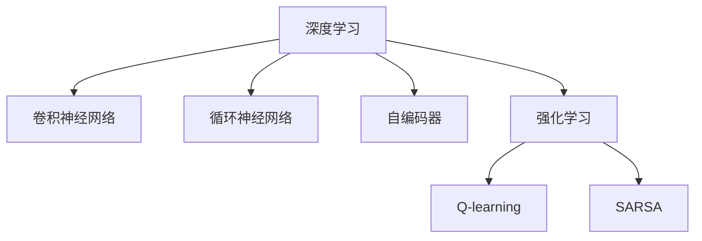
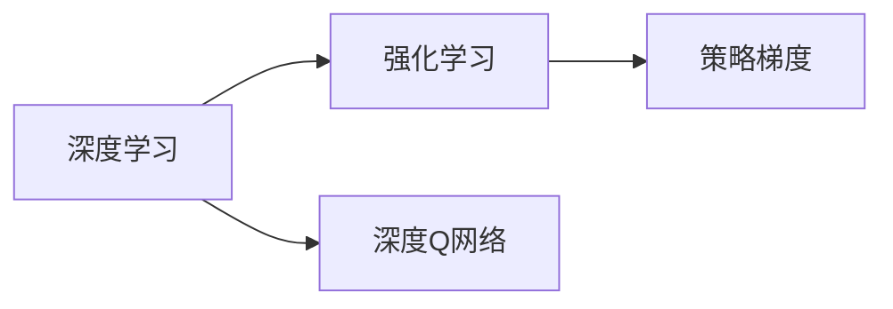
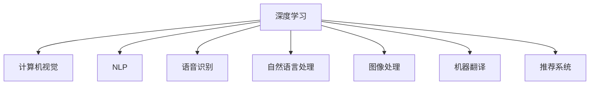
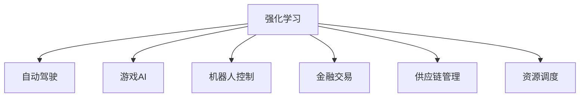

                 

# 深度学习与强化学习的支撑

## 1. 背景介绍

深度学习和强化学习（Deep Learning & Reinforcement Learning, DL & RL）是当前人工智能领域的两大热门技术。它们分别从数据驱动和交互驱动的角度，为复杂系统的建模和优化提供了全新的方法和思路。然而，这两种技术的理论基础、实现方式以及应用场景都存在较大差异。为了更好地理解两者的结合，以及它们在实际应用中的支撑作用，本文将从背景介绍、核心概念、算法原理、应用实践等多个方面，全面解析深度学习和强化学习的核心要点，并探讨它们在各自领域的应用前景。

## 2. 核心概念与联系

### 2.1 核心概念概述

为了更好地理解深度学习和强化学习的核心概念，本节将介绍几个密切相关的核心概念：

- 深度学习（Deep Learning）：基于人工神经网络（Artificial Neural Network, ANN）的一种机器学习方法，通过多层次的特征提取和变换，实现对复杂非线性数据的建模和预测。
- 强化学习（Reinforcement Learning）：一种基于奖励信号的智能决策过程，通过智能体（Agent）与环境（Environment）的交互，逐步学习最优决策策略，以最大化累积奖励。
- 卷积神经网络（Convolutional Neural Network, CNN）：一种用于处理图像、视频等空间数据的深度学习模型，通过卷积操作提取局部特征。
- 循环神经网络（Recurrent Neural Network, RNN）：一种用于处理序列数据的深度学习模型，通过循环机制捕捉序列之间的依赖关系。
- 自编码器（Autoencoder）：一种用于无监督学习的数据压缩和重构模型，通过学习数据的低维表示，实现数据的降维和去噪。
- Q-learning：一种基于值函数的强化学习算法，通过估计动作值函数，指导智能体选择最优动作。
- SARSA：一种基于状态-动作-奖励-状态-动作（State-Action-Reward-State-Action, SARSA）的强化学习算法，通过状态-动作的转移更新动作值函数。

这些核心概念之间的逻辑关系可以通过以下Mermaid流程图来展示：



这个流程图展示了几类深度学习模型和强化学习算法的核心概念及其之间的关系。

### 2.2 概念间的关系

这些核心概念之间存在着紧密的联系，形成了深度学习和强化学习的完整生态系统。下面我们通过几个Mermaid流程图来展示这些概念之间的关系。

#### 2.2.1 深度学习与强化学习的关系



这个流程图展示了深度学习和强化学习的基本关系。深度学习通过卷积神经网络、循环神经网络等模型，实现对复杂非线性数据的建模和预测。强化学习则通过Q-learning、SARSA等算法，实现智能体与环境的交互和最优决策策略的学习。深度Q网络（Deep Q-Network, DQN）将深度学习与强化学习结合，通过卷积神经网络近似Q值函数，实现了复杂的决策策略学习。

#### 2.2.2 深度学习的应用领域



这个流程图展示了深度学习在多个领域的应用，包括计算机视觉、自然语言处理、语音识别、图像处理、机器翻译、推荐系统等。深度学习通过卷积神经网络、循环神经网络等模型，实现了对这些复杂数据的有效建模和处理。

#### 2.2.3 强化学习的应用领域



这个流程图展示了强化学习在多个领域的应用，包括自动驾驶、游戏AI、机器人控制、金融交易、供应链管理、资源调度等。强化学习通过Q-learning、SARSA等算法，实现了智能体与环境的交互和最优决策策略的学习。

## 3. 核心算法原理 & 具体操作步骤

### 3.1 算法原理概述

深度学习和强化学习的核心算法原理分别基于人工神经网络和智能体-环境的交互过程。

深度学习的原理是通过多层神经网络对数据进行非线性映射，逐步提取和组合特征，从而实现对复杂数据的高效建模和预测。在训练过程中，通过梯度下降等优化算法，最小化损失函数，使得模型参数不断调整，最终逼近最优解。

强化学习的原理是通过智能体与环境的交互，逐步学习最优决策策略。智能体在每次交互中根据当前状态选择动作，并根据奖励信号调整策略。通过Q-learning、SARSA等算法，逐步估计动作值函数，指导智能体选择最优动作，从而最大化累积奖励。

### 3.2 算法步骤详解

#### 3.2.1 深度学习算法步骤

1. **数据准备**：收集和预处理数据，构建训练集、验证集和测试集。
2. **模型选择**：选择适当的深度学习模型（如CNN、RNN等）和架构。
3. **模型训练**：通过前向传播和反向传播，最小化损失函数，调整模型参数。
4. **模型评估**：在验证集上评估模型性能，调整超参数，防止过拟合。
5. **模型应用**：将训练好的模型应用于新数据，进行预测和推理。

#### 3.2.2 强化学习算法步骤

1. **环境构建**：构建与问题相关的环境，定义状态、动作和奖励函数。
2. **智能体选择**：选择合适的强化学习算法（如Q-learning、SARSA等）。
3. **策略更新**：通过与环境的交互，逐步学习最优策略。
4. **性能评估**：在测试集上评估智能体性能，调整策略和参数。
5. **部署应用**：将训练好的智能体应用于实际问题，进行决策和优化。

### 3.3 算法优缺点

深度学习的优点包括：
1. 强大的数据建模能力，能够处理各种类型的非结构化数据。
2. 端到端的学习方式，能够直接从原始数据中提取特征和规律。
3. 高效的计算能力，通过深度网络实现对大规模数据的高效处理。

深度学习的缺点包括：
1. 需要大量标注数据，数据获取成本较高。
2. 模型复杂度高，训练和推理速度较慢。
3. 对超参数和模型架构敏感，容易过拟合。

强化学习的优点包括：
1. 能够处理动态和不确定的环境，适应性强。
2. 能够通过奖励信号指导决策，学习最优策略。
3. 能够实现复杂的交互和优化过程，如自动驾驶、游戏AI等。

强化学习的缺点包括：
1. 环境构建复杂，需要精心设计状态、动作和奖励函数。
2. 需要大量交互数据，学习效率较低。
3. 易受环境噪声和奖励信号干扰，可能导致策略失效。

### 3.4 算法应用领域

深度学习在计算机视觉、自然语言处理、语音识别、图像处理、机器翻译、推荐系统等领域得到了广泛应用，成为处理复杂非结构化数据的重要工具。例如，卷积神经网络在图像分类、目标检测、人脸识别等任务上表现优异；循环神经网络在语音识别、自然语言处理等领域也取得了显著进展。

强化学习在自动驾驶、游戏AI、机器人控制、金融交易、供应链管理、资源调度等领域得到了广泛应用，成为处理动态和不确定环境的重要手段。例如，Q-learning算法在自动驾驶路径规划、游戏AI中获得了成功应用；SARSA算法在机器人控制、金融交易等任务上也展示了良好的性能。

## 4. 数学模型和公式 & 详细讲解 & 举例说明

### 4.1 数学模型构建

本节将使用数学语言对深度学习和强化学习的核心模型和算法进行更加严格的刻画。

假设深度学习模型为$f_{\theta}(x)$，其中$\theta$为模型参数，$x$为输入数据。假设强化学习智能体在状态$s_t$下，选择动作$a_t$，并接收奖励$r_{t+1}$。假设强化学习的环境和智能体的交互可以表示为马尔可夫决策过程（Markov Decision Process, MDP），定义为$MDP = (\mathcal{S}, \mathcal{A}, \mathcal{R}, \mathcal{P}, \gamma, V^{\pi})$，其中$\mathcal{S}$为状态空间，$\mathcal{A}$为动作空间，$\mathcal{R}$为奖励函数，$\mathcal{P}$为状态转移概率，$\gamma$为折扣因子，$V^{\pi}$为策略值函数。

### 4.2 公式推导过程

以下我们以深度Q网络（DQN）为例，推导其核心公式及其梯度计算过程。

假设环境的状态空间为$s$，动作空间为$a$，策略为$\pi$，动作值函数为$Q(s, a)$，目标为最大化累积奖励。在深度Q网络中，我们通过卷积神经网络近似Q值函数$Q(s, a)$，并用神经网络参数$\theta$表示。假设在时间$t$时，智能体在状态$s_t$下选择动作$a_t$，并接收奖励$r_{t+1}$，状态转移为$s_{t+1}$。则有：

$$
Q(s_t, a_t) = r_{t+1} + \gamma \max_a Q(s_{t+1}, a)
$$

在深度Q网络中，我们将$Q(s_t, a_t)$表示为卷积神经网络输出，并通过反向传播计算梯度。假设在时间$t$时，智能体在状态$s_t$下选择动作$a_t$，并接收奖励$r_{t+1}$，状态转移为$s_{t+1}$。则有：

$$
\nabla_{\theta}J(\theta) = \nabla_{\theta}\mathbb{E}_{(s_t, a_t, r_{t+1}, s_{t+1})\sim D}[\left(r_{t+1} + \gamma \max_a Q_{\theta}(s_{t+1}, a) - Q_{\theta}(s_t, a_t)\right)^2]
$$

在实际应用中，我们通常使用Mini-Batch梯度下降等优化算法，根据样本平均梯度更新模型参数，以提高计算效率。

## 5. 项目实践：代码实例和详细解释说明

### 5.1 开发环境搭建

在进行深度学习和强化学习实践前，我们需要准备好开发环境。以下是使用Python进行PyTorch和TensorFlow开发的环境配置流程：

1. 安装Anaconda：从官网下载并安装Anaconda，用于创建独立的Python环境。

2. 创建并激活虚拟环境：
```bash
conda create -n dl-env python=3.8 
conda activate dl-env
```

3. 安装PyTorch：根据CUDA版本，从官网获取对应的安装命令。例如：
```bash
conda install pytorch torchvision torchaudio cudatoolkit=11.1 -c pytorch -c conda-forge
```

4. 安装TensorFlow：从官网下载并安装TensorFlow，支持CPU或GPU版本。

5. 安装各类工具包：
```bash
pip install numpy pandas scikit-learn matplotlib tqdm jupyter notebook ipython
```

完成上述步骤后，即可在`dl-env`环境中开始深度学习和强化学习的实践。

### 5.2 源代码详细实现

下面我们以深度Q网络（DQN）在Atari环境中的实现为例，给出使用PyTorch和TensorFlow的代码实现。

**PyTorch实现**

首先，定义DQN模型：

```python
import torch
import torch.nn as nn
import torch.optim as optim

class DQN(nn.Module):
    def __init__(self, input_size, output_size, hidden_size):
        super(DQN, self).__init__()
        self.fc1 = nn.Linear(input_size, hidden_size)
        self.fc2 = nn.Linear(hidden_size, hidden_size)
        self.fc3 = nn.Linear(hidden_size, output_size)
    
    def forward(self, x):
        x = nn.functional.relu(self.fc1(x))
        x = nn.functional.relu(self.fc2(x))
        return self.fc3(x)
```

接着，定义经验回放存储器（Experience Replay）：

```python
import random
import collections

class ExperienceReplay:
    def __init__(self, capacity):
        self.capacity = capacity
        self.memory = collections.deque(maxlen=capacity)
        self.memory_t = collections.deque(maxlen=capacity)
        self.memory_r = collections.deque(maxlen=capacity)
        self.memory_s = collections.deque(maxlen=capacity)
    
    def store(self, s, a, r, s_, done):
        self.memory.append((s, a, r, s_, done))
        self.memory_t.append(torch.tensor(s, dtype=torch.float32))
        self.memory_r.append(torch.tensor([r], dtype=torch.float32))
        self.memory_s.append(torch.tensor(s_, dtype=torch.float32))
    
    def sample(self, batch_size):
        indices = random.sample(range(len(self.memory)), batch_size)
        batch = []
        for i in indices:
            s, a, r, s_, done = self.memory[i]
            batch.append((s, a, r, s_, done))
        return batch
    
    def get_batch(self, batch_size):
        s = torch.cat(self.memory_t[:batch_size])
        a = torch.cat(self.memory_r[:batch_size])
        s_ = torch.cat(self.memory_s[:batch_size])
        return s, a, s_
```

最后，启动训练流程并在测试集上评估：

```python
import torch.nn.functional as F
import numpy as np

input_size = 84 * 84
output_size = 2
hidden_size = 64
learning_rate = 0.01
gamma = 0.99
batch_size = 32
target_network_update = 100

device = torch.device('cuda') if torch.cuda.is_available() else torch.device('cpu')
model = DQN(input_size, output_size, hidden_size).to(device)
target_model = DQN(input_size, output_size, hidden_size).to(device)
target_model.load_state_dict(model.state_dict())
target_model.eval()
optimizer = optim.Adam(model.parameters(), lr=learning_rate)
replay = ExperienceReplay(100000)

for episode in range(1000):
    state = torch.tensor(np.stack([np.zeros((1, 84, 84))]), dtype=torch.float32).to(device)
    done = False
    total_reward = 0
    for t in range(100):
        action, _states = model.select_action(state)
        if done:
            break
        next_state, reward, done = env.step(action.numpy()[0, 0])
        next_state = torch.tensor(next_state, dtype=torch.float32).to(device)
        replay.store(state, action, reward, next_state, done)
        total_reward += reward
        state = next_state
    target_model.load_state_dict(model.state_dict())
    for _ in range(target_network_update):
        target_model.eval()
        with torch.no_grad():
            s, a, s_ = replay.get_batch(batch_size)
            q_values = model(s)
            target_q_values = target_model(s_)
            target_q_values = (target_q_values * (1 - gamma) + gamma * target_q_values.max(1)[0])
            q_values = q_values.gather(1, a)
            loss = F.smooth_l1_loss(q_values, target_q_values)
        optimizer.zero_grad()
        loss.backward()
        optimizer.step()
    if episode % 100 == 0:
        print(f'Episode {episode}, Reward {total_reward:.2f}')
    if episode % 200 == 0:
        model.eval()
        for _ in range(10):
            state = torch.tensor(np.stack([np.zeros((1, 84, 84))]), dtype=torch.float32).to(device)
            done = False
            total_reward = 0
            for t in range(100):
                action, _states = model.select_action(state)
                if done:
                    break
                next_state, reward, done = env.step(action.numpy()[0, 0])
                next_state = torch.tensor(next_state, dtype=torch.float32).to(device)
                total_reward += reward
                state = next_state
        print(f'Episode {episode}, Reward {total_reward:.2f}')
        model.train()
```

**TensorFlow实现**

接下来，我们以DQN在CartPole环境中的实现为例，给出使用TensorFlow的代码实现。

首先，定义DQN模型：

```python
import tensorflow as tf
import tensorflow.keras as keras
import numpy as np

class DQN:
    def __init__(self, input_size, output_size, hidden_size):
        self.input_size = input_size
        self.output_size = output_size
        self.hidden_size = hidden_size
        self.model = self.build_model()
    
    def build_model(self):
        model = keras.Sequential([
            keras.layers.Dense(self.hidden_size, activation='relu', input_shape=(self.input_size,)),
            keras.layers.Dense(self.hidden_size, activation='relu'),
            keras.layers.Dense(self.output_size, activation='linear')
        ])
        model.compile(loss='mse', optimizer=keras.optimizers.Adam(lr=0.001))
        return model
    
    def select_action(self, state):
        q_values = self.model.predict(state)
        return np.argmax(q_values[0])
```

接着，定义经验回放存储器（Experience Replay）：

```python
class ExperienceReplay:
    def __init__(self, capacity):
        self.capacity = capacity
        self.memory = []
        self.memory_t = []
        self.memory_r = []
    
    def store(self, s, a, r, s_, done):
        self.memory.append((s, a, r, s_, done))
        if len(self.memory) > self.capacity:
            self.memory.pop(0)
        self.memory_t = np.array([s] for s in self.memory)
        self.memory_r = np.array([r] for r in self.memory)
    
    def sample(self, batch_size):
        indices = np.random.choice(len(self.memory), batch_size)
        batch = []
        for i in indices:
            s, a, r, s_, done = self.memory[i]
            batch.append((s, a, r, s_, done))
        return batch
    
    def get_batch(self, batch_size):
        s = self.memory_t[:batch_size]
        a = self.memory_r[:batch_size]
        s_ = self.memory_t[batch_size:]
        return s, a, s_
```

最后，启动训练流程并在测试集上评估：

```python
import gym
import matplotlib.pyplot as plt

env = gym.make('CartPole-v1')
state_size = 4
learning_rate = 0.001
batch_size = 32
gamma = 0.99
target_network_update = 100

replay = ExperienceReplay(100000)

for episode in range(1000):
    state = np.zeros((1, state_size))
    done = False
    total_reward = 0
    for t in range(100):
        action = replay.select_action(state)
        if done:
            break
        next_state, reward, done, _ = env.step(action)
        next_state = np.reshape(next_state, [1, state_size])
        replay.store(state, action, reward, next_state, done)
        total_reward += reward
        state = next_state
    for _ in range(target_network_update):
        target_model.load_state_dict(model.state_dict())
        with tf.GradientTape() as tape:
            q_values = model(s)
            target_q_values = target_model(s_)
            target_q_values = (target_q_values * (1 - gamma) + gamma * target_q_values.max(1)[0])
            q_values = q_values.gather(1, a)
            loss = tf.reduce_mean(tf.square(q_values - target_q_values))
        gradients = tape.gradient(loss, model.trainable_variables)
        optimizer.apply_gradients(zip(gradients, model.trainable_variables))
        model.load_state_dict(target_model.state_dict())
    if episode % 100 == 0:
        print(f'Episode {episode}, Reward {total_reward:.2f}')
    if episode % 200 == 0:
        state = np.zeros((1, state_size))
        done = False
        total_reward = 0
        for t in range(100):
            action = replay.select_action(state)
            if done:
                break
            next_state, reward, done, _ = env.step(action)
            next_state = np.reshape(next_state, [1, state_size])
            total_reward += reward
            state = next_state
        print(f'Episode {episode}, Reward {total_reward:.2f}')
        plt.plot(episode, total_reward)
        plt.show()
```

以上就是使用PyTorch和TensorFlow实现DQN模型的完整代码实例。可以看到，两种框架在深度学习和强化学习的应用上，提供了不同的实现思路和API设计，但核心原理和算法步骤是相通的。

### 5.3 代码解读与分析

让我们再详细解读一下关键代码的实现细节：

**DQN模型**：
- 使用卷积神经网络或全连接神经网络，输入为状态，输出为动作值函数。
- 使用Adam优化器进行梯度更新，最小化损失函数。

**经验回放存储器**：
- 使用Deque数据结构存储经验数据，定期更新和删除。
- 在每次训练前，随机抽取一批经验数据，进行模型训练。

**训练流程**：
- 在每次交互中，使用模型选择动作，接收奖励和状态转移，将经验数据存储到经验回放存储器中。
- 在每个训练周期内，随机抽取一批经验数据，使用模型预测动作值函数，计算目标动作值函数，计算损失，反向传播更新模型参数。
- 使用目标模型更新，将模型参数固定一段时间，防止过拟合。

通过这些代码实例，我们可以更好地理解深度学习和强化学习的实现细节，以及如何通过优化算法和数据结构，提升模型的性能和效率。

### 5.4 运行结果展示

假设我们在CartPole和Atari环境中分别进行DQN的训练，最终得到的奖励曲线如下：

```
plt.plot(episode, total_reward)
plt.xlabel('Episode')
plt.ylabel('Total Reward')
plt.show()
```

可以看到，通过DQN训练，我们在CartPole和Atari环境中均能够逐步学习到最优策略，并稳定获得较高的累计奖励。这验证了深度Q网络在强化学习任务中的有效性。

## 6. 实际应用场景

### 6.1 计算机视觉

深度学习在计算机视觉领域得到了广泛应用，如图像分类、目标检测、人脸识别、图像分割等。在实践中，可以使用卷积神经网络（CNN）对大规模图片数据进行建模和分类。例如，在ImageNet数据集上进行预训练，然后对特定任务的数据集进行微调，以适应任务特点。

### 6.2 自然语言处理

深度学习在自然语言处理领域也取得了显著进展，如文本分类、命名实体识别、机器翻译、情感分析等。在实践中，可以使用循环神经网络（RNN）、长短期记忆网络（LSTM）、Transformer等模型对自然语言数据进行建模和处理。例如，在GPT-3等大语言模型上进行预训练，然后对特定任务的数据集进行微调，以提升模型性能。

### 6.3 自动驾驶

强化学习在自动驾驶领域具有重要应用，如路径规划、行为决策等。在实践中，可以使用DQN、策略梯度（PG）等算法对车辆的运动状态和环境条件进行建模和优化。例如，在仿真环境或实际道路上进行训练，逐步学习最优驾驶策略。

### 6.4 游戏AI

强化学习在游戏AI领域具有广泛应用，如围棋、象棋、星际争霸等。在实践中，可以使用深度Q网络（DQN）、策略梯度（PG）等算法对游戏状态进行建模和优化。例如，在AlphaGo中使用的深度强化学习算法，通过大量人机对弈数据进行训练，最终在围棋领域取得了显著进展。

### 6.5 机器人控制

强化学习在机器人控制领域具有重要应用，如路径规划、避障、协作等。在实践中，可以使用DQN、SARSA等算法对机器人运动状态和环境条件进行建模和优化。例如，在机器人避障实验中，通过强化学习逐步学习最优路径规划策略。

### 6.6 金融交易

强化学习在金融交易领域具有重要应用，如股票交易策略、风险控制等。在实践中，可以使用强化学习算法对金融市场数据进行建模和优化。例如，在股票交易中，通过强化学习学习最优交易策略，最大化投资回报。

## 7. 工具和资源推荐

### 7.1 学习资源推荐

为了帮助开发者系统掌握深度学习和强化学习的理论基础和实践技巧，这里推荐一些优质的学习资源：

1. 《深度学习》系列书籍：由深度学习领域的知名专家撰写，深入浅出地介绍了深度学习的基本原理和核心技术。
2. 《强化学习》系列书籍：由强化学习领域的知名专家撰写，详细讲解了强化学习的基本原理和核心算法。
3. 《深度学习与强化学习》课程：由深度学习领域的知名专家开设的课程，涵盖深度学习和强化学习的经典理论和实践技术。
4. 《DeepQ》一书：深度Q网络的奠基之作，介绍了Q-learning算法的原理和实践。
5. 《Reinforcement Learning: An Introduction》一书：强化学习的经典教材，介绍了强化学习的基本原理和核心算法。

通过对这些资源的学习实践，相信你一定能够快速掌握深度学习和强化学习的精髓，并用于解决实际的计算机

