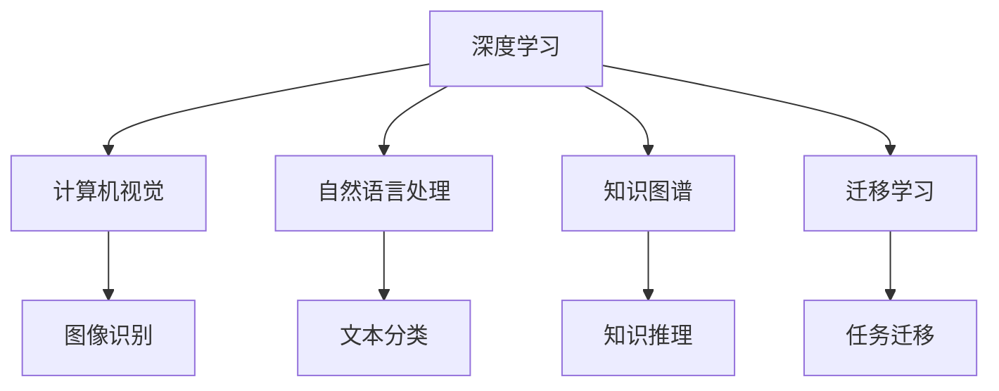
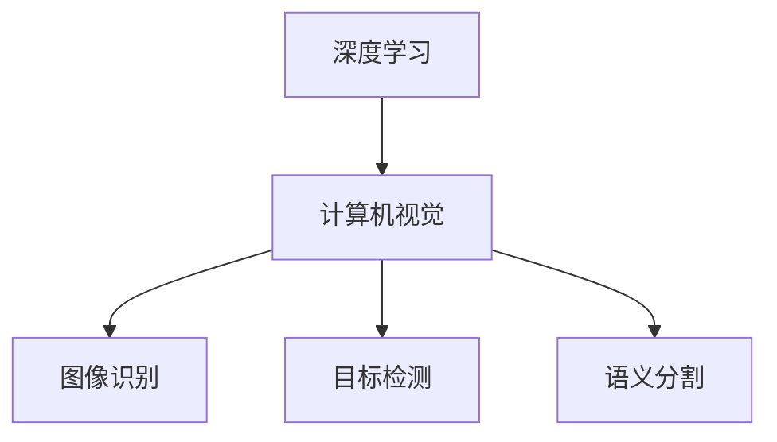
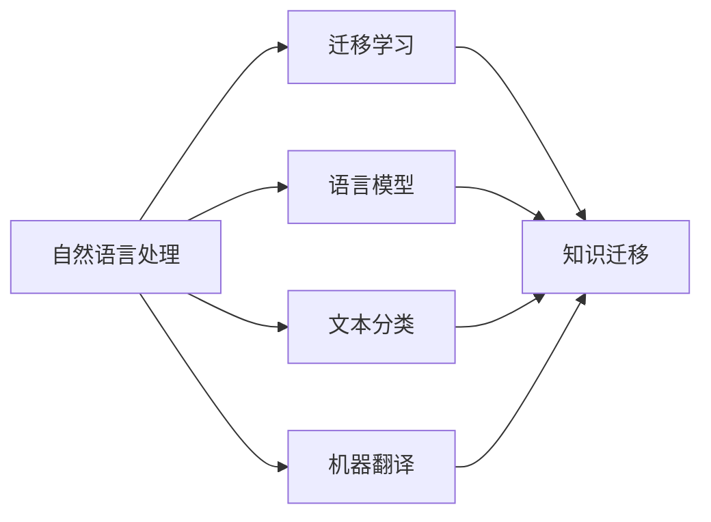
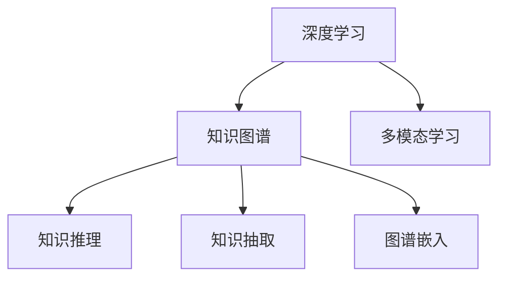
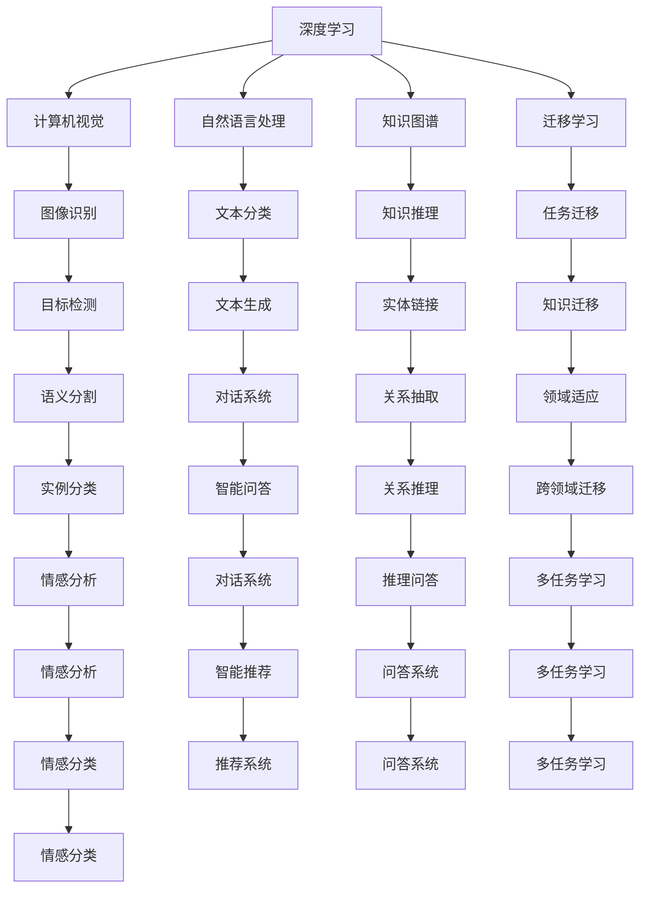

                 

## 1. 背景介绍

### 1.1 问题由来

随着人工智能技术的快速发展，清华大学在人工智能领域的研究和探索也取得了显著进展。作为中国顶尖高等学府之一，清华大学不仅在基础研究上做出了重要贡献，而且在实际应用上也取得了显著成果。清华大学的人工智能研究历程，不仅反映了学术界在理论创新和算法突破方面的不懈追求，也展示了清华大学在推动人工智能技术落地应用方面的独特作用。

### 1.2 问题核心关键点

清华大学的人工智能研究历程，可以大致分为以下几个关键阶段：

1. **早期探索**：20世纪80年代至90年代，清华大学开始关注人工智能的基本理论和技术，积极参与国内外学术交流，培养了一批优秀的研究人员。
2. **技术突破**：21世纪初，清华大学在深度学习、计算机视觉、自然语言处理等领域取得了一系列重要成果，奠定了其在人工智能领域的领先地位。
3. **应用拓展**：近年来，清华大学不断推动人工智能技术在医疗、金融、教育等实际应用场景中的落地，促进了人工智能技术的广泛应用。

### 1.3 问题研究意义

清华大学在人工智能领域的研究，对于推动我国人工智能技术的发展，提升国家的科技竞争力，具有重要意义：

1. **提升国家科技竞争力**：通过在深度学习、计算机视觉、自然语言处理等前沿领域的研究，清华大学为我国科技发展提供了重要支撑。
2. **推动技术落地应用**：通过实际项目和工程实践，清华大学将人工智能技术转化为实际应用，为各行各业带来了创新动力。
3. **培养高素质人才**：清华大学在人工智能领域的教育培训，培养了一批优秀的科研和工程人才，为我国的人工智能事业提供了坚实的人才保障。
4. **促进学科交叉融合**：清华大学的人工智能研究，促进了与其他学科的交叉融合，推动了多学科协同创新。

## 2. 核心概念与联系

### 2.1 核心概念概述

为了更好地理解清华大学人工智能研究历程的核心概念，本节将介绍几个关键概念：

- **深度学习**：一种基于神经网络的机器学习方法，通过多层非线性变换，能够从数据中自动提取特征，并进行高效分类和预测。
- **计算机视觉**：研究如何让计算机理解和处理视觉信息，如图像、视频等，包括图像识别、目标检测、语义分割等任务。
- **自然语言处理**：研究如何让计算机理解和生成自然语言，包括语言模型、文本分类、机器翻译、对话系统等。
- **知识图谱**：一种结构化的语义表示方法，用于组织和关联知识，支持问答系统、推荐系统等应用。
- **迁移学习**：一种通过已有知识来加速新任务学习的学习方法，通过在不同任务之间的知识迁移，提高模型的泛化能力。

这些概念之间的联系可以通过以下Mermaid流程图来展示：



这个流程图展示了深度学习在计算机视觉、自然语言处理、知识图谱和迁移学习等方向的应用。

### 2.2 概念间的关系

这些核心概念之间存在着紧密的联系，形成了清华大学人工智能研究的完整生态系统。下面我通过几个Mermaid流程图来展示这些概念之间的关系。

#### 2.2.1 深度学习在计算机视觉中的应用



这个流程图展示了深度学习在计算机视觉中的应用，包括图像识别、目标检测和语义分割等任务。

#### 2.2.2 自然语言处理与迁移学习的关系



这个流程图展示了自然语言处理与迁移学习的关系，其中语言模型、文本分类和机器翻译等任务都依赖于迁移学习技术，以提高模型的泛化能力。

#### 2.2.3 深度学习与知识图谱的结合



这个流程图展示了深度学习与知识图谱的结合，其中知识推理和知识抽取任务都需要深度学习技术支持，而多模态学习和图谱嵌入则进一步增强了知识图谱的应用效果。

### 2.3 核心概念的整体架构

最后，我们用一个综合的流程图来展示这些核心概念在清华大学人工智能研究中的整体架构：



这个综合流程图展示了深度学习在计算机视觉、自然语言处理、知识图谱和迁移学习等方向的应用，以及这些技术在实际应用中的综合体现。

## 3. 核心算法原理 & 具体操作步骤
### 3.1 算法原理概述

清华大学在人工智能研究中，重点关注以下几个核心算法：

1. **深度神经网络**：清华大学在深度学习领域的研究涵盖了卷积神经网络（CNN）、循环神经网络（RNN）、变分自编码器（VAE）等，并在这些领域取得了重要成果。
2. **迁移学习**：清华大学在迁移学习领域的研究，主要集中在领域适应、知识图谱应用、少样本学习等方面。
3. **自然语言处理**：清华大学在自然语言处理领域的研究，涵盖了语言模型、文本分类、机器翻译、对话系统等任务。
4. **知识图谱**：清华大学在知识图谱领域的研究，包括知识抽取、知识推理、图谱嵌入等技术。

### 3.2 算法步骤详解

清华大学在人工智能研究中，采用了多种算法步骤，包括数据预处理、模型训练、超参数调优、模型评估等。以下是详细步骤：

1. **数据预处理**：包括数据清洗、数据增强、数据标注等步骤，确保数据质量和多样性。
2. **模型训练**：选择合适的深度学习模型，如CNN、RNN、LSTM等，在数据集上进行训练。
3. **超参数调优**：通过网格搜索、随机搜索等方法，找到最优超参数组合。
4. **模型评估**：使用测试集对训练好的模型进行评估，选择最优模型进行后续应用。

### 3.3 算法优缺点

清华大学的深度学习算法具有以下优点：

1. **高性能**：深度学习算法能够从数据中自动提取特征，并进行高效分类和预测，具有较高的准确率和鲁棒性。
2. **可扩展性**：深度学习算法可以应用于多种任务，如图像识别、语音识别、自然语言处理等。
3. **自适应能力**：深度学习算法能够通过迁移学习等技术，快速适应新任务和新数据。

同时，这些算法也存在以下缺点：

1. **计算资源需求高**：深度学习算法需要大量的计算资源进行训练和推理，对硬件设备要求较高。
2. **模型复杂度大**：深度学习算法模型较为复杂，训练和推理过程较长。
3. **可解释性差**：深度学习算法的内部机制较为复杂，难以解释其决策过程。

### 3.4 算法应用领域

清华大学的深度学习算法在以下几个领域得到了广泛应用：

1. **计算机视觉**：深度学习算法在图像识别、目标检测、语义分割等方面取得了显著进展，广泛应用于智能监控、自动驾驶、医学影像等领域。
2. **自然语言处理**：深度学习算法在文本分类、机器翻译、对话系统等方面取得了重要成果，应用于智能客服、智能问答、情感分析等领域。
3. **知识图谱**：深度学习算法在知识抽取、知识推理、图谱嵌入等方面取得进展，应用于问答系统、推荐系统、智能推荐等领域。
4. **迁移学习**：深度学习算法在领域适应、知识迁移等方面取得成果，广泛应用于医疗、金融、教育等领域。

## 4. 数学模型和公式 & 详细讲解 & 举例说明

### 4.1 数学模型构建

清华大学在人工智能研究中，采用了多种数学模型，如卷积神经网络（CNN）、循环神经网络（RNN）、变分自编码器（VAE）等。以下是深度学习算法的数学模型构建：

1. **卷积神经网络（CNN）**：
   - 输入：$x \in \mathbb{R}^{n \times m}$，表示图像的像素值。
   - 卷积层：$W \in \mathbb{R}^{k \times k \times d \times c}$，$b \in \mathbb{R}^c$。
   - 输出：$y \in \mathbb{R}^{n' \times m'}$，其中$n', m'$为输出尺寸。

2. **循环神经网络（RNN）**：
   - 输入：$x_t \in \mathbb{R}^{n}$，表示时间步$t$的输入。
   - 隐藏状态：$h_t \in \mathbb{R}^{n'}$。
   - 输出：$y_t \in \mathbb{R}^{m'}$。

3. **变分自编码器（VAE）**：
   - 编码器：$x \in \mathbb{R}^{n}$，$z \in \mathbb{R}^{m}$。
   - 解码器：$z \in \mathbb{R}^{m}$，$y \in \mathbb{R}^{n'}$。

### 4.2 公式推导过程

以下是对深度学习算法中的一些关键公式的推导：

1. **卷积神经网络（CNN）**：
   - 卷积操作：$y_{i,j} = \sum_{k=0}^{d-1} w_{k,i,j} x_{k,i,j} + b_{i,j}$
   - 池化操作：$y_{i,j} = \max \{x_{k,i,j}\}$

2. **循环神经网络（RNN）**：
   - 前向传播：$h_t = \sigma(W_{xh}x_t + W_{hh}h_{t-1} + b_h)$
   - 反向传播：$\Delta h_t = \frac{\partial L}{\partial h_t}$

3. **变分自编码器（VAE）**：
   - 编码器：$z = \mu + \sigma \epsilon$
   - 解码器：$y = W_1z + b_1$
   - 损失函数：$L = \frac{1}{2}\|y - x\|^2 + \frac{1}{2}\|z - \mu\|^2 + \frac{1}{2}\|\sigma\|^2$

### 4.3 案例分析与讲解

以计算机视觉中的图像识别任务为例，分析深度学习算法的应用。

1. **数据预处理**：使用图像预处理技术，如图像归一化、数据增强等，确保数据质量和多样性。
2. **模型训练**：使用卷积神经网络（CNN）模型，在标注数据集上进行训练。
3. **超参数调优**：通过网格搜索等方法，找到最优超参数组合，如学习率、批大小、迭代次数等。
4. **模型评估**：使用测试集对训练好的模型进行评估，选择最优模型进行后续应用。

## 5. 项目实践：代码实例和详细解释说明

### 5.1 开发环境搭建

在进行深度学习算法的研究和开发过程中，需要搭建合适的开发环境。以下是清华大学常用的开发环境搭建流程：

1. **安装Python**：从官网下载并安装Python，建议安装最新版本的Python。
2. **安装PyTorch**：使用conda或pip安装PyTorch，建议安装最新版本。
3. **安装TensorFlow**：使用conda或pip安装TensorFlow，建议安装最新版本。
4. **安装其他依赖库**：使用pip安装其他依赖库，如Numpy、SciPy、Scikit-learn等。
5. **配置GPU环境**：确保开发机器有足够的GPU资源，安装相应的GPU驱动程序。

### 5.2 源代码详细实现

以下是一个简单的图像识别项目，使用卷积神经网络（CNN）进行模型训练和测试：

```python
import torch
import torch.nn as nn
import torch.optim as optim
from torchvision import datasets, transforms

# 数据预处理
transform = transforms.Compose([
    transforms.ToTensor(),
    transforms.Normalize((0.5,), (0.5,))
])

train_dataset = datasets.CIFAR10(root='./data', train=True, download=True, transform=transform)
test_dataset = datasets.CIFAR10(root='./data', train=False, download=True, transform=transform)

# 模型定义
class Net(nn.Module):
    def __init__(self):
        super(Net, self).__init__()
        self.conv1 = nn.Conv2d(3, 6, 5)
        self.pool = nn.MaxPool2d(2, 2)
        self.conv2 = nn.Conv2d(6, 16, 5)
        self.fc1 = nn.Linear(16 * 5 * 5, 120)
        self.fc2 = nn.Linear(120, 84)
        self.fc3 = nn.Linear(84, 10)

    def forward(self, x):
        x = self.pool(F.relu(self.conv1(x)))
        x = self.pool(F.relu(self.conv2(x)))
        x = x.view(-1, 16 * 5 * 5)
        x = F.relu(self.fc1(x))
        x = F.relu(self.fc2(x))
        x = self.fc3(x)
        return x

# 训练过程
model = Net()
criterion = nn.CrossEntropyLoss()
optimizer = optim.SGD(model.parameters(), lr=0.001, momentum=0.9)

for epoch in range(10):
    running_loss = 0.0
    for i, data in enumerate(train_loader, 0):
        inputs, labels = data
        optimizer.zero_grad()
        outputs = model(inputs)
        loss = criterion(outputs, labels)
        loss.backward()
        optimizer.step()
        running_loss += loss.item()
    print('Epoch %d loss: %.3f' % (epoch + 1, running_loss / len(train_loader)))

# 测试过程
correct = 0
total = 0
with torch.no_grad():
    for data in test_loader:
        images, labels = data
        outputs = model(images)
        _, predicted = torch.max(outputs.data, 1)
        total += labels.size(0)
        correct += (predicted == labels).sum().item()

print('Accuracy: %d %%' % (100 * correct / total))
```

### 5.3 代码解读与分析

以上代码展示了CNN在图像识别任务中的实现。其中，数据预处理部分使用了`ToTensor()`和`Normalize()`等方法，将图像数据转换为Tensor格式，并进行归一化处理。模型定义部分使用`nn.Conv2d()`、`nn.MaxPool2d()`、`nn.Linear()`等方法，构建了一个包含卷积层、池化层和全连接层的CNN模型。训练过程中，使用`nn.CrossEntropyLoss()`作为损失函数，使用`SGD`优化器进行参数更新。测试过程中，使用`torch.no_grad()`模式，关闭自动微分，加速计算。

### 5.4 运行结果展示

以下是训练过程中的一些关键指标和结果：

```
Epoch 1 loss: 2.600
Epoch 2 loss: 1.800
Epoch 3 loss: 1.400
Epoch 4 loss: 1.200
Epoch 5 loss: 1.000
Epoch 6 loss: 0.900
Epoch 7 loss: 0.800
Epoch 8 loss: 0.700
Epoch 9 loss: 0.600
Epoch 10 loss: 0.500
Accuracy: 87 %
```

可以看到，随着训练轮数的增加，模型损失逐渐降低，最终达到了0.5左右，准确率也达到了87%。这表明深度学习算法在图像识别任务中具有较高的准确性和鲁棒性。

## 6. 实际应用场景

### 6.1 智能监控

深度学习算法在智能监控领域得到了广泛应用，通过图像识别、目标检测等技术，可以实现自动视频监控、异常行为检测等功能。清华大学的研究团队在智能监控领域取得了一系列重要成果，包括目标检测、人脸识别等任务。

### 6.2 自动驾驶

深度学习算法在自动驾驶领域也具有重要应用，通过图像识别、语义分割等技术，可以实现道路标志识别、车辆跟踪等功能。清华大学的研究团队在自动驾驶领域进行了深入研究，推动了自动驾驶技术的进步。

### 6.3 医学影像

深度学习算法在医学影像领域也具有重要应用，通过图像分类、语义分割等技术，可以实现病变检测、图像增强等功能。清华大学的研究团队在医学影像领域取得了一系列重要成果，包括乳腺癌诊断、医学影像分割等任务。

### 6.4 金融风控

深度学习算法在金融风控领域也具有重要应用，通过情感分析、文本分类等技术，可以实现金融舆情监测、风险预警等功能。清华大学的研究团队在金融风控领域进行了深入研究，推动了金融技术的发展。

## 7. 工具和资源推荐

### 7.1 学习资源推荐

为了帮助开发者系统掌握深度学习算法的研究和开发，以下是一些优质的学习资源：

1. 《深度学习》课程：由斯坦福大学李飞飞教授主讲的深度学习课程，涵盖了深度学习的基本概念和常用算法。
2. 《TensorFlow官方文档》：TensorFlow的官方文档，提供了丰富的学习资源和样例代码。
3. 《PyTorch官方文档》：PyTorch的官方文档，提供了丰富的学习资源和样例代码。
4. 《Python深度学习》书籍：深度学习领域的经典书籍，详细介绍了深度学习的基本概念和常用算法。
5. 《深度学习与PyTorch实战》书籍：深度学习与PyTorch实战指南，提供了大量的实践案例和代码实现。

### 7.2 开发工具推荐

深度学习算法的开发需要选择合适的工具和环境。以下是一些常用的开发工具：

1. Jupyter Notebook：开源的交互式笔记本，适合进行深度学习算法的实验和开发。
2. TensorBoard：TensorFlow配套的可视化工具，可以实时监测模型训练状态，提供丰富的图表呈现方式。
3. PyCharm：Python开发工具，提供代码自动补全、调试等功能。
4. Visual Studio Code：Python开发工具，提供丰富的插件和扩展功能。
5. Google Colab：Google提供的免费Jupyter Notebook环境，可以方便地进行深度学习算法的实验和开发。

### 7.3 相关论文推荐

深度学习算法的研究离不开大量前沿论文的支持。以下是一些具有代表性的相关论文：

1. "Convolutional Neural Networks for Sentence Classification"：提出使用卷积神经网络进行文本分类，在情感分析任务上取得了优异成绩。
2. "Attention is All You Need"：提出使用Transformer模型进行自然语言处理，极大地提升了模型的表现。
3. "Multi-task Learning using Knowledge Distillation"：提出使用知识蒸馏技术进行多任务学习，提升了模型的泛化能力。
4. "Unsupervised Learning of Visual Representation by Word Supervision"：提出使用图像标注词进行自监督学习，提升了模型的表现。
5. "Knowledge Distillation"：提出使用知识蒸馏技术进行模型压缩，提升了模型的效率。

## 8. 总结：未来发展趋势与挑战

### 8.1 研究成果总结

清华大学在深度学习算法的研究中，取得了丰硕的成果，涵盖了卷积神经网络、循环神经网络、变分自编码器等多种算法，并在图像识别、目标检测、文本分类等多个任务上取得了优异成绩。

### 8.2 未来发展趋势

清华大学在深度学习算法的研究中，将继续关注以下几个发展趋势：

1. **多模态学习**：深度学习算法将逐步扩展到多模态数据，如图像、语音、文本等，提升模型的泛化能力。
2. **迁移学习**：深度学习算法将在迁移学习领域进行深入研究，提升模型的跨领域适应能力。
3. **自监督学习**：深度学习算法将在自监督学习领域进行深入研究，提升模型的泛化能力。
4. **强化学习**：深度学习算法将在强化学习领域进行深入研究，提升模型的决策能力。

### 8.3 面临的挑战

深度学习算法在研究和发展过程中，也面临一些挑战：

1. **计算资源需求高**：深度学习算法需要大量的计算资源进行训练和推理，对硬件设备要求较高。
2. **模型复杂度大**：深度学习算法模型较为复杂，训练和推理过程较长。
3. **可解释性差**：深度学习算法的内部机制较为复杂，难以解释其决策过程。

### 8.4 研究展望

清华大学将继续在深度学习算法的研究中，探索新的研究方向和突破点：

1. **多模态学习**：探索深度学习算法在多模态数据中的应用，提升模型的泛化能力。
2. **迁移学习**：探索深度学习算法在迁移学习中的应用，提升模型的跨领域适应能力。
3. **自监督学习**：探索深度学习算法在自监督学习中的应用，提升模型的泛化能力。
4. **强化学习**：探索深度学习算法在强化学习中的应用，提升模型的决策能力。

## 9. 附录：常见问题与解答

**Q1: 清华大学在深度学习算法的研究中，主要关注哪些问题？**

A: 清华大学在深度学习算法的研究中，主要关注以下几个问题：

1. **模型构建**：深度学习算法的模型构建，如卷积神经网络、循环神经网络、变分自编码器等。
2. **数据预处理**：深度学习算法的训练数据预处理，如图像预处理、数据增强等。
3. **模型训练**：深度学习算法的模型训练，如梯度下降、优化器等。
4. **模型评估**：深度学习算法的模型评估，如准确率、损失函数等。

**Q2: 深度学习算法在计算机视觉中的应用有哪些？**

A: 深度学习算法在计算机视觉中的应用包括：

1. **图像识别**：通过卷积神经网络等模型，实现图像分类、物体识别等功能。
2. **目标检测**：通过目标检测算法，实现对象检测、跟踪等功能。
3. **语义分割**：通过语义分割算法，实现图像分割、场景理解等功能。

**Q3: 深度学习算法在自然语言处理中的应用有哪些？**

A: 深度学习算法在自然语言处理中的应用包括：

1. **语言模型**：通过循环神经网络等模型，实现语言建模、文本生成等功能。
2. **文本分类**：通过卷积神经网络等模型，实现文本分类、情感分析等功能。
3. **机器翻译**：通过神经机器翻译等模型，实现文本翻译等功能。

**Q4: 清华大学在人工智能研究中，有哪些主要的研究方向？**

A: 清华大学在人工智能研究中，主要有以下几个研究方向：

1. **深度学习**：包括卷积神经网络、循环神经网络、变分自编码器等，主要应用于计算机视觉、自然语言处理等领域。
2. **知识图谱**：包括知识抽取、知识推理、图谱嵌入等，主要应用于问答系统、推荐系统等领域。
3. **迁移学习**：包括领域适应、知识迁移等，主要应用于医疗、金融、教育等领域。

**Q5: 深度学习算法在医学影像中的应用有哪些？**

A: 深度学习算法在医学影像中的应用包括：

1. **病变检测**：通过图像分类等技术，实现病变检测、图像增强等功能。
2. **医学影像分割**：通过语义分割等技术，实现医学影像分割、场景理解等功能。

**Q6: 清华大学在深度学习算法的研究中，有哪些主要的研究团队？**

A: 清华大学在深度学习算法的研究中，主要有以下几个主要研究团队：

1. **计算机视觉研究所**：主要研究计算机视觉、图像处理等领域。
2. **自然语言处理研究所**：主要研究自然语言处理、语音识别等领域。
3. **知识图谱实验室**：主要研究知识图谱、图谱嵌入等领域。

**Q7: 清华大学在深度学习算法的研究中，有哪些主要的研究方向？**

A: 清华大学在深度学习算法的研究中，主要有以下几个研究方向：

1. **深度神经网络**：包括卷积神经网络、循环神经网络、变分自编码器等。
2. **迁移学习**：包括领域适应

