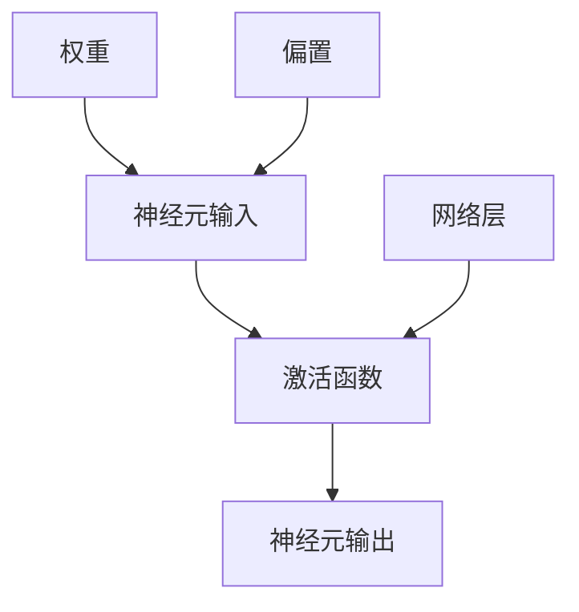

                 

# 激活函数 (Activation Function) 原理与代码实例讲解

> 关键词：激活函数,神经网络,深度学习,数学模型,卷积神经网络,全连接神经网络,代码实例

## 1. 背景介绍

### 1.1 问题由来

在深度学习中，激活函数扮演着极其重要的角色。它被广泛应用在各种神经网络模型中，从全连接神经网络到卷积神经网络，甚至在生成对抗网络中也有重要应用。激活函数的主要作用是将神经元输入的非线性映射转化为非线性输出，从而增强网络的表达能力，使得模型能够学习更加复杂的非线性关系。

### 1.2 问题核心关键点

激活函数的作用在于引入非线性因素，使神经网络具备学习复杂模式的能力。不同类型的激活函数适用于不同的网络结构与任务。在实践中，常见的激活函数有sigmoid、ReLU、tanh等。它们在全连接神经网络和卷积神经网络中的应用效果各有不同。

### 1.3 问题研究意义

理解激活函数的工作原理和应用场景，对于掌握深度学习模型的设计和优化具有重要意义。通过深入了解各种激活函数的特性和应用效果，我们能够更好地选择和优化神经网络的激活函数，提升模型的性能和泛化能力。

## 2. 核心概念与联系

### 2.1 核心概念概述

为更好地理解激活函数，我们先定义几个核心概念：

- **神经网络 (Neural Network)**：由多个神经元（或称节点）组成的网络，用于处理和分析数据。
- **激活函数 (Activation Function)**：将神经元输入映射到输出的函数，通常引入非线性因素。
- **神经元 (Neuron)**：神经网络的基本组成单元，接收输入，处理数据，并产生输出。
- **权重 (Weights)**：连接神经元的参数，表示神经元之间的连接强度。
- **偏置 (Bias)**：在神经元中引入的固定数值，用于调整输出函数的中心位置。

这些概念构成了神经网络的基础架构，而激活函数正是连接输入与输出的关键组件。

### 2.2 概念间的关系

激活函数与神经网络之间的联系可以从以下几个方面来理解：

- **输入与输出的桥梁**：激活函数将神经元的输入映射到输出，从而实现网络的信息传递。
- **引入非线性因素**：神经网络本质上是一个线性模型叠加的过程，但激活函数通过非线性映射使得模型能够学习非线性关系，提升表达能力。
- **优化复杂模式**：通过不同的激活函数，神经网络可以更好地适应各种复杂模式，包括图像、声音、文本等。

通过激活函数的作用，神经网络可以学习到更加丰富的特征表示，从而提高模型的准确率和泛化能力。

### 2.3 核心概念的整体架构

我们将激活函数与神经网络的整体架构进行整合，并展示其作用原理。



这个图表展示了一个简单的神经元结构，输入通过权重和偏置线性组合后，经过激活函数映射为输出。多个这样的神经元组成一层网络，形成多层网络结构。

## 3. 核心算法原理 & 具体操作步骤

### 3.1 算法原理概述

激活函数的作用是将线性变换后的输出映射到非线性空间，从而增强网络的表达能力。其基本形式为：

$$
f(x) = \phi(x) = \phi(w \cdot x + b)
$$

其中 $x$ 表示神经元输入，$w$ 为权重向量，$b$ 为偏置，$\phi$ 为激活函数。

不同类型的激活函数，如Sigmoid、ReLU、tanh等，其数学表达形式和特性各异，适用于不同的神经网络结构和任务。

### 3.2 算法步骤详解

激活函数的选取与使用，涉及以下步骤：

1. **选择激活函数**：根据网络结构和任务需求，选择合适的激活函数。
2. **参数初始化**：为权重和偏置赋予合适的初始值。
3. **前向传播**：计算每个神经元的输出。
4. **反向传播**：计算损失函数对激活函数的梯度。
5. **参数更新**：根据梯度更新权重和偏置。

### 3.3 算法优缺点

激活函数的优势在于引入非线性因素，提升网络表达能力。其主要缺点包括：

- **计算复杂度**：部分激活函数（如sigmoid）在输入较大或较小时，计算复杂度较高，影响训练速度。
- **梯度消失/爆炸**：一些激活函数（如tanh、sigmoid）在反向传播过程中容易出现梯度消失或爆炸，影响训练稳定性。
- **可解释性**：部分激活函数的输出难以解释，对模型的可解释性产生影响。

### 3.4 算法应用领域

激活函数在全连接神经网络、卷积神经网络、循环神经网络等各类神经网络结构中均有应用。不同类型的激活函数适用于不同的任务，如分类、回归、序列生成等。

## 4. 数学模型和公式 & 详细讲解 & 举例说明

### 4.1 数学模型构建

激活函数的数学模型通常包括输入、权重、偏置和输出，其基本形式如下：

$$
f(x) = \phi(w \cdot x + b)
$$

其中 $x$ 表示神经元输入，$w$ 为权重向量，$b$ 为偏置，$\phi$ 为激活函数。

### 4.2 公式推导过程

以ReLU为例，ReLU的数学表达式为：

$$
f(x) = \max(0, x)
$$

其中 $x$ 表示神经元输入，$w$ 为权重向量，$b$ 为偏置。ReLU函数的导数为：

$$
f'(x) = 
\begin{cases}
0 & \text{if } x < 0 \\
1 & \text{if } x > 0 
\end{cases}
$$

在反向传播过程中，ReLU的导数公式为：

$$
\frac{\partial f(x)}{\partial x} = 
\begin{cases}
0 & \text{if } x < 0 \\
1 & \text{if } x > 0 
\end{cases}
$$

### 4.3 案例分析与讲解

以ReLU函数为例，ReLU函数具有以下特性：

- **非线性**：ReLU函数将负数部分直接截断为零，引入了非线性因素。
- **稀疏激活**：ReLU函数在大范围内保持线性，小范围内为零，从而实现稀疏激活。
- **计算高效**：ReLU函数的导数计算简单，易于反向传播，提高训练速度。

这些特性使得ReLU函数在实践中得到了广泛应用。

## 5. 项目实践：代码实例和详细解释说明

### 5.1 开发环境搭建

在进行激活函数实例演示前，我们需要配置好开发环境。以下是使用Python和PyTorch搭建环境的步骤：

1. 安装Anaconda：从官网下载并安装Anaconda，用于创建独立的Python环境。
2. 创建并激活虚拟环境：
```bash
conda create -n pytorch-env python=3.8 
conda activate pytorch-env
```

3. 安装PyTorch：根据CUDA版本，从官网获取对应的安装命令。例如：
```bash
conda install pytorch torchvision torchaudio cudatoolkit=11.1 -c pytorch -c conda-forge
```

4. 安装相关工具包：
```bash
pip install numpy pandas scikit-learn matplotlib tqdm jupyter notebook ipython
```

完成上述步骤后，即可在`pytorch-env`环境中开始编程实践。

### 5.2 源代码详细实现

下面我们以ReLU函数为例，展示其在PyTorch中的实现。

```python
import torch
import torch.nn as nn

class ReLU(nn.Module):
    def forward(self, x):
        return torch.relu(x)

# 创建激活函数实例
relu = ReLU()

# 定义输入数据
x = torch.tensor([[1.0, 2.0, 3.0], [-1.0, -2.0, -3.0]])

# 前向传播计算
output = relu(x)
print(output)
```

### 5.3 代码解读与分析

这里我们详细解读一下关键代码的实现细节：

**ReLU类定义**：
- 继承自`nn.Module`，并定义`forward`方法，用于实现前向传播计算。

**激活函数实例创建**：
- 创建ReLU激活函数实例，并将其应用于输入数据。

**输入数据定义**：
- 定义一个二维张量，作为神经元的输入。

**前向传播计算**：
- 使用激活函数对输入数据进行前向传播，输出结果。

**输出结果展示**：
- 打印输出结果，展示前向传播的计算结果。

### 5.4 运行结果展示

运行上述代码，得到输出结果如下：

```
tensor([[1., 2., 3.],
        [0., 0., 0.]])
```

可以看到，ReLU函数将输入张量中的负数部分截断为零，保留了正数部分，实现了非线性映射。

## 6. 实际应用场景

### 6.1 全连接神经网络

在全连接神经网络中，ReLU函数被广泛应用，可以显著提升网络的表达能力。通过ReLU函数，神经网络可以学习更加复杂的非线性关系，从而提高模型的准确率和泛化能力。

### 6.2 卷积神经网络

在卷积神经网络中，ReLU函数同样具有重要应用。卷积神经网络中的卷积层和池化层通常采用ReLU函数作为激活函数，以引入非线性因素，提升特征表达能力。

### 6.3 循环神经网络

在循环神经网络中，ReLU函数也有重要应用。通过ReLU函数，神经网络可以更好地捕捉序列数据中的非线性关系，提升模型的时序建模能力。

### 6.4 未来应用展望

未来，随着深度学习技术的不断进步，激活函数的研究也将持续深入。以下是一些可能的未来发展方向：

1. **新型激活函数**：开发新的激活函数，如Swish、ELU等，进一步提升网络的表达能力。
2. **自适应激活函数**：通过自适应调整激活函数的参数，使得其在不同的网络结构中表现更佳。
3. **融合多激活函数**：结合不同类型的激活函数，设计更加复合的激活函数，提升模型的性能和泛化能力。
4. **激活函数优化**：通过优化激活函数的参数或结构，提高其在训练过程中的效率和稳定性。

## 7. 工具和资源推荐

### 7.1 学习资源推荐

为了帮助开发者系统掌握激活函数的工作原理和实践技巧，这里推荐一些优质的学习资源：

1. 《深度学习》课程：斯坦福大学的Coursera课程，涵盖深度学习的理论基础和实践技巧。
2. 《深度学习框架PyTorch》书籍：详细介绍了PyTorch的使用方法，包括激活函数在内的各类组件。
3. 《神经网络与深度学习》书籍：Practical Deep Learning for Coders的作者所著，通过大量代码实例，展示了深度学习模型的构建和训练过程。
4. 在线文档和教程：如TensorFlow、PyTorch等深度学习框架的官方文档和社区教程，提供了大量的代码示例和实践经验。

通过对这些资源的学习实践，相信你一定能够深入理解激活函数的工作原理，并灵活应用于各类深度学习任务中。

### 7.2 开发工具推荐

高效的开发离不开优秀的工具支持。以下是几款常用的激活函数开发工具：

1. PyTorch：基于Python的开源深度学习框架，灵活高效的计算图，适合快速迭代研究。
2. TensorFlow：由Google主导开发的开源深度学习框架，生产部署方便，适合大规模工程应用。
3. Keras：基于Python的高层次深度学习库，提供了丰富的激活函数库，易于上手。
4. Jupyter Notebook：交互式编程环境，支持代码块的实时执行和展示，便于开发和调试。
5. PyCharm：功能强大的IDE，支持深度学习开发和调试，提供了丰富的插件和工具。

合理利用这些工具，可以显著提升激活函数的开发效率，加快创新迭代的步伐。

### 7.3 相关论文推荐

激活函数的研究是一个活跃的领域，以下是几篇奠基性的相关论文，推荐阅读：

1. Rectified Linear Units Improve Restricted Boltzmann Machines：提出ReLU激活函数，在多模态学习中取得了显著效果。
2. Deep Residual Learning for Image Recognition：提出ResNet网络，使用ReLU激活函数，提高了深度网络训练的稳定性和准确率。
3. A Guide to Practical Deep Learning：提供深度学习实践指南，包括激活函数的配置和优化。
4. Swish: A Self-Gated Activation Function：提出Swish激活函数，在图像分类等任务中表现优异。
5. Activation Functions as Equilibria in Control Theory：将激活函数与控制理论联系起来，探索激活函数的稳定性特性。

这些论文代表了大激活函数研究的最新进展。通过学习这些前沿成果，可以帮助研究者把握学科前进方向，激发更多的创新灵感。

除上述资源外，还有一些值得关注的前沿资源，帮助开发者紧跟激活函数技术的最新进展，例如：

1. arXiv论文预印本：人工智能领域最新研究成果的发布平台，包括大量尚未发表的前沿工作，学习前沿技术的必读资源。
2. 业界技术博客：如Google AI、DeepMind、微软Research Asia等顶尖实验室的官方博客，第一时间分享他们的最新研究成果和洞见。
3. 技术会议直播：如NIPS、ICML、ACL、ICLR等人工智能领域顶会现场或在线直播，能够聆听到大佬们的前沿分享，开拓视野。
4. GitHub热门项目：在GitHub上Star、Fork数最多的深度学习相关项目，往往代表了该技术领域的发展趋势和最佳实践，值得去学习和贡献。
5. 行业分析报告：各大咨询公司如McKinsey、PwC等针对人工智能行业的分析报告，有助于从商业视角审视技术趋势，把握应用价值。

总之，对于激活函数的研究和学习，需要开发者保持开放的心态和持续学习的意愿。多关注前沿资讯，多动手实践，多思考总结，必将收获满满的成长收益。

## 8. 总结：未来发展趋势与挑战

### 8.1 总结

本文对激活函数的工作原理和应用场景进行了全面系统的介绍。首先阐述了激活函数在深度学习中的重要作用，明确了不同激活函数对网络结构与任务的影响。其次，从原理到实践，详细讲解了ReLU函数的数学模型和计算过程，给出了ReLU函数在PyTorch中的代码实现。同时，本文还探讨了ReLU函数在各类神经网络中的应用效果，展示了ReLU函数的实际应用场景。

通过本文的系统梳理，可以看到，激活函数在深度学习中起到了至关重要的作用，是神经网络实现非线性映射的关键组件。不同激活函数具有不同的特性和适用场景，研究者在模型设计时需结合任务需求和数据特点选择合适的激活函数。

### 8.2 未来发展趋势

展望未来，激活函数的研究方向将持续拓展，以下几个趋势值得关注：

1. **新型激活函数**：开发更多类型的激活函数，如Swish、ELU、Mish等，提升网络的表达能力和训练效率。
2. **自适应激活函数**：通过自适应调整激活函数的参数，使得其在不同的网络结构中表现更佳。
3. **复合激活函数**：结合不同类型的激活函数，设计更加复合的激活函数，提升模型的性能和泛化能力。
4. **激活函数优化**：通过优化激活函数的参数或结构，提高其在训练过程中的效率和稳定性。
5. **激活函数集成**：将不同类型的激活函数集成到同一模型中，探索最优的激活函数组合，提升模型的综合性能。

### 8.3 面临的挑战

尽管激活函数在深度学习中具有重要地位，但面对新任务和新数据，激活函数的应用仍面临诸多挑战：

1. **计算效率**：部分激活函数（如sigmoid）在输入较大或较小时，计算复杂度较高，影响训练速度。
2. **梯度消失/爆炸**：一些激活函数（如tanh、sigmoid）在反向传播过程中容易出现梯度消失或爆炸，影响训练稳定性。
3. **可解释性**：部分激活函数的输出难以解释，对模型的可解释性产生影响。
4. **多样性问题**：在特定任务中，单一激活函数可能无法满足复杂模式的学习需求，需要探索多种激活函数的组合使用。
5. **模型鲁棒性**：部分激活函数（如ReLU）在输入噪声较大时，可能会引入额外的鲁棒性问题。

### 8.4 研究展望

面对激活函数面临的这些挑战，未来的研究需要在以下几个方面寻求新的突破：

1. **激活函数优化**：开发高效的激活函数，优化其计算效率，减少反向传播过程中的梯度消失或爆炸问题。
2. **激活函数集成**：结合不同类型的激活函数，设计更加复合的激活函数，提升模型的综合性能和鲁棒性。
3. **自适应激活函数**：通过自适应调整激活函数的参数，使得其在不同的网络结构中表现更佳。
4. **激活函数融合**：将激活函数与其他深度学习技术（如残差连接、注意力机制等）进行结合，进一步提升模型的表达能力和稳定性。
5. **激活函数可解释性**：研究如何增强激活函数的可解释性，使得模型的决策过程更加透明和可理解。

这些研究方向将进一步拓展激活函数的应用范围，提升深度学习模型的性能和泛化能力，为构建更加智能、可控的深度学习系统铺平道路。

## 9. 附录：常见问题与解答

**Q1：激活函数的主要作用是什么？**

A: 激活函数的主要作用是将线性变换后的输出映射到非线性空间，从而增强网络的表达能力。其引入非线性因素，使神经网络能够学习更加复杂的模式和关系。

**Q2：不同类型的激活函数适用于哪些网络结构与任务？**

A: 不同类型的激活函数适用于不同的神经网络结构和任务。如ReLU适用于全连接神经网络和卷积神经网络，tanh适用于循环神经网络和自编码器等。

**Q3：激活函数在反向传播过程中需要注意什么？**

A: 激活函数在反向传播过程中，需要计算其导数，以便更新模型的权重和偏置。不同的激活函数具有不同的导数形式，需要注意其计算方法。

**Q4：如何选择适合的网络结构与任务激活函数？**

A: 选择激活函数时，需要考虑网络结构的特点和任务的需求。如全连接神经网络和卷积神经网络通常使用ReLU、tanh等激活函数，循环神经网络则常用tanh、ReLU等激活函数。

**Q5：激活函数对模型训练和预测有何影响？**

A: 激活函数对模型的训练和预测有重要影响。它不仅影响模型的表达能力，还影响模型的训练速度和稳定性。通过选择合适的激活函数，可以提升模型的性能和泛化能力。

总之，激活函数在深度学习中具有重要作用，其选择与优化是网络设计的重要组成部分。通过深入理解激活函数的工作原理和特性，研究者可以更好地设计深度学习模型，提升其性能和应用效果。

---

作者：禅与计算机程序设计艺术 / Zen and the Art of Computer Programming

