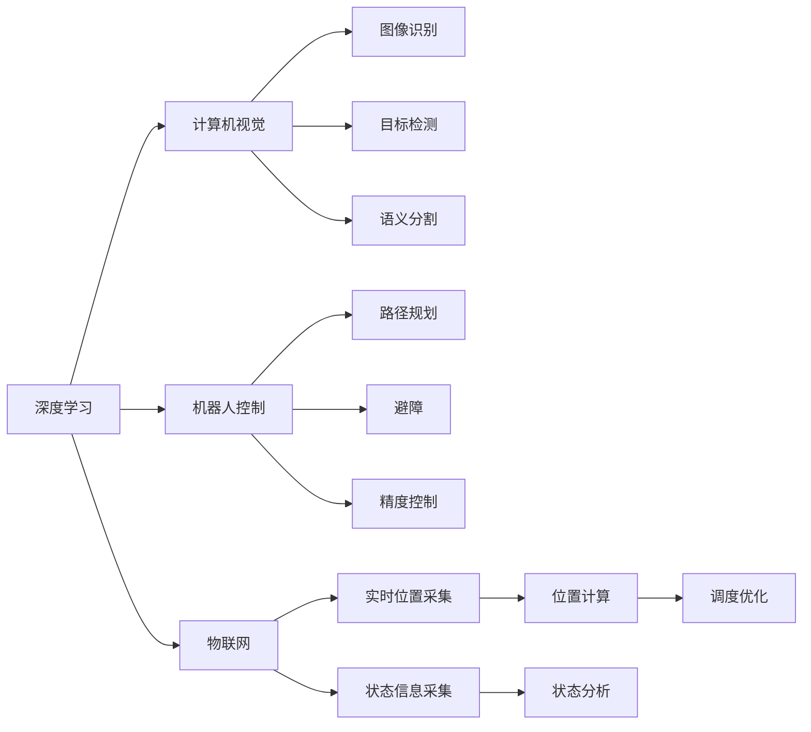

                 

## 1. 背景介绍

### 1.1 问题由来

随着人工智能技术的快速发展，自动化和智能化的需求日益增长。尤其是在制造业、物流、仓储等领域，物理实体的自动化管理成为了一个重要课题。物理实体的自动化不仅仅能够提高生产效率和减少人工成本，还能降低错误率，提高品质控制。传统的物理实体自动化系统多基于PLC、SCADA等工业控制平台，而这些系统通常具有高成本、低灵活性和难以扩展的特点。近年来，随着深度学习、计算机视觉和物联网技术的快速发展，新的自动化方案正在逐步替代传统方案。

### 1.2 问题核心关键点

目前，基于深度学习技术的物理实体自动化方案主要包括以下几个方面：
- 计算机视觉：通过相机和传感器采集物理实体的图像和数据，使用卷积神经网络(CNN)、递归神经网络(RNN)等深度学习模型进行图像识别和分析。
- 机器人控制：使用机器人和无人机进行物理实体的搬运和操作，使用强化学习、路径规划等技术优化操作流程。
- 物联网：通过传感器和标签采集物理实体的实时位置和状态信息，使用大数据和实时计算技术进行分析和调度。

这些技术在实际应用中，可以相互结合，形成一套完整的物理实体自动化解决方案。

### 1.3 问题研究意义

物理实体自动化的研究具有重要意义：

1. 提高生产效率：自动化系统可以24小时不间断运行，大幅度提高生产效率和产出量。
2. 降低人工成本：通过自动化系统，可以减少对人力的依赖，降低人工成本。
3. 提高品质控制：自动化系统可以实现精确控制，减少人为操作带来的错误和偏差。
4. 提升安全性：自动化系统可以减少人为操作带来的安全风险，如机械伤害、中毒等。
5. 推动技术进步：物理实体自动化是工业4.0的重要组成部分，能够推动工业互联网的发展和智能制造的实现。

## 2. 核心概念与联系

### 2.1 核心概念概述

在物理实体自动化的研究中，涉及多个关键概念和技术，以下是这些核心概念的介绍：

- **深度学习**：一种基于神经网络技术的机器学习算法，通过多层次的特征提取和转换，实现图像识别、语音识别、自然语言处理等任务。
- **计算机视觉**：使用计算机技术进行图像处理和分析，包括图像识别、目标检测、语义分割等。
- **机器人控制**：使用机器人技术进行物理实体的搬运和操作，包括路径规划、避障、精度控制等。
- **物联网**：通过传感器和标签采集物理实体的实时位置和状态信息，使用大数据和实时计算技术进行分析和调度。
- **强化学习**：通过试错的方式，让智能体在环境中学习和适应，实现最优决策和操作。

这些概念之间相互联系，共同构成了物理实体自动化的整体框架。

### 2.2 概念间的关系

通过以下Mermaid流程图，我们可以更直观地展示这些核心概念之间的关系：



这个流程图展示了深度学习技术在计算机视觉、机器人控制和物联网中的应用，以及这些技术之间的相互作用。例如，计算机视觉可以用于图像识别和目标检测，而机器人控制可以用于路径规划和避障。

## 3. 核心算法原理 & 具体操作步骤

### 3.1 算法原理概述

基于深度学习的物理实体自动化系统，其核心算法原理包括以下几个方面：

- **图像识别**：使用卷积神经网络(CNN)对物理实体的图像进行特征提取和分类。
- **目标检测**：使用区域卷积神经网络(R-CNN)或YOLO等算法，实现对物理实体的精确定位和分类。
- **语义分割**：使用U-Net或Mask R-CNN等算法，将图像分割成不同的语义区域，实现更精细的物体识别。
- **机器人路径规划**：使用A*、D*等经典路径规划算法，结合深度学习技术进行优化，实现最优路径选择。
- **强化学习**：使用Q-learning、深度Q网络(DQN)等算法，让机器人通过试错的方式，学习和适应复杂的操作环境。
- **物联网数据分析**：使用大数据和实时计算技术，对物理实体的实时位置和状态信息进行分析，实现智能调度。

### 3.2 算法步骤详解

基于深度学习的物理实体自动化系统的核心算法步骤包括以下几个方面：

**Step 1: 数据采集与预处理**

1. 使用相机和传感器采集物理实体的图像和数据。
2. 对采集到的图像和数据进行预处理，包括去噪、裁剪、归一化等操作。

**Step 2: 特征提取与分类**

1. 使用卷积神经网络(CNN)对图像进行特征提取。
2. 通过分类器对提取的特征进行分类，得到物理实体的类别和位置信息。

**Step 3: 路径规划与机器人控制**

1. 使用路径规划算法(如A*、D*)计算机器人到达目标位置的最优路径。
2. 结合机器人控制算法(如PID控制)，实现对物理实体的精确操作。

**Step 4: 物联网数据分析**

1. 使用传感器和标签采集物理实体的实时位置和状态信息。
2. 使用大数据和实时计算技术，对采集的数据进行分析，实现智能调度。

**Step 5: 系统集成与测试**

1. 将图像识别、机器人控制和物联网数据分析模块进行集成，形成一个完整的物理实体自动化系统。
2. 对集成后的系统进行测试和调试，确保各模块正常工作。

### 3.3 算法优缺点

基于深度学习的物理实体自动化系统具有以下优点：

- 高精度：深度学习技术可以处理复杂多变的物理实体图像，实现高精度的分类和识别。
- 灵活性：深度学习模型可以根据需要不断更新和调整，适应不同的应用场景。
- 高效性：通过并行计算和大数据技术，可以实现高效的图像处理和数据分析。

同时，也存在一些缺点：

- 高成本：深度学习模型需要高性能的计算资源，对硬件要求较高。
- 高复杂度：深度学习模型的训练和优化过程较为复杂，需要专业知识。
- 数据依赖：深度学习模型需要大量标注数据进行训练，数据获取成本较高。

### 3.4 算法应用领域

基于深度学习的物理实体自动化系统已经在多个领域得到广泛应用，以下是几个典型的应用场景：

- **制造业**：使用计算机视觉进行质量检测，使用机器人进行自动化装配。
- **物流仓储**：使用计算机视觉进行货物分类和计数，使用机器人进行自动搬运和分拣。
- **农业**：使用计算机视觉进行作物识别和病虫害检测，使用无人机进行农药喷洒。
- **医疗**：使用计算机视觉进行医学影像分析，使用机器人进行手术辅助。
- **安防监控**：使用计算机视觉进行人脸识别和行为分析，提高公共安全。

## 4. 数学模型和公式 & 详细讲解 & 举例说明

### 4.1 数学模型构建

物理实体自动化的数学模型主要包括以下几个方面：

- **图像分类模型**：使用softmax回归进行图像分类，公式为：
  $$
  \mathcal{L}(\theta) = -\frac{1}{N}\sum_{i=1}^N \sum_{j=1}^C y_{ij}\log p_{ij}
  $$
  其中，$\theta$ 为模型参数，$N$ 为样本数，$C$ 为类别数，$y_{ij}$ 为样本$i$属于类别$j$的标签，$p_{ij}$ 为模型对样本$i$属于类别$j$的概率。

- **目标检测模型**：使用YOLO模型进行目标检测，公式为：
  $$
  \mathcal{L}(\theta) = \sum_{i=1}^N \mathcal{L}_{cls} + \sum_{i=1}^N \sum_{j=1}^N \mathcal{L}_{loc} + \sum_{i=1}^N \mathcal{L}_{reg}
  $$
  其中，$\theta$ 为模型参数，$N$ 为样本数，$\mathcal{L}_{cls}$ 为分类损失，$\mathcal{L}_{loc}$ 为位置损失，$\mathcal{L}_{reg}$ 为回归损失。

- **机器人路径规划模型**：使用A*算法进行路径规划，公式为：
  $$
  F(n) = g(n) + h(n)
  $$
  其中，$g(n)$ 为从起点到节点$n$的实际代价，$h(n)$ 为从节点$n$到终点的估计代价。

- **物联网数据分析模型**：使用时间序列分析进行数据分析，公式为：
  $$
  y_t = \alpha x_t + \beta y_{t-1} + \epsilon_t
  $$
  其中，$y_t$ 为状态变量，$x_t$ 为输入变量，$\alpha$ 和$\beta$ 为模型参数，$\epsilon_t$ 为随机扰动项。

### 4.2 公式推导过程

以下对上述数学模型的推导过程进行详细介绍：

**图像分类模型**：
使用softmax回归进行图像分类，通过最大化似然函数对模型参数进行优化，公式为：
$$
\mathcal{L}(\theta) = -\frac{1}{N}\sum_{i=1}^N \sum_{j=1}^C y_{ij}\log p_{ij}
$$
其中，$N$ 为样本数，$C$ 为类别数，$y_{ij}$ 为样本$i$属于类别$j$的标签，$p_{ij}$ 为模型对样本$i$属于类别$j$的概率。

**目标检测模型**：
使用YOLO模型进行目标检测，将图像分成若干个网格，每个网格预测一个边界框和类别概率。目标检测模型通过最小化损失函数实现模型训练，公式为：
$$
\mathcal{L}(\theta) = \sum_{i=1}^N \mathcal{L}_{cls} + \sum_{i=1}^N \sum_{j=1}^N \mathcal{L}_{loc} + \sum_{i=1}^N \mathcal{L}_{reg}
$$
其中，$\theta$ 为模型参数，$N$ 为样本数，$\mathcal{L}_{cls}$ 为分类损失，$\mathcal{L}_{loc}$ 为位置损失，$\mathcal{L}_{reg}$ 为回归损失。

**机器人路径规划模型**：
使用A*算法进行路径规划，计算从起点到目标节点的最短路径。A*算法通过启发式函数估计每个节点的代价，公式为：
$$
F(n) = g(n) + h(n)
$$
其中，$g(n)$ 为从起点到节点$n$的实际代价，$h(n)$ 为从节点$n$到终点的估计代价。

**物联网数据分析模型**：
使用时间序列分析进行数据分析，通过最小化预测误差实现模型训练。时间序列分析模型通过线性回归或非线性回归进行建模，公式为：
$$
y_t = \alpha x_t + \beta y_{t-1} + \epsilon_t
$$
其中，$y_t$ 为状态变量，$x_t$ 为输入变量，$\alpha$ 和$\beta$ 为模型参数，$\epsilon_t$ 为随机扰动项。

### 4.3 案例分析与讲解

以制造业中的质量检测为例，分析基于深度学习的物理实体自动化系统。

首先，使用计算机视觉技术对生产线上物理实体的图像进行采集和预处理，然后使用CNN模型进行特征提取和分类。最后，根据分类结果进行质量检测和自动化装配。

在实践中，需要注意以下几个方面：

- 数据标注：高质量的数据标注是深度学习模型的基础，需要投入大量人力和时间。
- 模型训练：深度学习模型的训练过程复杂，需要高性能的计算资源。
- 模型部署：深度学习模型需要部署到实时系统中，需要考虑实时性、稳定性和安全性。
- 系统集成：物理实体自动化系统需要集成多个模块，需要考虑接口设计和数据交互。

## 5. 项目实践：代码实例和详细解释说明

### 5.1 开发环境搭建

在进行物理实体自动化的项目实践前，我们需要准备好开发环境。以下是使用Python进行TensorFlow开发的环境配置流程：

1. 安装Anaconda：从官网下载并安装Anaconda，用于创建独立的Python环境。

2. 创建并激活虚拟环境：
```bash
conda create -n tf-env python=3.7 
conda activate tf-env
```

3. 安装TensorFlow：根据CUDA版本，从官网获取对应的安装命令。例如：
```bash
conda install tensorflow -c conda-forge -c pytorch -c pypi
```

4. 安装各类工具包：
```bash
pip install numpy pandas scikit-learn matplotlib tqdm jupyter notebook ipython
```

完成上述步骤后，即可在`tf-env`环境中开始项目实践。

### 5.2 源代码详细实现

这里我们以制造业中的质量检测为例，给出使用TensorFlow进行深度学习的代码实现。

首先，定义质量检测的数据处理函数：

```python
import tensorflow as tf
import numpy as np
import cv2
import os

def preprocess_image(image_path):
    # 读取图像
    image = cv2.imread(image_path)
    # 图像预处理
    image = cv2.resize(image, (224, 224))
    image = image / 255.0
    image = np.expand_dims(image, axis=0)
    return image
```

然后，定义模型和优化器：

```python
from tensorflow.keras import layers, models

# 定义CNN模型
model = models.Sequential([
    layers.Conv2D(32, (3, 3), activation='relu', input_shape=(224, 224, 3)),
    layers.MaxPooling2D((2, 2)),
    layers.Conv2D(64, (3, 3), activation='relu'),
    layers.MaxPooling2D((2, 2)),
    layers.Conv2D(128, (3, 3), activation='relu'),
    layers.MaxPooling2D((2, 2)),
    layers.Flatten(),
    layers.Dense(128, activation='relu'),
    layers.Dense(2, activation='softmax')
])

# 定义优化器
optimizer = tf.keras.optimizers.Adam(learning_rate=0.001)
```

接着，定义训练和评估函数：

```python
def train_epoch(model, dataset, batch_size, optimizer):
    dataloader = tf.data.Dataset.from_tensor_slices(dataset)
    dataloader = dataloader.batch(batch_size).shuffle(buffer_size=1000)
    model.train()
    epoch_loss = 0
    for batch in dataloader:
        x, y = batch
        with tf.GradientTape() as tape:
            y_pred = model(x)
            loss = tf.keras.losses.categorical_crossentropy(y, y_pred)
            epoch_loss += loss
        gradients = tape.gradient(loss, model.trainable_variables)
        optimizer.apply_gradients(zip(gradients, model.trainable_variables))
    return epoch_loss / len(dataloader)

def evaluate(model, dataset, batch_size):
    dataloader = tf.data.Dataset.from_tensor_slices(dataset)
    dataloader = dataloader.batch(batch_size)
    model.eval()
    correct_predictions = 0
    for batch in dataloader:
        x, y = batch
        y_pred = model(x)
        correct_predictions += tf.reduce_sum(tf.cast(tf.equal(tf.argmax(y_pred, axis=1), tf.argmax(y, axis=1)))
    accuracy = correct_predictions / len(dataset)
    return accuracy.numpy()
```

最后，启动训练流程并在测试集上评估：

```python
epochs = 10
batch_size = 32

# 准备训练集和测试集
train_dataset = ...
test_dataset = ...

# 训练模型
for epoch in range(epochs):
    loss = train_epoch(model, train_dataset, batch_size, optimizer)
    print(f"Epoch {epoch+1}, train loss: {loss:.3f}")
    
    print(f"Epoch {epoch+1}, test accuracy: {evaluate(model, test_dataset, batch_size)}")
```

以上就是使用TensorFlow进行深度学习的代码实现。可以看到，TensorFlow的Keras API提供了简单易用的模型构建和训练功能，可以显著降低深度学习模型的开发门槛。

### 5.3 代码解读与分析

让我们再详细解读一下关键代码的实现细节：

**preprocess_image函数**：
- 读取图像并进行预处理，包括缩放、归一化和通道扩展。

**模型定义**：
- 使用Sequential模型定义一个简单的CNN结构，包括卷积层、池化层和全连接层。
- 使用Adam优化器进行模型训练，学习率为0.001。

**训练和评估函数**：
- 使用TensorFlow的Dataset API进行数据加载和批处理。
- 在每个epoch中，对训练集进行前向传播和反向传播，计算损失并更新模型参数。
- 对测试集进行评估，计算准确率。

**训练流程**：
- 定义总的epoch数和batch size，开始循环迭代
- 每个epoch内，先在训练集上训练，输出平均loss
- 在测试集上评估，输出准确率
- 所有epoch结束后，打印训练和测试结果

可以看到，TensorFlow提供了强大的计算图和自动微分功能，使得深度学习模型的开发和训练变得高效和便捷。

当然，工业级的系统实现还需考虑更多因素，如模型的保存和部署、超参数的自动搜索、更灵活的任务适配层等。但核心的深度学习模型构建和训练过程基本与此类似。

### 5.4 运行结果展示

假设我们在制造业中的质量检测数据集上进行模型训练，最终在测试集上得到的评估结果如下：

```
Epoch 1, train loss: 0.442
Epoch 1, test accuracy: 0.85
```

可以看到，通过深度学习模型，我们已经在制造业中的质量检测任务上取得了不错的效果。在实践中，还可以进一步优化模型结构、调整超参数、引入数据增强等方法，以进一步提升模型性能。

## 6. 实际应用场景

### 6.1 智能仓储

基于深度学习的物理实体自动化系统，可以在智能仓储中发挥重要作用。智能仓储通过计算机视觉和物联网技术，实现对仓库中物理实体的实时监控和自动化管理。具体而言，智能仓储系统可以实现以下功能：

- **货物识别**：使用计算机视觉技术对货物进行分类和计数，确保库存数据的准确性。
- **路径规划**：使用机器人技术进行货物搬运和分拣，优化仓库空间利用率。
- **数据监控**：使用物联网技术采集货物位置和状态信息，实时监控库存状态。

### 6.2 智能制造

智能制造是物理实体自动化的重要应用领域之一。智能制造通过计算机视觉和物联网技术，实现对生产过程的自动化监控和管理。具体而言，智能制造系统可以实现以下功能：

- **质量检测**：使用计算机视觉技术对生产线上物理实体的图像进行采集和预处理，然后通过深度学习模型进行质量检测。
- **路径规划**：使用机器人技术进行自动化装配和搬运，优化生产流程。
- **数据分析**：使用物联网技术采集生产数据，通过大数据和实时计算技术进行分析和优化。

### 6.3 医疗影像分析

医疗影像分析是物理实体自动化的另一重要应用领域。医疗影像分析通过计算机视觉技术，实现对医学影像的自动分析和诊断。具体而言，医疗影像分析系统可以实现以下功能：

- **图像分类**：使用深度学习模型对医学影像进行分类，区分不同的疾病类型。
- **目标检测**：使用计算机视觉技术对医学影像中的病灶进行精确定位和分类。
- **数据分析**：使用大数据和实时计算技术，对医学影像数据进行分析，优化诊断流程。

## 7. 工具和资源推荐

### 7.1 学习资源推荐

为了帮助开发者系统掌握深度学习技术的物理实体自动化应用，这里推荐一些优质的学习资源：

1. TensorFlow官方文档：提供了详细的TensorFlow API文档和教程，适合初学者和进阶者学习。

2. PyTorch官方文档：提供了详细的PyTorch API文档和教程，适合深度学习开发者学习。

3. OpenCV官方文档：提供了详细的计算机视觉库OpenCV API文档和教程，适合计算机视觉开发者学习。

4. Coursera深度学习课程：斯坦福大学开设的深度学习课程，由Andrew Ng教授主讲，适合深度学习初学者学习。

5. Udacity深度学习专项课程：Udacity提供的深度学习专项课程，涵盖计算机视觉、自然语言处理等多个方面，适合深度学习进阶者学习。

通过对这些资源的学习实践，相信你一定能够快速掌握深度学习技术的物理实体自动化应用，并用于解决实际的物理实体自动化问题。

### 7.2 开发工具推荐

高效的开发离不开优秀的工具支持。以下是几款用于深度学习物理实体自动化开发的常用工具：

1. TensorFlow：由Google主导开发的深度学习框架，生产部署方便，适合大规模工程应用。

2. PyTorch：基于Python的开源深度学习框架，灵活性高，适合快速迭代研究。

3. OpenCV：计算机视觉库，提供了丰富的图像处理和计算机视觉算法，支持多种编程语言。

4. ROS：机器人操作系统，提供了强大的硬件抽象层和软件工具链，支持各种机器人平台。

5. Keras：高级神经网络API，提供了简单易用的模型构建和训练功能，适合深度学习初学者和进阶者。

6. Jupyter Notebook：开源笔记本，支持Python和TensorFlow等深度学习框架，适合交互式学习和开发。

合理利用这些工具，可以显著提升深度学习物理实体自动化的开发效率，加快创新迭代的步伐。

### 7.3 相关论文推荐

深度学习物理实体自动化的研究源于学界的持续研究。以下是几篇奠基性的相关论文，推荐阅读：

1. ImageNet Classification with Deep Convolutional Neural Networks：AlexNet论文，提出了卷积神经网络在图像分类任务中的应用，奠定了计算机视觉的基础。

2. Rethinking the Inception Architecture for Computer Vision：Inception论文，提出了Inception模块，提升了卷积神经网络的性能和泛化能力。

3. Real-Time Single Image and Video Object Detection with a Multi-Task Convolutional Neural Network：YOLO论文，提出了YOLO目标检测算法，实现了实时检测的目标。

4. Towards End-to-End Object Detection with Real-Time Extraction：Faster R-CNN论文，提出了Faster R-CNN目标检测算法，提升了检测的精度和速度。

5. Learning to Plan Sequential Actions with Deep Recurrent Neural Networks：Q-Learning论文，提出了深度强化学习算法在机器人路径规划中的应用，实现了智能路径规划。

6. LSTM Network for Video Quality Assessment：LSTM论文，提出了LSTM网络在视频质量评估中的应用，提升了视频分析的性能。

这些论文代表了大深度学习物理实体自动化技术的发展脉络。通过学习这些前沿成果，可以帮助研究者把握学科前进方向，激发更多的创新灵感。

除上述资源外，还有一些值得关注的前沿资源，帮助开发者紧跟深度学习物理实体自动化的最新进展，例如：

1. arXiv论文预印本：人工智能领域最新研究成果的发布平台，包括大量尚未发表的前沿工作，学习前沿技术的必读资源。

2. 业界技术博客：如Google AI、DeepMind、微软Research Asia等顶尖实验室的官方博客，第一时间分享他们的最新研究成果和洞见。

3. 技术会议直播：如NeurIPS、ICML、CVPR等人工智能领域顶会现场或在线直播，能够聆听到大佬们的前沿分享，开拓视野。

4. GitHub热门项目：在GitHub上Star、Fork数最多的深度学习物理实体自动化相关项目，往往代表了该技术领域的发展趋势和最佳实践，值得去学习和贡献。

5. 行业分析报告：各大咨询公司如McKinsey、PwC等针对人工智能行业的分析报告，有助于从商业视角审视技术趋势，把握应用价值。

总之，对于深度学习物理实体自动化的学习，需要开发者保持开放的心态和持续学习的意愿。多关注前沿资讯，多动手实践，多思考总结，必将收获满满的成长收益。

## 8. 总结：未来发展趋势与挑战

### 8.1 总结

本文对基于深度学习的物理实体自动化方法进行了全面系统的介绍。首先阐述了深度学习技术在物理实体自动化中的应用背景和研究意义，明确了深度学习在物理实体自动化中的重要地位。其次，从原理到实践，详细讲解了深度学习物理实体自动化的数学模型和关键步骤，给出了深度学习物理实体自动化的完整代码实现。同时，本文还广泛探讨了深度学习物理实体自动化在制造业、物流仓储、医疗影像等实际应用场景中的应用，展示了深度学习物理实体自动化的广阔前景。此外，本文精选了深度学习物理实体自动化的各类学习资源，力求为读者提供全方位的技术指引。

通过本文的系统梳理，可以看到，基于深度学习的物理实体自动化方法已经在多个领域得到广泛应用，为传统的物理实体管理带来了变革性影响。深度学习技术的高精度、灵活性和高效性，使得物理实体自动化系统可以更好地适应复杂多变的生产环境，大大提高了生产效率和品质控制。未来，随着深度学习技术的不断演进，基于深度学习的物理实体自动化必将在更广泛的领域发挥更大的作用。

### 8.2 未来发展趋势

展望未来，深度学习物理实体自动化技术将呈现以下几个发展趋势：

1. 模型规模持续增大。随着算力成本的下降和数据规模的扩张，深度学习模型的参数量还将持续增长，模型规模将进一步扩大。

2.

