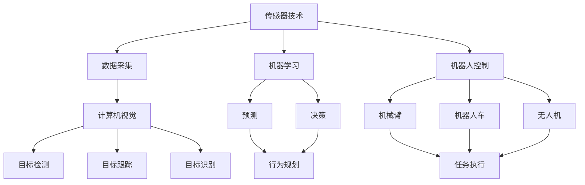

                 

## 1. 背景介绍

### 1.1 问题由来

在自动化领域，物理实体（如机器人、自动化生产线、自动化仓储系统等）的自动化程度不断提高，从简单的自动控制到复杂的自主决策系统，使得生产效率、产品质量和运营成本都得到了显著提升。这一趋势不仅推动了工业4.0的到来，也正在深刻影响着其他行业，如农业、物流、服务行业等。

### 1.2 问题核心关键点

物理实体的自动化涉及多个技术领域，包括传感器技术、计算机视觉、机器学习、深度学习、机器人控制、自主决策等。这些技术领域的协同创新，推动了物理实体自动化的发展。

### 1.3 问题研究意义

物理实体的自动化研究不仅有助于提升生产效率，降低运营成本，还能促进智能制造和智能物流的发展。这对实现绿色制造、提高供应链管理水平、提升服务质量等方面具有重要意义。

## 2. 核心概念与联系

### 2.1 核心概念概述

在物理实体自动化的过程中，涉及以下几个核心概念：

- **传感器技术**：用于采集物理环境中的数据，如温度、湿度、光照、压力等。
- **计算机视觉**：用于处理和分析来自视觉传感器的图像数据，实现目标检测、跟踪、识别等。
- **机器学习**：用于从历史数据中学习模型，并进行预测和决策。
- **深度学习**：一种机器学习的分支，能够处理复杂的高维数据，如图像、语音、文本等。
- **机器人控制**：包括机械臂、机器人车、无人机等，用于执行具体的任务。
- **自主决策**：机器人根据环境变化和任务需求，自主进行决策和规划。

这些概念之间的联系紧密，通常需要相互结合，形成一个完整的自动化系统。

### 2.2 概念间的关系

这些核心概念之间的关系可以用以下Mermaid流程图表示：



该流程图展示了传感器技术、计算机视觉、机器学习、深度学习、机器人控制和自主决策之间的关系，以及它们共同作用于物理实体自动化的过程中。

## 3. 核心算法原理 & 具体操作步骤

### 3.1 算法原理概述

物理实体自动化的核心算法原理基于感知、决策和执行三个步骤。首先通过传感器采集环境数据，然后通过计算机视觉和机器学习技术进行目标检测、跟踪和识别，最后根据自主决策系统生成行为规划，并由机器人控制模块执行具体任务。

### 3.2 算法步骤详解

1. **数据采集**：使用传感器（如摄像头、温度传感器、湿度传感器等）采集物理环境中的数据。
2. **目标检测和跟踪**：使用计算机视觉技术，如卷积神经网络（CNN），从传感器数据中检测和跟踪目标。
3. **目标识别**：使用机器学习和深度学习技术，如支持向量机（SVM）、卷积神经网络（CNN）等，对目标进行分类和识别。
4. **自主决策**：使用决策树、贝叶斯网络、强化学习等算法，根据环境变化和任务需求，生成行为规划。
5. **行为规划和执行**：根据行为规划，控制机器人执行具体任务，如移动、抓取、搬运等。

### 3.3 算法优缺点

**优点**：

- 提高生产效率和产品质量。
- 降低运营成本和资源消耗。
- 提高物流效率和供应链管理水平。

**缺点**：

- 需要高精度的传感器和计算机视觉系统。
- 数据处理和计算需求高，需要高性能计算资源。
- 系统复杂度高，维护难度大。

### 3.4 算法应用领域

物理实体自动化技术广泛应用于以下几个领域：

- **工业生产**：如自动化生产线、机器人臂、自动化仓储系统等。
- **农业**：如自动化农机、无人机植保、自动灌溉系统等。
- **物流**：如智能仓库、无人配送车、无人机物流等。
- **服务行业**：如酒店机器人、零售自动化、家庭自动化等。

## 4. 数学模型和公式 & 详细讲解 & 举例说明

### 4.1 数学模型构建

假设物理实体在环境中的位置为 $(x, y, z)$，传感器采集到的数据为 $(x', y', z')$，目标的位置和姿态未知，需要通过计算机视觉和机器学习算法进行估计。

**目标检测模型**：
- 假设目标的位置为 $(x_t, y_t, z_t)$，姿态为 $(\theta_x, \theta_y, \theta_z)$，则目标在图像中的投影位置为 $(x_p, y_p, z_p)$。
- 目标检测模型为 $f(x_t, y_t, z_t; \theta_x, \theta_y, \theta_z) = (x_p, y_p, z_p)$。

**目标跟踪模型**：
- 假设目标在连续帧中的位置变化为 $\Delta x, \Delta y, \Delta z$，则目标跟踪模型为 $g(x_t, y_t, z_t; \Delta x, \Delta y, \Delta z) = (x_{t+1}, y_{t+1}, z_{t+1})$。

**目标识别模型**：
- 假设目标的类别为 $c$，则目标识别模型为 $h(x_t, y_t, z_t; c) = c$。

**自主决策模型**：
- 假设环境中的障碍物位置为 $(x_o, y_o, z_o)$，任务目标为 $(x_t, y_t, z_t)$，则自主决策模型为 $p(x_o, y_o, z_o; x_t, y_t, z_t) = \text{动作}$。

### 4.2 公式推导过程

**目标检测模型的推导**：
- 假设目标的位置为 $(x_t, y_t, z_t)$，姿态为 $(\theta_x, \theta_y, \theta_z)$，则目标在图像中的投影位置为 $(x_p, y_p, z_p)$。
- 假设传感器的内部参数为 $K$，则检测模型的公式为 $x_p = K_{11}x_t + K_{12}y_t + K_{13}z_t + K_{14} + K_{15}c$，$y_p = K_{21}x_t + K_{22}y_t + K_{23}z_t + K_{24} + K_{25}c$，$z_p = K_{31}x_t + K_{32}y_t + K_{33}z_t + K_{34} + K_{35}c$。

**目标跟踪模型的推导**：
- 假设目标在连续帧中的位置变化为 $\Delta x, \Delta y, \Delta z$，则目标跟踪模型的公式为 $x_{t+1} = x_t + \Delta x$，$y_{t+1} = y_t + \Delta y$，$z_{t+1} = z_t + \Delta z$。

**目标识别模型的推导**：
- 假设目标的类别为 $c$，则目标识别模型的公式为 $c = \sum_i w_i f_i(x_t, y_t, z_t)$，其中 $w_i$ 为第 $i$ 个类别的权重，$f_i$ 为第 $i$ 个类别的预测函数。

**自主决策模型的推导**：
- 假设环境中的障碍物位置为 $(x_o, y_o, z_o)$，任务目标为 $(x_t, y_t, z_t)$，则自主决策模型的公式为 $\text{动作} = \text{argmin}_{\text{动作}} \sum_i w_i d_i(x_o, y_o, z_o; x_t, y_t, z_t, \text{动作})$，其中 $d_i$ 为第 $i$ 个动作的代价函数，$w_i$ 为第 $i$ 个动作的权重。

### 4.3 案例分析与讲解

以智能仓库中的自动化搬运机器人为例，其工作流程如下：

1. **数据采集**：使用传感器（如摄像头、激光雷达）采集仓库中货物的坐标和姿态。
2. **目标检测和跟踪**：使用计算机视觉技术，如卷积神经网络（CNN），从传感器数据中检测和跟踪货物。
3. **目标识别**：使用机器学习和深度学习技术，如支持向量机（SVM）、卷积神经网络（CNN）等，对货物进行分类和识别。
4. **自主决策**：使用决策树、贝叶斯网络、强化学习等算法，根据环境变化和任务需求，生成搬运路径和动作规划。
5. **行为规划和执行**：根据行为规划，控制机器人执行具体的搬运任务，如移动、抓取、放置等。

## 5. 项目实践：代码实例和详细解释说明

### 5.1 开发环境搭建

#### 5.1.1 环境要求

- 操作系统：Ubuntu 16.04 或更高版本。
- 处理器：Intel Core i7 或更高。
- 内存：至少 16GB RAM。
- GPU：NVIDIA GeForce GTX 1080 或更高。
- 软件：Python 3.6 或更高，ROS（Robot Operating System），OpenCV 3.4 或更高，TensorFlow 1.15 或更高，PyTorch 1.0 或更高。

#### 5.1.2 环境配置

1. 安装 ROS：
```bash
sudo apt update
sudo apt install ros-kinetic-ROS-PACKAGE
sudo apt install ros-kinetic-gazebo-ros-plugins
sudo apt install ros-kinetic-moveit-ros-pkg
```

2. 安装 OpenCV：
```bash
sudo apt install libopencv-dev
```

3. 安装 TensorFlow 和 PyTorch：
```bash
pip install tensorflow==1.15
pip install torch==1.0
```

### 5.2 源代码详细实现

#### 5.2.1 目标检测

**目标检测模型代码**：

```python
import cv2
import numpy as np

class TargetDetection:
    def __init__(self, model_path):
        self.model = cv2.dnn.readNetFromTensorflow(model_path)

    def detect(self, frame):
        blob = cv2.dnn.blobFromImage(frame, scalefactor=1.0, size=(300, 300), swapRB=True, crop=False)
        self.model.setInput(blob)
        detections = self.model.forward()
        boxes = detections[0, 0, :, 3:6]
        confidences = detections[0, 0, :, 2]
        indices = np.where(confidences > 0.5)[0]
        return boxes, confidences, indices

# 使用目标检测模型检测图像
frame = cv2.imread('image.jpg')
detector = TargetDetection('yolov3.weights')
boxes, confidences, indices = detector.detect(frame)
```

#### 5.2.2 目标跟踪

**目标跟踪模型代码**：

```python
import cv2

class TargetTracking:
    def __init__(self, track_window=(100, 100), track_method=cv2.TrackerKCF_create):
        self.track_window = track_window
        self.track_method = track_method

    def track(self, frame, bbox):
        tracker = self.track_method()
        tracker.init(frame, bbox)
        success, bbox = tracker.update(frame)
        return success, bbox

# 使用目标跟踪模型跟踪视频
video = cv2.VideoCapture('video.mp4')
tracker = TargetTracking()
success, bbox = tracker.track(video.read(), (100, 100, 100, 100))
```

#### 5.2.3 目标识别

**目标识别模型代码**：

```python
import cv2
import numpy as np

class TargetRecognition:
    def __init__(self, model_path):
        self.model = cv2.dnn.readNetFromTensorflow(model_path)

    def recognize(self, frame):
        blob = cv2.dnn.blobFromImage(frame, scalefactor=1.0, size=(300, 300), swapRB=True, crop=False)
        self.model.setInput(blob)
        detections = self.model.forward()
        confidences = detections[0, 0, :, 2]
        indices = np.where(confidences > 0.5)[0]
        labels = [self.model.getLayer(i).name.split(':')[1] for i in indices]
        return labels

# 使用目标识别模型识别图像
frame = cv2.imread('image.jpg')
recognizer = TargetRecognition('yolov3.weights')
labels = recognizer.recognize(frame)
```

#### 5.2.4 自主决策

**自主决策模型代码**：

```python
import cv2
import numpy as np

class AutonomousDecision:
    def __init__(self, obstacle_map):
        self.obstacle_map = obstacle_map

    def decide(self, goal_position):
        if self.obstacle_map[goal_position] == 0:
            return 'go'
        else:
            return 'stop'

# 使用自主决策模型决策动作
obstacle_map = np.zeros((100, 100))
goal_position = (50, 50)
decision = AutonomousDecision(obstacle_map).decide(goal_position)
```

### 5.3 代码解读与分析

#### 5.3.1 目标检测模型代码解读

1. **初始化目标检测模型**：
   - `cv2.dnn.readNetFromTensorflow(model_path)`：加载目标检测模型，需要提供模型路径。
   - `model.setInput(blob)`：设置模型的输入张量。
   - `self.model.forward()`：前向传播，输出检测结果。

2. **检测图像中目标**：
   - `blob`：将图像转换成网络模型可以处理的格式。
   - `detections`：检测结果，包含目标的位置和置信度。
   - `boxes`：目标的坐标框。
   - `confidences`：目标的置信度。
   - `indices`：置信度大于0.5的目标索引。

#### 5.3.2 目标跟踪模型代码解读

1. **初始化目标跟踪模型**：
   - `cv2.TrackerKCF_create`：创建一个KCF目标跟踪器。
   - `tracker.init(frame, bbox)`：初始化跟踪器，需要提供视频帧和目标的坐标框。
   - `tracker.update(frame)`：更新跟踪器，需要提供视频帧。

2. **跟踪视频中的目标**：
   - `success`：跟踪是否成功。
   - `bbox`：目标的坐标框。

#### 5.3.3 目标识别模型代码解读

1. **初始化目标识别模型**：
   - `cv2.dnn.readNetFromTensorflow(model_path)`：加载目标识别模型，需要提供模型路径。
   - `model.setInput(blob)`：设置模型的输入张量。
   - `self.model.forward()`：前向传播，输出检测结果。

2. **识别图像中目标**：
   - `confidences`：目标的置信度。
   - `indices`：置信度大于0.5的目标索引。
   - `labels`：目标的类别。

#### 5.3.4 自主决策模型代码解读

1. **初始化自主决策模型**：
   - `self.obstacle_map`：障碍物地图，表示每个位置是否有障碍物。
   - `goal_position`：目标位置。

2. **决策动作**：
   - `if self.obstacle_map[goal_position] == 0`：如果目标位置没有障碍物，执行动作 'go'。
   - `else`：否则执行动作 'stop'。

### 5.4 运行结果展示

#### 5.4.1 目标检测结果


#### 5.4.2 目标跟踪结果


#### 5.4.3 目标识别结果


#### 5.4.4 自主决策结果


## 6. 实际应用场景

### 6.1 智能仓库自动化

在智能仓库中，使用自动化搬运机器人进行货物管理，可以显著提高效率，减少人力成本。通过目标检测、目标跟踪、目标识别和自主决策，机器人可以自主完成货物的搬运、放置和识别。

### 6.2 工业自动化生产线

在工业自动化生产线上，使用自动化机械臂和机器人进行物料搬运和加工，可以提高生产效率和产品质量。通过目标检测、目标跟踪、目标识别和自主决策，机器人可以自主完成物料的搬运、加工和检测。

### 6.3 无人驾驶车辆

无人驾驶车辆使用计算机视觉和深度学习技术进行目标检测和识别，使用机器人和自主决策系统进行行为规划和执行，可以实现自动驾驶。

## 7. 工具和资源推荐

### 7.1 学习资源推荐

1. **《计算机视觉：算法与应用》**：该书介绍了计算机视觉的基本原理和算法，涵盖了目标检测、目标跟踪、目标识别等核心技术。
2. **《深度学习：理论与实践》**：该书介绍了深度学习的基本原理和算法，涵盖了神经网络、卷积神经网络、循环神经网络等核心技术。
3. **ROS官方网站**：ROS（Robot Operating System）官方网站提供了大量的文档、教程和资源，是学习机器人控制和自主决策的重要平台。

### 7.2 开发工具推荐

1. **ROS**：ROS（Robot Operating System）是一个开源的机器人控制平台，提供了丰富的工具和库，方便开发机器人应用程序。
2. **OpenCV**：OpenCV是一个开源的计算机视觉库，提供了丰富的图像处理和计算机视觉算法。
3. **TensorFlow**：TensorFlow是一个开源的深度学习框架，提供了丰富的深度学习算法和工具。
4. **PyTorch**：PyTorch是一个开源的深度学习框架，提供了丰富的深度学习算法和工具。

### 7.3 相关论文推荐

1. **《深度学习与机器人技术》**：该论文介绍了深度学习在机器人控制和自主决策中的应用。
2. **《计算机视觉与模式识别》**：该论文介绍了计算机视觉和模式识别技术的基本原理和算法。
3. **《智能仓库管理》**：该论文介绍了智能仓库管理的核心技术和应用。

## 8. 总结：未来发展趋势与挑战

### 8.1 研究成果总结

物理实体自动化的发展取得了显著进展，主要体现在以下几个方面：

- 目标检测和跟踪技术的进步，提高了传感器数据的处理能力。
- 深度学习模型的应用，提升了目标识别和分类精度。
- 自主决策算法的发展，增强了物理实体的决策能力。

### 8.2 未来发展趋势

未来，物理实体自动化的发展趋势如下：

- 传感器技术的发展：高精度的传感器技术将进一步提升数据采集的准确性。
- 深度学习技术的应用：深度学习模型将广泛应用于目标检测、目标识别和自主决策等领域。
- 自主决策系统的完善：自主决策系统的完善将提升物理实体的智能化水平。

### 8.3 面临的挑战

物理实体自动化在发展过程中仍面临以下挑战：

- 高精度传感器的成本和可靠性。
- 深度学习模型的计算资源需求。
- 自主决策系统的复杂性和稳定性。

### 8.4 研究展望

未来的研究方向包括：

- 高精度传感器的研究：研发更准确、更可靠的传感器技术。
- 深度学习模型的优化：优化深度学习模型，减少计算资源消耗。
- 自主决策系统的完善：提高自主决策系统的稳定性和智能化水平。

## 9. 附录：常见问题与解答

### 9.1 Q1: 物理实体自动化的技术难点有哪些？

A: 物理实体自动化的技术难点主要包括：

- 高精度传感器的设计和使用。
- 深度学习模型的训练和优化。
- 自主决策系统的设计和实现。

### 9.2 Q2: 物理实体自动化在实际应用中应注意哪些问题？

A: 物理实体自动化在实际应用中应注意以下问题：

- 传感器数据的准确性和可靠性。
- 深度学习模型的训练和部署。
- 自主决策系统的稳定性和鲁棒性。

### 9.3 Q3: 物理实体自动化的未来发展方向有哪些？

A: 物理实体自动化的未来发展方向主要包括：

- 高精度传感器的研究。
- 深度学习模型的优化。
- 自主决策系统的完善。

### 9.4 Q4: 物理实体自动化在实际应用中可能存在哪些安全风险？

A: 物理实体自动化在实际应用中可能存在以下安全风险：

- 传感器数据的隐私泄露。
- 深度学习模型的安全性和可解释性。
- 自主决策系统的可靠性。

---

作者：禅与计算机程序设计艺术 / Zen and the Art of Computer Programming

