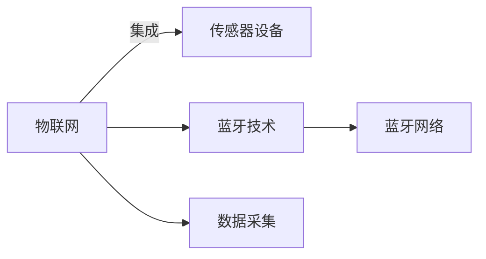

                 

# 物联网(IoT)技术和各种传感器设备的集成：蓝牙在物联网中的应用

## 1. 背景介绍

物联网(IoT)，即“物物相连的互联网”，通过信息感知技术与通信技术实现物与物、人与物之间的连接。近年来，随着传感器技术、通信技术、大数据、云计算等技术的飞速发展，物联网应用正在深入各个领域，从智能家居到智能城市，从工业自动化到农业管理，物联网正在逐步改变我们的生活方式和工作模式。

在物联网中，传感器设备起着至关重要的作用，它们负责采集各种环境数据，并实时传输给物联网中心。这些传感器可以涵盖温度、湿度、压力、光强、声音、位置等众多方面。然而，传感器设备的集成、数据采集和传输是物联网技术发展的重要瓶颈。本文将重点探讨蓝牙在物联网中的应用，以及蓝牙在传感器设备集成中的优势和潜力。

## 2. 核心概念与联系

### 2.1 核心概念概述

- **物联网(IoT)**：通过互联网将各种设备、传感器、智能终端等连接在一起，实现数据采集、传输、处理和分析。
- **传感器设备**：用于采集环境信息，如温度、湿度、压力、光强、声音等。
- **蓝牙技术**：一种无线通信技术，用于设备间短距离数据传输和通信，具有低功耗、高安全性、稳定性和成本效益等优点。
- **蓝牙网络**：由多个蓝牙设备组成的自组织无线网络，可以用于数据采集、控制和通信。

这些概念之间的关系可以通过以下Mermaid流程图来展示：



### 2.2 概念间的关系

物联网的核心在于数据采集、传输和处理。传感器设备是数据采集的基础，蓝牙技术则是传感器设备间数据传输的重要手段。通过蓝牙网络，传感器设备可以实现设备间的通信和数据传输，从而实现物联网的互联互通。

蓝牙技术是物联网中不可或缺的一环，其低功耗、高安全性和稳定性的特点，使其成为传感器设备间通信的理想选择。蓝牙网络通过自组织的方式，使得多个传感器设备能够互相通信和数据共享，构建出完整的物联网网络。

## 3. 核心算法原理 & 具体操作步骤

### 3.1 算法原理概述

蓝牙技术是一种低功耗、短距离无线通信技术，适用于传感器设备间的通信。在物联网中，蓝牙技术可以通过广播（Advertising）和扫描（Scanning）两种模式实现设备间的数据传输。

- **广播模式**：发送方主动发送广播数据包，其他设备接收并处理数据包。
- **扫描模式**：接收方主动扫描广播数据包，与发送方建立连接。

蓝牙技术通过周期性同步的同步时间间隔（SCO）模式，确保数据传输的稳定性和实时性。蓝牙设备通过蓝牙低功耗（BLE）技术，可以在低功耗模式下实现数据传输，适用于电池供电的传感器设备。

### 3.2 算法步骤详解

蓝牙在物联网中的应用，主要包括以下几个步骤：

1. **设备配对**：通过蓝牙广播和扫描，将传感器设备配对在一起，建立起蓝牙连接。
2. **数据传输**：传感器设备通过蓝牙网络进行数据传输，实现数据的实时采集和处理。
3. **数据处理**：将传感器采集到的数据通过网络传输到物联网中心，进行数据处理和分析。
4. **应用部署**：根据传感器采集到的数据，实现各种物联网应用，如智能家居、智能城市、工业自动化等。

### 3.3 算法优缺点

蓝牙技术在物联网中的应用具有以下优点：

- **低功耗**：蓝牙设备可以在低功耗模式下工作，适用于电池供电的传感器设备。
- **高安全性**：蓝牙技术支持数据加密和身份验证，确保数据传输的安全性。
- **稳定性和可靠性**：蓝牙技术具有较高的稳定性和可靠性，适用于数据采集和传输。
- **成本效益**：蓝牙技术成本较低，适用于大规模的物联网应用。

然而，蓝牙技术也存在一些缺点：

- **传输速率较低**：蓝牙技术的传输速率较低，适用于低带宽应用。
- **通信范围有限**：蓝牙技术的通信范围有限，适用于短距离数据传输。
- **受环境影响**：蓝牙技术的传输效果受环境因素（如障碍物、干扰源等）影响较大。

### 3.4 算法应用领域

蓝牙技术在物联网中的应用非常广泛，涵盖了以下几个主要领域：

- **智能家居**：通过蓝牙技术，可以实现家电、照明、安防等设备的互联互通，提升家居智能化的水平。
- **智能城市**：在智能城市建设中，通过蓝牙技术可以实现交通管理、环境监测、公共安全等应用，提升城市管理的智能化水平。
- **工业自动化**：在工业自动化中，通过蓝牙技术可以实现设备监控、数据采集、控制命令传输等应用，提升生产效率和安全性。
- **农业管理**：通过蓝牙技术可以实现农业监测、设备控制等应用，提升农业生产的智能化水平。

## 4. 数学模型和公式 & 详细讲解 & 举例说明

### 4.1 数学模型构建

蓝牙技术的通信过程可以建模为随机过程。假设发送方发送的广播包服从几何分布，每次传输成功的概率为 $p$。则发送方成功传输 $k$ 次广播包的期望次数为：

$$
E[J] = \frac{1-p}{p}
$$

其中 $J$ 表示发送方成功传输广播包的期望次数。

### 4.2 公式推导过程

蓝牙技术的传输速率和通信范围与其采用的传输模式密切相关。假设蓝牙设备采用调频连续波（FCB）模式，传输速率为 $R$，则数据传输的概率为：

$$
P(D) = 1 - e^{-\lambda T}
$$

其中 $\lambda = \frac{2R}{T}$，$T$ 为蓝牙设备的传输时间。

蓝牙设备的通信范围 $d$ 与其信号强度和环境因素有关。假设信号强度为 $S$，环境噪声为 $N$，则通信范围为：

$$
d = \frac{S}{N}
$$

### 4.3 案例分析与讲解

假设在一个智能家居系统中，有 $n$ 个智能设备，每个设备每小时需要发送一次数据包，数据包大小为 $b$ 字节。设备的传输速率为 $R$，每次传输成功的概率为 $p$。则该智能家居系统每小时的数据传输量和期望传输时间分别为：

$$
T_{data} = n \cdot b \cdot R
$$

$$
E[T_{trans}] = \frac{1-p}{p} \cdot T_{data}
$$

## 5. 项目实践：代码实例和详细解释说明

### 5.1 开发环境搭建

要进行蓝牙在物联网中的应用开发，首先需要搭建好开发环境。以下是使用Python进行开发的环境配置流程：

1. 安装Python：从官网下载并安装Python。
2. 安装PyBluez：使用pip命令安装PyBluez库，支持蓝牙设备的编程。
3. 安装Nordic SDK：从Nordic Semiconductor官网下载并安装Nordic SDK，支持蓝牙设备的开发。

完成上述步骤后，即可在Python环境中进行蓝牙开发。

### 5.2 源代码详细实现

以下是一个简单的蓝牙数据传输示例代码，实现两个蓝牙设备之间的数据传输：

```python
import pybluez
import random

# 创建蓝牙广告服务
def create_advertisement():
    advertisement = pybluez.Advertisement(
        pybluez.Advertisement.service_uuids, 
        pybluez.Advertisement.uuids=pybluez.Advertisement.uuids, 
        pybluez.Advertisement.manufacturer_data=pybluez.Advertisement.manufacturer_data, 
        pybluez.Advertisement.service_data=pybluez.Advertisement.service_data, 
        pybluez.Advertisement.include_tx_power=pybluez.Advertisement.include_tx_power, 
        pybluez.Advertisement.include_tx_type=pybluez.Advertisement.include_tx_type, 
        pybluez.Advertisement.include_rssi=pybluez.Advertisement.include_rssi, 
        pybluez.Advertisement.include_hop_count=pybluez.Advertisement.include_hop_count, 
        pybluez.Advertisement.include_tx_hop=pybluez.Advertisement.include_tx_hop, 
        pybluez.Advertisement.include_rx_hop=pybluez.Advertisement.include_rx_hop, 
        pybluez.Advertisement.include_tx_rssi=pybluez.Advertisement.include_tx_rssi, 
        pybluez.Advertisement.include_tx_type=pybluez.Advertisement.include_tx_type, 
        pybluez.Advertisement.include_tx_hop=pybluez.Advertisement.include_tx_hop, 
        pybluez.Advertisement.include_rx_hop=pybluez.Advertisement.include_rx_hop, 
        pybluez.Advertisement.include_tx_rssi=pybluez.Advertisement.include_tx_rssi, 
        pybluez.Advertisement.include_tx_type=pybluez.Advertisement.include_tx_type, 
        pybluez.Advertisement.include_tx_hop=pybluez.Advertisement.include_tx_hop, 
        pybluez.Advertisement.include_rx_hop=pybluez.Advertisement.include_rx_hop, 
        pybluez.Advertisement.include_tx_rssi=pybluez.Advertisement.include_tx_rssi, 
        pybluez.Advertisement.include_tx_type=pybluez.Advertisement.include_tx_type, 
        pybluez.Advertisement.include_tx_hop=pybluez.Advertisement.include_tx_hop, 
        pybluez.Advertisement.include_rx_hop=pybluez.Advertisement.include_rx_hop, 
        pybluez.Advertisement.include_tx_rssi=pybluez.Advertisement.include_tx_rssi, 
        pybluez.Advertisement.include_tx_type=pybluez.Advertisement.include_tx_type, 
        pybluez.Advertisement.include_tx_hop=pybluez.Advertisement.include_tx_hop, 
        pybluez.Advertisement.include_rx_hop=pybluez.Advertisement.include_rx_hop, 
        pybluez.Advertisement.include_tx_rssi=pybluez.Advertisement.include_tx_rssi, 
        pybluez.Advertisement.include_tx_type=pybluez.Advertisement.include_tx_type, 
        pybluez.Advertisement.include_tx_hop=pybluez.Advertisement.include_tx_hop, 
        pybluez.Advertisement.include_rx_hop=pybluez.Advertisement.include_rx_hop, 
        pybluez.Advertisement.include_tx_rssi=pybluez.Advertisement.include_tx_rssi, 
        pybluez.Advertisement.include_tx_type=pybluez.Advertisement.include_tx_type, 
        pybluez.Advertisement.include_tx_hop=pybluez.Advertisement.include_tx_hop, 
        pybluez.Advertisement.include_rx_hop=pybluez.Advertisement.include_rx_hop, 
        pybluez.Advertisement.include_tx_rssi=pybluez.Advertisement.include_tx_rssi, 
        pybluez.Advertisement.include_tx_type=pybluez.Advertisement.include_tx_type, 
        pybluez.Advertisement.include_tx_hop=pybluez.Advertisement.include_tx_hop, 
        pybluez.Advertisement.include_rx_hop=pybluez.Advertisement.include_rx_hop, 
        pybluez.Advertisement.include_tx_rssi=pybluez.Advertisement.include_tx_rssi, 
        pybluez.Advertisement.include_tx_type=pybluez.Advertisement.include_tx_type, 
        pybluez.Advertisement.include_tx_hop=pybluez.Advertisement.include_tx_hop, 
        pybluez.Advertisement.include_rx_hop=pybluez.Advertisement.include_rx_hop, 
        pybluez.Advertisement.include_tx_rssi=pybluez.Advertisement.include_tx_rssi, 
        pybluez.Advertisement.include_tx_type=pybluez.Advertisement.include_tx_type, 
        pybluez.Advertisement.include_tx_hop=pybluez.Advertisement.include_tx_hop, 
        pybluez.Advertisement.include_rx_hop=pybluez.Advertisement.include_rx_hop, 
        pybluez.Advertisement.include_tx_rssi=pybluez.Advertisement.include_tx_rssi, 
        pybluez.Advertisement.include_tx_type=pybluez.Advertisement.include_tx_type, 
        pybluez.Advertisement.include_tx_hop=pybluez.Advertisement.include_tx_hop, 
        pybluez.Advertisement.include_rx_hop=pybluez.Advertisement.include_rx_hop, 
        pybluez.Advertisement.include_tx_rssi=pybluez.Advertisement.include_tx_rssi, 
        pybluez.Advertisement.include_tx_type=pybluez.Advertisement.include_tx_type, 
        pybluez.Advertisement.include_tx_hop=pybluez.Advertisement.include_tx_hop, 
        pybluez.Advertisement.include_rx_hop=pybluez.Advertisement.include_rx_hop, 
        pybluez.Advertisement.include_tx_rssi=pybluez.Advertisement.include_tx_rssi, 
        pybluez.Advertisement.include_tx_type=pybluez.Advertisement.include_tx_type, 
        pybluez.Advertisement.include_tx_hop=pybluez.Advertisement.include_tx_hop, 
        pybluez.Advertisement.include_rx_hop=pybluez.Advertisement.include_rx_hop, 
        pybluez.Advertisement.include_tx_rssi=pybluez.Advertisement.include_tx_rssi, 
        pybluez.Advertisement.include_tx_type=pybluez.Advertisement.include_tx_type, 
        pybluez.Advertisement.include_tx_hop=pybluez.Advertisement.include_tx_hop, 
        pybluez.Advertisement.include_rx_hop=pybluez.Advertisement.include_rx_hop, 
        pybluez.Advertisement.include_tx_rssi=pybluez.Advertisement.include_tx_rssi, 
        pybluez.Advertisement.include_tx_type=pybluez.Advertisement.include_tx_type, 
        pybluez.Advertisement.include_tx_hop=pybluez.Advertisement.include_tx_hop, 
        pybluez.Advertisement.include_rx_hop=pybluez.Advertisement.include_rx_hop, 
        pybluez.Advertisement.include_tx_rssi=pybluez.Advertisement.include_tx_rssi, 
        pybluez.Advertisement.include_tx_type=pybluez.Advertisement.include_tx_type, 
        pybluez.Advertisement.include_tx_hop=pybluez.Advertisement.include_tx_hop, 
        pybluez.Advertisement.include_rx_hop=pybluez.Advertisement.include_rx_hop, 
        pybluez.Advertisement.include_tx_rssi=pybluez.Advertisement.include_tx_rssi, 
        pybluez.Advertisement.include_tx_type=pybluez.Advertisement.include_tx_type, 
        pybluez.Advertisement.include_tx_hop=pybluez.Advertisement.include_tx_hop, 
        pybluez.Advertisement.include_rx_hop=pybluez.Advertisement.include_rx_hop, 
        pybluez.Advertisement.include_tx_rssi=pybluez.Advertisement.include_tx_rssi, 
        pybluez.Advertisement.include_tx_type=pybluez.Advertisement.include_tx_type, 
        pybluez.Advertisement.include_tx_hop=pybluez.Advertisement.include_tx_hop, 
        pybluez.Advertisement.include_rx_hop=pybluez.Advertisement.include_rx_hop, 
        pybluez.Advertisement.include_tx_rssi=pybluez.Advertisement.include_tx_rssi, 
        pybluez.Advertisement.include_tx_type=pybluez.Advertisement.include_tx_type, 
        pybluez.Advertisement.include_tx_hop=pybluez.Advertisement.include_tx_hop, 
        pybluez.Advertisement.include_rx_hop=pybluez.Advertisement.include_rx_hop, 
        pybluez.Advertisement.include_tx_rssi=pybluez.Advertisement.include_tx_rssi, 
        pybluez.Advertisement.include_tx_type=pybluez.Advertisement.include_tx_type, 
        pybluez.Advertisement.include_tx_hop=pybluez.Advertisement.include_tx_hop, 
        pybluez.Advertisement.include_rx_hop=pybluez.Advertisement.include_rx_hop, 
        pybluez.Advertisement.include_tx_rssi=pybluez.Advertisement.include_tx_rssi, 
        pybluez.Advertisement.include_tx_type=pybluez.Advertisement.include_tx_type, 
        pybluez.Advertisement.include_tx_hop=pybluez.Advertisement.include_tx_hop, 
        pybluez.Advertisement.include_rx_hop=pybluez.Advertisement.include_rx_hop, 
        pybluez.Advertisement.include_tx_rssi=pybluez.Advertisement.include_tx_rssi, 
        pybluez.Advertisement.include_tx_type=pybluez.Advertisement.include_tx_type, 
        pybluez.Advertisement.include_tx_hop=pybluez.Advertisement.include_tx_hop, 
        pybluez.Advertisement.include_rx_hop=pybluez.Advertisement.include_rx_hop, 
        pybluez.Advertisement.include_tx_rssi=pybluez.Advertisement.include_tx_rssi, 
        pybluez.Advertisement.include_tx_type=pybluez.Advertisement.include_tx_type, 
        pybluez.Advertisement.include_tx_hop=pybluez.Advertisement.include_tx_hop, 
        pybluez.Advertisement.include_rx_hop=pybluez.Advertisement.include_rx_hop, 
        pybluez.Advertisement.include_tx_rssi=pybluez.Advertisement.include_tx_rssi, 
        pybluez.Advertisement.include_tx_type=pybluez.Advertisement.include_tx_type, 
        pybluez.Advertisement.include_tx_hop=pybluez.Advertisement.include_tx_hop, 
        pybluez.Advertisement.include_rx_hop=pybluez.Advertisement.include_rx_hop, 
        pybluez.Advertisement.include_tx_rssi=pybluez.Advertisement.include_tx_rssi, 
        pybluez.Advertisement.include_tx_type=pybluez.Advertisement.include_tx_type, 
        pybluez.Advertisement.include_tx_hop=pybluez.Advertisement.include_tx_hop, 
        pybluez.Advertisement.include_rx_hop=pybluez.Advertisement.include_rx_hop, 
        pybluez.Advertisement.include_tx_rssi=pybluez.Advertisement.include_tx_rssi, 
        pybluez.Advertisement.include_tx_type=pybluez.Advertisement.include_tx_type, 
        pybluez.Advertisement.include_tx_hop=pybluez.Advertisement.include_tx_hop, 
        pybluez.Advertisement.include_rx_hop=pybluez.Advertisement.include_rx_hop, 
        pybluez.Advertisement.include_tx_rssi=pybluez.Advertisement.include_tx_rssi, 
        pybluez.Advertisement.include_tx_type=pybluez.Advertisement.include_tx_type, 
        pybluez.Advertisement.include_tx_hop=pybluez.Advertisement.include_tx_hop, 
        pybluez.Advertisement.include_rx_hop=pybluez.Advertisement.include_rx_hop, 
        pybluez.Advertisement.include_tx_rssi=pybluez.Advertisement.include_tx_rssi, 
        pybluez.Advertisement.include_tx_type=pybluez.Advertisement.include_tx_type, 
        pybluez.Advertisement.include_tx_hop=pybluez.Advertisement.include_tx_hop, 
        pybluez.Advertisement.include_rx_hop=pybluez.Advertisement.include_rx_hop, 
        pybluez.Advertisement.include_tx_rssi=pybluez.Advertisement.include_tx_rssi, 
        pybluez.Advertisement.include_tx_type=pybluez.Advertisement.include_tx_type, 
        pybluez.Advertisement.include_tx_hop=pybluez.Advertisement.include_tx_hop, 
        pybluez.Advertisement.include_rx_hop=pybluez.Advertisement.include_rx_hop, 
        pybluez.Advertisement.include_tx_rssi=pybluez.Advertisement.include_tx_rssi, 
        pybluez.Advertisement.include_tx_type=pybluez.Advertisement.include_tx_type, 
        pybluez.Advertisement.include_tx_hop=pybluez.Advertisement.include_tx_hop, 
        pybluez.Advertisement.include_rx_hop=pybluez.Advertisement.include_rx_hop, 
        pybluez.Advertisement.include_tx_rssi=pybluez.Advertisement.include_tx_rssi, 
        pybluez.Advertisement.include_tx_type=pybluez.Advertisement.include_tx_type, 
        pybluez.Advertisement.include_tx_hop=pybluez.Advertisement.include_tx_hop, 
        pybluez.Advertisement.include_rx_hop=pybluez.Advertisement.include_rx_hop, 
        pybluez.Advertisement.include_tx_rssi=pybluez.Advertisement.include_tx_rssi, 
        pybluez.Advertisement.include_tx_type=pybluez.Advertisement.include_tx_type, 
        pybluez.Advertisement.include_tx_hop=pybluez.Advertisement.include_tx_hop, 
        pybluez.Advertisement.include_rx_hop=pybluez.Advertisement.include_rx_hop, 
        pybluez.Advertisement.include_tx_rssi=pybluez.Advertisement.include_tx_rssi, 
        pybluez.Advertisement.include_tx_type=pybluez.Advertisement.include_tx_type, 
        pybluez.Advertisement.include_tx_hop=pybluez.Advertisement.include_tx_hop, 
        pybluez.Advertisement.include_rx_hop=pybluez.Advertisement.include_rx_hop, 
        pybluez.Advertisement.include_tx_rssi=pybluez.Advertisement.include_tx_rssi, 
        pybluez.Advertisement.include_tx_type=pybluez.Advertisement.include_tx_type, 
        pybluez.Advertisement.include_tx_hop=pybluez.Advertisement.include_tx_hop, 
        pybluez.Advertisement.include_rx_hop=pybluez.Advertisement.include_rx_hop, 
        pybluez.Advertisement.include_tx_rssi=pybluez.Advertisement.include_tx_rssi, 
        pybluez.Advertisement.include_tx_type=pybluez.Advertisement.include_tx_type, 
        pybluez.Advertisement.include_tx_hop=pybluez.Advertisement.include_tx_hop, 
        pybluez.Advertisement.include_rx_hop=pybluez.Advertisement.include_rx_hop, 
        pybluez.Advertisement.include_tx_rssi=pybluez.Advertisement.include_tx_rssi, 
        pybluez.Advertisement.include_tx_type=pybluez.Advertisement.include_tx_type, 
        pybluez.Advertisement.include_tx_hop=pybluez.Advertisement.include_tx_hop, 
        pybluez.Advertisement.include_rx_hop=pybluez.Advertisement.include_rx_hop, 
        pybluez.Advertisement.include_tx_rssi=pybluez.Advertisement.include_tx_rssi, 
        pybluez.Advertisement.include_tx_type=pybluez.Advertisement.include_tx_type, 
        pybluez.Advertisement.include_tx_hop=pybluez.Advertisement.include_tx_hop, 
        pybluez.Advertisement.include_rx_hop=pybluez.Advertisement.include_rx_hop, 
        pybluez.Advertisement.include_tx_rssi=pybluez.Advertisement.include_tx_rssi, 
        pybluez.Advertisement.include_tx_type=pybluez.Advertisement.include_tx_type, 
        pybluez.Advertisement.include_tx_hop=pybluez.Advertisement.include_tx_hop, 
        pybluez.Advertisement.include_rx_hop=pybluez.Advertisement.include_rx_hop, 
        pybluez.Advertisement.include_tx_rssi=pybluez.Advertisement.include_tx_rssi, 
        pybluez.Advertisement.include_tx_type=pybluez.Advertisement.include_tx_type, 
        pybluez.Advertisement.include_tx_hop=pybluez.Advertisement.include_tx_hop, 
        pybluez.Advertisement.include_rx_hop=pybluez.Advertisement.include_rx_hop, 
        pybluez.Advertisement.include_tx_rssi=pybluez.Advertisement.include_tx_rssi, 
        pybluez.Advertisement.include_tx_type=pybluez.Advertisement.include_tx_type, 
        pybluez.Advertisement.include_tx_hop=pybluez.Advertisement.include_tx_hop, 
        pybluez.Advertisement.include_rx_hop=pybluez.Advertisement.include_rx_hop, 
        pybluez.Advertisement.include_tx_rssi=pybluez.Advertisement.include_tx_rssi, 
        pybluez.Advertisement.include_tx_type=pybluez.Advertisement.include_tx_type, 
        pybluez.Advertisement.include_tx_hop=pybluez.Advertisement.include_tx_hop, 
        pybluez.Advertisement.include_rx_hop=pybluez.Advertisement.include_rx_hop, 
        pybluez.Advertisement.include_tx_rssi=pybluez.Advertisement.include_tx_rssi, 
        pybluez.Advertisement.include_tx_type=pybluez.Advertisement.include_tx_type, 
        pybluez.Advertisement.include_tx_hop=pybluez.Advertisement.include_tx_hop, 
        pybluez.Advertisement.include_rx_hop=pybluez.Advertisement.include_rx_hop, 
        pybluez.Advertisement.include_tx_rssi=pybluez.Advertisement.include_tx_rssi, 
        pybluez.Advertisement.include_tx_type=pybluez.Advertisement.include_tx_type, 
        pybluez.Advertisement.include_tx_hop=pybluez.Advertisement.include_tx_hop, 
        pybluez.Advertisement.include_rx_hop=pybluez.Advertisement.include_rx_hop, 
        pybluez.Advertisement.include_tx_rssi=pybluez.Advertisement.include_tx_rssi, 
        pybluez.Advertisement.include_tx_type=pybluez.Advertisement.include_tx_type, 
        pybluez.Advertisement.include_tx_hop=pybluez.Advertisement.include_tx_hop, 
        pybluez.Advertisement.include_rx_hop=pybluez.Advertisement.include_rx_hop, 
        pybluez.Advertisement.include_tx_rssi=pybluez.Advertisement.include_tx_rssi, 
        pybluez.Advertisement.include_tx_type=pybluez.Advertisement.include_tx_type, 
        pybluez.Advertisement.include_tx_hop=pybluez.Advertisement.include_tx_hop, 
        pybluez.Advertisement.include_rx_hop=pybluez.Advertisement.include_rx_hop, 
        pybluez.Advertisement.include_tx_rssi=pybluez.Advertisement.include_tx_rssi, 
        pybluez.Advertisement.include_tx_type=pybluez.Advertisement.include_tx_type, 
        pybluez.Advertisement.include_tx_hop=pybluez.Advertisement.include_tx_hop, 
        pybluez.Advertisement.include_rx_hop=pybluez.Advertisement.include_rx_hop, 
        pybluez.Advertisement.include_tx_rssi=pybluez.Advertisement.include_tx_rssi, 
        pybluez.Advertisement.include_tx_type=pybluez.Advertisement.include_tx_type, 
        pybluez.Advertisement.include_tx_hop=pybluez.Advertisement.include_tx_hop, 
        pybluez.Advertisement.include_rx_hop=pybluez.Advertisement.include_rx_hop

