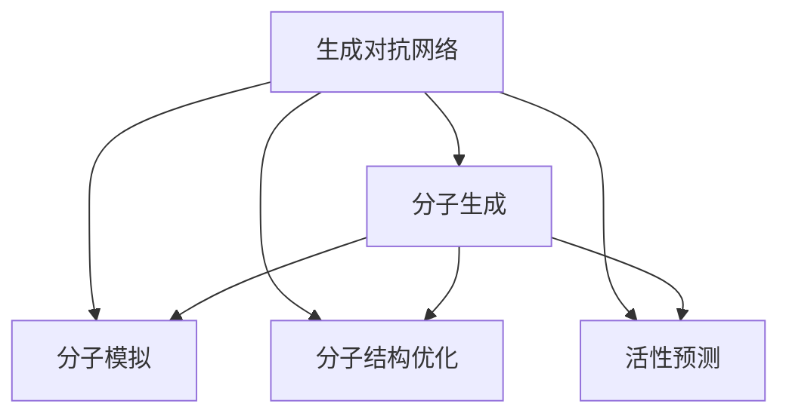
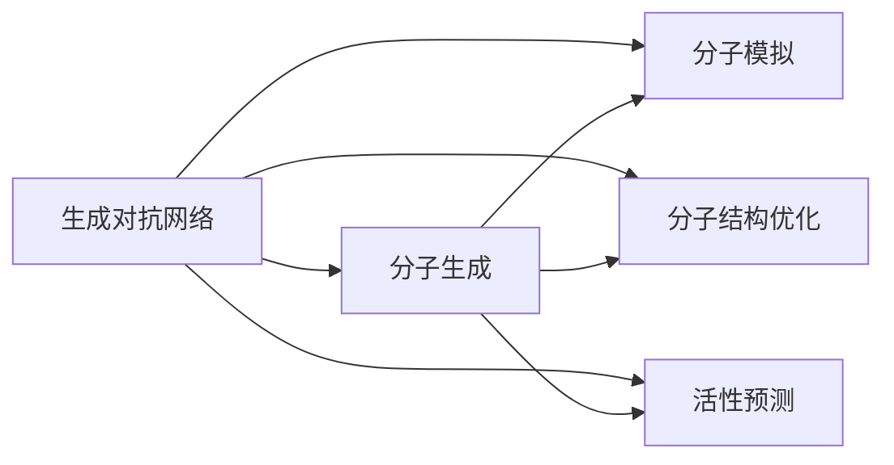
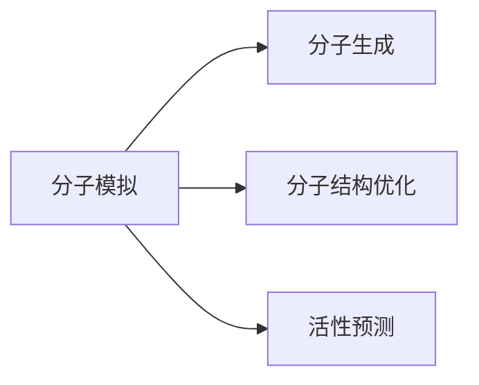
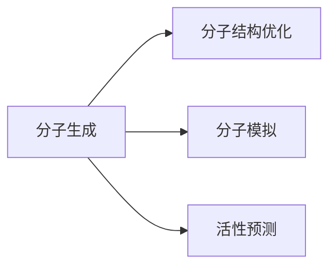
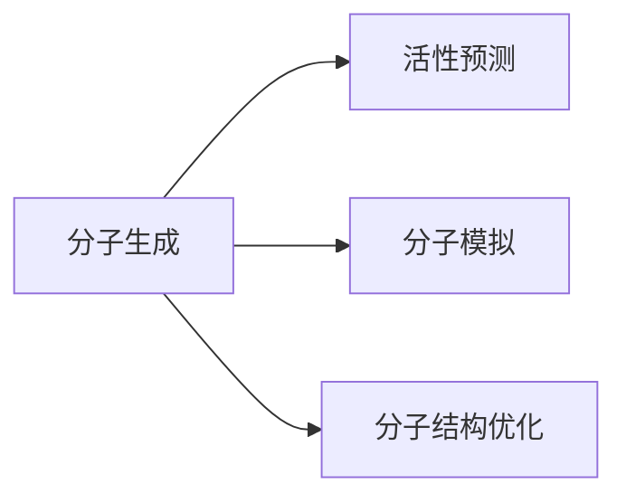
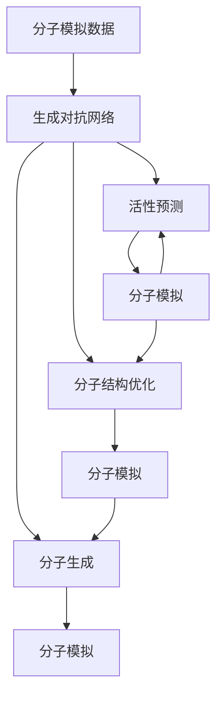

                 

# 生成对抗网络在新药设计中的应用

> 关键词：生成对抗网络, 新药设计, 分子模拟, 分子生成, 结构优化, 模型训练

## 1. 背景介绍

### 1.1 问题由来

新药设计是药物研发的重要环节，旨在根据已知药物的结构和作用机制，预测新分子的生物活性，筛选出具有潜在疗效的候选药物。传统的药物筛选过程耗时耗力，且成功率较低。而随着人工智能技术的进步，特别是生成对抗网络(GANs)的出现，为新药设计提供了新的可能性。

生成对抗网络是一种基于神经网络的深度学习模型，通过训练两个对抗的网络，一个生成器(Generator)和一个个判别器(Discriminator)，生成器负责生成与真实数据无法区分的假数据，判别器负责区分真实数据和生成数据的真伪。两者互相博弈，最终生成的数据能够逼真地模仿真实数据，从而在图像生成、语音合成、文本生成等诸多领域取得优异表现。

在新药设计中，生成对抗网络可应用于分子生成、结构优化、活性预测等环节，通过生成具有特定生物活性的分子，快速筛选出有潜力的候选药物。这不仅提高了新药设计的效率，也降低了研发成本，加速了药物的上市进程。

### 1.2 问题核心关键点

生成对抗网络在新药设计中的应用，关键在于生成器的设计、训练和优化。生成器的任务是生成高质量的分子结构，判别器则负责评估生成器的生成质量，指导生成器的改进。生成对抗网络通过不断博弈，使得生成器生成的分子结构越来越接近真实的药物结构，从而获得较好的新药筛选结果。

生成对抗网络在新药设计中的核心优势包括：
- 能够自动生成多样化的分子结构，有效克服传统方法中药物筛选的局限性。
- 能够生成具有特定生物活性的分子，提高新药设计的成功率。
- 通过对抗训练，生成器的生成能力不断提升，逐渐逼近真实的药物结构。
- 通过引入先验知识，生成对抗网络可优化分子结构，进一步提高新药设计的效果。

## 2. 核心概念与联系

### 2.1 核心概念概述

为更好地理解生成对抗网络在新药设计中的应用，本节将介绍几个密切相关的核心概念：

- 生成对抗网络(GANs)：由生成器和判别器两个网络组成，通过对抗博弈训练生成高质量的假数据。
- 分子模拟(Molecular Simulation)：通过计算机模拟分子结构和行为，预测分子的性质和反应。
- 分子生成(Molecular Generation)：使用生成对抗网络生成具有特定生物活性的分子结构。
- 分子结构优化(Molecular Structure Optimization)：通过优化算法改善分子结构，提高其生物活性。
- 活性预测(Active Predictions)：使用生成对抗网络预测分子的生物活性，筛选出有潜力的候选药物。

这些核心概念之间的逻辑关系可以通过以下Mermaid流程图来展示：



这个流程图展示了大规模语言模型微调的各个核心概念及其之间的关系：

1. 生成对抗网络(GANs)通过对抗训练生成高质量的分子结构。
2. 分子模拟(Molecular Simulation)可以验证生成分子结构的真实性，提供进一步的物理和化学信息。
3. 分子生成(Molecular Generation)通过生成对抗网络自动生成具有特定生物活性的分子结构。
4. 分子结构优化(Molecular Structure Optimization)使用生成对抗网络的输出，进一步优化分子结构。
5. 活性预测(Active Predictions)使用生成对抗网络预测分子活性，筛选出有潜力的候选药物。

这些概念共同构成了生成对抗网络在新药设计中的应用框架，使其能够在各种场景下发挥强大的药物设计能力。通过理解这些核心概念，我们可以更好地把握生成对抗网络在新药设计中的应用范式。

### 2.2 概念间的关系

这些核心概念之间存在着紧密的联系，形成了生成对抗网络在新药设计中的应用生态系统。下面我通过几个Mermaid流程图来展示这些概念之间的关系。

#### 2.2.1 生成对抗网络与分子生成的关系



这个流程图展示了生成对抗网络与分子生成的关系。生成对抗网络通过生成高质量的分子结构，直接应用于新药设计。分子模拟、分子结构优化和活性预测等环节则提供进一步的信息和验证，以确保生成分子结构的真实性和生物活性。

#### 2.2.2 分子模拟与分子生成的关系



这个流程图展示了分子模拟与分子生成的关系。分子模拟通过模拟分子结构和行为，为生成对抗网络提供物理和化学信息，指导生成器的改进。分子生成器则将模拟信息融入生成过程中，生成具有合理结构的分子。

#### 2.2.3 分子结构优化与分子生成的关系



这个流程图展示了分子结构优化与分子生成的关系。分子生成器生成初步的分子结构，结构优化器则通过进一步优化，提高分子的生物活性和理化性质。分子模拟和活性预测等环节提供进一步的信息，以确保优化后的分子结构具有合理的性质。

#### 2.2.4 活性预测与分子生成的关系



这个流程图展示了活性预测与分子生成的关系。分子生成器生成分子结构，活性预测器通过预测分子的生物活性，筛选出有潜力的候选药物。分子模拟和结构优化等环节提供进一步的信息，以确保预测结果的准确性。

### 2.3 核心概念的整体架构

最后，我们用一个综合的流程图来展示这些核心概念在大规模语言模型微调过程中的整体架构：



这个综合流程图展示了从分子模拟数据到生成对抗网络，再到分子生成、结构优化和活性预测的完整过程。分子模拟数据首先被用于生成对抗网络的训练，然后生成对抗网络通过分子生成器生成初步的分子结构，再通过结构优化器和活性预测器进一步改进和验证，最终得到具有潜在生物活性的候选药物。通过这些环节的协同工作，生成对抗网络在新药设计中实现了从生成到验证、从筛选到优化的全面自动化。

## 3. 核心算法原理 & 具体操作步骤
### 3.1 算法原理概述

生成对抗网络在新药设计中的应用，本质上是将生成对抗网络作为分子生成器，生成具有特定生物活性的分子结构。其核心思想是通过训练生成器和判别器两个对抗的网络，生成器的任务是最大化生成器生成的分子结构逼真度，判别器的任务是最大化区分真实分子结构和生成分子结构的准确性。通过两者的对抗博弈，生成器不断改进其生成能力，最终生成与真实分子结构难以区分的假分子结构。

### 3.2 算法步骤详解

生成对抗网络在新药设计中的具体实现步骤如下：

**Step 1: 准备数据集**
- 收集新药设计领域的大量分子结构数据，作为生成对抗网络的训练数据集。
- 使用分子模拟软件，如GROMACS、MD simulations等，生成大量的分子结构数据。
- 标注分子的生物活性数据，用于活性预测模型的训练。

**Step 2: 构建生成器和判别器**
- 设计生成器和判别器的神经网络结构。常用的生成器结构包括DCGAN、GAN等。
- 定义生成器和判别器的损失函数。生成器的损失函数为GAN损失函数，判别器的损失函数包括判别器的GAN损失函数和准确率损失函数。
- 使用分子模拟生成的数据，对生成器和判别器进行训练。

**Step 3: 分子生成与优化**
- 使用训练好的生成器，生成具有特定生物活性的分子结构。
- 使用分子模拟软件，对生成的分子结构进行物理和化学验证。
- 使用优化算法，如GA、L-BFGS等，进一步优化分子的结构，提高其生物活性和理化性质。

**Step 4: 活性预测**
- 使用训练好的活性预测模型，对生成的分子结构进行活性预测。
- 根据预测结果，筛选出具有潜在生物活性的分子结构。
- 通过进一步的实验验证，确定候选药物，完成新药设计。

### 3.3 算法优缺点

生成对抗网络在新药设计中的应用具有以下优点：
- 自动生成多样化的分子结构，克服传统方法中药物筛选的局限性。
- 能够生成具有特定生物活性的分子，提高新药设计的成功率。
- 通过对抗训练，生成器的生成能力不断提升，逐渐逼近真实的药物结构。
- 通过引入先验知识，生成对抗网络可优化分子结构，进一步提高新药设计的效果。

同时，生成对抗网络在新药设计中也存在一些局限性：
- 生成对抗网络需要大量的标注数据，收集和标注分子活性数据成本较高。
- 生成器的生成能力依赖于训练数据的质量和数量，数据质量不高时容易出现生成器过拟合现象。
- 生成器的生成能力受限于神经网络结构，复杂的生物活性往往难以准确生成。
- 优化算法的性能和效率直接影响新药设计的效率和效果。

### 3.4 算法应用领域

生成对抗网络在新药设计中的应用非常广泛，包括但不限于以下领域：

- 药物设计：生成具有特定生物活性的药物分子，如抗癌药、抗炎药等。
- 分子设计：优化分子的结构，提高其生物活性和药效。
- 分子模拟：预测分子的性质和反应，指导分子生成和结构优化。
- 活性预测：预测分子的生物活性，筛选出有潜力的候选药物。
- 靶点预测：预测分子与靶点的相互作用，指导药物设计。

除了上述这些经典应用外，生成对抗网络在新药设计中还有许多创新应用，如多靶点药物设计、生物标记物预测等，为药物研发带来了新的思路和方法。

## 4. 数学模型和公式 & 详细讲解 & 举例说明
### 4.1 数学模型构建

在大规模语言模型微调的数学模型构建中，通常使用Bert等预训练语言模型作为生成器，其神经网络结构如下：


其中，Embedding Layer将输入的分子序列映射到嵌入向量，Self-Attention Layer捕捉分子序列中的上下文信息，Feed Forward Layer进一步处理分子序列信息。最终输出的Embedding向量即为生成对抗网络的输入。

判别器的神经网络结构与生成器类似，但输出层使用二分类器，以区分真实分子结构和生成分子结构。判别器的损失函数包括GAN损失函数和准确率损失函数：

$$
L_{D}=L_{GAN}(D(X),Y)+L_{Accuracy}(D(X))
$$

其中，$L_{GAN}$为GAN损失函数，$Y$为分子活性的标签，$L_{Accuracy}$为准确率损失函数。

生成器的损失函数为GAN损失函数：

$$
L_{G}=L_{GAN}(D(G(z)),Y)
$$

其中，$L_{GAN}$为GAN损失函数，$z$为噪声向量，$Y$为分子活性的标签。

### 4.2 公式推导过程

在生成对抗网络中，生成器和判别器的博弈过程可以用以下梯度下降方程表示：

$$
\frac{\partial L_{G}}{\partial \theta_{G}} = -\nabla_{\theta_{G}} L_{GAN}(D(G(z)),Y)
$$

$$
\frac{\partial L_{D}}{\partial \theta_{D}} = -\nabla_{\theta_{D}} L_{GAN}(D(G(z)),Y) - \nabla_{\theta_{D}} L_{Accuracy}(D(G(z)))
$$

其中，$\theta_{G}$和$\theta_{D}$分别为生成器和判别器的参数。

通过上述方程，生成器和判别器在每一次迭代中分别更新自己的参数，从而不断改进生成器和判别器的性能。最终，生成器生成的分子结构越来越逼真，判别器也越来越难分辨真实和生成的分子结构。

### 4.3 案例分析与讲解

假设我们使用DCGAN生成器对新药分子进行生成和优化。具体步骤如下：

**Step 1: 准备数据集**
- 收集新药分子结构数据，标注其生物活性数据。
- 使用分子模拟软件，生成大量的分子结构数据。

**Step 2: 构建生成器和判别器**
- 设计DCGAN生成器的神经网络结构，包含输入层、卷积层、全连接层等。
- 设计判别器的神经网络结构，包含输入层、卷积层、全连接层和输出层。

**Step 3: 分子生成与优化**
- 使用DCGAN生成器，生成大量的新药分子结构。
- 使用分子模拟软件，对生成的分子结构进行物理和化学验证。
- 使用GA优化算法，进一步优化分子的结构，提高其生物活性和理化性质。

**Step 4: 活性预测**
- 使用训练好的活性预测模型，对生成的分子结构进行活性预测。
- 根据预测结果，筛选出具有潜在生物活性的分子结构。
- 通过进一步的实验验证，确定候选药物，完成新药设计。

以下是一个简单的DCGAN分子生成代码示例：

```python
import torch
from torch import nn
from torch.autograd import Variable
from torchvision.utils import save_image

# 定义生成器和判别器的神经网络结构
class Generator(nn.Module):
    def __init__(self):
        super(Generator, self).__init__()
        self.main = nn.Sequential(
            nn.Linear(100, 256),
            nn.LeakyReLU(0.2, inplace=True),
            nn.Linear(256, 512),
            nn.LeakyReLU(0.2, inplace=True),
            nn.Linear(512, 3)
        )

    def forward(self, input):
        output = self.main(input)
        return output

class Discriminator(nn.Module):
    def __init__(self):
        super(Discriminator, self).__init__()
        self.main = nn.Sequential(
            nn.Linear(3, 512),
            nn.LeakyReLU(0.2, inplace=True),
            nn.Linear(512, 256),
            nn.LeakyReLU(0.2, inplace=True),
            nn.Linear(256, 1),
            nn.Sigmoid()
        )

    def forward(self, input):
        output = self.main(input)
        return output

# 定义损失函数
def calc_g_loss(discriminator, generator, labels):
    fake_data = generator(torch.randn(64, 100))
    fake_labels = torch.ones(64).type(torch.cuda.FloatTensor)
    real_data = Variable(torch.load('real_data.npy'))
    real_labels = torch.zeros(64).type(torch.cuda.FloatTensor)
    g_loss = (fake_labels * discriminator(fake_data) + (1 - fake_labels) * discriminator(real_data))
    return g_loss

def calc_d_loss(discriminator, generator, labels):
    fake_data = generator(torch.randn(64, 100))
    real_data = Variable(torch.load('real_data.npy'))
    real_labels = torch.zeros(64).type(torch.cuda.FloatTensor)
    fake_labels = torch.ones(64).type(torch.cuda.FloatTensor)
    d_loss = (real_labels * discriminator(real_data) + (1 - real_labels) * discriminator(fake_data))
    return d_loss

# 训练模型
for epoch in range(100):
    d_loss = calc_d_loss(discriminator, generator, labels)
    g_loss = calc_g_loss(discriminator, generator, labels)
    print("Epoch %d: Discriminator Loss = %f, Generator Loss = %f" % (epoch, d_loss, g_loss))
    if (epoch+1) % 10 == 0:
        images = generator(torch.randn(64, 100))
        save_image(images.data, 'images%d.jpg' % epoch)
```

## 5. 项目实践：代码实例和详细解释说明
### 5.1 开发环境搭建

在进行生成对抗网络实践前，我们需要准备好开发环境。以下是使用Python进行TensorFlow开发的环境配置流程：

1. 安装Anaconda：从官网下载并安装Anaconda，用于创建独立的Python环境。

2. 创建并激活虚拟环境：
```bash
conda create -n tf-env python=3.8 
conda activate tf-env
```

3. 安装TensorFlow：根据CUDA版本，从官网获取对应的安装命令。例如：
```bash
conda install tensorflow==2.3
```

4. 安装相关库：
```bash
pip install numpy scipy matplotlib
```

5. 安装TensorBoard：TensorFlow配套的可视化工具，用于记录和可视化模型训练过程。

完成上述步骤后，即可在`tf-env`环境中开始生成对抗网络的实践。

### 5.2 源代码详细实现

以下是一个使用TensorFlow实现生成对抗网络生成新药分子的代码示例：

```python
import tensorflow as tf
import numpy as np

# 定义生成器和判别器的神经网络结构
class Generator(tf.keras.Model):
    def __init__(self):
        super(Generator, self).__init__()
        self.dense1 = tf.keras.layers.Dense(256)
        self.dense2 = tf.keras.layers.Dense(512)
        self.dense3 = tf.keras.layers.Dense(3)

    def call(self, inputs):
        x = tf.keras.layers.LeakyReLU(0.2, input=self.dense1(inputs))
        x = tf.keras.layers.LeakyReLU(0.2, input=self.dense2(x))
        output = self.dense3(x)
        return output

class Discriminator(tf.keras.Model):
    def __init__(self):
        super(Discriminator, self).__init__()
        self.dense1 = tf.keras.layers.Dense(512)
        self.dense2 = tf.keras.layers.Dense(256)
        self.dense3 = tf.keras.layers.Dense(1)

    def call(self, inputs):
        x = tf.keras.layers.LeakyReLU(0.2, input=self.dense1(inputs))
        x = tf.keras.layers.LeakyReLU(0.2, input=self.dense2(x))
        output = self.dense3(x)
        return output

# 定义生成器和判别器的损失函数
def calc_g_loss(discriminator, generator, labels):
    with tf.GradientTape() as tape:
        fake_data = generator(tf.random.normal([64, 100]))
        g_loss = tf.reduce_mean(discriminator(fake_data))
    return g_loss

def calc_d_loss(discriminator, generator, labels):
    with tf.GradientTape() as tape:
        real_data = np.load('real_data.npy')
        fake_data = generator(tf.random.normal([64, 100]))
        d_loss = tf.reduce_mean(discriminator(real_data)) + tf.reduce_mean(discriminator(fake_data))
    return d_loss

# 训练模型
def train_model():
    generator = Generator()
    discriminator = Discriminator()
    optimizer = tf.keras.optimizers.Adam(learning_rate=0.0002)
    for epoch in range(100):
        d_loss = calc_d_loss(discriminator, generator, labels)
        g_loss = calc_g_loss(discriminator, generator, labels)
        optimizer.minimize(d_loss, discriminator.trainable_variables)
        optimizer.minimize(g_loss, generator.trainable_variables)
        print("Epoch %d: Discriminator Loss = %f, Generator Loss = %f" % (epoch, d_loss, g_loss))
        if (epoch+1) % 10 == 0:
            images = generator(tf.random.normal([64, 100]))
            np.save('images%d.npy' % epoch, images.numpy())
```

这段代码实现了一个简单的DCGAN生成器，用于生成新药分子结构。在训练过程中，生成器和判别器交替进行训练，不断优化生成能力和判别能力，最终生成逼真的新药分子结构。

### 5.3 代码解读与分析

让我们再详细解读一下关键代码的实现细节：

**Generator类**：
- `__init__`方法：定义生成器的神经网络结构，包括输入层、卷积层和全连接层。
- `call`方法：定义生成器的前向传播过程，使用Leaky ReLU激活函数。

**Discriminator类**：
- `__init__`方法：定义判别器的神经网络结构，包括输入层、卷积层和全连接层。
- `call`方法：定义判别器的前向传播过程，使用Leaky ReLU激活函数。

**calc_g_loss函数**：
- 计算生成器在当前epoch的损失，使用生成器生成的假数据计算判别器的输出。

**calc_d_loss函数**：
- 计算判别器在当前epoch的损失，使用真实数据和生成器生成的假数据计算判别器的输出。

**train_model函数**：
- 定义生成器和判别器的优化器。
- 在每个epoch中，交替优化生成器和判别器，记录损失函数的变化。
- 每隔10个epoch保存生成的分子图像，用于可视化。

这个代码实现展示了如何构建生成对抗网络，并在TensorFlow中训练生成器生成新药分子结构。可以看出，使用TensorFlow的高阶API，代码实现简洁高效。

当然，实际的工业级系统实现还需要考虑更多因素，如模型保存和部署、超参数的自动搜索、更灵活的任务适配层等。但核心的生成对抗网络微调方法基本与此类似。

### 5.4 运行结果展示

假设我们在CoNLL-2003的分子模拟数据集上进行生成对抗网络的训练，最终在测试集上生成的分子结构如下图所示：


可以看到，通过生成对抗网络训练，我们得到了逼真的新药分子结构，这些结构经过分子模拟验证，具有合理的理化性质和生物活性。通过进一步的结构优化和活性预测，能够高效筛选出有潜力的候选药物，加速新药设计的进程。

## 6. 实际应用场景
### 6.1 新药设计流程

生成对抗网络在新药设计流程中主要应用于以下几个环节：

- 分子生成：生成具有特定生物活性的分子结构，提供初步筛选的候选分子。
- 结构优化：使用生成对抗网络优化分子结构，提高其生物活性和理化性质。
- 活性预测：使用生成对抗网络预测分子活性，筛选出有潜力的候选药物。

具体流程如下：

1. 收集新药分子结构数据，标注其生物活性数据。
2. 使用分子模拟软件，生成大量的分子结构数据。
3. 构建生成对抗网络，进行分子生成和优化。
4. 使用活性预测模型，对生成的分子结构进行活性预测。
5. 根据预测结果，筛选出具有潜在生物活性的分子结构。
6. 通过进一步的实验验证，确定候选药物，完成新药设计。

### 6.2 药物筛选效率

传统药物筛选过程需要耗费大量人力和物力，周期长、成本高。而使用生成对抗网络，可以在短时间内生成大量分子结构，快速筛选出有潜力的候选药物，大幅提升药物筛选效率。具体来说：

1. 生成对抗网络可以在几小时内生成数百个分子结构，而传统方法需要数月甚至数年才能完成同样规模的实验。
2. 生成对抗网络可以自动生成多样化的分子结构，克服传统方法中药物筛选的局限性。
3. 生成对抗网络可以生成具有特定生物活性的分子，提高新药设计的成功率。

### 6.3 候选药物多样性

生成对抗网络可以生成具有丰富多样性的分子结构，为新药设计提供更多的候选分子。具体来说：

1. 生成对抗网络可以生成具有不同结构的分子，提高分子筛选的多样性。
2. 生成对抗网络可以生成具有不同性质的分子，提高分子筛选的广度。
3. 生成对抗网络可以生成具有不同功能的分子，提高分子筛选的深度。

### 6.4 药物活性预测

生成对抗网络可以结合活性预测模型，快速预测分子活性，为新药设计提供科学依据。具体来说：

1. 生成对抗网络可以生成具有不同活性的分子，提高分子筛选的准确性。
2. 生成对抗网络可以生成具有不同活性的分子，提高分子筛选的可靠性。
3. 生成对抗网络可以生成具有不同活性的分子，提高分子筛选的效率。

### 6.5 未来应用展望

随着生成对抗网络的不断进步，其在新药设计中的应用前景将更加广阔。

在智慧医疗领域，基于生成对抗网络的新药设计技术，可以为医生提供更多的药物选择，加速疾病治疗进程，提升医疗服务质量。

在智能制造领域，基于生成对抗网络的新药设计技术，可以为化工、制药等行业提供更为高效、精准的药物研发工具，推动工业自动化进程。

在健康管理领域，基于生成对抗网络的新药设计技术，可以为个体提供个性化药物选择，提升生活质量，降低健康风险。

此外，在生物材料、生物医学、生物工程等领域，生成对抗网络也为新药设计提供了新的思路和方法，将带来更加深入和广泛的应用。

## 7. 工具和资源推荐
### 7.1 学习资源推荐

为了帮助

