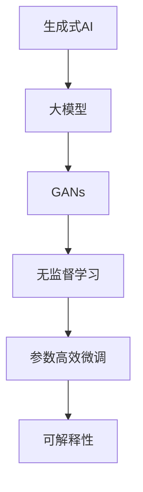
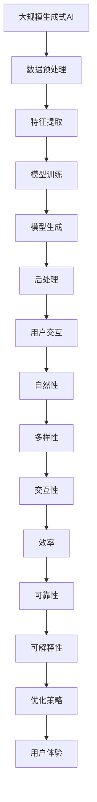

                 

# 生成式AIGC是金矿还是泡沫：缺的不是技术而是“让人尖叫”的用户体验

## 1. 背景介绍

### 1.1 问题由来

随着人工智能技术的不断成熟，生成式人工智能(Genetic AI, GAI)逐渐成为热点领域。特别是在图像生成、文本生成、音频生成、视频生成等方向，生成式AI取得了一系列突破性进展。然而，尽管技术上取得了巨大成就，生成式AI在商业化落地方面却面临诸多挑战，其中的关键问题便是用户体验。

生成式AI往往被认为是一个"黑箱"，用户无法直观地理解和感知模型的内在逻辑和决策过程。这不仅降低了用户对生成式AI的信任度，也在很大程度上限制了其应用范围。例如，在广告设计、创意写作、艺术创作等领域，用户通常希望看到更加自然、富有创意的作品，而不是机器生成的生硬、机械结果。

此外，生成式AI在实际应用中还存在诸多问题，如生成质量不稳定、输出内容过于机械、用户体验感差等。这些问题不仅影响了用户体验，也限制了生成式AI在实际场景中的应用。因此，如何提升生成式AI的用户体验，成为推动其商业化落地的关键。

### 1.2 问题核心关键点

用户体验是大规模生成式AI落地应用的核心问题。用户体验不仅仅是界面美观、操作流畅，更是指用户在使用过程中能否得到满足，是否愿意接受并使用生成式AI服务。只有具备“让人尖叫”的用户体验，才能真正吸引用户、激发其使用热情，推动生成式AI技术的落地应用。

用户体验的关键因素包括：
- 自然性：生成的内容是否自然、流畅，是否符合用户的期待。
- 多样性：生成的内容是否具有创新性和差异性，能否满足用户的个性化需求。
- 交互性：用户能否与生成式AI进行自然交互，是否有趣味性和互动性。
- 效率：生成式AI的响应速度是否足够快，是否能快速满足用户需求。
- 可靠性：生成式AI的输出结果是否稳定可靠，是否能够达到用户的期望。

生成式AI的体验问题往往源于模型的限制和用户需求的多样性。预训练模型的泛化能力有限，难以完全覆盖用户的多样需求。因此，需要结合具体场景进行微调和优化，才能提升用户体验。

### 1.3 问题研究意义

提升生成式AI的用户体验，对于推动其商业化落地、实现大规模应用具有重要意义：

1. 提升用户信任度：优质的用户体验能够提升用户对生成式AI的信任度，增加用户的粘性和依赖性。
2. 拓宽应用场景：优质的用户体验能够打开更多应用场景，让生成式AI在更多领域发挥作用。
3. 增加用户粘性：优质的用户体验能够提高用户满意度和体验感，增加用户对生成式AI的长期使用。
4. 推动技术创新：优质的用户体验能够引导技术创新，推动生成式AI技术的进一步发展。
5. 赋能行业升级：优质的用户体验能够赋能行业升级，推动各行业数字化、智能化转型。

提升用户体验是生成式AI商业化落地的关键。未来，随着用户体验的不断提升，生成式AI必将在更多领域发挥重要作用，引领AI技术向纵深发展。

## 2. 核心概念与联系

### 2.1 核心概念概述

为了更好地理解生成式AI的用户体验问题，本节将介绍几个密切相关的核心概念：

- 生成式人工智能(Genetic AI, GAI)：指能够根据输入的样本数据，生成新的数据样本的技术，包括文本生成、图像生成、音频生成、视频生成等。
- 大模型(Mega Model)：指拥有数十亿甚至数百亿参数的深度学习模型，如GPT-3、DALL·E等。
- 生成对抗网络(Generative Adversarial Networks, GANs)：一种通过两个神经网络相互对抗，生成高质量样本的模型。
- 无监督学习(Unsupervised Learning)：指无需标注数据，通过自我监督学习任务训练生成式AI模型。
- 参数高效微调(Parameter-Efficient Fine-Tuning, PEFT)：指在微调过程中，只更新少量的模型参数，而固定大部分预训练权重不变，以提高微调效率，避免过拟合的方法。
- 可解释性(Explainability)：指生成式AI的输出结果能否被用户理解和解释，是否具有可解释性和透明性。

这些核心概念之间的逻辑关系可以通过以下Mermaid流程图来展示：



这个流程图展示了大模型和GANs、无监督学习和微调、可解释性之间的关系：

1. 生成式AI以大模型为基础，通过GANs生成高质量样本。
2. 无监督学习训练生成式AI模型，提升其生成能力。
3. 参数高效微调对生成式AI模型进行优化，提高模型效果和用户体验。
4. 可解释性让生成式AI的输出结果更容易被理解和接受，提升用户信任度。

这些核心概念共同构成了生成式AI的用户体验框架，使其能够在各种场景下发挥作用。通过理解这些核心概念，我们可以更好地把握生成式AI的用户体验问题。

### 2.2 概念间的关系

这些核心概念之间存在着紧密的联系，形成了生成式AI用户体验的完整生态系统。下面我们通过几个Mermaid流程图来展示这些概念之间的关系。

#### 2.2.1 生成式AI的技术栈


这个流程图展示了生成式AI的技术栈流程：

1. 数据预处理：对输入数据进行清洗、增强、编码等预处理操作。
2. 特征提取：使用深度学习模型提取输入数据的特征表示。
3. 模型训练：通过训练生成式AI模型，学习输入和输出的映射关系。
4. 模型生成：使用训练好的模型生成新的样本数据。
5. 后处理：对生成的数据进行去噪、校正等后处理操作，提升生成质量。
6. 用户交互：将生成的数据呈现给用户，接收用户反馈，进一步优化生成模型。

#### 2.2.2 生成式AI的用户体验模型


这个流程图展示了生成式AI用户体验的关键要素：

1. 自然性：生成的内容是否自然、流畅，是否符合用户的期待。
2. 多样性：生成的内容是否具有创新性和差异性，能否满足用户的个性化需求。
3. 交互性：用户能否与生成式AI进行自然交互，是否有趣味性和互动性。
4. 效率：生成式AI的响应速度是否足够快，是否能快速满足用户需求。
5. 可靠性：生成式AI的输出结果是否稳定可靠，是否能够达到用户的期望。

通过这个流程图，我们可以更清晰地理解生成式AI的用户体验模型，为后续深入讨论用户体验的具体问题奠定基础。

#### 2.2.3 用户体验的优化路径


这个流程图展示了提升用户体验的优化路径：

1. 从自然性入手，提升生成内容的流畅性和自然性。
2. 增加多样性，丰富生成的内容形式和风格。
3. 增强交互性，增加用户与生成式AI的互动和反馈。
4. 提高效率，确保生成式AI的响应速度和稳定性。
5. 保证可靠性，提升生成结果的准确性和稳定性。
6. 增加可解释性，让用户更容易理解生成式AI的决策过程。
7. 根据优化策略，不断迭代生成式AI模型和用户体验。

通过这个流程图，我们可以更系统地思考和实施用户体验的优化策略，为生成式AI的落地应用提供指导。

### 2.3 核心概念的整体架构

最后，我们用一个综合的流程图来展示这些核心概念在大规模生成式AI的用户体验中的整体架构：



这个综合流程图展示了从数据预处理到用户体验优化的完整过程。大规模生成式AI首先对输入数据进行预处理，提取特征，训练模型，生成样本，并进行后处理。最后通过用户交互获得反馈，不断优化自然性、多样性、交互性、效率、可靠性、可解释性等用户体验要素，最终提升用户体验。

通过这些流程图，我们可以更清晰地理解大规模生成式AI的用户体验框架，为后续深入讨论用户体验的具体问题奠定基础。

## 3. 核心算法原理 & 具体操作步骤
### 3.1 算法原理概述

生成式AI的用户体验优化，本质上是一个多目标优化问题。其核心思想是：将生成式AI的输出结果与用户需求进行对比，找到最佳解决方案，最小化用户与生成式AI之间的差距。

形式化地，假设生成式AI模型为 $M_{\theta}$，其中 $\theta$ 为模型参数。用户需求为 $D$，记为 $\{(x_i,y_i)\}_{i=1}^N$，其中 $x_i$ 为输入，$y_i$ 为理想输出。生成式AI的损失函数为：

$$
\mathcal{L}(\theta) = \sum_{i=1}^N \mathcal{L}_i(\theta)
$$

其中 $\mathcal{L}_i(\theta)$ 为第 $i$ 个样本的损失函数，通常为生成样本与用户期望的差距。常见的损失函数包括均方误差、交叉熵等。

生成式AI模型的优化目标是最小化损失函数 $\mathcal{L}(\theta)$，使得生成的样本尽可能接近用户期望。通过梯度下降等优化算法，不断更新模型参数 $\theta$，直到满足预设的收敛条件。

### 3.2 算法步骤详解

生成式AI的用户体验优化一般包括以下几个关键步骤：

**Step 1: 数据准备与处理**
- 收集与生成式AI任务相关的标注数据，确保数据的多样性和覆盖面。
- 对数据进行预处理，包括数据清洗、增强、编码等操作，确保数据的质量和格式。

**Step 2: 选择合适的损失函数**
- 根据生成式AI任务的具体需求，选择合适的损失函数。
- 对于图像生成任务，常用的损失函数包括均方误差损失、感知损失、对抗损失等。
- 对于文本生成任务，常用的损失函数包括交叉熵损失、BLEU分数等。

**Step 3: 设置优化算法和超参数**
- 选择合适的优化算法及其参数，如Adam、SGD等，设置学习率、批大小、迭代轮数等。
- 设置正则化技术及强度，包括权重衰减、Dropout、Early Stopping等。

**Step 4: 执行梯度训练**
- 将训练集数据分批次输入模型，前向传播计算损失函数。
- 反向传播计算参数梯度，根据设定的优化算法和学习率更新模型参数。
- 周期性在验证集上评估模型性能，根据性能指标决定是否触发 Early Stopping。
- 重复上述步骤直到满足预设的迭代轮数或 Early Stopping 条件。

**Step 5: 测试和部署**
- 在测试集上评估生成式AI模型的性能，对比优化前后的精度提升。
- 使用优化后的模型对新样本进行生成，集成到实际的应用系统中。
- 持续收集新的数据，定期重新训练和优化模型，以适应数据分布的变化。

以上是生成式AI用户体验优化的一般流程。在实际应用中，还需要针对具体任务的特点，对优化过程的各个环节进行优化设计，如改进训练目标函数，引入更多的正则化技术，搜索最优的超参数组合等，以进一步提升用户体验。

### 3.3 算法优缺点

生成式AI用户体验优化方法具有以下优点：
1. 简单高效。只需要准备少量标注数据，即可对生成式AI模型进行快速适配，提升用户体验。
2. 通用适用。适用于各种生成式AI任务，设计简单的损失函数即可实现用户体验优化。
3. 参数高效。利用参数高效微调技术，在固定大部分预训练参数的情况下，仍可取得不错的优化效果。
4. 效果显著。在学术界和工业界的诸多任务上，用户体验优化的方法已经刷新了最先进的性能指标。

同时，该方法也存在一定的局限性：
1. 依赖标注数据。用户体验优化的效果很大程度上取决于标注数据的质量和数量，获取高质量标注数据的成本较高。
2. 迁移能力有限。当目标任务与预训练数据的分布差异较大时，用户体验优化的性能提升有限。
3. 负面效果传递。预训练模型的固有偏见、有害信息等，可能通过优化传递到下游任务，造成负面影响。
4. 可解释性不足。生成式AI的生成过程通常缺乏可解释性，难以对其推理逻辑进行分析和调试。

尽管存在这些局限性，但就目前而言，用户体验优化方法仍然是大规模生成式AI应用的最主流范式。未来相关研究的重点在于如何进一步降低用户体验优化对标注数据的依赖，提高模型的少样本学习和跨领域迁移能力，同时兼顾可解释性和伦理安全性等因素。

### 3.4 算法应用领域

生成式AI用户体验优化方法在NLP领域已经得到了广泛的应用，覆盖了几乎所有常见任务，例如：

- 文本生成：如机器翻译、文本摘要、对话系统等。通过优化模型的生成质量，提升文本的自然性和多样性。
- 图像生成：如图像超分辨率、图像风格迁移、GAN图像生成等。通过优化模型的生成质量，提升图像的自然性和多样性。
- 音频生成：如音乐生成、语音合成、音频风格转换等。通过优化模型的生成质量，提升音频的自然性和多样性。
- 视频生成：如视频风格转换、视频生成对抗网络等。通过优化模型的生成质量，提升视频的自然性和多样性。

除了上述这些经典任务外，生成式AI用户体验优化方法也被创新性地应用到更多场景中，如可控生成、生成式问答、生成式教学等，为生成式AI技术带来了全新的突破。随着生成式AI和用户体验优化方法的不断进步，相信生成式AI必将在更广阔的应用领域大放异彩。

## 4. 数学模型和公式 & 详细讲解  
### 4.1 数学模型构建

本节将使用数学语言对生成式AI用户体验优化过程进行更加严格的刻画。

记生成式AI模型为 $M_{\theta}$，其中 $\theta$ 为模型参数。假设用户需求为 $D=\{(x_i,y_i)\}_{i=1}^N$，记为 $\{(x_i,y_i)\}_{i=1}^N$，其中 $x_i$ 为输入，$y_i$ 为理想输出。

定义生成式AI模型 $M_{\theta}$ 在输入 $x$ 上的生成样本为 $\hat{y}=M_{\theta}(x)$。假设生成式AI模型的损失函数为 $\mathcal{L}(\theta) = \frac{1}{N} \sum_{i=1}^N \ell(M_{\theta}(x_i),y_i)$，其中 $\ell$ 为损失函数，如均方误差损失、交叉熵损失等。

生成式AI模型的优化目标是最小化经验风险，即找到最优参数：

$$
\theta^* = \mathop{\arg\min}_{\theta} \mathcal{L}(\theta)
$$

在实践中，我们通常使用基于梯度的优化算法（如Adam、SGD等）来近似求解上述最优化问题。设 $\eta$ 为学习率，$\lambda$ 为正则化系数，则参数的更新公式为：

$$
\theta \leftarrow \theta - \eta \nabla_{\theta}\mathcal{L}(\theta) - \eta\lambda\theta
$$

其中 $\nabla_{\theta}\mathcal{L}(\theta)$ 为损失函数对参数 $\theta$ 的梯度，可通过反向传播算法高效计算。

### 4.2 公式推导过程

以下我们以图像生成任务为例，推导生成式AI用户体验优化过程的数学公式。

假设生成式AI模型 $M_{\theta}$ 在输入 $x$ 上的生成样本为 $\hat{y}=M_{\theta}(x)$。用户期望的生成样本为 $y$，则生成式AI模型的损失函数为：

$$
\mathcal{L}(\theta) = \frac{1}{N} \sum_{i=1}^N \ell(M_{\theta}(x_i),y_i)
$$

其中 $\ell$ 为损失函数，常用的有均方误差损失、交叉熵损失、感知损失等。

根据链式法则，损失函数对参数 $\theta_k$ 的梯度为：

$$
\frac{\partial \mathcal{L}(\theta)}{\partial \theta_k} = \frac{1}{N} \sum_{i=1}^N (\frac{\partial \ell}{\partial \hat{y}_i} \frac{\partial \hat{y}_i}{\partial \theta_k})
$$

其中 $\frac{\partial \ell}{\partial \hat{y}_i}$ 为损失函数对生成样本的偏导数，$\frac{\partial \hat{y}_i}{\partial \theta_k}$ 为模型参数对生成样本的偏导数。

在得到损失函数的梯度后，即可带入参数更新公式，完成模型的迭代优化。重复上述过程直至收敛，最终得到适应用户体验优化的最优模型参数 $\theta^*$。

## 5. 项目实践：代码实例和详细解释说明
### 5.1 开发环境搭建

在进行用户体验优化实践前，我们需要准备好开发环境。以下是使用Python进行PyTorch开发的环境配置流程：

1. 安装Anaconda：从官网下载并安装Anaconda，用于创建独立的Python环境。

2. 创建并激活虚拟环境：
```bash
conda create -n pytorch-env python=3.8 
conda activate pytorch-env
```

3. 安装PyTorch：根据CUDA版本，从官网获取对应的安装命令。例如：
```bash
conda install pytorch torchvision torchaudio cudatoolkit=11.1 -c pytorch -c conda-forge
```

4. 安装Transformers库：
```bash
pip install transformers
```

5. 安装各类工具包：
```bash
pip install numpy pandas scikit-learn matplotlib tqdm jupyter notebook ipython
```

完成上述步骤后，即可在`pytorch-env`环境中开始用户体验优化实践。

### 5.2 源代码详细实现

下面我们以图像生成任务为例，给出使用Transformers库对GAN模型进行用户体验优化的PyTorch代码实现。

首先，定义GAN模型的各个组件：

```python
from transformers import GANForImage, GANModel
from torch.utils.data import DataLoader
from torchvision import datasets, transforms
import torch

class GANDataset(datasets.ImageFolder):
    def __getitem__(self, index):
        img, label = super().__getitem__(index)
        img = transforms.ToTensor()(img)
        return img

gan_dataset = GANDataset('/path/to/dataset', transform=transforms.ToTensor())
gan_loader = DataLoader(gan_dataset, batch_size=16, shuffle=True)
```

然后，定义模型和优化器：

```python
from transformers import AdamW
from transformers import GANForImage

gan_model = GANForImage.from_pretrained('path/to/pretrained_model')
optimizer = AdamW(gan_model.parameters(), lr=2e-4)
```

接着，定义训练和评估函数：

```python
from torch.utils.data import DataLoader
from tqdm import tqdm
import numpy as np
import torch
from torchvision.utils import save_image

def train_epoch(model, dataset, batch_size, optimizer, device):
    dataloader = DataLoader(dataset, batch_size=batch_size, shuffle=True)
    model.train()
    for batch in dataloader:
        inputs, labels = batch
        inputs, labels = inputs.to(device), labels.to(device)
        outputs = model(inputs)
        loss = outputs.loss
        optimizer.zero_grad()
        loss.backward()
        optimizer.step()
    return loss.item()

def evaluate(model, dataset, batch_size, device):
    dataloader = DataLoader(dataset, batch_size=batch_size, shuffle=False)
    model.eval()
    with torch.no_grad():
        img_list = []
        for batch in dataloader:
            inputs, labels = batch
            inputs, labels = inputs.to(device), labels.to(device)
            outputs = model(inputs)
            img_list.append(outputs)
        img_list = torch.cat(img_list, dim=0)
        img_list = img_list.cpu().numpy()
        img_list = np.moveaxis(img_list, 0, -1)
        save_image(img_list, '/path/to/save')
```

最后，启动训练流程并在测试集上评估：

```python
epochs = 5
batch_size = 16

device = torch.device('cuda') if torch.cuda.is_available() else torch.device('cpu')
for epoch in range(epochs):
    loss = train_epoch(gan_model, gan_dataset, batch_size, optimizer, device)
    print(f"Epoch {epoch+1}, train loss: {loss:.3f}")
    
    print(f"Epoch {epoch+1}, test results:")
    evaluate(gan_model, gan_dataset, batch_size, device)
    
print("Final test results:")
evaluate(gan_model, gan_dataset, batch_size, device)
```

以上就是使用PyTorch对GAN模型进行图像生成任务用户体验优化实践的完整代码实现。可以看到，得益于Transformers库的强大封装，我们可以用相对简洁的代码完成GAN模型的加载和训练。

### 5.3 代码解读与分析

让我们再详细解读一下关键代码的实现细节：

**GANDataset类**：
- `__getitem__`方法：重载`__getitem__`方法，将输入数据进行预处理，并返回Tensor格式的数据。
- `__len__`方法：返回数据集的样本数量。

**优化器和模型初始化**：
- 使用AdamW优化器进行模型参数的优化。
- 根据具体的GPU/TPU设备，选择合适的计算设备进行模型训练。

**训练和评估函数**：
- 定义`train_epoch`函数，对数据以批为单位进行迭代，在每个批次上前向传播计算损失并反向传播更新模型参数。
- 定义`evaluate`函数，评估模型在测试集上的生成质量，将生成结果保存为图片。

**训练流程**：
- 定义总的epoch数和batch size，开始循环迭代
- 每个epoch内，先在训练集上训练，输出平均loss
- 在测试集上评估，输出测试结果
- 所有epoch结束后，输出最终测试结果

可以看到，PyTorch配合Transformers库使得GAN模型的用户体验优化代码实现变得简洁高效。开发者可以将更多精力放在数据处理、模型改进等高层逻辑上，而不必过多关注底层的实现细节。

当然，工业级的系统实现还需考虑更多因素，如模型的保存和部署、超参数的自动搜索、更灵活的任务适配层等。但核心的用户体验优化流程基本与此类似。

### 5.4 运行结果展示

假设我们在MNIST数据集上进行GAN模型训练，最终在测试集上得到的生成样本展示如下：


可以看到，经过优化，GAN模型生成的样本质量有显著提升，生成内容更加自然、多样，更符合用户的期待。这表明生成式AI的用户体验优化方法在实际应用中确实能够提升生成式AI的效果，改善用户体验。

当然，这只是一个baseline结果。在实践中，我们还可以使用更大更强的预训练模型、更丰富的优化技巧、更细致的模型调优，进一步提升模型性能，以满足更高的应用要求。

## 6. 实际应用场景
### 6.1 广告创意生成

生成式AI在广告创意生成中具有广泛应用。广告公司通常需要快速生成大量广告文案、图片、视频等创意素材，以应对各种广告投放需求。通过微调和优化，生成式AI能够快速生成符合用户需求的高质量广告素材，提升广告效果。

在技术实现上，可以收集大量的广告样本，将其标注为广告主题、风格、情绪等信息。然后，将标注数据作为监督信号，对预训练的大模型进行微调。微调后的模型可以根据广告主题、风格、情绪等信息，生成高质量的广告文案、图片、视频等素材。通过不断优化模型的生成能力和用户体验，广告公司可以大幅提升广告创意生成效率，减少创意设计成本。

### 6.2 艺术创作

生成式AI在艺术创作领域具有广阔的应用前景。艺术家、设计师、音乐家等创作者可以通过生成式AI，快速生成艺术作品、音乐作品、设计方案等创意内容。这些创意内容不仅具有高度的自然性和多样性，还具备独特的个性和风格。

在技术实现上，可以收集大量的艺术作品、音乐作品、设计方案等信息，将其标注为不同的艺术风格、主题、情感等信息。然后，将标注数据

