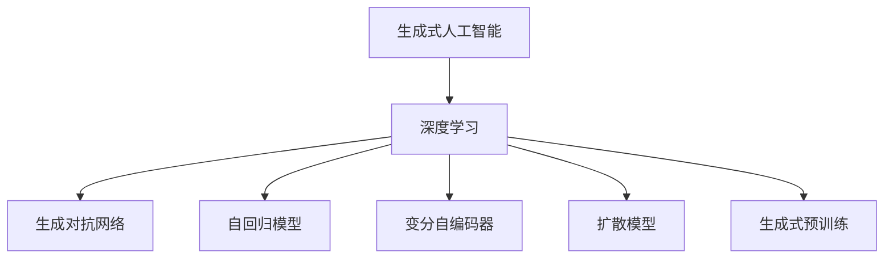

                 

## 1. 背景介绍

### 1.1 问题由来

随着人工智能(AI)技术的迅猛发展，生成式人工智能(Generative AI, GAI)逐渐成为了AI领域的新热点。它通过大规模的深度学习和生成模型，生成高质量的文本、图像、音频等，在内容创作、产品设计、数据分析等多个领域展现出巨大的潜力。相比于传统的基于规则和模板的AI技术，生成式AI具有更强的灵活性和创造力，能够更好地适应不断变化的市场需求和应用场景。

然而，尽管生成式AI在技术上取得了显著进展，其商业化之路却并不平坦。如何高效地将AI技术与实际业务场景结合，实现商业价值的最大化，成为当前AI应用的核心挑战。本文将深入探讨生成式AI的商业化路径，从技术原理到具体实践，全面剖析生成式AI在商业应用中的机遇与挑战。

### 1.2 问题核心关键点

生成式AI的商业化涉及多个核心要素：

- **技术成熟度**：生成式AI技术本身是否已经足够成熟，能否稳定高效地生成高质量的成果。
- **商业模式**：如何将AI技术封装为商业产品或服务，如何定价和盈利。
- **市场需求**：目标市场是否有足够多的需求，这些需求是否具有可扩展性和可持续性。
- **应用场景**：AI技术在特定应用场景中的实际效果，是否真正解决了用户的痛点。
- **技术壁垒**：企业是否具备足够的技术积累和竞争力，能否防止其他企业模仿。

明确这些关键点后，我们可以更系统地分析生成式AI的商业化路径，找到切实可行的落地方案。

### 1.3 问题研究意义

生成式AI的商业化对于推动AI技术在各行各业的普及和应用具有重要意义：

1. **降低研发成本**：通过利用现成的AI技术，可以快速构建创新产品，缩短研发周期，降低开发成本。
2. **提升产品质量**：生成式AI可以生成高质量的内容和设计，提升产品的创新性和吸引力。
3. **拓展应用边界**：生成式AI可以应用于创意设计、媒体制作、广告营销等多个领域，拓宽AI应用的边界。
4. **驱动市场创新**：生成式AI为传统行业注入新的创新活力，推动各领域的数字化转型。
5. **增强用户体验**：生成式AI能够提供个性化的内容推荐和智能交互，增强用户体验。

总之，生成式AI的商业化是AI技术落地应用的重要一步，对于提升AI技术的市场渗透率和商业价值具有关键作用。

## 2. 核心概念与联系

### 2.1 核心概念概述

为了更好地理解生成式AI的商业化路径，本节将介绍几个密切相关的核心概念：

- **生成式人工智能(GAI)**：通过机器学习算法和深度生成模型，生成文本、图像、音频等内容的AI技术。
- **深度学习(Deep Learning, DL)**：利用多层神经网络进行特征学习和模式识别的机器学习方法。
- **生成对抗网络(GAN)**：一种生成模型，通过训练两个相互对抗的神经网络，生成逼真的样本。
- **自回归模型(Autoregressive Model)**：基于当前和过去的输入生成下一个输出的模型。
- **变分自编码器(VAE)**：一种生成模型，通过学习数据的潜在分布来生成新样本。
- **扩散模型(Diffusion Model)**：一种生成模型，通过逐步增加噪声来生成样本。
- **生成式预训练(Generative Pre-training, GPT)**：在大规模无标签数据上进行预训练，然后对特定任务进行微调，生成高质量的文本内容。

这些核心概念之间存在着紧密的联系，构成了生成式AI的技术基础。通过理解这些概念，我们可以更好地把握生成式AI的商业化路径。

### 2.2 概念间的关系

这些核心概念之间的逻辑关系可以通过以下Mermaid流程图来展示：



这个流程图展示了生成式AI的核心技术栈，包括深度学习、生成对抗网络、自回归模型、变分自编码器和扩散模型等。这些技术互相补充，共同构建了生成式AI的生成能力。

## 3. 核心算法原理 & 具体操作步骤
### 3.1 算法原理概述

生成式AI的商业化主要依赖于其强大的生成能力，而这种能力的基础是深度学习模型的训练和优化。生成式AI的生成过程通常包括以下几个步骤：

1. **数据预处理**：收集和清洗数据，将其转化为模型可以处理的格式。
2. **模型训练**：使用大规模无标签或标注数据训练生成模型。
3. **微调优化**：针对特定任务对生成模型进行微调，优化生成效果。
4. **生成测试**：在测试集上评估生成效果，调整参数和模型结构。
5. **应用部署**：将训练好的模型部署到实际应用场景中，进行商业化落地。

生成式AI的生成能力依赖于多种生成模型，如生成对抗网络(GAN)、变分自编码器(VAE)、扩散模型(Diffusion Model)等。这些模型通过不同的生成机制和损失函数，生成高质量的样本。

### 3.2 算法步骤详解

以下是生成式AI的商业化过程中，各关键步骤的详细步骤：

#### 3.2.1 数据预处理

数据预处理是生成式AI商业化的第一步。预处理的目标是将原始数据转化为模型可以处理的格式，包括：

1. **数据清洗**：去除噪声、缺失值和异常值，确保数据质量。
2. **数据标注**：对数据进行标注，提供训练模型所需的标签信息。
3. **数据增强**：通过变换、合成等方式扩充数据集，增强模型的泛化能力。
4. **数据划分**：将数据集划分为训练集、验证集和测试集，确保模型的训练和评估过程的科学性。

#### 3.2.2 模型训练

模型训练是生成式AI商业化的核心步骤。训练过程通常包括以下几个阶段：

1. **选择模型**：根据任务需求选择合适的生成模型，如GAN、VAE、Diffusion Model等。
2. **配置超参数**：设置模型的学习率、批大小、训练轮数等超参数。
3. **定义损失函数**：根据生成任务，定义合适的损失函数，如GAN中的对抗损失、VAE中的重构损失等。
4. **优化器选择**：选择优化的算法和工具，如Adam、SGD等，优化模型参数。
5. **训练迭代**：使用训练集进行迭代训练，优化模型性能。
6. **模型验证**：在验证集上评估模型效果，调整超参数和模型结构。
7. **模型保存**：保存训练好的模型参数，以便后续部署和微调。

#### 3.2.3 微调优化

微调优化是生成式AI商业化的重要环节。微调的目标是通过有监督学习，提升模型在特定任务上的生成效果。微调过程通常包括以下几个步骤：

1. **数据收集**：收集目标任务的标注数据。
2. **任务适配层**：在预训练模型的基础上，添加任务适配层，如分类器、解码器等。
3. **超参数调整**：根据任务特点，调整微调的超参数，如学习率、批大小等。
4. **训练迭代**：使用标注数据进行迭代训练，优化任务适配层。
5. **模型评估**：在测试集上评估微调后的模型效果，调整超参数和任务适配层。

#### 3.2.4 生成测试

生成测试是生成式AI商业化的关键环节。测试的目标是评估模型在实际应用场景中的生成效果，具体包括以下几个步骤：

1. **选择测试集**：从测试集中随机选取样本，用于评估生成效果。
2. **生成样本**：使用训练好的模型生成样本，保存生成结果。
3. **人工评估**：通过人工评估的方式，评估生成样本的质量和逼真度。
4. **自动评估**：使用自动评估工具，如Inception Score、Fréchet Inception Distance等，评估生成样本的质量。
5. **模型优化**：根据评估结果，调整模型参数和训练策略，优化生成效果。

#### 3.2.5 应用部署

应用部署是生成式AI商业化的最后一步。部署的目标是将训练好的模型集成到实际应用场景中，具体包括以下几个步骤：

1. **API接口设计**：设计API接口，供外部系统调用。
2. **模型优化**：针对实际应用场景，进行模型优化，提升推理效率和资源利用率。
3. **系统集成**：将模型集成到应用系统中，实现业务功能。
4. **监控维护**：实时监控模型运行状态，及时进行故障排除和优化。
5. **用户反馈**：收集用户反馈，不断改进模型和系统。

### 3.3 算法优缺点

生成式AI在商业化过程中，具有以下优点：

1. **灵活性强**：生成式AI可以根据不同的任务需求，灵活调整模型结构和训练策略，适应不同的应用场景。
2. **生成效果好**：生成式AI能够生成高质量的文本、图像、音频等，满足用户对创意和内容的需求。
3. **泛化能力强**：生成式AI通过大规模数据训练，具备较强的泛化能力，能够适应不同的数据分布和应用环境。
4. **可扩展性好**：生成式AI可以无缝集成到各种应用场景中，实现业务的自动化和智能化。

然而，生成式AI在商业化过程中，也存在以下缺点：

1. **数据依赖性强**：生成式AI需要大量高质量的数据进行训练，数据获取和预处理成本较高。
2. **模型复杂度高**：生成式AI的模型结构较为复杂，需要较高的计算资源和内存空间。
3. **生成结果可控性差**：生成式AI的生成结果具有不确定性，难以完全控制。
4. **算法透明度低**：生成式AI的生成过程复杂，难以解释和调试。
5. **鲁棒性不足**：生成式AI在面对域外数据和对抗样本时，容易生成伪造或错误的信息。

### 3.4 算法应用领域

生成式AI在多个领域中具有广泛的应用前景，具体包括：

1. **内容创作**：生成式AI可以生成高质量的文本、图像、视频等内容，应用于小说、广告、游戏等创意产业。
2. **产品设计**：生成式AI可以生成逼真的3D模型、界面设计等，应用于产品设计和制造业。
3. **数据分析**：生成式AI可以生成可视化图表、数据报告等，应用于商业分析和市场研究。
4. **广告营销**：生成式AI可以生成个性化的广告素材和推荐，应用于市场营销和品牌推广。
5. **医疗健康**：生成式AI可以生成虚拟医生、健康报告等，应用于医疗诊断和治疗。
6. **金融科技**：生成式AI可以生成金融报告、投资建议等，应用于金融分析和投资决策。
7. **教育培训**：生成式AI可以生成教学内容、考试题目等，应用于教育培训和在线教育。
8. **艺术创作**：生成式AI可以生成音乐、绘画等艺术作品，应用于文化艺术产业。

以上仅是生成式AI在商业化过程中的一些典型应用场景，未来随着技术的不断进步，生成式AI将在更多领域发挥重要作用。

## 4. 数学模型和公式 & 详细讲解 & 举例说明

### 4.1 数学模型构建

生成式AI的生成过程通常依赖于以下数学模型：

1. **生成对抗网络(GAN)**：
   - 模型结构：由生成器(G)和判别器(D)两个网络组成，通过对抗训练生成逼真的样本。
   - 损失函数：生成器的损失函数为GAN Loss，判别器的损失函数为Adversarial Loss。

2. **变分自编码器(VAE)**：
   - 模型结构：由编码器(Enc)和解码器(Dec)两个网络组成，通过学习数据的潜在分布生成新样本。
   - 损失函数：VAE的损失函数由重构损失和KL散度损失组成。

3. **扩散模型(Diffusion Model)**：
   - 模型结构：由扩散过程和解码器两个网络组成，通过逐步增加噪声生成样本。
   - 损失函数：扩散模型的损失函数为Euler-Maruyama Loss。

### 4.2 公式推导过程

#### 4.2.1 GAN Loss

生成对抗网络(GAN)的生成器损失函数可以表示为：

$$
\mathcal{L}_G = \mathbb{E}_{\boldsymbol{z} \sim p(\boldsymbol{z})}[\log D(G(\boldsymbol{z}))] + \lambda ||\boldsymbol{\theta}_G||^2
$$

其中，$\boldsymbol{z}$为生成器的输入噪声，$p(\boldsymbol{z})$为输入噪声的分布，$D$为判别器的输出，$\lambda$为正则化系数，$||\boldsymbol{\theta}_G||$为生成器参数的L2范数。

#### 4.2.2 Adversarial Loss

生成对抗网络中的判别器损失函数可以表示为：

$$
\mathcal{L}_D = \mathbb{E}_{\boldsymbol{x} \sim p(\boldsymbol{x})}[\log D(\boldsymbol{x})] + \mathbb{E}_{\boldsymbol{z} \sim p(\boldsymbol{z})}[\log (1 - D(G(\boldsymbol{z})))]
$$

其中，$\boldsymbol{x}$为真实样本，$\boldsymbol{z}$为生成器生成的样本，$p(\boldsymbol{x})$为真实样本的分布，$p(\boldsymbol{z})$为输入噪声的分布。

#### 4.2.3 VAE Loss

变分自编码器(VAE)的损失函数由重构损失和KL散度损失组成：

$$
\mathcal{L}_{VAE} = \mathbb{E}_{\boldsymbol{x} \sim p(\boldsymbol{x})}[\log p(\boldsymbol{x} | \boldsymbol{\mu}, \boldsymbol{\sigma})] + \mathbb{E}_{\boldsymbol{z} \sim q(\boldsymbol{z} | \boldsymbol{x})}[\log p(\boldsymbol{x} | \boldsymbol{\mu}, \boldsymbol{\sigma})] - \mathbb{KL}[q(\boldsymbol{z} | \boldsymbol{x}) || p(\boldsymbol{z})]
$$

其中，$\boldsymbol{x}$为输入样本，$\boldsymbol{\mu}$和$\boldsymbol{\sigma}$为编码器输出的均值和方差，$p(\boldsymbol{x} | \boldsymbol{\mu}, \boldsymbol{\sigma})$为解码器输出的概率分布，$\mathbb{KL}$为KL散度，$q(\boldsymbol{z} | \boldsymbol{x})$为解码器输出的分布。

#### 4.2.4 Euler-Maruyama Loss

扩散模型的损失函数可以表示为：

$$
\mathcal{L}_{DM} = \mathbb{E}_{\boldsymbol{x} \sim p(\boldsymbol{x})}[\log p(\boldsymbol{x})] + \mathbb{E}_{\boldsymbol{x} \sim p(\boldsymbol{x})}[\log (1 - p_{t \to 0}(\boldsymbol{x}))]
$$

其中，$p_{t \to 0}(\boldsymbol{x})$为扩散模型的输出概率，$t$为时间变量。

### 4.3 案例分析与讲解

#### 4.3.1 GAN生成手写数字

以生成手写数字为例，说明GAN模型的训练过程：

1. **数据准备**：准备MNIST数据集，将其分为训练集和测试集。
2. **模型构建**：构建生成器和判别器，使用卷积神经网络(CNN)作为生成器和判别器的结构。
3. **训练迭代**：使用训练集进行对抗训练，交替更新生成器和判别器。
4. **生成测试**：在测试集上生成手写数字样本，评估生成效果。
5. **模型优化**：根据评估结果，调整生成器和判别器的超参数，优化生成效果。

```python
import torch
import torch.nn as nn
import torch.optim as optim
from torchvision import datasets, transforms

# 定义生成器和判别器
class Generator(nn.Module):
    def __init__(self):
        super(Generator, self).__init__()
        self.layers = nn.Sequential(
            nn.Linear(100, 256),
            nn.LeakyReLU(0.2),
            nn.Linear(256, 512),
            nn.LeakyReLU(0.2),
            nn.Linear(512, 28 * 28),
            nn.Tanh()
        )
    
    def forward(self, noise):
        x = self.layers(noise)
        return x.view(-1, 28, 28)

class Discriminator(nn.Module):
    def __init__(self):
        super(Discriminator, self).__init__()
        self.layers = nn.Sequential(
            nn.Linear(28 * 28, 512),
            nn.LeakyReLU(0.2),
            nn.Linear(512, 256),
            nn.LeakyReLU(0.2),
            nn.Linear(256, 1),
            nn.Sigmoid()
        )
    
    def forward(self, x):
        x = x.view(-1, 28 * 28)
        x = self.layers(x)
        return x

# 定义损失函数
def GAN_loss(G, D, G_optimizer, D_optimizer, real_images, noise):
    batch_size = len(real_images)
    fake_images = G(noise)
    
    # 生成器的损失函数
    G_loss = -torch.mean(D(fake_images))
    # 判别器的损失函数
    D_real = torch.mean(D(real_images))
    D_fake = torch.mean(D(fake_images))
    D_loss = -D_real + D_fake
    
    # 更新生成器和判别器
    G_optimizer.zero_grad()
    G_loss.backward()
    G_optimizer.step()
    
    D_optimizer.zero_grad()
    D_loss.backward()
    D_optimizer.step()
    
    return G_loss, D_loss

# 训练GAN模型
device = torch.device('cuda')
G = Generator().to(device)
D = Discriminator().to(device)
G_optimizer = optim.Adam(G.parameters(), lr=0.0002)
D_optimizer = optim.Adam(D.parameters(), lr=0.0002)

real_images = datasets.MNIST(root='./data', train=True, download=True, transform=transforms.ToTensor()).data[:1000]
noise = torch.randn(1000, 100, device=device)

for epoch in range(10):
    G_loss, D_loss = GAN_loss(G, D, G_optimizer, D_optimizer, real_images, noise)
    
    print(f'Epoch {epoch+1}, G_loss: {G_loss.item():.4f}, D_loss: {D_loss.item():.4f}')
    
    # 生成手写数字样本
    fake_images = G(noise)
    _, predicted = torch.max(D(fake_images), 1)
    print(f'Epoch {epoch+1}, Generated samples: {predicted}')
```

#### 4.3.2 VAE生成手写数字

以生成手写数字为例，说明VAE模型的训练过程：

1. **数据准备**：准备MNIST数据集，将其分为训练集和测试集。
2. **模型构建**：构建编码器和解码器，使用卷积神经网络(CNN)作为编码器和解码器的结构。
3. **训练迭代**：使用训练集进行重构训练，优化编码器和解码器的参数。
4. **生成测试**：在测试集上生成手写数字样本，评估生成效果。
5. **模型优化**：根据评估结果，调整编码器和解码器的超参数，优化生成效果。

```python
import torch
import torch.nn as nn
import torch.optim as optim
from torchvision import datasets, transforms

# 定义编码器和解码器
class Encoder(nn.Module):
    def __init__(self):
        super(Encoder, self).__init__()
        self.layers = nn.Sequential(
            nn.Linear(28 * 28, 512),
            nn.LeakyReLU(0.2),
            nn.Linear(512, 256),
            nn.LeakyReLU(0.2),
            nn.Linear(256, 100),
            nn.ReLU()
        )
    
    def forward(self, x):
        x = x.view(-1, 28 * 28)
        x = self.layers(x)
        return x

class Decoder(nn.Module):
    def __init__(self):
        super(Decoder, self).__init__()
        self.layers = nn.Sequential(
            nn.Linear(100, 256),
            nn.ReLU(),
            nn.Linear(256, 512),
            nn.ReLU(),
            nn.Linear(512, 28 * 28),
            nn.Tanh()
        )
    
    def forward(self, x):
        x = self.layers(x)
        return x.view(-1, 28, 28)

# 定义损失函数
def VAE_loss(x, mu, logvar, x_hat):
    reconstruction_loss = torch.mean(torch.sum((torch.sqrt(2 * torch.pi) * logvar) + (x - mu).pow(2) / (2 * logvar.exp()), dim=1))
    kl_loss = -0.5 * torch.mean(1 + logvar - mu.pow(2) - logvar.exp())
    return reconstruction_loss + kl_loss

# 训练VAE模型
device = torch.device('cuda')
X = datasets.MNIST(root='./data', train=True, download=True, transform=transforms.ToTensor()).data[:1000]
mu = Encoder(X).to(device)
logvar = Encoder(X).to(device)
x_hat = Decoder(mu).to(device)
reconstruction_loss, kl_loss = VAE_loss(X, mu, logvar, x_hat)
total_loss = reconstruction_loss + kl_loss

optimizer = optim.Adam(list(Encoder.parameters()) + list(Decoder.parameters()), lr=0.0002)

for epoch in range(10):
    optimizer.zero_grad()
    total_loss.backward()
    optimizer.step()
    
    print(f'Epoch {epoch+1}, Loss: {total_loss.item():.4f}')
    
    # 生成手写数字样本
    fake_images = Decoder(mu).detach().cpu().numpy()
    _, predicted = torch.max(x_hat, 1)
    print(f'Epoch {epoch+1}, Generated samples: {predicted}')
```

## 5. 项目实践：代码实例和详细解释说明

### 5.1 开发环境搭建

在进行生成式AI的商业化实践前，我们需要准备好开发环境。以下是使用Python进行TensorFlow开发的环境配置流程：

1. 安装Anaconda：从官网下载并安装Anaconda，用于创建独立的Python环境。

2. 创建并激活虚拟环境：
```bash
conda create -n tensorflow-env python=3.8 
conda activate tensorflow-env
```

3. 安装TensorFlow：根据CUDA版本，从官网获取对应的安装命令。例如：
```bash
conda install tensorflow==2.8 -c pytorch -c conda-forge
```

4. 安装各类工具包：
```bash
pip install numpy pandas scikit-learn matplotlib tqdm jupyter notebook ipython
```

完成上述步骤后，即可在`tensorflow-env`环境中开始生成式AI的商业化实践。

### 5.2 源代码详细实现

这里我们以生成手写数字为例，给出使用TensorFlow对GAN模型进行训练的代码实现。

```python
import tensorflow as tf
from tensorflow.keras import layers, models, optimizers
from tensorflow.keras.datasets import mnist

# 定义生成器和判别器
class Generator(tf.keras.Model):
    def __init__(self):
        super(Generator, self).__init__()
        self.layers = layers.Sequential([
            layers.Dense(256, input_shape=(100,)),
            layers.LeakyReLU(),
            layers.Dense(512),
            layers.LeakyReLU(),
            layers.Dense(784, activation='tanh')
        ])
    
    def call(self, noise):
        x = self.layers(noise)
        return x
    
class Discriminator(tf.keras.Model):
    def __init__(self):
        super(Discriminator, self).__init__()
        self.layers = layers.Sequential([
            layers.Flatten(input_shape=(28, 28)),
            layers.Dense(512),
            layers.LeakyReLU(),
            layers.Dropout(0.3),
            layers.Dense(1, activation='sigmoid')
        ])
    
    def call(self, x):
        x = self.layers(x)
        return x

# 定义损失函数
def GAN_loss(G, D, G_optimizer, D_optimizer, real_images, noise):
    with tf.GradientTape() as g:
        fake_images = G(noise)
        D_loss_real = D(real_images)
        D_loss_fake = D(fake_images)
        G_loss = -D_loss_fake
    G_loss, D_loss = g.gradient([G_loss, D_loss], [G.trainable_variables, D.trainable_variables])
    G_optimizer.apply_gradients(zip(G_loss, G.trainable_variables))
    D_optimizer.apply_gradients(zip(D_loss, D.trainable_variables))
    return G_loss, D_loss

# 训练GAN模型
device = tf.device('/cpu:0')
G = Generator()
D = Discriminator()
G_optimizer = optimizers.Adam(learning_rate=0.0002)
D_optimizer = optimizers.Adam(learning_rate=0.0002)

real_images = tf.convert_to_tensor(mnist.train.images, dtype=tf.float32) / 255.0
noise = tf.random.normal(shape=(1000, 100))

for epoch in range(10):
    G_loss, D_loss = GAN_loss(G, D, G_optimizer, D_optimizer, real_images, noise)
    
    print(f'Epoch {epoch+1}, G_loss: {G_loss.numpy():.4f}, D_loss: {D_loss.n

