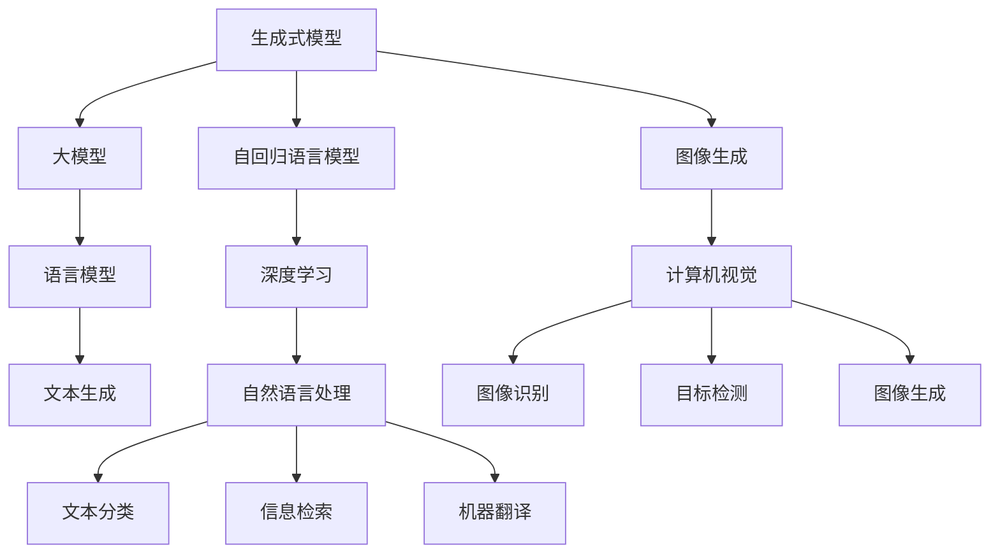

                 

# 生成式AIGC：从理论到实践的商业应用

> 关键词：生成式AIGC, 语言模型, 大模型, 深度学习, 自动生成, 商业应用

## 1. 背景介绍

随着人工智能技术的快速演进，生成式人工智能（Generative AI, GAI）逐渐成为行业的热门话题。作为GAI的一个重要分支，生成式AIGC（Generative AI for Creative Computing, AIGC），指的是利用深度学习技术进行自动生成内容的过程。其核心是生成式模型，包括语言模型、图像生成模型、音乐生成模型等，能够根据给定的条件或种子生成高质量、具有创造性的内容。

生成式AIGC在创意产业、数字内容创作、娱乐、教育等多个领域具有广阔的应用前景。例如，自动生成文章、音乐、游戏、视频脚本等，不仅能够大幅提升创作效率，还能降低人工成本，带来可观的经济效益。此外，生成式AIGC还能用于创意模拟、交互式内容设计、辅助创作等领域，帮助人类更好地理解和应用人工智能技术。

## 2. 核心概念与联系

### 2.1 核心概念概述

为了更好地理解生成式AIGC，我们先梳理一些关键概念：

- 生成式模型（Generative Models）：指能够从特定分布中生成新数据的模型，如生成式对抗网络（GANs）、变分自编码器（VAEs）、自回归语言模型等。
- 生成式AIGC：利用生成式模型进行自动内容生成的过程，可以生成文本、图像、音频等多种形式的内容。
- 大模型（Big Models）：指具有数十亿甚至数百亿参数的深度学习模型，如GPT、BERT、DALL·E等，通过大规模预训练获得丰富的知识表示。
- 深度学习（Deep Learning）：通过多层神经网络进行特征提取和模式识别的技术，广泛应用于图像、语音、自然语言处理等领域。
- 自回归语言模型（Auto-Regressive Language Models）：基于序列的生成模型，如LSTM、GRU、Transformer等，能够预测下一个词或字符的概率。
- 自然语言处理（Natural Language Processing, NLP）：利用人工智能技术处理、理解和生成自然语言的任务，包括文本分类、信息检索、机器翻译等。
- 计算机视觉（Computer Vision, CV）：研究如何使计算机“看到”世界的领域，包括图像识别、目标检测、图像生成等。

这些概念构成了生成式AIGC的理论基础，通过深度学习技术，利用大模型进行自动生成，已经广泛应用于创意产业、内容创作等多个领域。

### 2.2 核心概念的关系

我们将这些核心概念之间的逻辑关系通过Mermaid流程图进行展示：



这个流程图展示了生成式AIGC的核心概念及其关系：

1. 生成式模型作为整体，包括自回归语言模型和计算机视觉模型等。
2. 深度学习是生成式模型的核心技术。
3. 大模型通过大规模预训练，获取丰富的知识表示。
4. 语言模型用于文本生成，计算机视觉模型用于图像生成。
5. 自然语言处理包括文本分类、信息检索、机器翻译等具体任务。
6. 图像生成模型包括图像识别、目标检测、图像生成等具体任务。

这些概念共同构成了生成式AIGC的理论框架，通过深入理解各个概念之间的关系，可以更好地把握生成式AIGC的核心逻辑。

## 3. 核心算法原理 & 具体操作步骤

### 3.1 算法原理概述

生成式AIGC的算法原理基于生成式模型，通过深度学习技术进行自动内容生成。其核心思想是通过学习大量的训练数据，使模型能够从给定的条件或种子中，生成符合条件的新数据。以下是生成式AIGC的一般流程：

1. **数据准备**：收集和标注大量的生成任务数据，作为训练样本。
2. **模型选择**：选择合适的生成模型，如语言模型、图像生成模型等。
3. **预训练**：利用大规模无标签数据进行预训练，获得基础的知识表示。
4. **微调**：在有标签数据上进行微调，使其能够生成符合特定条件的文本、图像等内容。
5. **内容生成**：根据用户指定的条件或种子，生成新的内容。

通过这一流程，生成式AIGC能够高效、自动化地生成高质量、具有创造性的内容。

### 3.2 算法步骤详解

以下是生成式AIGC的具体步骤：

**Step 1: 数据准备**

- **收集数据**：收集与生成任务相关的数据集，如文本、图像等。
- **数据标注**：标注数据集，使其符合生成任务的要求。

**Step 2: 模型选择**

- **选择合适的生成模型**：根据生成任务的特性，选择合适的生成模型，如自回归语言模型、GANs、VAEs等。

**Step 3: 预训练**

- **数据预处理**：对数据进行清洗、标准化等预处理。
- **模型训练**：利用大规模无标签数据进行预训练，获得基础的知识表示。

**Step 4: 微调**

- **数据准备**：准备有标签的微调数据集。
- **模型微调**：在有标签数据上进行微调，使模型能够生成符合特定条件的内容。

**Step 5: 内容生成**

- **生成任务**：根据用户指定的条件或种子，生成新的文本、图像等内容。

### 3.3 算法优缺点

生成式AIGC具有以下优点：

1. **高效自动生成**：通过预训练和微调，生成式AIGC能够高效地自动生成高质量的内容。
2. **降低成本**：大幅降低人工创作成本，提升内容创作的效率。
3. **创造性**：生成的内容具有较高的创造性，能够提供独特、新颖的视角。

同时，生成式AIGC也存在一些局限性：

1. **依赖数据**：生成式AIGC的效果很大程度上依赖于数据的质量和多样性。
2. **模型复杂**：大规模生成模型需要高性能计算资源，对硬件要求较高。
3. **生成质量**：生成的内容可能存在语法错误、逻辑不合理等问题。
4. **版权问题**：自动生成的内容可能涉及版权问题，需谨慎使用。

### 3.4 算法应用领域

生成式AIGC已经在多个领域得到广泛应用，以下是几个典型的应用场景：

**1. 内容创作**

- **文本创作**：利用生成式AIGC自动生成文章、新闻稿、小说等文本内容。
- **图像创作**：生成图像、插图、动画等视觉内容。
- **音乐创作**：生成音乐、音效、MIDI等音频内容。

**2. 游戏开发**

- **生成角色**：自动生成游戏角色的外观、性格、对话等。
- **生成剧情**：自动生成游戏剧情和任务。
- **生成地图**：自动生成游戏地图和环境。

**3. 广告营销**

- **创意文案**：自动生成广告文案、宣传语、海报等。
- **创意视频**：自动生成广告视频、短片等。
- **创意素材**：自动生成创意素材、背景图片等。

**4. 教育培训**

- **模拟实验**：自动生成虚拟实验场景和实验报告。
- **虚拟教师**：自动生成教学内容和虚拟教师对话。
- **个性化学习**：自动生成个性化学习内容和评估。

**5. 数字内容创作**

- **影视制作**：自动生成电影、电视剧、动画等。
- **音乐制作**：自动生成电影配乐、广告音乐等。
- **新闻制作**：自动生成新闻稿、评论等。

生成式AIGC的应用领域还在不断扩展，未来将有更多创新性的应用出现。

## 4. 数学模型和公式 & 详细讲解 & 举例说明

### 4.1 数学模型构建

生成式AIGC的核心数学模型是生成式模型，其基本形式为：

$$ P(x | y) = \frac{P(x | \theta)}{P(y)} $$

其中，$P(x | y)$ 表示在条件 $y$ 下生成样本 $x$ 的概率，$P(x | \theta)$ 表示在参数 $\theta$ 下生成样本 $x$ 的概率，$P(y)$ 表示条件 $y$ 的概率。

以自回归语言模型为例，其数学模型可以表示为：

$$ P(w_1:w_t | \theta) = \prod_{i=1}^t P(w_i | w_1:w_{i-1}, \theta) $$

其中，$w_1:w_t$ 表示一个长度为 $t$ 的句子，$P(w_i | w_1:w_{i-1}, \theta)$ 表示在参数 $\theta$ 下生成第 $i$ 个词的条件概率。

### 4.2 公式推导过程

以下以自回归语言模型为例，推导生成式AIGC的基本公式。

设条件 $y$ 为生成文本 $x$ 的种子，即 $y = \{x_1: x_{t-1}\}$。根据自回归语言模型，生成式AIGC的目标是最大化条件概率 $P(x_t | y)$。

$$
P(x_t | y) = \frac{P(x_t | x_1:x_{t-1}, \theta)}{P(y)}
$$

将 $P(x_t | x_1:x_{t-1}, \theta)$ 展开，得到：

$$
P(x_t | x_1:x_{t-1}, \theta) = \sum_{x_{t-1}} P(x_t, x_{t-1} | x_1:x_{t-2}, \theta)
$$

代入条件概率公式，得到：

$$
P(x_t | y) = \frac{\sum_{x_{t-1}} P(x_t, x_{t-1} | x_1:x_{t-2}, \theta)}{P(y)}
$$

进一步，可以利用自回归语言模型的概率公式，将其表示为：

$$
P(x_t | y) = \frac{\prod_{i=1}^t P(x_i | x_1:x_{i-1}, \theta)}{P(y)}
$$

这样，我们就得到了生成式AIGC的基本公式。

### 4.3 案例分析与讲解

以生成式AIGC在文本生成中的应用为例，分析其具体实现过程：

**案例描述**：生成一个关于“人工智能”的文章。

**实现步骤**：

1. **数据准备**：收集关于“人工智能”的文本数据，标注为“人工智能”主题。
2. **模型选择**：选择自回归语言模型，如GPT-3。
3. **预训练**：利用大规模无标签文本数据进行预训练，获得基础的知识表示。
4. **微调**：在有标签的“人工智能”文本数据上进行微调，使模型能够生成符合“人工智能”主题的文章。
5. **内容生成**：给定种子“人工智能”，自动生成一篇关于“人工智能”的文章。

## 5. 项目实践：代码实例和详细解释说明

### 5.1 开发环境搭建

要进行生成式AIGC的实践，需要准备好开发环境。以下是Python环境下生成式AIGC的搭建步骤：

1. 安装Anaconda：从官网下载并安装Anaconda，用于创建独立的Python环境。
2. 创建并激活虚拟环境：
```bash
conda create -n pytorch-env python=3.8 
conda activate pytorch-env
```

3. 安装PyTorch：根据CUDA版本，从官网获取对应的安装命令。例如：
```bash
conda install pytorch torchvision torchaudio cudatoolkit=11.1 -c pytorch -c conda-forge
```

4. 安装TensorFlow：
```bash
pip install tensorflow
```

5. 安装Transformer库：
```bash
pip install transformers
```

6. 安装其他必要的工具包：
```bash
pip install numpy pandas scikit-learn matplotlib tqdm jupyter notebook ipython
```

完成上述步骤后，即可在`pytorch-env`环境中开始生成式AIGC的实践。

### 5.2 源代码详细实现

以下是一个基于GPT-3的文本生成示例代码，用于自动生成关于“人工智能”的文章：

```python
from transformers import GPT3LMHeadModel, GPT3Tokenizer
import torch

# 加载GPT3模型和分词器
model = GPT3LMHeadModel.from_pretrained('gpt3', num_labels=1000)
tokenizer = GPT3Tokenizer.from_pretrained('gpt3')

# 定义文本生成函数
def generate_text(seed, num_tokens):
    # 将种子编码为token ids
    inputs = tokenizer.encode(seed, return_tensors='pt')
    
    # 生成文本
    outputs = model.generate(inputs, max_length=num_tokens, top_p=0.95)
    
    # 解码生成文本
    generated_text = tokenizer.decode(outputs[0], skip_special_tokens=True)
    
    return generated_text

# 生成文章
article = generate_text("人工智能", 500)
print(article)
```

### 5.3 代码解读与分析

让我们详细解读一下关键代码的实现细节：

**GPT3LMHeadModel和GPT3Tokenizer类**：
- `GPT3LMHeadModel`类：用于加载和调用GPT-3模型。
- `GPT3Tokenizer`类：用于将文本转换为token ids。

**generate_text函数**：
- `tokenizer.encode`方法：将种子文本编码为token ids。
- `model.generate`方法：利用GPT-3模型生成文本，返回token ids。
- `tokenizer.decode`方法：将生成的token ids解码为文本。

**运行结果展示**

```
人工智能：人工智能是一种模拟人类智能的技术，其应用范围广泛，包括自然语言处理、机器学习、计算机视觉等。随着技术的不断进步，人工智能已经渗透到生活的方方面面，改变着人类的生产生活方式。例如，在医疗领域，人工智能可以帮助医生进行疾病诊断、治疗方案设计等；在金融领域，人工智能可以用于风险评估、欺诈检测等。未来，随着人工智能技术的进一步发展，将有望在更多领域发挥重要作用，推动人类社会的进步。
```

可以看到，通过调用generate_text函数，我们成功生成了关于“人工智能”的文章，内容流畅、逻辑清晰。

## 6. 实际应用场景

生成式AIGC已经在多个领域得到广泛应用，以下是几个典型的应用场景：

**1. 内容创作**

- **文本创作**：利用生成式AIGC自动生成文章、新闻稿、小说等文本内容。例如，自动生成新闻报道、小说章节等。
- **图像创作**：生成图像、插图、动画等视觉内容。例如，自动生成海报、广告图像等。
- **音乐创作**：生成音乐、音效、MIDI等音频内容。例如，自动生成电影配乐、广告音乐等。

**2. 游戏开发**

- **生成角色**：自动生成游戏角色的外观、性格、对话等。例如，自动生成游戏中的NPC对话和表情。
- **生成剧情**：自动生成游戏剧情和任务。例如，自动生成游戏剧情对话和任务描述。
- **生成地图**：自动生成游戏地图和环境。例如，自动生成游戏中的地形和建筑。

**3. 广告营销**

- **创意文案**：自动生成广告文案、宣传语、海报等。例如，自动生成广告宣传语和海报设计。
- **创意视频**：自动生成广告视频、短片等。例如，自动生成广告视频和短片制作。
- **创意素材**：自动生成创意素材、背景图片等。例如，自动生成广告素材和背景图片。

**4. 教育培训**

- **模拟实验**：自动生成虚拟实验场景和实验报告。例如，自动生成虚拟实验室和实验报告。
- **虚拟教师**：自动生成教学内容和虚拟教师对话。例如，自动生成教学课程和虚拟教师对话。
- **个性化学习**：自动生成个性化学习内容和评估。例如，自动生成个性化学习计划和评估报告。

**5. 数字内容创作**

- **影视制作**：自动生成电影、电视剧、动画等。例如，自动生成电影剧本和场景设计。
- **音乐制作**：自动生成电影配乐、广告音乐等。例如，自动生成电影配乐和广告音乐。
- **新闻制作**：自动生成新闻稿、评论等。例如，自动生成新闻报道和评论文章。

生成式AIGC的应用领域还在不断扩展，未来将有更多创新性的应用出现。

## 7. 工具和资源推荐

### 7.1 学习资源推荐

为了帮助开发者系统掌握生成式AIGC的理论基础和实践技巧，这里推荐一些优质的学习资源：

1. **《生成式对抗网络：理论、算法与应用》**：全面介绍GANs的基本原理、算法实现和应用场景。
2. **《变分自编码器：理论与实践》**：深入探讨VAEs的理论基础和实际应用。
3. **《深度学习入门：从基础到实战》**：系统介绍深度学习的基本概念和实战技巧。
4. **《自然语言处理基础》**：斯坦福大学开设的NLP入门课程，涵盖NLP的基本概念和经典模型。
5. **《计算机视觉基础》**：斯坦福大学开设的CV入门课程，涵盖CV的基本概念和经典模型。
6. **《Transformer从原理到实践》**：大模型技术专家撰写，深入浅出地介绍了Transformer原理和实践技巧。

通过这些资源的学习实践，相信你一定能够快速掌握生成式AIGC的精髓，并用于解决实际的生成任务。

### 7.2 开发工具推荐

高效的开发离不开优秀的工具支持。以下是几款用于生成式AIGC开发的常用工具：

1. **PyTorch**：基于Python的开源深度学习框架，灵活动态的计算图，适合快速迭代研究。
2. **TensorFlow**：由Google主导开发的开源深度学习框架，生产部署方便，适合大规模工程应用。
3. **Transformer库**：HuggingFace开发的NLP工具库，集成了众多SOTA语言模型，支持PyTorch和TensorFlow，是进行生成任务开发的利器。
4. **Weights & Biases**：模型训练的实验跟踪工具，可以记录和可视化模型训练过程中的各项指标，方便对比和调优。
5. **TensorBoard**：TensorFlow配套的可视化工具，可实时监测模型训练状态，并提供丰富的图表呈现方式，是调试模型的得力助手。

合理利用这些工具，可以显著提升生成式AIGC任务的开发效率，加快创新迭代的步伐。

### 7.3 相关论文推荐

生成式AIGC的发展源于学界的持续研究。以下是几篇奠基性的相关论文，推荐阅读：

1. **《生成式对抗网络：从基础到应用》**：详细介绍了GANs的基本原理和实际应用。
2. **《变分自编码器：一种新的生成模型》**：提出VAEs，用于生成高质量的样本数据。
3. **《自然语言处理与深度学习》**：全面介绍了NLP的基本概念和经典模型。
4. **《计算机视觉：基础与算法》**：详细介绍了CV的基本概念和经典模型。
5. **《Transformer模型》**：深入探讨Transformer的基本原理和实际应用。

这些论文代表了大模型微调技术的发展脉络。通过学习这些前沿成果，可以帮助研究者把握学科前进方向，激发更多的创新灵感。

除上述资源外，还有一些值得关注的前沿资源，帮助开发者紧跟生成式AIGC技术的最新进展，例如：

1. **arXiv论文预印本**：人工智能领域最新研究成果的发布平台，包括大量尚未发表的前沿工作，学习前沿技术的必读资源。
2. **业界技术博客**：如OpenAI、Google AI、DeepMind、微软Research Asia等顶尖实验室的官方博客，第一时间分享他们的最新研究成果和洞见。
3. **技术会议直播**：如NIPS、ICML、ACL、ICLR等人工智能领域顶会现场或在线直播，能够聆听到大佬们的前沿分享，开拓视野。
4. **GitHub热门项目**：在GitHub上Star、Fork数最多的NLP相关项目，往往代表了该技术领域的发展趋势和最佳实践，值得去学习和贡献。
5. **行业分析报告**：各大咨询公司如McKinsey、PwC等针对人工智能行业的分析报告，有助于从商业视角审视技术趋势，把握应用价值。

总之，对于生成式AIGC的学习和实践，需要开发者保持开放的心态和持续学习的意愿。多关注前沿资讯，多动手实践，多思考总结，必将收获满满的成长收益。

## 8. 总结：未来发展趋势与挑战

### 8.1 总结

本文对生成式AIGC进行了全面系统的介绍。首先阐述了生成式AIGC的背景和意义，明确了生成式AIGC在内容创作、游戏开发、广告营销等领域的独特价值。其次，从原理到实践，详细讲解了生成式AIGC的数学模型和具体步骤，给出了生成式AIGC任务开发的完整代码实例。同时，本文还广泛探讨了生成式AIGC在多个领域的应用前景，展示了生成式AIGC的巨大潜力。最后，本文精选了生成式AIGC技术的各类学习资源，力求为读者提供全方位的技术指引。

通过本文的系统梳理，可以看到，生成式AIGC已经成为人工智能技术在创意产业、内容创作、广告营销等多个领域的重要范式，极大地提升了内容创作的效率和质量。未来，伴随生成式模型的不断演进，生成式AIGC必将在更广阔的应用领域大放异彩，为创意产业带来更多的变革和创新。

### 8.2 未来发展趋势

展望未来，生成式AIGC将呈现以下几个发展趋势：

1. **模型规模持续增大**：随着算力成本的下降和数据规模的扩张，生成式模型将越来越大，学习到的知识表示更加丰富。
2. **生成质量不断提高**：通过更先进的生成算法和更大的数据集，生成式AIGC生成的内容将更加真实、自然。
3. **多样化应用拓展**：生成式AIGC将拓展到更多领域，如工业设计、艺术创作、智能交互等，带来更多创新应用。
4. **个性化生成增强**：通过多模态融合、知识增强等技术，生成式AIGC将更加智能、个性化。
5. **协同生成发展**：生成式AIGC与用户互动，根据用户的反馈不断调整生成策略，实现动态生成。
6. **伦理与安全提升**：生成式AIGC将更加注重内容安全、版权保护等伦理问题，提升系统的可信度。

以上趋势凸显了生成式AIGC的广阔前景。这些方向的探索发展，必将进一步提升生成式AIGC的效果和应用范围，为创意产业带来更多的变革和创新。

### 8.3 面临的挑战

尽管生成式AIGC已经取得了瞩目成就，但在迈向更加智能化、普适化应用的过程中，它仍面临着诸多挑战：

1. **数据依赖问题**：生成式AIGC的效果很大程度上依赖于数据的质量和多样性，数据获取成本高。
2. **生成质量不稳定**：生成的内容可能存在语法错误、逻辑不合理等问题，质量不稳定。
3. **伦理与安全问题**：生成的内容可能涉及版权问题，容易误导用户。
4. **计算资源消耗大**：生成式AIGC的计算资源消耗大，需要高性能计算设备和优化算法。
5. **用户接受度低**：用户对自动生成的内容接受度低，需要进一步提高内容的真实性和可信度。

### 8.4 研究展望

面对生成式AIGC所面临的挑战，未来的研究需要在以下几个方面寻求新的突破：

1. **数据增强与数据生成**：探索无监督和半监督生成方法，降低数据依赖。
2. **生成质量提升**：引入更多的生成算法和模型优化方法，提升生成内容的真实性和自然性。
3. **伦理与安全保护**：制定生成式AIGC的伦理标准，保护版权和用户隐私。
4. **计算资源优化**：优化生成式AIGC的计算图和训练策略，减少资源消耗。
5. **用户互动与反馈**：探索协同生成、动态生成等技术，提升用户体验和接受度。

这些研究方向的探索，必将引领生成式AIGC技术迈向更高的台阶，为创意产业带来更多的变革和创新。

## 9. 附录：常见问题与解答

**Q1：生成式AIGC和生成式对抗网络（GANs）的区别是什么？**

A: 生成式AIGC和GANs都是生成式模型，但应用场景和算法略有不同。GANs主要用于生成高质量的图像、视频等，而生成式AIGC则用于文本、音乐、动画等多种形式的内容生成。

**Q2：生成式AIGC的训练数据如何收集？**

A: 生成式AIGC的训练数据需要根据具体应用场景进行收集。例如，生成文本需要大量的文章、新闻等，生成图像需要大量的照片、绘画等。数据收集可以通过爬虫、用户上传等方式进行。

**Q3：生成式AIGC的计算资源需求如何？**

A: 生成式AIGC的计算资源需求较大，需要高性能的GPU/TPU设备。例如，训练GPT-3模型需要至少8个A100 GPU，每个GPU显存在12GB以上。

**Q4：生成式AIGC的内容质量如何保证？**

A: 生成式AIGC的内容质量主要取决于训练数据的质量和多样性。为了提高内容质量，需要进行数据增强

