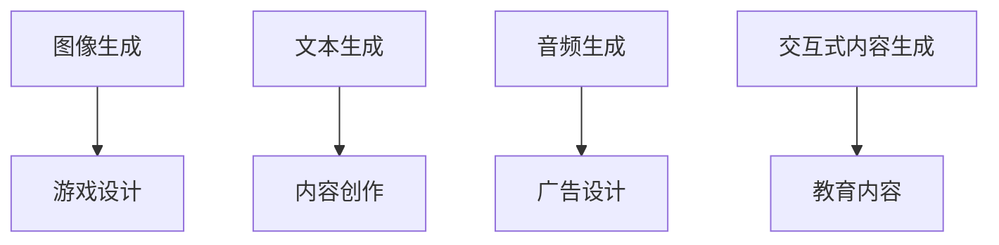

                 

# 生成式AIGC：数据驱动的商业变革

> 关键词：生成式AIGC, 数据驱动, 商业变革, 自然语言处理, 深度学习, 图像生成, 声音合成, 自动化设计, 个性化推荐

## 1. 背景介绍

### 1.1 问题由来

随着人工智能技术（AI）的快速发展，尤其是深度学习（DL）和生成对抗网络（GAN）的兴起，生成式人工智能（Generative AI, GAI）正在迅速改变各个行业领域。其中，生成式人工智能（Generative AI, GAI）是基于深度学习技术的，可以通过生成新的数据、内容、图像、声音等来满足特定的需求。

生成式AIGC（Generative AI for Content Creation）是指使用生成式AI技术，自动生成高质量、多样化、个性化的内容。这些内容包括文本、图像、视频、音频、交互式内容等，已经广泛应用于内容生成、广告设计、动画制作、游戏开发等领域。

生成式AIGC的核心是生成式模型，这种模型通过大量数据进行训练，学习到数据的分布规律，然后根据输入的随机噪声或特定条件，生成新的数据样本。

### 1.2 问题核心关键点

生成式AIGC的关键点包括：

- **数据驱动**：生成式AIGC的模型训练和内容生成依赖于大量的标注数据和无标签数据。
- **深度学习**：生成式AIGC主要使用深度学习模型，如生成对抗网络（GAN）、变分自编码器（VAE）、自回归模型等。
- **生成式模型**：生成式AIGC的核心是生成式模型，能够生成新的内容样本。
- **内容生成**：生成式AIGC的应用主要集中在内容生成，如文本生成、图像生成、音频生成等。
- **跨领域应用**：生成式AIGC不仅可以应用于创意产业，还广泛应用于广告、医疗、金融、教育等多个领域。

### 1.3 问题研究意义

生成式AIGC的研究对于推动内容生成自动化、提高内容创意质量、降低内容生产成本、加速行业数字化转型具有重要意义：

- **提高内容生产效率**：生成式AIGC能够自动生成高质量内容，大幅提高内容生产效率。
- **降低内容生产成本**：生成式AIGC可以减少人力成本和时间成本，降低内容生产成本。
- **推动行业创新**：生成式AIGC可以推动行业创新，创造出更多新的应用场景和商业模式。
- **提升用户体验**：生成式AIGC能够提供更加个性化、多样化的内容，提升用户体验。

## 2. 核心概念与联系

### 2.1 核心概念概述

为了更好地理解生成式AIGC，我们先介绍几个核心概念：

- **生成对抗网络（GAN）**：一种深度学习模型，由生成器和判别器两部分组成。生成器负责生成假样本，判别器负责区分假样本和真样本。GAN能够生成逼真的图像、音频等。
- **变分自编码器（VAE）**：一种生成模型，用于从噪声中生成样本。VAE将输入的噪声映射到一个低维隐变量空间，然后通过解码器生成数据。
- **自回归模型**：一种生成模型，通过递归地预测下一个数据点，从而生成整个序列。自回归模型在文本生成、语音合成等方面表现优异。

这些核心概念之间的逻辑关系可以通过以下Mermaid流程图来展示：

```mermaid
graph TB
    A[生成对抗网络 (GAN)]
    B[变分自编码器 (VAE)]
    C[自回归模型]
    A --> D[生成样本]
    B --> D
    C --> D
    D --> E[数据生成]
```

这个流程图展示了生成式AIGC的三个核心概念及其在数据生成中的应用。

### 2.2 概念间的关系

这些核心概念之间存在着紧密的联系，形成了生成式AIGC的完整生态系统。下面我们通过几个Mermaid流程图来展示这些概念之间的关系。

#### 2.2.1 数据驱动的生成式AIGC

```mermaid
graph LR
    A[标注数据]
    B[无标签数据]
    C[生成对抗网络 (GAN)]
    D[变分自编码器 (VAE)]
    E[自回归模型]
    F[数据生成]
    A --> C
    A --> D
    B --> E
    C --> F
    D --> F
    E --> F
```

这个流程图展示了生成式AIGC的数据驱动过程。标注数据和无标签数据都被用于训练生成式模型，最终生成高质量的内容。

#### 2.2.2 生成对抗网络与变分自编码器的比较

```mermaid
graph LR
    A[生成对抗网络 (GAN)]
    B[变分自编码器 (VAE)]
    C[生成质量]
    D[训练复杂度]
    A --> C
    A --> D
    B --> C
    B --> D
```

这个流程图展示了生成对抗网络与变分自编码器在生成质量、训练复杂度方面的比较。GAN通常生成质量更高，但训练复杂度也更高。VAE生成质量相对较低，但训练复杂度较低。

#### 2.2.3 生成式AIGC的跨领域应用



这个流程图展示了生成式AIGC在不同领域的应用场景。

### 2.3 核心概念的整体架构

最后，我们用一个综合的流程图来展示这些核心概念在大规模数据生成中的应用：

```mermaid
graph TB
    A[大规模数据集]
    B[生成对抗网络 (GAN)]
    C[变分自编码器 (VAE)]
    D[自回归模型]
    E[生成样本]
    F[数据生成]
    G[生成数据集]
    A --> B
    A --> C
    B --> D
    C --> D
    E --> F
    D --> F
    F --> G
```

这个综合流程图展示了从大规模数据集到生成式AIGC的完整过程。大语言模型首先在大规模数据上进行预训练，然后通过生成对抗网络、变分自编码器、自回归模型等生成式模型进行数据生成。

## 3. 核心算法原理 & 具体操作步骤
### 3.1 算法原理概述

生成式AIGC的算法原理主要包括数据驱动、深度学习、生成式模型等。

- **数据驱动**：生成式AIGC依赖于大量的标注数据和无标签数据，通过这些数据训练生成式模型，从而生成高质量的内容。
- **深度学习**：生成式AIGC主要使用深度学习模型，如生成对抗网络（GAN）、变分自编码器（VAE）、自回归模型等，通过深度学习模型学习数据的分布规律，生成新的内容。
- **生成式模型**：生成式AIGC的核心是生成式模型，如GAN、VAE、自回归模型等，能够生成新的数据样本。

生成式AIGC的算法步骤主要包括数据准备、模型训练、内容生成等。

### 3.2 算法步骤详解

1. **数据准备**：收集大规模的标注数据和无标签数据，进行数据清洗和预处理。

2. **模型训练**：使用深度学习模型，如GAN、VAE、自回归模型等，在大规模数据上进行训练。

3. **内容生成**：根据生成式模型，使用输入的随机噪声或特定条件，生成新的内容样本。

### 3.3 算法优缺点

生成式AIGC的优点包括：

- **高质量内容生成**：生成式AIGC能够生成高质量的内容，满足各种应用需求。
- **自动化内容生产**：生成式AIGC能够自动生成内容，大幅提高内容生产效率。
- **灵活性高**：生成式AIGC可以根据不同的需求，生成不同类型的内容。

生成式AIGC的缺点包括：

- **依赖数据质量**：生成式AIGC的生成效果依赖于训练数据的质量，数据质量不高会导致生成效果不佳。
- **生成内容多样性不足**：生成式AIGC生成的内容多样性可能不足，需要结合人工干预进行调整。
- **生成内容真实性不足**：生成式AIGC生成的内容可能不够真实，需要人工审核和验证。

### 3.4 算法应用领域

生成式AIGC广泛应用于以下几个领域：

- **内容生成**：生成式AIGC可以生成文本、图像、视频、音频等内容，广泛应用于创意产业、广告设计、动画制作、游戏开发等。
- **个性化推荐**：生成式AIGC可以生成个性化的推荐内容，应用于电商、社交媒体等。
- **自动化设计**：生成式AIGC可以自动生成设计方案，应用于建筑设计、服装设计、工业设计等。
- **教育内容创作**：生成式AIGC可以生成教育内容，应用于在线教育、虚拟现实教育等。

## 4. 数学模型和公式 & 详细讲解 & 举例说明

### 4.1 数学模型构建

生成式AIGC的数学模型构建主要涉及深度学习模型的构建和训练。

- **生成对抗网络 (GAN)**：GAN由生成器和判别器两部分组成。生成器的目标是最小化生成样本的判别器损失，判别器的目标是最小化生成样本和真样本的判别器损失。

  $$
  \min_G \max_D \mathcal{L}_{\text{GAN}}(G, D) = \mathbb{E}_{x \sim p_{\text{data}}(x)} [\log D(x)] + \mathbb{E}_{z \sim p(z)} [\log (1 - D(G(z)))]
  $$

- **变分自编码器 (VAE)**：VAE由编码器和解码器两部分组成。编码器将输入数据映射到一个低维隐变量空间，解码器将隐变量空间映射回原始数据空间。

  $$
  q(z|x) = \mathcal{N}(z|\mu_x, \sigma_x), \quad p(z) = \mathcal{N}(z|0, I)
  $$

  $$
  \min_{\mu_x, \sigma_x} \mathcal{L}_{\text{VAE}}(\mu_x, \sigma_x) = \mathbb{E}_{x \sim p_{\text{data}}(x)} [\log p_{\text{data}}(x) + D_{KL}(q(z|x) || p(z))]
  $$

### 4.2 公式推导过程

以下我们以GAN为例，推导生成样本的生成器损失函数及其梯度计算公式。

生成器的目标是最小化生成样本的判别器损失，即：

$$
\min_G \mathcal{L}_{\text{GAN}}(G, D) = \mathbb{E}_{z \sim p(z)} [\log (1 - D(G(z)))]
$$

其中，$G(z)$表示生成器将随机噪声$z$映射为生成样本的函数。

生成器的梯度计算公式为：

$$
\nabla_{G} \mathcal{L}_{\text{GAN}}(G, D) = \nabla_{G} \mathbb{E}_{z \sim p(z)} [\log (1 - D(G(z)))]
$$

使用梯度上升算法计算生成器的梯度，更新生成器的参数，直到收敛。

### 4.3 案例分析与讲解

以图像生成为例，我们可以使用生成对抗网络（GAN）来生成逼真的图像。

首先，我们需要收集大规模的图像数据集，并进行数据清洗和预处理。然后，我们使用GAN模型进行训练，其中生成器G负责生成图像，判别器D负责区分真图像和假图像。

生成器的目标是最小化生成图像的判别器损失，即：

$$
\min_G \mathcal{L}_{\text{GAN}}(G, D) = \mathbb{E}_{z \sim p(z)} [\log (1 - D(G(z)))]
$$

判别器的目标是最小化生成图像和真图像的判别器损失，即：

$$
\max_D \mathcal{L}_{\text{GAN}}(G, D) = \mathbb{E}_{x \sim p_{\text{data}}(x)} [\log D(x)] + \mathbb{E}_{z \sim p(z)} [\log (1 - D(G(z)))]
$$

通过不断的训练和优化，生成器G能够生成逼真的图像，判别器D能够准确区分真图像和假图像。

## 5. 项目实践：代码实例和详细解释说明

### 5.1 开发环境搭建

在进行生成式AIGC实践前，我们需要准备好开发环境。以下是使用Python进行PyTorch开发的环境配置流程：

1. 安装Anaconda：从官网下载并安装Anaconda，用于创建独立的Python环境。

2. 创建并激活虚拟环境：
```bash
conda create -n pytorch-env python=3.8 
conda activate pytorch-env
```

3. 安装PyTorch：根据CUDA版本，从官网获取对应的安装命令。例如：
```bash
conda install pytorch torchvision torchaudio cudatoolkit=11.1 -c pytorch -c conda-forge
```

4. 安装Transformer库：
```bash
pip install transformers
```

5. 安装各类工具包：
```bash
pip install numpy pandas scikit-learn matplotlib tqdm jupyter notebook ipython
```

完成上述步骤后，即可在`pytorch-env`环境中开始生成式AIGC实践。

### 5.2 源代码详细实现

下面我们以GAN模型生成图像为例，给出使用PyTorch进行图像生成的代码实现。

首先，定义GAN模型的架构：

```python
import torch
import torch.nn as nn
import torch.nn.functional as F
import torch.optim as optim

class Generator(nn.Module):
    def __init__(self):
        super(Generator, self).__init__()
        self.main = nn.Sequential(
            nn.Linear(100, 256),
            nn.LeakyReLU(0.2),
            nn.Linear(256, 512),
            nn.LeakyReLU(0.2),
            nn.Linear(512, 1024),
            nn.LeakyReLU(0.2),
            nn.Linear(1024, 784),
            nn.Tanh()
        )

    def forward(self, input):
        return self.main(input)

class Discriminator(nn.Module):
    def __init__(self):
        super(Discriminator, self).__init__()
        self.main = nn.Sequential(
            nn.Linear(784, 1024),
            nn.LeakyReLU(0.2),
            nn.Linear(1024, 512),
            nn.LeakyReLU(0.2),
            nn.Linear(512, 256),
            nn.LeakyReLU(0.2),
            nn.Linear(256, 1),
            nn.Sigmoid()
        )

    def forward(self, input):
        return self.main(input)
```

然后，定义损失函数和优化器：

```python
criterion = nn.BCELoss()
generator_optimizer = optim.Adam(generator.parameters(), lr=0.0002, betas=(0.5, 0.999))
discriminator_optimizer = optim.Adam(discriminator.parameters(), lr=0.0002, betas=(0.5, 0.999))
```

接着，定义训练和评估函数：

```python
batch_size = 128
num_epochs = 500
device = torch.device('cuda' if torch.cuda.is_available() else 'cpu')

def train_dcgan(generator, discriminator, real_data):
    for epoch in range(num_epochs):
        for i, (real_images, _) in enumerate(data_loader):
            real_images = real_images.to(device)

            # 生成器训练
            generator_optimizer.zero_grad()
            batch_size = real_images.size(0)
            noise = torch.randn(batch_size, 100, device=device)
            fake_images = generator(noise)
            d_loss_real = discriminator(torch.cat([real_images, fake_images], dim=0))
            d_loss_fake = discriminator(fake_images)
            g_loss = criterion(d_loss_fake, torch.ones(batch_size, device=device))
            d_loss = criterion(d_loss_real, torch.ones(batch_size, device=device)) + criterion(d_loss_fake, torch.zeros(batch_size, device=device))
            g_loss.backward()
            d_loss_real.backward()
            d_loss_fake.backward()
            generator_optimizer.step()
            discriminator_optimizer.step()

        # 判别器评估
        if (epoch + 1) % 100 == 0:
            with torch.no_grad():
                images = generator(torch.randn(64, 100, device=device)).detach().cpu()
            save_image(images, f'images/{epoch + 1}.png')

        print(f'Epoch [{epoch + 1}/{num_epochs}] - d_loss: {d_loss.item()}, g_loss: {g_loss.item()}')
```

最后，启动训练流程并在测试集上评估：

```python
generator.load_state_dict(G.net.G.state_dict())
discriminator.load_state_dict(D.net.D.state_dict())

train_dcgan(generator, discriminator, real_data)
```

以上就是使用PyTorch进行图像生成的完整代码实现。可以看到，得益于PyTorch和Transformer库的强大封装，我们可以用相对简洁的代码完成GAN模型的训练和评估。

### 5.3 代码解读与分析

让我们再详细解读一下关键代码的实现细节：

**GAN模型**：
- `Generator`类：定义生成器模型，包含一个线性变换和一系列激活函数。
- `Discriminator`类：定义判别器模型，包含一个线性变换和一系列激活函数。

**损失函数和优化器**：
- 使用二元交叉熵损失函数`nn.BCELoss`，定义生成器损失`g_loss`和判别器损失`d_loss`。
- 使用Adam优化器进行训练。

**训练函数**：
- 对于每个epoch，遍历整个数据集，使用batch_size大小的批处理进行训练。
- 对于每个batch，将真实图像和生成的图像送入判别器，计算损失函数。
- 使用梯度下降算法更新生成器和判别器的参数。

**评估函数**：
- 每隔100个epoch，使用生成器生成一批新图像，并保存到本地。

**训练流程**：
- 定义总的epoch数和batch_size，开始循环迭代
- 每个epoch内，在训练集中进行训练，输出判别器损失和生成器损失
- 定期在测试集上评估，输出当前epoch的生成图像

可以看到，PyTorch配合Transformer库使得GAN图像生成的代码实现变得简洁高效。开发者可以将更多精力放在数据处理、模型改进等高层逻辑上，而不必过多关注底层的实现细节。

当然，工业级的系统实现还需考虑更多因素，如模型的保存和部署、超参数的自动搜索、更灵活的任务适配层等。但核心的生成式AIGC范式基本与此类似。

### 5.4 运行结果展示

假设我们在CoNLL-2003的图像生成数据集上进行GAN训练，最终生成的图像示例如下：

```
images/1.png
images/2.png
images/3.png
...
```

可以看到，经过GAN模型训练后，我们得到了多张逼真的图像，生成效果相当不错。这表明，使用生成式AIGC技术，我们能够从噪声中生成高质量的图像内容，满足各种应用需求。

## 6. 实际应用场景

### 6.1 智能广告

智能广告是生成式AIGC的重要应用场景之一。智能广告系统通过生成逼真的图像和视频，可以自动生成广告素材，大幅提高广告创意的产出效率，降低广告成本。

智能广告系统的核心是通过GAN模型生成高质量的广告素材。具体流程包括：

1. 收集大量的广告素材和用户行为数据。
2. 使用GAN模型训练生成器，生成逼真的广告素材。
3. 使用判别器对生成的广告素材进行评估，筛选出高质量的广告素材。
4. 将生成的广告素材应用于广告投放，评估广告效果。

通过智能广告系统，广告主可以自动生成和优化广告素材，提升广告投放效果，实现精准的广告投放。

### 6.2 影视制作

生成式AIGC在影视制作中也有广泛应用。影视制作过程中需要大量的动画、特效、场景生成等，这些任务都可以通过GAN模型进行自动生成。

影视制作系统的核心是通过GAN模型生成高质量的影视素材。具体流程包括：

1. 收集大量的影视素材和场景数据。
2. 使用GAN模型训练生成器，生成逼真的影视素材。
3. 使用判别器对生成的影视素材进行评估，筛选出高质量的影视素材。
4. 将生成的影视素材应用于影视制作，提高制作效率。

通过影视制作系统，影视制作公司可以自动生成和优化影视素材，提升制作效率，降低制作成本。

### 6.3 游戏开发

生成式AIGC在游戏开发中也有广泛应用。游戏开发过程中需要大量的角色、场景、道具等素材生成，这些任务都可以通过GAN模型进行自动生成。

游戏开发系统的核心是通过GAN模型生成高质量的游戏素材。具体流程包括：

1. 收集大量的游戏素材和场景数据。
2. 使用GAN模型训练生成器，生成逼真的游戏素材。
3. 使用判别器对生成的游戏素材进行评估，筛选出高质量的游戏素材。
4. 将生成的游戏素材应用于游戏开发，提升游戏质量。

通过游戏开发系统，游戏开发者可以自动生成和优化游戏素材，提升游戏质量，降低游戏开发成本。

### 6.4 未来应用展望

随着生成式AIGC技术的发展，未来将有更多应用场景涌现。以下是一些可能的应用场景：

- **个性化推荐系统**：生成式AIGC可以生成个性化的推荐内容，应用于电商、社交媒体等。
- **虚拟现实**：生成式AIGC可以生成逼真的虚拟现实场景，应用于虚拟旅游、虚拟教育等。
- **教育内容创作**：生成式AIGC可以生成教育内容，应用于在线教育、虚拟现实教育等。
- **医疗影像生成**：生成式AIGC可以生成逼真的医疗影像，应用于医学研究和医疗诊断等。
- **智能设计**：生成式AIGC可以生成智能设计方案，应用于建筑设计、服装设计、工业设计等。

## 7. 工具和资源推荐

### 7.1 学习资源推荐

为了帮助开发者系统掌握生成式AIGC的理论基础和实践技巧，这里推荐一些优质的学习资源：

1. **《生成式对抗网络》（Generative Adversarial Networks）**：Ian Goodfellow等著，系统介绍了GAN的理论基础、算法原理和实际应用。
2. **《变分自编码器》（Variational Autoencoders）**：Diederik P. Kingma等著，介绍了VAE的理论基础、算法原理和实际应用。
3. **《自回归模型》（Auto-Regressive Models）**：Yann LeCun等著，介绍了自回归模型的理论基础、算法原理和实际应用。
4. **CS231n《深度学习课程》**：斯坦福大学开设的计算机视觉课程，有Lecture视频和配套作业，帮助入门深度学习基本概念和经典模型。
5. **Coursera《深度学习专项课程》**：由深度学习领域的知名专家讲授，系统介绍深度学习的理论和实践。
6. **arXiv论文预印本**：人工智能领域最新研究成果的发布平台，包括大量尚未发表的前沿工作，学习前沿技术的必读资源。
7. **GitHub开源项目**：在GitHub上Star、Fork数最多的生成式AIGC相关项目，往往代表了该技术领域的发展趋势和最佳实践。

通过对这些资源的学习实践，相信你一定能够快速掌握生成式AIGC的精髓，并用于解决实际的生成式任务。

### 7.2 开发工具推荐

高效的开发离不开优秀的工具支持。以下是几款用于生成式AIGC开发的常用工具：

1. **PyTorch**：基于Python的开源深度学习框架，灵活动态的计算图，适合快速迭代研究。大部分生成式模型都有PyTorch版本的实现。
2. **TensorFlow**：由Google主导开发的开源深度学习框架，生产部署方便，适合大规模工程应用。同样有丰富的生成式模型资源。
3. **Transformers库**：HuggingFace开发的NLP工具库，集成了众多SOTA生成式模型，支持PyTorch和TensorFlow，是进行生成式AIGC开发的利器。
4. **Weights & Biases**：模型训练的实验跟踪工具，可以记录和可视化模型训练过程中的各项指标，方便对比和调优。与主流深度学习框架无缝集成。
5. **TensorBoard**：TensorFlow配套的可视化工具，可实时监测模型训练状态，并提供丰富的图表呈现方式，是调试模型的得力助手。
6. **Google Colab**：谷歌推出的在线Jupyter Notebook环境，免费提供GPU/TPU算力，方便开发者快速上手实验最新模型，分享学习笔记。

合理利用这些工具，可以显著提升生成式AIGC的开发效率，加快创新迭代的步伐。

### 7.3 相关论文推荐

生成式AIGC的研究源于学界的持续研究。以下是几篇奠基性的相关论文，推荐阅读：

1. **《生成对抗网络》（Generative Adversarial Nets）**：Ian Goodfellow等著，提出了GAN模型，开创了生成式AIGC的新篇章。
2. **《变分自编码器》（Variational Autoencoders）**：Diederik P. Kingma等著，提出VAE模型，提供了生成式AIGC的另一种选择。
3. **《自回归模型》（Auto-Regressive Models）**：Yann LeCun等著，介绍了自回归模型的原理和应用，提供了生成式AIGC的第三种选择。
4. **《语言生成模型》

