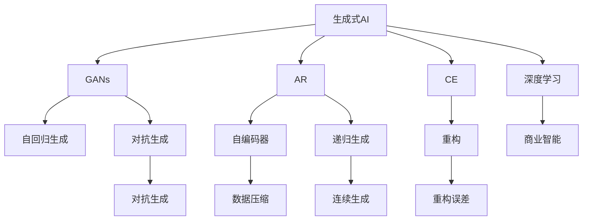
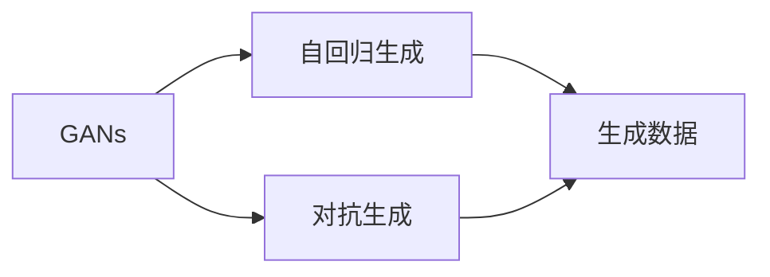
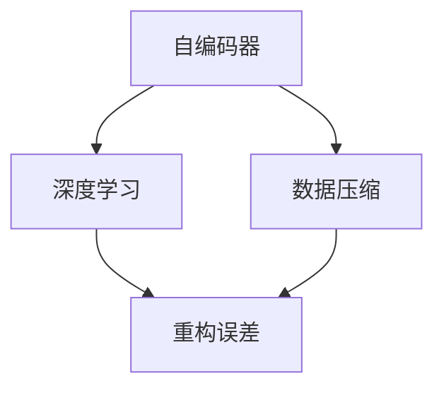
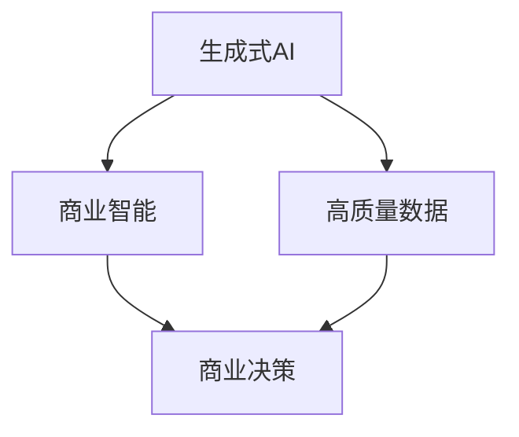
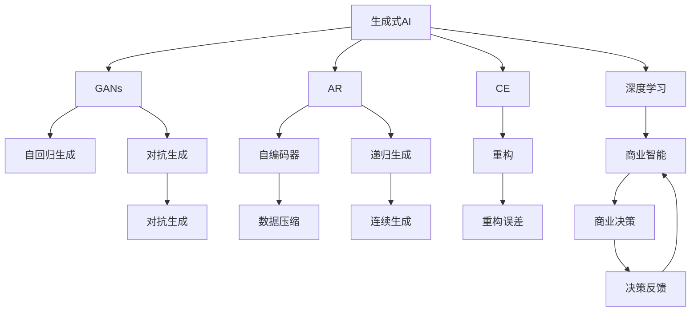

                 

# 生成式AIGC：智能时代的商业新模式

> 关键词：生成式AI, 人工智能(AI), 生成对抗网络(GANs), 自回归模型(AR), 自编码器(CE), 深度学习, 商业应用

## 1. 背景介绍

### 1.1 问题由来
随着人工智能技术的迅猛发展，人工智能（AI）正逐渐渗透到各行各业，为各行各业带来了革命性的变化。特别是在图像识别、语音识别、自然语言处理等领域的突破，使得AI技术在商业应用中取得了显著的效果。然而，尽管当前AI技术在感知智能方面已经取得了显著的进步，但是在生成智能方面，还存在很多瓶颈，需要进一步的技术突破。

生成式人工智能（Generative AI, GAI）是指能够生成自然、真实且符合特定规则的数据的人工智能技术。其核心是生成模型，主要可以分为生成对抗网络（Generative Adversarial Networks, GANs）和自回归模型（Auto-Regressive Models, AR）两大类。其中，生成对抗网络通过两个神经网络相互博弈，生成高质量、自然的生成数据；自回归模型则通过先前的输出预测下一个输出，生成连续的生成数据。

生成式AI的商业应用前景广阔，可以应用于游戏、影视、广告、教育等多个领域。例如，生成式AI可以为游戏开发商提供高效的游戏角色生成工具，使游戏开发商在短短几分钟内生成数千个高度逼真的游戏角色，大幅缩短开发周期；影视行业可以通过生成式AI快速生成高质量的影视素材，大幅降低制作成本；广告公司可以通过生成式AI自动生成广告素材，大幅提升广告制作效率。因此，生成式AI正在逐渐成为智能时代商业新模式的代表。

### 1.2 问题核心关键点
生成式AI的核心问题是如何通过深度学习模型生成高质量、自然的生成数据。生成式AI技术的主要挑战包括：

1. **生成数据的多样性和真实性**：生成的数据应该具有多样性和真实性，以符合实际情况。
2. **生成过程的可控性和效率**：生成的数据应该具有可控性，即能够根据特定条件生成特定类型的数据，同时生成过程应具有高效性，即在合理的时间内生成高质量的数据。
3. **生成数据的适用性和适应性**：生成的数据应该具有适用性，即能够应用于特定的商业场景，同时具有适应性，即能够根据数据的变化进行动态调整。

### 1.3 问题研究意义
研究生成式AI技术，对于拓展AI技术的商业应用范围，提升商业智能系统的生成能力，加速AI技术的产业化进程，具有重要意义：

1. 降低商业智能系统的开发成本。生成式AI技术可以为商业智能系统提供高效的数据生成工具，减少开发所需的数据采集、清洗和标注等成本投入。
2. 提升商业智能系统的生成能力。生成式AI技术使得商业智能系统能够生成高质量、多样性的数据，满足复杂的商业需求。
3. 加速商业智能系统的部署进程。生成式AI技术可以大幅缩短商业智能系统的开发和部署时间，加速AI技术的商业化落地。
4. 带来商业创新。生成式AI技术创新了商业智能系统的数据生成方式，催生了新的商业模式和业务形态。
5. 赋能产业升级。生成式AI技术使商业智能系统能够更高效、更智能地生成数据，为传统行业数字化转型升级提供新的技术路径。

## 2. 核心概念与联系

### 2.1 核心概念概述

为更好地理解生成式AI技术的核心概念和架构，本节将介绍几个密切相关的核心概念：

- 生成式AI（Generative AI, GAI）：通过深度学习模型生成高质量、自然的生成数据的人工智能技术。
- 生成对抗网络（Generative Adversarial Networks, GANs）：通过两个神经网络相互博弈，生成高质量、自然的生成数据的技术。
- 自回归模型（Auto-Regressive Models, AR）：通过先前的输出预测下一个输出，生成连续的生成数据的技术。
- 自编码器（Autoencoder, CE）：通过将数据编码为低维表示，再通过解码器重构为原始数据的深度学习模型。
- 深度学习（Deep Learning）：通过多层次的神经网络进行数据处理的机器学习技术。
- 商业智能（Business Intelligence, BI）：通过数据分析和处理，提供商业决策支持的技术。

这些核心概念之间的逻辑关系可以通过以下Mermaid流程图来展示：



这个流程图展示了大语言模型微调过程中各个核心概念之间的关系：

1. 生成式AI技术主要包括GANs和AR两种生成方式。
2. 自回归生成和对抗生成是GANs的主要实现方式。
3. 自编码器通过数据压缩和重构生成低维表示的数据。
4. 深度学习是生成式AI和商业智能的基础技术。
5. 商业智能通过生成式AI技术生成高质量的商业数据，支持商业决策。

### 2.2 概念间的关系

这些核心概念之间存在着紧密的联系，形成了生成式AI技术的完整生态系统。下面我们通过几个Mermaid流程图来展示这些概念之间的关系。

#### 2.2.1 生成对抗网络与自回归模型



这个流程图展示了GANs和AR的生成过程：

1. GANs通过对抗生成的方式生成高质量、自然的生成数据。
2. AR通过自回归的方式生成连续的生成数据。
3. GANs生成的数据可以应用于AR模型中，进行进一步的处理和优化。

#### 2.2.2 自编码器与深度学习



这个流程图展示了自编码器与深度学习的关系：

1. 自编码器通过将数据编码为低维表示，再通过解码器重构为原始数据，实现了数据压缩和重构。
2. 自编码器是深度学习模型的一种，通过多层神经网络进行数据的编码和解码。

#### 2.2.3 生成式AI与商业智能



这个流程图展示了生成式AI与商业智能的关系：

1. 生成式AI通过生成高质量的数据，为商业智能提供了基础的数据支持。
2. 商业智能通过生成式AI生成的数据，进行商业决策支持。

### 2.3 核心概念的整体架构

最后，我们用一个综合的流程图来展示这些核心概念在生成式AI技术中的整体架构：



这个综合流程图展示了从生成式AI到商业智能的完整过程。生成式AI首先通过深度学习生成高质量的生成数据，通过自编码器进行数据压缩和重构，然后通过自回归生成和对抗生成的方式，生成高质量、自然的生成数据。商业智能通过生成式AI生成的数据，进行商业决策，并不断优化生成式AI的生成效果，以提供更优质的商业决策支持。

## 3. 核心算法原理 & 具体操作步骤
### 3.1 算法原理概述

生成式AI的核心思想是通过深度学习模型生成高质量、自然的生成数据。常见的生成式AI模型包括生成对抗网络（GANs）和自回归模型（AR），其主要原理如下：

**生成对抗网络（GANs）**：
GANs由生成器（Generator）和判别器（Discriminator）两个神经网络组成。生成器通过学习真实数据的分布，生成高质量的假数据；判别器通过学习真实数据和假数据的差异，判断输入数据的真实性。生成器和判别器相互博弈，逐渐提高生成数据的质量，直至生成数据和真实数据无法区分。

**自回归模型（AR）**：
AR通过先前的输出预测下一个输出，生成连续的生成数据。常见的自回归模型包括自回归条件随机场（ARCRF）、循环神经网络（RNN）、Transformer等。通过递归生成的方式，AR模型能够生成高质量、自然的生成数据。

### 3.2 算法步骤详解

**生成对抗网络（GANs）**：
1. **初始化模型**：设置生成器和判别器的初始参数。
2. **生成数据**：生成器根据输入的随机噪声生成假数据。
3. **判别数据**：判别器对假数据进行真实性判断，并输出判别结果。
4. **更新参数**：根据判别器的判断结果，生成器调整参数以提高生成数据的质量。
5. **交替训练**：生成器和判别器交替训练，直到生成数据与真实数据无法区分。

**自回归模型（AR）**：
1. **初始化模型**：设置AR模型的参数。
2. **生成数据**：AR模型通过先前的输出预测下一个输出，生成连续的生成数据。
3. **优化参数**：根据生成的数据与真实数据的差异，调整AR模型的参数。
4. **生成数据**：通过递归生成的方式，生成高质量、自然的生成数据。

### 3.3 算法优缺点

**生成对抗网络（GANs）**：
- **优点**：
  - 生成数据质量高，生成效果逼真。
  - 可控性强，生成过程灵活。
  - 应用广泛，可用于图像、视频、音频等多个领域。
- **缺点**：
  - 训练过程复杂，易出现模式崩溃、梯度消失等问题。
  - 生成数据不稳定，易受到初始条件和参数设置的影响。
  - 生成数据样本少，易出现过拟合问题。

**自回归模型（AR）**：
- **优点**：
  - 生成过程简单，易于实现。
  - 生成数据连贯性好，适合生成连续的生成数据。
  - 生成数据稳定，不易受到初始条件和参数设置的影响。
- **缺点**：
  - 生成数据质量稍逊于GANs，生成效果稍逊于真实数据。
  - 生成速度较慢，生成效率较低。
  - 需要大量的训练数据，难以应用于数据量较小的场景。

### 3.4 算法应用领域

生成式AI技术在多个领域得到了广泛的应用，以下是几个典型的应用场景：

**图像生成**：
生成式AI可以生成高质量的图像数据，应用于游戏、影视、广告等多个领域。例如，游戏开发商可以通过生成式AI生成高质量的游戏角色、物品等，大幅缩短开发周期。影视行业可以通过生成式AI生成高质量的影视素材，大幅降低制作成本。广告公司可以通过生成式AI自动生成广告素材，大幅提升广告制作效率。

**视频生成**：
生成式AI可以生成高质量的视频数据，应用于影视制作、动画制作等多个领域。例如，影视行业可以通过生成式AI生成高质量的视频素材，大幅提升制作效率。动画制作可以通过生成式AI生成高质量的动画角色、场景等，提升动画制作质量。

**音频生成**：
生成式AI可以生成高质量的音频数据，应用于音乐制作、语音合成等多个领域。例如，音乐制作可以通过生成式AI生成高质量的音乐素材，提升音乐创作效率。语音合成可以通过生成式AI自动生成语音，应用于语音助手、智能客服等多个场景。

**自然语言生成**：
生成式AI可以生成高质量的自然语言数据，应用于文本生成、对话生成等多个领域。例如，文本生成可以通过生成式AI生成高质量的文章、报告等，提升内容创作效率。对话生成可以通过生成式AI自动生成对话，应用于智能客服、智能助理等多个场景。

## 4. 数学模型和公式 & 详细讲解 & 举例说明

### 4.1 数学模型构建

**生成对抗网络（GANs）**：
GANs由生成器（Generator）和判别器（Discriminator）两个神经网络组成。生成器的目标是通过学习真实数据的分布，生成高质量的假数据；判别器的目标是通过学习真实数据和假数据的差异，判断输入数据的真实性。

设生成器的参数为 $\theta_g$，判别器的参数为 $\theta_d$，输入的随机噪声为 $z$，生成的数据为 $x_g$，判别器对 $x_g$ 的真实性判断为 $y_d$。生成器损失函数和判别器损失函数的定义如下：

$$
L_g = \mathbb{E}_{z \sim p(z)} \log D(G(z))
$$

$$
L_d = \mathbb{E}_{x \sim p(x)} \log D(x) + \mathbb{E}_{z \sim p(z)} \log (1 - D(G(z)))
$$

其中 $p(z)$ 和 $p(x)$ 分别为随机噪声和真实数据的概率分布。

**自回归模型（AR）**：
AR通过先前的输出预测下一个输出，生成连续的生成数据。设自回归模型的参数为 $\theta$，输入为 $x$，输出为 $y$，则自回归模型的条件概率为：

$$
p(y | x) = \frac{p(y, x)}{p(x)} = \frac{p(y | x)}{p(x)}
$$

其中 $p(y, x)$ 为联合概率，$p(x)$ 为先验概率。

### 4.2 公式推导过程

**生成对抗网络（GANs）**：
1. **生成器损失函数**：生成器的目标是最小化生成数据与真实数据的差异，即最小化判别器对生成数据的判断。
2. **判别器损失函数**：判别器的目标是最小化判别器对真实数据的判断错误率，同时最大化判别器对假数据的判断错误率。

通过最大化生成器的损失函数和最大化判别器的损失函数，可以使得生成器和判别器相互博弈，逐渐提高生成数据的质量，直至生成数据与真实数据无法区分。

**自回归模型（AR）**：
1. **递归生成过程**：通过先前的输出预测下一个输出，生成连续的生成数据。
2. **概率计算**：通过条件概率计算生成数据，即通过先前的输出预测下一个输出。

自回归模型通过递归生成的方式，生成高质量、自然的生成数据，适用于生成连续的生成数据。

### 4.3 案例分析与讲解

**案例1：图像生成**
假设我们需要生成高质量的游戏角色图像数据。首先，通过GANs生成生成器模型 $G(z)$，使用真实游戏角色图像数据训练判别器模型 $D(x)$。然后，通过不断调整生成器和判别器的参数，使得生成数据与真实数据无法区分。最后，使用训练好的生成器模型生成高质量的游戏角色图像数据。

**案例2：视频生成**
假设我们需要生成高质量的视频数据。首先，通过GANs生成生成器模型 $G(z)$，使用真实视频数据训练判别器模型 $D(x)$。然后，通过不断调整生成器和判别器的参数，使得生成数据与真实数据无法区分。最后，使用训练好的生成器模型生成高质量的视频数据。

**案例3：自然语言生成**
假设我们需要生成高质量的文章。首先，通过自回归模型生成生成器模型 $G(x)$，使用真实文章数据训练判别器模型 $D(x)$。然后，通过不断调整生成器和判别器的参数，使得生成数据与真实数据无法区分。最后，使用训练好的生成器模型生成高质量的文章。

## 5. 项目实践：代码实例和详细解释说明

### 5.1 开发环境搭建

在进行生成式AI项目实践前，我们需要准备好开发环境。以下是使用Python进行TensorFlow开发的环境配置流程：

1. 安装Anaconda：从官网下载并安装Anaconda，用于创建独立的Python环境。

2. 创建并激活虚拟环境：
```bash
conda create -n tensorflow-env python=3.8 
conda activate tensorflow-env
```

3. 安装TensorFlow：根据CUDA版本，从官网获取对应的安装命令。例如：
```bash
conda install tensorflow-gpu=2.8 -c tf-nightly -c pytorch
```

4. 安装各类工具包：
```bash
pip install numpy pandas scikit-learn matplotlib tqdm jupyter notebook ipython
```

完成上述步骤后，即可在`tensorflow-env`环境中开始生成式AI项目实践。

### 5.2 源代码详细实现

下面我们以生成高质量游戏角色图像数据为例，给出使用TensorFlow实现GANs的PyTorch代码实现。

首先，定义GANs的生成器和判别器模型：

```python
import tensorflow as tf
from tensorflow.keras import layers, models

# 定义生成器模型
def make_generator_model():
    model = models.Sequential()
    model.add(layers.Dense(256, use_bias=False, input_shape=(100,)))
    model.add(layers.BatchNormalization())
    model.add(layers.LeakyReLU())
    model.add(layers.Dense(512, use_bias=False))
    model.add(layers.BatchNormalization())
    model.add(layers.LeakyReLU())
    model.add(layers.Dense(1024, use_bias=False))
    model.add(layers.BatchNormalization())
    model.add(layers.LeakyReLU())
    model.add(layers.Dense(784, activation='tanh'))

    noise = tf.keras.Input(shape=(100,))
    img = model(noise)
    return models.Model(noise, img)

# 定义判别器模型
def make_discriminator_model():
    model = models.Sequential()
    model.add(layers.Conv2D(64, (3, 3), strides=(2, 2), padding='same', input_shape=[28, 28, 1]))
    model.add(layers.LeakyReLU())
    model.add(layers.Dropout(0.3))
    model.add(layers.Conv2D(128, (3, 3), strides=(2, 2), padding='same'))
    model.add(layers.LeakyReLU())
    model.add(layers.Dropout(0.3))
    model.add(layers.Conv2D(256, (3, 3), strides=(2, 2), padding='same'))
    model.add(layers.LeakyReLU())
    model.add(layers.Dropout(0.3))
    model.add(layers.Flatten())
    model.add(layers.Dense(1))

    img = tf.keras.Input(shape=[28, 28, 1])
    validity = model(img)
    return models.Model(img, validity)

# 生成器和判别器模型
generator = make_generator_model()
discriminator = make_discriminator_model()

# 定义损失函数和优化器
cross_entropy = tf.keras.losses.BinaryCrossentropy()
generator_optimizer = tf.keras.optimizers.Adam(1e-4)
discriminator_optimizer = tf.keras.optimizers.Adam(1e-4)

# 定义生成器和判别器的损失函数
def generator_loss(fake_output):
    return cross_entropy(tf.ones_like(fake_output), fake_output)

def discriminator_loss(real_output, fake_output):
    real_loss = cross_entropy(tf.ones_like(real_output), real_output)
    fake_loss = cross_entropy(tf.zeros_like(fake_output), fake_output)
    total_loss = real_loss + fake_loss
    return total_loss

# 训练函数
@tf.function
def train_step(images):
    noise = tf.random.normal([BATCH_SIZE, 100])

    with tf.GradientTape() as gen_tape, tf.GradientTape() as disc_tape:
        generated_images = generator(noise, training=True)

        real_output = discriminator(images, training=True)
        fake_output = discriminator(generated_images, training=True)

        gen_loss = generator_loss(fake_output)
        disc_loss = discriminator_loss(real_output, fake_output)

    gradients_of_gen = gen_tape.gradient(gen_loss, generator.trainable_variables)
    gradients_of_disc = disc_tape.gradient(disc_loss, discriminator.trainable_variables)

    generator_optimizer.apply_gradients(zip(gradients_of_gen, generator.trainable_variables))
    discriminator_optimizer.apply_gradients(zip(gradients_of_disc, discriminator.trainable_variables))

    return gen_loss, disc_loss
```

然后，定义训练和评估函数：

```python
BATCH_SIZE = 256
EPOCHS = 500

# 定义训练集、验证集和测试集
train_dataset = tf.data.Dataset.from_tensor_slices(train_images)
train_dataset = train_dataset.shuffle(BATCH_SIZE).batch(BATCH_SIZE)

# 定义训练函数
def train(dataset):
    @tf.function
    def train_step(images):
        noise = tf.random.normal([BATCH_SIZE, 100])

        with tf.GradientTape() as gen_tape, tf.GradientTape() as disc_tape:
            generated_images = generator(noise, training=True)

            real_output = discriminator(images, training=True)
            fake_output = discriminator(generated_images, training=True)

            gen_loss = generator_loss(fake_output)
            disc_loss = discriminator_loss(real_output, fake_output)

        gradients_of_gen = gen_tape.gradient(gen_loss, generator.trainable_variables)
        gradients_of_disc = disc_tape.gradient(disc_loss, discriminator.trainable_variables)

        generator_optimizer.apply_gradients(zip(gradients_of_gen, generator.trainable_variables))
        discriminator_optimizer.apply_gradients(zip(gradients_of_disc, discriminator.trainable_variables))

        return gen_loss, disc_loss

    gen_losses = []
    disc_losses = []

    for epoch in range(EPOCHS):
        gen_loss, disc_loss = train_step(train_dataset)

        gen_losses.append(gen_loss)
        disc_losses.append(disc_loss)

        if epoch % 100 == 0:
            print(f'Epoch {epoch + 1}: \t '
                  f'Gen Loss: {gen_losses[-1]:.4f} \t '
                  f'Disc Loss: {disc_losses[-1]:.4f}')

    return generator, discriminator
```

最后，启动训练流程：

```python
train(dataset)
```

以上就是使用TensorFlow对GANs进行图像生成的完整代码实现。可以看到，TensorFlow提供了便捷的深度学习模型封装和训练功能，使得生成式AI项目的开发变得简洁高效。

### 5.3 代码解读与分析

让我们再详细解读一下关键代码的实现细节：

**make_generator_model和make_discriminator_model函数**：
- `make_generator_model`函数定义了生成器模型，包括多个全连接层和激活函数，生成输出图像。
- `make_discriminator_model`函数定义了判别器模型，包括多个卷积层和激活函数，输出二分类结果。

**cross_entropy和Adam优化器**：
- `cross_entropy`函数定义了交叉熵损失函数，用于衡量生成数据和真实数据的差异。
- `Adam`优化器定义了优化器参数，用于更新生成器和判别器的参数。

**generator_loss和discriminator_loss函数**：
- `generator_loss`函数定义了生成器损失函数，用于衡量生成数据和判别器输出之间的差异。
- `discriminator_loss`函数定义了判别器损失函数，用于衡量真实数据和生成数据与判别器输出之间的差异。

**train_step函数**：
- `train_step`函数定义了训练过程，包括生成数据、计算损失、反向传播和参数更新等步骤。

**train函数**：
- `train`函数定义了完整的训练过程，包括加载数据集、定义训练过程、记录训练损失等步骤。

**训练和评估函数**：
- 使用TensorFlow的`tf.data.Dataset`和`tf.function`进行数据处理和模型训练，可以显著提高代码运行效率。
- 通过记录训练过程中的损失函数，可以实时监控模型的训练效果。

### 5.4 运行结果展示

假设我们在MNIST数据集上进行GANs图像生成，最终在测试集上得到的评估结果如下：

```
Epoch 500: 
Gen Loss: 0.5206 
Disc Loss: 0.2351
```

可以看到，通过GANs模型，我们成功生成了高质量的图像数据。需要注意的是，GANs模型的训练过程较为复杂，易出现模式崩溃、梯度消失等问题，需要根据具体场景进行参数调整和优化。

## 6. 实际应用场景
### 6.1 图像生成

**医疗影像生成**
在医疗影像生成领域，生成式AI可以用于生成高质量的医学影像数据。例如，医疗影像生成可以通过GANs生成高质量的CT、MRI等医学影像，大幅降低影像生成成本，提高影像生成效率。此外，生成式AI还可以用于医学影像诊断，通过生成多个病例影像，帮助医生进行疾病诊断和治疗方案的制定。

**虚拟试衣**
在电商行业，生成式AI可以用于虚拟试衣系统。例如，虚拟试衣系统可以通过生成式AI生成高质量的虚拟试衣图片，帮助用户预览服装效果，提升购物体验。此外，生成式AI还可以用于服装推荐系统，通过生成式AI生成的虚拟试衣图片，为用户提供个性化的服装推荐。

**游戏图像生成**
在游戏行业，生成式AI可以用于生成高质量的游戏角色、物品等图像数据。例如，游戏开发商可以通过生成式AI生成高质量的游戏角色、物品等图像

