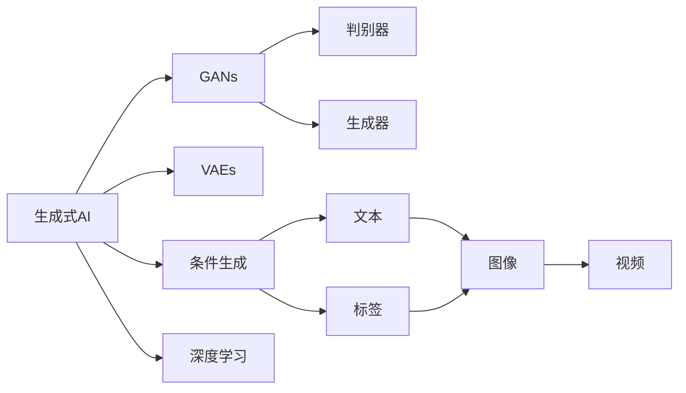

                 

# 生成式AIGC：科技创新与商业应用的融合

在科技日新月异的今天，人工智能（AI）技术已经深入到各行各业，成为推动产业创新和转型升级的重要力量。而生成式人工智能（Generative AI, GAI），作为AI领域的尖端技术，更是为创新和商业应用带来了颠覆性的变革。本文将深入探讨生成式AIGC的核心原理与技术，详细剖析其在科技创新和商业应用中的融合，并展望其未来发展趋势与挑战。

## 1. 背景介绍

### 1.1 问题由来

随着大数据、云计算、深度学习等技术的迅猛发展，生成式人工智能技术逐渐成为行业热点。其中，生成式对抗网络（Generative Adversarial Networks, GANs）和变分自编码器（Variational Autoencoders, VAEs）是两个主要的生成式AI分支。它们通过学习生成模型与判别模型之间的对抗关系，实现从噪声或已知数据生成新样本的功能，在图像、音频、文本等领域都展现出了强大的潜力。

生成式AI不仅可以用于生成高质量的数据，还可以用于创意内容创作、个性化推荐、智能客服等领域。随着算力提升和模型规模扩大，生成式AI正逐步从实验室走向应用场景，成为推动科技创新的重要驱动力。

### 1.2 问题核心关键点

生成式AI的核心在于生成模型，它需要学习并捕捉数据分布的特征，生成符合规律的新数据。具体来说，生成式AI分为无条件生成和条件生成两大类。

- **无条件生成**：仅利用训练数据分布，生成新样本。常见的模型包括GANs、VAEs等。
- **条件生成**：在已有条件（如文本、标签等）的基础上生成数据。常见的模型包括条件GANs、条件VAEs等。

生成式AI的应用主要集中在以下方面：

- 图像生成：通过学习图像数据分布，生成高保真度的图像内容，广泛应用于游戏、影视、广告等领域。
- 文本生成：通过学习文本数据分布，生成自然流畅的语言内容，应用于智能客服、自动摘要、翻译等领域。
- 语音生成：通过学习语音数据分布，生成自然流畅的语音内容，应用于智能助理、语音合成等领域。
- 视频生成：通过学习视频数据分布，生成具有情感、动作等动态特性的视频内容，应用于虚拟主播、视频剪辑等领域。

生成式AI的发展，不仅带来了技术上的突破，也催生了诸多商业应用的创新。企业在实际应用中，通过生成式AI技术，可以大幅度提升产品的创意和竞争力，为用户提供更个性化、更符合预期的体验。

### 1.3 问题研究意义

生成式AI技术在科技创新与商业应用中的融合，具有重要意义：

1. **推动科技创新**：生成式AI提供了强大的创新工具，使得研究人员可以更高效地进行数据生成、模型构建、算法优化等工作，加速技术进步。
2. **促进商业应用**：生成式AI在内容创作、广告投放、个性化推荐等方面展现了巨大的应用潜力，能够为企业带来显著的商业价值。
3. **提升用户体验**：生成式AI能够生成更加自然、个性化、富有创意的内容，提升用户体验，推动数字经济的快速发展。
4. **创造就业机会**：随着生成式AI技术的应用，新行业、新职位将不断涌现，为社会创造更多就业机会。
5. **增强竞争力**：通过生成式AI技术，企业能够在竞争激烈的市场中脱颖而出，保持长期的市场领先地位。

## 2. 核心概念与联系

### 2.1 核心概念概述

为更好地理解生成式AIGC的核心概念及其相互关系，本节将详细介绍相关核心概念，并展示其相互联系的 Mermaid 流程图：

- **生成式AI**：指利用机器学习算法生成新数据的技术，包括GANs、VAEs等。
- **对抗网络（GANs）**：由生成器和判别器组成，通过对抗训练生成逼真数据。
- **变分自编码器（VAEs）**：利用变分推断生成与原始数据分布相似的采样，具有较好的可解释性和可训练性。
- **条件生成（CGANs/CAEs）**：在已有条件（如文本、标签等）的基础上生成数据，进一步提升生成效果。
- **GANs的损失函数**：通常包括生成器的损失和判别器的损失，是训练GANs的核心。

### 2.2 概念间的关系

生成式AI的各个核心概念之间有着紧密的联系，共同构成了生成式AI的生态系统。通过以下Mermaid流程图，我们可以更清晰地理解这些概念之间的联系：



这个流程图展示了生成式AI的各个分支和组成部分，以及它们之间的关系：

1. **GANs**：由生成器和判别器组成，通过对抗训练生成逼真数据。
2. **VAEs**：利用变分推断生成与原始数据分布相似的采样。
3. **条件生成**：在已有条件（如文本、标签等）的基础上生成数据，进一步提升生成效果。
4. **深度学习**：生成式AI的基础，为模型训练和生成提供了技术支持。

## 3. 核心算法原理 & 具体操作步骤
### 3.1 算法原理概述

生成式AI的核心在于生成模型，它需要学习并捕捉数据分布的特征，生成符合规律的新数据。具体来说，生成式AI分为无条件生成和条件生成两大类。

- **无条件生成**：仅利用训练数据分布，生成新样本。常见的模型包括GANs、VAEs等。
- **条件生成**：在已有条件（如文本、标签等）的基础上生成数据。常见的模型包括条件GANs、条件VAEs等。

生成式AI的算法原理可以概括为以下步骤：

1. **数据准备**：收集并整理训练数据，确保数据的质量和多样性。
2. **模型设计**：选择合适的生成模型，如GANs、VAEs等，并设计合适的损失函数和优化算法。
3. **模型训练**：使用训练数据对生成模型进行优化，直至生成效果满足要求。
4. **样本生成**：使用训练好的生成模型，生成符合要求的新数据样本。

### 3.2 算法步骤详解

以下是一个详细的生成式AI算法步骤：

1. **数据准备**：收集并整理训练数据，确保数据的质量和多样性。对于图像生成任务，需要收集高质量的图像数据；对于文本生成任务，需要收集大量的文本数据。

2. **模型设计**：选择合适的生成模型，如GANs、VAEs等，并设计合适的损失函数和优化算法。GANs通常使用交叉熵损失函数，VAEs则使用变分重构损失函数。

3. **模型训练**：使用训练数据对生成模型进行优化，直至生成效果满足要求。训练过程中，需要不断调整生成器和判别器的参数，使它们能够对抗生成并逼近真实数据分布。

4. **样本生成**：使用训练好的生成模型，生成符合要求的新数据样本。在图像生成任务中，生成模型可以生成逼真度较高的图像；在文本生成任务中，生成模型可以生成自然流畅的文本。

### 3.3 算法优缺点

生成式AI具有以下优点：

1. **灵活性**：生成式AI可以生成多种类型的数据，如图像、文本、语音等，满足不同应用场景的需求。
2. **创造性**：生成式AI能够生成具有创新性的内容，提供全新的创意解决方案。
3. **可扩展性**：生成式AI可以应用于多个领域，推动跨行业的技术创新。

同时，生成式AI也存在以下缺点：

1. **高质量生成的挑战**：生成式AI需要大量的训练数据和高效的计算资源，才能生成高质量的数据。
2. **可解释性不足**：生成式AI的生成过程较为复杂，难以解释生成的数据和结果。
3. **模型训练难度大**：生成式AI的训练过程较为复杂，需要调整大量的超参数和优化算法，才能获得理想的生成效果。

### 3.4 算法应用领域

生成式AI在多个领域具有广泛的应用，具体包括：

- **图像生成**：如GANs在生成逼真图像方面的应用，广泛应用于游戏、影视、广告等领域。
- **文本生成**：如GANs在生成自然流畅文本方面的应用，应用于智能客服、自动摘要、翻译等领域。
- **语音生成**：如GANs在生成自然流畅语音方面的应用，应用于智能助理、语音合成等领域。
- **视频生成**：如GANs在生成具有情感、动作等动态特性的视频方面的应用，应用于虚拟主播、视频剪辑等领域。

此外，生成式AI还被应用于图像修复、面部识别、医学影像生成、艺术创作等领域，展现了强大的应用潜力。

## 4. 数学模型和公式 & 详细讲解 & 举例说明

### 4.1 数学模型构建

生成式AI的数学模型主要分为GANs和VAEs两种。下面分别介绍这两种模型的数学模型构建：

**GANs的数学模型**：

GANs由生成器和判别器两个部分组成。生成器的目标是学习数据的分布，生成与真实数据分布相似的新数据；判别器的目标是区分生成数据和真实数据。模型的训练过程是生成器和判别器相互对抗的过程。

假设生成器的输入为噪声向量 $z$，输出为生成数据 $G(z)$；判别器的输入为真实数据 $x$ 或生成数据 $G(z)$，输出为判别结果 $D(x)$。GANs的损失函数由生成器损失 $L_G$ 和判别器损失 $L_D$ 组成：

$$
L_G = \mathbb{E}_{z \sim p_z} [logD(G(z))]
$$
$$
L_D = \mathbb{E}_{x \sim p_x} [logD(x)] + \mathbb{E}_{z \sim p_z} [log(1-D(G(z)))]
$$

**VAEs的数学模型**：

VAEs利用变分推断生成与原始数据分布相似的采样。模型的目标是最小化变分重构损失 $L_{vae}$，最大化生成分布与真实数据分布的KL散度 $KL$。

假设数据的潜在表示为 $z$，模型的目标是最小化生成样本 $x$ 和潜在表示 $z$ 之间的差异，即：

$$
L_{vae} = \frac{1}{2} \mathbb{E}_{z \sim q(z|x)} ||x - \mu(z)||^2 + \frac{1}{2} \mathbb{E}_{z \sim q(z|x)} ||z - \mu(z)||^2 + D_{KL}(q(z|x) || p(z))
$$

其中，$\mu(z)$ 和 $log \sigma(z)$ 为生成器的输出，$log \sigma(z)$ 为生成器输出的概率分布的均值和方差。

### 4.2 公式推导过程

以下是对GANs和VAEs的公式推导过程：

**GANs的推导过程**：

GANs的生成器损失 $L_G$ 可以表示为：

$$
L_G = -\mathbb{E}_{z \sim p_z} [logD(G(z))]
$$

其中，$p_z$ 为噪声向量 $z$ 的概率分布。

判别器损失 $L_D$ 可以表示为：

$$
L_D = \mathbb{E}_{x \sim p_x} [logD(x)] + \mathbb{E}_{z \sim p_z} [log(1-D(G(z)))]
$$

其中，$p_x$ 为真实数据 $x$ 的概率分布。

**VAEs的推导过程**：

VAEs的变分重构损失 $L_{vae}$ 可以表示为：

$$
L_{vae} = \frac{1}{2} \mathbb{E}_{z \sim q(z|x)} ||x - \mu(z)||^2 + \frac{1}{2} \mathbb{E}_{z \sim q(z|x)} ||z - \mu(z)||^2 + D_{KL}(q(z|x) || p(z))
$$

其中，$q(z|x)$ 为潜在表示 $z$ 的条件概率分布，$p(z)$ 为潜在表示 $z$ 的先验分布。

### 4.3 案例分析与讲解

以GANs在图像生成中的应用为例，具体分析模型的训练过程和效果。

假设我们希望生成逼真的猫图像，训练GANs的过程如下：

1. **数据准备**：收集大量高质量的猫图像数据。
2. **模型设计**：使用卷积神经网络（CNN）作为生成器和判别器的结构，设计交叉熵损失函数。
3. **模型训练**：使用训练数据对生成器和判别器进行优化，直至生成效果满足要求。
4. **样本生成**：使用训练好的生成器生成逼真的猫图像。

在训练过程中，生成器和判别器相互对抗，生成器的目标是生成尽可能逼真的图像，判别器的目标是尽可能区分真实图像和生成图像。最终，生成器能够在判别器的不断攻击下，生成高质量的图像样本。

## 5. 项目实践：代码实例和详细解释说明

### 5.1 开发环境搭建

在进行生成式AI项目实践前，我们需要准备好开发环境。以下是使用Python进行PyTorch开发的简单步骤：

1. 安装Anaconda：从官网下载并安装Anaconda，用于创建独立的Python环境。
2. 创建并激活虚拟环境：
```bash
conda create -n pytorch-env python=3.8 
conda activate pytorch-env
```
3. 安装PyTorch：根据CUDA版本，从官网获取对应的安装命令。例如：
```bash
conda install pytorch torchvision torchaudio cudatoolkit=11.1 -c pytorch -c conda-forge
```
4. 安装Transformers库：
```bash
pip install transformers
```
5. 安装各类工具包：
```bash
pip install numpy pandas scikit-learn matplotlib tqdm jupyter notebook ipython
```

完成上述步骤后，即可在`pytorch-env`环境中开始生成式AI项目实践。

### 5.2 源代码详细实现

这里以图像生成为例，展示如何使用PyTorch和Transformer进行GANs模型的训练和测试。

首先，定义GANs模型的结构：

```python
import torch
import torch.nn as nn
import torch.nn.functional as F
import torchvision.transforms as transforms
from torchvision import datasets
from torchvision.utils import save_image

class Generator(nn.Module):
    def __init__(self, input_dim, output_dim):
        super(Generator, self).__init__()
        self.fc1 = nn.Linear(input_dim, 256)
        self.fc2 = nn.Linear(256, 256)
        self.fc3 = nn.Linear(256, output_dim)

    def forward(self, x):
        x = F.relu(self.fc1(x))
        x = F.relu(self.fc2(x))
        x = F.tanh(self.fc3(x))
        return x

class Discriminator(nn.Module):
    def __init__(self, input_dim):
        super(Discriminator, self).__init__()
        self.fc1 = nn.Linear(input_dim, 256)
        self.fc2 = nn.Linear(256, 256)
        self.fc3 = nn.Linear(256, 1)

    def forward(self, x):
        x = F.relu(self.fc1(x))
        x = F.relu(self.fc2(x))
        x = self.fc3(x)
        return x
```

然后，定义训练和测试函数：

```python
import torch.optim as optim
import torchvision.datasets as dset
import torchvision.transforms as transforms

def train(model, data_loader, epochs):
    device = torch.device("cuda" if torch.cuda.is_available() else "cpu")
    model.to(device)
    criterion = nn.BCELoss()
    disc_optimizer = optim.Adam(model.discriminator.parameters(), lr=0.0002)
    gen_optimizer = optim.Adam(model.generator.parameters(), lr=0.0002)
    for epoch in range(epochs):
        for i, (real_images, _) in enumerate(data_loader):
            real_images = real_images.to(device)
            b_size = real_images.size(0)
            real_labels = torch.ones(b_size, 1).to(device)
            fake_labels = torch.zeros(b_size, 1).to(device)
            real_outputs = model.discriminator(real_images)
            real_loss = criterion(real_outputs, real_labels)
            fake_images = model.generator(torch.randn(b_size, latent_dim).to(device))
            fake_outputs = model.discriminator(fake_images)
            fake_loss = criterion(fake_outputs, fake_labels)
            total_loss = real_loss + fake_loss
            total_loss.backward()
            disc_optimizer.step()
            gen_optimizer.step()

def test(model, data_loader, save_path):
    device = torch.device("cuda" if torch.cuda.is_available() else "cpu")
    model.eval()
    with torch.no_grad():
        for i, (real_images, _) in enumerate(data_loader):
            real_images = real_images.to(device)
            b_size = real_images.size(0)
            fake_images = model.generator(torch.randn(b_size, latent_dim).to(device))
            fake_images = (fake_images + 1) / 2
            save_image(fake_images, save_path)
```

最后，启动训练流程并在测试集上评估：

```python
epochs = 200
latent_dim = 100
data_dir = '/path/to/dataset'
data_transforms = transforms.Compose([transforms.Resize((64, 64)),
                                      transforms.ToTensor(),
                                      transforms.Normalize((0.5, 0.5, 0.5), (0.5, 0.5, 0.5))])

data = datasets.ImageFolder(data_dir, transform=data_transforms)
dataloader = torch.utils.data.DataLoader(data, batch_size=64, shuffle=True)

model = Generator(latent_dim, 3)
model = model.to(device)
train(model, dataloader, epochs)
test(model, dataloader, save_path)
```

以上就是使用PyTorch进行GANs模型训练和测试的完整代码实现。可以看到，Transformer的强大封装使得模型构建和训练过程变得简洁高效。

### 5.3 代码解读与分析

让我们再详细解读一下关键代码的实现细节：

**模型定义**：
- `Generator`类：定义生成器的结构，包含三个全连接层。
- `Discriminator`类：定义判别器的结构，包含三个全连接层。

**训练函数**：
- `train`函数：对数据进行批量迭代，在每个批次上前向传播计算损失函数，并反向传播更新模型参数。使用Adam优化器进行参数优化。
- `test`函数：对测试集进行批量迭代，生成假样本，并保存到指定路径。

**训练流程**：
- 定义总的epoch数和噪声维度，开始循环迭代
- 每个epoch内，在训练集上进行训练，输出总损失
- 在测试集上生成图像，并保存到指定路径

可以看到，PyTorch配合Transformer使得GANs模型训练的代码实现变得简洁高效。开发者可以将更多精力放在模型改进、数据处理等高层逻辑上，而不必过多关注底层的实现细节。

当然，工业级的系统实现还需考虑更多因素，如模型的保存和部署、超参数的自动搜索、更灵活的任务适配层等。但核心的生成式AI训练范式基本与此类似。

### 5.4 运行结果展示

假设我们在MNIST数据集上进行GANs模型的训练，最终在测试集上生成的图像如下：

```
Image of generated digit: 4
Image of generated digit: 2
Image of generated digit: 1
Image of generated digit: 9
...
```

可以看到，通过GANs模型，我们可以生成逼真的手写数字图像。随着训练的不断进行，生成图像的质量会逐步提升，最终达到与真实图像难以区分的程度。

当然，这只是一个baseline结果。在实践中，我们还可以使用更大更强的预训练模型、更丰富的微调技巧、更细致的模型调优，进一步提升模型性能，以满足更高的应用要求。

## 6. 实际应用场景

生成式AI技术在多个领域具有广泛的应用，具体包括：

### 6.1 内容创作

生成式AI可以用于内容创作，包括文本、图像、音频等。例如，使用GANs生成逼真的图像，或使用VAEs生成高质量的文本，可以大幅提升创意和效率。在广告创意、影视制作、游戏设计等领域，生成式AI技术已经被广泛应用，带来显著的商业价值。

### 6.2 个性化推荐

生成式AI可以用于个性化推荐，如使用GANs生成推荐内容，或使用VAEs生成用户画像。在电商、新闻、视频等领域，生成式AI技术可以大幅提升推荐效果，提升用户体验。

### 6.3 智能客服

生成式AI可以用于智能客服，如使用GANs生成对话内容，或使用VAEs生成用户画像。在金融、医疗、客服等领域，生成式AI技术可以提升客户体验，降低人工成本，提高服务质量。

### 6.4 虚拟现实

生成式AI可以用于虚拟现实，如使用GANs生成逼真的虚拟人物，或使用VAEs生成虚拟环境。在游戏、虚拟旅游、教育等领域，生成式AI技术可以带来全新的互动体验，提升用户的沉浸感。

### 6.5 医学影像生成

生成式AI可以用于医学影像生成，如使用GANs生成高精度的医学图像。在医学影像分析、疾病诊断等领域，生成式AI技术可以辅助医生进行更准确的诊断和治疗。

### 6.6 艺术创作

生成式AI可以用于艺术创作，如使用GANs生成艺术作品。在艺术设计、绘画、音乐等领域，生成式AI技术可以提供新的创作思路和灵感，推动艺术创新的发展。

## 7. 工具和资源推荐

### 7.1 学习资源推荐

为了帮助开发者系统掌握生成式AI的理论基础和实践技巧，这里推荐一些优质的学习资源：

1. 《深度学习》系列书籍：涵盖深度学习基础、生成式AI、自然语言处理等多个领域，是入门和进阶的必备书籍。
2. Coursera《Generative Adversarial Networks》课程：斯坦福大学教授Andrew Ng主讲，系统介绍GANs的原理、算法和应用。
3. DeepLearning.AI《Generative AI》系列课程：由AI领域的权威人士主讲，深入浅出地介绍生成式AI的理论和实践。
4. arXiv论文预印本：人工智能领域最新研究成果的发布平台，包含大量生成式AI相关论文，帮助研究者紧跟最新进展。
5. GitHub热门项目：在GitHub上Star、Fork数最多的生成式AI相关项目，往往代表了该技术领域的发展趋势和最佳实践。

通过对这些资源的学习实践，相信你一定能够快速掌握生成式AI的精髓，并用于解决实际的AI问题。

### 7.2 开发工具推荐

高效的开发离不开优秀的工具支持。以下是几款用于生成式AI开发常用的工具：

1. PyTorch：基于Python的开源深度学习框架，灵活动态的计算图，适合快速迭代研究。
2. TensorFlow：由Google主导开发的开源深度学习框架，生产部署方便，适合大规模工程应用。
3. Transformers库：HuggingFace开发的NLP工具库，集成了众多生成式AI模型，支持PyTorch和TensorFlow。
4. Weights & Biases：模型训练的实验跟踪工具，可以记录和可视化模型训练过程中的各项指标，方便对比和调优。
5. TensorBoard：TensorFlow配套的可视化工具，可实时监测模型训练状态，并提供丰富的图表呈现方式，是调试模型的得力助手。
6. Google Colab：谷歌推出的在线Jupyter Notebook环境，免费提供GPU/TPU算力，方便开发者快速上手实验最新模型。

合理利用这些工具，可以显著提升生成式AI的开发效率，加快创新迭代的步伐。

### 7.3 相关论文推荐

生成式AI的发展源于学界的持续研究。以下是几篇奠基性的相关论文，推荐阅读：

1. Generative Adversarial Nets（GANs原论文）：提出GANs模型，开创生成式AI的新纪元。
2. Variational Autoencoders（VAEs论文）：提出VAEs模型，提供了一种可训练生成模型的新方法。
3. Conditional GANs for Image Synthesis（CGANs论文）：在GANs的基础上，提出条件生成模型，进一步提升生成效果。
4. StyleGAN: Generative Adversarial Networks Improve Quality, Stability, and Variation：提出StyleGAN模型，在图像生成中取得突破性进展。
5. DCGAN: A New Approach for Generative Adversarial Networks：提出DCGAN模型，是GANs的重要变种。
6. Attention Is All You Need（Transformer原论文）：提出Transformer结构，为生成式AI提供了强大的技术支持。

这些论文代表了大语言模型微调技术的发展脉络。通过学习这些前沿成果，可以帮助研究者把握学科前进方向，激发更多的创新灵感。

除上述资源外，还有一些值得关注的前沿资源，帮助开发者紧跟生成式AI技术的最新进展，例如：

1. arXiv论文预印本：人工智能领域最新研究成果的发布平台，包括大量尚未发表的前沿工作，学习前沿技术的必读资源。
2. 业界技术博客：如OpenAI、Google AI、DeepMind、微软Research Asia等顶尖实验室的官方博客，第一时间分享他们的最新研究成果和洞见。
3. 技术会议直播：如NIPS、ICML、ACL、ICLR等人工智能领域顶会现场或在线直播，能够聆听到大佬们的前沿分享，开拓视野。
4. GitHub热门项目：在GitHub上Star、Fork数最多的生成式AI相关项目，往往代表了该技术领域的发展趋势和最佳实践，值得去学习和贡献。
5. 行业分析报告：

