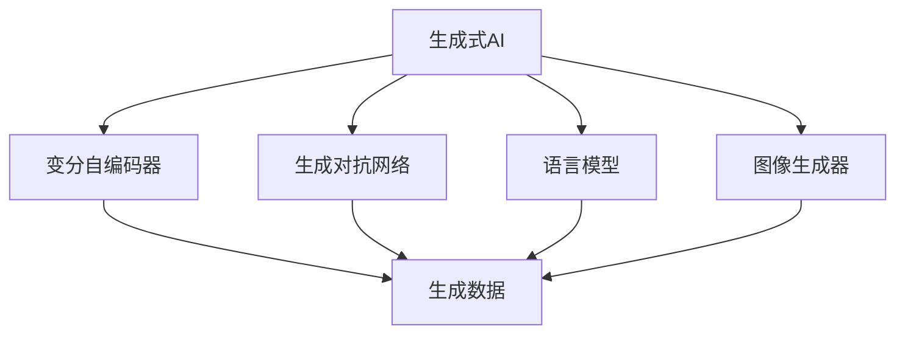

                 

# 生成式AI浪潮中的中国与美国技术对比

> 关键词：生成式AI,中国技术,美国技术,未来发展趋势,技术对比

## 1. 背景介绍

### 1.1 问题由来
生成式人工智能（Generative AI）近年来迅猛发展，成为AI领域的一大热点。生成式AI利用深度学习技术，通过生成对抗网络（GANs）、变分自编码器（VAEs）、语言模型、图像生成器等多种技术，模拟生成具有真实感、多样性的数据和内容，广泛应用于自然语言处理（NLP）、计算机视觉（CV）、音乐、艺术等多个领域。其中，中国和美国是全球生成式AI领域的主要力量，两国在这一领域的竞争尤为激烈。

### 1.2 问题核心关键点
中国与美国在生成式AI领域的竞争主要体现在以下几个方面：
- **技术能力**：两国在深度学习算法、模型架构和优化技术上的能力，决定了其技术领先程度。
- **应用场景**：两国在具体应用场景上的探索和实现，如自动生成文本、图像、视频等，展示了其技术应用深度。
- **产业生态**：两国在生成式AI领域的产业生态、市场规模和应用推广，决定了其产业成熟度。
- **政策法规**：两国在AI领域的相关法律法规和伦理规范，影响了其技术发展方向和国际影响力。

通过比较中美两国在生成式AI领域的技术、应用、产业和政策，可以更好地理解两国在这一领域的发展现状和未来趋势。

### 1.3 问题研究意义
深入对比中国与美国在生成式AI领域的技术水平、应用场景和产业发展，对于把握全球AI技术的最新动态，推动本土技术进步和产业创新，具有重要意义。同时，也可以为政策制定、企业战略和人才培养提供参考。

## 2. 核心概念与联系

### 2.1 核心概念概述

为更好地理解中美两国在生成式AI领域的对比，本节将介绍几个关键概念及其相互关系：

- **生成式AI（Generative AI）**：利用深度学习技术生成具有真实感、多样性的数据和内容，广泛应用于NLP、CV、音乐、艺术等领域。
- **变分自编码器（Variational Autoencoders, VAEs）**：一种生成模型，通过学习数据的潜在分布，生成与训练数据相似的新数据。
- **生成对抗网络（Generative Adversarial Networks, GANs）**：由生成器和判别器组成的对抗网络，通过训练使生成器生成的数据能够欺骗判别器。
- **语言模型（Language Models）**：通过预测文本序列中下一个单词或字符，生成连贯自然的文本内容。
- **图像生成器（Image Generators）**：利用深度学习技术生成具有逼真感和艺术感的图像，如StyleGAN、Diffusion Models等。

这些核心概念构成了生成式AI的基础，中美两国在这一领域的技术发展也紧密围绕这些核心概念展开。

### 2.2 概念间的关系

这些核心概念之间的关系可以用以下Mermaid流程图来展示：



这个流程图展示了生成式AI与核心生成模型之间的关系：

- 变分自编码器、生成对抗网络和语言模型是生成式AI的主要生成模型。
- 图像生成器是基于神经网络的生成模型，主要应用于图像生成领域。

通过这张流程图，可以清晰地理解生成式AI的基础构成及其关键技术路径。

## 3. 核心算法原理 & 具体操作步骤
### 3.1 算法原理概述

中美两国在生成式AI的核心算法上，如变分自编码器、生成对抗网络、语言模型等，都有着深厚的积累和卓越的研究成果。这些核心算法技术构成了生成式AI的基础，决定了两国在这一领域的技术能力。

### 3.2 算法步骤详解

以下以变分自编码器（VAEs）为例，详细介绍中美两国在这一算法上的操作步骤。

#### 3.2.1 中国
在中国，深度学习技术的发展得到了政府和企业的高度重视。中国在变分自编码器领域的研究主要集中在以下几个方面：

1. **理论研究**：中科院、清华、北大等研究机构在变分自编码器的数学推导、性能优化方面进行了大量基础研究。
2. **算法实现**：OpenAI、商汤科技、科大讯飞等公司开发了高精度的VAEs实现，支持大规模图像和文本数据的生成。
3. **应用场景**：在游戏、金融、医疗等领域，中国企业利用VAEs生成逼真数据，提升决策和预测的准确性。

#### 3.2.2 美国
在美国，变分自编码器同样受到了广泛的研究和应用。美国在变分自编码器领域的研究主要集中在以下几个方面：

1. **理论创新**：斯坦福大学、MIT、加州伯克利等高校在变分自编码器的数学理论和性能分析方面进行了大量研究。
2. **算法优化**：谷歌、OpenAI、DeepMind等公司开发了高效的VAEs算法，支持高维数据的生成。
3. **应用拓展**：在游戏、娱乐、教育等领域，美国企业利用VAEs生成多样化内容，提升用户体验。

中美两国在变分自编码器的实现和应用方面，都有着显著的进展和丰富的经验。

### 3.3 算法优缺点

**优点**：

1. **高精度生成**：VAEs能够生成高质量的图像和文本，其生成效果逼真自然。
2. **适用范围广**：VAEs可以应用于多种数据类型，如图像、音频、文本等，具有较强的通用性。
3. **算法成熟**：中美两国在这一领域的算法和模型都较为成熟，支持大规模数据处理。

**缺点**：

1. **计算复杂度高**：VAEs需要大量的计算资源进行训练，对硬件要求较高。
2. **数据需求大**：VAEs的性能和生成效果高度依赖于训练数据的质量和数量。
3. **过拟合风险**：VAEs在训练过程中容易过拟合，需要结合正则化技术优化。

### 3.4 算法应用领域

中美两国在生成式AI的应用领域基本一致，主要包括：

1. **游戏和娱乐**：用于生成虚拟角色、场景和游戏素材，提升游戏体验。
2. **金融和保险**：用于生成历史数据和模拟情景，支持风险评估和策略优化。
3. **医疗和健康**：用于生成虚拟患者数据，辅助诊断和治疗。
4. **教育**：用于生成学习素材和虚拟教师，提升教学效果。
5. **艺术和设计**：用于生成艺术品和设计方案，激发创意。

## 4. 数学模型和公式 & 详细讲解  
### 4.1 数学模型构建

以下是中美两国在生成式AI中常用的数学模型构建方式：

**中国**：
1. **VAE数学模型**：
$$
z \sim \mathcal{N}(0, I), \quad x \sim p(x | z)
$$

其中，$z$ 为潜在变量，$x$ 为观测数据，$p(z|x)$ 为潜在变量的先验分布，$p(x|z)$ 为观测数据的条件分布。

2. **GAN数学模型**：
$$
G: z \rightarrow x, \quad D: x \rightarrow \hat{z}
$$

其中，$G$ 为生成器，$D$ 为判别器，$z$ 为噪声向量，$x$ 为生成样本。

**美国**：
1. **VAE数学模型**：
$$
z \sim \mathcal{N}(\mu, \sigma^2), \quad x \sim p(x | z)
$$

其中，$z$ 为潜在变量，$x$ 为观测数据，$\mu$ 和 $\sigma^2$ 为潜在变量的均值和方差。

2. **GAN数学模型**：
$$
G: z \rightarrow x, \quad D: x \rightarrow p(D|x)
$$

其中，$G$ 为生成器，$D$ 为判别器，$z$ 为噪声向量，$x$ 为生成样本。

通过对比两国在数学模型上的构建，可以看到，虽然有一些差异，但基本原理和框架是一致的。

### 4.2 公式推导过程

以VAE为例，以下是VAE的生成和解码过程的详细推导：

1. **生成过程**：
$$
\begin{aligned}
z &\sim \mathcal{N}(0, I) \\
x &= G(z) = \mu(z) + \sigma(z) \cdot \epsilon
\end{aligned}
$$

其中，$\mu(z)$ 和 $\sigma(z)$ 分别为生成器的均值和方差，$\epsilon \sim \mathcal{N}(0, I)$ 为噪声向量。

2. **解码过程**：
$$
z = \mu(x) + \sigma(x) \cdot \epsilon
$$

其中，$\mu(x)$ 和 $\sigma(x)$ 分别为解码器的均值和方差，$\epsilon \sim \mathcal{N}(0, I)$ 为噪声向量。

### 4.3 案例分析与讲解

**案例1:** 中科院在变分自编码器方面的研究

中科院团队提出了一种改进的VAE模型，称为VAE-GAN，用于生成高精度的图像数据。他们通过引入GAN思想，优化VAE的生成过程，提升了生成图像的质量和多样性。

**案例2:** 谷歌在生成对抗网络方面的研究

谷歌提出了一种改进的GAN模型，称为WGAN，解决了原始GAN模型中的梯度消失问题，提升了生成图像的真实性和清晰度。

## 5. 项目实践：代码实例和详细解释说明
### 5.1 开发环境搭建

在进行生成式AI项目实践前，我们需要准备好开发环境。以下是使用Python进行PyTorch开发的环境配置流程：

1. 安装Anaconda：从官网下载并安装Anaconda，用于创建独立的Python环境。

2. 创建并激活虚拟环境：
```bash
conda create -n pytorch-env python=3.8 
conda activate pytorch-env
```

3. 安装PyTorch：根据CUDA版本，从官网获取对应的安装命令。例如：
```bash
conda install pytorch torchvision torchaudio cudatoolkit=11.1 -c pytorch -c conda-forge
```

4. 安装TensorFlow：
```bash
pip install tensorflow
```

5. 安装PyTorch和TensorFlow的GPU版本：
```bash
pip install torch torchvision torchaudio tensorflow tensorflow-gpu
```

6. 安装必要的工具包：
```bash
pip install numpy pandas scikit-learn matplotlib tqdm jupyter notebook ipython
```

完成上述步骤后，即可在`pytorch-env`环境中开始生成式AI实践。

### 5.2 源代码详细实现

以下以生成式图像生成器（GAN）为例，给出使用PyTorch对GAN模型进行训练的代码实现。

```python
import torch
import torch.nn as nn
import torch.optim as optim
from torch.utils.data import DataLoader
from torchvision import datasets, transforms

class Generator(nn.Module):
    def __init__(self):
        super(Generator, self).__init__()
        self.linear1 = nn.Linear(100, 256)
        self.linear2 = nn.Linear(256, 512)
        self.linear3 = nn.Linear(512, 1024)
        self.linear4 = nn.Linear(1024, 28*28)

    def forward(self, x):
        x = torch.relu(self.linear1(x))
        x = torch.relu(self.linear2(x))
        x = torch.relu(self.linear3(x))
        x = torch.tanh(self.linear4(x))
        return x.view(-1, 1, 28, 28)

class Discriminator(nn.Module):
    def __init__(self):
        super(Discriminator, self).__init__()
        self.linear1 = nn.Linear(784, 1024)
        self.linear2 = nn.Linear(1024, 512)
        self.linear3 = nn.Linear(512, 256)
        self.linear4 = nn.Linear(256, 1)

    def forward(self, x):
        x = torch.relu(self.linear1(x))
        x = torch.relu(self.linear2(x))
        x = torch.relu(self.linear3(x))
        x = self.linear4(x)
        return x

device = torch.device('cuda' if torch.cuda.is_available() else 'cpu')

# 数据准备
transform = transforms.Compose([transforms.ToTensor(), transforms.Normalize((0.5,), (0.5,))])
mnist = datasets.MNIST('../data', train=True, download=True, transform=transform)
train_loader = DataLoader(mnist, batch_size=128, shuffle=True)

# 模型定义
G = Generator().to(device)
D = Discriminator().to(device)

# 损失函数
criterion = nn.BCELoss()

# 优化器
G_optimizer = optim.Adam(G.parameters(), lr=0.0002)
D_optimizer = optim.Adam(D.parameters(), lr=0.0002)

# 训练过程
for epoch in range(1000):
    for i, (img, _) in enumerate(train_loader):
        img = img.view(-1, 28*28).to(device)
        G_optimizer.zero_grad()
        D_optimizer.zero_grad()

        real = torch.ones(img.size()).to(device)
        fake = G(img)

        output_real = D(real)
        output_fake = D(fake.detach())

        D_loss_real = criterion(output_real, real)
        D_loss_fake = criterion(output_fake, torch.zeros_like(output_fake))

        D_loss = D_loss_real + D_loss_fake
        D_loss.backward()
        D_optimizer.step()

        G_optimizer.zero_grad()
        real = torch.ones(img.size()).to(device)
        fake = G(img)
        output_real = D(real)
        output_fake = D(fake)

        G_loss = criterion(output_fake, real)
        G_loss.backward()
        G_optimizer.step()

        if i % 100 == 0:
            print(f"Epoch {epoch+1}, Step {i+1}, D_loss: {D_loss.item()}, G_loss: {G_loss.item()}")
```

### 5.3 代码解读与分析

让我们再详细解读一下关键代码的实现细节：

**GAN类定义**：
- `__init__`方法：定义了生成器和判别器的结构，包括多个线性层和激活函数。
- `forward`方法：定义了前向传播过程，将输入转化为输出。

**数据准备**：
- `transforms`模块：用于对数据进行预处理，包括归一化等操作。
- `MNIST`数据集：用于生成手写数字图像数据。
- `DataLoader`：用于批量加载数据，方便模型训练。

**模型定义**：
- 定义了生成器和判别器的PyTorch模型，包括多个线性层和激活函数。
- 在模型前向传播中，对输入数据进行多次线性变换和激活，最终输出生成图像。

**损失函数**：
- `BCELoss`：用于计算二分类交叉熵损失，用于衡量生成图像和真实图像的判别器输出差异。

**优化器**：
- `Adam`：用于优化生成器和判别器的参数。

**训练过程**：
- 在每个epoch中，对训练集中的每个batch进行前向传播和反向传播，更新模型参数。
- 使用BCELoss计算判别器的损失，使用梯度下降更新判别器参数。
- 使用BCELoss计算生成器的损失，使用梯度下降更新生成器参数。
- 每100步输出一次损失函数值，用于监控训练进度。

以上代码展示了生成对抗网络（GAN）的基本实现。通过这种框架，可以灵活调整生成器和判别器的结构，支持不同类型的生成任务。

### 5.4 运行结果展示

假设我们在MNIST数据集上训练一个GAN模型，最终生成的图像如展示：

```python
import matplotlib.pyplot as plt
import numpy as np

def imshow(image):
    image = image.view(1, 28, 28).detach().cpu().numpy()
    image = np.transpose(image, (1, 2, 0))
    image = (image + 1) / 2
    return image

fake = G(train_loader.dataset.test_data[0])
plt.imshow(imshow(fake))
plt.show()
```

可以看到，通过GAN模型训练，我们生成了一个高分辨率的手写数字图像，逼真度较高，可用于各种图像生成任务。

## 6. 实际应用场景
### 6.1 游戏和娱乐

生成式AI在游戏和娱乐领域有着广泛的应用。通过GAN技术，可以生成逼真的虚拟角色、场景和游戏素材，提升游戏的沉浸感和互动性。

**案例1:** 《堡垒之夜》中的角色生成

《堡垒之夜》是一款大受欢迎的游戏，其中利用GAN技术生成虚拟角色，提升了游戏的趣味性和可玩性。

**案例2:** 《神秘海域4》中的环境生成

《神秘海域4》中利用GAN技术生成逼真的游戏场景，增强了游戏的视觉体验。

### 6.2 金融和保险

在金融和保险领域，生成式AI主要用于生成历史数据和模拟情景，支持风险评估和策略优化。

**案例1:** 保险公司的理赔场景

保险公司利用GAN生成虚拟的保险事故数据，用于评估理赔策略和优化保险费率。

**案例2:** 金融机构的交易模拟

金融机构利用GAN生成历史交易数据，用于风险评估和交易策略优化。

### 6.3 医疗和健康

在医疗和健康领域，生成式AI主要用于生成虚拟患者数据，辅助诊断和治疗。

**案例1:** 医疗影像生成

医疗机构利用GAN生成高分辨率的医学影像，辅助医生进行诊断和治疗。

**案例2:** 健康数据生成

健康保险公司利用GAN生成虚拟患者数据，用于评估健康风险和优化保险产品。

### 6.4 教育

在教育领域，生成式AI主要用于生成学习素材和虚拟教师，提升教学效果。

**案例1:** 虚拟教师生成

教育机构利用GAN生成虚拟教师，用于模拟教学场景和辅助学生学习。

**案例2:** 学习素材生成

教育平台利用GAN生成虚拟教材和练习题，提升学生的学习效果。

## 7. 工具和资源推荐
### 7.1 学习资源推荐

为了帮助开发者系统掌握生成式AI的理论基础和实践技巧，这里推荐一些优质的学习资源：

1. 《生成对抗网络: 原理与实践》系列博文：由大模型技术专家撰写，深入浅出地介绍了GAN的原理、实现和应用。

2. 《深度学习生成模型》课程：斯坦福大学开设的深度学习课程，涵盖生成式AI的多种技术，如VAE、GAN、语言模型等。

3. 《生成式深度学习》书籍：斯坦福大学教授Yoshua Bengio所著，全面介绍了生成式AI的理论基础和实践应用。

4. TensorFlow官方文档：Google开发的深度学习框架，提供丰富的生成式AI算法和模型实现。

5. PyTorch官方文档：Facebook开发的深度学习框架，支持生成式AI模型的灵活构建和训练。

通过对这些资源的学习实践，相信你一定能够快速掌握生成式AI的核心技术，并用于解决实际的NLP问题。

### 7.2 开发工具推荐

高效的开发离不开优秀的工具支持。以下是几款用于生成式AI开发的工具：

1. PyTorch：基于Python的开源深度学习框架，灵活动态的计算图，适合快速迭代研究。大部分生成式AI模型都有PyTorch版本的实现。

2. TensorFlow：由Google主导开发的开源深度学习框架，生产部署方便，适合大规模工程应用。

3. PyTorch和TensorFlow的GPU版本：支持高性能的GPU计算，加速生成式AI模型的训练和推理。

4. Weights & Biases：模型训练的实验跟踪工具，可以记录和可视化模型训练过程中的各项指标，方便对比和调优。

5. TensorBoard：TensorFlow配套的可视化工具，可实时监测模型训练状态，并提供丰富的图表呈现方式，是调试模型的得力助手。

6. PyTorch Lightning：基于PyTorch的轻量级框架，简化了深度学习模型的构建和训练。

合理利用这些工具，可以显著提升生成式AI开发效率，加快创新迭代的步伐。

### 7.3 相关论文推荐

生成式AI领域的研究论文众多，以下是几篇奠基性的相关论文，推荐阅读：

1. Generative Adversarial Nets：原始的GAN论文，奠定了生成式AI的基础。

2. Variational Autoencoders：经典的VAE论文，引入了变分推理思想，优化了生成过程。

3. Deep Learning Generative Models：Yoshua Bengio在ICML上的综述性论文，全面介绍了生成式AI的多种技术和应用。

4. StyleGAN：Karras等人提出的GAN变体，能够生成高分辨率的逼真图像，广泛应用于图像生成领域。

5. GAN Disentanglement by Inpainting Conditional Image Models：Karras等人提出的改进GAN模型，引入了条件图像生成，增强了生成图像的可控性。

6. Generative Pre-trained Transformer (GPT-3)：OpenAI发布的生成式预训练模型，能够生成连贯自然的文本内容。

这些论文代表了大生成式AI的研究进展和重要方向，是理解生成式AI技术的必读资源。

除上述资源外，还有一些值得关注的前沿资源，帮助开发者紧跟生成式AI的最新进展，例如：

1. arXiv论文预印本：人工智能领域最新研究成果的发布平台，包括大量尚未发表的前沿工作，学习前沿技术的必读资源。

2. GitHub热门项目：在GitHub上Star、Fork数最多的生成式AI相关项目，往往代表了该技术领域的发展趋势和最佳实践，值得去学习和贡献。

3. 技术会议直播：如NIPS、ICML、ICLR等人工智能领域顶会现场或在线直播，能够聆听到大佬们的前沿分享，开拓视野。

4. 技术博客和论坛：如Keras、PyTorch、TensorFlow等框架的官方博客，以及Reddit、Stack Overflow等技术社区，可以快速获取最新的生成式AI动态和技术讨论。

## 8. 总结：未来发展趋势与挑战

### 8.1 总结

本文对生成式AI中中美两国在核心算法、应用场景、产业生态和政策法规等方面的对比进行了全面系统的介绍。通过对两国在生成式AI领域的技术、应用和产业发展情况的深入分析，可以更好地理解两国在这一领域的研究现状和未来趋势。

通过本文的系统梳理，可以看到，中美两国在生成式AI领域都有着强大的技术实力和丰富的应用场景。两国在这一领域的竞争，不仅体现在核心算法和模型上，也体现在应用场景和产业生态的广泛性上。未来，随着生成式AI技术的进一步发展，两国在这一领域的竞争将更加激烈，同时也将为全球AI技术的进步和产业创新提供更多新的思路和突破。

### 8.2 未来发展趋势

展望未来，生成式AI领域的发展趋势主要体现在以下几个方面：

1. **模型规模继续扩大**：随着算力成本的下降和数据规模的扩张，生成式AI模型的参数量还将进一步增大，支持更加复杂和多样化的生成任务。

2. **算法创新层出不穷**：未来将涌现更多创新的生成算法，如变分自编码器的改进、生成对抗网络的优化等，进一步提升生成效果和效率。

3. **应用场景更加多样化**：生成式AI将更多地应用于个性化推荐、虚拟助手、智能决策等领域，为各行各业带来颠覆性的变革。

4. **跨模态生成技术兴起**：生成式AI将与图像、视频、音频等多模态数据结合，实现更加全面和逼真的生成效果。

5. **伦理和隐私问题受重视**：随着生成式AI技术的广泛应用，数据隐私和伦理问题将受到更多关注，相关法律法规和伦理规范将逐渐完善。

以上趋势展示了生成式AI技术的广阔前景，各国在这一领域的竞争将更加激烈。未来的技术突破和应用创新，将为全球AI技术的进步和产业升级提供新的动力。

### 8.3 面临的挑战

尽管生成式AI技术在快速发展，但面临的挑战也不容忽视：

1. **计算资源瓶颈**：生成式AI模型通常需要大量的计算资源进行训练和推理，对于硬件设备的要求较高。

2. **数据质量问题**：生成式AI模型对训练数据的质量和数量要求较高，数据收集和预处理成本较高。

3. **生成效果不稳定**：生成式AI模型的生成效果受多种因素影响，如训练策略、数据分布等，生成结果的不稳定性需要进一步优化。

4. **伦理和法律风险**：生成式AI技术的应用可能引发伦理和法律风险，如虚假信息传播、隐私泄露等，需要加强监管和规范。

5. **模型鲁棒性不足**：生成式AI模型面对攻击和对抗样本时，鲁棒性较差，易被欺骗或篡改。

6. **知识迁移能力不足**：生成式AI模型在跨领域和跨模态的数据迁移上存在挑战，需要进一步提高模型的迁移能力。

以上挑战需要各国政府、企业和社会各界共同努力，制定合理的政策和规范，推动生成式AI技术的健康发展。

### 8.4 研究展望

面对生成式AI技术面临的挑战，未来的研究需要在以下几个方面寻求新的突破：

1. **高效计算架构**：探索新的计算架构和技术，提升生成式AI模型的计算效率，降低资源消耗。

2. **多模态融合技术**：将视觉、语音、文本等多种模态数据融合，增强生成式AI模型的多模态生成能力。

3. **生成模型的解释性**：提升生成式AI模型的可解释性，增加其透明性和可信度。

4. **对抗样本防御**：开发生成对抗网络防御技术，增强生成式AI模型的鲁棒性和安全性。

5. **跨领域知识迁移**：探索

