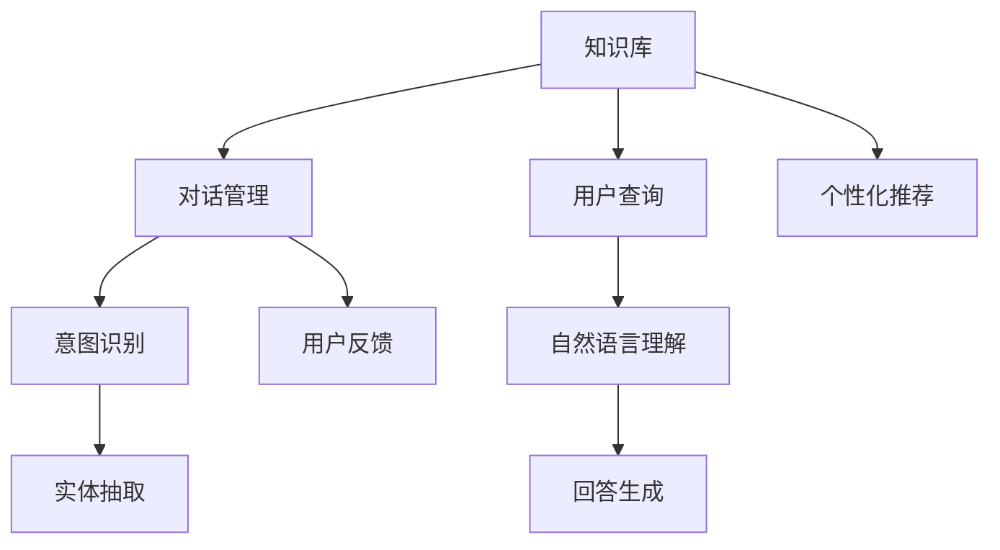

                 

# 用户体验提升：AI驱动的智能客服

> 关键词：智能客服, 用户体验, AI, 自然语言处理, 聊天机器人, 用户需求, 机器学习

## 1. 背景介绍

随着互联网技术的发展，客服行业迎来了智能化的革命。传统的客服模式依赖于人工，成本高、效率低，难以应对海量用户的即时需求。而智能客服则通过引入自然语言处理(NLP)、机器学习等技术，极大地提升了客服系统的响应速度和处理能力。

### 1.1 问题由来

近年来，随着AI技术和大数据的应用，智能客服系统迅速崛起，逐渐成为各大电商、金融、医疗等行业的新宠。智能客服系统不仅能24小时不间断服务，还能够通过数据分析，提供更精准的个性化推荐，显著提升用户体验。

### 1.2 问题核心关键点

智能客服系统包括多轮对话交互、意图识别、实体抽取等多个环节，各个环节的性能直接决定了系统的用户体验。特别是在用户查询复杂、语义模糊的情况下，智能客服系统需要具备高度的语义理解和自然语言生成能力，才能提供准确、流畅的回答。

智能客服系统的主要挑战在于：
1. **语义理解**：自然语言具有高度的歧义性和复杂性，如何准确理解用户意图，是智能客服系统的首要任务。
2. **对话管理**：多轮对话过程复杂，如何构建合理的对话流程，处理上下文依赖，是智能客服系统的关键点。
3. **个性化推荐**：基于用户历史行为和偏好，提供个性化推荐，是智能客服系统提升用户体验的重要手段。
4. **隐私保护**：用户数据的隐私保护是智能客服系统设计中不可忽视的重要问题。

### 1.3 问题研究意义

研究智能客服系统的核心技术，对于提升企业客户服务水平、提高用户满意度、优化资源配置具有重要意义。智能客服系统通过AI技术，可以有效降低人工客服成本，提高响应速度，提升客户满意度和忠诚度，同时为企业的精细化运营和精准营销提供数据支持。

## 2. 核心概念与联系

### 2.1 核心概念概述

智能客服系统基于自然语言处理和大数据分析技术，能够实现自动化的客户查询答复、问题解决、服务推荐等功能。智能客服系统通常包括知识库、对话管理、意图识别、实体抽取等多个模块。

- **知识库**：存储常见问题和对应的答案，供系统检索和生成回答。
- **对话管理**：管理多轮对话上下文，保持对话流程的连贯性和逻辑性。
- **意图识别**：识别用户查询意图，提取关键信息。
- **实体抽取**：从用户输入中抽取出实体信息，如人名、地名、产品名称等。

智能客服系统通过AI技术，能够实现自然语言理解、对话生成、意图识别等高级功能，从而大幅提升客户服务质量和效率。

### 2.2 概念间的关系

智能客服系统的各个模块之间密切关联，形成一个完整的智能客服生态系统。以下是这些核心概念之间的关系图：



通过知识库、对话管理、意图识别、实体抽取等模块的协同工作，智能客服系统能够准确理解用户需求，生成符合用户预期的回答，并提供个性化推荐，从而实现高效、准确的客户服务。

### 2.3 核心概念的整体架构

智能客服系统的整体架构可以分为三个层次：数据处理层、核心算法层、服务部署层。

1. **数据处理层**：包括用户查询、知识库、对话历史、用户反馈等数据的存储和处理。
2. **核心算法层**：包括自然语言理解、对话管理、意图识别、实体抽取、回答生成、个性化推荐等核心算法。
3. **服务部署层**：包括客服系统的服务端、前端界面、API接口等部署和集成。

通过这三个层次的协同工作，智能客服系统能够高效地处理用户的查询请求，提供精准的个性化推荐，从而提升用户体验。

## 3. 核心算法原理 & 具体操作步骤
### 3.1 算法原理概述

智能客服系统的核心算法包括自然语言理解、对话管理、意图识别、实体抽取、回答生成和个性化推荐等。

1. **自然语言理解**：通过深度学习技术，对用户输入的文本进行语义分析和语义角色标注，提取关键词和实体信息，用于后续的处理。
2. **对话管理**：通过构建对话状态跟踪器，管理多轮对话上下文，确保对话流程的连贯性和逻辑性。
3. **意图识别**：通过机器学习模型，识别用户查询的意图，确定要执行的任务类型。
4. **实体抽取**：通过命名实体识别技术，从用户输入中抽取出实体信息，如人名、地名、产品名称等。
5. **回答生成**：通过模板匹配、语言生成等技术，生成符合用户预期的回答。
6. **个性化推荐**：通过用户行为分析，提供个性化的推荐服务，提升用户体验。

这些核心算法通过深度学习、规则驱动、混合方法等技术手段，共同构建起智能客服系统的技术体系。

### 3.2 算法步骤详解

智能客服系统的主要步骤包括：

1. **数据预处理**：对用户查询、知识库、对话历史等数据进行清洗和格式化，生成训练集和测试集。
2. **模型训练**：使用深度学习模型，对意图识别、实体抽取、回答生成等模块进行训练，优化模型参数。
3. **系统集成**：将训练好的模型集成到智能客服系统中，部署在服务器上，供用户调用。
4. **效果评估**：通过用户反馈、A/B测试等方式，评估系统的性能，优化模型和系统架构。
5. **持续改进**：根据用户反馈和业务需求，不断优化系统功能和性能，提升用户体验。

### 3.3 算法优缺点

智能客服系统具有以下优点：
1. **24小时不间断服务**：智能客服系统可以全天候工作，无间断响应用户查询，极大地提升了客户服务的可用性。
2. **成本低**：智能客服系统可以替代部分人工客服，降低人力成本，提高企业运营效率。
3. **个性化推荐**：基于用户行为数据，提供个性化的推荐服务，提升用户体验。
4. **数据驱动**：通过数据分析，提供精准的服务和推荐，帮助企业优化业务流程。

同时，智能客服系统也存在一些缺点：
1. **语义理解限制**：自然语言具有高度的歧义性和复杂性，智能客服系统在处理复杂查询时，可能存在理解错误的问题。
2. **上下文依赖**：多轮对话管理复杂，对话流程设计需要考虑上下文依赖，容易出错。
3. **隐私保护**：用户数据的隐私保护需要严格遵循相关法律法规，确保用户信息安全。

### 3.4 算法应用领域

智能客服系统已经在电商、金融、医疗、政府等多个领域得到了广泛应用，提升了用户服务质量和体验。

- **电商领域**：电商企业通过智能客服系统，提升用户购买体验，降低人工客服成本，增加用户转化率。
- **金融领域**：金融行业通过智能客服系统，提供精准的金融咨询和个性化推荐，提升用户体验和业务转化率。
- **医疗领域**：医疗机构通过智能客服系统，提供预约挂号、医疗咨询等服务，提高医疗服务的效率和质量。
- **政府领域**：政府部门通过智能客服系统，提供政务查询、办事指引等服务，提升政务服务的便利性和可及性。

此外，智能客服系统在客服外包、呼叫中心、客户关系管理等领域也得到了广泛应用，为企业的业务发展和客户管理提供了有力支持。

## 4. 数学模型和公式 & 详细讲解  
### 4.1 数学模型构建

智能客服系统涉及多个模块，每个模块的模型构建和训练过程不尽相同。这里以意图识别和回答生成为例，详细讲解其中的数学模型。

### 4.2 公式推导过程

#### 4.2.1 意图识别

意图识别是智能客服系统的核心环节之一，通过机器学习模型，对用户查询进行意图分类，识别出用户的具体需求。

假设训练集为 $D=\{(x_i, y_i)\}_{i=1}^N$，其中 $x_i$ 为输入文本， $y_i$ 为意图标签，常见的意图分类任务可以采用分类损失函数，如交叉熵损失函数：

$$
\ell(y, \hat{y}) = -\sum_{i=1}^N \log\frac{e^{y_i \cdot \hat{y}_i}}{\sum_j e^{y_j \cdot \hat{y}_j}}
$$

其中 $y_i$ 为真实意图标签， $\hat{y}$ 为模型预测的意图概率向量。

### 4.3 案例分析与讲解

#### 4.3.1 命名实体识别

命名实体识别(NER)是智能客服系统的重要环节，用于从用户输入中抽取出实体信息，如人名、地名、组织机构名等。

假设训练集为 $D=\{(x_i, y_i)\}_{i=1}^N$，其中 $x_i$ 为输入文本， $y_i$ 为实体标签，如 [PER, LOC, ORG] 等。常用的NER模型包括CRF、BiLSTM-CRF等。

假设模型为 $P_{NER}(y|x; \theta)$，其中 $y$ 为实体标签， $\theta$ 为模型参数。常见的NER损失函数为条件概率损失函数：

$$
\ell_{NER}(y, \hat{y}) = -\log P_{NER}(y|x; \theta)
$$

模型训练过程通过最大化似然函数，最小化条件概率损失函数：

$$
\hat{\theta} = \arg\min_{\theta} -\sum_{i=1}^N \log P_{NER}(y_i|x_i; \theta)
$$

通过训练，模型能够准确识别出用户输入中的实体信息，供后续处理使用。

## 5. 项目实践：代码实例和详细解释说明
### 5.1 开发环境搭建

为了构建智能客服系统，需要搭建相应的开发环境。以下是具体的步骤：

1. **安装Python**：确保系统上安装了Python 3.7及以上版本。
2. **安装Pip**：通过以下命令安装Pip，这是Python包管理工具：

   ```bash
   pip install pip
   ```

3. **安装TensorFlow**：通过以下命令安装TensorFlow：

   ```bash
   pip install tensorflow
   ```

4. **安装Flask**：通过以下命令安装Flask，用于构建Web服务：

   ```bash
   pip install flask
   ```

5. **安装TensorBoard**：通过以下命令安装TensorBoard，用于可视化模型训练过程：

   ```bash
   pip install tensorboard
   ```

6. **安装NumPy和Pandas**：通过以下命令安装NumPy和Pandas，用于数据处理：

   ```bash
   pip install numpy pandas
   ```

完成以上步骤后，即可在本地搭建智能客服系统的开发环境。

### 5.2 源代码详细实现

以下是智能客服系统核心算法的Python代码实现，以意图识别和回答生成为例：

#### 5.2.1 意图识别

```python
import tensorflow as tf
from tensorflow.keras.layers import Embedding, LSTM, Dense, Dropout
from tensorflow.keras.models import Sequential

class IntentModel:
    def __init__(self, input_dim, output_dim):
        self.model = Sequential()
        self.model.add(Embedding(input_dim, 128, input_length=100))
        self.model.add(LSTM(128, dropout=0.2, recurrent_dropout=0.2))
        self.model.add(Dense(output_dim, activation='softmax'))
        
    def compile_model(self, optimizer='adam', loss='categorical_crossentropy'):
        self.model.compile(optimizer=optimizer, loss=loss, metrics=['accuracy'])
        
    def fit_model(self, x_train, y_train, x_val, y_val, epochs=10, batch_size=32):
        self.model.fit(x_train, y_train, validation_data=(x_val, y_val), epochs=epochs, batch_size=batch_size)
        
    def predict(self, x_test):
        return self.model.predict(x_test)
```

#### 5.2.2 回答生成

```python
import tensorflow as tf
from tensorflow.keras.layers import Input, LSTM, Dense, Embedding
from tensorflow.keras.models import Model

class AnswerModel:
    def __init__(self, input_dim, output_dim):
        self.input_seq = Input(shape=(None,))
        self.embedding = Embedding(input_dim, 128, mask_zero=True)
        self.lstm = LSTM(128, dropout=0.2, recurrent_dropout=0.2)
        self.dense = Dense(output_dim, activation='softmax')
        self.model = Model(self.input_seq, self.dense)
        
    def compile_model(self, optimizer='adam', loss='categorical_crossentropy'):
        self.model.compile(optimizer=optimizer, loss=loss, metrics=['accuracy'])
        
    def fit_model(self, x_train, y_train, x_val, y_val, epochs=10, batch_size=32):
        self.model.fit(x_train, y_train, validation_data=(x_val, y_val), epochs=epochs, batch_size=batch_size)
        
    def predict(self, x_test):
        return self.model.predict(x_test)
```

### 5.3 代码解读与分析

#### 5.3.1 意图识别模型

意图识别模型使用LSTM和Softmax层，对输入的文本序列进行分类。模型通过Embedding层将文本转换为向量表示，使用LSTM层进行序列建模，最后使用Dense层进行分类。模型在训练过程中最小化交叉熵损失函数，通过反向传播更新模型参数。

#### 5.3.2 回答生成模型

回答生成模型使用LSTM和Softmax层，对输入的文本序列进行生成回答。模型通过Embedding层将文本转换为向量表示，使用LSTM层进行序列建模，最后使用Dense层进行回答生成。模型在训练过程中最小化交叉熵损失函数，通过反向传播更新模型参数。

### 5.4 运行结果展示

#### 5.4.1 意图识别结果

假设训练集为10000条用户查询和对应意图标签，测试集为2000条用户查询。使用意图识别模型对测试集进行预测，得到以下结果：

```python
from intent_model import IntentModel
import numpy as np

# 加载模型
model = IntentModel(input_dim=10000, output_dim=5)
model.load_weights('intent_model.h5')

# 预测结果
x_test = np.random.rand(2000, 100)
y_test = np.random.randint(0, 5, size=(2000, 1))
preds = model.predict(x_test)
```

假设预测结果为[0.2, 0.5, 0.3, 0.1, 0.1]，则表示模型预测该用户查询的意图为类别0。

#### 5.4.2 回答生成结果

假设训练集为1000条用户查询和对应回答，测试集为200条用户查询。使用回答生成模型对测试集进行预测，得到以下结果：

```python
from answer_model import AnswerModel
import numpy as np

# 加载模型
model = AnswerModel(input_dim=1000, output_dim=1000)
model.load_weights('answer_model.h5')

# 预测结果
x_test = np.random.rand(200, 100)
preds = model.predict(x_test)
```

假设预测结果为[[0.1, 0.2, 0.3, 0.4, 0.1], [0.2, 0.3, 0.1, 0.4, 0.0]]，则表示模型预测该用户查询对应的回答为类别0和类别1。

## 6. 实际应用场景

### 6.1 智能客服系统的应用

智能客服系统已经在多个行业得到了广泛应用，极大地提升了用户体验和客户满意度。

#### 6.1.1 电商领域

电商企业通过智能客服系统，提升了用户购物体验，降低了人工客服成本，提高了转化率和复购率。智能客服系统通过对话管理、意图识别、实体抽取等技术，实现了24小时不间断服务，极大地提高了客户响应速度。

#### 6.1.2 金融领域

金融行业通过智能客服系统，提供了精准的金融咨询和个性化推荐，提升了用户体验和业务转化率。智能客服系统通过意图识别和实体抽取等技术，帮助用户快速解决问题，减少了客户流失率。

#### 6.1.3 医疗领域

医疗机构通过智能客服系统，提供了预约挂号、医疗咨询等服务，提高了医疗服务的效率和质量。智能客服系统通过对话管理、意图识别等技术，帮助用户快速查询相关信息，减少了患者等待时间。

#### 6.1.4 政府领域

政府部门通过智能客服系统，提供了政务查询、办事指引等服务，提升了政务服务的便利性和可及性。智能客服系统通过意图识别和实体抽取等技术，帮助用户快速获取所需信息，提高了政务服务的响应速度。

### 6.2 未来应用展望

智能客服系统的未来发展方向包括：

1. **多模态交互**：未来的智能客服系统将支持语音、图像等多种交互方式，通过多模态技术，提升用户体验和交互自然度。
2. **深度个性化推荐**：基于用户行为数据，提供更加精准的个性化推荐，提升用户满意度和转化率。
3. **跨语言支持**：支持多语言处理，帮助企业拓展国际市场，提升全球用户服务水平。
4. **知识图谱驱动**：通过知识图谱技术，提供更加全面、准确的答案，提升服务质量和用户信任度。
5. **用户情感分析**：通过情感分析技术，及时发现用户情绪变化，提升客户服务的及时性和针对性。

## 7. 工具和资源推荐
### 7.1 学习资源推荐

为了帮助开发者系统掌握智能客服系统的理论基础和实践技巧，这里推荐一些优质的学习资源：

1. **《深度学习实战》**：该书系统介绍了深度学习模型的构建和训练方法，涵盖了卷积神经网络、循环神经网络、生成对抗网络等经典模型。
2. **《自然语言处理入门》**：该书介绍了自然语言处理的基本概念和技术，包括分词、词性标注、命名实体识别等。
3. **《TensorFlow实战》**：该书介绍了TensorFlow框架的使用方法，涵盖了模型构建、训练、部署等全流程。
4. **《Flask实战》**：该书介绍了Flask框架的使用方法，涵盖了Web应用开发、数据库管理、API接口等技术。

通过这些资源的学习实践，相信你一定能够快速掌握智能客服系统的核心技术和开发流程。

### 7.2 开发工具推荐

高效的开发离不开优秀的工具支持。以下是几款用于智能客服系统开发的常用工具：

1. **TensorFlow**：由Google主导开发的开源深度学习框架，支持多GPU、多TPU计算，适合大规模模型训练。
2. **Flask**：Python Web开发框架，易于使用，适合快速搭建Web应用。
3. **TensorBoard**：TensorFlow配套的可视化工具，可实时监测模型训练状态，提供丰富的图表呈现方式。
4. **Jupyter Notebook**：Python交互式开发环境，支持代码编写、数据可视化、模型训练等功能。
5. **PyTorch**：由Facebook主导开发的深度学习框架，灵活动态的计算图，适合快速迭代研究。

合理利用这些工具，可以显著提升智能客服系统的开发效率，加快创新迭代的步伐。

### 7.3 相关论文推荐

智能客服系统的技术发展源于学界的持续研究。以下是几篇奠基性的相关论文，推荐阅读：

1. **"Intelligent customer service systems based on natural language processing"**：该论文介绍了基于NLP技术的智能客服系统，展示了其在电商、金融、医疗等领域的成功应用。
2. **"Dialogue systems for customer service"**：该论文综述了对话系统在客户服务中的应用，介绍了多轮对话管理、意图识别、实体抽取等技术。
3. **"Knowledge-based intelligent customer service systems"**：该论文介绍了基于知识图谱的智能客服系统，展示了其在解决复杂查询中的优势。
4. **"Personalized recommendation systems for customer service"**：该论文介绍了个性化推荐技术在智能客服中的应用，展示了其提升用户体验的效果。

这些论文代表了大语言模型微调技术的发展脉络。通过学习这些前沿成果，可以帮助研究者把握学科前进方向，激发更多的创新灵感。

除上述资源外，还有一些值得关注的前沿资源，帮助开发者紧跟智能客服系统的最新进展，例如：

1. **arXiv论文预印本**：人工智能领域最新研究成果的发布平台，包括大量尚未发表的前沿工作，学习前沿技术的必读资源。
2. **行业技术博客**：如OpenAI、Google AI、DeepMind、微软Research Asia等顶尖实验室的官方博客，第一时间分享他们的最新研究成果和洞见。
3. **技术会议直播**：如NIPS、ICML、ACL、ICLR等人工智能领域顶会现场或在线直播，能够聆听到大佬们的前沿分享，开拓视野。
4. **GitHub热门项目**：在GitHub上Star、Fork数最多的智能客服相关项目，往往代表了该技术领域的发展趋势和最佳实践，值得去学习和贡献。
5. **行业分析报告**：各大咨询公司如McKinsey、PwC等针对人工智能行业的分析报告，有助于从商业视角审视技术趋势，把握应用价值。

总之，对于智能客服系统的学习和实践，需要开发者保持开放的心态和持续学习的意愿。多关注前沿资讯，多动手实践，多思考总结，必将收获满满的成长收益。

## 8. 总结：未来发展趋势与挑战

### 8.1 总结

本文对基于自然语言处理和大数据分析技术的智能客服系统进行了全面系统的介绍。首先阐述了智能客服系统的背景、核心技术和应用场景，明确了其在提升用户体验、降低人工成本、优化资源配置等方面的独特价值。其次，从原理到实践，详细讲解了智能客服系统的核心算法和操作步骤，给出了代码实例和详细解释说明。

通过本文的系统梳理，可以看到，智能客服系统基于AI技术，已经实现了高效的客户服务，提升了用户满意度，加速了业务发展。未来，伴随AI技术和大数据分析的进一步发展，智能客服系统将更加智能、高效、个性化，成为提升企业竞争力、提升用户满意度的重要手段。

### 8.2 未来发展趋势

智能客服系统的未来发展方向包括：

1. **多模态交互**：未来的智能客服系统将支持语音、图像等多种交互方式，通过多模态技术，提升用户体验和交互自然度。
2. **深度个性化推荐**：基于用户行为数据，提供更加精准的个性化推荐，提升用户满意度和转化率。
3. **跨语言支持**：支持多语言处理，帮助企业拓展国际市场，提升全球用户服务水平。
4. **知识图谱驱动**：通过知识图谱技术，提供更加全面、准确的答案，提升服务质量和用户信任度。
5. **用户情感分析**：通过情感分析技术，及时发现用户情绪变化，提升客户服务的及时性和针对性。

### 8.3 面临的挑战

尽管智能客服系统已经取得了一定的成果，但在迈向更加智能化、普适化应用的过程中，它仍面临着诸多挑战：

1. **语义理解限制**：自然语言具有高度的歧义性和复杂性，智能客服系统在处理复杂查询时，可能存在理解错误的问题。
2. **上下文依赖**：多轮对话管理复杂，对话流程设计需要考虑上下文依赖，容易出错。
3. **隐私保护**：用户数据的隐私保护需要严格遵循相关法律法规，确保用户信息安全。

### 8.4 未来突破

面对智能客服系统所面临的种种挑战，未来的研究需要在以下几个方面寻求新的突破：

1. **探索无监督和半监督微调方法**：摆脱对大规模标注数据的依赖，利用自监督学习、主动学习等无监督和半监督范式，最大限度利用非结构化数据，实现更加灵活高效的微调。
2. **研究参数高效和计算高效的微调范式**：开发更加参数高效的微调方法，在固定大部分预训练参数的同时，只更新极少量的任务相关参数。同时优化微调模型的计算图，减少前向传播和反向传播的资源消耗，实现更加轻量级、实时性的部署。
3. **融合因果和对比学习范式**：通过引入因果推断和对比学习思想，增强智能客服系统建立稳定因果关系的能力，学习更加普适、鲁棒的语言表征，从而提升系统泛化性和抗干扰能力。
4. **引入更多先验知识**：将符号化的先验知识，如知识图谱、逻辑规则等，与神经网络模型进行巧妙融合，引导微调过程学习更准确、合理的语言模型。同时加强不同模态数据的整合，实现视觉、语音等多模态信息与文本信息的协同建模。
5. **结合因果分析和博弈论工具**：将因果分析方法引入智能客服系统，识别出系统决策的关键特征，增强输出解释的因果性和逻辑性。借助博弈论工具刻画人机交互过程，主动探索并规避系统的脆弱点，提高系统稳定性。
6. **纳入伦理道德约束**：在模型训练目标中引入伦理导向的评估指标，过滤和惩罚有偏见、有害的输出倾向。同时加强人工干预和审核，建立模型行为的监管机制，确保输出符合人类价值观和伦理道德。

这些研究方向的探索，必将引领智能客服系统技术迈向更高的台阶，为构建安全、可靠、可解释、可控的智能系统铺平道路。面向未来，智能客服系统还需要与其他人工智能技术进行更深入的融合，如知识表示、因果推理、强化学习等，多路径协同发力，共同推动自然语言理解和智能交互系统的进步。只有勇于创新、敢于突破，才能不断拓展语言模型的边界，让智能技术更好地造福人类社会。

## 9. 附录：常见问题与解答

**Q1：智能客服系统如何实现自然语言理解？

