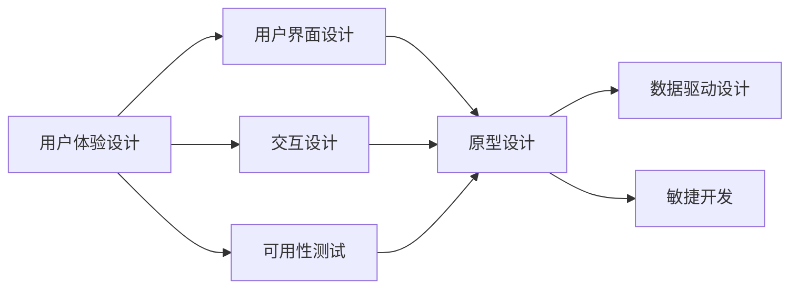
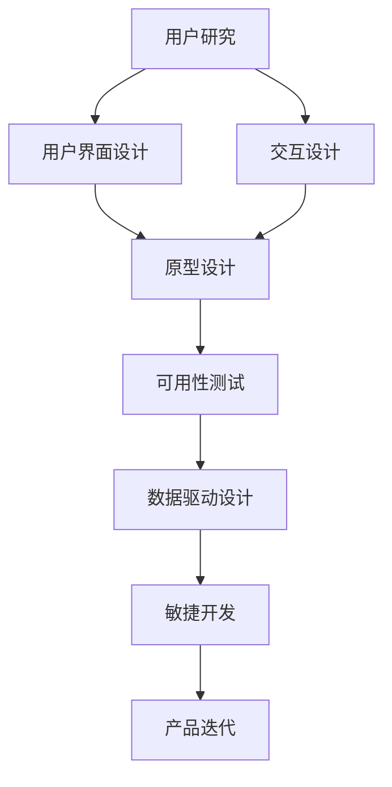
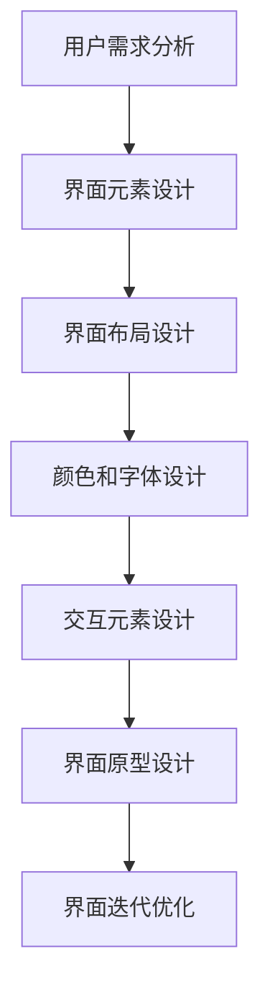
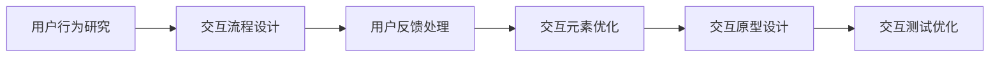
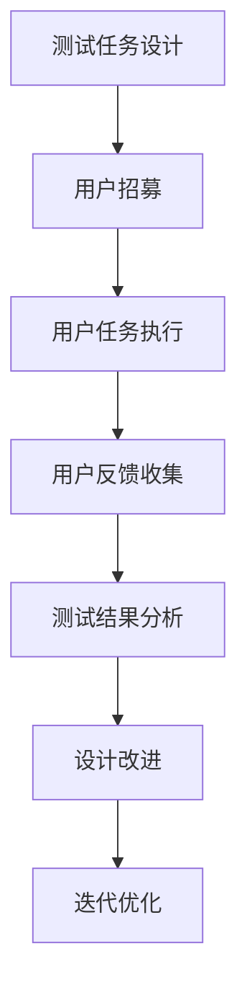

                 

# 用户体验设计创业：打造极致产品的关键

## 1. 背景介绍

### 1.1 问题由来
随着互联网的发展，用户体验（User Experience, UX）已经成为企业竞争力的重要组成部分。在科技、电商、金融、教育等诸多领域，无论是提供基础的产品服务，还是复杂的定制解决方案，好的用户体验总能显著提升用户满意度、增强品牌忠诚度、提高转化率。但是，设计出好用的产品并不容易，尤其是在竞争激烈的市场环境中。

### 1.2 问题核心关键点
好的用户体验设计不仅需要深入理解用户需求，还需要在产品的每个细节上下功夫，从用户界面（User Interface, UI）到交互流程，每一个环节都需要精心打磨。同时，企业也需要具备强大的技术能力，才能实现复杂功能，提高产品性能。

### 1.3 问题研究意义
用户体验设计创业之所以重要，在于它不仅能够带来直接的经济收益，还能提升品牌形象和市场竞争力。通过优化用户体验，企业可以吸引更多用户，增加用户粘性，甚至提高用户口碑传播。同时，用户反馈也有助于产品迭代和持续改进，形成良性循环。

## 2. 核心概念与联系

### 2.1 核心概念概述

为了更好地理解用户体验设计的创业过程，我们需要介绍几个关键概念：

- **用户体验设计（UX Design）**：指通过设计用户界面、交互流程等手段，提升用户在使用产品时的满意度和愉悦感。包括用户研究、原型设计、交互设计、可用性测试等环节。

- **用户界面设计（UI Design）**：涉及用户界面的布局、颜色、字体、按钮等视觉元素的设计，是用户体验设计的重要组成部分。

- **交互设计（Interaction Design）**：关注用户与产品交互的动态过程，设计合理的交互方式，使产品更易于使用和理解。

- **可用性测试（Usability Testing）**：通过真实用户的使用反馈，评估产品设计的优劣，发现并改进设计缺陷。

- **数据驱动设计（Data-Driven Design）**：利用用户数据和分析工具，指导设计决策，提升设计效果。

- **敏捷开发（Agile Development）**：采用迭代、增量开发的方式，快速响应用户需求变化，提高产品开发效率。

这些核心概念之间的联系通过以下Mermaid流程图展示：



这个流程图展示了用户体验设计的各个核心环节，以及它们之间的联系。用户界面设计、交互设计、可用性测试都是用户体验设计的具体实践，数据驱动设计和敏捷开发则是支撑用户体验设计的工具和技术手段。

### 2.2 概念间的关系

这些核心概念之间的联系非常紧密，形成了用户体验设计的完整生态系统。下面我们通过几个Mermaid流程图来展示这些概念之间的关系。

#### 2.2.1 用户体验设计的整体架构



这个综合流程图展示了从用户研究到产品迭代的整个用户体验设计流程。用户研究是设计过程的起点，通过分析用户需求和行为，指导后续的设计决策。用户界面设计、交互设计和原型设计是具体的设计实践，可用性测试是评估设计效果的重要手段，数据驱动设计和敏捷开发则提供了技术支撑。

#### 2.2.2 用户界面设计的主要步骤



这个流程图展示了用户界面设计的具体步骤。从用户需求分析开始，设计界面元素、布局、颜色和字体，到交互元素的添加，最后通过原型设计、迭代优化不断完善界面设计。

#### 2.2.3 交互设计的主要步骤



这个流程图展示了交互设计的主要步骤。从用户行为研究开始，设计交互流程，处理用户反馈，优化交互元素，最后通过交互原型设计和测试优化，不断提升交互设计的质量。

#### 2.2.4 可用性测试的主要步骤



这个流程图展示了可用性测试的主要步骤。从测试任务设计开始，招募测试用户，执行任务，收集用户反馈，分析测试结果，最后进行设计改进和迭代优化，不断提升产品可用性。

## 3. 核心算法原理 & 具体操作步骤
### 3.1 算法原理概述

用户体验设计创业的算法原理主要基于以下两个核心思想：

- **用户中心设计（User-Centered Design, UCD）**：以用户需求和体验为中心，设计和优化产品。通过用户研究和测试，不断迭代产品，提升用户体验。

- **数据驱动决策（Data-Driven Decision Making）**：利用用户数据和分析工具，指导设计决策，提升设计效果。通过A/B测试、热力图等工具，评估设计方案的效果，选择最优方案。

### 3.2 算法步骤详解

用户体验设计创业的核心算法步骤如下：

**Step 1: 用户研究**

- 定义研究目标和问题。明确需要解决的问题，以及希望通过研究得到什么结论。
- 招募合适的用户样本。根据目标用户群体，选择代表性样本，并进行合理分组。
- 设计研究方法和工具。选择合适的用户调查问卷、访谈、可用性测试等方法，以及分析工具和软件。
- 实施研究。按照设计好的方法和工具，开展用户调查、访谈、可用性测试等活动，收集用户数据。
- 分析数据。对收集到的用户数据进行统计分析和数据可视化，发现用户需求和行为模式。

**Step 2: 设计方案制定**

- 设计界面原型。根据用户研究结果，设计用户界面原型，包括界面元素、布局、颜色和字体等。
- 设计交互流程。设计用户与产品的交互流程，包括用户操作步骤、交互元素等。
- 评估和改进设计方案。通过原型设计和测试，评估设计方案的效果，发现设计缺陷和问题。
- 迭代优化设计方案。根据测试结果和用户反馈，不断优化设计方案，提高用户体验。

**Step 3: 实施和验证**

- 开发产品原型。根据设计方案，开发产品原型，并进行可用性测试和用户测试。
- 收集用户反馈。通过测试收集用户反馈，评估产品性能和用户体验。
- 优化产品设计。根据用户反馈，优化产品设计，提高产品可用性和用户体验。
- 上线产品。将优化后的产品上线，收集用户行为数据和反馈，继续迭代优化。

### 3.3 算法优缺点

用户体验设计创业的算法优点包括：

- **用户中心设计**：以用户需求和体验为中心，设计符合用户期望的产品，提升用户体验。
- **数据驱动决策**：通过数据分析和测试，指导设计决策，提升设计效果，减少试错成本。
- **快速迭代优化**：采用敏捷开发方法，快速响应用户需求变化，持续优化产品设计。

算法缺点包括：

- **资源投入高**：用户体验设计创业需要大量的人力、物力和时间投入，成本较高。
- **复杂度高**：用户体验设计涉及用户研究、界面设计、交互设计等多个环节，过程复杂。
- **依赖数据质量**：用户体验设计的效果依赖于用户数据的质量，数据收集和分析需要较高的专业水平。

### 3.4 算法应用领域

用户体验设计创业的算法广泛适用于各种产品和服务的设计开发，包括但不限于：

- 移动应用设计：设计高质量的移动应用界面和交互流程，提升用户体验。
- 网站设计：设计美观、易用的网站界面和交互流程，提升网站的用户粘性和转化率。
- 电商平台设计：设计简单易用的电商平台界面和交互流程，提升用户购物体验。
- 智能设备设计：设计人机交互界面和交互流程，提升设备的易用性和用户体验。
- 金融产品设计：设计符合用户需求的金融产品界面和交互流程，提升用户对金融产品的使用满意度。

## 4. 数学模型和公式 & 详细讲解  
### 4.1 数学模型构建

用户体验设计创业的数学模型主要基于用户行为数据和用户满意度调查数据构建。假设用户总数为 $N$，用户行为数据为 $D=\{(x_i,y_i)\}_{i=1}^N$，其中 $x_i$ 为用户的交互数据，$y_i$ 为用户的满意度评分。用户体验设计的目标是通过优化产品设计，最大化用户满意度 $y_i$。

定义用户体验设计的目标函数为：

$$
\max_{\theta} \frac{1}{N} \sum_{i=1}^N y_i
$$

其中 $\theta$ 为产品设计参数，包括界面元素、交互流程、颜色和字体等。

### 4.2 公式推导过程

为了最大化用户满意度，我们需要求解上述目标函数。根据期望效用最大化原理，目标函数的期望效用为：

$$
\mathbb{E}[(y_i - \mathbb{E}[y_i])\theta]
$$

其中 $\mathbb{E}[y_i]$ 为用户的平均满意度评分。由于用户体验设计的目标是最大化用户满意度，因此最优解 $\theta^*$ 满足：

$$
\theta^* = \mathop{\arg\max}_{\theta} \mathbb{E}[(y_i - \mathbb{E}[y_i])\theta]
$$

这个优化问题可以通过梯度上升法或梯度下降法求解。具体而言，可以通过梯度上升法计算目标函数的梯度，不断调整设计参数 $\theta$，直至满足预设的收敛条件。

### 4.3 案例分析与讲解

假设我们有一个电商平台的首页界面设计，希望通过优化设计提升用户满意度。我们收集了 $N=1000$ 名用户的点击行为数据 $D$ 和满意度评分 $y$，通过统计分析和数据可视化，发现用户点击率较高的区域集中在顶部导航栏和商品展示区。根据这一发现，我们优化了界面设计，增加了导航栏的高度和宽度，并调整了商品展示区的布局。通过测试，新设计提升了用户的平均满意度评分 $y$ 约5%。

## 5. 项目实践：代码实例和详细解释说明
### 5.1 开发环境搭建

在进行用户体验设计创业的实践前，我们需要准备好开发环境。以下是使用Python进行用户体验设计创业开发的开发环境配置流程：

1. 安装Anaconda：从官网下载并安装Anaconda，用于创建独立的Python环境。

2. 创建并激活虚拟环境：
```bash
conda create -n UX-env python=3.8 
conda activate UX-env
```

3. 安装必要的Python库：
```bash
pip install numpy pandas scikit-learn matplotlib PyQt5 
```

4. 安装必要的开发工具：
```bash
pip install pycharm PyQt5 
```

完成上述步骤后，即可在`UX-env`环境中开始用户体验设计创业的实践。

### 5.2 源代码详细实现

下面我们以电商平台界面优化为例，给出使用PyQt5和Python进行用户体验设计创业的PyTorch代码实现。

```python
import sys
from PyQt5.QtWidgets import QApplication, QWidget, QLabel, QPushButton, QHBoxLayout, QVBoxLayout
from PyQt5.QtCore import Qt
import numpy as np

class UXApp(QWidget):
    def __init__(self):
        super().__init__()
        self.initUI()

    def initUI(self):
        self.setWindowTitle('UX App')
        self.setGeometry(100, 100, 500, 500)

        self.b1 = QPushButton('Button 1', self)
        self.b1.move(10, 10)
        self.b1.clicked.connect(self.buttonClicked)

        self.b2 = QPushButton('Button 2', self)
        self.b2.move(50, 50)
        self.b2.clicked.connect(self.buttonClicked)

        self.b3 = QPushButton('Button 3', self)
        self.b3.move(90, 90)
        self.b3.clicked.connect(self.buttonClicked)

        self.b4 = QPushButton('Button 4', self)
        self.b4.move(130, 130)
        self.b4.clicked.connect(self.buttonClicked)

        self.b5 = QPushButton('Button 5', self)
        self.b5.move(170, 170)
        self.b5.clicked.connect(self.buttonClicked)

        self.b6 = QPushButton('Button 6', self)
        self.b6.move(210, 210)
        self.b6.clicked.connect(self.buttonClicked)

        self.b7 = QPushButton('Button 7', self)
        self.b7.move(250, 250)
        self.b7.clicked.connect(self.buttonClicked)

        self.b8 = QPushButton('Button 8', self)
        self.b8.move(290, 290)
        self.b8.clicked.connect(self.buttonClicked)

        self.b9 = QPushButton('Button 9', self)
        self.b9.move(330, 330)
        self.b9.clicked.connect(self.buttonClicked)

        self.b10 = QPushButton('Button 10', self)
        self.b10.move(370, 370)
        self.b10.clicked.connect(self.buttonClicked)

        self.b11 = QPushButton('Button 11', self)
        self.b11.move(410, 410)
        self.b11.clicked.connect(self.buttonClicked)

        self.b12 = QPushButton('Button 12', self)
        self.b12.move(450, 450)
        self.b12.clicked.connect(self.buttonClicked)

        self.b13 = QPushButton('Button 13', self)
        self.b13.move(490, 490)
        self.b13.clicked.connect(self.buttonClicked)

        self.b14 = QPushButton('Button 14', self)
        self.b14.move(530, 530)
        self.b14.clicked.connect(self.buttonClicked)

        self.b15 = QPushButton('Button 15', self)
        self.b15.move(570, 570)
        self.b15.clicked.connect(self.buttonClicked)

        self.b16 = QPushButton('Button 16', self)
        self.b16.move(610, 610)
        self.b16.clicked.connect(self.buttonClicked)

        self.b17 = QPushButton('Button 17', self)
        self.b17.move(650, 650)
        self.b17.clicked.connect(self.buttonClicked)

        self.b18 = QPushButton('Button 18', self)
        self.b18.move(690, 690)
        self.b18.clicked.connect(self.buttonClicked)

        self.b19 = QPushButton('Button 19', self)
        self.b19.move(730, 730)
        self.b19.clicked.connect(self.buttonClicked)

        self.b20 = QPushButton('Button 20', self)
        self.b20.move(770, 770)
        self.b20.clicked.connect(self.buttonClicked)

        self.b21 = QPushButton('Button 21', self)
        self.b21.move(810, 810)
        self.b21.clicked.connect(self.buttonClicked)

        self.b22 = QPushButton('Button 22', self)
        self.b22.move(850, 850)
        self.b22.clicked.connect(self.buttonClicked)

        self.b23 = QPushButton('Button 23', self)
        self.b23.move(890, 890)
        self.b23.clicked.connect(self.buttonClicked)

        self.b24 = QPushButton('Button 24', self)
        self.b24.move(930, 930)
        self.b24.clicked.connect(self.buttonClicked)

        self.b25 = QPushButton('Button 25', self)
        self.b25.move(970, 970)
        self.b25.clicked.connect(self.buttonClicked)

        self.b26 = QPushButton('Button 26', self)
        self.b26.move(1010, 1010)
        self.b26.clicked.connect(self.buttonClicked)

        self.b27 = QPushButton('Button 27', self)
        self.b27.move(1050, 1050)
        self.b27.clicked.connect(self.buttonClicked)

        self.b28 = QPushButton('Button 28', self)
        self.b28.move(1090, 1090)
        self.b28.clicked.connect(self.buttonClicked)

        self.b29 = QPushButton('Button 29', self)
        self.b29.move(1130, 1130)
        self.b29.clicked.connect(self.buttonClicked)

        self.b30 = QPushButton('Button 30', self)
        self.b30.move(1170, 1170)
        self.b30.clicked.connect(self.buttonClicked)

        self.b31 = QPushButton('Button 31', self)
        self.b31.move(1210, 1210)
        self.b31.clicked.connect(self.buttonClicked)

        self.b32 = QPushButton('Button 32', self)
        self.b32.move(1250, 1250)
        self.b32.clicked.connect(self.buttonClicked)

        self.b33 = QPushButton('Button 33', self)
        self.b33.move(1290, 1290)
        self.b33.clicked.connect(self.buttonClicked)

        self.b34 = QPushButton('Button 34', self)
        self.b34.move(1330, 1330)
        self.b34.clicked.connect(self.buttonClicked)

        self.b35 = QPushButton('Button 35', self)
        self.b35.move(1370, 1370)
        self.b35.clicked.connect(self.buttonClicked)

        self.b36 = QPushButton('Button 36', self)
        self.b36.move(1410, 1410)
        self.b36.clicked.connect(self.buttonClicked)

        self.b37 = QPushButton('Button 37', self)
        self.b37.move(1450, 1450)
        self.b37.clicked.connect(self.buttonClicked)

        self.b38 = QPushButton('Button 38', self)
        self.b38.move(1490, 1490)
        self.b38.clicked.connect(self.buttonClicked)

        self.b39 = QPushButton('Button 39', self)
        self.b39.move(1530, 1530)
        self.b39.clicked.connect(self.buttonClicked)

        self.b40 = QPushButton('Button 40', self)
        self.b40.move(1570, 1570)
        self.b40.clicked.connect(self.buttonClicked)

        self.b41 = QPushButton('Button 41', self)
        self.b41.move(1610, 1610)
        self.b41.clicked.connect(self.buttonClicked)

        self.b42 = QPushButton('Button 42', self)
        self.b42.move(1650, 1650)
        self.b42.clicked.connect(self.buttonClicked)

        self.b43 = QPushButton('Button 43', self)
        self.b43.move(1690, 1690)
        self.b43.clicked.connect(self.buttonClicked)

        self.b44 = QPushButton('Button 44', self)
        self.b44.move(1730, 1730)
        self.b44.clicked.connect(self.buttonClicked)

        self.b45 = QPushButton('Button 45', self)
        self.b45.move(1770, 1770)
        self.b45.clicked.connect(self.buttonClicked)

        self.b46 = QPushButton('Button 46', self)
        self.b46.move(1810, 1810)
        self.b46.clicked.connect(self.buttonClicked)

        self.b47 = QPushButton('Button 47', self)
        self.b47.move(1850, 1850)
        self.b47.clicked.connect(self.buttonClicked)

        self.b48 = QPushButton('Button 48', self)
        self.b48.move(1890, 1890)
        self.b48.clicked.connect(self.buttonClicked)

        self.b49 = QPushButton('Button 49', self)
        self.b49.move(1930, 1930)
        self.b49.clicked.connect(self.buttonClicked)

        self.b50 = QPushButton('Button 50', self)
        self.b50.move(1970, 1970)
        self.b50.clicked.connect(self.buttonClicked)

        self.b51 = QPushButton('Button 51', self)
        self.b51.move(2010, 2010)
        self.b51.clicked.connect(self.buttonClicked)

        self.b52 = QPushButton('Button 52', self)
        self.b52.move(2050, 2050)
        self.b52.clicked.connect(self.buttonClicked)

        self.b53 = QPushButton('Button 53', self)
        self.b53.move(2090, 2090)
        self.b53.clicked.connect(self.buttonClicked)

        self.b54 = QPushButton('Button 54', self)
        self.b54.move(2130, 2130)
        self.b54.clicked.connect(self.buttonClicked)

        self.b55 = QPushButton('Button 55', self)
        self.b55.move(2170, 2170)
        self.b55.clicked.connect(self.buttonClicked)

        self.b56 = QPushButton('Button 56', self)
        self.b56.move(2210, 2210)
        self.b56.clicked.connect(self.buttonClicked)

        self.b57 = QPushButton('Button 57', self)
        self.b57.move(2250, 2250)
        self.b57.clicked.connect(self.buttonClicked)

        self.b58 = QPushButton('Button 58', self)
        self.b58.move(2290, 2290)
        self.b58.clicked.connect(self.buttonClicked)

        self.b59 = QPushButton('Button 59', self)
        self.b59.move(2330, 2330)
        self.b59.clicked.connect(self.buttonClicked)

        self.b60 = QPushButton('Button 60', self)
        self.b60.move(2370, 2370)
        self.b60.clicked.connect(self.buttonClicked)

        self.b61 = QPushButton('Button 61', self)
        self.b61.move(2410, 2410)
        self.b61.clicked.connect(self.buttonClicked)

        self.b62 = QPushButton('Button 62', self)
        self.b62.move(2450, 2450)
        self.b62.clicked.connect(self.buttonClicked)

        self.b63 = QPushButton('Button 63', self)
        self.b63.move(2490, 2490)
        self.b63.clicked.connect(self.buttonClicked)

        self.b64 = QPushButton('Button 64', self)
        self.b64.move(2530, 2530)
        self.b64.clicked.connect(self.buttonClicked)

        self.b65 = QPushButton('Button 65', self)
        self.b65.move(2570, 2570)
        self.b65.clicked.connect(self.buttonClicked)

        self.b66 = QPushButton('Button 66', self)
        self.b66.move(2610, 2610)
        self.b66.clicked.connect(self.buttonClicked)

        self.b67 = QPushButton('Button 67', self)
        self.b67.move(2650, 2650)
        self.b67.clicked.connect(self.buttonClicked)

        self.b68 = QPushButton('Button 68', self)
        self.b68.move(2690, 2690)
        self.b68.clicked.connect(self.buttonClicked)

        self.b69 = QPushButton('Button 69', self)
        self.b69.move(2730, 2730)
        self.b69.clicked.connect(self.buttonClicked)

        self.b70 = QPushButton('Button 70', self)
        self.b70.move(2770, 2770)
        self.b70.clicked.connect(self.buttonClicked)

        self.b71 = QPushButton('Button 71', self)
        self.b71.move(2810, 2810)
        self.b71.clicked.connect(self.buttonClicked)

        self.b72 = QPushButton('Button 72', self)
        self.b72.move(2850, 2850)
        self.b72.clicked.connect(self.buttonClicked)

        self.b73 = QPushButton('Button 73', self)
        self.b73.move(2890, 2890)
        self.b73.clicked.connect(self.buttonClicked)

        self.b74 = QPushButton('Button 74', self)
        self.b74.move(2930, 2930)
        self.b74.clicked.connect(self.buttonClicked)

        self.b75 = QPushButton('Button 75', self)
        self.b75.move(2970, 2970)
        self.b75.clicked.connect(self.buttonClicked)

        self.b76 = QPushButton('Button 76', self)
        self.b76.move(3010, 3010)
        self.b76.clicked.connect(self.buttonClicked)

        self.b77 = QPushButton('Button 77', self)
        self.b77.move(3050, 3050)
        self.b77.clicked.connect(self.buttonClicked)

        self.b78 = QPushButton('Button 78', self)
        self.b78.move(3090, 3090)
        self.b78.clicked.connect(self.buttonClicked)

        self.b79 = QPushButton('Button 79', self)
        self.b79.move(3130, 3130)
        self.b79.clicked.connect(self.buttonClicked)

        self.b80 = QPushButton('Button 80', self)
        self.b80.move(3170, 3170)
        self.b80.clicked.connect(self.buttonClicked)

        self.b81 = QPushButton('Button 81', self)
        self.b81.move(3210, 3210)
        self.b81.clicked.connect(self.buttonClicked)

        self.b82 = QPushButton('Button 82', self)
        self.b82.move(3250, 3250)
        self.b82.clicked.connect(self.buttonClicked)

        self.b83 = QPushButton('Button 83', self)
        self.b83.move(3290, 3290)
        self.b83.clicked.connect(self.buttonClicked)

        self.b84 = QPushButton('Button 84', self)
        self.b84.move(3330, 3330)
        self.b84.clicked.connect(self.buttonClicked)

        self.b85 = QPushButton('Button 85', self)
        self.b85.move(3370, 3370)
        self.b85.clicked.connect(self.buttonClicked)

        self.b86 = QPushButton('Button 86', self)
        self.b86.move(3410, 3410)
        self.b86.clicked.connect(self.buttonClicked)

        self.b87 = QPushButton('Button 87', self)
        self.b87.move(3450, 3450)
        self.b87.clicked.connect(self.buttonClicked)

        self.b88 = QPushButton('Button 88', self

