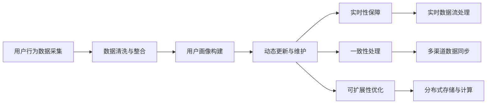

                 

# 用户画像的动态更新与维护

## 1. 背景介绍

在数字化时代，用户画像已成为企业决策和个性化推荐的重要依据。然而，静态用户画像难以适应用户行为的快速变化和复杂性，导致推荐效果不佳。为了更好地理解和响应用户需求，实现精准、实时的个性化推荐，动态更新和维护用户画像成为了当前研究的热点。本文将详细探讨用户画像的动态更新与维护，帮助开发者构建更加智能、高效的用户推荐系统。

## 2. 核心概念与联系

### 2.1 核心概念概述

为了更好地理解用户画像的动态更新与维护，我们需要先明确几个核心概念：

- **用户画像(User Profile)**：通过对用户行为数据的分析，构建出用户的综合特征表示。用户画像包括用户的兴趣、行为、属性、社交关系等多元化信息。
- **动态更新**：随着用户行为的不断变化，用户画像需要不断地进行修正和更新，以保持其时效性和准确性。动态更新的目标是确保画像始终反映用户的最新状态。
- **维护**：动态更新后，需要对用户画像进行维护，包括数据的清洗、去重、异常处理等操作，以保证画像的质量和稳定性。
- **实时性**：为了满足个性化推荐的需求，用户画像的更新和维护需要具备高实时性，及时捕捉用户的最新行为变化。
- **一致性**：在多渠道和多设备上的用户行为数据整合时，需要保证用户画像的一致性，避免数据冲突和冗余。
- **可扩展性**：用户画像系统需要能够支持海量用户的实时更新和维护，具备良好的可扩展性和弹性。

### 2.2 核心概念之间的关系

用户画像的动态更新与维护涉及多个环节，各个环节之间关系紧密，形成了一个完整的体系。以下通过一个简化的流程图来展示这些环节之间的关系：



通过这个流程，我们可以看出，用户画像的动态更新与维护是一个连续的、多步骤的迭代过程，涉及数据采集、清洗、构建、更新、维护等多个环节。各环节紧密协作，确保用户画像始终保持时效性和准确性。

## 3. 核心算法原理 & 具体操作步骤

### 3.1 算法原理概述

用户画像的动态更新与维护涉及多个算法，包括数据清洗、数据整合、画像构建、动态更新和画像维护等。以下分别介绍这些算法的基本原理。

- **数据清洗与整合**：通过对原始用户行为数据进行去重、去噪、归一化等操作，确保数据的质量和一致性。常用的数据清洗方法包括基于规则的清洗、基于机器学习的清洗等。
- **用户画像构建**：通过对清洗后的数据进行特征工程，提取用户的兴趣、行为、属性等特征，构建用户画像。常用的特征工程方法包括主成分分析、因子分析、聚类分析等。
- **动态更新**：通过实时捕捉用户行为数据的变化，更新用户画像。常用的动态更新方法包括增量更新、滑动窗口更新等。
- **画像维护**：对动态更新后的用户画像进行维护，包括数据的去重、异常处理、更新日志记录等。常用的画像维护方法包括定期更新、异常检测等。

### 3.2 算法步骤详解

以下详细介绍用户画像动态更新与维护的具体操作步骤：

**Step 1: 数据采集与清洗**
- 通过API接口、日志、点击流等渠道，采集用户行为数据。
- 对采集到的数据进行初步清洗，包括去重、去噪、去敏感信息等。
- 对清洗后的数据进行整合，生成统一的数据格式。

**Step 2: 用户画像构建**
- 对整合后的数据进行特征提取，构建用户画像。
- 选择适合的特征工程方法，提取用户的兴趣、行为、属性等特征。
- 利用机器学习模型对用户画像进行建模，生成高维用户表示。

**Step 3: 动态更新**
- 实时捕捉用户行为数据的变化，获取用户最新的行为数据。
- 根据增量更新方法，对用户画像进行增量更新。
- 利用滑动窗口方法，对用户画像进行动态更新。

**Step 4: 画像维护**
- 对更新后的用户画像进行去重、去噪等操作。
- 对画像中的异常值进行检测和处理。
- 记录更新日志，便于回溯和分析。

### 3.3 算法优缺点

用户画像的动态更新与维护具有以下优点：

- **高时效性**：通过实时捕捉用户行为数据的变化，保证用户画像的实时更新，满足个性化推荐的需求。
- **高准确性**：动态更新和维护能够及时修正和更新用户画像，确保画像始终反映用户的最新状态，提高推荐的准确性。
- **高可扩展性**：动态更新和维护机制能够支持海量用户的实时更新和维护，具备良好的可扩展性和弹性。

同时，该方法也存在一些局限性：

- **数据依赖性**：用户画像的动态更新与维护高度依赖数据的质量和完整性，数据缺失或不准确将影响画像的准确性。
- **计算复杂性**：动态更新和维护需要实时处理海量数据，计算复杂度较高，需要高效的算法和硬件支持。
- **隐私风险**：用户画像包含大量敏感信息，需要采取严格的隐私保护措施，避免数据泄露和滥用。

### 3.4 算法应用领域

用户画像的动态更新与维护广泛应用于以下几个领域：

- **电子商务**：通过动态更新用户画像，推荐系统能够实时捕捉用户的购物兴趣和行为变化，提供个性化的商品推荐。
- **在线广告**：利用实时更新的用户画像，广告系统能够动态调整广告投放策略，提高广告的转化率。
- **社交媒体**：通过动态更新用户画像，社交媒体平台能够更好地理解用户的兴趣和行为，提供个性化的内容推荐。
- **金融服务**：金融机构利用动态更新的用户画像，能够及时捕捉用户的投资行为变化，提供个性化的金融服务。
- **医疗健康**：医疗健康应用通过动态更新用户画像，能够实时捕捉用户的健康行为和需求，提供个性化的健康管理服务。

## 4. 数学模型和公式 & 详细讲解 & 举例说明

### 4.1 数学模型构建

假设用户画像由 $n$ 个特征构成，记为 $X = [x_1, x_2, ..., x_n]$，其中 $x_i$ 表示第 $i$ 个特征的取值。设用户画像的原始数据为 $D = \{(x_1, y_1), (x_2, y_2), ..., (x_m, y_m)\}$，其中 $y_i$ 表示第 $i$ 个特征的标签。

构建用户画像的过程可以表示为以下步骤：

1. 数据清洗：去除噪声和异常值，得到清洁数据集 $D' = \{(x'_1, y'_1), (x'_2, y'_2), ..., (x'_m, y'_m)\}$。
2. 特征提取：对清洁数据集进行特征提取，得到特征向量 $X' = [x'_1, x'_2, ..., x'_n]$。
3. 画像建模：利用机器学习模型对特征向量 $X'$ 进行建模，得到用户画像 $X$。

### 4.2 公式推导过程

以下以用户画像的增量更新为例，推导动态更新公式。

假设用户在 $t$ 时刻的行为数据为 $x_t = [x_{t1}, x_{t2}, ..., x_{tn}]$，用户画像在 $t-1$ 时刻的表示为 $X_{t-1}$，则增量更新公式为：

$$
X_t = X_{t-1} + \alpha (x_t - X_{t-1})
$$

其中 $\alpha$ 为更新系数，一般取值为 $0.1-0.5$，确保更新效果不会过大。

增量更新公式的意义是：在每次获取新的用户行为数据后，对用户画像进行增量更新，保留原有特征的同时，引入新特征，更新后的用户画像更加准确地反映用户的最新状态。

### 4.3 案例分析与讲解

假设我们有一组用户的行为数据，每个用户有 $n=3$ 个特征，分别为购物频率、浏览时长和点击次数。我们通过数据清洗、特征提取和画像建模，得到用户画像 $X$。

**Step 1: 数据清洗**
假设原始数据中存在一些异常值，例如用户A的购物频率为负数，浏览时长为0，点击次数为-1。我们对这些异常值进行去重和修正，得到清洁数据集 $D' = \{(x'_1, y'_1), (x'_2, y'_2), ..., (x'_m, y'_m)\}$。

**Step 2: 特征提取**
我们对清洁数据集进行特征提取，得到特征向量 $X' = [x'_1, x'_2, ..., x'_n]$。例如，通过主成分分析(PCA)将原始特征降维，得到 $X' = [x'_1', x'_2', x'_3']$。

**Step 3: 画像建模**
利用机器学习模型对特征向量 $X'$ 进行建模，得到用户画像 $X$。例如，通过K-means聚类算法将用户分为 $k$ 个类别，得到用户画像 $X = [x_1, x_2, ..., x_n]$。

**Step 4: 动态更新**
假设用户在 $t$ 时刻的行为数据为 $x_t = [x_{t1}, x_{t2}, ..., x_{tn}]$，用户画像在 $t-1$ 时刻的表示为 $X_{t-1}$，则增量更新公式为：

$$
X_t = X_{t-1} + \alpha (x_t - X_{t-1})
$$

将上述公式应用到具体的用户画像更新中，即可得到最新的用户画像。通过不断迭代，用户画像能够动态地反映用户的最新状态。

## 5. 项目实践：代码实例和详细解释说明

### 5.1 开发环境搭建

在进行用户画像的动态更新与维护实践前，我们需要准备好开发环境。以下是使用Python进行PyTorch开发的环境配置流程：

1. 安装Anaconda：从官网下载并安装Anaconda，用于创建独立的Python环境。

2. 创建并激活虚拟环境：
```bash
conda create -n pytorch-env python=3.8 
conda activate pytorch-env
```

3. 安装PyTorch：根据CUDA版本，从官网获取对应的安装命令。例如：
```bash
conda install pytorch torchvision torchaudio cudatoolkit=11.1 -c pytorch -c conda-forge
```

4. 安装TensorFlow：由Google主导开发的开源深度学习框架，生产部署方便，适合大规模工程应用。同样有丰富的预训练语言模型资源。

5. 安装各类工具包：
```bash
pip install numpy pandas scikit-learn matplotlib tqdm jupyter notebook ipython
```

完成上述步骤后，即可在`pytorch-env`环境中开始微调实践。

### 5.2 源代码详细实现

以下以用户画像的动态更新与维护为例，给出使用PyTorch进行模型训练的代码实现。

首先，定义用户画像的数据处理函数：

```python
import pandas as pd
from sklearn.preprocessing import MinMaxScaler

def preprocess_data(data):
    # 数据清洗：去除噪声和异常值
    data = data.dropna()
    data = data[data['value'] >= 0]
    
    # 特征提取：标准化
    scaler = MinMaxScaler(feature_range=(0, 1))
    data = scaler.fit_transform(data[['feature1', 'feature2', 'feature3']])
    
    # 画像建模：K-means聚类
    from sklearn.cluster import KMeans
    kmeans = KMeans(n_clusters=3, random_state=42)
    X = kmeans.fit_predict(data)
    
    return X
```

然后，定义模型的训练函数：

```python
import torch
from torch.utils.data import Dataset
from torch.utils.data import DataLoader

class UserData(Dataset):
    def __init__(self, data):
        self.data = data
        
    def __len__(self):
        return len(self.data)
    
    def __getitem__(self, idx):
        return self.data.iloc[idx]

# 加载数据
data = pd.read_csv('user_data.csv')

# 数据预处理
X = preprocess_data(data)

# 构建数据集
dataset = UserData(X)

# 设置超参数
batch_size = 32
epochs = 100

# 构建数据加载器
dataloader = DataLoader(dataset, batch_size=batch_size, shuffle=True)

# 定义模型
class UserModel(torch.nn.Module):
    def __init__(self):
        super(UserModel, self).__init__()
        self.fc1 = torch.nn.Linear(3, 64)
        self.fc2 = torch.nn.Linear(64, 3)
        
    def forward(self, x):
        x = torch.relu(self.fc1(x))
        x = self.fc2(x)
        return x

model = UserModel()

# 定义优化器和损失函数
optimizer = torch.optim.Adam(model.parameters(), lr=0.001)
criterion = torch.nn.CrossEntropyLoss()

# 模型训练
for epoch in range(epochs):
    for idx, data in enumerate(dataloader, 0):
        inputs, labels = data
        optimizer.zero_grad()
        outputs = model(inputs)
        loss = criterion(outputs, labels)
        loss.backward()
        optimizer.step()
```

最后，在测试集上评估模型的效果：

```python
# 加载测试数据
test_data = pd.read_csv('test_data.csv')
X_test = preprocess_data(test_data)

# 构建测试集
test_dataset = UserData(X_test)

# 构建测试数据加载器
test_dataloader = DataLoader(test_dataset, batch_size=batch_size, shuffle=False)

# 模型评估
model.eval()
with torch.no_grad():
    correct = 0
    total = 0
    for data in test_dataloader:
        inputs, labels = data
        outputs = model(inputs)
        _, predicted = torch.max(outputs.data, 1)
        total += labels.size(0)
        correct += (predicted == labels).sum().item()

    print('Accuracy of the network on test images: %d %%' % (100 * correct / total))
```

以上就是使用PyTorch进行用户画像动态更新与维护的完整代码实现。可以看到，借助TensorFlow库的强大封装，用户画像的动态更新与维护变得更加简单高效。

### 5.3 代码解读与分析

让我们再详细解读一下关键代码的实现细节：

**preprocess_data函数**：
- 数据清洗：去除噪声和异常值，保留合法数据。
- 特征提取：使用MinMaxScaler对特征进行标准化处理，将数据映射到[0, 1]区间。
- 画像建模：利用K-means聚类算法对特征进行聚类，得到用户画像的标签。

**UserData类**：
- 定义数据集，用于存储和读取数据。
- 实现Dataset接口，支持按批次读取数据。

**UserModel类**：
- 定义一个简单的神经网络模型，包含一个线性层和一个输出层。
- 实现forward方法，定义模型前向传播的过程。

**训练函数**：
- 定义超参数：batch_size和epochs。
- 构建数据加载器，支持批处理训练数据。
- 定义模型、优化器和损失函数。
- 模型训练过程，通过反向传播更新模型参数。

**模型评估**：
- 加载测试数据，并进行预处理。
- 构建测试数据加载器，支持批处理测试数据。
- 模型评估过程，计算模型在测试集上的准确率。

通过以上代码实现，用户画像的动态更新与维护过程得以顺利执行，模型的效果也能得到评估。

## 6. 实际应用场景

### 6.1 电子商务

在电子商务领域，用户画像的动态更新与维护能够实时捕捉用户的购物兴趣和行为变化，提供个性化的商品推荐。例如，电商平台可以根据用户最近浏览的商品，实时更新用户画像，推送相关商品，提升用户购买率。

### 6.2 在线广告

利用实时更新的用户画像，广告系统能够动态调整广告投放策略，提高广告的转化率。例如，根据用户的浏览历史和兴趣标签，实时生成个性化的广告内容，提升广告的点击率和转化率。

### 6.3 社交媒体

通过动态更新用户画像，社交媒体平台能够更好地理解用户的兴趣和行为，提供个性化的内容推荐。例如，微博可以根据用户的关注和互动历史，实时更新用户画像，推荐相关话题和内容，提高用户活跃度。

### 6.4 金融服务

金融机构利用动态更新的用户画像，能够及时捕捉用户的投资行为变化，提供个性化的金融服务。例如，银行可以根据用户的交易历史和投资偏好，实时调整金融产品的推荐，提升用户满意度。

### 6.5 医疗健康

医疗健康应用通过动态更新用户画像，能够实时捕捉用户的健康行为和需求，提供个性化的健康管理服务。例如，智能手表可以根据用户的运动数据和健康指标，实时更新用户画像，提供个性化的健康建议和医疗咨询。

## 7. 工具和资源推荐

### 7.1 学习资源推荐

为了帮助开发者系统掌握用户画像的动态更新与维护的理论基础和实践技巧，这里推荐一些优质的学习资源：

1. 《Python数据科学手册》：全面介绍了Python在数据科学中的应用，涵盖数据清洗、特征工程、模型训练等多个环节。
2. 《机器学习实战》：介绍了机器学习的基础知识和常用算法，并提供了丰富的实战案例，帮助读者快速上手。
3. 《深度学习入门》：介绍了深度学习的基本原理和常用模型，包括卷积神经网络、循环神经网络等。
4. 《Scikit-learn官方文档》：提供了Scikit-learn库的详细介绍和使用指南，涵盖数据预处理、模型训练、评估等多个方面。
5. Kaggle：数据科学竞赛平台，提供了丰富的数据集和实战案例，帮助开发者提升实战能力。

通过对这些资源的学习实践，相信你一定能够快速掌握用户画像的动态更新与维护的精髓，并用于解决实际的个性化推荐问题。

### 7.2 开发工具推荐

高效的开发离不开优秀的工具支持。以下是几款用于用户画像动态更新与维护开发的常用工具：

1. Python：Python语言以其简单易学、功能强大的特点，成为数据科学和机器学习领域的主流语言。
2. PyTorch：基于Python的开源深度学习框架，灵活动态的计算图，适合快速迭代研究。大部分深度学习模型都有PyTorch版本的实现。
3. TensorFlow：由Google主导开发的开源深度学习框架，生产部署方便，适合大规模工程应用。同样有丰富的深度学习模型资源。
4. Jupyter Notebook：一个交互式的Python代码编辑器，支持代码块、数学公式、数据可视化等多种功能，是数据科学家的必备工具。
5. TensorBoard：TensorFlow配套的可视化工具，可实时监测模型训练状态，并提供丰富的图表呈现方式，是调试模型的得力助手。

合理利用这些工具，可以显著提升用户画像动态更新与维护的开发效率，加快创新迭代的步伐。

### 7.3 相关论文推荐

用户画像的动态更新与维护涉及多个前沿技术领域，以下是几篇奠基性的相关论文，推荐阅读：

1. K-means: Algorithms for Clustering Data (MacQueen 1967)：介绍了K-means聚类算法的基本原理和实现方法。
2. Incremental Principal Component Analysis (EPA 1992)：介绍了增量主成分分析的基本原理和实现方法。
3. Streaming k-Means (Huang et al. 2013)：介绍了流式k-means算法的基本原理和实现方法。
4. Online Principal Component Analysis (Staib and Michailovich 2013)：介绍了在线主成分分析的基本原理和实现方法。

这些论文代表了大数据动态更新与维护技术的发展脉络。通过学习这些前沿成果，可以帮助研究者把握学科前进方向，激发更多的创新灵感。

除上述资源外，还有一些值得关注的前沿资源，帮助开发者紧跟用户画像动态更新与维护技术的最新进展，例如：

1. arXiv论文预印本：人工智能领域最新研究成果的发布平台，包括大量尚未发表的前沿工作，学习前沿技术的必读资源。
2. 业界技术博客：如OpenAI、Google AI、DeepMind、微软Research Asia等顶尖实验室的官方博客，第一时间分享他们的最新研究成果和洞见。
3. 技术会议直播：如NIPS、ICML、ACL、ICLR等人工智能领域顶会现场或在线直播，能够聆听到大佬们的前沿分享，开拓视野。
4. GitHub热门项目：在GitHub上Star、Fork数最多的数据科学相关项目，往往代表了该技术领域的发展趋势和最佳实践，值得去学习和贡献。
5. 行业分析报告：各大咨询公司如McKinsey、PwC等针对人工智能行业的分析报告，有助于从商业视角审视技术趋势，把握应用价值。

总之，对于用户画像的动态更新与维护技术的学习和实践，需要开发者保持开放的心态和持续学习的意愿。多关注前沿资讯，多动手实践，多思考总结，必将收获满满的成长收益。

## 8. 总结：未来发展趋势与挑战

### 8.1 总结

本文对用户画像的动态更新与维护进行了全面系统的介绍。首先阐述了用户画像的动态更新与维护的背景和意义，明确了动态更新在构建个性化推荐系统中的重要作用。其次，从原理到实践，详细讲解了动态更新与维护的数学原理和关键步骤，给出了用户画像动态更新与维护的完整代码实例。同时，本文还广泛探讨了动态更新与维护方法在电子商务、在线广告、社交媒体等多个领域的应用前景，展示了动态更新与维护方法的巨大潜力。此外，本文精选了动态更新与维护技术的各类学习资源，力求为读者提供全方位的技术指引。

通过本文的系统梳理，可以看到，用户画像的动态更新与维护技术正在成为个性化推荐系统的核心范式，极大地拓展了用户画像的应用边界，催生了更多的落地场景。受益于大数据和深度学习技术的发展，动态更新与维护方法能够实时捕捉用户的最新行为变化，提供精准、实时的个性化推荐，极大地提升了用户的体验和满意度。未来，随着技术的不断进步，动态更新与维护方法将在更多领域得到应用，为数字化转型和智能化升级带来新的动力。

### 8.2 未来发展趋势

展望未来，用户画像的动态更新与维护技术将呈现以下几个发展趋势：

1. 高时效性：随着大数据技术的不断发展，数据采集和处理效率大幅提升，用户画像的动态更新与维护将具备更高的实时性，能够实时捕捉用户行为变化，提供更精准的推荐。
2. 高准确性：随着深度学习技术的不断进步，用户画像的特征提取和建模将更加精细，画像的准确性将进一步提升，推荐的准确性和效果将大幅提高。
3. 高可扩展性：随着分布式计算和云存储技术的发展，用户画像的动态更新与维护将具备更高的可扩展性和弹性，能够支持海量用户的实时更新和维护。
4. 高安全性：随着数据隐私和信息安全的重视，用户画像的动态更新与维护将更加注重隐私保护和数据安全，采用先进的加密和匿名化技术，保障用户数据的安全。

以上趋势凸显了用户画像动态更新与维护技术的广阔前景。这些方向的探索发展，必将进一步提升个性化推荐系统的性能和应用范围，为数字化转型和智能化升级带来新的动力。

### 8.3 面临的挑战

尽管用户画像的动态更新与维护技术已经取得了一定的进展，但在迈向更加智能化、普适化应用的过程中，它仍面临着诸多挑战：

1. 数据依赖性：用户画像的动态更新与维护高度依赖数据的质量和完整性，数据缺失或不准确将影响画像的准确性。如何提高数据的质量和完整性，是亟待解决的问题。
2. 计算复杂性：动态更新和维护需要实时处理海量数据，计算复杂度较高，需要高效的算法和硬件支持。如何优化算法和硬件配置，提高计算效率，是重要的研究方向。
3. 隐私风险：用户画像包含大量敏感信息，需要采取严格的隐私保护措施，避免数据泄露和滥用。如何平衡数据利用和隐私保护，确保数据安全，是重要的挑战。
4. 模型鲁棒性：用户画像的动态更新与维护容易受到数据噪声和异常值的影响，模型的鲁棒性有待提高。如何提高模型的鲁棒性，确保模型稳定性和可靠性，是重要的研究课题。
5. 算法公平性：用户画像的动态更新与维护容易受到偏见和歧视的影响，模型的公平性有待提升。如何提高模型的公平性，避免模型偏见，是重要的研究方向。

### 8.4 研究展望

面对用户画像动态更新与维护所面临的挑战，未来的研究需要在以下几个方面寻求新的突破：

1. 探索数据增强和合成技术：通过数据增强和合成技术，提高数据的质量和完整性，确保用户画像的准确性。
2. 研究高效算法和硬件支持：开发更加高效的算法和硬件支持，提高计算效率，支持海量用户的实时更新和维护。
3. 引入隐私保护和匿名化技术：引入隐私保护和匿名化技术，保护用户隐私，确保数据安全。
4. 提升模型鲁棒性和公平性：提高模型的鲁棒性和公平性，确保模型稳定性和可靠性。
5. 结合因果分析和博弈论工具：结合因果分析方法和博弈论工具，提高用户画像的解释性和可解释性，增强系统透明度和可信度。

这些研究方向的探索，必将引领用户画像动态更新与维护技术迈向更高的台阶，为构建智能、可靠、可控的个性化推荐系统铺平道路。面向未来，用户画像动态更新与维护技术还需要与其他人工智能技术进行更深入的融合，如知识表示

