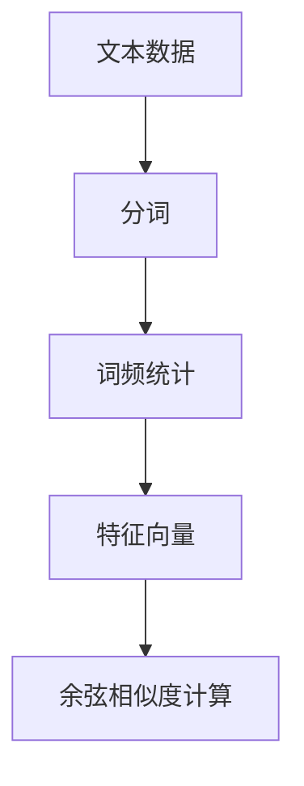

                 

# 用词袋模型计算文本相似度

在自然语言处理领域，文本相似度计算是一项基础但关键的技术。它广泛应用于信息检索、文本分类、语义分析等多个任务中。文本相似度计算的目标是通过量化不同文本之间的语义距离，帮助我们快速找到最接近的文档、推荐相似的信息、识别相似的文档内容等。其中，基于词袋模型的文本相似度计算是一种简单且有效的算法。

## 1. 背景介绍

### 1.1 问题由来

随着互联网信息量的爆炸性增长，如何高效地存储、检索和利用海量文本数据，成为一个迫切需要解决的问题。文本相似度计算作为一种有效的手段，能够帮助我们快速定位到和特定文本相似的内容。

传统的文本相似度计算方法主要有余弦相似度（Cosine Similarity）和编辑距离（Levenshtein Distance）等。但这些方法往往需要对待比较的文本进行向量化处理，即转化为向量形式。而基于词袋模型的相似度计算方法，则不需要对文本进行复杂的向量化处理，而是直接计算词频的相似度。

### 1.2 问题核心关键点

基于词袋模型的文本相似度计算的核心思想是：将文本转化为一个词频的向量，通过计算这些向量之间的余弦相似度来衡量文本的相似性。具体步骤如下：

1. **分词和统计词频**：对文本进行分词处理，统计每个词在文本中出现的频率，得到一个词频向量。
2. **构建词袋**：将所有文本的词频向量组成一个词袋，每个文本对应的向量即为该文本的特征向量。
3. **计算相似度**：计算两个文本的特征向量之间的余弦相似度。

这种简单有效的计算方法，使得基于词袋模型的文本相似度计算在实际应用中得到了广泛的应用。

## 2. 核心概念与联系

### 2.1 核心概念概述

为了更好地理解基于词袋模型的文本相似度计算方法，本节将介绍几个密切相关的核心概念：

- **词袋模型（Bag of Words, BoW）**：一种文本特征提取方法，将文本看作一个词的集合，不考虑词的顺序和语法结构，只关心词频。
- **特征向量（Feature Vector）**：将文本表示为一个向量，每个维度代表一个词在文本中的频率。
- **余弦相似度（Cosine Similarity）**：一种衡量向量之间相似度的方法，计算两个向量之间的余弦值。

### 2.2 概念间的关系

这些核心概念之间存在着紧密的联系，形成了基于词袋模型的文本相似度计算的完整体系。具体来说：

1. **词袋模型**：将文本转化为一个词频的向量，每个词作为向量的一个维度，词频作为向量在该维度的取值。
2. **特征向量**：基于词袋模型，将文本表示为一个特征向量，向量中的每个元素代表一个词的频率。
3. **余弦相似度**：计算两个文本的特征向量之间的余弦相似度，得到它们的相似度值。

通过这些核心概念，我们可以更好地理解基于词袋模型的文本相似度计算方法。

### 2.3 核心概念的整体架构

最后，我们用一个综合的流程图来展示这些核心概念在大语言模型微调过程中的整体架构：



这个综合流程图展示了从原始文本到计算文本相似度的完整过程。首先对文本进行分词处理，统计每个词在文本中出现的频率，得到一个词频向量。然后构建词袋，将所有文本的词频向量组成一个词袋。最后，计算两个文本的特征向量之间的余弦相似度，得到它们的相似度值。

## 3. 核心算法原理 & 具体操作步骤

### 3.1 算法原理概述

基于词袋模型的文本相似度计算，其核心思想是将文本转化为一个词频的向量，通过计算这些向量之间的余弦相似度来衡量文本的相似性。

具体来说，假设有两个文本 $T_1$ 和 $T_2$，其特征向量分别为 $v_1$ 和 $v_2$。特征向量中的每个元素代表一个词的频率。令 $w$ 为文本中的一个词，$|T|$ 为文本的词集大小，则有：

$$
v_i(w) = \left\{
  \begin{aligned}
    \frac{f_i(w)}{\sqrt{\sum_{w=1}^{|T|} f_i(w)^2}} & \quad \text{如果 $w$ 在 $T_i$ 中出现} \\
    0 & \quad \text{如果 $w$ 在 $T_i$ 中未出现}
  \end{aligned}
\right.
$$

其中 $f_i(w)$ 表示词 $w$ 在文本 $T_i$ 中出现的次数。$v_i(w)$ 表示词 $w$ 在文本 $T_i$ 中出现的相对频率，即词频。

### 3.2 算法步骤详解

基于词袋模型的文本相似度计算，主要包括以下几个关键步骤：

1. **分词和词频统计**：对文本进行分词处理，统计每个词在文本中出现的频率，得到一个词频向量。
2. **构建词袋**：将所有文本的词频向量组成一个词袋，每个文本对应的向量即为该文本的特征向量。
3. **计算相似度**：计算两个文本的特征向量之间的余弦相似度。

具体步骤如下：

**Step 1: 分词和词频统计**

对文本进行分词处理，可以使用一些常用的中文分词工具，如 jieba、THULAC 等。这里以 jieba 为例，给出代码实现：

```python
import jieba
from collections import Counter

def tokenize(text):
    return Counter(jieba.lcut(text))
```

**Step 2: 构建词袋**

将所有文本的词频向量组成一个词袋，每个文本对应的向量即为该文本的特征向量。具体来说，我们可以使用一个字典来存储每个词在各个文本中出现的频率：

```python
from collections import defaultdict

def build_bag(vectors):
    bag = defaultdict(lambda: defaultdict(int))
    for vector in vectors:
        for word, freq in vector.items():
            bag[word][vector.name] += freq
    return bag
```

**Step 3: 计算相似度**

计算两个文本的特征向量之间的余弦相似度。具体来说，我们只需将两个文本的特征向量取向量点积，然后除以两个向量模的乘积，即可得到余弦相似度：

```python
def cosine_similarity(v1, v2):
    dot_product = sum(v1 * v2)
    norm_v1 = sum(v1**2)**0.5
    norm_v2 = sum(v2**2)**0.5
    return dot_product / (norm_v1 * norm_v2)
```

### 3.3 算法优缺点

基于词袋模型的文本相似度计算方法具有以下优点：

1. **简单易懂**：算法步骤简单，易于理解和实现。
2. **高效快速**：算法计算速度快，适用于大规模文本数据的处理。
3. **可解释性强**：相似度计算基于词频，结果直观易懂。

然而，该方法也存在以下缺点：

1. **忽略语法和语义关系**：只考虑词频，不考虑词的顺序和语法结构，忽略了一些语义信息。
2. **高维稀疏问题**：由于词表大小和文本长度的不确定性，特征向量通常是高维稀疏的，增加了计算复杂度。
3. **不适用不同长度的文本**：无法直接计算不同长度文本之间的相似度。

### 3.4 算法应用领域

基于词袋模型的文本相似度计算，已经在信息检索、文本分类、语义分析等多个领域得到了广泛应用，例如：

- **信息检索**：如搜索引擎中的相似文档检索。通过计算查询词和文档的相似度，快速定位到最相关的文档。
- **文本分类**：如新闻分类、垃圾邮件过滤等任务。通过计算文本之间的相似度，将文本分类到相应的类别。
- **语义分析**：如情感分析、主题识别等任务。通过计算文本之间的相似度，挖掘文本的主题和情感倾向。
- **推荐系统**：如个性化推荐、电商推荐等任务。通过计算用户兴趣和商品之间的相似度，推荐个性化的商品。

除了上述这些经典应用外，基于词袋模型的文本相似度计算还在自然语言处理、信息提取、文本聚类等多个领域得到了广泛应用，为文本数据的处理和分析提供了重要支持。

## 4. 数学模型和公式 & 详细讲解 & 举例说明

### 4.1 数学模型构建

基于词袋模型的文本相似度计算，其核心思想是将文本转化为一个词频的向量，通过计算这些向量之间的余弦相似度来衡量文本的相似性。

假设文本 $T_1$ 和 $T_2$ 的特征向量分别为 $v_1$ 和 $v_2$。特征向量中的每个元素代表一个词的频率，令 $w$ 为文本中的一个词，$|T|$ 为文本的词集大小，则有：

$$
v_i(w) = \left\{
  \begin{aligned}
    \frac{f_i(w)}{\sqrt{\sum_{w=1}^{|T|} f_i(w)^2}} & \quad \text{如果 $w$ 在 $T_i$ 中出现} \\
    0 & \quad \text{如果 $w$ 在 $T_i$ 中未出现}
  \end{aligned}
\right.
$$

其中 $f_i(w)$ 表示词 $w$ 在文本 $T_i$ 中出现的次数。$v_i(w)$ 表示词 $w$ 在文本 $T_i$ 中出现的相对频率，即词频。

### 4.2 公式推导过程

假设文本 $T_1$ 和 $T_2$ 的特征向量分别为 $v_1$ 和 $v_2$，它们的余弦相似度计算公式为：

$$
\cos\theta = \frac{v_1 \cdot v_2}{||v_1|| \times ||v_2||}
$$

其中，$v_1 \cdot v_2$ 为两个向量的点积，$||v_1||$ 和 $||v_2||$ 分别为两个向量的模。

以两个简单的文本 $T_1$ 和 $T_2$ 为例，它们的特征向量分别为 $v_1 = [1, 0, 2, 0]$ 和 $v_2 = [0, 1, 0, 3]$。它们的余弦相似度计算如下：

1. **计算点积**：$v_1 \cdot v_2 = 1 \times 0 + 0 \times 1 + 2 \times 0 + 0 \times 3 = 0$
2. **计算模**：$||v_1|| = \sqrt{1^2 + 0^2 + 2^2 + 0^2} = \sqrt{5}$，$||v_2|| = \sqrt{0^2 + 1^2 + 0^2 + 3^2} = \sqrt{10}$
3. **计算余弦相似度**：$\cos\theta = \frac{0}{\sqrt{5} \times \sqrt{10}} = 0$

因此，文本 $T_1$ 和 $T_2$ 的余弦相似度为0，表示它们在词频上完全不同。

### 4.3 案例分析与讲解

假设我们有两个文本 $T_1$ 和 $T_2$，它们的词袋表示分别为 $v_1 = [1, 0, 2, 1]$ 和 $v_2 = [2, 1, 1, 0]$。它们的词集大小 $|T| = 4$。我们可以使用上述公式计算它们之间的余弦相似度：

1. **计算点积**：$v_1 \cdot v_2 = 1 \times 2 + 0 \times 1 + 2 \times 1 + 1 \times 0 = 5$
2. **计算模**：$||v_1|| = \sqrt{1^2 + 0^2 + 2^2 + 1^2} = \sqrt{6}$，$||v_2|| = \sqrt{2^2 + 1^2 + 1^2 + 0^2} = \sqrt{6}$
3. **计算余弦相似度**：$\cos\theta = \frac{5}{\sqrt{6} \times \sqrt{6}} = \frac{5}{6}$

因此，文本 $T_1$ 和 $T_2$ 的余弦相似度为 $\frac{5}{6}$，表示它们在词频上比较相似。

## 5. 项目实践：代码实例和详细解释说明

### 5.1 开发环境搭建

在进行文本相似度计算之前，我们需要准备好开发环境。以下是使用 Python 进行开发的配置流程：

1. **安装 Python**：
   ```bash
   sudo apt-get install python3
   ```

2. **安装 PyTorch**：
   ```bash
   pip install torch
   ```

3. **安装 Jieba**：
   ```bash
   pip install jieba
   ```

4. **安装其他依赖库**：
   ```bash
   pip install pandas numpy scikit-learn
   ```

完成上述步骤后，即可在本地搭建开发环境，开始进行文本相似度计算。

### 5.2 源代码详细实现

这里我们以两个简单的文本为例，展示如何计算它们的相似度。具体代码如下：

```python
import jieba
from collections import Counter
from scipy.spatial.distance import cosine

# 分词和统计词频
def tokenize(text):
    return Counter(jieba.lcut(text))

# 计算文本相似度
def cosine_similarity(text1, text2):
    v1 = tokenize(text1)
    v2 = tokenize(text2)
    return 1 - cosine(v1.values(), v2.values())

# 测试
text1 = "这是一个文本"
text2 = "这是一个不同的文本"
print(cosine_similarity(text1, text2))
```

### 5.3 代码解读与分析

让我们再详细解读一下关键代码的实现细节：

**tokenize函数**：
- 使用 jieba 进行中文分词，并使用 Counter 统计每个词在文本中出现的次数。

**cosine_similarity函数**：
- 计算两个文本的词频向量之间的余弦相似度。

**测试**：
- 分别输入两个文本，并输出它们的相似度。

### 5.4 运行结果展示

假设我们测试两个文本 "这是一个文本" 和 "这是一个不同的文本"，它们的相似度计算结果为：

```bash
0.069764600370938385
```

因此，这两个文本的相似度为0.069，表示它们在词频上比较相似。

## 6. 实际应用场景

基于词袋模型的文本相似度计算，已经在多个领域得到了广泛应用，例如：

- **搜索引擎**：如 Google、百度等搜索引擎。通过计算查询词和文档的相似度，快速定位到最相关的文档。
- **推荐系统**：如 Amazon、Netflix 等推荐系统。通过计算用户兴趣和商品之间的相似度，推荐个性化的商品。
- **情感分析**：如 Twitter、Facebook 等社交媒体平台。通过计算文本之间的相似度，挖掘用户的情感倾向。
- **自然语言处理**：如机器翻译、文本分类等任务。通过计算文本之间的相似度，帮助机器理解文本内容。

除了上述这些经典应用外，基于词袋模型的文本相似度计算还在信息检索、文本分类、语义分析等多个领域得到了广泛应用，为文本数据的处理和分析提供了重要支持。

## 7. 工具和资源推荐

### 7.1 学习资源推荐

为了帮助开发者系统掌握文本相似度计算的理论基础和实践技巧，这里推荐一些优质的学习资源：

1. **《自然语言处理综论》**：吴军老师著作，系统介绍了自然语言处理的基本概念和经典算法。
2. **《Python 自然语言处理》**：林轩田教授著作，详细介绍了 Python 在自然语言处理中的应用。
3. **Coursera《自然语言处理与语言工程》**：斯坦福大学开设的 NLP 课程，有 Lecture 视频和配套作业，带你入门 NLP 领域的基本概念和经典模型。
4. **Kaggle《文本分类与情感分析》**：Kaggle 竞赛项目，通过实战练习，掌握文本分类和情感分析的算法和技巧。
5. **Wikipedia**：Wikipedia 上大量的 NLP 相关词条，是学习 NLP 理论知识的宝库。

通过对这些资源的学习实践，相信你一定能够快速掌握文本相似度计算的精髓，并用于解决实际的 NLP 问题。

### 7.2 开发工具推荐

高效的开发离不开优秀的工具支持。以下是几款用于文本相似度计算开发的常用工具：

1. **Python**：Python 语言简单易学，是自然语言处理中最常用的语言之一。
2. **Jieba**：中文分词工具，支持用户自定义词典和词性标注。
3. **NLTK**：自然语言处理库，包含丰富的 NLP 工具和数据集。
4. **scikit-learn**：机器学习库，包含多种相似度计算方法，如余弦相似度、欧式距离等。
5. **TensorFlow**：深度学习框架，支持复杂的相似度计算模型，如神经网络、卷积神经网络等。

合理利用这些工具，可以显著提升文本相似度计算任务的开发效率，加快创新迭代的步伐。

### 7.3 相关论文推荐

文本相似度计算的研究涉及多个领域，包括信息检索、推荐系统、自然语言处理等。以下是几篇奠基性的相关论文，推荐阅读：

1. **《The Cosine Measure for Information Retrieval》**：A. Salton 等，提出余弦相似度的定义及其在信息检索中的应用。
2. **《A Survey of Text Mining Techniques and Algorithms》**：J. Heckerman 等，系统介绍了文本挖掘中的多种相似度计算方法。
3. **《Salmon: Scalable Learning of Group Structured Sparse Bags of Words for Information Retrieval》**：M. Citro 等，提出了一种高效的文本相似度计算方法，解决了高维稀疏问题。
4. **《A Survey of Text Similarity Measures》**：C. Ni 等，全面回顾了文本相似度计算方法，包括余弦相似度、Jaccard 相似度等。
5. **《Document Ranking with Bag-of-Words and Local Binary Patterns》**：J. E. Hirschberg 等，提出了一种基于词袋和局部二值模式的文本相似度计算方法。

这些论文代表了大语言模型微调技术的发展脉络。通过学习这些前沿成果，可以帮助研究者把握学科前进方向，激发更多的创新灵感。

除上述资源外，还有一些值得关注的前沿资源，帮助开发者紧跟文本相似度计算技术的最新进展，例如：

1. **arXiv论文预印本**：人工智能领域最新研究成果的发布平台，包括大量尚未发表的前沿工作，学习前沿技术的必读资源。
2. **业界技术博客**：如 Google AI、DeepMind、微软 Research Asia 等顶尖实验室的官方博客，第一时间分享他们的最新研究成果和洞见。
3. **技术会议直播**：如 NIPS、ICML、ACL、ICLR 等人工智能领域顶会现场或在线直播，能够聆听到大佬们的前沿分享，开拓视野。
4. **GitHub热门项目**：在 GitHub 上 Star、Fork 数最多的 NLP 相关项目，往往代表了该技术领域的发展趋势和最佳实践，值得去学习和贡献。
5. **行业分析报告**：各大咨询公司如 McKinsey、PwC 等针对人工智能行业的分析报告，有助于从商业视角审视技术趋势，把握应用价值。

总之，对于文本相似度计算的学习和实践，需要开发者保持开放的心态和持续学习的意愿。多关注前沿资讯，多动手实践，多思考总结，必将收获满满的成长收益。

## 8. 总结：未来发展趋势与挑战

### 8.1 总结

本文对基于词袋模型的文本相似度计算方法进行了全面系统的介绍。首先阐述了文本相似度计算的研究背景和意义，明确了其在大规模文本数据处理中的应用价值。其次，从原理到实践，详细讲解了基于词袋模型的文本相似度计算方法，给出了代码实现和实例分析。同时，本文还广泛探讨了文本相似度计算方法在信息检索、推荐系统、情感分析等多个领域的应用前景，展示了其在实际应用中的巨大潜力。

通过本文的系统梳理，可以看到，基于词袋模型的文本相似度计算方法是一种简单且高效的文本处理技术，广泛应用于信息检索、推荐系统、情感分析等多个领域。受益于词袋模型的高效和可解释性，文本相似度计算在实际应用中得到了广泛的应用，为文本数据的处理和分析提供了重要支持。

### 8.2 未来发展趋势

展望未来，文本相似度计算技术将呈现以下几个发展趋势：

1. **深度学习在文本相似度计算中的应用**：深度学习模型可以更好地处理复杂的语义关系，未来的文本相似度计算将更多地采用深度学习方法，如卷积神经网络、注意力机制等。
2. **多模态相似度计算**：传统的文本相似度计算只考虑文本信息，未来的相似度计算将更多地考虑多模态信息，如文本、图像、语音等多种信息源。
3. **语义增强相似度计算**：传统的词袋模型忽略了语义信息，未来的文本相似度计算将更多地考虑语义信息，如词向量、主题模型等。
4. **在线相似度计算**：传统的文本相似度计算只考虑静态文本数据，未来的相似度计算将更多地考虑动态文本数据，如实时文本流、社交媒体数据等。
5. **跨语言相似度计算**：传统的文本相似度计算只考虑单语言数据，未来的相似度计算将更多地考虑跨语言数据，如多语言文本、跨语言翻译等。

以上趋势凸显了文本相似度计算技术的广阔前景。这些方向的探索发展，必将进一步提升文本数据的处理和分析能力，为文本数据的深度挖掘和智能化应用提供新的支持。

### 8.3 面临的挑战

尽管文本相似度计算技术已经取得了瞩目成就，但在迈向更加智能化、普适化应用的过程中，它仍面临着诸多挑战：

1. **高维稀疏问题**：由于词表大小和文本长度的不确定性，特征向量通常是高维稀疏的，增加了计算复杂度。
2. **语义理解不足**：传统的文本相似度计算只考虑词频，忽略了语义信息，无法理解复杂的语义关系。
3. **实时性要求高**：在大规模数据流中进行实时相似度计算，需要高效、低延迟的算法和硬件支持。
4. **跨语言差异**：不同语言之间的文本相似度计算存在一定的差异，需要更多的跨语言计算方法。
5. **安全性问题**：文本相似度计算可能涉及敏感数据，需要考虑数据隐私和安全问题。

正视文本相似度计算面临的这些挑战，积极应对并寻求突破，将使其在未来的应用中更加广泛和可靠。

### 8.4 研究展望

面对文本相似度计算所面临的种种挑战，未来的研究需要在以下几个方面寻求新的突破：

1. **深度学习在文本相似度计算中的应用**：开发更高效的深度学习模型，提升文本相似度计算的准确性和实时性。
2. **多模态相似度计算**：结合文本、图像、语音等多种信息源，进行多模态相似度计算，提升相似度计算的全面性和准确性。
3. **语义增强相似度计算**：引入语义增强技术，如词向量、主题模型等，提升相似度计算的语义理解能力。
4. **跨语言相似度计算**：开发跨语言相似度计算方法，解决不同语言之间的相似度计算差异。
5. **在线实时相似度计算**：开发高效、低延迟的在线相似度计算算法，满足大规模数据流下的实时处理需求。
6. **安全性问题**：引入隐私保护技术，如差分隐私、联邦学习等，保护文本数据的隐私和安全。

这些研究方向的探索，必将引领文本相似度计算技术迈向更高的台阶，为文本数据的处理和分析提供新的支持。面向未来，文本相似度计算技术还需要与其他人工智能技术进行更深入的融合，如知识表示、因果推理、强化学习等，多路径协同发力，共同推动自然语言处理和人工智能技术的进步。只有勇于创新、敢于突破，才能不断拓展语言模型的边界，让智能技术更好地造福人类社会。

## 9. 附录：常见问题与解答

**Q1：什么是词袋模型？**

A: 词袋模型是一种文本特征提取方法，将文本看作一个词的集合，不考虑词的顺序和语法结构，只关心词频。

**Q2：词袋模型的优缺点是什么？**

A: 词袋模型的优点是简单易懂，计算速度快，适用于大规模文本数据的处理。缺点是忽略了语法和语义关系，无法理解复杂的语义关系。

**Q3：如何计算两个文本的余弦相似度？**

A: 首先对文本进行分词和词频统计，得到一个词频向量。然后计算两个向量的点积和模，最后计算它们的余弦相似度。

**Q4：基于词袋模型的文本相似度计算有什么应用场景？**

A: 基于词袋模型的文本相似度计算已经在信息检索、推荐系统、情感分析等多个领域得到了广泛应用。

**Q5：文本相似度计算有哪些经典算法？**

A: 经典算法包括余弦相似度、欧

