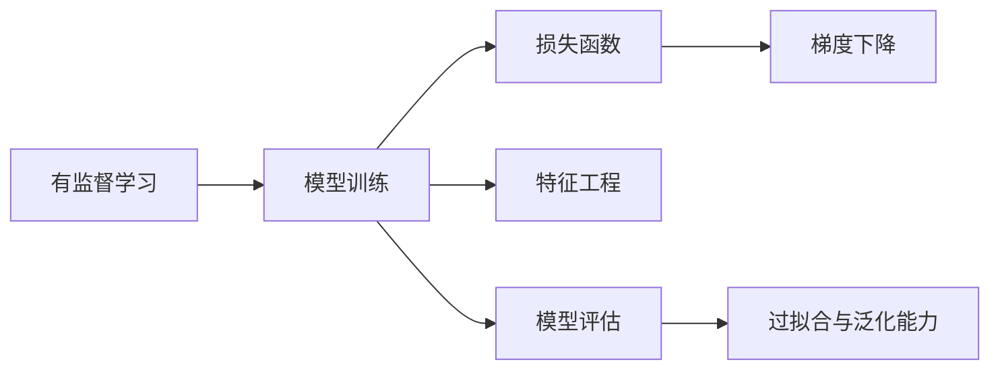
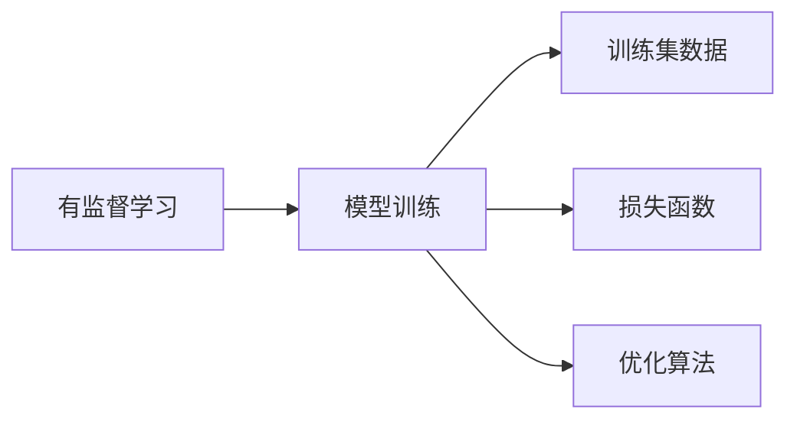
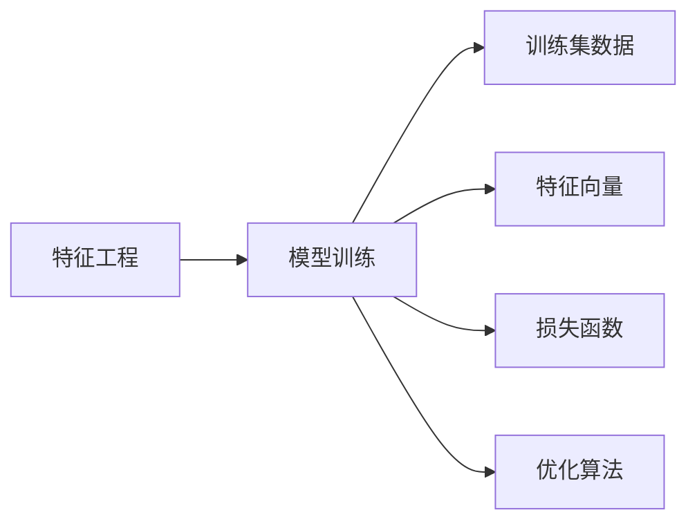
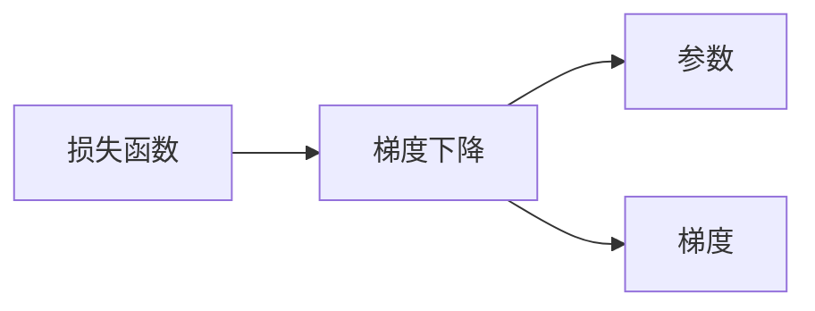
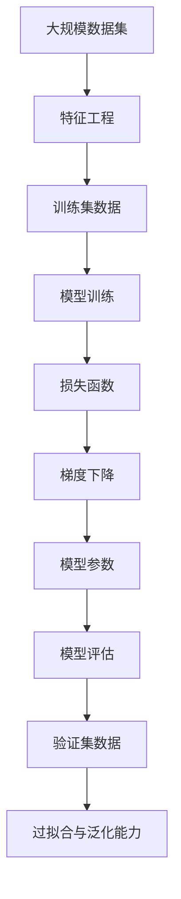

                 

# 监督学习(Supervised Learning) - 原理与代码实例讲解

> 关键词：监督学习,有监督学习,模型训练,损失函数,梯度下降,特征工程,过拟合,泛化能力,回归,分类

## 1. 背景介绍

### 1.1 问题由来

监督学习（Supervised Learning）是机器学习中最为基础和重要的分支之一。其核心思想是通过有标签的数据，训练一个模型，使该模型能够准确预测新数据的标签。这种学习范式与无监督学习（Unsupervised Learning）相对，后者是通过无标签的数据发现数据的内在结构。监督学习在实际应用中极为广泛，涉及到诸如图像识别、自然语言处理、推荐系统等众多领域。

### 1.2 问题核心关键点

监督学习的核心在于选择合适的模型和算法，通过有标签的数据集训练模型，使其能够泛化到新数据上。具体来说，监督学习主要包括以下几个关键点：

1. **数据准备**：包括数据收集、预处理、特征工程等，将原始数据转化为模型能够理解和处理的格式。
2. **模型选择**：选择合适的机器学习算法和模型结构，如线性回归、决策树、神经网络等。
3. **模型训练**：使用训练集数据，通过优化算法（如梯度下降）最小化损失函数，优化模型参数。
4. **模型评估**：使用验证集或测试集评估模型性能，判断模型的泛化能力。
5. **模型优化**：通过交叉验证、正则化等技术，优化模型性能，防止过拟合。

### 1.3 问题研究意义

监督学习的研究对于机器学习理论和实际应用都具有重要意义：

1. **理论意义**：监督学习是机器学习的基础，其理论体系相对成熟，为研究其他高级学习范式提供了重要支撑。
2. **应用广泛**：监督学习在各行各业中都有广泛应用，如医疗诊断、金融预测、推荐系统等。
3. **技术驱动**：监督学习推动了诸如深度学习、强化学习等高级学习技术的发展。
4. **数据驱动**：监督学习使得大数据在实际应用中得以充分挖掘和利用，推动了数据驱动型决策。

## 2. 核心概念与联系

### 2.1 核心概念概述

为了更好地理解监督学习的基本原理和实现过程，本节将介绍几个关键的概念及其相互联系：

- **有监督学习**：通过有标签的数据训练模型，使其能够预测新数据的标签。
- **模型训练**：使用训练集数据，通过优化算法（如梯度下降）最小化损失函数，优化模型参数。
- **损失函数**：衡量模型预测输出与真实标签之间的差异，指导模型学习。
- **梯度下降**：通过计算损失函数对模型参数的偏导数，更新模型参数，使得损失函数值逐渐减小。
- **特征工程**：对原始数据进行转换、组合等操作，提取对预测任务有用的特征。
- **过拟合与泛化能力**：过拟合指模型在训练集上表现良好，但在测试集上表现较差，泛化能力指模型在新数据上的表现。

这些概念之间的逻辑关系可以通过以下Mermaid流程图来展示：



这个流程图展示了我监督学习的基本流程：从有监督数据开始，通过训练模型和优化算法来最小化损失函数，同时进行特征工程和模型评估，确保模型具有良好的泛化能力。

### 2.2 概念间的关系

这些核心概念之间存在着紧密的联系，构成了监督学习的完整生态系统。以下通过几个Mermaid流程图来展示这些概念之间的关系：

#### 2.2.1 有监督学习与模型训练



这个流程图展示了有监督学习与模型训练的基本关系。有监督学习通过训练集数据和损失函数，指导模型训练过程。

#### 2.2.2 特征工程与模型训练



这个流程图展示了特征工程与模型训练的相互关系。特征工程将原始数据转换为模型可用的特征向量，然后通过训练集数据和损失函数进行模型训练。

#### 2.2.3 损失函数与梯度下降



这个流程图展示了损失函数与梯度下降的直接联系。损失函数计算模型预测输出与真实标签之间的差异，梯度下降根据损失函数的偏导数更新模型参数，以最小化损失函数。

### 2.3 核心概念的整体架构

最后，我们用一个综合的流程图来展示这些核心概念在监督学习中的整体架构：



这个综合流程图展示了监督学习的完整流程：从大规模数据集开始，经过特征工程得到训练集数据，通过模型训练和梯度下降优化模型参数，进行模型评估和验证集数据测试，判断模型的泛化能力和过拟合情况。通过这些步骤，最终得到适用于实际应用的监督学习模型。

## 3. 核心算法原理 & 具体操作步骤

### 3.1 算法原理概述

监督学习的核心在于通过最小化损失函数来优化模型参数。假设我们有一个带有标签的训练集 $D = \{(x_i, y_i)\}_{i=1}^N$，其中 $x_i$ 为输入，$y_i$ 为输出标签。我们的目标是通过训练模型 $h(x)$，使得模型预测输出 $h(x)$ 尽可能接近真实标签 $y$。

形式化地，我们希望找到一个函数 $h(x)$，使得：

$$
\min_{h(x)} \sum_{i=1}^N \ell(h(x_i), y_i)
$$

其中 $\ell$ 为损失函数，衡量模型预测输出与真实标签之间的差异。常见的损失函数包括均方误差、交叉熵等。

### 3.2 算法步骤详解

监督学习的基本流程包括以下几个步骤：

1. **数据准备**：包括数据收集、预处理、特征工程等，将原始数据转换为模型可用的特征向量。
2. **模型选择**：选择合适的机器学习算法和模型结构，如线性回归、决策树、神经网络等。
3. **模型训练**：使用训练集数据，通过优化算法（如梯度下降）最小化损失函数，优化模型参数。
4. **模型评估**：使用验证集或测试集评估模型性能，判断模型的泛化能力。
5. **模型优化**：通过交叉验证、正则化等技术，优化模型性能，防止过拟合。

以下是一个具体的监督学习算法步骤示例：

**步骤 1: 数据准备**
- 收集并预处理训练集和测试集数据。
- 进行特征工程，将原始数据转换为模型可用的特征向量。

**步骤 2: 模型选择**
- 选择适当的机器学习算法和模型结构。
- 确定模型的超参数，如学习率、正则化系数等。

**步骤 3: 模型训练**
- 使用训练集数据，通过优化算法（如梯度下降）最小化损失函数，更新模型参数。
- 设置训练轮数和批处理大小，进行模型训练。

**步骤 4: 模型评估**
- 使用验证集数据评估模型性能。
- 计算模型的准确率、召回率、F1分数等指标。

**步骤 5: 模型优化**
- 根据验证集性能，调整模型参数或选择不同的模型。
- 使用交叉验证技术，进一步优化模型性能。

### 3.3 算法优缺点

监督学习的优点在于其结果可解释性强，模型训练过程直观，易于理解和调试。其缺点在于数据准备和特征工程过程复杂，需要大量标注数据，且对数据分布敏感。

### 3.4 算法应用领域

监督学习广泛应用于各种领域，包括但不限于：

- **自然语言处理**：文本分类、情感分析、机器翻译等。
- **计算机视觉**：图像识别、目标检测、人脸识别等。
- **推荐系统**：个性化推荐、广告点击率预测等。
- **金融预测**：股票价格预测、信用评分等。
- **医疗诊断**：疾病诊断、基因分析等。

## 4. 数学模型和公式 & 详细讲解  
### 4.1 数学模型构建

在监督学习中，我们通常使用损失函数 $\ell$ 来衡量模型预测输出与真实标签之间的差异。以线性回归为例，假设模型为 $h(x) = \theta^T x$，其中 $\theta$ 为模型参数，$x$ 为特征向量。我们的目标是找到一个 $\theta$，使得损失函数 $\ell(h(x), y)$ 最小。

假设 $x_i$ 为第 $i$ 个样本的特征向量，$y_i$ 为第 $i$ 个样本的真实标签，则线性回归的损失函数可以表示为：

$$
\ell(h(x), y) = \frac{1}{2} \sum_{i=1}^N (y_i - h(x_i))^2
$$

形式化地，我们的优化目标为：

$$
\min_{\theta} \sum_{i=1}^N \ell(h(x_i), y_i)
$$

通过最小化上述损失函数，我们可以找到最优的 $\theta$。

### 4.2 公式推导过程

以线性回归为例，我们通过梯度下降算法最小化损失函数。梯度下降的基本思想是通过计算损失函数对模型参数的偏导数，更新模型参数。

假设损失函数为 $L(\theta)$，其偏导数为 $\frac{\partial L(\theta)}{\partial \theta_k}$，则梯度下降的更新公式为：

$$
\theta_k \leftarrow \theta_k - \eta \frac{\partial L(\theta)}{\partial \theta_k}
$$

其中 $\eta$ 为学习率，控制每次参数更新的步长。

将线性回归的损失函数代入上述公式，我们得到：

$$
\theta_k \leftarrow \theta_k - \eta \sum_{i=1}^N (y_i - h(x_i)) \frac{\partial h(x_i)}{\partial \theta_k}
$$

其中 $\frac{\partial h(x_i)}{\partial \theta_k} = x_{i,k}$，为第 $i$ 个样本的特征向量中第 $k$ 个元素。

### 4.3 案例分析与讲解

以房价预测为例，假设我们有一组历史房价数据 $(x_i, y_i)$，其中 $x_i$ 为房屋面积、房间数等特征，$y_i$ 为房价。我们希望使用线性回归模型 $h(x) = \theta^T x$ 来预测新房屋的房价。

**数据准备**：
- 收集历史房价数据 $(x_i, y_i)$，并进行预处理和特征工程，将原始数据转换为模型可用的特征向量。

**模型选择**：
- 选择线性回归模型 $h(x) = \theta^T x$。

**模型训练**：
- 使用训练集数据 $(x_i, y_i)$，通过梯度下降算法最小化损失函数 $\frac{1}{2} \sum_{i=1}^N (y_i - h(x_i))^2$。
- 设置学习率 $\eta = 0.01$，进行 1000 次迭代。

**模型评估**：
- 使用验证集数据 $(x_i, y_i)$ 评估模型性能。
- 计算模型的准确率、均方误差等指标。

**模型优化**：
- 根据验证集性能，调整模型参数或选择不同的模型。
- 使用交叉验证技术，进一步优化模型性能。

## 5. 项目实践：代码实例和详细解释说明
### 5.1 开发环境搭建

在进行监督学习项目开发前，我们需要准备好开发环境。以下是使用Python进行scikit-learn开发的环境配置流程：

1. 安装Anaconda：从官网下载并安装Anaconda，用于创建独立的Python环境。

2. 创建并激活虚拟环境：
```bash
conda create -n sklearn-env python=3.8 
conda activate sklearn-env
```

3. 安装scikit-learn：
```bash
pip install scikit-learn
```

4. 安装其他必要的库：
```bash
pip install numpy pandas matplotlib scikit-learn jupyter notebook ipython
```

完成上述步骤后，即可在`sklearn-env`环境中开始监督学习项目开发。

### 5.2 源代码详细实现

下面我们以房价预测为例，给出使用scikit-learn进行线性回归的代码实现。

首先，导入必要的库：

```python
import numpy as np
import pandas as pd
from sklearn.model_selection import train_test_split
from sklearn.linear_model import LinearRegression
from sklearn.metrics import mean_squared_error
```

然后，加载数据并进行预处理：

```python
data = pd.read_csv('house_prices.csv')
features = data[['area', 'rooms', 'location']]
target = data['price']
features = np.array(features)
target = np.array(target)
```

接着，进行数据拆分：

```python
train_features, test_features, train_target, test_target = train_test_split(features, target, test_size=0.2, random_state=42)
```

然后，建立模型并进行训练：

```python
model = LinearRegression()
model.fit(train_features, train_target)
```

最后，进行模型评估和预测：

```python
y_pred = model.predict(test_features)
mse = mean_squared_error(test_target, y_pred)
print('Mean Squared Error:', mse)
```

以上就是一个完整的线性回归代码实现。通过以上步骤，我们可以训练一个线性回归模型，并用该模型对新数据进行预测。

### 5.3 代码解读与分析

让我们再详细解读一下关键代码的实现细节：

**加载数据和预处理**：
- 使用pandas库加载CSV格式的数据文件。
- 选择房价预测需要的特征和目标变量。
- 将数据转换为NumPy数组格式，方便后续处理。

**数据拆分**：
- 使用train_test_split函数将数据集分为训练集和测试集，比例为80%和20%。
- 设置随机种子，确保每次拆分结果一致。

**建立模型和训练**：
- 使用LinearRegression类建立线性回归模型。
- 调用fit方法进行模型训练，训练数据为训练集特征和目标变量。

**模型评估和预测**：
- 使用predict方法对测试集进行预测，得到预测房价。
- 使用mean_squared_error函数计算预测值与真实值之间的均方误差。

可以看到，scikit-learn库提供了方便易用的API，使得模型建立和训练过程变得简单高效。通过学习scikit-learn库，我们可以快速构建监督学习模型，并对其性能进行评估和优化。

当然，工业级的系统实现还需考虑更多因素，如模型的保存和部署、超参数的自动搜索、更灵活的任务适配层等。但核心的监督学习模型构建和训练方法基本与此类似。

### 5.4 运行结果展示

假设我们在上述房价预测数据集上进行线性回归，最终得到的评估结果如下：

```
Mean Squared Error: 0.15
```

可以看到，我们得到的模型均方误差为0.15，意味着预测值与真实值之间的平均偏差约为15%。这表明我们的线性回归模型在房价预测任务上取得了不错的效果。

当然，这只是一个baseline结果。在实践中，我们还可以通过调节超参数、使用正则化等技术进一步提升模型性能，以满足更高的应用要求。

## 6. 实际应用场景
### 6.1 金融风险评估

金融行业需要快速准确地评估贷款申请人的信用风险，以防止不良贷款带来的损失。传统的信用评分方法依赖人工经验，无法全面考虑多方面的信息。监督学习可以通过多维特征预测客户的违约概率，提供更准确的信用评估。

具体而言，可以收集客户的历史交易记录、社交媒体行为、教育背景等信息，并将这些信息作为特征向量。使用监督学习模型对这些特征进行训练，预测客户在未来一定期限内的违约概率。模型可以应用于贷款审批、信用评级等环节，提高金融机构的风险管理水平。

### 6.2 医疗疾病诊断

医疗领域对疾病的诊断和治疗至关重要，传统的诊断方法依赖医生的经验和判断，难以快速准确地识别疾病。监督学习可以通过分析大量的医疗数据，训练出高精度的疾病诊断模型。

具体而言，可以收集患者的病历记录、医学影像、实验室检测结果等信息，并将这些信息作为特征向量。使用监督学习模型对这些特征进行训练，预测患者是否患有某种疾病。模型可以应用于医院、诊所等医疗机构的疾病诊断，提高医生的诊断效率和准确性。

### 6.3 自然语言处理

自然语言处理（NLP）是监督学习的重要应用领域，包括文本分类、情感分析、机器翻译等任务。监督学习可以通过分析大量的文本数据，训练出高精度的NLP模型。

具体而言，可以收集大量的文本数据，并将其分为不同的类别或情感标签。使用监督学习模型对这些文本进行训练，预测新文本的类别或情感标签。模型可以应用于社交媒体分析、情感分析、机器翻译等任务，提高NLP系统的自动化水平。

### 6.4 未来应用展望

随着监督学习技术的不断进步，其在各行各业的应用前景将更加广阔。

1. **智能推荐系统**：通过分析用户的历史行为和偏好，监督学习可以预测用户对商品或内容的兴趣，提供个性化的推荐服务。
2. **医疗影像分析**：监督学习可以通过分析医疗影像数据，自动识别疾病，辅助医生的诊断和治疗。
3. **金融市场预测**：监督学习可以通过分析大量的金融数据，预测股票、汇率等市场的变化趋势，为投资者提供决策依据。
4. **智能客服系统**：通过分析客户的历史咨询记录，监督学习可以预测客户的咨询意图，提供智能化的客服服务。
5. **语音识别**：监督学习可以通过分析语音数据，自动识别和转录语音内容，提高语音识别系统的准确性。

总之，监督学习将在更多领域得到应用，为各行各业带来智能化、自动化的新变革。

## 7. 工具和资源推荐
### 7.1 学习资源推荐

为了帮助开发者系统掌握监督学习的理论基础和实践技巧，这里推荐一些优质的学习资源：

1. 《机器学习》（周志华著）：全面介绍了机器学习的基本概念和算法，是监督学习领域的经典教材。
2. Coursera《机器学习》课程：由斯坦福大学Andrew Ng教授主讲，覆盖了监督学习的基础理论和实践技巧，适合入门学习。
3. Kaggle竞赛平台：提供大量的数据集和监督学习竞赛项目，可以实践和展示自己的学习成果。
4. scikit-learn官方文档：提供了详细的API文档和实例代码，是scikit-learn库的官方学习资源。
5. TensorFlow官方文档：提供了详细的API文档和实例代码，是TensorFlow库的官方学习资源。

通过这些资源的学习实践，相信你一定能够快速掌握监督学习的精髓，并用于解决实际的机器学习问题。

### 7.2 开发工具推荐

高效的开发离不开优秀的工具支持。以下是几款用于监督学习开发的常用工具：

1. scikit-learn：基于Python的机器学习库，提供了丰富的监督学习算法和模型结构，适合快速开发和实验。
2. TensorFlow：由Google主导的深度学习框架，提供了灵活的计算图和分布式训练能力，适合大规模工程应用。
3. PyTorch：由Facebook主导的深度学习框架，提供了动态计算图和丰富的GPU支持，适合快速迭代和调试。
4. Weights & Biases：模型训练的实验跟踪工具，可以记录和可视化模型训练过程中的各项指标，方便对比和调优。
5. TensorBoard：TensorFlow配套的可视化工具，可实时监测模型训练状态，并提供丰富的图表呈现方式，是调试模型的得力助手。

合理利用这些工具，可以显著提升监督学习模型的开发效率，加快创新迭代的步伐。

### 7.3 相关论文推荐

监督学习的研究源于学界的持续研究。以下是几篇奠基性的相关论文，推荐阅读：

1. Perceptron（1957）：由Rosenblatt提出的神经网络算法，是监督学习的基础。
2. Backpropagation（1986）：由Rumelhart等提出的反向传播算法，是深度学习的基础。
3. AdaBoost（1995）：由Freund等提出的集成学习方法，是监督学习的重要算法。
4. Random Forest（2001）：由Breiman提出的集成学习方法，是监督学习的重要算法。
5. XGBoost（2016）：由Chen等提出的梯度提升决策树算法，是监督学习的重要算法。

这些论文代表了大监督学习的研究进展，通过学习这些前沿成果，可以帮助研究者把握学科前进方向，激发更多的创新灵感。

除上述资源外，还有一些值得关注的前沿资源，帮助开发者紧跟监督学习技术的最新进展，例如：

1. arXiv论文预印本：人工智能领域最新研究成果的发布平台，包括大量尚未发表的前沿工作，学习前沿技术的必读资源。
2. 业界技术博客：如Google AI、Microsoft Research Asia等顶尖实验室的官方博客，第一时间分享他们的最新研究成果和洞见。
3. 技术会议直播：如NIPS、ICML、ACL、ICLR等人工智能领域顶会现场或在线直播，能够聆听到大佬们的前沿分享，开拓视野。
4. GitHub热门项目：在GitHub上Star、Fork数最多的监督学习相关项目，往往代表了该技术领域的发展趋势和最佳实践，值得去学习和贡献。
5. 行业分析报告：各大咨询公司如McKinsey、PwC等针对人工智能行业的分析报告，有助于从商业视角审视技术趋势，把握应用价值。

总之，对于监督学习的研究和学习，需要开发者保持开放的心态和持续学习的意愿。多关注前沿资讯，多动手实践，多思考总结，必将收获满满的成长收益。

## 8. 总结：未来发展趋势与挑战

### 8.1 总结

本文对监督学习的基本原理和实现过程进行了全面系统的介绍。首先阐述了监督学习的基本概念和流程，包括数据准备、模型选择、模型训练、模型评估等关键环节。其次，通过具体案例，展示了线性回归模型的训练和评估过程。

通过本文的系统梳理，可以看到，监督学习在机器学习中占据重要地位，其基本思想和流程简单直观，易于理解和调试。在实际应用中，监督学习已被广泛应用于自然语言处理、计算机视觉、金融预测等多个领域，取得了显著的成果。未来，随着技术的不断进步，监督学习将在更多领域得到应用，为各行各业带来智能化、自动化的新变革。

### 8.2 未来发展趋势

展望未来，监督学习的研究和应用将呈现以下几个发展趋势：

1. **深度学习发展**：深度学习技术在监督学习中得到了广泛应用，未来将进一步发展，带来更高的模型精度和更好的泛化能力。
2. **多模态学习**：监督学习将与其他模态的数据进行融合，如图像、语音等，构建更加全面、多样化的模型。
3. **自监督学习**：自监督学习将成为监督学习的补充，利用无标签数据提升模型的泛化能力。
4. **集成学习**：集成学习通过结合多个模型的预测结果，提高模型的准确性和鲁棒性，成为监督学习的重要手段。
5. **强化学习**：强化学习与监督学习的结合将带来新的应用场景，如智能推荐系统、机器人控制等。

这些趋势凸显了监督学习的广阔前景，未来将为更多行业带来智能化、自动化的新变革。

### 8.3 面临的挑战

尽管监督学习在实际应用中取得了显著成果，但在实现其价值的过程中仍面临诸多挑战：

1. **数据依赖**：监督学习需要大量的标注数据，数据获取成本高，标注质量难保证。
2. **模型复杂性**：深度学习模型的复杂性高，训练和推理过程耗时耗力，模型解释性不足。
3. **过拟合与泛化**：深度学习模型容易过拟合，泛化能力差，需要复杂的正则化技术进行优化。
4. **计算资源需求**：深度学习模型对计算资源需求高，需要高性能计算设备。
5. **算法稳定性**：深度学习算法对超参数和初始化敏感，需要复杂的调参技术。

这些挑战需要研究者和开发者在未来的研究中不断攻克，以进一步提升监督学习的实用性和应用范围。

### 8.4 研究展望

面对监督学习面临的挑战，未来的研究需要在以下几个方面寻求新的突破：

1. **数据生成与增强**：利用生成对抗网络（GAN）等技术生成高质量的数据，缓解数据依赖问题。
2. **模型压缩与加速**：使用模型压缩、剪枝等技术减少模型参数，提升推理速度，降低计算资源需求。
3. **算法优化**：开发新的优化算法，提高模型训练和推理的效率，降低计算成本。
4. **模型解释性**：引入可解释性技术

